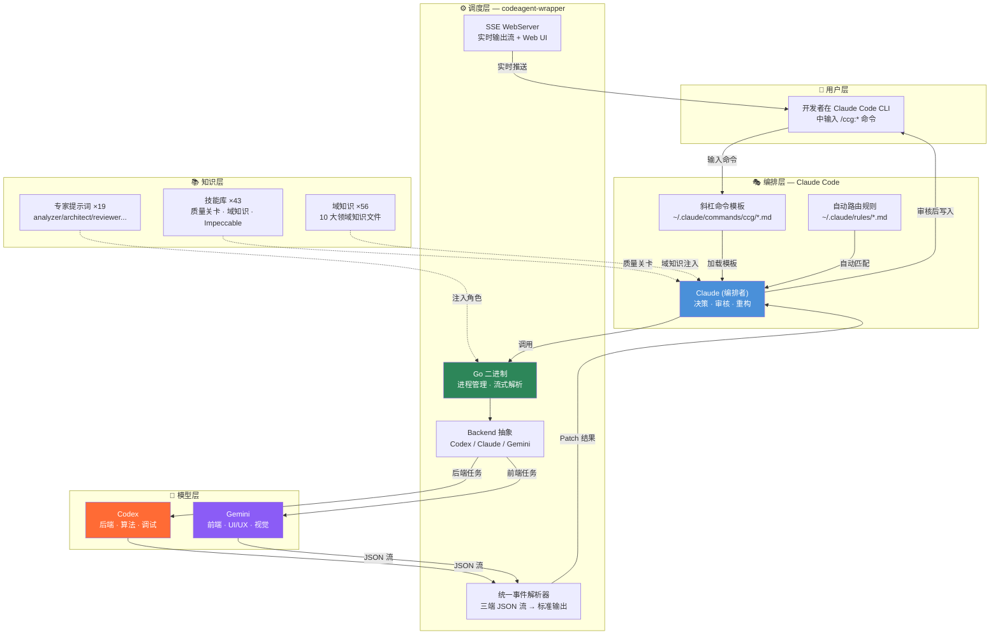

**CCG**（Claude + Codex + Gemini）是一个开源的多模型协作开发系统，核心理念是让三个各有所长的 AI 模型像一支专业团队一样协同工作：**Claude Code** 负责编排决策与代码审核，**Codex** 主攻后端逻辑，**Gemini** 擅长前端任务。通过 29+ 个斜杠命令和智能路由机制，实现从需求分析到代码交付的全流程自动化协作。当前版本为 `v2.1.14`，以 MIT 协议开源。

Sources: [package.json](package.json#L1-L10), [README.md](README.md#L1-L57)

---

## 核心架构一览

在深入各子系统之前，先从宏观视角理解 CCG 的整体架构。系统采用**三层编排**设计——用户通过 Claude Code CLI 输入斜杠命令，Claude 作为编排者将任务智能分发到 Codex（后端）和 Gemini（前端），外部模型的结果以 **Patch** 形式返回，经 Claude 审核后才写入文件。这一「**外部模型零写入**」的安全模型是整个系统的设计基石。



Sources: [README.md](README.md#L41-L56), [src/utils/config.ts](src/utils/config.ts#L77-L95), [codeagent-wrapper/backend.go](codeagent-wrapper/backend.go#L10-L17)

---

## 三大模型的角色分工

CCG 的核心价值在于**让每个模型做它最擅长的事**。下表清晰展示了三个模型在系统中的角色定位和信任等级：

| 模型 | 角色定位 | 核心职责 | 文件写入权限 | 信任等级 |
|------|---------|---------|------------|---------|
| **Claude Code** | 编排者 | 决策调度、计划整合、代码重构、最终审核 | ✅ 有 | 最高 |
| **Codex** | 后端专家 | 后端逻辑、算法实现、性能调优、安全审计 | ❌ 无（仅返回 Patch） | 后端权威 |
| **Gemini** | 前端专家 | UI/UX 设计、视觉实现、组件开发、体验优化 | ❌ 无（仅返回 Patch） | 前端权威 |

这种分工并非硬编码，而是通过**模型路由配置**实现的。用户可以自由调整前后端的主力模型，例如将前端任务也交由 Codex 处理。默认配置下，前端走 Gemini、后端走 Codex、代码审查双模型并行。路由策略支持 `parallel`（并行）、`fallback`（降级）和 `round-robin`（轮询）三种模式。

Sources: [src/types/index.ts](src/types/index.ts#L4-L31), [src/utils/config.ts](src/utils/config.ts#L77-L95), [templates/commands/workflow.md](templates/commands/workflow.md#L26-L29)

---

## 技术栈全景

CCG 是一个**双语言项目**，安装器和命令系统使用 TypeScript，进程调度引擎使用 Go。这种选择各有考量——TypeScript 生态与 Claude Code CLI 自然亲和，Go 则提供了可靠的跨平台进程管理和流式解析能力。

| 层次 | 技术 | 说明 |
|------|------|------|
| **CLI 入口** | TypeScript + `cac` | 命令行参数解析与交互式菜单 |
| **安装器流水线** | TypeScript + `fs-extra` | 模板变量注入、文件部署、二进制下载 |
| **配置系统** | TOML (`smol-toml`) | 配置文件存储于 `~/.claude/.ccg/config.toml` |
| **进程调度** | Go (`codeagent-wrapper`) | 跨平台二进制，管理 Codex/Gemini/Claude 子进程 |
| **流式解析** | Go | 统一解析三种后端的 JSON 流输出 |
| **实时推送** | Go SSE WebServer | 可选的 Web UI 实时输出查看 |
| **测试** | Vitest (TS) + Go testing | 双语言测试覆盖 |
| **文档** | VitePress | 项目文档站点 |

Sources: [package.json](package.json#L84-L94), [codeagent-wrapper/main.go](codeagent-wrapper/main.go#L16-L32), [src/utils/config.ts](src/utils/config.ts#L8-L10)

---

## 项目目录结构

理解目录结构是掌握 CCG 架构的快捷方式。项目根目录下的内容按职责分为四个核心区域：

```
ccg-workflow/
├── src/                        # TypeScript 源码 — CLI 与安装器
│   ├── cli.ts                  # 入口：cac 命令行框架
│   ├── cli-setup.ts            # 命令注册（init / menu / config / diagnose）
│   ├── commands/               # CLI 子命令实现
│   │   ├── init.ts             # 核心安装流程入口
│   │   ├── menu.ts             # 交互式主菜单
│   │   ├── config-mcp.ts       # MCP 工具配置
│   │   └── diagnose-mcp.ts     # MCP 诊断与修复
│   ├── utils/                  # 工具函数（系统核心逻辑）
│   │   ├── installer.ts        # 安装流水线（命令/提示词/技能/二进制）
│   │   ├── installer-data.ts   # 29+ 命令注册表
│   │   ├── installer-template.ts # 模板变量注入引擎
│   │   ├── skill-registry.ts   # SKILL.md frontmatter 解析与命令生成
│   │   ├── config.ts           # TOML 配置读写
│   │   ├── mcp.ts              # MCP 服务管理
│   │   └── migration.ts        # 版本迁移
│   ├── i18n/                   # 国际化（中英双语）
│   └── types/                  # TypeScript 类型定义
│
├── codeagent-wrapper/          # Go 源码 — 进程调度引擎
│   ├── main.go                 # 入口：模式路由（单任务 / 并行 / 清理）
│   ├── backend.go              # Backend 接口：Codex / Claude / Gemini 三实现
│   ├── executor.go             # 进程生命周期管理、会话复用、超时控制
│   ├── parser.go               # 流式 JSON 解析器（统一三端事件）
│   ├── server.go               # SSE WebServer（实时输出推送）
│   ├── config.go               # 运行时配置解析
│   └── *_test.go               # Go 单元/集成/压力测试
│
├── templates/                  # 模板文件（安装时部署到 ~/.claude/）
│   ├── commands/               # 36 个斜杠命令模板（.md）
│   ├── prompts/                # 19 个专家角色提示词
│   │   ├── codex/              # Codex 角色：6 个（analyzer/architect/debugger/optimizer/reviewer/tester）
│   │   ├── gemini/             # Gemini 角色：7 个（+frontend）
│   │   └── claude/             # Claude 角色：6 个
│   ├── skills/                 # 43 个技能（SKILL.md 驱动）
│   │   ├── tools/              # 质量关卡工具（verify-security/quality/change/module, gen-docs）
│   │   ├── domains/            # 10 大域知识（56 个 .md 文件）
│   │   ├── impeccable/         # 20 个 UI/UX 精打磨技能
│   │   ├── orchestration/      # 多智能体协调
│   │   └── scrapling/          # 网页抓取技能
│   ├── output-styles/          # 8 种输出风格（工程师/深渊/猫又/大小姐...）
│   └── rules/                  # 自动路由规则（技能路由 + 域知识触发）
│
├── bin/ccg.mjs                 # npm bin 入口
├── docs/                       # VitePress 文档站点
└── .agents/skills/             # OPSX (OpenSpec) 技能集成
```

Sources: [package.json](package.json#L21-L71), [src/index.ts](src/index.ts#L1-L34), [templates/skills/SKILL.md](templates/skills/SKILL.md#L13-L26)

---

## 核心子系统速览

CCG 由六个核心子系统协同运作，每个子系统在后续文档中都有专门的深入解析页面。以下概要帮助你快速建立全局认知：

### 1. 命令系统（29+ 斜杠命令）

命令是用户与 CCG 交互的唯一入口。所有命令以 `/ccg:*` 格式在 Claude Code CLI 中调用，覆盖四大场景：**开发工作流**（workflow、plan、execute、feat...）、**分析与质量**（analyze、debug、review...）、**Git 工具**（commit、rollback...）和**规范驱动**（spec-init、spec-research...）。命令本质是 Markdown 模板文件，安装时通过变量注入引擎将 `{{FRONTEND_PRIMARY}}`、`{{BACKEND_PRIMARY}}` 等占位符替换为用户配置的实际模型名称。

→ 详见 [斜杠命令体系：29+ 命令分类与模板结构](8-xie-gang-ming-ling-ti-xi-29-ming-ling-fen-lei-yu-mo-ban-jie-gou)

Sources: [src/utils/installer-data.ts](src/utils/installer-data.ts#L41-L78), [templates/commands/workflow.md](templates/commands/workflow.md#L1-L10)

### 2. codeagent-wrapper（Go 进程调度引擎）

这是系统的**运行时核心**——一个 Go 编译的跨平台二进制，负责启动和管理 Codex/Gemini/Claude 子进程。它实现了统一的 `Backend` 接口抽象，让三种后端的差异对上层命令透明。核心能力包括：流式 JSON 输出解析（将三端不同格式统一为标准事件流）、会话复用（通过 `resume` 机制保持上下文）、超时控制（默认 2 小时）、并行任务执行（`--parallel` 模式下拓扑排序 + 并发调度）和可选的 SSE WebServer 实时推送。

→ 详见 [codeagent-wrapper 二进制：Go 进程管理与多后端调用](6-codeagent-wrapper-er-jin-zhi-go-jin-cheng-guan-li-yu-duo-hou-duan-diao-yong)

Sources: [codeagent-wrapper/main.go](codeagent-wrapper/main.go#L120-L180), [codeagent-wrapper/backend.go](codeagent-wrapper/backend.go#L10-L17)

### 3. 安装器流水线

`npx ccg-workflow` 触发的是一条精心设计的安装流水线，依次完成七大步骤：命令文件部署 → Agent 文件部署 → 专家提示词部署 → 技能文件部署 → Skill Registry 自动命令生成 → 路由规则部署 → codeagent-wrapper 二进制下载。每一步都支持模板变量注入和路径替换，确保安装结果与用户的模型路由配置完全一致。

→ 详见 [安装器流水线：从模板变量注入到文件部署的完整链路](7-an-zhuang-qi-liu-shui-xian-cong-mo-ban-bian-liang-zhu-ru-dao-wen-jian-bu-shu-de-wan-zheng-lian-lu)

Sources: [src/utils/installer.ts](src/utils/installer.ts#L659-L738)

### 4. 技能与知识系统

CCG 内建了一个丰富的知识体系，由三层结构组成：**专家提示词**（19 个角色 .md 文件，为不同后端的专业场景提供行为约束）、**质量关卡工具**（5 个自动化验证技能，按规则链自动触发）、**域知识秘典**（10 大领域 56 个知识文件，通过关键词自动路由加载）。此外还有 20 个 Impeccable UI/UX 精打磨技能和 Skill Registry 自动发现机制。

→ 详见 [Skill Registry 机制：SKILL.md Frontmatter 驱动的自动命令生成](13-skill-registry-ji-zhi-skill-md-frontmatter-qu-dong-de-zi-dong-ming-ling-sheng-cheng)

Sources: [templates/skills/SKILL.md](templates/skills/SKILL.md#L39-L57), [templates/rules/ccg-skill-routing.md](templates/rules/ccg-skill-routing.md#L1-L10)

### 5. 配置系统

CCG 使用 TOML 格式存储全局配置（`~/.claude/.ccg/config.toml`），涵盖语言偏好、模型路由、工作流列表、MCP 工具和性能选项。配置在安装时生成，支持运行时修改。模型路由的默认值为前端 Gemini + 后端 Codex + 审查双模型并行，协作模式默认为 `smart`（智能调度）。

→ 详见 [配置系统：TOML 配置文件结构与路由设置](19-pei-zhi-xi-tong-toml-pei-zhi-wen-jian-jie-gou-yu-lu-you-she-zhi)

Sources: [src/utils/config.ts](src/utils/config.ts#L43-L95)

### 6. MCP 工具集成

CCG 支持多种 MCP（Model Context Protocol）代码检索工具的集成，包括 ace-tool（Augment 官方/中转）、ace-tool-rs（轻量替代）、ContextWeaver（本地向量库 + Rerank）和 fast-context（Windsurf 语义搜索）。MCP 工具的配置可自动同步到 Codex 和 Gemini 的 MCP 设置中。

→ 详见 [MCP 工具集成：ace-tool、ContextWeaver、fast-context 配置与同步](18-mcp-gong-ju-ji-cheng-ace-tool-contextweaver-fast-context-pei-zhi-yu-tong-bu)

Sources: [src/utils/installer-mcp.ts](src/utils/installer-mcp.ts#L26-L38)

---

## 安装后的文件布局

运行 `npx ccg-workflow` 完成安装后，用户主目录下的 `.claude/` 目录会生成以下结构。理解这个布局有助于排查问题和自定义配置：

```
~/.claude/
├── .ccg/
│   ├── config.toml              # 全局配置（路由、语言、MCP...）
│   ├── prompts/                 # 专家角色提示词
│   │   ├── codex/               # Codex 角色提示词（6 个）
│   │   ├── gemini/              # Gemini 角色提示词（7 个）
│   │   └── claude/              # Claude 角色提示词（6 个）
│   └── backup/                  # 配置备份目录
├── commands/ccg/                # 斜杠命令（36 个 .md 模板）
├── agents/ccg/                  # Agent 模板
├── skills/ccg/                  # 技能库（43 个 SKILL.md）
│   ├── tools/                   # 质量关卡工具
│   ├── domains/                 # 域知识（10 大领域）
│   ├── impeccable/              # UI/UX 精打磨（20 个）
│   └── ...
├── rules/                       # 自动路由规则
└── bin/
    └── codeagent-wrapper        # Go 二进制（进程调度引擎）
```

Sources: [src/utils/config.ts](src/utils/config.ts#L60-L74), [src/utils/installer.ts](src/utils/installer.ts#L712-L724)

---

## 关键设计决策

CCG 的架构中有几个值得理解的设计决策，它们直接影响系统的安全性、可靠性和用户体验：

**安全模型 — 外部模型零写入**：Codex 和 Gemini 的子进程在工作目录中没有任何写入权限。它们仅以只读方式分析代码，将修改建议以 Patch 形式通过标准输出返回。Claude 审核后才实际写入文件。这一机制从根本上避免了外部模型产生不可控修改的风险。

**会话复用（Session Resume）**：codeagent-wrapper 支持会话复用——每次调用后端模型都会返回一个 `SESSION_ID`，后续阶段通过 `resume <SESSION_ID>` 复用上下文。这意味着在整个六阶段工作流中，Codex 和 Gemini 可以「记住」之前的分析结果，避免重复劳动。

**模板变量注入**：所有命令模板使用 `{{BACKEND_PRIMARY}}`、`{{FRONTEND_PRIMARY}}`、`{{WORKDIR}}` 等占位符。安装时由变量注入引擎统一替换，确保无论用户如何配置路由，命令内容都与之匹配。

**双源二进制下载**：codeagent-wrapper 二进制优先从 Cloudflare CDN 下载（对中国用户友好），失败后降级到 GitHub Release。下载支持 curl（自动读取代理环境变量）和 Node.js fetch 双重降级。

Sources: [templates/commands/workflow.md](templates/commands/workflow.md#L82-L83), [src/utils/installer.ts](src/utils/installer.ts#L92-L99), [README.md](README.md#L36-L38)

---

## 推荐阅读路径

作为入门指南的第一页，以下是建议的阅读顺序，帮助你从概览逐步深入到每个子系统：

**第一步 — 动手安装**：[快速开始：安装与初始化](2-kuai-su-kai-shi-an-zhuang-yu-chu-shi-hua) → [依赖环境准备](3-yi-lai-huan-jing-zhun-bei-node-js-jq-claude-code-codex-gemini-cli)

**第二步 — 理解架构**：[整体架构设计](4-zheng-ti-jia-gou-she-ji-claude-bian-pai-codex-hou-duan-gemini-qian-duan) → [模型路由机制](5-mo-xing-lu-you-ji-zhi-qian-duan-hou-duan-mo-xing-pei-zhi-yu-zhi-neng-diao-du) → [codeagent-wrapper 二进制](6-codeagent-wrapper-er-jin-zhi-go-jin-cheng-guan-li-yu-duo-hou-duan-diao-yong)

**第三步 — 掌握命令**：[斜杠命令体系](8-xie-gang-ming-ling-ti-xi-29-ming-ling-fen-lei-yu-mo-ban-jie-gou) → [六阶段开发工作流](9-liu-jie-duan-kai-fa-gong-zuo-liu-ccg-workflow) → [规划与执行分离模式](10-gui-hua-yu-zhi-xing-fen-chi-mo-shi-ccg-plan-ccg-execute)

**第四步 — 按需深入**：根据你的关注点选择对应的深入解析页面，如 Go 二进制内部实现、测试体系、或贡献指南。