**规划与执行分离模式**是 CCG 多模型协作系统中最精细的控制模式。它将一次完整的开发任务拆解为两个独立阶段：`/ccg:plan` 专注生成结构化实施计划，`/ccg:execute` 负责根据计划获取原型并落地实施。两个阶段通过 `.claude/plan/*.md` 计划文件和 `SESSION_ID` 会话标识符实现上下文传递，用户在计划阶段获得完全的审查和修改权，只有在满意后才手动触发执行。

Sources: [plan.md](templates/commands/plan.md#L1-L258), [execute.md](templates/commands/execute.md#L1-L316)

## 架构总览：两阶段协作链路

整个分离模式的设计围绕一个核心原则：**规划者不实施，实施者不规划**。`/ccg:plan` 在结束时会硬性终止，绝对禁止自动调用 `/ccg:execute`；而 `/ccg:execute` 启动时必须先验证用户已对计划明确确认。

```mermaid
sequenceDiagram
    participant User as 用户
    participant Claude as Claude (编排)
    participant Wrapper as codeagent-wrapper
    participant Codex as Codex (后端)
    participant Gemini as Gemini (前端)
    participant FS as .claude/plan/

    rect rgb(30, 60, 90)
        Note over User,FS: /ccg:plan 阶段
        User->>Claude: /ccg:plan 实现用户认证
        Claude->>Claude: Phase 1: Prompt 增强 + MCP 上下文检索
        par 并行分析
            Claude->>Wrapper: codeagent-wrapper --backend codex
            Wrapper->>Codex: analyzer.md 角色分析
            Codex-->>Wrapper: 技术可行性 + 方案
        and
            Claude->>Wrapper: codeagent-wrapper --backend gemini
            Wrapper->>Gemini: analyzer.md 角色分析
            Gemini-->>Wrapper: UI/UX 可行性 + 方案
        end
        Wrapper-->>Claude: 交叉验证 + 综合规划
        Claude->>FS: 保存计划 (含 SESSION_ID)
        Claude->>User: 展示计划 + 提示执行命令
        Note over Claude: 🛑 硬性终止，不进入执行
    end

    rect rgb(90, 30, 30)
        Note over User,FS: /ccg:execute 阶段（用户手动触发）
        User->>Claude: /ccg:execute .claude/plan/user-auth.md
        Claude->>FS: 读取计划 + SESSION_ID
        Claude->>Claude: Phase 1: MCP 快速检索上下文
        par 并行获取原型
            Claude->>Wrapper: resume CODEX_SESSION (architect.md)
            Wrapper->>Codex: Unified Diff Patch
        and
            Claude->>Wrapper: resume GEMINI_SESSION (frontend.md)
            Wrapper->>Gemini: Unified Diff Patch
        end
        Wrapper-->>Claude: 脏原型输出
        Claude->>Claude: Phase 4: 重构 + 应用变更
        par 并行审计
            Claude->>Wrapper: reviewer.md (后端审查)
            Wrapper->>Codex: 安全/性能/逻辑审查
        and
            Claude->>Wrapper: reviewer.md (前端审查)
            Wrapper->>Gemini: 可访问性/一致性审查
        end
        Wrapper-->>Claude: 审计报告
        Claude->>User: ✅ 交付确认
    end
```



上图展示了从 `/ccg:plan` 到 `/ccg:execute` 的完整生命周期。关键设计点在于两个阶段之间通过计划文件和 `SESSION_ID` 形成松耦合的桥梁——用户甚至可以在不同会话中分别执行这两个命令。

Sources: [plan.md](templates/commands/plan.md#L69-L186), [execute.md](templates/commands/execute.md#L111-L316)

## 与一体化工作流的定位对比

CCG 提供了三种执行模式，适用于不同场景。理解它们的差异是选择正确模式的前提：

| 维度 | `/ccg:workflow` | `/ccg:plan` → `/ccg:execute` | `/ccg:codex-exec` |
|------|----------------|-------------------------------|-------------------|
| **阶段数** | 6 阶段（研究→构思→计划→执行→优化→评审） | 2 阶段（规划 2 Phase + 执行 5 Phase） | 1 阶段（直接执行） |
| **阶段间切换** | 自动流转 | 手动触发执行 | 无阶段切换 |
| **用户控制粒度** | 每阶段确认 | 计划完成后完全审查 | 一次性确认 |
| **会话连续性** | 单会话内完成 | 跨会话支持 | 单会话 |
| **适用场景** | 标准开发任务 | 高风险/复杂架构变更 | 明确的编码任务 |
| **上下文保持** | 会话内隐式保持 | SESSION_ID 显式传递 | 无跨模型上下文 |

**选择指南**：当任务涉及架构决策、多模块联动、或需要团队评审时，使用规划与执行分离模式；当需求明确且变更范围可控时，[六阶段开发工作流（/ccg:workflow）](9-liu-jie-duan-kai-fa-gong-zuo-liu-ccg-workflow)更高效；当只需要 Codex 快速实现时，[Codex 全权执行模式（/ccg:codex-exec）](11-codex-quan-quan-zhi-xing-mo-shi-ccg-codex/exec)最直接。

Sources: [workflow.md](templates/commands/workflow.md#L1-L189), [plan.md](templates/commands/plan.md#L1-L18), [execute.md](templates/commands/execute.md#L1-L17)

## `/ccg:plan`：多模型协作规划详解

### 核心协议与硬约束

`/ccg:plan` 在模板中定义了五条不可违反的核心协议，这些约束确保规划阶段的纯粹性：**语言协议**要求工具/模型交互用英语、用户交互用中文；**强制并行**要求所有后端/前端模型调用必须使用 `run_in_background: true`；**代码主权**确保外部模型对文件系统零写入权限；**止损机制**要求当前阶段输出通过验证前不进入下一阶段；最关键的**仅规划约束**明确禁止修改产品代码，只允许写入 `.claude/plan/*` 目录。

Sources: [plan.md](templates/commands/plan.md#L11-L17)

### Phase 1：上下文全量检索

规划的第一个阶段是信息收集，包含四个顺序步骤：

**1.1 Prompt 增强**——系统首先调用 `/ccg:enhance` 的逻辑对用户输入 `$ARGUMENTS` 进行结构化增强，分析意图、补全缺失信息、揭示隐含假设，将模糊的原始需求转化为包含明确目标、技术约束、范围边界和验收标准的结构化描述。增强后的结果将替代原始参数用于后续所有阶段。

**1.2 上下文检索**——通过 MCP 搜索工具（如 `ace-tool` 的 `mcp__ace-tool__search_context`）执行语义查询，获取项目中与需求相关的代码上下文。若 MCP 不可用，则回退到 Glob + Grep 进行文件发现和关键符号定位。

**1.3 完整性检查**——确保获取了相关类、函数、变量的完整定义与签名，上下文不足时触发递归检索。

**1.4 需求对齐**——若需求仍有模糊空间，系统必须向用户输出引导性问题列表，直至需求边界清晰。

Sources: [plan.md](templates/commands/plan.md#L72-L107), [enhance.md](templates/commands/enhance.md#L1-L65)

### Phase 2：多模型协作分析与规划

这是规划的核心阶段，通过四步实现双视角的深度分析：

**2.1 并行分发**——系统将原始需求（不带预设观点）同时分发给后端模型和前端模型。后端模型使用 `analyzer.md` 角色提示词关注技术可行性、架构影响、性能考量和潜在风险；前端模型同样使用 `analyzer.md` 角色关注 UI/UX 影响、用户体验和视觉设计。两者返回的都是多角度解决方案加优劣势分析。

**2.2 交叉验证**——Claude 整合两方分析结果，识别一致观点（强信号）和分歧点（需权衡），按"后端逻辑以后端模型为准，前端设计以前端模型为准"的信任规则进行互补。

**2.3 计划草案（可选）**——为进一步降低遗漏风险，可并行让两个模型分别使用 `architect.md` 角色输出计划草案，后端关注数据流/边界条件/错误处理/测试策略，前端关注信息架构/交互/可访问性/视觉一致性。

**2.4 生成实施计划**——Claude 综合双方分析生成最终版 Step-by-step 实施计划，包含任务类型（前端/后端/全栈）、技术方案、实施步骤、关键文件表格、风险缓解措施，以及最关键的 **SESSION_ID 字段**。

Sources: [plan.md](templates/commands/plan.md#L108-L186)

### 计划交付与硬性终止

`/ccg:plan` 的结束流程是其与 `/ccg:workflow` 的根本区别。规划完成后系统执行四个动作：向用户展示完整实施计划；将计划保存至 `.claude/plan/<功能名>.md`；以加粗文本输出提示，包含执行命令 `/ccg:execute .claude/plan/实际功能名.md`；然后**立即终止当前回复**。

模板中明确列出了四条绝对禁止行为：不问 Y/N 然后自动执行、不对产品代码进行任何写操作、不自动调用 `/ccg:execute`、不在用户未要求时继续触发模型调用。如果用户要求修改计划，系统会根据反馈调整内容、更新文件版本（如 `-v2.md`、`-v3.md`）、重新展示后再次提示审查。

Sources: [plan.md](templates/commands/plan.md#L187-L258)

## `/ccg:execute`：多模型协作执行详解

### Phase 0：读取计划与前置校验

执行阶段的启动比规划更谨慎。系统首先识别输入类型——是计划文件路径（如 `.claude/plan/xxx.md`）还是直接的任务描述。如果是计划文件，系统会读取并解析任务类型、实施步骤、关键文件和 SESSION_ID。如果是直接任务描述或计划中缺失关键信息，系统必须先向用户确认补全。

一个关键的校验点是：如果系统无法确认用户已对计划回复 "Y"，必须二次询问确认后才能进入后续阶段。这确保了规划的审查机制不会被绕过。

Sources: [execute.md](templates/commands/execute.md#L115-L138)

### 任务路由机制

`/ccg:execute` 根据计划中的任务类型进行智能路由：

| 任务类型 | 判断依据 | 路由目标 | 使用提示词 |
|----------|----------|----------|-----------|
| **前端** | 页面、组件、UI、样式、布局 | FRONTEND_PRIMARY（如 Gemini） | `frontend.md` |
| **后端** | API、接口、数据库、逻辑、算法 | BACKEND_PRIMARY（如 Codex） | `architect.md` |
| **全栈** | 同时包含前后端 | 两者并行 | 分别使用对应提示词 |

路由决定了后续原型获取的调用路径和会话复用策略。

Sources: [execute.md](templates/commands/execute.md#L131-L137)

### Phase 1：上下文快速检索

与规划阶段的全量检索不同，执行阶段的检索更加聚焦——严格根据计划中"关键文件"列表构建语义查询，目标是在最短时间内获取实施所需的完整上下文。系统**禁止**使用 Bash + find/ls 手动探索项目结构，必须使用 MCP 工具快速定位。

Sources: [execute.md](templates/commands/execute.md#L141-L166)

### Phase 3：原型获取（脏原型策略）

这是执行阶段的核心创新点。外部模型返回的 Unified Diff Patch 被视为**"脏原型"**，而非最终代码。三条路由各有侧重：

- **Route A（前端）**：前端模型使用 `frontend.md` 角色生成原型，其 CSS/React/Vue 输出被视为**视觉基准**，但 Claude 会忽略前端模型对后端逻辑的建议
- **Route B（后端）**：后端模型使用 `architect.md` 角色生成原型，利用其逻辑运算与 Debug 能力
- **Route C（全栈）**：并行调用两者，各自使用计划中对应的 SESSION_ID 进行 `resume`

所有外部模型的输出格式被严格限定为 `Unified Diff Patch ONLY. Strictly prohibit any actual modifications.`——这确保了外部模型不会直接修改文件系统。

Sources: [execute.md](templates/commands/execute.md#L169-L202)

### Phase 4：Claude 编码实施（代码主权）

Claude 作为唯一的**代码主权者**执行以下五个步骤：

1. **读取 Diff**——解析外部模型返回的 Unified Diff Patch
2. **思维沙箱**——模拟应用 Diff 到目标文件，检查逻辑一致性，识别潜在冲突或副作用
3. **重构清理**——将"脏原型"重构为高可读、高可维护、企业发布级代码，去除冗余代码，确保符合项目现有规范，非必要不生成注释
4. **最小作用域**——变更仅限需求范围，强制审查是否引入副作用
5. **应用变更**——使用 Edit/Write 工具执行实际修改，仅修改必要代码

重构环节是整个系统的质量保障核心。外部模型的原型可能包含冗余逻辑、不规范的命名、或与项目现有风格不一致的写法，Claude 必须将其清洗为生产级代码后再写入文件系统。

Sources: [execute.md](templates/commands/execute.md#L206-L236)

### Phase 5：强制审计与交付

变更生效后，系统强制并行调用后端模型和前端模型进行 Code Review，分别使用 `reviewer.md` 角色提示词。后端审查关注安全性、性能、错误处理和逻辑正确性；前端审查关注可访问性、设计一致性和用户体验。

审计发现的问题按信任规则处理：后端问题以后端模型的判断为准，前端问题以前端模型的判断为准。修复后按需重复审计循环，直到风险可接受。最终交付时向用户报告变更摘要表格、双模型审计结果和后续建议。

Sources: [execute.md](templates/commands/execute.md#L239-L295)

## SESSION_ID：跨阶段的上下文桥梁

SESSION_ID 是规划与执行分离模式中最精巧的设计。`codeagent-wrapper` 在每次模型调用时从 JSON 事件流中提取 session 标识符——Codex/Claude 使用 `session_id`（snake_case），Gemini 使用 `sessionId`（camelCase），解析器通过 `GetSessionID()` 方法统一处理两种格式。

当 `/ccg:execute` 使用 `resume <SESSION_ID>` 调用模型时，wrapper 会构建包含 `resume` 子命令的参数列表，将先前规划阶段建立的完整上下文（包括项目结构理解、需求分析、已讨论的方案权衡）带入执行阶段。这意味着执行阶段的外部模型不需要重新理解需求背景，可以直接基于已达成共识的方案生成实施原型。

计划文件中通过两个字段传递会话信息：`CODEX_SESSION` 和 `GEMINI_SESSION`，分别对应后端和前端模型的会话标识。若计划中缺失 SESSION_ID，执行阶段会创建新会话（降级为无上下文复用模式）。

Sources: [main.go](codeagent-wrapper/main.go#L489-L491), [parser.go](codeagent-wrapper/parser.go#L95-L102), [executor.go](codeagent-wrapper/executor.go#L757-L799), [plan.md](templates/commands/plan.md#L182-L184)

## 模板变量注入机制

计划模板和执行模板中的 `{{BACKEND_PRIMARY}}`、`{{FRONTEND_PRIMARY}}`、`{{MCP_SEARCH_TOOL}}` 等占位符并非运行时解析，而是在 CCG 安装时通过 `injectConfigVariables()` 函数一次性注入。这意味着用户的配置决定了模板中模型路由的实际值：

| 模板变量 | 注入来源 | 默认值 |
|----------|----------|--------|
| `{{BACKEND_PRIMARY}}` | `config.routing.backend.primary` | `codex` |
| `{{FRONTEND_PRIMARY}}` | `config.routing.frontend.primary` | `gemini` |
| `{{MCP_SEARCH_TOOL}}` | MCP 提供商注册表 | `mcp__ace-tool__search_context` |
| `{{GEMINI_MODEL_FLAG}}` | `config.routing.geminiModel` | `--gemini-model gemini-3.1-pro-preview` |
| `{{LITE_MODE_FLAG}}` | `config.performance.liteMode` | （空） |

路径变量（如 `~/.claude/bin/codeagent-wrapper`）也通过 `replaceHomePathsInTemplate()` 在安装时替换为绝对路径，确保跨平台兼容性。

Sources: [installer-template.ts](src/utils/installer-template.ts#L64-L134), [installer-template.ts](src/utils/installer-template.ts#L144-L178)

## 角色提示词体系

规划与执行模式使用了三组角色提示词，分别对应分析、实施和审查三个工作阶段：

| 阶段 | 后端模型 | 前端模型 | 职责边界 |
|------|---------|---------|---------|
| **分析** | `analyzer.md` | `analyzer.md` | 多角度方案 + 优劣势分析 |
| **规划/实施** | `architect.md` | `architect.md` + `frontend.md` | 后端架构设计 / 前端组件设计 |
| **审查** | `reviewer.md` | `reviewer.md` | 安全/性能 vs 可访问性/一致性 |

每个角色提示词都定义了 `ZERO file system write permission` 的硬约束，并通过结构化的响应模板（Problem Analysis → Options → Recommendation → Action Items）确保输出格式一致。`architect.md` 角色额外要求输出 Unified Diff Patch 格式，并包含架构决策的理由陈述。

Sources: [analyzer.md](templates/prompts/codex/analyzer.md#L1-L59), [architect.md](templates/prompts/codex/architect.md#L1-L55), [architect.md](templates/prompts/gemini/architect.md#L1-L56), [plan.md](templates/commands/plan.md#L46-L52), [execute.md](templates/commands/execute.md#L87-L92)

## 完整使用示例

以下是使用规划与执行分离模式完成"实现用户认证功能"的完整流程：

**Step 1：规划**
```bash
/ccg:plan 为 Web 应用添加基于 JWT 的用户认证功能，支持登录、注册和 token 刷新
```
系统执行 Prompt 增强、MCP 上下文检索、双模型并行分析、交叉验证后，生成计划文件 `.claude/plan/user-auth.md`，包含完整的技术方案、实施步骤、关键文件列表、风险缓解和 SESSION_ID。

**Step 2：审查与修改（可选）**
用户可以要求修改计划中的任何部分，系统会更新文件并重新展示。迭代版本保存为 `.claude/plan/user-auth-v2.md`。

**Step 3：执行**
```bash
/ccg:execute .claude/plan/user-auth.md
```
系统读取计划、复用 SESSION_ID、并行获取原型、Claude 重构实施、双模型审计后交付最终代码变更。

Sources: [plan.md](templates/commands/plan.md#L240-L258), [execute.md](templates/commands/execute.md#L299-L316)

## 错误处理与容错机制

分离模式在两个层面实现了健壮的容错设计：

**模型调用层面**——前端模型失败必须重试最多 2 次（间隔 5 秒），仅当 3 次全部失败时才跳过并降级为单模型结果。后端模型的执行时间通常较长（5-15 分钟），属于正常范围，TaskOutput 超时后必须继续轮询，绝对禁止跳过。若因等待时间过长导致跳过，系统必须通过 `AskUserQuestion` 询问用户选择继续等待还是终止。

**阶段流转层面**——止损机制确保当前阶段输出通过验证前不进入下一阶段。规划阶段的完整性检查会触发递归检索，直到上下文充足；执行阶段的前置条件校验会阻止未经审查的计划被执行。

Sources: [plan.md](templates/commands/plan.md#L55-L67), [execute.md](templates/commands/execute.md#L96-L107)

## 下一步阅读

- 了解一体化的六阶段工作流，参见 [六阶段开发工作流（/ccg:workflow）](9-liu-jie-duan-kai-fa-gong-zuo-liu-ccg-workflow)
- 了解 Codex 单模型快速执行模式，参见 [Codex 全权执行模式（/ccg:codex-exec）](11-codex-quan-quan-zhi-xing-mo-shi-ccg-codex-exec)
- 了解多模型并行调用的底层实现，参见 [codeagent-wrapper 二进制：Go 进程管理与多后端调用](6-codeagent-wrapper-er-jin-zhi-go-jin-cheng-guan-li-yu-duo-hou-duan-diao-yong)
- 了解角色提示词的完整体系，参见 [专家提示词体系：13 个角色提示词（Codex 6 + Gemini 7）](14-zhuan-jia-ti-shi-ci-ti-xi-13-ge-jiao-se-ti-shi-ci-codex-6-gemini-7)