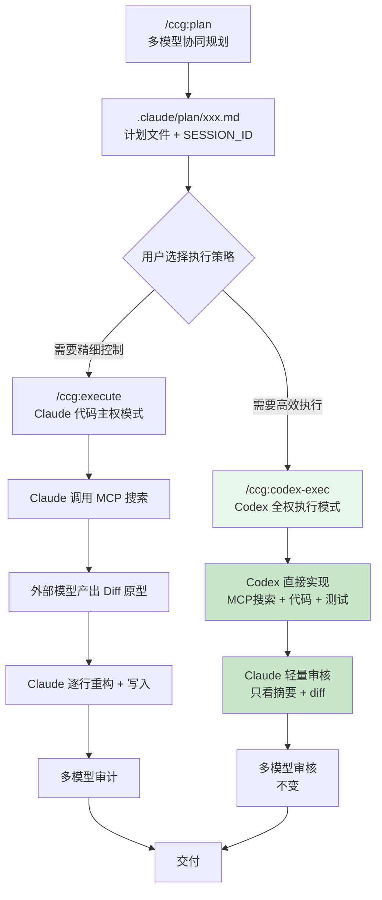
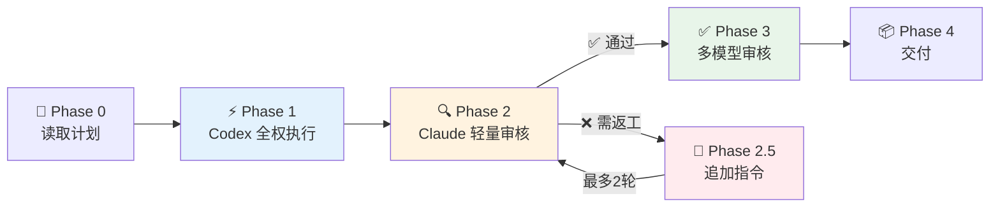
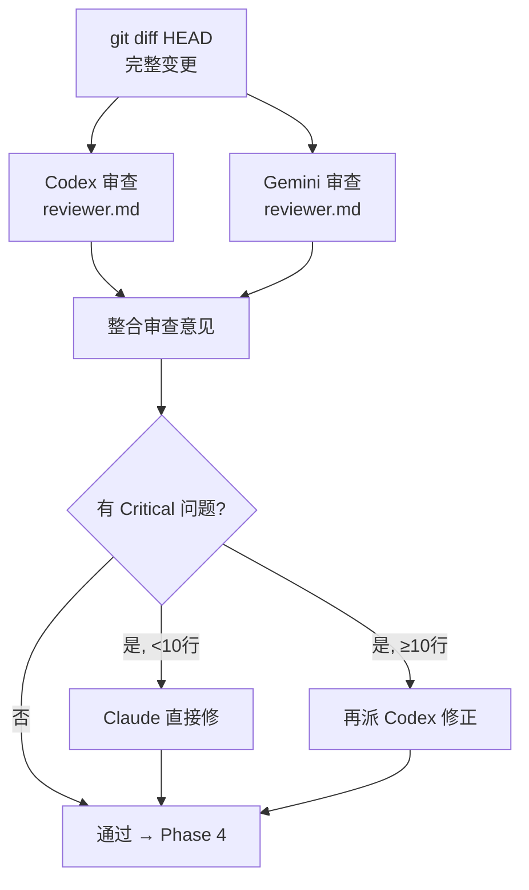

`/ccg:codex-exec` 是 CCG 命令体系中一种**高效执行策略**——将 `/ccg:plan` 产出的实施计划直接交给后端模型（默认 Codex）自主完成全部工程任务（上下文搜索、代码实现、测试验证），Claude 仅承担轻量审核和最终交付协调。与 [规划与执行分离模式（/ccg:plan → /ccg:execute）](10-gui-hua-yu-zhi-xing-fen-chi-mo-shi-ccg-plan-ccg-execute) 相比，本模式的核心目标是**将 Claude 的 token 消耗降到极低**，同时通过多模型交叉审核保障代码质量。

Sources: [codex-exec.md](templates/commands/codex-exec.md#L1-L32)

## 设计动机：为何需要"Codex 全权"

在标准的 `/ccg:execute` 流程中，Claude 作为"代码主权者"承担了全部中间工作：调用 MCP 搜索上下文 → 读取外部模型的 Diff 原型 → 逐行重构为生产级代码 → 执行文件写入。这意味着 Claude 的上下文窗口中充斥着大量搜索结果和原始 Diff，token 消耗极高。

`/ccg:codex-exec` 重新分配了职责边界：**将"脏活累活"全部交给 Codex，Claude 只看摘要和最终 diff**。这种设计在以下场景中尤为有效：

- **后端逻辑密集型任务**（API 开发、数据库操作、算法实现），Codex 的逻辑推理能力可信赖
- **大范围代码变更**，Claude 重构 Diff 成本过高
- **Token 预算有限**，需要最大化利用外部模型的能力

Sources: [codex-exec.md](templates/commands/codex-exec.md#L23-L31), [execute.md](templates/commands/execute.md#L206-L236)

## 架构定位：与 Plan/Execute 的关系

`/ccg:codex-exec` 与 `/ccg:execute` 是**并列的执行策略**，共享同一个计划输入源 `/ccg:plan`，但执行路径截然不同：



两种模式的核心差异如下表所示：

| 维度 | `/ccg:execute` | `/ccg:codex-exec` |
|------|---------------|-------------------|
| **代码实现者** | Claude 重构 Codex/Gemini 的 Diff | **Codex 直接实现** |
| **MCP 搜索** | Claude 调用 MCP | **Codex 调用 MCP** |
| **Claude 上下文负载** | 高（搜索结果 + 代码全量进入） | **极低（只看摘要 + diff）** |
| **Claude Token 消耗** | 大量消耗 | **极少消耗** |
| **代码质量保障** | 多模型审查（不变） | **多模型审查（不变）** |
| **适用场景** | 需要精细控制的复杂重构 | 高效执行标准开发任务 |
| **返工策略** | Claude 重新重构 Diff | Codex 复用会话修正 |

Sources: [codex-exec.md](templates/commands/codex-exec.md#L23-L31)

## 五阶段执行工作流

`/ccg:codex-exec` 的执行流程分为五个阶段，每个阶段都有明确的职责边界和质量门控：



Sources: [codex-exec.md](templates/commands/codex-exec.md#L124-L378)

### Phase 0：读取计划

`[模式：准备]`

本阶段负责从 `/ccg:plan` 的产出中提取执行所需信息：

1. **识别输入类型**：接受计划文件路径（如 `.claude/plan/xxx.md`）或直接任务描述。若为后者，会提示用户先执行 `/ccg:plan`
2. **解析计划内容**，提取任务类型、技术方案、实施步骤、关键文件列表以及 `SESSION_ID`（`CODEX_SESSION` / `GEMINI_SESSION`）
3. **执行前确认**：向用户展示计划摘要（任务名称、步骤数、关键文件数），确认后进入执行阶段

Sources: [codex-exec.md](templates/commands/codex-exec.md#L128-L159)

### Phase 1：Codex 全权执行（核心阶段）

`[模式：执行]`

这是整个模式的**核心创新**——将计划转化为 Codex 结构化指令，**一次性下发**，让 Codex 自主完成全部工程任务。通过 `codeagent-wrapper` 以 `--backend codex` 模式调用，Codex 获得 `--dangerously-bypass-approvals-and-sandbox` 标志授权，可以直接读写文件系统。

下发给 Codex 的 `<TASK>` 指令包含三个明确的执行步骤：

| 步骤 | 职责 | 关键行为 |
|------|------|----------|
| **Step 1: Context Verification** | 上下文自验证 | 使用 `ace-tool MCP (search_context)` 搜索现有代码模式；读取计划中的关键文件；通过 `context7 MCP` 查询外部库文档 |
| **Step 2: Implementation** | 按计划实现代码 | 按步骤顺序实施；遵循项目现有代码规范；处理边界情况和错误；保持最小变更范围 |
| **Step 3: Self-Verification** | 自检验证 | 运行 lint/typecheck；运行测试套件；验证无回归 |

Codex 完成后会返回结构化报告，包含 `CONTEXT_GATHERED`（搜索发现）、`CHANGES_MADE`（文件变更明细）、`VERIFICATION_RESULTS`（测试结果）和 `REMAINING_ISSUES`（遗留问题）四个部分。

**会话复用机制**：如果 `/ccg:plan` 产出了 `CODEX_SESSION`，Phase 1 会通过 `resume <SESSION_ID>` 复用该会话，Codex 可以直接延续规划阶段的上下文理解，无需重新分析项目结构。

Sources: [codex-exec.md](templates/commands/codex-exec.md#L162-L234), [executor.go](codeagent-wrapper/executor.go#L757-L798)

### Phase 2：Claude 轻量审核

`[模式：审核]`

Claude 在此阶段只做**最小验证**，绝不重复 Codex 已完成的工作：

1. **读取 Codex 报告**：解析四段式结构化报告
2. **查看实际变更**：通过 `git diff HEAD` 查看真实代码变更
3. **快速判定**，进入三条分支：
   - ✅ **通过** → 变更在计划范围内、无安全/逻辑问题、测试通过 → 进入 Phase 3
   - ⚠️ **小问题** → 不超过 10 行的修正，Claude 直接修复 → 进入 Phase 3
   - ❌ **需返工** → 进入 Phase 2.5 追加指令

Sources: [codex-exec.md](templates/commands/codex-exec.md#L237-L259)

### Phase 2.5：追加指令（条件触发）

`[模式：追加]`

仅在 Phase 2 判定为"需返工"时触发。Claude 复用 Codex 的 `CODEX_EXEC_SESSION`，将具体问题描述和修正要求作为追加指令下发。**最多 2 轮返工**，超过后 Claude 直接接管修复，避免无限循环。

Sources: [codex-exec.md](templates/commands/codex-exec.md#L262-L291)

### Phase 3：多模型审核

`[模式：审核]`

此阶段与 `/ccg:execute` 的审核机制完全一致——**并行调用 Codex 和 Gemini 交叉审查**，保证质量不受执行策略影响：



审核结果按**信任规则**整合：后端问题以 Codex 的判断为准，前端问题以 Gemini 的判断为准。问题按严重级别分为三级：

| 级别 | 处理策略 |
|------|----------|
| **Critical** | 必须修复：< 10 行 Claude 直接修，≥ 10 行再派 Codex |
| **Warning** | 建议修复，报告给用户决定 |
| **Info** | 记录不处理 |

Sources: [codex-exec.md](templates/commands/codex-exec.md#L295-L331), [reviewer.md](templates/prompts/codex/reviewer.md#L1-L73)

### Phase 4：交付

`[模式：交付]`

向用户报告完整执行结果，包含执行摘要（模式、MCP 使用情况、变更规模、测试结果、返工轮次）、变更清单、审核结果和后续建议。

Sources: [codex-exec.md](templates/commands/codex-exec.md#L334-L367)

## 底层机制：codeagent-wrapper 如何赋能 Codex 全权

`/ccg:codex-exec` 之所以能让 Codex "全权执行"，核心在于 `codeagent-wrapper` Go 二进制在启动 Codex CLI 时注入了 `--dangerously-bypass-approvals-and-sandbox` 标志，这赋予了 Codex 对文件系统的**完整读写权限**，使其能够自主创建、修改文件并执行命令。

```
codeagent-wrapper --progress --backend codex resume <SESSION_ID> - "<WORKDIR>" <<'EXEC_EOF'
<TASK>
  ...完整计划指令...
</TASK>
EXEC_EOF
```

在 `buildCodexArgs` 函数中，这个标志的注入是**默认行为**——除非用户显式设置了 `CODEX_REQUIRE_APPROVAL=true` 环境变量。同时，`--skip-git-repo-check` 标志也默认注入，避免 Git 仓库检查阻碍执行。这意味着 Codex 在 `codex-exec` 模式下获得了与人类开发者几乎等价的操作权限。

Sources: [executor.go](codeagent-wrapper/executor.go#L772-L798), [main.go](codeagent-wrapper/main.go#L24-L25)

## 七条关键规则

模板中定义了七条硬性规则，确保全权执行模式在高效运转的同时不失控：

| # | 规则 | 说明 |
|---|------|------|
| 1 | **Claude 极简原则** | Claude 不调用 MCP、不做代码检索，只读计划、指挥 Codex、审核结果 |
| 2 | **Codex 全权执行** | MCP 搜索、文档查询、代码检索、实现、测试全由 Codex 完成 |
| 3 | **多模型审核不变** | 审核阶段仍然 Codex ∥ Gemini 交叉审查，质量不妥协 |
| 4 | **信任规则** | 后端以 Codex 为准，前端以 Gemini 为准 |
| 5 | **一次性下发** | 尽量一次给 Codex 完整指令 + 完整计划，减少来回通信 |
| 6 | **最多 2 轮返工** | 超过 2 轮 Claude 直接接管，避免无限循环 |
| 7 | **计划对齐** | Codex 实现必须在计划范围内，超出范围的变更视为违规 |

Sources: [codex-exec.md](templates/commands/codex-exec.md#L370-L378)

## 使用方法

```bash
# 标准流程：先规划，再全权执行
/ccg:plan 实现用户认证功能
# → 审查计划后...
/ccg:codex-exec .claude/plan/user-auth.md

# 如果直接传入任务描述（非计划文件路径）
/ccg:codex-exec 实现用户认证功能
# → 系统会提示先执行 /ccg:plan
```

**选择建议**：当你需要精细控制每一行代码变更（如复杂重构、涉及遗留系统）时，选择 [规划与执行分离模式（/ccg:plan → /ccg:execute）](10-gui-hua-yu-zhi-xing-fen-chi-mo-shi-ccg-plan-ccg-execute)；当你需要高效执行标准开发任务并节省 Claude token 时，选择本模式。如果需要更高维度的并行能力（多个 Builder 同时编码），可参考 [Agent Teams 并行工作流（team-research/plan/exec/review）](12-agent-teams-bing-xing-gong-zuo-liu-team-research-plan-exec-review)。