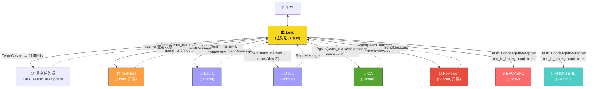

CCG 的 Agent Teams 并行工作流是一套基于 Claude Code Agent Teams 实验特性构建的企业级多 Agent 协作系统。它将传统单人 AI 编程模式升级为"**技术总监 + 7 角色团队**"的虚拟开发团队编制，通过 TeamCreate/Agent/SendMessage/TaskUpdate 等原生 Team API 实现真正的 teammate 并行执行，而非简单的子代理串行调用。系统提供两种入口：**统一 8 阶段流水线**（`/ccg:team`）和**分步独立命令**（`/ccg:team-research` → `/ccg:team-plan` → `/ccg:team-exec` → `/ccg:team-review`），前者适合一站式交付，后者适合需要人工介入检查点的场景。

Sources: [team.md](templates/commands/team.md#L1-L36), [team-research.md](templates/commands/team-research.md#L1-L9)

## 架构设计：角色编制与通信拓扑

Agent Teams 的核心设计原则是 **Lead（主对话）只做编排和决策，绝不写产品代码**。Lead 相当于技术总监/PM，通过 Claude Code 的 TeamCreate 创建共享任务板和通信通道，再通过 `Agent(team_name=..., name=...)` spawn 真正的 teammates 加入团队。所有角色间的协调通过 SendMessage 通信和 TaskCreate/TaskUpdate 任务管理完成。

角色编制包含 7 个明确分工的角色，其中 4 个是 Agent Teams teammates，2 个是外部模型"外援"，1 个是 Lead 自身：

| 角色 | 身份 | 创建方式 | 模型 | 权限 | 职责 |
|------|------|---------|------|------|------|
| 🏛 **Lead** | 主对话（你自己） | N/A | Opus | 读写+编排 | 决策、用户沟通、流程编排 |
| 🏗 **Architect** | Agent Teams teammate | `Agent(team_name=T, name="architect")` | Opus | 只读 | 代码库扫描、架构蓝图、文件分配矩阵 |
| 📜 **Dev × N** | Agent Teams teammates | `Agent(team_name=T, name="dev-N")` | Sonnet | 限定文件写 | 并行编码，文件严格隔离 |
| 🧪 **QA** | Agent Teams teammate | `Agent(team_name=T, name="qa")` | Sonnet | 仅写测试文件 | 测试框架检测、写测试、跑全量验证 |
| 🔬 **Reviewer** | Agent Teams teammate | `Agent(team_name=T, name="reviewer")` | Sonnet | 只读 | 综合多源审查，Critical/Warning/Info 分级 |
| 🔥 **BACKEND** | 外部模型（非 teammate） | Bash + codeagent-wrapper | Codex | 无文件权限 | 后端分析/审查（Architecture/Review 阶段） |
| 🔮 **FRONTEND** | 外部模型（非 teammate） | Bash + codeagent-wrapper | Gemini | 无文件权限 | 前端分析/审查（Architecture/Review 阶段） |

每个 teammate 角色都有独立的 Agent 定义文件，规定了该角色的工具权限、工作流程、输出格式和硬性约束。Architect 和 Reviewer 只有只读权限（Read/Glob/Grep），QA 可以写测试文件（Read/Write/Edit/Bash/Glob/Grep），Dev 的写权限被约束在分配给它的文件范围内。

Sources: [team.md](templates/commands/team.md#L40-L72), [team-architect.md](templates/commands/agents/team-architect.md#L1-L10), [team-qa.md](templates/commands/agents/team-qa.md#L1-L6), [team-reviewer.md](templates/commands/agents/team-reviewer.md#L1-L16)

### 通信架构：Team API 与消息流



关键设计要点：**外部模型（Codex/Gemini）不是 teammates**，它们通过 `codeagent-wrapper` 二进制以 Bash 后台任务方式调用，结果是 Lead 解析后注入到 teammate 的 prompt 中作为"外援参考"。真正的并行发生在两个层面——外部模型的 `run_in_background: true` 并行调用，以及 Dev teammates 通过 Agent Teams API 的并行 spawn。

Sources: [team.md](templates/commands/team.md#L6-L14), [team.md](templates/commands/team.md#L57-L58)

## 统一模式：8 阶段完整流水线

`/ccg:team` 命令实现了从需求到交付的完整 8 阶段流水线，对标企业级工程团队的协作方式。每个阶段有明确的执行者、输入产物、输出产物和退出标准：

```mermaid
flowchart LR
    P0["Phase 0<br/>PRE-FLIGHT<br/>环境检测+Team创建"] --> P1["Phase 1<br/>REQUIREMENT<br/>需求增强→mini-PRD"]
    P1 --> P2["Phase 2<br/>ARCHITECTURE<br/>双模型分析+蓝图"]
    P2 --> P3["Phase 3<br/>PLANNING<br/>任务拆分+并行计划"]
    P3 --> P4["Phase 4<br/>DEVELOPMENT<br/>Dev×N 并行编码"]
    P4 --> P5["Phase 5<br/>TESTING<br/>QA 全量验证"]
    P5 --> P6["Phase 6<br/>REVIEW<br/>双模型审查+综合判决"]
    P6 --> P7["Phase 7<br/>FIX<br/>最多2轮修复循环"]
    P7 --> P8["Phase 8<br/>INTEGRATION<br/>全量验证+报告"]
    
    style P0 fill:#95a5a6,stroke:#333,color:#fff
    style P1 fill:#3498db,stroke:#333,color:#fff
    style P2 fill:#e67e22,stroke:#333,color:#fff
    style P3 fill:#9b59b6,stroke:#333,color:#fff
    style P4 fill:#2ecc71,stroke:#333,color:#fff
    style P5 fill:#55a630,stroke:#333,color:#fff
    style P6 fill:#e74c3c,stroke:#333,color:#fff
    style P7 fill:#f39c12,stroke:#333,color:#fff
    style P8 fill:#1abc9c,stroke:#333,color:#fff
```



### Phase 0: PRE-FLIGHT — 团队创建

这是整个流程的基石。Lead 获取工作目录后，**第一个工具调用动作就是 TeamCreate**——不是稍后，不是在 Phase 2，而是立即执行。调用参数为 `team_name: "<任务名>-team"`，description 设为任务描述。这一步创建了共享任务板和通信通道，后续所有 Agent 调用都必须带上这个 team_name。如果 TeamCreate 失败（Agent Teams 未启用），系统输出启用指引后终止，要求用户在 `settings.json` 中设置 `CLAUDE_CODE_EXPERIMENTAL_AGENT_TEAMS=1`。

Sources: [team.md](templates/commands/team.md#L87-L101)

### Phase 1: REQUIREMENT — 需求增强

Lead 分析用户输入的意图、缺失信息和隐含假设，补全为结构化需求，写入 `.claude/team-plan/<任务名>-prd.md`。PRD 包含目标、功能范围（包含/不包含）、技术上下文（自动检测技术栈）和验收标准。完成后通过 `AskUserQuestion` 请求用户确认或补充。这个阶段的核心价值在于将模糊的自然语言需求转化为可验证的结构化规格。

Sources: [team.md](templates/commands/team.md#L104-L133)

### Phase 2: ARCHITECTURE — 双模型并行分析 + 蓝图设计

这是系统中并行度最高的阶段之一。Lead 在**一条消息中同时发起两个 Bash 调用**（`run_in_background: true`），让 Codex 分析后端架构（模块边界、API 设计、数据模型），Gemini 分析前端架构（组件拆分、状态管理、路由规划）。两个后台任务通过 `TaskOutput` 等待结果，Codex 的结果必须等待（即使耗时 5-15 分钟），Gemini 失败时最多重试 2 次。

双模型返回后，Lead spawn Architect teammate（Opus 模型），将 PRD 和双模型分析摘要注入其 prompt。Architect 独立扫描代码库，综合所有输入，输出架构蓝图和**文件分配矩阵**——这是后续并行开发的基础。文件分配矩阵确保每个文件只出现在一个 Dev 的集合中（零重叠），同时按依赖关系划分并行层次（Layer 1 可并行，Layer 2 依赖 Layer 1）。Architect 完成后通过 SendMessage 通知 Lead，Lead 验证矩阵完整性后 shutdown Architect。

Sources: [team.md](templates/commands/team.md#L136-L190), [team-architect.md](templates/commands/agents/team-architect.md#L12-L16)

### Phase 3: PLANNING — 零决策并行计划

Lead 基于蓝图的文件分配矩阵拆分子任务。每个子任务包含精确的文件范围、具体实施步骤和验收标准。系统强制校验文件隔离性——任何文件不能出现在两个子任务中，若发现重叠则合并到同一子任务或设置依赖关系。计划按 Layer 分组写入 `.claude/team-plan/<任务名>-plan.md`，用户确认后进入开发阶段。**"零决策"**的含义是：计划必须足够具体，让 Dev teammates 能无决策地机械执行。

Sources: [team.md](templates/commands/team.md#L193-L226)

### Phase 4: DEVELOPMENT — Dev×N 并行编码

这是 Agent Teams 并行能力的核心体现。**所有同 Layer 的 Dev 必须在同一条消息中同时 spawn**，禁止串行执行（spawn dev-1 → 等完成 → spawn dev-2）。例如 3 个并行 Dev，Lead 的一条消息中同时包含 3 个 Agent 工具调用，三个 Dev 同时启动并行工作。

每个 Dev 的 prompt 包含严格的文件范围约束："你只能创建或修改以下文件...严禁修改任何其他文件。违反此规则等于任务失败。"这种文件隔离是并行安全的根本保证。Dev 完成后自动发 SendMessage 通知 Lead，Lead 通过消息协调而非轮询来监控进度。Layer 2 的任务设为依赖 Layer 1 的对应任务，等 Layer 1 全部完成后自动解锁，同样以并行方式 spawn。

Sources: [team.md](templates/commands/team.md#L229-L266)

### Phase 5: TESTING — QA 全量验证

QA teammate 被赋予比其他角色更多的工具权限（Read/Write/Edit/Bash/Glob/Grep），因为它需要检测测试框架、编写测试文件并运行全量验证。QA 的第一步是自动检测项目测试环境——按优先级扫描 package.json scripts、jest/vitest/mocha 配置、现有测试文件模式、tsconfig、eslint/biome 配置，确定测试框架、测试命令、lint 命令和 typecheck 命令。

QA 编写测试覆盖正常路径、边界条件和错误处理，然后依次运行测试、lint 和 typecheck，输出结构化的质量报告。测试失败不会阻塞流程——失败项被记录后进入 Phase 6（Review 可能发现根因）。

Sources: [team.md](templates/commands/team.md#L269-L293), [team-qa.md](templates/commands/agents/team-qa.md#L19-L38)

### Phase 6: REVIEW — 双模型交叉审查 + Reviewer 综合

与 Phase 2 类似的并行模式：Codex 和 Gemini 分别以 reviewer prompt 审查 git diff 输出的变更。但审查阶段多了一个 Reviewer teammate——它独立进行代码审查（关注正确性、安全性、性能、模式一致性、可维护性 5 个维度），然后综合两个外部模型的审查意见，去重重叠问题，按严重性三级分类：

| 级别 | 定义 | 动作 |
|------|------|------|
| 🔴 **Critical** | 安全漏洞、逻辑错误、数据丢失风险、构建失败 | **必须修复**，阻塞发布 |
| 🟡 **Warning** | 模式偏离、性能隐患、可维护性问题 | **建议修复**，不阻塞 |
| 🔵 **Info** | 风格建议、微优化、文档补充 | **可选**，留作改进 |

Sources: [team.md](templates/commands/team.md#L296-L345), [team-reviewer.md](templates/commands/agents/team-reviewer.md#L30-L54)

### Phase 7: FIX — 修复循环（最多 2 轮）

如果 Critical = 0，直接跳过此阶段。否则进入 **Evaluator-Optimizer 循环**：为每个 Critical finding 创建修复任务，根据文件归属分配给对应的 Fix Dev（或合并涉及同一文件的多个 finding），spawn Fix Dev teammates 执行修复。修复后 Lead 通过 Bash 运行测试验证，检查 Critical 是否解决。最多循环 2 轮——如果仍有未解决的 Critical，用 `AskUserQuestion` 报告并让用户选择继续手动修复或跳过提交。

Sources: [team.md](templates/commands/team.md#L348-L399)

### Phase 8: INTEGRATION — 全量验证与报告

Lead 运行完整测试套件、lint、typecheck 进行全量验证，然后将整个流程的知识沉淀写入 `.claude/team-plan/<任务名>-report.md`，包含团队编制、各阶段执行摘要、变更摘要、审查结论和测试结论。最后逐一发送 shutdown_request 关闭所有 teammates，调用 TeamDelete 清理团队资源。

Sources: [team.md](templates/commands/team.md#L402-L475)

## 分步模式：独立命令流水线

除了统一的 `/ccg:team` 命令外，系统还提供了 4 个独立命令，允许开发者在每个阶段之间插入人工检查点。这种模式特别适合复杂任务，因为每个阶段结束时可以执行 `/clear` 释放上下文，再启动下一阶段。

```mermaid
flowchart LR
    R["/ccg:team-research<br/>需求研究"] -->|"约束集+成功判据<br/>→ .claude/team-plan/*-research.md"| Clear1["/clear"]
    Clear1 --> P["/ccg:team-plan<br/>规划"]
    P -->|"零决策并行计划<br/>→ .claude/team-plan/*.md"| Clear2["/clear"]
    Clear2 --> E["/ccg:team-exec<br/>并行实施"]
    E -->|"变更摘要<br/>Dev×N 完成编码"| Clear3["/clear（可选）"]
    Clear3 --> RV["/ccg:team-review<br/>交叉审查"]
    
    style R fill:#3498db,stroke:#333,color:#fff
    style P fill:#9b59b6,stroke:#333,color:#fff
    style E fill:#2ecc71,stroke:#333,color:#fff
    style RV fill:#e74c3c,stroke:#333,color:#fff
    style Clear1 fill:#95a5a6,stroke:#333,color:#fff
    style Clear2 fill:#95a5a6,stroke:#333,color:#fff
    style Clear3 fill:#95a5a6,stroke:#333,color:#fff
```



### /ccg:team-research — 约束发现而非信息堆砌

Research 阶段的哲学是产出**约束集**，而不是信息堆砌。每条约束都在缩小解决方案空间，告诉后续阶段"不要考虑这个方向"。其流程为：Prompt 增强（强制且不可跳过）→ 代码库评估 → 按上下文边界（而非角色）定义探索范围 → 双模型并行探索 → 聚合综合 → 歧义消解 → 写入研究文件。

探索边界按自然的上下文边界划分：用户域代码（models/services/UI）、认证与授权（middleware/session/tokens）、基础设施（configs/builds/deployments）。每个边界应自包含，无需跨边界通信。

研究文件的输出包含增强后的需求、硬约束（技术限制、不可违反的模式）、软约束（惯例/偏好/风格指南）、依赖关系、风险、成功判据和已解决的开放问题。

Sources: [team-research.md](templates/commands/team-research.md#L1-L126)

### /ccg:team-plan — 零决策并行计划

Plan 阶段接收 Research 的约束集（或直接的用户输入），产出让 Builder teammates 能无决策机械执行的计划。其核心约束是**子任务的文件范围必须隔离，确保并行不冲突**。如果无法避免文件重叠，则设为依赖关系而非并行。

计划文件的格式要求包含 BACKEND 和 FRONTEND 的实际分析摘要（不是占位符）、技术方案、子任务列表（每个含类型/文件范围/依赖/实施步骤/验收标准）、文件冲突检查和并行分组。

Sources: [team-plan.md](templates/commands/team-plan.md#L1-L120)

### /ccg:team-exec — Builder 并行实施

Exec 阶段是纯机械执行——所有决策已在 plan 阶段完成。前置条件检查 `.claude/team-plan/` 下必须有计划文件，同时验证 Agent Teams 是否启用。确认后通过 TeamCreate 创建 team，按 Layer 分组 spawn Builder teammates（Sonnet），每个 Builder 的 prompt 包含完整的子任务内容、文件范围约束、实施步骤和验收标准。

Builder 间通过 TaskList + SendMessage 协调。如果某个 Builder 遇到问题求助，Lead 通过 SendMessage 回复指导，**不替它写代码**。如果某个 Builder 失败，记录原因但不影响其他 Builder 继续执行。所有 Builder 完成后，汇总变更摘要表并清理 team。

Sources: [team-exec.md](templates/commands/team-exec.md#L1-L111)

### /ccg:team-review — 双模型交叉审查

Review 阶段的核心价值在于**双模型交叉验证捕获单模型审查遗漏的盲区**。审查范围严格限于 `git diff` 的变更，不做范围蔓延。Codex 和 Gemini 分别以 reviewer prompt 并行审查，Lead 综合两个模型的发现后去重，按 Critical/Warning/Info 三级分类输出审查报告。

与统一模式的 Phase 6 不同，独立 review 命令中 **Lead 可以直接修复 Critical 问题**（审查阶段允许写代码）。Critical > 0 时进入决策门：用户选择立即修复则 Lead 参考外部模型建议直接修复，修复后重新审查，循环直到 Critical = 0。

Sources: [team-review.md](templates/commands/team-review.md#L1-L98)

## 关键机制：文件隔离与并行安全

Agent Teams 并行工作流的核心安全机制是**文件分配矩阵的零重叠保证**。从 Phase 2 的 Architect 输出开始，到 Phase 3 的计划拆分，再到 Phase 4 的 Dev spawn，每一层都在强化文件隔离：

```
Architect 蓝图 → 文件分配矩阵（零交叉）
     ↓
Plan 拆分 → 校验文件不重复 + 依赖分层
     ↓
Dev spawn → prompt 硬编码文件范围 + "违反=任务失败"
     ↓
Fix 阶段 → 根据文件归属定位 Dev → 合并同文件 finding
```

当文件无法避免重叠时的降级策略：将重叠文件放入同一子任务（牺牲并行度换取安全），或设置 Layer 依赖关系（串行执行有依赖的任务）。这种设计确保了即使在多 Agent 并行写入的场景下，也不会产生文件冲突。

Sources: [team.md](templates/commands/team.md#L205-L210), [team-exec.md](templates/commands/team-exec.md#L55-L60), [team-architect.md](templates/commands/agents/team-architect.md#L36-L42)

## 外部模型集成：并行调用的容错策略

Codex 和 Gemini 通过 `codeagent-wrapper` 二进制以 Bash 后台任务方式调用，而非通过 Agent Teams API。这意味着它们不是 teammates——没有任务板、没有消息通道、没有自动通知。Lead 需要显式使用 `TaskOutput` 轮询结果。

系统为两个外部模型设计了不同的容错策略：

| 模型 | 容错策略 | 原因 |
|------|---------|------|
| **Codex（BACKEND）** | 结果**必须等待**，超时后继续轮询，禁止跳过 | 后端执行 5-15 分钟属正常；已启动的任务若被跳过 = 浪费 token |
| **Gemini（FRONTEND）** | 失败后最多重试 2 次（间隔 5 秒），3 次全败才跳过 | Gemini API 稳定性相对较低，重试可解决大部分瞬时错误 |

每次并行调用必须在**一条消息中同时发起两个 Bash 调用**并设置 `run_in_background: true`。`TaskOutput` 的 timeout 必须设为 `600000`（10 分钟），否则默认 30 秒会导致提前超时。

Sources: [team.md](templates/commands/team.md#L143-L172), [team-research.md](templates/commands/team-research.md#L65-L66), [team-plan.md](templates/commands/team-plan.md#L52-L55)

## 产物体系：4 个持久化文件

Agent Teams 工作流的每个阶段都有明确的输出产物，持久化到 `.claude/team-plan/` 目录下，确保阶段间解耦和可追溯性：

| 产物文件 | 产出阶段 | 内容 | 用途 |
|---------|---------|------|------|
| `<任务名>-prd.md` | Phase 1 (REQUIREMENT) | 目标、功能范围、技术上下文、验收标准 | 全流程的需求基准 |
| `<任务名>-blueprint.md` | Phase 2 (ARCHITECTURE) | 项目现状、设计方案、文件分配矩阵、并行分层、风险评估 | Dev 分配和文件隔离的依据 |
| `<任务名>-plan.md` | Phase 3 (PLANNING) / team-plan | 双模型分析摘要、子任务列表、文件冲突检查、并行分组 | Dev 机械执行的指令集 |
| `<任务名>-report.md` | Phase 8 (INTEGRATION) | 团队编制、阶段执行摘要、变更摘要、审查/测试结论 | 交付归档和知识沉淀 |

分步模式中，Research 阶段额外产出 `<任务名>-research.md`（约束集 + 成功判据），为 Plan 阶段提供约束输入。

Sources: [team.md](templates/commands/team.md#L412-L456), [team-research.md](templates/commands/team-research.md#L83-L115), [team-plan.md](templates/commands/team-plan.md#L66-L104)

## 与其他工作流的关系

Agent Teams 并行工作流是 CCG 命令体系中最高级的工作流模式，它建立在多个基础能力之上：

- **与 [/ccg:workflow](9-liu-jie-duan-kai-fa-gong-zuo-liu-ccg-workflow) 的关系**：workflow 是单人 6 阶段线性工作流，所有代码由 Lead（Claude 自身）编写。team 工作流将其升级为多 Agent 并行，代码由 Dev teammates 编写，Lead 只做编排。
- **与 [/ccg:plan → /ccg:execute](10-gui-hua-yu-zhi-xing-fen-chi-mo-shi-ccg-plan-ccg-execute) 的关系**：plan/execute 是单模型分离模式，team 工作流将其扩展为多模型并行分析 + 多 Agent 并行执行。
- **与 [/ccg:codex-exec](11-codex-quan-quan-zhi-xing-mo-shi-ccg-codex-exec) 的关系**：codex-exec 将执行权完全交给 Codex，team 工作流则将执行权分散给多个 Sonnet 模型的 Dev teammates，实现真正的并行编码。

选择建议：简单任务用 `/ccg:workflow`，需要分离关注点用 `/ccg:plan` → `/ccg:execute`，需要后端深度执行用 `/ccg:codex-exec`，**复杂任务需要并行加速时用 Agent Teams 工作流**。

Sources: [team.md](templates/commands/team.md#L40-L46), [workflow.md](templates/commands/workflow.md#L1-L8)

## 前置条件与使用须知

使用 Agent Teams 并行工作流需要满足以下条件：

1. **Agent Teams 实验特性已启用**：在 Claude Code 的 `settings.json` 中设置 `"env": { "CLAUDE_CODE_EXPERIMENTAL_AGENT_TEAMS": "1" }`
2. **codeagent-wrapper 已安装**：路径 `~/.claude/bin/codeagent-wrapper`，用于调用 Codex 和 Gemini 外部模型
3. **双模型后端已配置**：Codex CLI 和 Gemini CLI 已安装并认证，配置文件中 BACKEND_PRIMARY 和 FRONTEND_PRIMARY 已正确设置
4. **上下文管理意识**：8 阶段流水线可能消耗大量上下文。分步模式建议在阶段间执行 `/clear`，每个命令会报告上下文使用量并在接近 80K 时主动建议清理