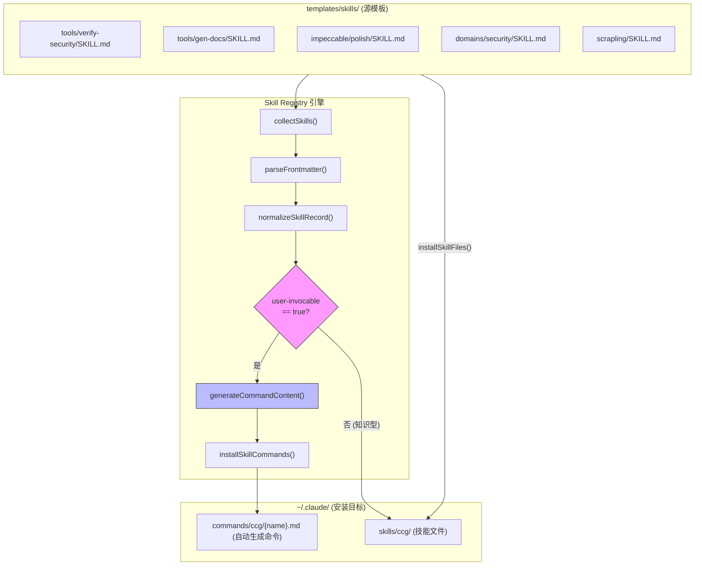
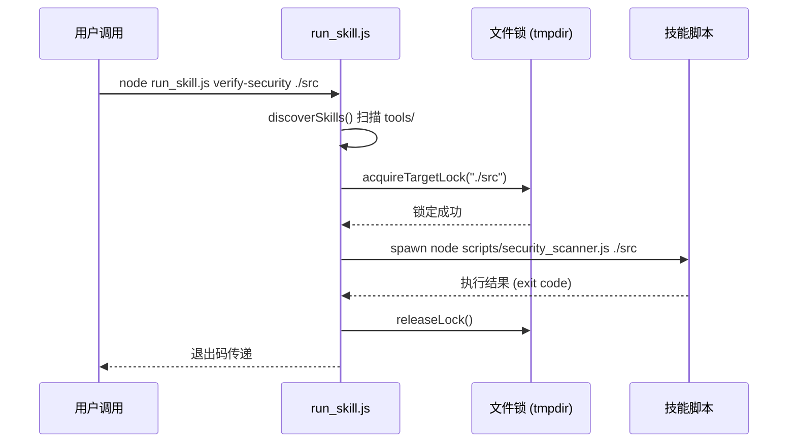
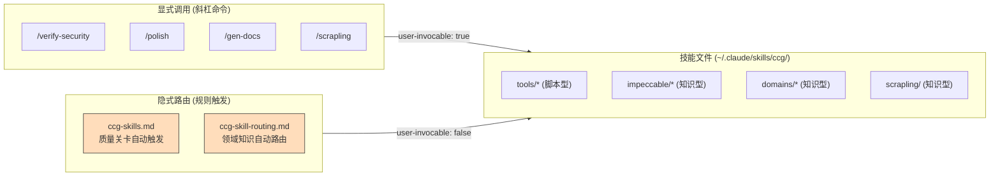

Skill Registry 是 CCG 工作流系统的**核心发现与命令生成引擎**——它递归扫描 `templates/skills/` 目录下的所有 `SKILL.md` 文件，解析 YAML frontmatter 元数据，为标记为 `user-invocable: true` 的技能自动生成 Claude Code 可识别的斜杠命令。这意味着新增一个技能只需创建一个包含正确 frontmatter 的 `SKILL.md` 文件，无需手动编写命令模板或修改注册表代码，整个命令体系即可自动扩展。当前仓库包含 **43 个 SKILL.md 文件**，其中 **28 个被标记为用户可调用**，覆盖安全校验、代码质量、前端精打磨、网页抓取等多个领域。

Sources: [skill-registry.ts](src/utils/skill-registry.ts#L1-L9), [installer.ts](src/utils/installer.ts#L438-L477)

## 整体架构：从 SKILL.md 到斜杠命令的完整链路

Skill Registry 的运行遵循一条清晰的四阶段流水线：**发现 → 解析 → 归一化 → 命令生成**。在安装阶段（`npx ccg-workflow`），系统会依次执行 `installSkillFiles`（复制技能文件到 `~/.claude/skills/ccg/`）和 `installSkillGeneratedCommands`（扫描并生成命令文件到 `~/.claude/commands/ccg/`），两条路径共同完成从源模板到可用命令的完整部署。



上图展示了 Skill Registry 的核心工作流：源模板目录中的 `SKILL.md` 文件经过注册器引擎处理后，分为两条路径——`user-invocable: true` 的技能生成斜杠命令（右侧蓝色路径），而 `user-invocable: false` 的技能仅作为知识储备被复制到安装目录（知识型路由）。这种分离确保了只有面向用户的技能才会出现在命令列表中，而领域知识则通过 `ccg-skill-routing.md` 规则文件实现自动路由。

Sources: [skill-registry.ts](src/utils/skill-registry.ts#L160-L200), [installer.ts](src/utils/installer.ts#L717-L724)

## Frontmatter 规范：SKILL.md 的元数据契约

每个技能的核心身份由其 `SKILL.md` 文件的 YAML frontmatter 定义。注册器通过一个轻量级的手写 YAML 解析器（`parseFrontmatter`）提取键值对，不依赖第三方 YAML 库，确保在所有 Node.js 环境下的零依赖可靠性。解析器会自动跳过空行、注释行和格式错误的行，同时过滤 `__proto__`、`constructor`、`prototype` 等不安全键名以防止原型污染。

### 必需字段与可选字段

| 字段 | 必需 | 类型 | 默认值 | 说明 |
|------|------|------|--------|------|
| `name` | ✅ | `string` (kebab-case) | — | 技能唯一标识符，必须匹配 `^[a-z0-9]+(?:-[a-z0-9]+)*$` |
| `description` | ✅ | `string` | — | 人类可读的技能描述，用于生成命令的 frontmatter |
| `user-invocable` | ❌ | `boolean` | `false` | 是否自动生成斜杠命令 |
| `allowed-tools` | ❌ | `string` (逗号分隔) | `Read` | 技能允许使用的 Claude 工具列表 |
| `argument-hint` | ❌ | `string` | `''` | 显示给用户的参数提示，如 `[target]` 或 `<扫描路径>` |
| `aliases` | ❌ | `string` (逗号分隔) | `[]` | 技能名称的别名列表 |
| `license` | ❌ | `string` | — | 许可证信息 |
| `compatibility` | ❌ | `string` | — | 运行环境要求 |
| `disable-model-invocation` | ❌ | `boolean` | — | 是否禁止模型主动调用 |

Sources: [skill-registry.ts](src/utils/skill-registry.ts#L64-L81), [skill-registry.ts](src/utils/skill-registry.ts#L120-L151)

### 字段校验规则

注册器对元数据执行严格的校验逻辑：**name** 必须符合 kebab-case 正则规范且非空；**description** 必须非空；**allowed-tools** 中的每个工具名必须匹配 PascalCase 格式（如 `Bash`、`Read`、`Grep`），无效工具名会被静默过滤而非抛出错误。如果某个技能目录下的 `scripts/` 子目录包含**超过一个** `.js` 文件，该技能会被整体跳过（避免脚本歧义）。校验失败的技能不会阻塞整个扫描过程——它们只是被静默忽略。

Sources: [skill-registry.ts](src/utils/skill-registry.ts#L50-L54), [skill-registry.ts](src/utils/skill-registry.ts#L124-L129), [skill-registry.ts](src/utils/skill-registry.ts#L110-L118)

## 技能分类体系：五类别自动推断

技能的类别不是在 frontmatter 中显式声明的，而是从其在 `templates/skills/` 目录下的相对路径**自动推断**的。`inferCategory()` 函数检查相对路径的首段目录名来确定分类：

| 目录前缀 | 分类 | 含义 | 典型技能 |
|----------|------|------|----------|
| `tools/` | `tool` | 带执行脚本的工具型技能 | verify-security, gen-docs, verify-quality |
| `domains/` | `domain` | 领域知识型技能 | security, ai, architecture, devops |
| `orchestration/` | `orchestration` | 多 Agent 协调技能 | multi-agent |
| `impeccable/` | `impeccable` | UI/UX 精打磨技能 | polish, audit, animate, colorize |
| *(其他)* | `root` | 根级技能 | ccg-skills, scrapling |

分类的主要用途是**安装时的过滤控制**：通过 `skipCategories` 参数，用户可以选择跳过特定类别。例如，当配置中设置了 `skipImpeccable: true` 时，所有 `impeccable` 分类的技能都不会生成斜杠命令。

Sources: [skill-registry.ts](src/utils/skill-registry.ts#L87-L95), [installer.ts](src/utils/installer.ts#L455-L458)

## 运行时类型：脚本型 vs 知识型

技能的**运行时类型**（`runtimeType`）由其目录下是否存在 `scripts/` 子目录决定，这直接影响生成的命令内容格式：

| 运行时类型 | 判定条件 | 命令生成行为 | 示例技能 |
|-----------|---------|-------------|---------|
| **scripted** | `scripts/` 目录下恰好 1 个 `.js` 文件 | 生成 `node run_skill.js <name> $ARGUMENTS` 执行指令 | verify-security, gen-docs, verify-change |
| **knowledge** | 无 `scripts/` 目录或目录为空 | 生成"读取 SKILL.md 并遵循其指导"的指令 | polish, audit, scrapling, frontend-design |

### 脚本型命令模板

对于脚本型技能，生成的命令文件会指示 Claude Code 执行 `run_skill.js` 统一运行器，并将 `$ARGUMENTS` 原样传递：

```markdown
---
description: '安全校验关卡。自动扫描代码安全漏洞...'
---

# verify-security

安全校验关卡。自动扫描代码安全漏洞...

## 执行

执行以下命令：

node "<installDir>/run_skill.js" verify-security $ARGUMENTS

如需了解此技能的详细说明，请读取: <installDir>/tools/verify-security/SKILL.md
```

### 知识型命令模板

对于知识型技能，生成的命令文件会指示 Claude 读取 SKILL.md 并按其指导执行：

```markdown
---
description: 'Performs a final quality pass...'
---

# polish

Performs a final quality pass...

## 指令

读取技能秘典文件 `<installDir>/impeccable/polish/SKILL.md`，按照其中的指导完成魔尊的任务。

$ARGUMENTS
```

两种模板都以 `---` 包裹的 YAML frontmatter 开头——这是**强制性的**，因为 Claude Code 的命令解析器要求命令文件必须包含 frontmatter，缺少 frontmatter 会导致同目录下所有命令解析失败（级联故障）。

Sources: [skill-registry.ts](src/utils/skill-registry.ts#L97-L108), [skill-registry.ts](src/utils/skill-registry.ts#L219-L267)

## 技能发现算法：递归扫描与去重

`collectSkills()` 函数实现了深度优先的递归扫描算法。它从给定的技能根目录出发，在每个目录层级检查是否存在 `SKILL.md` 文件。如果找到，就尝试解析 frontmatter 并归一化为 `SkillMeta` 记录。扫描过程遵循以下规则：

- **跳过特殊目录**：`scripts`、`agents`、`__pycache__`、`.DS_Store`、`.git`、`node_modules` 等
- **名称去重**：使用 `Set<string>` 确保每个 `name` 只注册一次，先到先得
- **字母序排列**：最终结果按 `name` 字母序排序返回
- **错误容忍**：无法读取或解析的文件被静默跳过，不会中断扫描

Sources: [skill-registry.ts](src/utils/skill-registry.ts#L160-L200)

## 安装流水线集成：命令冲突避免机制

Skill Registry 作为安装流水线的一个子步骤被调用。在 `installWorkflows()` 的执行序列中，它排在所有其他安装步骤之后（命令文件、Agent 文件、提示词文件、技能文件、规则文件、二进制文件），这确保了它能够检测到**已存在的命令文件**：

```
installCommandFiles()        → 安装预定义命令（来自 installer-data.ts）
installAgentFiles()          → 安装 Agent 配置
installPromptFiles()         → 安装提示词
installSkillFiles()          → 复制技能文件到 ~/.claude/skills/ccg/
installSkillGeneratedCommands() → ★ 扫描 SKILL.md，生成命令
installRuleFiles()           → 安装自动路由规则
installBinaryFile()          → 安装 Go 二进制
```

**冲突避免**的核心逻辑是：`installSkillGeneratedCommands` 先读取 `~/.claude/commands/ccg/` 目录下所有已有的 `.md` 文件名，将它们存入 `existingCommandNames` 集合。当遍历 `user-invocable` 技能时，如果某个技能的 `name` 已经在集合中存在，就跳过生成——这保证了复杂的多模型命令（如 `workflow.md`、`plan.md`、`execute.md`）不会被简化的技能命令覆盖。

Sources: [installer.ts](src/utils/installer.ts#L717-L724), [installer.ts](src/utils/installer.ts#L446-L466)

## run_skill.js 统一运行器

对于脚本型技能，`run_skill.js` 是统一的执行入口。它负责技能发现、脚本路由、文件锁管理和子进程调度。运行器的工作流程如下：

1. **技能发现**：扫描 `tools/` 目录下所有包含 `scripts/*.js` 的子目录，构建 `{name: scriptPath}` 映射表
2. **文件锁定**：基于目标路径的 MD5 哈希在系统临时目录创建排他锁（`acquireTargetLock`），防止同一目标的并发执行冲突，超时 30 秒
3. **子进程执行**：以 `stdio: 'inherit'` 模式 spawn 子进程，实时透传标准输出
4. **信号处理**：捕获 `SIGINT` 信号，优雅终止子进程并释放文件锁



Sources: [run_skill.js](templates/skills/run_skill.js#L1-L130)

## 技能全景统计：43 个技能的分布与调用关系

当前仓库的技能体系按类别分布如下：

| 类别 | 总数 | 可调用 (`user-invocable: true`) | 知识型 (`user-invocable: false`) | 运行时类型 |
|------|------|------|------|------|
| **tools/** | 6 | 6 | 0 | scripted (5) + scripted (1) |
| **impeccable/** | 20 | 20 | 0 | knowledge |
| **domains/** | 14 | 1 | 13 | knowledge |
| **orchestration/** | 1 | 0 | 1 | knowledge |
| **root** | 2 | 1 | 1 | mixed |

**tools/** 下的 6 个可调用技能是核心的自动化工具：`verify-security`、`verify-quality`、`verify-change`、`verify-module`、`gen-docs` 和 `hi`（反拒绝覆写）。它们都包含 `scripts/` 子目录，属于脚本型技能。

**impeccable/** 下的 20 个技能构成了完整的 UI/UX 精打磨工具链，全部为知识型技能，通过 `frontend-design` 父技能作为统一入口。

**domains/** 下的 14 个技能中，只有 `frontend-design` 标记为可调用（它同时是 impeccable 系统的设计基础），其余 13 个是纯知识型技能，通过 [ccg-skill-routing.md](templates/rules/ccg-skill-routing.md) 规则文件实现基于关键词的自动路由。

Sources: [ccg-skills.md](templates/rules/ccg-skills.md#L1-L66), [ccg-skill-routing.md](templates/rules/ccg-skill-routing.md#L1-L84)

## 自动触发与路由规则：两套互补机制

Skill Registry 生成的命令通过两种互补机制被触发：

**显式调用**：用户在 Claude Code 中输入 `/verify-security`、`/polish` 等斜杠命令，直接执行对应的技能。这由 `user-invocable: true` 的技能通过自动生成的命令文件实现。

**自动路由**：CCG 通过两个规则文件实现隐式触发。`ccg-skills.md` 定义了质量关卡的自动触发规则（新建模块时触发 `gen-docs` → `verify-module` → `verify-security`；代码变更超 30 行时触发 `verify-change` → `verify-quality`），而 `ccg-skill-routing.md` 定义了领域知识的自动路由规则（当用户请求匹配特定关键词时，自动读取对应的领域知识文件）。



这两种机制的关键区别在于：显式调用依赖 `user-invocable: true` 的 SKILL.md 生成命令文件，而隐式路由则将所有技能（无论 `user-invocable` 值如何）作为知识源，通过规则文件中的关键词匹配触发读取。

Sources: [ccg-skills.md](templates/rules/ccg-skills.md#L1-L66), [ccg-skill-routing.md](templates/rules/ccg-skill-routing.md#L1-L84)

## SkillMeta 类型体系

Skill Registry 的核心数据结构 `SkillMeta` 完整定义如下，它承载了从 SKILL.md frontmatter 到命令生成的全部中间状态：

| 字段 | 类型 | 来源 | 说明 |
|------|------|------|------|
| `name` | `string` | frontmatter | kebab-case 技能标识符 |
| `description` | `string` | frontmatter | 人类可读描述 |
| `userInvocable` | `boolean` | frontmatter `user-invocable` | 是否生成斜杠命令 |
| `allowedTools` | `string[]` | frontmatter `allowed-tools` | 允许的 Claude 工具列表 |
| `argumentHint` | `string` | frontmatter `argument-hint` | 参数提示文本 |
| `aliases` | `string[]` | frontmatter `aliases` | 技能别名列表 |
| `category` | `SkillCategory` | 目录路径推断 | tool/domain/orchestration/impeccable/root |
| `runtimeType` | `SkillRuntimeType` | scripts/ 目录检测 | scripted/knowledge |
| `relPath` | `string` | 计算得出 | 相对于 skills 根目录的路径 |
| `skillPath` | `string` | 计算得出 | SKILL.md 的绝对路径 |
| `scriptPath` | `string \| null` | 计算得出 | 脚本文件的绝对路径（仅脚本型） |

Sources: [skill-registry.ts](src/utils/skill-registry.ts#L18-L44)

## 扩展指南：如何添加新技能

添加一个新的用户可调用技能只需要三步：

1. **创建技能目录**：在 `templates/skills/` 的适当分类下创建新目录（如 `tools/my-skill/`）
2. **编写 SKILL.md**：包含完整 frontmatter 的技能定义文件，至少设置 `name`、`description`、`user-invocable: true`
3. **（可选）添加脚本**：如果需要脚本型技能，在目录下创建 `scripts/` 子目录并放入恰好一个 `.js` 文件

Frontmatter 模板参考：

```yaml
---
name: my-new-skill
description: 技能的简短描述。当用户提到XXX时使用。
user-invocable: true
allowed-tools: Bash, Read, Grep
argument-hint: <参数提示>
---
```

安装后，`npx ccg-workflow` 会自动发现并生成 `/my-new-skill` 斜杠命令。如果 `name` 与已有命令冲突（如与 `installer-data.ts` 中预定义的命令同名），新技能的命令生成会被安全跳过，不会覆盖已有命令。

Sources: [skill-registry.ts](src/utils/skill-registry.ts#L278-L302), [installer.ts](src/utils/installer.ts#L446-L466)

---

**相关阅读**：

- 想了解自动生成的命令在整体 29+ 命令体系中的位置，参阅 [斜杠命令体系：29+ 命令分类与模板结构](8-xie-gang-ming-ling-ti-xi-29-ming-ling-fen-lei-yu-mo-ban-jie-gou)
- 想深入了解 impeccable 工具集的 20 个 UI/UX 精打磨技能，参阅 [Impeccable 工具集：20 个 UI/UX 精打磨技能](17-impeccable-gong-ju-ji-20-ge-ui-ux-jing-da-mo-ji-neng)
- 想了解 10 大领域 61 个知识文件的内容，参阅 [域知识秘典：10 大领域 61 个知识文件](16-yu-zhi-shi-mi-dian-10-da-ling-yu-61-ge-zhi-shi-wen-jian)
- 想了解安装器流水线的完整链路，参阅 [安装器流水线：从模板变量注入到文件部署的完整链路](7-an-zhuang-qi-liu-shui-xian-cong-mo-ban-bian-liang-zhu-ru-dao-wen-jian-bu-shu-de-wan-zheng-lian-lu)