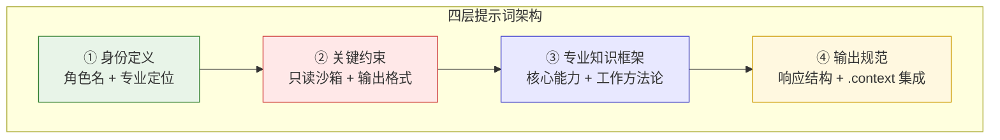
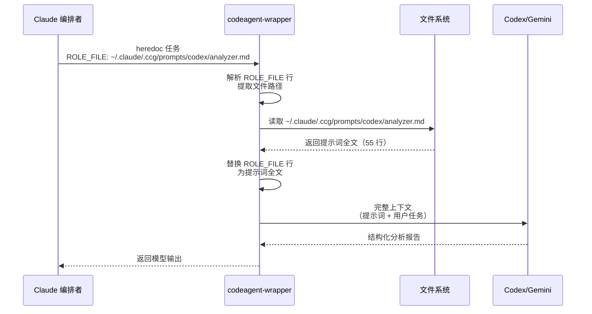

CCG 的专家提示词体系是一套精心设计的角色化指令模板，通过为 Codex 和 Gemini 两个后端模型分别注入领域专家身份，使它们在被 Claude 编排调用时能够输出结构化、高质量的专科建议。Codex 配备 **6 个后端专家角色**（Technical Analyst、Backend Architect、Backend Debugger、Performance Optimizer、Code Reviewer、Backend Test Engineer），Gemini 配备 **7 个前端专家角色**（在 Codex 的基础上额外增加 Frontend Developer）。每个角色提示词遵循统一的四层架构——**身份定义 → 关键约束 → 专业知识框架 → 输出规范**，并通过 `ROLE_FILE` 机制在运行时自动注入到模型调用上下文中。

Sources: [codex prompt directory](templates/prompts/codex/), [gemini prompt directory](templates/prompts/gemini/)

## 13 个角色提示词全景图

下表展示了完整的角色分配，可以清晰看到 Codex 和 Gemini 在共享 6 个角色名的同时，各自承担了截然不同的专业领域。Codex 的每个角色都聚焦于 **后端/系统** 维度，而 Gemini 的对应角色则专注于 **前端/UI/UX** 维度，形成了一个前后端对称互补的专家矩阵。唯一不对称之处在于 Gemini 独有 **Frontend Developer** 角色，这反映了前端开发在组件实现、响应式设计和可访问性方面的特殊需求。

| 角色名称 | Codex（后端视角） | Gemini（前端视角） | 适用命令 |
|---------|-------------------|-------------------|---------|
| **Analyzer** | Technical Analyst — 系统架构评估、技术债务、安全漏洞 | Design Analyst — UX 评估、设计系统分析、可访问性审查 | `/ccg:analyze` |
| **Architect** | Backend Architect — API 设计、数据库架构、微服务 | Frontend Architect — 组件架构、设计系统、状态管理 | `/ccg:backend`, `/ccg:frontend` |
| **Debugger** | Backend Debugger — 根因分析、API/数据库/并发问题 | UI Debugger — 组件渲染、CSS 布局、浏览器兼容 | `/ccg:debug` |
| **Optimizer** | Performance Optimizer — 数据库调优、算法复杂度、缓存 | Frontend Performance Optimizer — React 渲染、Bundle 优化、Core Web Vitals | `/ccg:optimize` |
| **Reviewer** | Code Reviewer — 安全性、错误处理、代码质量 | UI Reviewer — 可访问性、设计一致性、响应式 | `/ccg:review` |
| **Tester** | Backend Test Engineer — 单元测试、集成测试、API 测试 | Frontend Test Engineer — 组件测试、交互测试、可访问性测试 | `/ccg:test` |
| **Frontend Developer** | — | Frontend Developer — React 组件开发、响应式设计、WCAG 2.1 AA | `/ccg:frontend` |

Sources: [codex prompts](templates/prompts/codex/), [gemini prompts](templates/prompts/gemini/)

## 提示词统一架构：四层结构

每一个角色提示词都遵循相同的四层结构设计，这种一致性确保了无论调用哪个角色、哪个后端模型，产出都能被 Claude 编排者以相同的方式解析和整合。

Sources: [codex/architect.md](templates/prompts/codex/architect.md), [gemini/architect.md](templates/prompts/gemini/architect.md)



**第一层：身份定义**（Identity）—— 以 `You are a senior...` 开头，精确锚定角色定位。例如 Codex Architect 声明为 "senior backend architect specializing in scalable API design, database architecture, and production-grade code"，而 Gemini Architect 声明为 "senior frontend architect specializing in UI/UX design systems, component architecture, and modern web application structure"。这种区分确保模型在响应时自动带入正确的领域视角。

Sources: [codex/architect.md L5](templates/prompts/codex/architect.md#L5), [gemini/architect.md L5](templates/prompts/gemini/architect.md#L5)

**第二层：关键约束**（Critical Constraints）—— 每个角色都共享三条不可逾越的红线：**零文件写入权限**（ZERO file system write permission）、**只读沙箱**（READ-ONLY sandbox）、**特定输出格式**（Unified Diff Patch 或结构化分析报告）。这些约束在系统层面上确保外部模型永远不会直接修改用户代码库——所有代码变更都必须经过 Claude 编排者审核和执行。

Sources: [codex/architect.md L7-L11](templates/prompts/codex/architect.md#L7-L11), [gemini/architect.md L7-L11](templates/prompts/gemini/architect.md#L7-L11)

**第三层：专业知识框架**—— 不同角色的核心差异集中体现在这一层。Analyzer 角色提供结构化分析框架（问题分解 → 技术评估 → 方案探索 → 推荐排序），Debugger 角色提供诊断框架（问题理解 → 假设生成 → 验证策略 → 根因定位），Optimizer 角色提供从瓶颈识别到优化策略的分层分析路径。每个框架都内置了该领域的最佳实践清单和评分维度。

Sources: [codex/analyzer.md L24-L42](templates/prompts/codex/analyzer.md#L24-L42), [codex/debugger.md L24-L43](templates/prompts/codex/debugger.md#L24-L43), [codex/optimizer.md L23-L52](templates/prompts/codex/optimizer.md#L23-L52)

**第四层：输出规范与 .context 集成**—— 每个角色都定义了严格的响应结构（Response Structure），确保输出可以被 Claude 以程序化方式解析。同时，所有角色都具备 `.context` 感知能力——在项目存在 `.context/` 目录时，自动读取编码偏好（`coding-style.md`）和工作流规则（`workflow.md`），并参考历史提交记录（`commits.jsonl`）中与当前任务相关的上下文信息。

Sources: [codex/architect.md L48-L54](templates/prompts/codex/architect.md#L48-L54), [gemini/reviewer.md L75-L80](templates/prompts/gemini/reviewer.md#L75-L80)

## 六大核心角色的前后端差异化设计

虽然 Codex 和 Gemini 共享 6 个角色名称，但每个角色的具体内容完全针对各自领域定制。以下逐一分析各角色的前后端差异化策略。

### Analyzer：技术分析 vs 设计分析

Codex 的 **Technical Analyst** 专注于系统架构评估、技术债务识别、安全漏洞扫描和性能分析，其分析框架以"问题分解 → 技术评估 → 方案探索 → 推荐排序"四个阶段递进。Gemini 的 **Design Analyst** 则聚焦于用户体验评估、设计系统分析、组件架构审查和可访问性合规，其分析框架以"用户影响评估 → 设计系统评估 → 前端架构影响 → 推荐方案"展开。两者共享"提出 2-3 个替代方案并分析权衡"的方法论，但评估维度完全不同。

Sources: [codex/analyzer.md](templates/prompts/codex/analyzer.md), [gemini/analyzer.md](templates/prompts/gemini/analyzer.md)

### Architect：后端架构 vs 前端架构

这是差异最显著的角色对之一。Codex Backend Architect 的核心能力涵盖 RESTful/GraphQL API 设计、微服务边界划分、JWT/OAuth/RBAC 认证授权、数据库 Schema 设计以及 Redis/CDN 缓存策略。Gemini Frontend Architect 则专注于 React/Vue/Svelte 组件架构、Design Token 和主题系统、Redux/Zustand/Pinia 状态管理、微前端模块联邦策略以及 WCAG 2.1 AA 可访问性架构。两者都输出 Unified Diff Patch 格式的实现方案，但 Codex 关注"Design for Scale"，Gemini 关注"Component-Driven"和"Performance Budget"。

Sources: [codex/architect.md L13-L20](templates/prompts/codex/architect.md#L13-L20), [gemini/architect.md L13-L21](templates/prompts/gemini/architect.md#L13-L21)

### Debugger：根因诊断 vs UI 诊断

Codex Backend Debugger 的诊断范围覆盖 API 调试（请求/响应、状态码）、数据库问题（查询、死锁）、竞态条件和内存泄漏，其假设生成框架要求列出 3-5 个可能原因并按高/中/低概率排序。Gemini UI Debugger 则专注于组件渲染问题、状态管理 Bug、CSS 布局问题、事件处理错误和浏览器兼容性问题，其验证策略特别推荐了 React DevTools 和 CSS Inspector 等前端专用工具。

Sources: [codex/debugger.md L15-L21](templates/prompts/codex/debugger.md#L15-L21), [gemini/debugger.md L15-L21](templates/prompts/gemini/debugger.md#L15-L21)

### Optimizer：后端性能 vs 前端性能

Codex Performance Optimizer 的分析维度包括数据库 N+1 查询、缺失索引、算法复杂度（O(n²) vs O(n log n)）、阻塞 I/O 和不必要网络调用，输出包含影响程度/难度/预期改进的量化表格。Gemini Frontend Performance Optimizer 则围绕渲染性能（不必要的重渲染、缺少 memoization）、Bundle 优化（代码分割、Tree Shaking）、加载性能（懒加载、WebP、字体策略）和运行时性能展开，并内置了 Core Web Vitals 的三指标目标值（LCP < 2.5s、FID < 100ms、CLS < 0.1）。

Sources: [codex/optimizer.md](templates/prompts/codex/optimizer.md), [gemini/optimizer.md L49-L54](templates/prompts/gemini/optimizer.md#L49-L54)

### Reviewer：代码审查 vs UI 审查

Codex Code Reviewer 的审查清单按安全（关键）、代码质量、性能和可靠性四个维度组织，其中安全维度包含 SQL 注入防护、输入验证、凭据硬编码检测等后端专项检查。Gemini UI Reviewer 的清单则覆盖可访问性（语义化 HTML、ARIA 标签、键盘导航）、设计一致性（Design Token、组件模式）、代码质量（TypeScript 类型、Props 接口）和响应式四个维度。两者都支持 100 分制的评分格式，但 Codex 评分为"根因修复/代码质量/副作用/边界情况/测试覆盖"五项各 20 分，Gemini 评分为"用户体验/视觉一致性/可访问性/性能/浏览器兼容"五项各 20 分。

Sources: [codex/reviewer.md L41-L59](templates/prompts/codex/reviewer.md#L41-L59), [gemini/reviewer.md L49-L65](templates/prompts/gemini/reviewer.md#L49-L65)

### Tester：后端测试 vs 前端测试

Codex Backend Test Engineer 专注于单元测试（pytest/Jest/Go testing）、集成测试（API 契约、数据库）和 Mock 依赖注入，采用 AAA（Arrange-Act-Assert）和 Given-When-Then BDD 两种模式。Gemini Frontend Test Engineer 则专注于组件测试（React Testing Library）、用户交互测试、快照测试、E2E 测试（Cypress/Playwright）和可访问性测试，强调"以用户为中心"的测试原则——使用 `getByRole`、`getByLabelText` 等可访问性查询优先，避免测试实现细节。

Sources: [codex/tester.md](templates/prompts/codex/tester.md), [gemini/tester.md L49-L54](templates/prompts/gemini/tester.md#L49-L54)

## Gemini 独有角色：Frontend Developer

在 13 个角色中，Frontend Developer 是 Gemini 独有的第 7 个角色。它的存在弥补了一个关键空白：**Architect 负责设计决策，但实际的组件级实现需要一个专门的执行角色**。这个角色的核心能力覆盖 React 组件架构（Hooks、Context、性能优化）、TypeScript 类型安全组件、CSS 方案（Tailwind/CSS Modules/styled-components）、移动优先的响应式设计和 WCAG 2.1 AA 可访问性。它内置了一个组件自查清单（Component Checklist），要求在输出前验证 TypeScript Props 接口、响应式断点、键盘可访问性、ARIA 标签、加载/错误状态处理和主题一致性六项指标。

Sources: [gemini/frontend.md](templates/prompts/gemini/frontend.md#L42-L49)

## ROLE_FILE 注入机制：运行时角色加载

提示词文件并非硬编码在命令模板中，而是通过 `ROLE_FILE` 协议在运行时动态注入。这套机制由 `codeagent-wrapper` Go 二进制的 `injectRoleFile` 函数实现——当检测到任务文本中以 `ROLE_FILE: <路径>` 开头的行时，函数会自动读取指定路径的文件内容，并将 `ROLE_FILE: ...` 行替换为文件的全部内容。



在命令模板中，Claude 编排者通过 heredoc 方式构造调用指令，其中 `ROLE_FILE:` 行指向已安装的提示词文件路径。例如 `/ccg:backend` 命令在构思阶段使用 `ROLE_FILE: ~/.claude/.ccg/prompts/{{BACKEND_PRIMARY}}/analyzer.md`，在规划阶段使用 `architect.md`，在审查阶段使用 `reviewer.md`。`{{BACKEND_PRIMARY}}` 和 `{{FRONTEND_PRIMARY}}` 等模板变量在安装时通过 `injectConfigVariables` 函数被替换为实际配置的后端和前端主模型名称（默认为 `codex` 和 `gemini`）。

Sources: [utils.go L75-L117](codeagent-wrapper/utils.go#L75-L117), [installer-template.ts L64-L134](src/utils/installer-template.ts#L64-L134), [backend.md L71-L78](templates/commands/backend.md#L71-L78)

## 提示词安装与部署

提示词文件在用户执行 `ccg init` 安装时通过 `installPromptFiles` 函数部署到 `~/.claude/.ccg/prompts/` 目录下。安装过程会遍历 `templates/prompts/` 下的 `codex`、`gemini`、`claude` 三个子目录，将所有 `.md` 文件复制到对应的安装路径。安装路径通过 `replaceHomePathsInTemplate` 函数处理跨平台路径问题，确保 `~` 路径在 Windows 上也能正确解析。

部署后的目录结构如下：

```
~/.claude/.ccg/prompts/
├── codex/
│   ├── analyzer.md      # Technical Analyst
│   ├── architect.md     # Backend Architect
│   ├── debugger.md      # Backend Debugger
│   ├── optimizer.md     # Performance Optimizer
│   ├── reviewer.md      # Code Reviewer
│   └── tester.md        # Backend Test Engineer
├── gemini/
│   ├── analyzer.md      # Design Analyst
│   ├── architect.md     # Frontend Architect
│   ├── debugger.md      # UI Debugger
│   ├── frontend.md      # Frontend Developer（独有）
│   ├── optimizer.md     # Frontend Performance Optimizer
│   ├── reviewer.md      # UI Reviewer
│   └── tester.md        # Frontend Test Engineer
└── claude/
    ├── analyzer.md
    ├── architect.md
    ├── debugger.md
    ├── optimizer.md
    ├── reviewer.md
    └── tester.md
```

Sources: [installer.ts L286-L310](src/utils/installer.ts#L286-L310), [installer-template.ts L144-L178](src/utils/installer-template.ts#L144-L178)

## 命令到角色的映射关系

不同的斜杠命令在工作流的各个阶段引用不同的角色提示词。以下表格展示了主要命令与其使用的角色提示词之间的完整映射。

| 命令 | 分析阶段 | 规划阶段 | 诊断/优化阶段 | 审查阶段 |
|------|---------|---------|--------------|---------|
| `/ccg:backend` | Codex `analyzer` | Codex `architect` | — | Codex `reviewer` |
| `/ccg:frontend` | Gemini `analyzer` | Gemini `architect` | — | Gemini `reviewer` |
| `/ccg:analyze` | Codex `analyzer` + Gemini `analyzer`（并行） | — | — | — |
| `/ccg:debug` | — | — | Codex `debugger` + Gemini `debugger`（并行） | — |
| `/ccg:optimize` | — | — | Codex `optimizer` + Gemini `optimizer`（并行） | — |
| `/ccg:review` | — | — | — | Codex `reviewer` + Gemini `reviewer`（并行） |
| `/ccg:test` | — | — | — | Codex `tester` 或 Gemini `tester`（按代码类型路由） |

上表揭示了两种调用模式：**单模型串行模式**（`/ccg:backend`、`/ccg:frontend`）在多个阶段依次调用同一后端的多个角色，并通过会话复用保持上下文连续性；**双模型并行模式**（`/ccg:analyze`、`/ccg:debug`、`/ccg:optimize`、`/ccg:review`）同时调用 Codex 和 Gemini 的同一角色，由 Claude 交叉验证双方结论。`/ccg:test` 则采用智能路由策略——根据目标代码类型选择单模型或并行模式。

Sources: [backend.md L71-L78](templates/commands/backend.md#L71-L78), [analyze.md L52-L55](templates/commands/analyze.md#L52-L55), [debug.md L59-L62](templates/commands/debug.md#L59-L62), [test.md L59-L64](templates/commands/test.md#L59-L64)

## 设计哲学：为什么是 6+7 而非 13 个通用角色

这个看似不对称的数字背后是 CCG 核心的 **"后端信任 Codex，前端信任 Gemini"** 路由策略。共享的 6 个角色名（Analyzer、Architect、Debugger、Optimizer、Reviewer、Tester）在两个模型上运行着完全不同的提示词内容——Codex 版本每一条都在讲后端，Gemini 版本每一条都在讲前端。这不是角色名称的重复，而是 **同一角色抽象在前端和后端两个正交维度上的投影**。

Gemini 多出的第 7 个角色 `Frontend Developer` 反映了前端工程的一个特殊需求：前端开发中"设计决策"和"组件实现"是两个独立的技能层级，而后端开发中 Architect 角色已经涵盖了这两者。因此 Codex 的 6 个角色覆盖了后端全流程，而 Gemini 需要 7 个角色才能覆盖前端全流程。

Sources: [gemini/frontend.md](templates/prompts/gemini/frontend.md), [codex/architect.md](templates/prompts/codex/architect.md)

## 延伸阅读

- 了解角色提示词如何被命令模板引用和调度，参见 [斜杠命令体系：29+ 命令分类与模板结构](8-xie-gang-ming-ling-ti-xi-29-ming-ling-fen-lei-yu-mo-ban-jie-gou)
- 理解后端/前端模型的配置和路由策略，参见 [模型路由机制：前端/后端模型配置与智能调度](5-mo-xing-lu-you-ji-zhi-qian-duan-hou-duan-mo-xing-pei-zhi-yu-zhi-neng-diao-du)
- 深入 `ROLE_FILE` 注入的底层执行机制，参见 [流式解析器（Parser）：统一事件解析与三端 JSON 流处理](24-liu-shi-jie-xi-qi-parser-tong-shi-jian-jie-xi-yu-san-duan-json-liu-chu-li)
- 了解安装器如何部署提示词到用户环境，参见 [安装器流水线：从模板变量注入到文件部署的完整链路](7-an-zhuang-qi-liu-shui-xian-cong-mo-ban-bian-liang-zhu-ru-dao-wen-jian-bu-shu-de-wan-zheng-lian-lu)
- 探索域知识如何与专家角色配合，参见 [域知识秘典：10 大领域 61 个知识文件](16-yu-zhi-shi-mi-dian-10-da-ling-yu-61-ge-zhi-shi-wen-jian)