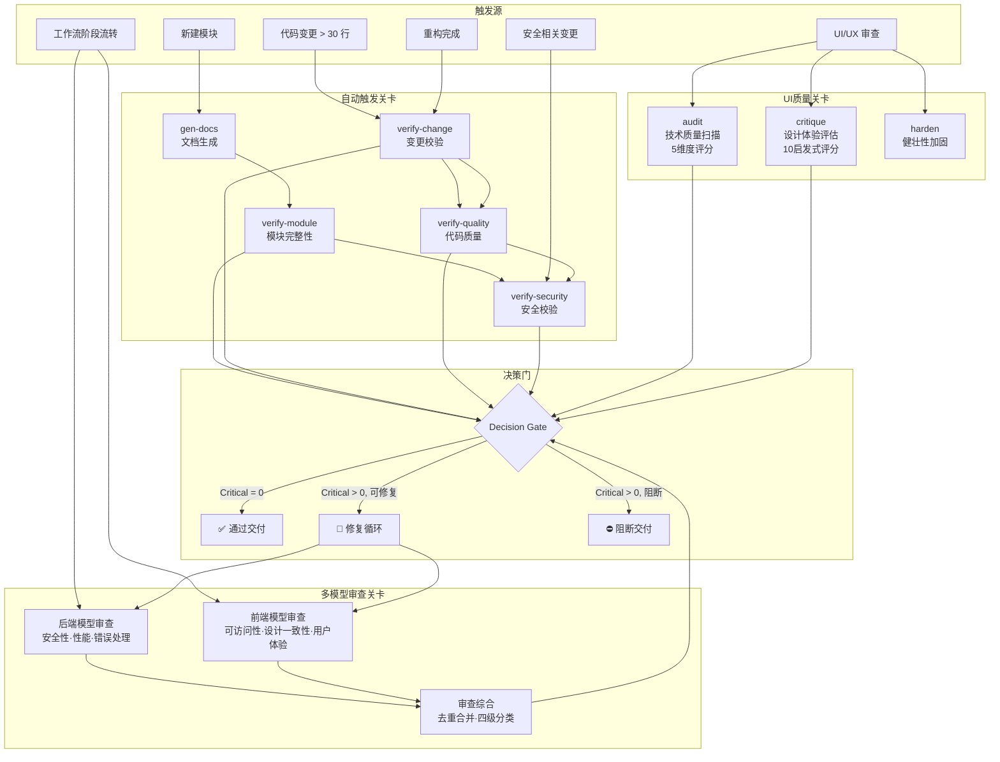

CCG 的质量保障体系是一个**双层架构**：第一层是规则驱动的自动化验证技能（4 个 verify 技能），按场景条件自动触发并产出结构化校验报告；第二层是多模型交叉审查链，在关键工作流节点（优化、评审、提交）并行调度后端与前端模型进行双视角代码审查，以 Critical/Major/Minor/Suggestion 四级分类合并审查结果，最终通过决策门（Decision Gate）决定流转还是阻断。这种设计确保了质量验证不会遗漏任何维度——从代码安全、变更影响、模块结构到 UI/UX 体验，每一个环节都有明确的触发条件和通过标准。

Sources: [ccg-skills.md](templates/rules/ccg-skills.md#L1-L66), [workflow.md](templates/commands/workflow.md#L106-L108)

## 质量关卡架构总览

CCG 的质量关卡可以按**触发方式**和**验证维度**分为两大类，共 8 个核心验证节点。以下架构图展示了触发条件、验证技能以及它们之间的链式调用关系：



Sources: [ccg-skills.md](templates/rules/ccg-skills.md#L1-L66), [ccg-skill-routing.md](templates/rules/ccg-skill-routing.md#L1-L84)

## 四大自动触发关卡

CCG 在 `ccg-skills.md` 规则文件中定义了 4 个核心验证技能，它们由场景条件驱动自动触发，每个技能包含一个 Node.js 分析脚本和结构化报告输出。这 4 个关卡遵循**链式执行**原则——前序关卡通过后才进入下一个。

Sources: [ccg-skills.md](templates/rules/ccg-skills.md#L9-L49)

### 关卡总览与触发条件

| 关卡 | 脚本工具 | 触发场景 | 核心检测项 | 阻断条件 |
|------|----------|----------|-----------|---------|
| **verify-change** | `change_analyzer.js` | 代码变更 > 30 行、重构、提交前 | 文件分类、文档同步、测试覆盖、影响评估 | 代码 > 50 行但 DESIGN.md 未更新；代码 > 30 行但无测试更新 |
| **verify-quality** | `quality_checker.js` | 复杂模块(>200 行)、重构、PR 审查、提交前 | 圈复杂度(≤10)、函数长度(≤50行)、嵌套深度(≤4)、代码异味 | 复杂度或异味超标 |
| **verify-security** | `security_scanner.js` | 新建模块、安全相关变更、攻防任务、提交前 | SQL 注入、XSS、硬编码密钥、路径遍历、SSRF 等 10 类漏洞 | Critical/High 问题 |
| **verify-module** | `module_scanner.js` | 新建模块、模块重构、提交前 | README.md 完整性、DESIGN.md 完整性、代码文档一致性 | README.md 或 DESIGN.md 缺失 |

Sources: [verify-change/SKILL.md](templates/skills/tools/verify-change/SKILL.md#L39-L56), [verify-quality/SKILL.md](templates/skills/tools/verify-quality/SKILL.md#L36-L74), [verify-security/SKILL.md](templates/skills/tools/verify-security/SKILL.md#L36-L59), [verify-module/SKILL.md](templates/skills/tools/verify-module/SKILL.md#L36-L76)

### 触发规则与执行链

质量关卡的触发规则定义在 `ccg-skills.md` 中，每种场景对应一条从上到下顺序执行的验证链：

**新建模块时**，先调用 `gen-docs` 生成 README.md + DESIGN.md 骨架，开发完成后依次执行 `verify-module`（结构完整性）→ `verify-security`（安全漏洞扫描），任一关卡报告 Critical 问题则阻断交付。

**代码变更超过 30 行时**，先触发 `verify-change` 分析变更影响范围和文档同步状态，再执行 `verify-quality` 检查复杂度和代码异味。

**安全相关变更时**（涉及认证、授权、加密、输入验证、密钥管理），直接触发 `verify-security` 扫描 10 类安全漏洞。

**重构完成时**，依次执行 `verify-change`（文档同步）→ `verify-quality`（质量验证）→ `verify-security`（无新安全漏洞引入），构成最完整的三级验证链。

```
新建模块:    gen-docs → verify-module → verify-security
代码>30行:   verify-change → verify-quality
安全变更:    verify-security
重构完成:    verify-change → verify-quality → verify-security
```

Sources: [ccg-skills.md](templates/rules/ccg-skills.md#L9-L49)

### 执行规则

所有自动触发关卡遵循 5 条统一的执行规则：

| 规则 | 说明 |
|------|------|
| **Non-blocking** | 关卡产出报告但不阻断交付，**除非发现 Critical 问题** |
| **Chainable** | 按指定顺序链式执行，前序失败则跳过后续 |
| **Silent on pass** | 通过时不输出冗余的 "all clear" 消息，仅在发现问题时报告 |
| **Critical = must fix** | 只有 Critical / High 严重度的问题需要修复后才能交付 |
| **Idempotent** | 安全重复运行，相同输入产生相同输出 |

Sources: [ccg-skills.md](templates/rules/ccg-skills.md#L51-L58)

## 多模型交叉审查链

多模型交叉审查是 CCG 质量体系的第二层，也是**最核心的质量保障机制**。它在代码审查、优化审查、执行审计等关键节点，并行调度后端模型（关注安全、性能、错误处理）和前端模型（关注可访问性、设计一致性、用户体验）进行双视角审查，然后通过交叉验证综合两方结果。

Sources: [review.md](templates/commands/review.md#L1-L138), [execute.md](templates/commands/execute.md#L239-L295)

### 双模型并行审查模式

所有涉及多模型审查的命令（`/review`、`/execute` Phase 5、`/workflow` 阶段 5-6、`/team-review`、`/spec-review`）都遵循统一的审查模式：

1. **并行发起**：在同一条消息中同时发起两个 `Bash` 调用，均设置 `run_in_background: true`
2. **独立审查**：后端模型和前端模型各自使用对应的 `reviewer.md` 提示词，按不同维度审查
3. **等待收敛**：用 `TaskOutput` 等待两个模型的完整结果，超时后继续轮询，**绝对禁止跳过后端模型**
4. **综合合并**：去重合并两方发现，按严重程度分级

| 模型 | 审查提示词 | 关注维度 |
|------|-----------|---------|
| **后端模型** | `prompts/{BACKEND_PRIMARY}/reviewer.md` | 安全性、性能、错误处理、逻辑正确性 |
| **前端模型** | `prompts/{FRONTEND_PRIMARY}/reviewer.md` | 可访问性、设计一致性、响应式、用户体验 |

Sources: [review.md](templates/commands/review.md#L81-L99), [execute.md](templates/commands/execute.md#L243-L257)

### 审查结果分级体系

CCG 在所有审查命令中采用统一的**四级严重度分类**，这是整个质量关卡决策门的核心判定标准：

| 级别 | 图标 | 含义 | 处理策略 |
|------|------|------|---------|
| **Critical** | 🔴 | 安全漏洞、逻辑错误、数据丢失风险、规范违规 | **必须修复**后才能继续，阻断交付 |
| **Major/Warning** | 🟡 | 模式偏离、可维护性问题 | **建议修复**，可由用户决策是否延后 |
| **Minor** | 🔵 | 小改进建议、代码风格 | **可选修复**，不阻断 |
| **Suggestion/Info** | ℹ️ | 优化建议、设计改进思路 | **仅供参考**，无行动要求 |

Sources: [spec-review.md](templates/commands/spec-review.md#L63-L89), [team-review.md](templates/commands/team-review.md#L54-L79)

### 决策门（Decision Gate）机制

每个审查流程的终点是一个**决策门**，它基于审查结果的严重度分类做出流转或阻断的决定：

- **Critical > 0**：展示发现，询问用户"立即修复 / 返回修复"。**不允许归档或继续下一阶段**，必须修复到 Critical = 0 或由用户显式确认跳过。
- **Critical = 0，Warning > 0**：报告通过，但推荐在归档前修复 Warning 级别问题。
- **Critical = 0，Warning = 0**：报告通过，建议提交代码。

在修复循环中，修复后会**重新运行受影响的审查维度**，重复直到 Critical = 0。`/team` 命令的 Phase 7 将修复循环限制为**最多 2 轮**，防止无限循环。

Sources: [spec-review.md](templates/commands/spec-review.md#L91-L106), [team.md](templates/commands/team.md#L81-L82), [team-review.md](templates/commands/team-review.md#L81-L89)

## 工作流中的质量关卡嵌入

CCG 的各工作流命令在不同阶段内嵌了质量关卡，形成**阶段性的质量屏障**——每个阶段完成前必须通过对应的质量验证。

Sources: [workflow.md](templates/commands/workflow.md#L100-L189)

### 六阶段工作流的质量卡点

`/workflow` 命令的 6 个阶段中有 3 个是纯质量验证阶段：

| 阶段 | 模式 | 质量卡点 | 验证内容 |
|------|------|---------|---------|
| **阶段 1：研究** | 研究 | 需求完整性评分 | 目标明确性(0-3) + 预期结果(0-3) + 边界范围(0-2) + 约束条件(0-2)，≥7 分才继续，<7 分强制停止 |
| **阶段 5：优化** | 优化 | 双模型并行审查 | 后端模型审安全/性能，前端模型审可访问性/设计一致性 |
| **阶段 6：评审** | 评审 | 最终质量评估 | 对照计划检查完成度，运行测试验证，问题报告与建议 |

**关键阻断规则**：阶段顺序不可跳过（除非用户明确指令）；评分低于 7 分或用户未批准时**强制停止**；外部模型对文件系统零写入权限，所有修改由 Claude 执行。

Sources: [workflow.md](templates/commands/workflow.md#L115-L189)

### 规划-执行分离模式的质量保障

`/plan` → `/execute` 分离模式在两个命令中分别嵌入了独立的质量关卡：

`/plan` 在分析阶段要求**双模型交叉验证**——识别一致观点（强信号）、识别分歧点（需权衡）、互补优势（后端以后端模型为准，前端以前端模型为准）。计划生成后保存到 `.claude/plan/` 并要求用户明确回复 "Y" 才算批准。

`/execute` 在 Phase 4（编码实施）中要求 Claude 对外部模型返回的 Unified Diff 进行**思维沙箱**模拟，检查逻辑一致性和潜在冲突，然后重构为"高可读、高可维护性、企业发布级代码"。Phase 5 是**强制审计**——变更生效后立即并行调用两个模型进行 Code Review，修复后按需重复直到风险可接受。

Sources: [plan.md](templates/commands/plan.md#L130-L138), [execute.md](templates/commands/execute.md#L206-L295)

### Agent Teams 8 阶段流水线的质量关卡

`/team` 命令的 8 阶段流水线将质量验证贯穿于开发全过程：

| Phase | 名称 | 内嵌质量关卡 |
|-------|------|-------------|
| Phase 1 | REQUIREMENT | 需求增强 + mini-PRD 用户确认 |
| Phase 2 | ARCHITECTURE | 后端/前端模型并行架构分析 → Architect teammate 蓝图验证 |
| Phase 5 | TESTING | QA teammate 专职写测试 + 跑测试 + lint + typecheck |
| Phase 6 | REVIEW | 后端/前端模型并行审查 + Reviewer teammate 综合判决 |
| Phase 7 | FIX | Dev teammates 修复 Critical（最多 2 轮循环） |
| Phase 8 | INTEGRATION | Lead 全量验证 + 报告 + 清理 |

Agent Teams 的质量特色在于**角色隔离**：QA 只写测试不改产品代码，Reviewer 只读不写，每个 Dev 只能修改分配给它的文件。这种文件所有权锁定机制防止了质量审查中的串扰。

Sources: [team.md](templates/commands/team.md#L60-L82)

## UI/UX 质量关卡：Impeccable 体系

CCG 的 Impeccable 技能集提供了 20 个 UI/UX 精打磨技能，其中 3 个构成独立的质量验证关卡，它们产出的评分报告与代码级质量关卡形成互补——前者关注"代码是否正确安全"，后者关注"用户是否真正好用"。

Sources: [audit/SKILL.md](templates/skills/impeccable/audit/SKILL.md#L1-L148), [critique/SKILL.md](templates/skills/impeccable/critique/SKILL.md#L1-L202)

### audit：技术质量五维扫描

`/audit` 技能是一个**纯诊断工具**（只检测不修复），从 5 个技术维度进行系统化评分，每个维度 0-4 分，总分 20 分：

| 维度 | 检测内容 | 评分标准 |
|------|---------|---------|
| **Accessibility (A11y)** | 对比度、ARIA 标签、键盘导航、语义 HTML、Alt 文本 | 0=不可用 → 4=WCAG AA 全满足 |
| **Performance** | 布局抖动、动画优化、懒加载、Bundle 体积、重渲染 | 0=严重问题 → 4=极致优化 |
| **Responsive Design** | 固定宽度、触摸目标、水平溢出、断点覆盖 | 0=仅桌面 → 4=全视口适配 |
| **Theming** | 硬编码颜色、暗黑模式、Token 一致性 | 0=无主题 → 4=完整 Token 体系 |
| **Anti-Patterns** | AI 生成痕迹（渐变文字、毛玻璃、英雄指标、通用字体） | 0=AI 风格画廊 → 4=独特有意识的设计 |

**评级区间**：18-20 优秀（轻微打磨）、14-17 良好、10-13 可接受（大量工作）、6-9 差、0-5 危急（根本性问题）。

每个发现的问题按 **P0-P3** 严重度标记：P0（阻断，无法完成任务）、P1（重大，WCAG AA 违规）、P2（次要，有变通方案）、P3（打磨，无实际用户影响）。

Sources: [audit/SKILL.md](templates/skills/impeccable/audit/SKILL.md#L18-L145)

### critique：设计体验十启发式评估

`/critique` 技能从设计总监视角进行**全面的用户体验评估**，包含 10 个评估维度和量化的 Nielsen 启发式评分：

| 评估维度 | 核心关注点 |
|---------|-----------|
| **AI Slop Detection** | 🔴 最重要——是否看起来像 AI 生成的界面 |
| **Visual Hierarchy** | 眼睛是否首先聚焦到最重要的元素 |
| **Information Architecture** | 结构是否直觉，认知负荷是否过高 |
| **Emotional Journey** | 界面唤起的情感是否与品牌一致 |
| **Discoverability & Affordance** | 交互元素是否明显可交互 |
| **Composition & Balance** | 布局是否平衡，留白是否有意 |
| **Typography** | 排版层级是否清晰传达阅读优先级 |
| **Color** | 颜色是否传递信息而非仅装饰 |
| **States & Edge Cases** | 空状态、加载、错误、成功是否完善 |
| **Microcopy & Voice** | 文案是否清晰，是否像真人说话 |

Nielsen 十启发式评分表对每个启发式打 0-4 分，总分 40 分，并配合**认知负荷 8 项清单**（来自 [cognitive-load.md](templates/skills/impeccable/critique/reference/cognitive-load.md#L39-L52)）和**角色红标测试**（模拟 2-3 类典型用户走查），产出优先级排序的改进建议。

Sources: [critique/SKILL.md](templates/skills/impeccable/critique/SKILL.md#L16-L154), [heuristics-scoring.md](templates/skills/impeccable/critique/reference/heuristics-scoring.md#L1-L200)

### harden：健壮性加固关卡

`/harden` 技能专注于**边缘情况和真实世界韧性**，从三个维度检测接口在极端条件下的表现：

| 维度 | 测试场景 |
|------|---------|
| **极端输入** | 超长文本、空数据、特殊字符（emoji/RTL/重音）、大数字、1000+ 列表项 |
| **错误场景** | 网络失败、API 错误（400-500）、验证错误、权限错误、速率限制、并发操作 |
| **国际化** | 长翻译（德语比英语长 30%）、RTL 语言、CJK 字符、日期/数字/货币格式、复数规则 |

这个关卡的核心哲学是：**只在理想数据下工作的设计不是生产就绪的**。

Sources: [harden/SKILL.md](templates/skills/impeccable/harden/SKILL.md#L7-L38)

## 模型调用容错与质量保障

质量关卡的有效性依赖于外部模型调用的可靠性。CCG 在所有涉及多模型审查的命令中内置了统一的容错规则，确保审查链不会因单点故障而中断：

| 规则 | 说明 |
|------|------|
| **前端模型重试** | 失败后最多重试 2 次（间隔 5 秒），3 次全败才跳过前端结果 |
| **后端模型等待** | 执行 5-15 分钟属正常，超时后必须继续 `TaskOutput` 轮询，**绝对禁止跳过** |
| **用户决策兜底** | 等待时间过长时用 `AskUserQuestion` 询问用户选择，**禁止直接 Kill Task** |
| **信任规则** | 后端问题以后端模型为准，前端问题以前端模型为准，避免交叉领域的误判 |

Sources: [review.md](templates/commands/review.md#L60-L66), [execute.md](templates/commands/execute.md#L102-L108)

## 决策审计链：Context 系统

质量关卡不仅产出验证报告，还通过 `.context/` 系统构建**决策审计链**。每次 `/commit` 时，系统自动从 `git diff` 分析变更，生成包含决策理由、根因分析、被排除方案、副作用评估的 ContextEntry，追加到 `commits.jsonl` 作为永久审计记录。

ContextEntry 的 Schema 包含 `decisions`（决策及其依据、权衡、假设、被排除方案、副作用）、`bugs`（症状、根因、修复方法、教训）、`tests`（命令、结果、覆盖率）和 `privacy`（分类和脱敏状态），确保每一个质量决策都有据可查。

Sources: [context.md](templates/commands/context.md#L283-L333), [commit.md](templates/commands/commit.md#L71-L98)

## 质量关卡与命令的映射关系

| 命令 | 自动触发关卡 | 多模型审查关卡 | 决策门位置 |
|------|------------|--------------|-----------|
| `/workflow` | — | 阶段 5（优化审查）、阶段 6（最终评审） | 阶段 1 需求评分 ≥7、每阶段后用户确认 |
| `/plan` | — | Phase 2 双模型分析 + 交叉验证 | 计划交付等待用户 "Y" |
| `/execute` | — | Phase 5 强制审计 | 审计结果 Critical = 0 |
| `/review` | — | 阶段 2 双模型并行审查 | 审查报告输出 |
| `/test` | — | 阶段 2 智能路由测试生成 | 测试运行通过率 |
| `/optimize` | — | 阶段 2 双模型性能分析 | 性价比排序 + 用户确认 |
| `/commit` | verify-change（自动） | — | 拆分建议 >300 行时 |
| `/team-review` | — | 双模型并行审查 | Critical = 0 才通过 |
| `/spec-review` | — | 双模型并行审查 | Critical = 0 才允许归档 |
| `/team` | — | Phase 6 双模型审查 + Reviewer teammate | Phase 7 修复 ≤2 轮 |
| `/audit`（Impeccable） | — | — | P0 问题必须修复 |
| `/critique`（Impeccable） | — | — | P0-P3 优先级建议 |

Sources: [ccg-skills.md](templates/rules/ccg-skills.md#L1-L66), [workflow.md](templates/commands/workflow.md#L1-L189), [execute.md](templates/commands/execute.md#L239-L316)

## 延伸阅读

- [六阶段开发工作流（/ccg:workflow）](9-liu-jie-duan-kai-fa-gong-zuo-liu-ccg-workflow)——了解质量关卡在完整工作流中的位置
- [规划与执行分离模式（/ccg:plan → /ccg:execute）](10-gui-hua-yu-zhi-xing-fen-chi-mo-shi-ccg-plan-ccg-execute)——Phase 5 强制审计的完整实现
- [Agent Teams 并行工作流（team-research/plan/exec/review）](12-agent-teams-bing-xing-gong-zuo-liu-team-research-plan-exec-review)——8 阶段流水线中的 QA 与 Reviewer 角色隔离
- [Impeccable 工具集：20 个 UI/UX 精打磨技能](17-impeccable-gong-ju-ji-20-ge-ui-ux-jing-da-mo-ji-neng)——audit/critique/harden 的完整参考
- [Skill Registry 机制：SKILL.md Frontmatter 驱动的自动命令生成](13-skill-registry-ji-zhi-skill-md-frontmatter-qu-dong-de-zi-dong-ming-ling-sheng-cheng)——理解 verify-* 技能的自动注册与触发机制