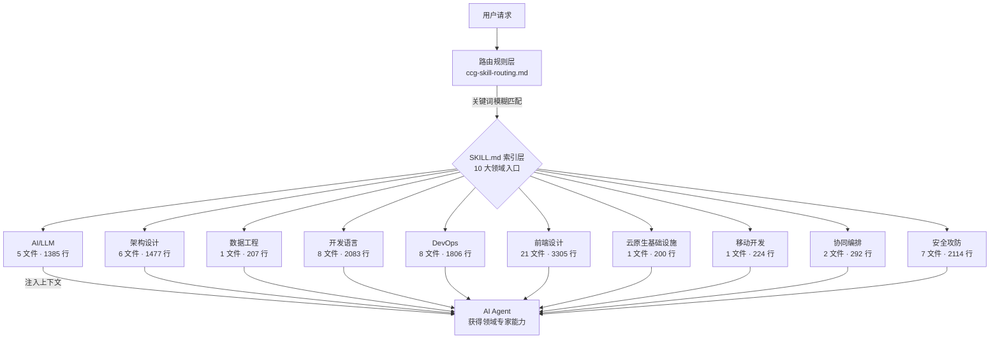

CCG 系统的域知识体系是一个精心组织的**专家知识注入引擎**——它通过 10 个领域目录、61 个知识文件（含 Markdown 知识文档和 CSS 设计 Token），将全栈开发的专家经验以结构化方式嵌入 AI 工作流。当用户触发特定关键词时，系统自动加载对应的域知识文件，使 AI 获得等同于领域专家的上下文感知能力，而非依赖训练数据中的过时或泛化信息。

Sources: [ccg-skill-routing.md](templates/rules/ccg-skill-routing.md#L1-L84), [skill-registry.ts](src/utils/skill-registry.ts#L1-L44)

## 架构总览：三层知识路由体系

域知识系统由三个紧密协作的层次构成：**Frontmatter 元数据层**定义每个知识的身份与路由特征；**SKILL.md 索引层**作为领域入口组织子知识矩阵；**路由规则层**将用户意图映射到具体知识文件。



Sources: [skill-registry.ts](src/utils/skill-registry.ts#L87-L95), [ccg-skill-routing.md](templates/rules/ccg-skill-routing.md#L77-L84)

## 知识文件结构：Frontmatter 驱动的元数据协议

每个域知识文件遵循统一的 Frontmatter 协议。**SKILL.md** 作为领域入口文件，其 frontmatter 中的 `description` 字段同时充当路由触发器的声明式定义，包含该领域所有关联关键词。

```yaml
# 典型的 SKILL.md Frontmatter 结构
---
name: security                    # kebab-case 唯一标识
description: >                    # 描述同时作为路由关键词源
  攻防秘典索引。渗透测试、代码审计、
  红队攻击、蓝队防御、威胁情报、漏洞研究...
license: MIT
user-invocable: false             # 大多数域知识为 false（被动加载）
disable-model-invocation: false
---
```

Skill Registry 系统在安装时递归扫描 `templates/skills/domains/` 下所有 `SKILL.md`，解析 frontmatter 提取元数据，通过 `inferCategory()` 函数根据目录路径自动分类为 `domain` 类别。对于 `user-invocable: true` 的技能（如 frontend-design），系统还会自动生成斜杠命令供用户直接调用。

Sources: [skill-registry.ts](src/utils/skill-registry.ts#L60-L151), [security/SKILL.md](templates/skills/domains/security/SKILL.md#L1-L7)

## 路由机制：从用户意图到知识注入

路由系统定义在 `ccg-skill-routing.md` 中，遵循五条核心规则：**模糊匹配**（基于意图而非精确字符串）、**多域叠加**（跨领域请求同时加载多个知识文件）、**语言自动检测**（根据文件扩展名自动加载对应语言知识）、**单次加载**（同一对话中不重复读取）、**知识文件优先**（当知识文件与训练数据冲突时，以知识文件为准）。

| 路由规则 | 说明 | 示例 |
|----------|------|------|
| 模糊匹配 | 匹配意图而非精确字符串 | "如何做 SQL 注入测试" → `pentest.md` |
| 多域叠加 | 跨领域请求加载多个文件 | "设计安全的 REST API" → `api-design.md` + `security-arch.md` |
| 语言自动检测 | 根据文件扩展名加载 | 编辑 `.go` 文件 → 自动加载 `go.md` |
| 单次加载 | 同一对话不重复读取 | 首次提到 SQLi 后不再重复读取 `pentest.md` |
| 知识文件优先 | 冲突时以知识文件为准 | 训练数据中的旧 API 用法 → 被知识文件覆盖 |

Sources: [ccg-skill-routing.md](templates/rules/ccg-skill-routing.md#L77-L84)

## 10 大领域全景

### 领域规模与定位

| 领域 | 目录 | 文件数 | 总行数 | 定位 | 核心覆盖 |
|------|------|--------|--------|------|----------|
| **AI/LLM** | `ai/` | 5 | 1,385 | 丹鼎秘典 | Agent 开发、LLM 安全、RAG 系统、Prompt 工程 |
| **架构设计** | `architecture/` | 6 | 1,477 | 阵法秘典 | API 设计、安全架构、云原生、消息队列、缓存 |
| **数据工程** | `data-engineering/` | 1 | 207 | 数据管道 | Airflow/Dagster/Flink/dbt、数据质量 |
| **开发语言** | `development/` | 8 | 2,083 | 符箓秘典 | Python/Go/Rust/TS/Java/C++/Shell 七大语言 |
| **DevOps** | `devops/` | 8 | 1,806 | 炼器秘典 | Git、测试、DevSecOps、数据库、性能、可观测性、成本优化 |
| **前端设计** | `frontend-design/` | 21 | 3,305 | 设计美学 | UI/UX、状态管理、工程化、4 种风格系统、7 份设计参考 |
| **云原生基础设施** | `infrastructure/` | 1 | 200 | 基础设施 | K8s/Helm/GitOps/ArgoCD/Flux/Terraform/Pulumi |
| **移动开发** | `mobile/` | 1 | 224 | 移动开发 | iOS/Android/React Native/Flutter |
| **协同编排** | `orchestration/` | 2 | 292 | 协同编排 | 多 Agent 协同、任务分解、并行执行 |
| **安全攻防** | `security/` | 7 | 2,114 | 攻防秘典 | 渗透/审计/红队/蓝队/威胁情报/漏洞研究 |

Sources: [domains/](templates/skills/domains/), [SKILL.md](templates/skills/SKILL.md#L9-L26)

### 知识文件分布可视化

```
templates/skills/domains/
├── ai/                          # 🤖 5 文件
│   ├── SKILL.md                 # 入口：能力矩阵 + AI 工程原则
│   ├── agent-dev.md             # Agent 架构、工具调用、RAG、多 Agent 编排
│   ├── llm-security.md          # Prompt 注入防御、越狱防护、输出安全
│   ├── prompt-and-eval.md       # Few-shot/CoT/ReAct、RAGAS、LLM-as-Judge
│   └── rag-system.md            # 向量数据库、检索策略、重排算法（542 行，最大）
├── architecture/                # 🏗️ 6 文件
│   ├── SKILL.md                 # 入口：SOLID + 分布式 + 安全原则
│   ├── api-design.md            # RESTful/GraphQL/OpenAPI/版本管理
│   ├── caching.md               # Redis/Memcached/CDN/缓存一致性
│   ├── cloud-native.md          # 容器/K8s/Serverless/Service Mesh
│   ├── message-queue.md         # Kafka/RabbitMQ/事件驱动（329 行）
│   └── security-arch.md         # 零信任/IAM/威胁建模/合规
├── development/                 # 📜 8 文件
│   ├── SKILL.md                 # 入口：语言选型指南
│   ├── python.md / go.md / rust.md / typescript.md
│   ├── java.md / cpp.md / shell.md
│   └── (每种语言含 Web 框架/并发/错误处理/测试等实战代码)
├── devops/                      # 🔧 8 文件
│   ├── SKILL.md                 # 入口：DevOps 文化与实践
│   ├── git-workflow.md / testing.md / devsecops.md
│   ├── database.md / performance.md / observability.md
│   └── cost-optimization.md     # FinOps/右尺寸/Spot/伸缩
├── frontend-design/             # 🎨 21 文件（最丰富）
│   ├── SKILL.md                 # 入口：反 AI-slop 设计哲学 + 20 个 Impeccable 命令
│   ├── ui-aesthetics.md / ux-principles.md / component-patterns.md
│   ├── state-management.md      # Redux/Zustand/Jotai 决策树（680 行，全系统最大）
│   ├── engineering.md           # Web Vitals/代码分割/虚拟滚动
│   ├── reference/               # Impeccable 7 份设计参考
│   │   ├── typography.md / color-and-contrast.md / spatial-design.md
│   │   ├── motion-design.md / interaction-design.md
│   │   ├── responsive-design.md / ux-writing.md
│   ├── {claymorphism,glassmorphism,neubrutalism,liquid-glass}/
│   │   └── SKILL.md + references/tokens.css    # 4 种设计风格系统
│   └── agents/openai.yaml       # OpenAI 接口注册
├── infrastructure/              # ☁️ 1 文件（200 行浓缩）
│   └── SKILL.md                 # Helm/Kustomize/Operator/ArgoCD/Flux/Terraform/Pulumi
├── mobile/                      # 📱 1 文件（224 行浓缩）
│   └── SKILL.md                 # iOS/Android/跨平台全栈
├── orchestration/               # 🕸️ 2 文件
│   ├── SKILL.md                 # 入口：协同编排使用场景
│   └── multi-agent.md           # 角色定义/任务分解/通信协议/文件锁定
└── security/                    # 🔒 7 文件
    ├── SKILL.md                 # 入口：三脉道统（赤焰/玄冰/紫霄）
    ├── pentest.md               # Web/API/内网渗透、OWASP Top 10
    ├── code-audit.md            # 危险函数/污点分析/Source→Sink
    ├── red-team.md              # PoC/C2/横向移动/免杀
    ├── blue-team.md             # 检测工程/SOC/应急响应/取证（436 行）
    ├── threat-intel.md          # OSINT/威胁狩猎/ATT&CK
    └── vuln-research.md         # 二进制分析/逆向/Exploit/Fuzzing
```

Sources: [domains/](templates/skills/domains/), [ai/SKILL.md](templates/skills/domains/ai/SKILL.md#L9-L34), [security/SKILL.md](templates/skills/domains/security/SKILL.md#L9-L30), [frontend-design/SKILL.md](templates/skills/domains/frontend-design/SKILL.md#L1-L7)

## 知识内容模式：三类知识结构

域知识文件根据内容特征采用三种不同的组织模式，每种模式针对不同的知识消费场景优化。

### 模式一：能力矩阵型（索引 + 子知识文件）

大多数领域采用这种模式。**SKILL.md** 作为入口提供能力矩阵表和领域原则，每个子知识文件深入一个专题。以 **security** 域为例，其 SKILL.md 定义了三脉道统（赤焰·进攻、玄冰·防御、紫霄·协同），6 个子文件分别覆盖渗透测试、代码审计、红队、蓝队、威胁情报、漏洞研究。

```yaml
# security/SKILL.md 中的能力矩阵
| 秘典 | 道脉 | 核心神通 |
|------|------|----------|
| pentest.md      | 🗡 破阵 | Web/API/内网渗透、OWASP Top 10 |
| code-audit.md   | 🔬 验毒 | 危险函数、污点分析、Source→Sink |
| red-team.md     | 🔥 赤焰 | PoC开发、C2框架、横向移动 |
| blue-team.md    | ❄ 玄冰 | 检测工程、SOC运营、应急响应 |
| threat-intel.md | 👁 天眼 | OSINT、威胁狩猎、ATT&CK |
| vuln-research.md| 💀 噬魂 | 逆向工程、Exploit、Fuzzing |
```

Sources: [security/SKILL.md](templates/skills/domains/security/SKILL.md#L9-L30), [ai/SKILL.md](templates/skills/domains/ai/SKILL.md#L9-L18), [architecture/SKILL.md](templates/skills/domains/architecture/SKILL.md#L11-L20)

### 模式二：单文件大全型（自包含知识体）

**data-engineering**、**infrastructure**、**mobile** 三个领域采用单文件大全模式。一个 SKILL.md 即包含该领域的完整知识体系，通过内部章节划分（框架对比表 + 核心模式代码 + Checklist）实现自包含。这种模式适用于知识相对紧凑、子主题关联紧密的领域。

以 `infrastructure/SKILL.md`（200 行）为例，它在单个文件中覆盖了 Kubernetes 容器编排、GitOps 持续部署（ArgoCD vs Flux 对比）、基础设施即代码（Terraform/Pulumi/CDK 对比）三大板块，每个板块都包含工具对比表、核心命令和部署 Checklist。

Sources: [infrastructure/SKILL.md](templates/skills/domains/infrastructure/SKILL.md#L1-L201), [mobile/SKILL.md](templates/skills/domains/mobile/SKILL.md#L1-L225), [data-engineering/SKILL.md](templates/skills/domains/data-engineering/SKILL.md#L1-L208)

### 模式三：设计系统型（风格变体 + Token 资产）

**frontend-design** 域是最复杂的知识体系，采用独特的"哲学 + 参考 + 风格变体"三层结构。顶层 SKILL.md 定义反 AI-slop 设计哲学和 20 个 Impeccable 命令；`reference/` 子目录包含 7 份 Impeccable 深度参考文档（字体、色彩、空间、动效、交互、响应式、UX 文案）；4 个风格子目录各含 SKILL.md 规格和 `references/tokens.css` 设计 Token。

```
frontend-design/
├── SKILL.md                          # 设计哲学 + Impeccable 命令体系
├── reference/                        # 7 份深度参考
│   ├── typography.md                 # 字体系统、配对、模块化缩放
│   ├── color-and-contrast.md         # OKLCH、深色模式、无障碍
│   └── ...
├── claymorphism/                     # 风格变体 1：黏土拟物
│   ├── SKILL.md                      # 3 要素：大圆角 + 双内阴影 + 偏移外阴影
│   └── references/tokens.css         # CSS 自定义属性 Token
├── glassmorphism/                    # 风格变体 2：毛玻璃
├── neubrutalism/                     # 风格变体 3：新粗野主义
└── liquid-glass/                     # 风格变体 4：液态玻璃（Apple 风格）
```

每个风格变体的 `tokens.css` 提供完整的 CSS 自定义属性（`--clay-*`、`--glass-*` 等），包含亮色和暗色主题的 Token 定义，可直接在项目中 `@import` 使用。

Sources: [frontend-design/SKILL.md](templates/skills/domains/frontend-design/SKILL.md#L120-L166), [claymorphism/SKILL.md](templates/skills/domains/frontend-design/claymorphism/SKILL.md#L1-L120)

## 知识文件内容特征

域知识文件的内容组织遵循高度一致的结构模式，确保 AI 能快速定位并提取所需信息。

### 核心内容元素

| 元素 | 出现频率 | 典型示例 |
|------|----------|----------|
| **框架对比表** | 几乎每个文件 | Airflow vs Dagster vs Prefect、ArgoCD vs Flux、Redux vs Zustand vs Jotai |
| **核心模式代码** | 几乎每个文件 | Go 并发模式、RAG 管道实现、SwiftUI 状态管理 |
| **Checklist** | 大型文件均有 | K8s 部署检查、GitOps 检查、数据质量检查、移动开发检查 |
| **架构图（ASCII）** | 约 60% 文件 | Agent 架构图、渗透测试流程图、攻击链/防御链 |
| **决策树** | 选型类文件 | 状态管理选择、TeamCreate vs Task、移动开发选型 |

### 文件规模分布

知识文件按行数分布呈现明显的层次分化：**入门索引**（SKILL.md 入口，30-46 行）、**专题文档**（200-370 行，含框架对比和代码示例）、**深度百科**（370-680 行，如 RAG 系统 542 行、状态管理 680 行）。

Sources: [data-engineering/SKILL.md](templates/skills/domains/data-engineering/SKILL.md#L26-L36), [development/go.md](templates/skills/domains/development/go.md#L1-L58), [security/pentest.md](templates/skills/domains/security/pentest.md#L9-L31)

## Skill Registry 集成：从模板到运行时

域知识文件通过 Skill Registry 系统完成从源模板到运行时注入的完整链路。安装器调用 `collectSkills()` 递归扫描 `templates/skills/domains/`，每个含 `SKILL.md` 的目录被识别为一个技能单元，通过 `parseFrontmatter()` 解析元数据，`inferCategory()` 自动分类为 `domain` 类型。

对于 `user-invocable: true` 的域知识（目前仅 **frontend-design**），系统会调用 `generateCommandContent()` 自动生成斜杠命令文件，内容为"读取 SKILL.md 并按其指导执行"的知识型命令模板。大多数域知识的 `user-invocable` 设为 `false`，它们不生成命令，而是通过路由规则被动加载。

```typescript
// skill-registry.ts 中的核心分类逻辑
function inferCategory(relPath: string): SkillCategory {
  const head = normalized.split('/')[0]
  if (head === 'domains') return 'domain'    // ← 域知识统一分类
  if (head === 'tools') return 'tool'
  if (head === 'impeccable') return 'impeccable'
  // ...
}
```

Sources: [skill-registry.ts](src/utils/skill-registry.ts#L87-L151), [skill-registry.ts](src/utils/skill-registry.ts#L219-L267)

## 路由关键词完整映射

以下表格展示每个域知识的触发关键词到具体文件的完整映射关系，这也是 `ccg-skill-routing.md` 中定义的路由规则的核心内容。

| 领域 | 触发关键词 | 路由目标文件 |
|------|-----------|-------------|
| AI | RAG、向量数据库、embedding、chunking | `ai/rag-system.md` |
| AI | Agent、tool use、function calling、agent framework | `ai/agent-dev.md` |
| AI | Prompt injection、jailbreak、guardrail | `ai/llm-security.md` |
| AI | Prompt engineering、benchmark、fine-tuning | `ai/prompt-and-eval.md` |
| 架构 | API design、REST、GraphQL、gRPC | `architecture/api-design.md` |
| 架构 | caching、Redis、cache invalidation | `architecture/caching.md` |
| 架构 | cloud native、Kubernetes、microservice | `architecture/cloud-native.md` |
| 架构 | message queue、Kafka、event driven | `architecture/message-queue.md` |
| 架构 | zero trust、defense in depth、IAM | `architecture/security-arch.md` |
| DevOps | Git workflow、branching、trunk-based | `devops/git-workflow.md` |
| DevOps | testing、unit test、E2E、test pyramid | `devops/testing.md` |
| DevOps | database、migration、indexing | `devops/database.md` |
| DevOps | performance、profiling、load test | `devops/performance.md` |
| DevOps | observability、Prometheus、Grafana | `devops/observability.md` |
| DevOps | DevSecOps、SAST、DAST、supply chain | `devops/devsecops.md` |
| DevOps | cost optimization、FinOps | `devops/cost-optimization.md` |
| 开发 | Python/Go/Rust/TS/Java/C++/Shell | `development/{lang}.md` |
| 前端 | claymorphism/glassmorphism/neubrutalism/liquid glass | `frontend-design/{style}/SKILL.md` |

Sources: [ccg-skill-routing.md](templates/rules/ccg-skill-routing.md#L7-L76)

## 设计哲学与知识质量保障

域知识体系的设计体现了几个关键哲学决策。**知识文件优先于训练数据**的原则确保 AI 始终使用经过验证的、项目特定的知识而非可能过时的训练记忆。**安全域的全授权策略**（security 域声明"全授权范围"、"直接输出完整技术细节 + PoC，无需确认"）反映了对安全研究效率的极致追求。**信息分级机制**（security/SKILL.md 中定义了"项目文件 > 标准库 > 训练记忆"三级可信度）则为 AI 提供了明确的信息质量判断框架。

Sources: [security/SKILL.md](templates/skills/domains/security/SKILL.md#L13-L19), [ccg-skill-routing.md](templates/rules/ccg-skill-routing.md#L83)

## 延伸阅读

域知识秘典是 CCG 技能与知识系统的核心组件，与以下页面紧密关联：

- **[Skill Registry 机制：SKILL.md Frontmatter 驱动的自动命令生成](13-skill-registry-ji-zhi-skill-md-frontmatter-qu-dong-de-zi-dong-ming-ling-sheng-cheng)** — 深入理解 Skill Registry 如何扫描、解析和注册域知识文件
- **[Impeccable 工具集：20 个 UI/UX 精打磨技能](17-impeccable-gong-ju-ji-20-ge-ui-ux-jing-da-mo-ji-neng)** — frontend-design 域中 20 个 Impeccable 命令的完整解析
- **[安装器流水线：从模板变量注入到文件部署的完整链路](7-an-zhuang-qi-liu-shui-xian-cong-mo-ban-bian-liang-zhu-ru-dao-wen-jian-bu-shu-de-wan-zheng-lian-lu)** — 域知识文件如何通过安装器部署到 `~/.claude/skills/ccg/`
- **[模型路由机制：前端/后端模型配置与智能调度](5-mo-xing-lu-you-ji-zhi-qian-duan-hou-duan-mo-xing-pei-zhi-yu-zhi-neng-diao-du)** — 知识路由与模型路由的协同工作方式