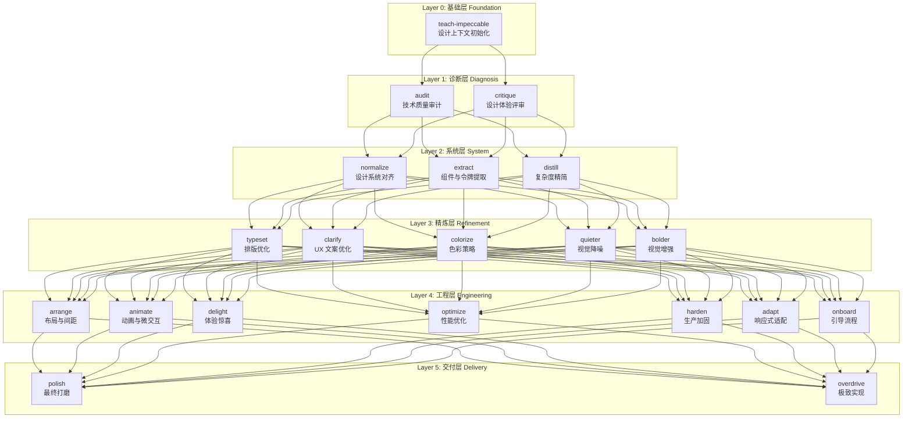
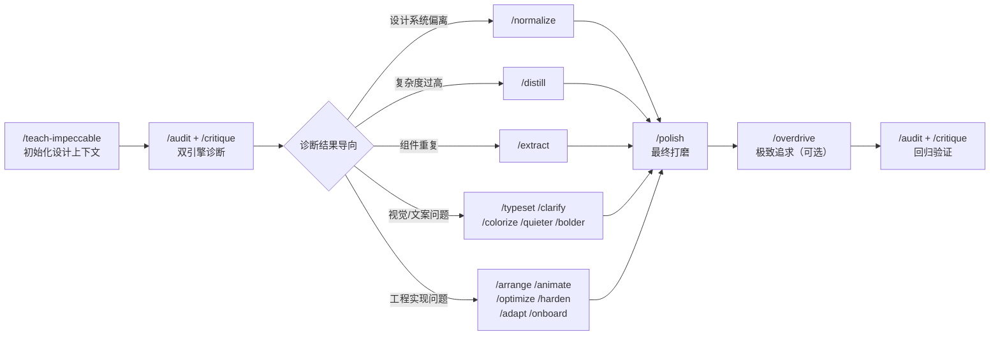

Impeccable 是 CCG 工作流系统中面向前端 UI/UX 精打磨的技能集，包含 **20 个独立、可组合的技能命令**。每个技能聚焦于一个具体的质量维度——从排版到动画、从色彩到性能、从设计审计到生产加固——共同构成一套完整的前端质量提升工具链。它们由 [Skill Registry 机制](13-skill-registry-ji-zhi-skill-md-frontmatter-qu-dong-de-zi-dong-ming-ling-sheng-cheng) 自动扫描 `templates/skills/impeccable/` 目录下的 SKILL.md 文件，提取 frontmatter 元数据后生成斜杠命令，开发者可直接通过 `/impeccable:skill-name` 调用。

Sources: [skill-registry.ts](src/utils/skill-registry.ts#L1-L9), [SKILL.md](templates/skills/SKILL.md#L1-L26)

## 整体架构：五层质量模型

Impeccable 工具集并非随意堆砌的技能列表，而是遵循一套 **五层质量递进模型** 设计。每一层解决不同阶段的设计问题，从建立设计基础到最终交付，形成完整的质量闭环。



**Layer 0（基础层）** 的 `teach-impeccable` 是一切技能的前置条件——它通过探索代码库与询问用户，建立项目的 `## Design Context` 设计上下文并持久化到 `.impeccable.md` 和可选的 `CLAUDE.md`，为后续所有技能提供统一的设计决策依据。**Layer 1（诊断层）** 提供两个审计工具：`audit` 从技术维度（可访问性、性能、主题、响应式、反模式）生成 0-20 分的量化报告，`critique` 从体验维度（Nielsen 十大可用性启发式）生成 0-40 分的设计健康评分，两者互为补充。**Layer 2（系统层）** 负责设计系统层面的对齐与简化。**Layer 3（精炼层）** 聚焦于视觉与文案层面的精细化调整。**Layer 4（工程层）** 处理布局、动画、性能、响应式等工程实现细节。**Layer 5（交付层）** 则在最终发布前进行打磨或追求极致表现。

Sources: [teach-impeccable/SKILL.md](templates/skills/impeccable/teach-impeccable/SKILL.md#L1-L72), [audit/SKILL.md](templates/skills/impeccable/audit/SKILL.md#L1-L28), [critique/SKILL.md](templates/skills/impeccable/critique/SKILL.md#L1-L15)

## 20 个技能全览

下表列出全部 20 个技能的核心定位、触发场景与命令格式，便于快速定位所需工具。

| # | 命令 | 层级 | 核心定位 | 典型触发场景 |
|---|------|------|----------|-------------|
| 1 | `/impeccable:teach-impeccable` | 基础 | 一次性初始化项目设计上下文 | 项目首次使用 Impeccable |
| 2 | `/impeccable:audit` | 诊断 | 技术质量审计，生成 0-20 量化评分 | "做个 accessibility check" / "性能审查" |
| 3 | `/impeccable:critique` | 诊断 | 设计体验评审，Nielsen 启发式评分 | "review 下这个设计" / "评估下用户体验" |
| 4 | `/impeccable:normalize` | 系统 | 将 UI 对齐到设计系统标准 | "和设计系统不一致" / "design drift" |
| 5 | `/impeccable:extract` | 系统 | 提取可复用组件与 Design Token | "创建组件" / "build a design system" |
| 6 | `/impeccable:distill` | 系统 | 剥离不必要复杂度，简化设计 | "简化" / "declutter" / "太复杂了" |
| 7 | `/impeccable:typeset` | 精炼 | 优化字体、层级与排版细节 | "字体" / "readability" / "text hierarchy" |
| 8 | `/impeccable:clarify` | 精炼 | 改善 UX 文案、错误信息与微文案 | "文案不清楚" / "bad error messages" |
| 9 | `/impeccable:colorize` | 精炼 | 策略性地引入色彩与暖度 | "太灰了" / "需要更多颜色" |
| 10 | `/impeccable:quieter` | 精炼 | 降噪：降低视觉强度，提升精致感 | "太刺眼" / "overwhelming" / "too bold" |
| 11 | `/impeccable:bolder` | 精炼 | 增强：提升视觉冲击力与个性 | "太平淡" / "generic" / "lacks personality" |
| 12 | `/impeccable:arrange` | 工程 | 改善布局、间距与视觉节奏 | "layout 感觉不对" / "spacing issues" |
| 13 | `/impeccable:animate` | 工程 | 添加有目的的动画与微交互 | "加动画" / "micro-interactions" |
| 14 | `/impeccable:delight` | 工程 | 注入惊喜、个性与愉悦时刻 | "make it fun" / "add personality" |
| 15 | `/impeccable:optimize` | 工程 | 诊断与修复 UI 性能问题 | "卡顿" / "bundle size" / "load time" |
| 16 | `/impeccable:harden` | 工程 | 加固边界情况、错误处理与国际化 | "production-ready" / "edge cases" |
| 17 | `/impeccable:adapt` | 工程 | 跨设备/跨平台响应式适配 | "responsive design" / "mobile layouts" |
| 18 | `/impeccable:onboard` | 工程 | 设计引导流程与空状态体验 | "onboarding" / "empty states" |
| 19 | `/impeccable:polish` | 交付 | 最终质量通行：对齐、间距、一致性 | "polish" / "finishing touches" |
| 20 | `/impeccable:overdrive` | 交付 | 追求极致：着色器、物理引擎、60fps | "wow" / "go all-out" / "extraordinary" |

Sources: [skill-registry.ts](src/utils/skill-registry.ts#L87-L95), [adapt/SKILL.md](templates/skills/impeccable/adapt/SKILL.md#L1-L6), [overdrive/SKILL.md](templates/skills/impeccable/overdrive/SKILL.md#L1-L6)

## 技能注册与调用机制

每个 Impeccable 技能都由一个独立的 `SKILL.md` 文件定义，存放于 `templates/skills/impeccable/<skill-name>/SKILL.md` 路径下。Skill Registry 在初始化时递归扫描该目录，解析 YAML frontmatter 中的 `name`、`description`、`user-invocable`、`argument-hint` 等字段，为标记了 `user-invocable: true` 的技能自动生成斜杠命令。

关键的分类机制在 `inferCategory()` 函数中实现——当技能的相对路径以 `impeccable/` 开头时，自动归类为 `SkillCategory = 'impeccable'`。这意味着所有 20 个技能共享统一的类别标识，便于在命令生成和技能过滤时批量处理。每个技能的 frontmatter 结构保持一致，以 `adapt` 为例：

```yaml
---
name: adapt
description: "Adapt designs to work across different screen sizes..."
argument-hint: "[target] [context (mobile, tablet, print...)]"
user-invocable: true
---
```

其中 `name` 遵循 kebab-case 命名规范，经 `NAME_SLUG_RE` 正则验证；`argument-hint` 在命令调用时展示给用户，提示参数格式；`user-invocable` 控制是否生成斜杠命令。所有 Impeccable 技能均为 **knowledge 类型**（不含 `scripts/` 目录），其命令内容通过 `generateCommandContent()` 生成，指示 Claude 读取对应的 SKILL.md 文件并按其指导执行。

Sources: [skill-registry.ts](src/utils/skill-registry.ts#L87-L151), [skill-registry.ts](src/utils/skill-registry.ts#L219-L267), [adapt/SKILL.md](templates/skills/impeccable/adapt/SKILL.md#L1-L6)

## 公共协议：MANDATORY PREPARATION

所有 19 个功能性技能（除 `teach-impeccable` 外）都遵循一个统一的 **MANDATORY PREPARATION** 协议。该协议要求技能在执行任何操作之前：

1. **调用 `/frontend-design`**——这是 Impeccable 的上游技能，包含设计原则、反模式和 **Context Gathering Protocol**（上下文收集协议）
2. **遵循上下文收集协议**——如果尚无设计上下文，必须先运行 `/teach-impeccable` 进行一次性初始化
3. **收集额外上下文**——部分技能会在通用协议之上补充特定维度的信息采集

这一设计确保所有技能在执行时都拥有充分的设计上下文，避免在没有品牌调性、用户画像、审美方向等信息的情况下盲目操作。`teach-impeccable` 作为 Layer 0 的基础技能，其输出会持久化到 `.impeccable.md` 文件，成为所有后续技能的共享知识基础。

Sources: [teach-impeccable/SKILL.md](templates/skills/impeccable/teach-impeccable/SKILL.md#L48-L71), [adapt/SKILL.md](templates/skills/impeccable/adapt/SKILL.md#L10-L12), [arrange/SKILL.md](templates/skills/impeccable/arrange/SKILL.md#L10-L12)

## 核心技能深度解析

### 诊断双引擎：audit 与 critique

Impeccable 提供两个互补的诊断工具，分别从 **技术** 和 **体验** 两个视角评估 UI 质量。

**`/impeccable:audit`（技术审计）** 在五个维度上进行代码级扫描，每个维度 0-4 分，总分 0-20：

| 维度 | 检查要点 | 评分标准 |
|------|---------|---------|
| 可访问性 (A11y) | 对比度、ARIA 标签、键盘导航、语义 HTML | 0=不可访问 → 4=接近 WCAG AAA |
| 性能 | 布局抖动、昂贵动画、缺少懒加载、Bundle 大小 | 0=严重问题 → 4=快速精简 |
| 主题 | 硬编码颜色、暗色模式缺陷、Token 一致性 | 0=无主题系统 → 4=完整 Token 体系 |
| 响应式 | 固定宽度、触摸目标、水平滚动、文本缩放 | 0=仅桌面 → 4=全视口流体 |
| 反模式 | AI slop 特征（渐变文字、玻璃态、卡片网格等） | 0=AI slop 画廊 → 4=无 AI 特征 |

审计结果以结构化报告呈现，包含 **健康评分表**、**反模式判定**、**P0-P3 严重级别分类**，以及针对每个问题推荐的具体修复命令。

**`/impeccable:critique`（体验评审）** 则采用设计总监视角，在四个阶段中完成评估：Phase 1 对 10 个维度（AI slop 检测、视觉层级、信息架构、情感旅程、可发现性、构图平衡、排版沟通、有目的的色彩、状态与边界、微文案）进行评审；Phase 2 输出 **Nielsen 十大可用性启发式评分**（每项 0-4 分，总分 0-40），配合 5 类预设用户画像（Alex 力量用户、Jordan 新手、Sam 无障碍用户、Riley 压力测试者、Casey 移动用户）的红旗检测；Phase 3 向用户提出 2-4 个针对性问题；Phase 4 生成优先级排序的行动方案。

Sources: [audit/SKILL.md](templates/skills/impeccable/audit/SKILL.md#L16-L131), [critique/SKILL.md](templates/skills/impeccable/critique/SKILL.md#L16-L200), [heuristics-scoring.md](templates/skills/impeccable/critique/reference/heuristics-scoring.md#L1-L235)

### critique 的参考知识体系

`critique` 技能是 Impeccable 中唯一拥有 **独立参考文件目录** 的技能，位于 `templates/skills/impeccable/critique/reference/` 下，包含三个专业参考文档：

**cognitive-load.md** 建立了基于 Cowan (2001) 修订的 Miller 定律的认知负荷评估框架，区分内在负荷（任务本身的复杂性）、外在负荷（不良设计造成的额外负担）和相关负荷（学习过程中的有效投入）。它提供 **8 项认知负荷检查清单**：单一焦点、分块（≤4 项/组）、分组、视觉层级、逐项聚焦、最小选择（≤4 选项/决策点）、工作记忆跨屏保持、渐进式展示。失败计数 0-1 为低负荷（良好），2-3 为中等，4+ 为严重。

**heuristics-scoring.md** 为 Nielsen 十大可用性启发式提供标准化的 0-4 分评分细则，每项启发式都附带具体的检查要点和评分描述。总分 36-40 为优秀，28-35 为良好，20-27 为可接受，12-19 为较差，0-11 为严重。同时定义了 P0-P3 问题严重性分级体系。

**personas.md** 定义了 5 个用户画像（Alex、Jordan、Sam、Riley、Casey），并为不同界面类型提供了画像选择矩阵——如落地页选 Jordan+Riley+Casey，仪表盘选 Alex+Sam。当项目存在 `## Design Context` 时，还会自动生成 1-2 个项目特定的补充画像。

Sources: [cognitive-load.md](templates/skills/impeccable/critique/reference/cognitive-load.md#L1-L107), [heuristics-scoring.md](templates/skills/impeccable/critique/reference/heuristics-scoring.md#L1-L235), [personas.md](templates/skills/impeccable/critique/reference/personas.md#L1-L179)

### 系统层三技能：normalize、extract、distill

**`/impeccable:normalize`（设计系统对齐）** 的核心操作分为三个阶段：首先 **发现**——搜索项目中的设计系统文档、组件库、样式指南，理解 Token 结构和命名规范；然后 **执行**——在排版、色彩主题、间距布局、组件、动效交互、响应式行为、可访问性、渐进式展示等 8 个维度上系统性地修正偏差；最后 **清理**——合并可复用组件、删除孤立代码、验证质量。

**`/impeccable:extract`（组件与 Token 提取）** 遵循 **Discover → Plan → Extract & Enrich → Migrate → Document** 五步流程。关键判断标准是"是否被使用 3 次以上或很可能被复用"——不提取一次性的、上下文特定的实现，也不创建过于通用到无用的组件。

**`/impeccable:distill`（复杂度精简）** 在信息架构、视觉简化、布局简化、交互简化、内容简化和代码简化 6 个维度上执行"无情编辑"。其核心哲学是"简约不在于移除功能，而在于移除用户与目标之间的障碍"。

Sources: [normalize/SKILL.md](templates/skills/impeccable/normalize/SKILL.md#L1-L71), [extract/SKILL.md](templates/skills/impeccable/extract/SKILL.md#L1-L93), [distill/SKILL.md](templates/skills/impeccable/distill/SKILL.md#L1-L122)

### 精炼层五技能：视觉与文案的微调

**`/impeccable:typeset`（排版优化）** 关注字体选择（拒绝 Inter/Roboto/Open Sans 等隐形默认值）、层级建立（5 种尺寸覆盖大部分需求，使用一致的模数比）、可读性修复（`max-width: 65ch`、行高调整）和细节打磨（`tabular-nums`、`font-kerning`）。特别区分了 **App UI**（固定 `rem` 比例尺）和 **营销/内容页**（`clamp()` 流体尺寸）两种排版策略。

**`/impeccable:clarify`（UX 文案优化）** 系统性覆盖 8 类界面文案：错误消息、表单标签、按钮/CTA、帮助文本、空状态、成功消息、加载状态和确认对话框。每类都提供明确的 Bad/Good 对照示例和优化原则。其六大核心规则是：具体、简洁、主动、人性化、有帮助、一致。

**`/impeccable:colorize`（色彩策略）** 强调 **战略性着色而非彩虹倾泻**，推荐 60/30/10 色彩分配法则，使用 OKLCH 色彩空间实现感知均匀。着色维度涵盖语义色彩（状态指示）、强调色应用（CTA、链接、图标）、背景与表面处理、数据可视化、边框与装饰、排版色彩和装饰元素。

**`/impeccable:quieter`（视觉降噪）** 与 **`/impeccable:bolder`（视觉增强）** 构成一对反向操作。`quieter` 通过降低饱和度（70-85%）、减少字重梯度、增加留白、移除装饰性动效来实现"安静的自信"；`bolder` 则通过极端字号跳跃（3-5 倍差异）、权重对比（900 vs 200）、空间戏剧性、打破网格和意外比例来创造视觉冲击。两个技能都包含一个关键的安全机制——**AI Slop Trap 警告**，明确禁止使用青色/紫色渐变、玻璃态、霓虹点缀等 AI 生成设计的标志性手法，强调"bold 意味着独特，而非更多 AI 效果"。

Sources: [typeset/SKILL.md](templates/skills/impeccable/typeset/SKILL.md#L1-L116), [clarify/SKILL.md](templates/skills/impeccable/clarify/SKILL.md#L1-L184), [colorize/SKILL.md](templates/skills/impeccable/colorize/SKILL.md#L1-L143), [quieter/SKILL.md](templates/skills/impeccable/quieter/SKILL.md#L1-L103), [bolder/SKILL.md](templates/skills/impeccable/bolder/SKILL.md#L1-L117)

### 工程层七技能：从布局到生产的全面覆盖

**`/impeccable:arrange`（布局与间距）** 引入了"眯眼测试"（squint test）概念——如果模糊视线后仍能识别最重要的元素和分组，说明层级设计成功。它指导开发者建立间距系统（语义化 Token 命名如 `--space-xs` 到 `--space-xl`）、创建视觉节奏（紧密分组 8-12px，宽裕分隔 48-96px）、选择正确的布局工具（Flexbox 用于 1D，Grid 用于 2D），并特别反对"一切皆卡片"和"一切居中"的反模式。

**`/impeccable:animate`（动画与微交互）** 按四个层次规划动画：Hero Moment（唯一的标志性动画）、Feedback Layer（交互确认）、Transition Layer（状态平滑）、Delight Layer（惊喜时刻）。提供了精确的时间参数：100-150ms 即时反馈、200-300ms 状态变更、300-500ms 布局变化、500-800ms 入场动画，推荐使用 ease-out-quart/quint/expo 曲线，禁止 bounce/elastic 效果。

**`/impeccable:delight`（体验惊喜）** 定义了四种惊喜策略：微妙精致（奢侈品）、俏皮个性（消费应用）、有帮助的惊喜（效率工具）、感官丰富（创意工具）。惊喜必须满足：快速（<1 秒）、不阻塞核心功能、可跳过、尊重用户时间。特别警告避免"Herding pixels"、"Teaching robots to dance"等陈词滥调的加载文案——这些是 AI slop 的标志性特征。

**`/impeccable:optimize`（性能优化）** 系统性覆盖加载性能（图片、JS Bundle、CSS、字体、加载策略）、渲染性能（避免布局抖动、减少绘制与合成）、动画性能（GPU 加速、60fps）、框架优化（React memo/useMemo/useCallback）和网络优化（请求数、API 优化、慢连接适配），并以 Core Web Vitals（LCP < 2.5s、INP < 200ms、CLS < 0.1）为量化目标。

**`/impeccable:harden`（生产加固）** 是体量最大的技能之一（356 行），覆盖文本溢出处理、国际化（文本膨胀预算 30-40%、RTL 逻辑属性、CJK 字符集）、错误处理（网络/表单/API 错误的分级处理）、边界条件（空状态、加载状态、大数据集、并发操作、权限状态、浏览器兼容性）、输入验证、无障碍韧性、性能韧性等维度。特别强调"为现实加固，而非为演示完美"。

**`/impeccable:adapt`（响应式适配）** 为五种适配场景提供了完整策略：桌面→移动、平板混合方案、移动→桌面、屏幕→打印、网页→邮件。核心观点是"适配不只是缩放，而是为新上下文重新思考体验"。

**`/impeccable:onboard`（引导流程）** 围绕五个原则设计：展示而非告知、尽可能可选、快速到达价值点、上下文优于仪式、尊重用户智慧。覆盖初始产品引导、功能发现与采纳、导览与教程、文档与帮助四种场景，并提供空状态设计的标准模板。

Sources: [arrange/SKILL.md](templates/skills/impeccable/arrange/SKILL.md#L1-L125), [animate/SKILL.md](templates/skills/impeccable/animate/SKILL.md#L1-L175), [delight/SKILL.md](templates/skills/impeccable/delight/SKILL.md#L1-L304), [optimize/SKILL.md](templates/skills/impeccable/optimize/SKILL.md#L1-L267), [harden/SKILL.md](templates/skills/impeccable/harden/SKILL.md#L1-L356), [adapt/SKILL.md](templates/skills/impeccable/adapt/SKILL.md#L1-L200), [onboard/SKILL.md](templates/skills/impeccable/onboard/SKILL.md#L1-L247)

### 交付层双技能：polish 与 overdrive

**`/impeccable:polish`（最终打磨）** 是 Impeccable 工作流的最终关卡，包含一份详尽的 **20 项打磨清单**，覆盖视觉对齐、间距 Token、排版层级、交互状态完整性、60fps 过渡、文案一致性、图标一致性、表单标签、错误/加载/空状态、触摸目标、对比度、键盘导航、焦点指示器、控制台清洁、布局稳定性、浏览器兼容性、减弱动效偏好和代码清洁度。其核心哲学是"polish 是最后一步，不是第一步——不要打磨功能尚未完成的工作"。

**`/impeccable:overdrive（极致实现）** 是整个工具集中最特殊的技能——它要求在开始实现之前 **必须提出 2-3 个不同方向供用户选择**，并通过浏览器自动化工具主动预览和迭代。它按界面类型定义了不同的"wow"标准：视觉/营销页面的感官冲击、功能 UI 的感觉体验、性能关键型 UI 的无感流畅、数据密集型 UI 的流动感。技术工具箱按目标组织：电影级过渡（View Transitions API、`@starting-style`、弹簧物理）、滚动驱动动画、超越 CSS 的渲染（WebGL/WebGPU/Canvas/SVG 滤镜）、数据活力（虚拟滚动、GPU 加速图表）、复杂属性动画（`@property`、Web Animations API）、性能边界（Web Workers、OffscreenCanvas、WASM）。

Sources: [polish/SKILL.md](templates/skills/impeccable/polish/SKILL.md#L1-L204), [overdrive/SKILL.md](templates/skills/impeccable/overdrive/SKILL.md#L1-L142)

## 反 AI Slop 体系：贯穿始终的质量红线

Impeccable 工具集最独特的设计特征是其贯穿所有技能的 **Anti-AI Slop** 检测与防护体系。这不是某个单一技能的功能，而是嵌入在几乎所有技能中的核心价值约束。

**AI Slop 的标志性特征**被明确定义为：青色/紫色渐变、渐变文字、暗色模式配霓虹点缀、玻璃态（glassmorphism）、Hero Metric 大数字布局、千篇一律的卡片网格、通用字体（Inter/Roboto）、弹跳/弹性缓动曲线、陈词滥调的加载文案等。多个技能都包含 `**WARNING - AI SLOP TRAP**` 或类似的醒目警告块。

**检测机制**在 `audit` 和 `critique` 中作为首要检查项——`critique` 的 Phase 1 第一项就是 **AI Slop Detection (CRITICAL)**，判定标准是"如果有人说'这是 AI 做的'，对方会立刻相信吗？如果是，那就是问题所在"。`audit` 的反模式维度直接以 0-4 分量化 AI 特征密度。`bolder` 和 `delight` 等技能在增强效果时也设置了 AI slop 陷阱警告，防止在追求视觉冲击时落入 AI 生成的审美窠臼。

Sources: [audit/SKILL.md](templates/skills/impeccable/audit/SKILL.md#L66-L70), [critique/SKILL.md](templates/skills/impeccable/critique/SKILL.md#L20-L27), [bolder/SKILL.md](templates/skills/impeccable/bolder/SKILL.md#L38-L39), [delight/SKILL.md](templates/skills/impeccable/delight/SKILL.md#L247-L248)

## 技能间的协同工作流

Impeccable 的 20 个技能并非孤立运行，而是设计了明确的 **互荐链路**。`audit` 和 `critique` 在生成报告时，每个问题都会推荐最合适的修复技能，且仅从 Impeccable 的 20 个命令中选择。`critique` 在 Phase 4 的行动方案中按用户优先级排序推荐命令，且始终以 `/polish` 作为最终步骤。

典型的协同工作流如下：



`audit` 和 `critique` 生成的报告中还包含统一的行动号召：*"你可以让我一个一个运行，全部运行，或按任何顺序运行。修复后重新运行 `/audit` 或 `/critique` 查看评分改善。"*

Sources: [audit/SKILL.md](templates/skills/impeccable/audit/SKILL.md#L123-L137), [critique/SKILL.md](templates/skills/impeccable/critique/SKILL.md#L175-L202)

## 每个技能的 NEVER 清单

每个 Impeccable 技能都包含一个 `**NEVER**` 清单——这是该技能的硬性边界，是不可逾越的设计红线。以下是几个最具代表性的约束示例：

| 技能 | 关键 NEVER 规则 |
|------|----------------|
| **animate** | 禁止使用 bounce/elastic 缓动曲线（感觉过时）；禁止动画布局属性（用 transform）；禁止超过 500ms 的反馈动画；禁止忽略 `prefers-reduced-motion` |
| **arrange** | 禁止使用间距系统外的任意值；禁止所有间距相同（差异创造层级）；禁止一切皆卡片；禁止卡片嵌套卡片 |
| **bolder** | 禁止效果无目的随机添加；禁止以审美牺牲可读性；禁止一切皆加粗；禁止 AI slop 审美 |
| **colorize** | 禁止彩虹配色（选 2-4 色）；禁止纯灰色中性色（加色调偏移）；禁止仅依赖颜色传递信息 |
| **delight** | 禁止为核心功能延迟添加惊喜；禁止强制用户通过惊喜时刻；禁止用惊喜掩盖糟糕的 UX |
| **distill** | 禁止移除必要功能；禁止为简约牺牲可访问性；禁止过度简化到不清晰 |
| **overdrive** | 禁止忽略 `prefers-reduced-motion`；禁止在中端设备上导致卡顿；禁止用技术野心掩盖薄弱的设计基础 |
| **polish** | 禁止在功能完成前打磨；禁止在 30 分钟内交付时花数小时打磨 |

这些 NEVER 清单并非装饰性文本，而是 Impeccable 设计哲学的具象化——每个"不做"都对应着一个真实的 AI 生成设计通病或常见的工程错误。

Sources: [animate/SKILL.md](templates/skills/impeccable/animate/SKILL.md#L155-L161), [arrange/SKILL.md](templates/skills/impeccable/arrange/SKILL.md#L104-L113), [bolder/SKILL.md](templates/skills/impeccable/bolder/SKILL.md#L95-L101), [colorize/SKILL.md](templates/skills/impeccable/colorize/SKILL.md#L121-L131), [delight/SKILL.md](templates/skills/impeccable/delight/SKILL.md#L282-L291)

## 延伸阅读

Impeccable 工具集是 CCG 技能体系的一个类别，其注册与命令生成机制依赖于 [Skill Registry 机制：SKILL.md Frontmatter 驱动的自动命令生成](13-skill-registry-ji-zhi-skill-md-frontmatter-qu-dong-de-zi-dong-ming-ling-sheng-cheng)。Impeccable 技能与 [专家提示词体系：13 个角色提示词（Codex 6 + Gemini 7）](14-zhuan-jia-ti-shi-ci-ti-xi-13-ge-jiao-se-ti-shi-ci-codex-6-gemini-7) 中的前端专家提示词协同工作——Impeccable 定义"做什么"，专家提示词定义"以什么角色做"。完成 Impeccable 技能集的了解后，可以继续深入 [质量关卡自动触发规则与验证链](15-zhi-liang-guan-qia-zi-dong-hong-fa-gui-ze-yu-yan-zheng-lian) 了解自动化质量门禁机制，或前往 [MCP 工具集成：ace-tool、ContextWeaver、fast-context 配置与同步](18-mcp-gong-ju-ji-cheng-ace-tool-contextweaver-fast-context-pei-zhi-yu-tong-bu) 了解 Impeccable 技能在实际工具链中的集成方式。