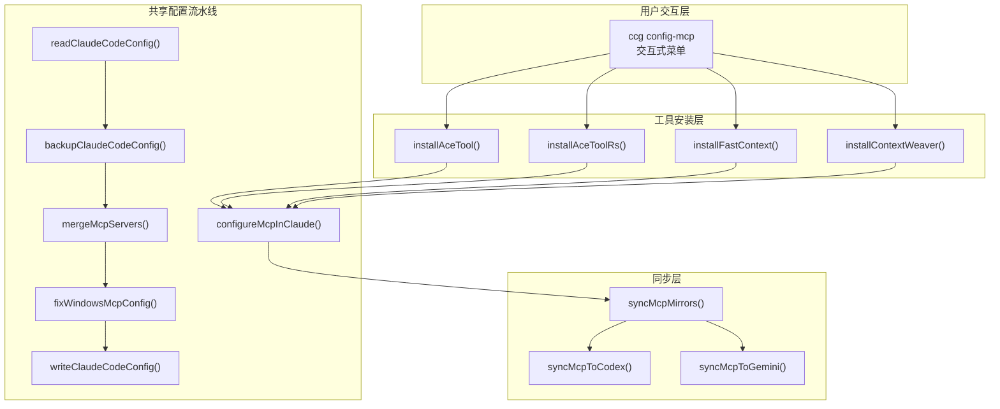
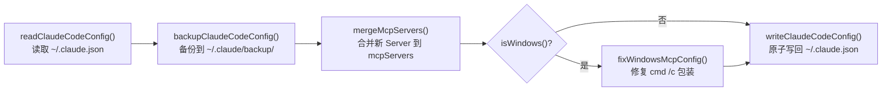
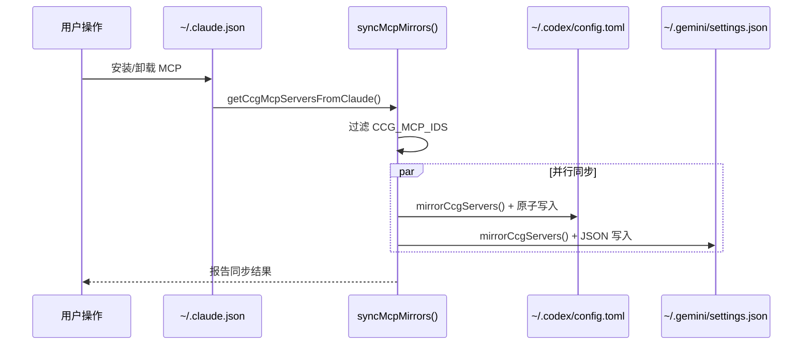
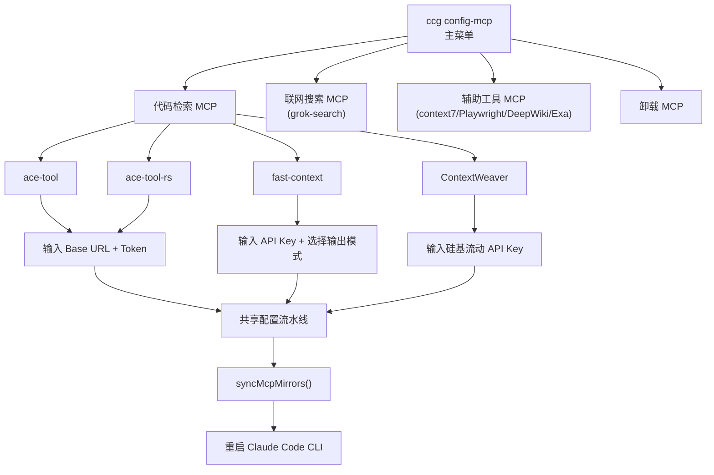

CCG 的 MCP（Model Context Protocol）工具集成层为多模型协作系统提供**代码语义检索**能力。三种代码检索工具——**ace-tool**、**fast-context** 和 **ContextWeaver**——各自使用不同的检索策略，但共享同一条配置流水线：写入 `~/.claude.json` → 自动镜像同步至 Codex 和 Gemini 的配置文件。本文将从架构视角解析这条流水线的设计、三种工具的差异对比、跨客户端同步机制，以及平台兼容性处理。

## 整体架构：配置 → 写入 → 同步三阶段流水线

所有 MCP 工具的安装过程都收敛到同一条共享流水线上。无论用户选择哪种代码检索工具，最终都经过 **读取 → 备份 → 合并 → 平台修复 → 写入 → 同步** 六个步骤：



核心设计原则是**单一写入源（Single Source of Truth）**：`~/.claude.json` 中的 `mcpServers` 字段是所有 MCP 配置的唯一权威来源。Codex 和 Gemini 的配置通过同步机制从 Claude 的配置镜像而来，而非各自独立配置。

Sources: [config-mcp.ts](src/commands/config-mcp.ts#L1-L62), [installer-mcp.ts](src/utils/installer-mcp.ts#L21-L68)

## 三种代码检索工具对比

CCG 提供三种代码检索 MCP 工具，覆盖不同的检索策略和成本需求：

| 维度 | ace-tool | ace-tool-rs | fast-context | ContextWeaver |
|------|----------|-------------|--------------|---------------|
| **检索策略** | Augment Code 语义搜索 | Rust 重写版语义搜索 | Windsurf Fast Context（无需索引） | 本地混合搜索（Embedding + Rerank） |
| **运行方式** | 云端服务（npx 拉取） | 云端服务（npx 拉取） | 云端服务（Windsurf API） | 本地运行 |
| **认证方式** | Token + 可选 Base URL | Token + 可选 Base URL | Windsurf API Key | 硅基流动 API Key |
| **前置依赖** | 无（需第三方中转或官方 Token） | 无（同上） | Windsurf 账号 | npm 全局安装 CLI + API Key |
| **MCP Server ID** | `ace-tool` | `ace-tool`（覆盖安装） | `fast-context` | `contextweaver` |
| **配置复杂度** | 低（仅 Token） | 低（仅 Token） | 低（可自动提取 Key） | 中（需安装 CLI + 配置 .env） |
| **输出模式** | 代码检索结果 | 代码检索结果 | 轻量（路径+行号）/ 完整（含代码片段） | 语义排序的代码片段 |

### ace-tool：基于 Augment Code 的语义检索

ace-tool 是 CCG **首推**的代码检索方案。它基于 Augment Code 的语义搜索能力，通过 `search_context` 接口实现"理解意图"级别的代码定位，而非简单的关键词匹配。安装时需要提供 Token（官方或第三方中转服务），配置过程仅涉及 `npx` 命令的参数拼接：

```typescript
// 构建参数：npx -y ace-tool@latest --base-url <url> --token <token>
const args = ['-y', 'ace-tool@latest']
if (baseUrl) args.push('--base-url', baseUrl)
if (token) args.push('--token', token)
```

Rust 版本（ace-tool-rs）使用 `npx ace-tool-rs` 替代 Node.js 版本，配置会写入同一个 `ace-tool` MCP Server ID，即两者互斥——安装 ace-tool-rs 会覆盖已有的 ace-tool 配置。

Sources: [installer-mcp.ts](src/utils/installer-mcp.ts#L100-L132), [config-mcp.ts](src/commands/config-mcp.ts#L64-L127)

### fast-context：Windsurf 的无索引检索

fast-context 基于 Windsurf 的 Fast Context 技术，**无需为仓库构建索引**即可实现代码检索。它的配置有两个关键参数：

- **`WINDSURF_API_KEY`**：如果本地已安装 Windsurf 并登录，Key 可自动提取；否则需要手动填入
- **`FC_INCLUDE_SNIPPETS`**：控制输出模式——`false`（默认）仅返回文件路径+行号范围（约 2KB），`true` 额外返回代码片段（约 40KB）

fast-context 安装后会触发额外的**提示词注入**步骤（详见下文"提示词注入机制"），将搜索指南写入三个客户端的全局指令文件。

Sources: [installer-mcp.ts](src/utils/installer-mcp.ts#L224-L246), [config-mcp.ts](src/commands/config-mcp.ts#L161-L200)

### ContextWeaver：本地混合搜索

ContextWeaver 是唯一**完全本地运行**的检索方案，采用 Embedding + Rerank 的两阶段混合搜索。它依赖硅基流动（SiliconFlow）的 API 提供 Embedding 和 Rerank 能力，新用户有免费额度。安装过程最为复杂：

1. **全局安装 CLI**：`npm install -g @hsingjui/contextweaver`（失败时尝试 sudo）
2. **创建配置文件**：在 `~/.contextweaver/.env` 写入 Embedding 和 Rerank 的 API 配置
3. **注册 MCP Server**：以 `contextweaver mcp` 命令注册为 stdio 类型

配置文件使用 Qwen3-Embedding-8B（1024 维）作为 Embedding 模型，Qwen3-Reranker-8B 作为重排序模型，均指向硅基流动的 API 端点。

Sources: [installer-mcp.ts](src/utils/installer-mcp.ts#L149-L215)

## 共享配置流水线详解

所有 MCP 工具通过 `configureMcpInClaude()` 共享同一条安装流水线。该函数承担五个职责：**读取** → **备份** → **合并** → **平台修复** → **写入**。



**备份策略**采用时间戳命名：`~/.claude/backup/claude-config-{ISO时间戳}.json`，确保每次修改前都有可回滚的副本。**合并逻辑**使用 `Object.assign` 直接覆盖同 ID 的 MCP Server 配置，意味着重复安装同一工具会自动更新为最新配置。

`McpServerConfig` 接口定义了 MCP Server 的标准结构，支持 `stdio`（命令行进程）和 `sse`（HTTP 服务）两种类型：

```typescript
interface McpServerConfig {
  type: 'stdio' | 'sse'
  command?: string      // stdio 模式的启动命令
  args?: string[]       // 命令参数
  url?: string          // SSE 模式的服务地址
  env?: Record<string, string>  // 环境变量（API Key 等）
  startup_timeout_ms?: number
}
```

`buildMcpServerConfig()` 在此基础上处理 API Key 注入——优先使用 `env` 字段设置环境变量（推荐方式），其次替换 `args` 和 `url` 中的占位符（兼容模式）。

Sources: [mcp.ts](src/utils/mcp.ts#L14-L149), [installer-mcp.ts](src/utils/installer-mcp.ts#L21-L68)

## 跨客户端同步机制：Claude → Codex → Gemini

MCP 同步机制将 Claude 的配置作为**权威源**，镜像传播到 Codex 和 Gemini CLI 的配置文件。这确保了 `/ccg:codex-exec` 和 `/ccg:team-exec` 等命令在调用 Codex 或 Gemini 时，它们同样具备代码检索能力。

### 同步范围：CCG_MCP_IDS 白名单

并非所有 MCP Server 都会被同步。CCG 通过一个硬编码的白名单集合控制同步范围：

```typescript
const CCG_MCP_IDS = new Set([
  'grok-search',      // 联网搜索
  'context7',         // 库文档查询
  'ace-tool',         // ace-tool 代码检索
  'ace-tool-rs',      // Rust 版代码检索
  'contextweaver',    // 本地混合搜索
  'fast-context',     // Windsurf Fast Context
])
```

这意味着用户在 `~/.claude.json` 中自行添加的其他 MCP Server（如自定义工具）**不会被同步**，避免了意外覆盖用户的私有配置。

### 同步目标与格式差异

| 目标 | 配置文件路径 | 格式 | 写入策略 |
|------|-------------|------|---------|
| Claude（源） | `~/.claude.json` | JSON | 直接写入 |
| Codex | `~/.codex/config.toml` | TOML | 过滤 null/undefined 字段后写入 |
| Gemini | `~/.gemini/settings.json` | JSON | 直接写入 |

Codex 使用 TOML 格式，因此同步时需要**字段级过滤**——将 JSON 中的 `null` 和 `undefined` 值移除，避免 TOML 序列化错误。Codex 同步还使用**原子写入**（临时文件 + rename）防止写入过程中断导致的配置损坏。Gemini 则直接使用 `fs.writeJSON` 写入。

### 镜像同步逻辑：添加 + 清理

`mirrorCcgServers()` 执行双向操作：将 Claude 中存在的 CCG Server 同步到目标，同时**清理目标中已不存在于 Claude 的 CCG Server**。这确保了卸载操作也能正确传播——当用户从 Claude 中卸载 ace-tool 后，下次同步会自动从 Codex 和 Gemini 中移除该配置。



Sources: [installer-mcp.ts](src/utils/installer-mcp.ts#L287-L444), [config-mcp.ts](src/commands/config-mcp.ts#L13-L23)

## 提示词注入机制

安装 fast-context 时会触发**提示词注入**——将搜索使用指南写入三个客户端的全局指令文件，引导 AI 优先使用 fast-context 进行代码搜索。这是 CCG 中唯一一个在 MCP 安装时同时注入行为提示词的工具。

### 注入目标

| 目标文件 | 客户端 | 加载方式 |
|---------|--------|---------|
| `~/.claude/rules/ccg-fast-context.md` | Claude Code | rules/ 目录自动加载 |
| `~/.codex/AGENTS.md` | Codex CLI | 全局指令自动加载 |
| `~/.gemini/GEMINI.md` | Gemini CLI | 全局指令自动加载 |

### 标记式注入与清理

注入使用 **HTML 注释标记**（`<!-- CCG-FAST-CONTEXT-START -->` ... `<!-- CCG-FAST-CONTEXT-END -->`）包裹内容。这种方式支持**幂等更新**——重复安装时不会重复追加，而是替换标记之间的已有内容。卸载时则精确移除标记之间的内容，不影响用户自行添加的其他指令。

### 双模式提示词

fast-context 支持两种提示词模式：

- **主模式（`FAST_CONTEXT_PROMPT_PRIMARY`）**：当 fast-context 是唯一检索工具时，要求 AI **优先使用** `mcp__fast-context__fast_context_search`
- **辅助模式（`FAST_CONTEXT_PROMPT_AUXILIARY`）**：当同时安装了 ace-tool 时，fast-context 作为**补充工具**，仅用于语义搜索需求

提示词内容还包含参数调优指南（`tree_depth`、`max_turns`）和禁止行为（如禁止猜测代码位置、禁止跳过搜索直接回答）。

Sources: [installer-prompt.ts](src/utils/installer-prompt.ts#L1-L143)

## 平台兼容性处理

MCP 配置在 Windows 上需要特殊处理。`npx`、`uvx`、`node` 等命令在 Windows 上无法直接作为 stdio 类型的 MCP Server 启动，需要包装为 `cmd /c npx` 形式。

### 命令包装机制

`applyPlatformCommand()` 在 Windows 环境下自动将 `npx`、`uvx`、`node`、`npm`、`pnpm`、`yarn` 等命令包装为 `cmd /c <command>` 格式。该操作具有**幂等性**——如果 `command` 已经是 `cmd`，说明已处理过，直接跳过。

### 配置损坏修复

Windows 环境下可能出现配置损坏的情况，如 args 数组中多余的 `cmd` 前缀或重复的命令名。`repairCorruptedMcpArgs()` 能检测并修复三种典型错误模式：

| 错误模式 | 示例 | 修复方式 |
|---------|------|---------|
| 开头多余的 cmd | `['cmd', '/c', 'npx', ...]` | 移除第一个 `cmd` |
| 重复的命令名 | `['/c', 'npx', 'npx', ...]` | 移除重复项 |
| 两种错误的组合 | `['cmd', '/c', 'npx', 'npx', ...]` | 依次修复 |

用户可通过 `npx ccg-workflow diagnose-mcp` 命令诊断 MCP 配置问题，该命令会检查配置文件是否存在、是否可解析、Windows 命令包装是否正确。如果发现问题，`npx ccg-workflow fix-mcp`（仅 Windows）可自动修复。

Sources: [mcp.ts](src/utils/mcp.ts#L87-L316), [platform.ts](src/utils/platform.ts#L41-L50), [diagnose-mcp.ts](src/commands/diagnose-mcp.ts#L1-L91)

## 交互流程：用户操作路径

用户通过 `npx ccg-workflow menu` 进入交互式 MCP 配置界面。整个配置流程提供四个入口：



每个安装流程在成功后都会自动调用 `syncMcpMirrors()` 将配置同步到 Codex 和 Gemini。卸载操作同样会触发同步，确保移除操作也能正确传播到所有客户端。

Sources: [config-mcp.ts](src/commands/config-mcp.ts#L28-L62)

## 延伸阅读

- 了解 MCP 配置文件在整体安装流程中的位置：[安装器流水线：从模板变量注入到文件部署的完整链路](7-an-zhuang-qi-liu-shui-xian-cong-mo-ban-bian-liang-zhu-ru-dao-wen-jian-bu-shu-de-wan-zheng-lian-lu)
- 了解 TOML 配置中路由相关的设置：[配置系统：TOML 配置文件结构与路由设置](19-pei-zhi-xi-tong-toml-pei-zhi-wen-jian-jie-gou-yu-lu-you-she-zhi)
- 了解 Windows 兼容性的更多细节：[跨平台兼容性：Windows/macOS/Linux 适配策略](21-kua-ping-tai-jian-rong-xing-windows-macos-linux-gua-pei-ce-lue)