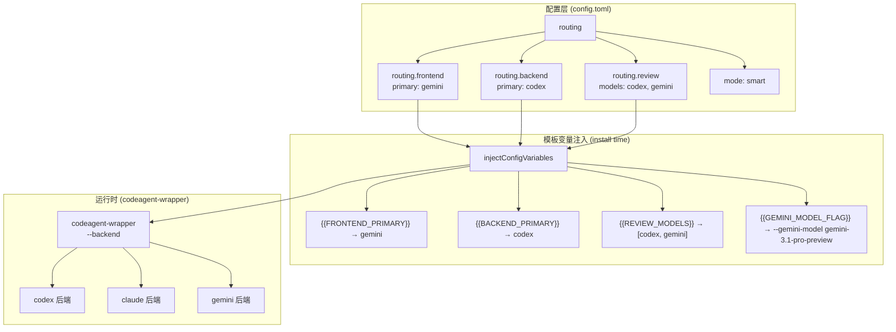
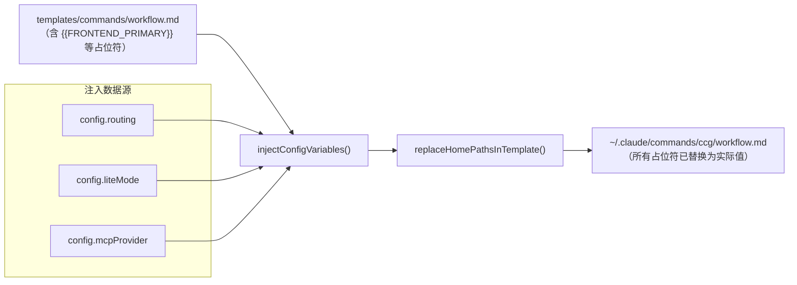
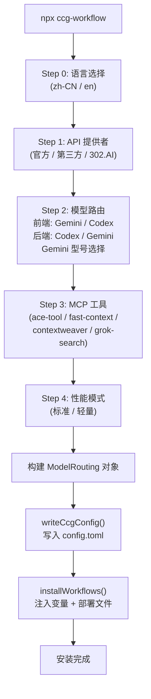

CCG 的配置系统是整个多模型协作架构的"控制面板"——它决定哪个模型负责前端任务、哪个模型处理后端逻辑、使用哪个 MCP 工具进行代码检索、以及是否启用轻量模式。配置以 **TOML 格式**持久化到 `~/.claude/.ccg/config.toml`，在初始化（`npx ccg-workflow`）和更新（`npx ccg-workflow update`）时由用户交互式选定，然后在安装阶段通过模板变量注入机制，将路由决策"烘焙"进每一条斜杠命令的 `.md` 文件中。本文将详细解析配置文件的完整结构、模型路由的三个维度（前端/后端/审查）、模板变量注入管线、以及 Go 二进制如何消费这些配置来调度后端进程。

Sources: [config.ts](src/utils/config.ts#L1-L96), [index.ts](src/types/index.ts#L1-L114)

## 配置文件概览

配置文件存储于 `~/.claude/.ccg/config.toml`（v1.4.0 起统一到此路径，旧版位于 `~/.ccg/`，升级时自动迁移）。文件使用 [smol-toml](https://github.com/squirrelchat/smol-toml) 库进行解析和序列化，确保 TOML 格式的完整兼容性。

Sources: [config.ts](src/utils/config.ts#L8-L10), [migration.ts](src/utils/migration.ts#L24-L34)

### 目录结构

```
~/.claude/
├── .ccg/
│   ├── config.toml          ← 核心配置文件（TOML）
│   ├── prompts/             ← 专家提示词（codex/ gemini/ claude/）
│   └── backup/              ← 配置备份目录
├── commands/ccg/            ← 注入变量后的斜杠命令
├── skills/ccg/              ← 域知识技能文件
├── agents/ccg/              ← Agent 定义文件
├── rules/                   ← 自动触发规则
├── bin/
│   └── codeagent-wrapper    ← Go 二进制（后端进程调度）
└── settings.json            ← Claude Code 全局设置
```

Sources: [config.ts](src/utils/config.ts#L59-L65), [installer.ts](src/utils/installer.ts#L712-L715)

### TOML 配置完整结构

配置由 TypeScript 接口 `CcgConfig` 定义其完整形状。以下展示一个典型的配置文件内容：

```toml
[general]
version = "2.1.0"
language = "zh-CN"
createdAt = "2025-01-15T08:30:00.000Z"

[routing]
mode = "smart"
geminiModel = "gemini-3.1-pro-preview"

[routing.frontend]
models = ["gemini"]
primary = "gemini"
strategy = "fallback"

[routing.backend]
models = ["codex"]
primary = "codex"
strategy = "fallback"

[routing.review]
models = ["codex", "gemini"]
strategy = "parallel"

[workflows]
installed = ["workflow", "plan", "execute", "frontend", "backend", "review", "debug", "optimize", "test", "commit"]

[paths]
commands = "/home/user/.claude/commands/ccg"
prompts = "/home/user/.claude/.ccg/prompts"
backup = "/home/user/.claude/.ccg/backup"

[mcp]
provider = "ace-tool"
setup_url = "https://augmentcode.com/"

[performance]
liteMode = false
skipImpeccable = false
```

Sources: [index.ts](src/types/index.ts#L33-L57), [config.ts](src/utils/config.ts#L43-L75)

### 配置分区详解

| 分区 | 键名 | 类型 | 说明 |
|------|------|------|------|
| `general` | `version` | `string` | 安装时的 CCG 包版本号（semver），用于更新检测 |
| `general` | `language` | `'zh-CN' \| 'en'` | UI 语言，影响初始化向导和提示信息 |
| `general` | `createdAt` | `string` | ISO 8601 时间戳，记录首次安装时间 |
| `routing` | `mode` | `'parallel' \| 'smart' \| 'sequential'` | 协作模式，控制多模型间如何协同 |
| `routing` | `geminiModel` | `string?` | Gemini 具体型号（默认 `gemini-3.1-pro-preview`） |
| `routing.frontend` | `models` | `ModelType[]` | 可用的前端模型列表 |
| `routing.frontend` | `primary` | `ModelType` | 前端主模型，注入到命令模板中 |
| `routing.frontend` | `strategy` | `'parallel' \| 'fallback' \| 'round-robin'` | 前端路由策略 |
| `routing.backend` | `models` / `primary` / `strategy` | 同上 | 后端模型配置 |
| `routing.review` | `models` / `strategy` | 同上 | 审查模型配置（固定 `parallel`） |
| `workflows` | `installed` | `string[]` | 已安装的命令 ID 列表 |
| `paths` | `commands` / `prompts` / `backup` | `string` | 绝对路径，运行时展开 |
| `mcp` | `provider` | `string` | 主 MCP 代码检索工具（`ace-tool` / `fast-context` / `contextweaver` / `skip`） |
| `mcp` | `setup_url` | `string` | MCP 服务配置 URL |
| `performance` | `liteMode` | `boolean?` | 轻量模式：禁用 Web UI，减少日志 |
| `performance` | `skipImpeccable` | `boolean?` | 跳过 Impeccable 前端设计命令安装 |

Sources: [index.ts](src/types/index.ts#L1-L57), [config.ts](src/utils/config.ts#L43-L75)

## 模型路由机制

模型路由是 CCG 配置系统的核心——它决定了每个开发阶段调用哪个 AI 模型。路由配置以三个**正交维度**组织：前端角色、后端角色、审查角色。

Sources: [index.ts](src/types/index.ts#L14-L31)

### 三维路由架构



Sources: [installer-template.ts](src/utils/installer-template.ts#L64-L134), [config.go](codeagent-wrapper/config.go#L66-L81)

### 路由角色与模型映射

| 角色 | 默认主模型 | 职责范围 | 命令模板中的定位 |
|------|-----------|---------|-----------------|
| **前端** (`routing.frontend`) | `gemini` | UI/UX 设计、组件架构、响应式布局、视觉设计 | **前端权威**，后端意见仅供参考 |
| **后端** (`routing.backend`) | `codex` | 业务逻辑、算法实现、API 设计、数据建模、调试 | **后端权威**，可信赖 |
| **审查** (`routing.review`) | `codex` + `gemini` | 代码质量、安全审查、性能审计 | 并行双模型交叉审查 |

初始化时，用户通过交互式向导选择前端和后端的主模型（`init.ts` Step 2/4），审查角色则自动取前端和后端模型的并集（去重）：

```typescript
const routing: ModelRouting = {
  frontend: {
    models: frontendModels,
    primary: frontendModels[0],
    strategy: 'fallback',
  },
  backend: {
    models: backendModels,
    primary: backendModels[0],
    strategy: 'fallback',
  },
  review: {
    models: [...new Set([...frontendModels, ...backendModels])],
    strategy: 'parallel',
  },
  mode,
  geminiModel,
}
```

Sources: [init.ts](src/commands/init.ts#L565-L582)

### 协作模式（CollaborationMode）

`routing.mode` 定义了多模型间的宏观协作策略：

| 模式 | 行为 | 适用场景 |
|------|------|---------|
| `smart` | **默认模式**——Claude 作为编排者，根据任务类型智能选择前端或后端模型 | 通用开发（推荐） |
| `parallel` | 前端和后端模型**始终并行**执行，Claude 汇总结果 | 需要快速获得多视角 |
| `sequential` | 前端和后端模型**串行**执行，后一个可看到前一个的结果 | 需要迭代式优化 |

Sources: [index.ts](src/types/index.ts#L8)

### 路由策略（RoutingStrategy）

每个角色（前端/后端）内部还有独立的 `strategy` 字段，控制该角色下多模型的行为：

| 策略 | 行为 | 触发条件 |
|------|------|---------|
| `fallback` | 依次尝试模型列表中的模型，第一个失败则尝试下一个 | 角色只有 1 个模型（默认） |
| `parallel` | 同时调用所有模型，汇总结果 | 角色有多个模型 |
| `round-robin` | 轮询分配请求给不同模型 | 均衡负载场景 |

Sources: [index.ts](src/types/index.ts#L11)

## 模板变量注入管线

配置到运行时之间有一条关键的**编译时管线**——模板变量注入。这条管线在 `installWorkflows()` 执行时运行，将用户选择的路由配置"烘焙"到每个 `.md` 命令文件中，使得 Claude Code 读取命令时直接获得正确的模型名称，无需运行时查询配置文件。

Sources: [installer-template.ts](src/utils/installer-template.ts#L64-L134), [installer.ts](src/utils/installer.ts#L230-L236)

### 注入变量一览

| 模板变量 | 来源配置 | 注入示例 | 说明 |
|---------|---------|---------|------|
| `{{FRONTEND_PRIMARY}}` | `routing.frontend.primary` | `gemini` | 前端主模型名 |
| `{{FRONTEND_MODELS}}` | `routing.frontend.models` | `["gemini"]` | 前端模型列表（JSON 数组） |
| `{{BACKEND_PRIMARY}}` | `routing.backend.primary` | `codex` | 后端主模型名 |
| `{{BACKEND_MODELS}}` | `routing.backend.models` | `["codex"]` | 后端模型列表（JSON 数组） |
| `{{REVIEW_MODELS}}` | `routing.review.models` | `["codex","gemini"]` | 审查模型列表（JSON 数组） |
| `{{ROUTING_MODE}}` | `routing.mode` | `smart` | 协作模式 |
| `{{GEMINI_MODEL_FLAG}}` | `routing.geminiModel` | `--gemini-model gemini-3.1-pro-preview ` | 仅当使用 Gemini 时注入，否则为空 |
| `{{LITE_MODE_FLAG}}` | `performance.liteMode` | `--lite ` | 仅当启用轻量模式时注入，否则为空 |
| `{{MCP_SEARCH_TOOL}}` | `mcp.provider` | `mcp__ace-tool__search_context` | MCP 工具的完整调用名 |
| `{{MCP_SEARCH_PARAM}}` | `mcp.provider` | `query` | MCP 工具的查询参数名 |

Sources: [installer-template.ts](src/utils/installer-template.ts#L64-L134)

### 注入流程



注入过程分为两步：第一步 `injectConfigVariables()` 替换所有模型路由和 MCP 相关变量；第二步 `replaceHomePathsInTemplate()` 将所有 `~/.claude` 路径替换为当前用户的绝对路径（解决 Windows 多用户和 Git Bash 兼容问题）。

Sources: [installer-template.ts](src/utils/installer-template.ts#L64-L178), [installer.ts](src/utils/installer.ts#L200-L208)

### MCP Provider 注册表

MCP 工具的选择同样通过配置驱动。系统维护一个**Provider 注册表**，添加新的 MCP 提供者只需在注册表中增加一行：

```typescript
const MCP_PROVIDERS: Record<string, { tool: string, param: string }> = {
  'ace-tool':      { tool: 'mcp__ace-tool__search_context',           param: 'query' },
  'ace-tool-rs':   { tool: 'mcp__ace-tool__search_context',           param: 'query' },
  'contextweaver': { tool: 'mcp__contextweaver__codebase-retrieval',   param: 'information_request' },
  'fast-context':  { tool: 'mcp__fast-context__fast_context_search',   param: 'query' },
}
```

当 `mcp.provider` 设置为 `'skip'` 时，注入管线会执行一套特殊的多模式清理逻辑：移除 frontmatter 中的工具声明、替换代码块为手动搜索指引、将行内引用替换为 `Glob + Grep`（MCP 未配置）。

Sources: [installer-template.ts](src/utils/installer-template.ts#L50-L55), [installer-template.ts](src/utils/installer-template.ts#L115-L131)

## 命令模板中的路由体现

注入完成后的命令文件中，路由配置体现在多个位置。以 `/ccg:workflow` 命令为例，可以看到模型名称如何渗透到调用语法、角色描述、提示词路径中：

**调用语法**（注入前 → 注入后）：
```
# 注入前（模板）
"~/.claude/bin/codeagent-wrapper {{LITE_MODE_FLAG}}--progress --backend <{{BACKEND_PRIMARY}}|{{FRONTEND_PRIMARY}}> {{GEMINI_MODEL_FLAG}}- ..."

# 注入后（Gemini 前端 + Codex 后端）
"~/.claude/bin/codeagent-wrapper --progress --backend <codex|gemini> --gemini-model gemini-3.1-pro-preview - ..."
```

**角色提示词路径映射**：

| 阶段 | 后端提示词 | 前端提示词 |
|------|-----------|-----------|
| 分析 | `~/.claude/.ccg/prompts/codex/analyzer.md` | `~/.claude/.ccg/prompts/gemini/analyzer.md` |
| 规划 | `~/.claude/.ccg/prompts/codex/architect.md` | `~/.claude/.ccg/prompts/gemini/architect.md` |
| 审查 | `~/.claude/.ccg/prompts/codex/reviewer.md` | `~/.claude/.ccg/prompts/gemini/reviewer.md` |

Sources: [workflow.md](templates/commands/workflow.md#L1-L189), [frontend.md](templates/commands/frontend.md#L1-L168)

## Go 二进制如何消费配置

`codeagent-wrapper` 二进制本身**不直接读取** TOML 配置文件——它的配置通过 CLI 参数和环境变量传递，而这些参数已由安装阶段的模板注入预先"硬编码"到命令文件中。这种设计使得 Go 二进制保持零配置依赖，只需关注进程调度逻辑。

Sources: [config.go](codeagent-wrapper/config.go#L1-L25)

### CLI 参数解析

Go 二进制通过 `parseArgs()` 函数解析以下关键参数：

| 参数 | 类型 | 说明 | 对应模板变量 |
|------|------|------|------------|
| `--backend <name>` | `string` | 选择后端（`codex` / `claude` / `gemini`） | `{{BACKEND_PRIMARY}}` 或 `{{FRONTEND_PRIMARY}}` |
| `--gemini-model <name>` | `string` | Gemini 具体型号 | `{{GEMINI_MODEL_FLAG}}` |
| `--lite` / `-L` | `flag` | 禁用 Web UI，减少日志 | `{{LITE_MODE_FLAG}}` |
| `--progress` | `flag` | 在 stderr 输出紧凑进度行 | 硬编码在模板中 |
| `--skip-permissions` | `flag` | 跳过权限确认 | 通过 `CODEAGENT_SKIP_PERMISSIONS` 环境变量 |
| `resume <session_id>` | `positional` | 复用已有会话 | 模板中的 `resume $SESSION_ID` |

Sources: [config.go](codeagent-wrapper/config.go#L197-L296)

### 后端注册表

Go 侧通过**后端注册表**（`backendRegistry`）将字符串名称映射到具体的 `Backend` 接口实现：

```go
var backendRegistry = map[string]Backend{
    "codex":  CodexBackend{},
    "claude": ClaudeBackend{},
    "gemini": GeminiBackend{},
}
```

每个后端实现 `Backend` 接口的三个方法：`Name()` 返回名称、`Command()` 返回可执行文件名、`BuildArgs()` 构建参数列表。这种**策略模式**使得添加新后端只需实现接口并注册到表中，无需修改调度逻辑。

Sources: [config.go](codeagent-wrapper/config.go#L66-L81), [backend.go](codeagent-wrapper/backend.go#L13-L17)

### 环境变量配置

除 CLI 参数外，Go 二进制还支持通过环境变量控制行为：

| 环境变量 | 类型 | 默认值 | 说明 |
|---------|------|-------|------|
| `GEMINI_MODEL` | `string` | 空 | Gemini 型号（CLI 参数优先级更高） |
| `CODEAGENT_LITE_MODE` | `boolean` | `false` | 轻量模式（`--lite` 参数优先级更高） |
| `CODEAGENT_SKIP_PERMISSIONS` | `boolean` | `false` | 跳过权限确认 |
| `CODEAGENT_MAX_PARALLEL_WORKERS` | `int` | `0`（无限制） | 并行执行最大工作线程（上限 100） |
| `CODEAGENT_ASCII_MODE` | `boolean` | `false` | ASCII 模式（禁用 Unicode 字符） |

Sources: [main.go](codeagent-wrapper/main.go#L34-L38), [config.go](codeagent-wrapper/config.go#L83-L107), [config.go](codeagent-wrapper/config.go#L298-L318)

## 配置生命周期

### 初始化流程



Sources: [init.ts](src/commands/init.ts#L152-L680)

### 更新流程

更新时（`npx ccg-workflow update`），系统会保留现有配置，仅在用户主动选择时重新配置路由：

1. **版本比对**：检查 `config.toml` 中的 `general.version` 与当前运行版本是否一致
2. **路由重配**（可选）：调用 `askReconfigureRouting()` 显示当前配置，询问是否修改
3. **原子更新**：先备份旧文件（`*.ccg-update-bak`），安装新文件，验证成功后删除备份
4. **失败回滚**：安装失败时自动从备份恢复，确保用户始终有可用的命令文件

Sources: [update.ts](src/commands/update.ts#L21-L88), [update.ts](src/commands/update.ts#L93-L173), [update.ts](src/commands/update.ts#L301-L398)

### 版本迁移

v1.4.0 引入了配置目录的统一迁移，通过 `needsMigration()` 自动检测并执行：

| 迁移路径 | 触发条件 | 操作 |
|---------|---------|------|
| `~/.ccg/` → `~/.claude/.ccg/` | 旧目录存在 | 逐文件复制（不覆盖已存在的文件） |
| `~/.claude/prompts/ccg/` → `~/.claude/.ccg/prompts/` | 旧目录存在 | 整目录移动 |
| 清理旧配置 `_config.md` | `~/.claude/commands/ccg/_config.md` 存在 | 标记为需要迁移 |

Sources: [migration.ts](src/utils/migration.ts#L24-L139)

## 性能配置

### 轻量模式（liteMode）

轻量模式通过 `performance.liteMode = true` 启用，影响两个层面：

- **安装时**：模板变量 `{{LITE_MODE_FLAG}}` 被注入为 `--lite `，影响所有命令中 `codeagent-wrapper` 的调用参数
- **运行时**：Go 二进制检测到 `--lite` 标志后，禁用 SSE WebServer、减少日志输出、缩短消息延迟

Sources: [installer-template.ts](src/utils/installer-template.ts#L109-L111), [main.go](codeagent-wrapper/main.go#L36-L38)

### Impeccable 跳过

`performance.skipImpeccable = true` 控制 Impeccable 前端设计技能命令的安装。设为 `true` 时，`installSkillGeneratedCommands()` 会将 `impeccable` 类别的技能排除在自动命令生成之外。

Sources: [installer.ts](src/utils/installer.ts#L455-L458)

## 配置读取与写入 API

CCG 提供了简洁的配置管理 API，所有配置操作通过 `src/utils/config.ts` 导出：

| 函数 | 签名 | 说明 |
|------|------|------|
| `getCcgDir()` | `() → string` | 返回 `~/.claude/.ccg/` 路径 |
| `getConfigPath()` | `() → string` | 返回配置文件完整路径 |
| `ensureCcgDir()` | `() → Promise<void>` | 确保配置目录存在 |
| `readCcgConfig()` | `() → Promise<CcgConfig \| null>` | 读取并解析 TOML 配置（失败返回 null） |
| `writeCcgConfig()` | `(config) → Promise<void>` | 序列化并写入 TOML 配置 |
| `createDefaultConfig()` | `(options) → CcgConfig` | 根据选项创建默认配置对象 |
| `createDefaultRouting()` | `() → ModelRouting` | 创建默认路由（Gemini 前端 + Codex 后端） |

Sources: [config.ts](src/utils/config.ts#L12-L96)

## 延伸阅读

- [模型路由机制：前端/后端模型配置与智能调度](5-mo-xing-lu-you-ji-zhi-qian-duan-hou-duan-mo-xing-pei-zhi-yu-zhi-neng-diao-du)：深入理解路由策略如何影响多模型协作
- [Backend 抽象层：Codex/Claude/Gemini 后端接口实现](22-backend-chou-xiang-ceng-codex-claude-gemini-hou-duan-jie-kou-shi-xian)：Go 侧 Backend 接口的完整实现细节
- [安装器流水线：从模板变量注入到文件部署的完整链路](7-an-zhuang-qi-liu-shui-xian-cong-mo-ban-bian-liang-zhu-ru-dao-wen-jian-bu-shu-de-wan-zheng-lian-lu)：模板变量注入到文件部署的完整流程
- [MCP 工具集成：ace-tool、ContextWeaver、fast-context 配置与同步](18-mcp-gong-ju-ji-cheng-ace-tool-contextweaver-fast-context-pei-zhi-yu-tong-bu)：MCP Provider 的详细配置与同步机制