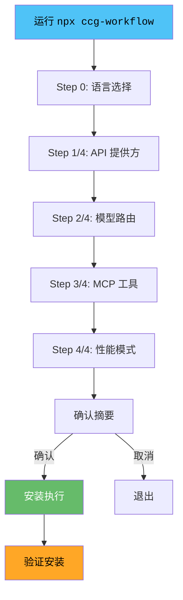
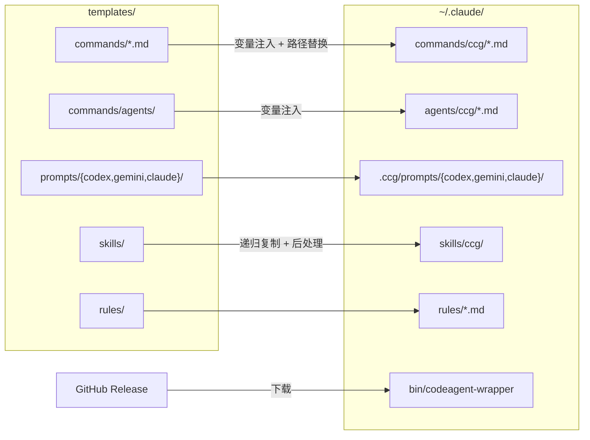

CCG 是一套零配置的多模型协作开发系统——前端任务自动路由至 Gemini，后端任务自动路由至 Codex，Claude 负责编排决策与代码写入。本文将带你从零完成 CCG 的安装与初始化，涵盖前置依赖检查、四种安装模式、四步交互式配置向导，以及安装后的文件布局与验证方法。阅读完本文后，你将能够在 Claude Code 中直接使用 `/ccg:*` 系列斜杠命令。

Sources: [README.zh-CN.md](README.zh-CN.md#L29-L37) · [package.json](package.json#L1-L24)

## 前置条件

在安装 CCG 之前，请确认以下环境依赖已就绪。**Node.js 20+ 和 Claude Code CLI 是硬性依赖**，Codex CLI 和 Gemini CLI 为可选组件——未安装时对应模型的命令仍可运行，只是不会实际调用外部模型。

| 依赖 | 必需 | 版本要求 | 说明 |
|------|:----:|----------|------|
| **Node.js** | ✅ | ≥ 20 | `ora@9.x` 要求，Node 18 会抛出 `SyntaxError` |
| **Claude Code CLI** | ✅ | 最新版 | CCG 的宿主环境，没有它斜杠命令无处运行 |
| **jq** | — | 任意 | v1.7.89+ 后已不再必需（改用 `permissions.allow` 机制） |
| **Codex CLI** | — | 最新版 | 启用后端路由时需要 |
| **Gemini CLI** | — | 最新版 | 启用前端路由时需要 |

Sources: [README.zh-CN.md](README.zh-CN.md#L59-L68)

如果你尚未安装 Claude Code CLI，可以通过 CCG 菜单一键安装：

```bash
npx ccg-workflow menu   # 选择「安装 Claude Code」
```

安装器支持 npm、Homebrew、curl、PowerShell、CMD 等多种安装方式，会自动检测你的系统环境并推荐最合适的方案。

Sources: [README.zh-CN.md](README.zh-CN.md#L95-L99) · [menu.ts](src/commands/menu.ts#L157-L183)

## 安装方式一览

CCG 提供四种安装入口，适用于不同的使用场景：

| 安装方式 | 命令 | 适用场景 |
|----------|------|----------|
| **交互式菜单** | `npx ccg-workflow` | 首次安装、重新配置、切换模型 |
| **直接初始化** | `npx ccg-workflow init` 或 `ccg i` | 快速初始化，跳过菜单 |
| **非交互模式** | `ccg i --skip-prompt` | CI/CD 自动化、脚本集成 |
| **菜单引导** | `npx ccg-workflow menu` | 访问更新、MCP 配置、卸载等全部功能 |

最简单的安装方式只需一行命令：

```bash
npx ccg-workflow
```

首次运行会提示选择语言（简体中文 / English），选择后自动保存至配置文件，后续不再询问。

Sources: [README.zh-CN.md](README.zh-CN.md#L69-L76) · [cli-setup.ts](src/cli-setup.ts#L72-L111) · [init.ts](src/commands/init.ts#L152-L192)

## 四步配置向导详解

运行 `npx ccg-workflow init` 后，系统会引导你完成四个配置步骤。以下是每一步的决策点与推荐选项。



### Step 0：语言选择

首次运行时，系统会询问你的界面语言偏好。选择**简体中文**或 **English** 后，语言设置将保存到 `~/.claude/.ccg/config.toml` 中。后续运行不再询问，但可通过 `--lang` 参数随时切换：

```bash
npx ccg-workflow init --lang en   # 临时切换为英文界面
```

Sources: [init.ts](src/commands/init.ts#L158-L192)

### Step 1/4：API 提供方

此步骤配置 Claude Code 的 API 连接方式。CCG 支持三种 API 来源：

| 选项 | 说明 | 配置项 |
|------|------|--------|
| **官方 API** | 直接连接 Anthropic 官方 | 无需额外配置 |
| **第三方代理** | 自定义 API 端点 | 需输入 URL + API Key |
| **302.AI（赞助商）** | 企业级 API 代理平台 | 需输入 302.AI 的 API Key |

如果选择第三方代理或 302.AI，安装器会将 `ANTHROPIC_BASE_URL` 和 `ANTHROPIC_AUTH_TOKEN` 写入 `~/.claude/settings.json`，同时注入遥测禁用和网络优化等默认环境变量。

Sources: [init.ts](src/commands/init.ts#L238-L287) · [init.ts](src/commands/init.ts#L728-L764)

### Step 2/4：模型路由

这是 CCG 的核心配置——决定前端任务和后端任务分别由哪个模型处理。推荐配置为 **Gemini（前端）+ Codex（后端）**，这也是默认选项。

| 配置项 | 可选项 | 推荐 | 说明 |
|--------|--------|------|------|
| **前端模型** | Gemini、Codex | Gemini | 前端任务（UI、样式、交互）的主力模型 |
| **后端模型** | Gemini、Codex | Codex | 后端任务（API、逻辑、数据）的主力模型 |
| **Gemini 型号** | gemini-3.1-pro-preview、gemini-2.5-flash、自定义 | gemini-3.1-pro-preview | 仅在选择 Gemini 时出现 |

路由配置在安装时通过模板变量注入机制写入每个斜杠命令文件。具体来说，`{{FRONTEND_PRIMARY}}`、`{{BACKEND_PRIMARY}}` 等占位符会被替换为你的实际选择，确保命令在运行时调用正确的模型。

Sources: [init.ts](src/commands/init.ts#L292-L351) · [installer-template.ts](src/utils/installer-template.ts#L64-L134)

### Step 3/4：MCP 工具

CCG 支持同时安装多个 MCP（Model Context Protocol）工具，以增强代码检索和搜索能力。此步骤为多选模式，你可以按需勾选：

| MCP 工具 | 类型 | 说明 | 是否需要 API Key |
|-----------|------|------|:----------------::|
| **ace-tool** | 代码检索 | 基于 Augment 的语义代码搜索 | ✅ |
| **fast-context** | AI 搜索 | Windsurf Fast Context，AI 驱动语义搜索 | 可选 |
| **context7** | 库文档查询 | 开源库文档即时查询 | ❌ 免费 |
| **grok-search** | 联网搜索 | 联网搜索，支持 Tavily + Firecrawl | 可选 |
| **contextweaver** | 嵌入检索 | 硅基流动嵌入检索引擎 | ✅ |

安装器会根据你的选择自动配置对应的 MCP 服务器，并将配置同步至 Codex（`~/.codex/config.toml`）和 Gemini（`~/.gemini/settings.json`）的配置文件中。

Sources: [init.ts](src/commands/init.ts#L353-L518) · [init.ts](src/commands/init.ts#L682-L840)

### Step 4/4：性能模式与 Impeccable 工具集

最后一步决定安装的"重量"：

| 模式 | 说明 |
|------|------|
| **标准模式（Standard）** | 安装全部组件，包括 Web UI 和 Impeccable 前端设计工具集 |
| **轻量模式（Lite）** | 禁用 Web UI，安装包更小，响应更快 |

此外，系统会询问是否安装 **Impeccable 工具集**——这是一套包含 20 个 UI/UX 精打磨技能的高级工具，默认不安装。如果你的项目涉及大量前端精调工作，建议勾选。

Sources: [init.ts](src/commands/init.ts#L523-L562) · [types/index.ts](src/types/index.ts#L53-L56)

## 安装流程的文件部署

确认配置摘要后，安装器会执行以下七个并行部署步骤，将模板文件注入配置变量后写入目标位置：



| 部署步骤 | 源目录 | 目标目录 | 内容 |
|----------|--------|----------|------|
| ① 斜杠命令 | `templates/commands/` | `~/.claude/commands/ccg/` | 29+ 个工作流命令 |
| ② Agent 文件 | `templates/commands/agents/` | `~/.claude/agents/ccg/` | 多 Agent 协作模板 |
| ③ 专家提示词 | `templates/prompts/` | `~/.claude/.ccg/prompts/` | Codex 6 + Gemini 7 + Claude 提示词 |
| ④ 技能文件 | `templates/skills/` | `~/.claude/skills/ccg/` | 质量关卡 + 多 Agent 技能 |
| ⑤ Skill Registry 命令 | `templates/skills/` 中的 SKILL.md | `~/.claude/commands/ccg/` | 自动生成的技能命令 |
| ⑥ 规则文件 | `templates/rules/` | `~/.claude/rules/` | 质量关卡自动触发规则 |
| ⑦ 二进制文件 | GitHub Release 下载 | `~/.claude/bin/` | codeagent-wrapper Go 二进制 |

整个部署过程由 `installWorkflows` 函数统一协调，每个步骤独立执行并收集错误。即使某个步骤失败，其他步骤仍会继续，最终汇总报告。

Sources: [installer.ts](src/utils/installer.ts#L659-L739) · [installer.ts](src/utils/installer.ts#L217-L263) · [installer.ts](src/utils/installer.ts#L354-L429) · [installer.ts](src/utils/installer.ts#L597-L653)

### codeagent-wrapper 二进制下载

`codeagent-wrapper` 是用 Go 编写的进程管理二进制，负责调用 Codex 和 Gemini 后端。安装器采用双源回退策略下载：

1. **Cloudflare CDN**（优先，对中国用户友好，30 秒超时）
2. **GitHub Release**（回退，全球可用，120 秒超时）

每个源最多重试 2 次，优先使用 `curl`（自动读取 `HTTPS_PROXY` 代理配置），curl 不可用时回退到 Node.js `fetch`。如果二进制已存在且版本号匹配，则跳过下载。

Sources: [installer.ts](src/utils/installer.ts#L92-L171) · [installer.ts](src/utils/installer.ts#L597-L653)

### PATH 环境变量配置

二进制安装成功后，安装器会自动将 `~/.claude/bin/` 添加到你的 `PATH` 中：

| 平台 | 配置方式 |
|------|----------|
| **macOS / Linux（zsh）** | 追加 `export PATH` 到 `~/.zshrc` |
| **macOS / Linux（bash）** | 追加 `export PATH` 到 `~/.bashrc` |
| **Windows** | 通过 PowerShell 写入 User 级环境变量 |

如果检测到 PATH 已配置，则跳过重复写入。

Sources: [init.ts](src/commands/init.ts#L908-L972)

## 安装后的目录结构

安装完成后，你的 `~/.claude/` 目录将呈现如下结构：

```
~/.claude/
├── .ccg/                          # CCG 配置与数据目录
│   ├── config.toml                # 主配置文件（路由、语言、MCP 等）
│   └── prompts/                   # 专家提示词
│       ├── codex/                 # Codex 6 个角色提示词
│       ├── gemini/                # Gemini 7 个角色提示词
│       └── claude/                # Claude 提示词
├── commands/ccg/                  # 斜杠命令（/ccg:*）
│   ├── workflow.md
│   ├── plan.md
│   ├── execute.md
│   ├── frontend.md
│   ├── backend.md
│   └── ...（29+ 个命令文件）
├── agents/ccg/                    # Agent 协作模板
├── skills/ccg/                    # 技能文件（质量关卡 + 多 Agent）
├── rules/                         # 全局规则
│   ├── ccg-skills.md              # 质量关卡触发规则
│   └── ccg-skill-routing.md       # 技能路由规则
├── bin/
│   └── codeagent-wrapper          # Go 二进制（进程管理器）
└── settings.json                  # Claude Code 设置（权限 + API 配置）
```

Sources: [config.ts](src/utils/config.ts#L8-L45) · [installer.ts](src/utils/installer.ts#L712-L724)

### 配置文件说明

CCG 的核心配置存储在 `~/.claude/.ccg/config.toml` 中，采用 TOML 格式：

```toml
[general]
version = "2.1.14"
language = "zh-CN"
createdAt = "2025-01-01T00:00:00.000Z"

[routing]
mode = "smart"
geminiModel = "gemini-3.1-pro-preview"

[routing.frontend]
models = ["gemini"]
primary = "gemini"
strategy = "fallback"

[routing.backend]
models = ["codex"]
primary = "codex"
strategy = "fallback"

[routing.review]
models = ["gemini", "codex"]
strategy = "parallel"

[workflows]
installed = ["workflow", "plan", "execute", ...]

[mcp]
provider = "ace-tool"
setup_url = "https://augmentcode.com/"

[performance]
liteMode = false
skipImpeccable = false
```

Sources: [config.ts](src/utils/config.ts#L43-L75) · [types/index.ts](src/types/index.ts#L34-L57)

## CLI 命令行参数

除了交互式向导，CCG 还支持丰富的命令行参数，适用于自动化场景：

```bash
# 查看帮助
npx ccg-workflow --help

# 非交互模式：使用默认配置安装
npx ccg-workflow init --skip-prompt

# 自定义模型路由
npx ccg-workflow init --frontend gemini --backend codex

# 强制覆盖已有文件
npx ccg-workflow init --force

# 指定安装目录（默认 ~/.claude）
npx ccg-workflow init --install-dir /custom/path/.claude
```

| 参数 | 缩写 | 说明 |
|------|------|------|
| `--lang` | `-l` | 界面语言（zh-CN、en） |
| `--force` | `-f` | 强制覆盖已存在的文件 |
| `--skip-prompt` | `-s` | 跳过所有交互提示，使用默认值 |
| `--skip-mcp` | — | 跳过 MCP 配置（更新时使用） |
| `--frontend` | `-F` | 前端模型列表（逗号分隔） |
| `--backend` | `-B` | 后端模型列表（逗号分隔） |
| `--mode` | `-m` | 协作模式（parallel、smart、sequential） |
| `--workflows` | `-w` | 工作流列表 |
| `--install-dir` | `-d` | 自定义安装目录 |

Sources: [cli-setup.ts](src/cli-setup.ts#L93-L111) · [types/index.ts](src/types/index.ts#L73-L84)

## 验证安装

安装完成后，打开 Claude Code 并输入以下命令进行验证：

```
/ccg:frontend 给登录页加个暗色模式切换按钮
```

如果看到 Gemini 被调用并返回分析结果，说明前端路由配置正确。同理可以测试后端路由：

```
/ccg:backend 为用户表添加邮箱验证字段
```

你也可以通过 CCG 的诊断命令检查 MCP 工具状态：

```bash
npx ccg-workflow diagnose-mcp
```

Sources: [README.zh-CN.md](README.zh-CN.md#L77-L83) · [cli-setup.ts](src/cli-setup.ts#L114-L118)

## 更新与卸载

### 更新

```bash
npx ccg-workflow@latest          # 通过菜单选择「更新」
npx ccg-workflow@latest init --force --skip-prompt   # 强制静默更新
```

更新流程会保留你现有的模型路由和 MCP 配置，仅刷新命令文件、技能文件和二进制。版本迁移（如从 v1.3.x 到 v1.4.0）会自动执行目录结构迁移。

### 卸载

```bash
npx ccg-workflow    # 选择菜单中的「移除 CCG 配置」
```

卸载会清除 `~/.claude/commands/ccg/`、`~/.claude/agents/ccg/`、`~/.claude/skills/ccg/`、`~/.claude/rules/ccg-*.md`、`~/.claude/bin/codeagent-wrapper` 以及 `~/.claude/.ccg/` 目录，但不会删除你的 `~/.claude/settings.json` 或其他非 CCG 文件。

Sources: [installer.ts](src/utils/installer.ts#L760-L853) · [migration.ts](src/utils/migration.ts#L24-L124) · [README.zh-CN.md](README.zh-CN.md#L86-L93)

## 常见问题排查

| 问题 | 原因 | 解决方案 |
|------|------|----------|
| Node 18 报 `SyntaxError` | `ora@9.x` 要求 Node ≥ 20 | 升级到 Node.js 20+ |
| `0 commands installed` | 模板目录未找到（npm 缓存损坏） | `npm cache clean --force && npx ccg-workflow@latest` |
| codeagent-wrapper 下载失败 | 网络问题或代理未配置 | 手动从 [GitHub Release](https://github.com/fission-ai/ccg-workflow/releases/tag/preset) 下载 |
| Windows 上命令不生效 | `~/.claude/bin/` 未加入 PATH | 检查 PowerShell 环境变量，或重启终端 |
| MCP 工具连接超时 | MCP 服务器启动缓慢 | 在 `settings.json` 中设置 `MCP_TIMEOUT: 60000` |

Sources: [installer.ts](src/utils/installer.ts#L551-L591) · [installer.ts](src/utils/installer.ts#L699-L710) · [init.ts](src/commands/init.ts#L743-L747)

## 下一步

安装完成后，建议按以下顺序继续阅读：

- **[依赖环境准备（Node.js、jq、Claude Code、Codex、Gemini CLI）](3-yi-lai-huan-jing-zhun-bei-node-js-jq-claude-code-codex-gemini-cli)** — 深入了解每个依赖的安装细节与版本要求
- **[整体架构设计：Claude 编排 + Codex 后端 + Gemini 前端](4-zheng-ti-jia-gou-she-ji-claude-bian-pai-codex-hou-duan-gemini-qian-duan)** — 理解 CCG 三层架构的设计哲学
- **[斜杠命令体系：29+ 命令分类与模板结构](8-xie-gang-ming-ling-ti-xi-29-ming-ling-fen-lei-yu-mo-ban-jie-gou)** — 了解所有可用命令及其用途