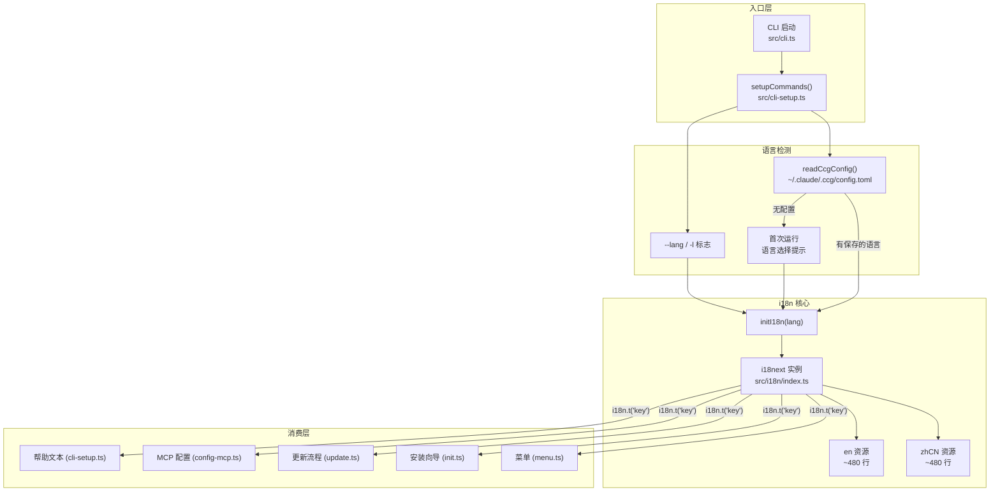
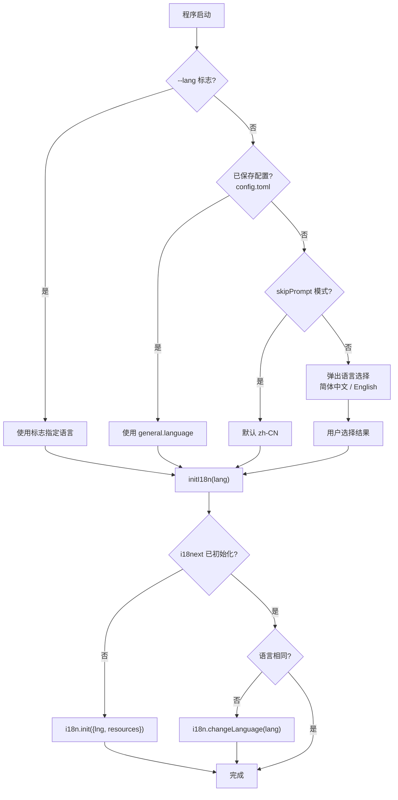

CCG 的国际化系统覆盖 **CLI 界面、交互式菜单、安装向导、更新流程** 的全部用户可见文本。它基于 **i18next** 运行时，采用**单文件内联资源**策略——981 行的翻译文件集中管理中英文两套完整翻译（约 200+ 个 key），通过 `SupportedLang` 类型系统在编译期保证语言标识的类型安全。本文将从架构总览、运行时流程、翻译文件结构、类型系统、文档站点多语言五个维度展开分析。

Sources: [index.ts](src/i18n/index.ts#L1-L982), [index.ts](src/types/index.ts#L1-L2)

## 架构总览

整个 i18n 子系统的核心设计可以用一张图概括：



这套架构的核心决策是**将翻译资源内联到代码中**，而非使用独立 JSON/YAML 文件。这意味着 `src/i18n/index.ts` 既是资源容器，也是运行时 API 的导出点。

Sources: [cli-setup.ts](src/cli-setup.ts#L72-L80), [index.ts](src/i18n/index.ts#L960-L981)

## 语言检测与初始化流程

语言选择遵循一个**三级优先级**链：`CLI 标志 > 已保存配置 > 首次交互提示`。下面是完整的初始化决策流程：



**关键代码路径**体现在 `setupCommands()` 中：程序启动时首先尝试读取 `~/.claude/.ccg/config.toml`，提取 `general.language` 字段作为默认语言；若配置文件不存在（首次运行），则 fallback 到 `zh-CN`。

Sources: [cli-setup.ts](src/cli-setup.ts#L72-L80), [init.ts](src/commands/init.ts#L158-L192), [config.ts](src/utils/config.ts#L24-L35)

## 翻译文件结构与命名空间

翻译文件 `src/i18n/index.ts` 是一个 981 行的单文件，包含两个顶层常量：`zhCN`（第 6–481 行）和 `en`（第 483–958 行）。它们共享相同的嵌套结构，采用**点号分隔的命名空间**寻址（如 `init:mcp.title`）。

### 命名空间层级

| 命名空间 | 行范围 | 用途 | 消费模块 |
|---|---|---|---|
| `common` | 7–31 / 484–508 | 通用操作词（是/否/确认/取消/成功/失败） | 所有模块 |
| `cli` | 32–68 / 509–544 | CLI 帮助文本、命令描述、选项说明 | `cli-setup.ts` |
| `init` | 69–287 / 546–764 | 初始化向导全流程（API/模型/MCP/性能/钩子） | `init.ts` |
| `update` | 288–331 / 765–808 | 更新检查、下载、迁移、重装流程 | `update.ts` |
| `menu` | 332–481 / 809–958 | 主菜单、帮助页、API配置、风格、卸载、工具 | `menu.ts` |

每个命名空间内部采用**语义分组**而非按 UI 页面分组。例如 `init` 命名空间下包含 `init:api`、`init:model`、`init:mcp`、`init:perf`、`init:hooks`、`init:summary`、`init:aceTool`、`init:aceToolRs`、`init:grok`、`init:commands` 等子组，对应安装向导的各个步骤。

Sources: [index.ts](src/i18n/index.ts#L6-L481), [index.ts](src/i18n/index.ts#L483-L958)

### 插值变量

翻译文本中使用 `{{variable}}` 语法进行运行时插值。以下是项目中的关键插值模式：

| 模式 | 示例键 | 中文值 | 英文值 |
|---|---|---|---|
| 版本号 | `update:newVersionFound` | `发现新版本 v{{latest}} (当前: v{{current}})` | `New version v{{latest}} available (current: v{{current}})` |
| 文件路径 | `init:pathConfigured` | `PATH 已添加到 {{file}}` | `PATH has been added to {{file}}` |
| 错误信息 | `update:error` | `更新失败: {{error}}` | `Update failed: {{error}}` |
| 命令提示 | `init:mcp.configLater` | `可稍后运行 {{cmd}} 配置` | `Run {{cmd}} to configure later` |
| 计数 | `update:installed` | `已安装 {{count}} 个命令:` | `Installed {{count}} commands:` |

插值由 i18next 的 `interpolation.escapeValue: false` 配置控制，因为 CLI 输出不需要 HTML 转义。

Sources: [index.ts](src/i18n/index.ts#L960-L976)

## 类型系统与编译期保障

i18n 系统在两个层面提供类型安全：

**语言标识类型**：`SupportedLang = 'zh-CN' | 'en'` 是一个联合类型，在 [types/index.ts](src/types/index.ts#L2) 中定义，贯穿整个配置链——从 `CcgConfig.general.language` 到 `InitOptions.lang`，任何传入无效字符串的地方都会产生编译错误。

**翻译结构类型**：英文翻译常量声明为 `const en: typeof zhCN`，这意味着 TypeScript 编译器会**强制英文翻译与中文翻译的 key 结构完全一致**——遗漏任何一个 key 都会报错，新增 key 时两方必须同步。

Sources: [index.ts](src/types/index.ts#L2), [index.ts](src/i18n/index.ts#L483)

## 运行时 API 设计

`src/i18n/index.ts` 导出三个公共 API：

```typescript
// i18next 实例（用于 i18n.t('key') 调用）
export const i18n = i18next

// 初始化/切换语言（幂等）
export async function initI18n(lang: SupportedLang = 'zh-CN'): Promise<void>

// 显式切换语言
export async function changeLanguage(lang: SupportedLang): Promise<void>
```

`initI18n()` 的设计是**幂等**的：首次调用执行 `i18n.init()` 并加载全部资源；后续调用仅当目标语言与当前语言不同时才执行 `changeLanguage()`。这意味着在整个应用生命周期中，可以安全地多次调用此函数而不会产生副作用。

Sources: [index.ts](src/i18n/index.ts#L4), [index.ts](src/i18n/index.ts#L960-L981), [index.ts](src/index.ts#L6)

### 初始化配置细节

```typescript
await i18n.init({
  lng: lang,           // 目标语言
  fallbackLng: 'en',   // 回退到英文
  resources: {
    'zh-CN': { translation: zhCN, ...zhCN },
    en: { translation: en, ...en },
  },
  interpolation: { escapeValue: false },
})
```

这里有一个微妙但重要的设计：`{ translation: zhCN, ...zhCN }`。展开运算符 `...zhCN` 将顶层命名空间（`common`、`cli`、`init` 等）直接铺到资源根层级，使得 `i18n.t('common:yes')` 和 `i18n.t('init:model.title')` 这样的点号路径能够正确解析。`translation` 键同时存在，兼容 i18next 的默认命名空间查找机制。

Sources: [index.ts](src/i18n/index.ts#L962-L972)

## 语言持久化

用户选择的语言保存在 `~/.claude/.ccg/config.toml` 的 `[general]` 段下：

```toml
[general]
version = "2.1.0"
language = "zh-CN"    # ← 此处持久化
createdAt = "2025-01-01T00:00:00.000Z"
```

配置的读写由 [utils/config.ts](src/utils/config.ts) 中的 `readCcgConfig()` 和 `writeCcgConfig()` 负责，使用 `smol-toml` 库进行 TOML 序列化。语言字段通过 `CcgConfig` 接口的 `general.language: SupportedLang` 类型约束，保证配置层面的类型一致性。

Sources: [config.ts](src/utils/config.ts#L24-L41), [config.ts](src/utils/config.ts#L43-L75), [index.ts](src/types/index.ts#L34-L40)

## 混合 i18n 模式：菜单中的特殊处理

尽管大部分 UI 文本通过 `i18n.t()` 获取，主菜单 (`menu.ts`) 中存在一种**混合模式**：菜单项的描述文本使用 `isZh` 布尔值进行三元表达式硬编码，而非通过翻译系统。例如：

```typescript
const isZh = lang === 'zh-CN'
item('1', i18n.t('menu:options.init'), isZh ? '安装 CCG 工作流' : 'Install CCG workflows'),
```

这里 `i18n.t('menu:options.init')` 返回的是菜单项标签（已通过 i18n），而第三个参数（描述文本）却是直接硬编码的中英文判断。这是一个有意的设计权衡——菜单描述文本是静态的辅助信息，不需要与翻译系统耦合，但这也意味着**添加新语言时需要同时修改 menu.ts 中的硬编码文本**。

Sources: [menu.ts](src/commands/menu.ts#L149-L177)

## 文档站点多语言

除了 CLI 界面的 i18n，项目文档站点也实现了中英文双语支持。VitePress 配置中通过 `locales` 字段定义了两个语言版本：

| 语言 | URL 前缀 | 目录 | 状态栏标签 |
|---|---|---|---|
| 简体中文（默认） | `/` | `docs/` | 简体中文 |
| English | `/en/` | `docs/en/` | English |

中文作为 `root` locale（无路径前缀），英文放在 `en` 子目录下，包含 5 个指南页面和 1 个首页，结构完全镜像 `docs/guide/` 目录。

Sources: [config.mts](docs/.vitepress/config.mts#L15-L116)

## 翻译覆盖率统计

基于代码中实际调用的 `i18n.t('key')` 统计，以下是各命名空间的翻译 key 使用情况：

| 命名空间 | 翻译 key 数量 | 主要消费模块 | 功能覆盖 |
|---|---|---|---|
| `common` | ~15 | 全部模块 | 基础操作词、状态消息 |
| `cli` | ~25 | `cli-setup.ts` | 帮助文本、命令描述 |
| `init` | ~95 | `init.ts` | 4 步安装向导全流程 |
| `update` | ~40 | `update.ts` | 版本检查、下载、迁移 |
| `menu` | ~75 | `menu.ts` | 9 项主菜单 + 5 个子功能 |

总计约 **250 个翻译 key**，中英文各一份，文件总计 981 行。

Sources: [index.ts](src/i18n/index.ts#L1-L981)

## 添加新语言的设计考量

虽然当前仅支持 `zh-CN` 和 `en`，但架构为扩展预留了空间。若要添加新语言（例如日语 `ja`），需要修改以下位置：

1. **类型扩展**：在 `SupportedLang` 联合类型中添加 `'ja'`
2. **翻译资源**：在 `src/i18n/index.ts` 中新增 `const ja: typeof zhCN = { ... }`，类型约束会强制补全所有 key
3. **初始化注册**：在 `initI18n()` 的 `resources` 对象中添加 `'ja': { translation: ja, ...ja }`
4. **菜单硬编码**：修改 `menu.ts` 中所有 `isZh ? ... : ...` 三元表达式（这是当前架构的痛点）
5. **文档站点**：在 VitePress 的 `locales` 中添加 `ja` 配置，并创建 `docs/ja/` 目录

其中第 4 点是架构上的**技术债**——将硬编码的三元判断迁移到翻译系统中（如为菜单描述新增 `menu:descriptions` 命名空间），可以消除添加新语言时对业务代码的侵入。

Sources: [index.ts](src/types/index.ts#L2), [menu.ts](src/commands/menu.ts#L149-L177), [config.mts](docs/.vitepress/config.mts#L15-L116)

## 相关页面

- [配置系统：TOML 配置文件结构与路由设置](19-pei-zhi-xi-tong-toml-pei-zhi-wen-jian-jie-gou-yu-lu-you-she-zhi) — i18n 语言偏好持久化在 TOML 配置中
- [安装器流水线：从模板变量注入到文件部署的完整链路](7-an-zhuang-qi-liu-shui-xian-cong-mo-ban-bian-liang-zhu-ru-dao-wen-jian-bu-shu-de-wan-zheng-lian-lu) — 安装向导的 UI 文本由 i18n 系统驱动
- [跨平台兼容性：Windows/macOS/Linux 适配策略](21-kua-ping-tai-jian-rong-xing-windows-macos-linux-gua-pei-ce-lue) — 跨平台 PATH 配置提示文本由 i18n 管理
- [文档站点：VitePress 文档开发与维护](31-wen-dang-zhan-dian-vitepress-wen-dang-kai-fa-yu-wei-hu) — 文档级多语言路由配置