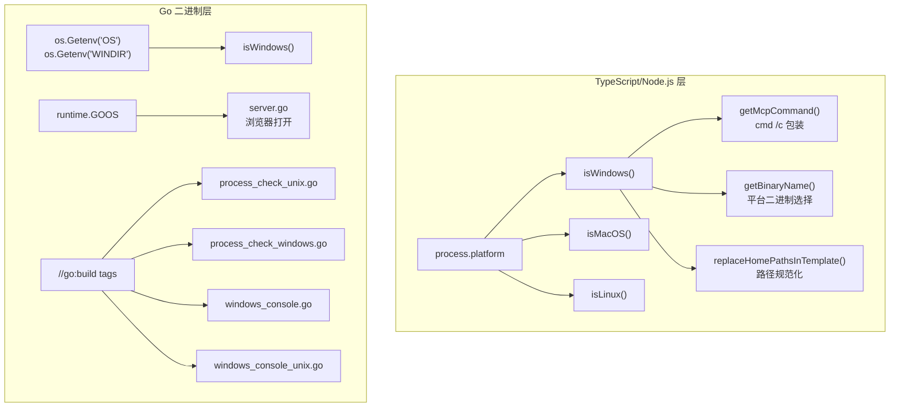
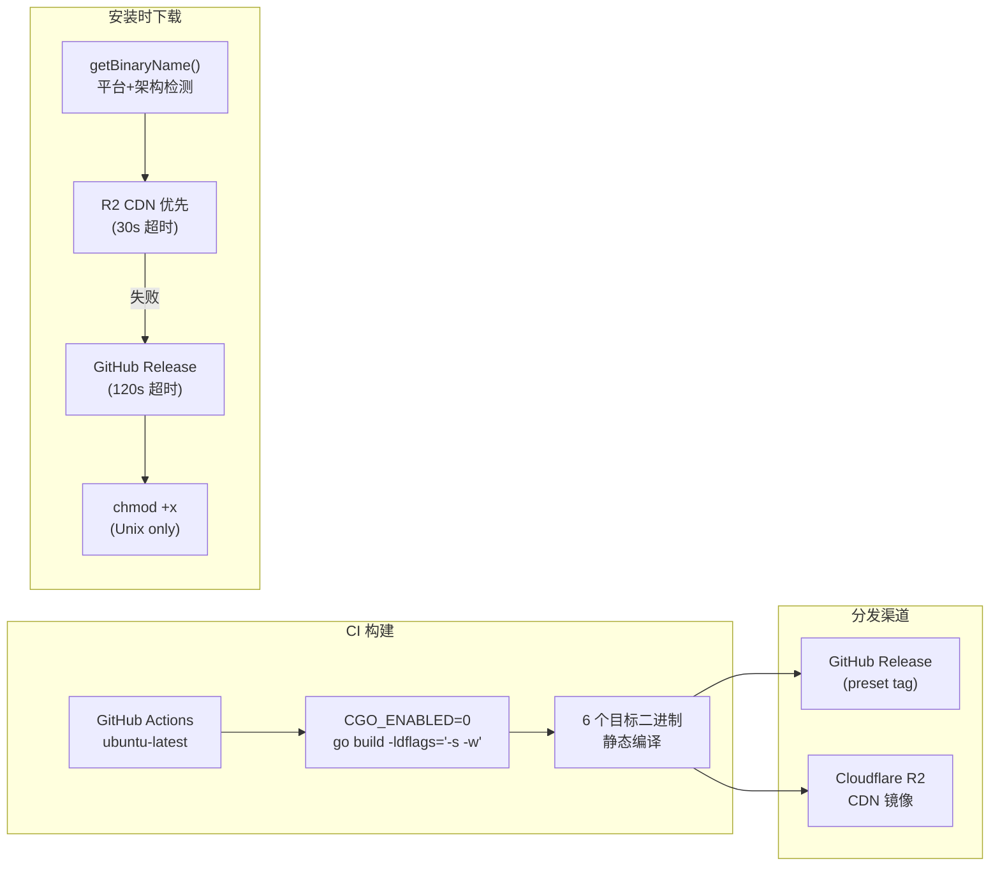

CCG 作为一个同时涉及 **TypeScript/Node.js CLI** 和 **Go 原生二进制**的混合架构项目，需要面对操作系统差异带来的三重挑战：路径表示差异（`\` vs `/`）、进程管理 API 差异（信号 vs Win32 API）以及命令行接口差异（shell vs cmd）。本文档从第一性原理出发，系统性地剖析 CCG 在 TypeScript 层与 Go 层实现的跨平台适配策略，覆盖平台检测、路径规范化、进程生命周期管理、MCP 工具配置和分发构建等关键维度。

Sources: [platform.ts](src/utils/platform.ts#L1-L75), [main.go](codeagent-wrapper/main.go#L70-L72)

## 双层平台检测体系

CCG 在两个独立的运行时环境中分别实现了平台检测，形成 **TypeScript 层 + Go 层** 的双层检测架构。这种分离不是冗余设计，而是因为两层代码运行在不同的进程中——Node.js CLI 负责安装和配置，Go 二进制负责运行时执行。



TypeScript 层通过 `process.platform` 获取精确的平台标识符（`win32`、`darwin`、`linux`），暴露 `isWindows()`、`isMacOS()`、`isLinux()` 三个布尔函数供全局使用。Go 层则采用双轨检测：运行时通过 `os.Getenv("OS") == "Windows_NT"` 或 `os.Getenv("WINDIR")` 判断 Windows 环境，编译期通过 Go build tags（`//go:build windows` / `//go:build !windows`）实现编译级别的平台代码隔离。

Sources: [platform.ts](src/utils/platform.ts#L9-L25), [main.go](codeagent-wrapper/main.go#L70-L72), [process_check_unix.go](codeagent-wrapper/process_check_unix.go#L1-L2), [process_check_windows.go](codeagent-wrapper/process_check_windows.go#L1-L2)

## 路径规范化：三重挑战的统一解法

路径问题是 Windows 兼容性中最棘手的领域。CCG 需要同时处理三种路径格式的冲突：Windows 原生反斜杠 `C:\Users\foo`、Git Bash 的 Unix 风格 `/c/Users/foo`、以及模板中使用的波浪线 `~/.claude`。

### 模板路径替换管线

安装器在将模板文件部署到用户目录时，执行一个严格的路径替换管线，核心原则是 **始终使用正斜杠**：

| 替换阶段 | 模式 | 替换目标 | 跨平台考量 |
|----------|------|----------|-----------|
| 1 | `~/.claude/.ccg` | `~/.claude/.ccg` 绝对路径 | 最长匹配优先，避免部分替换 |
| 2 | `~/.claude/bin/codeagent-wrapper` | 绝对路径 + 平台后缀 | Windows 追加 `.exe` |
| 3 | `~/.claude/bin` | 绝对路径 | 其他二进制引用 |
| 4 | `~/.claude` | 绝对路径 | Claude 配置目录 |
| 5 | `~/` | 用户主目录 | 兜底替换 |

整个管线通过 `toForwardSlash()` 函数将所有反斜杠统一为正斜杠，因为 Git Bash 的 heredoc 会将反斜杠解释为转义字符，而 PowerShell 和 CMD 同样接受正斜杠路径。

Sources: [installer-template.ts](src/utils/installer-template.ts#L140-L178)

### Go 层 Git Bash 路径转换

Go 二进制中处理 `ROLE_FILE:` 指令时，需要将 Git Bash 风格的路径（如 `/c/Users/TJY5/.claude/prompts/codex/reviewer.md`）转换为 Windows 原生路径。`normalizeWindowsPath()` 函数执行两步转换：先将所有反斜杠转为正斜杠，再用正则表达式 `^/([a-zA-Z])/` 匹配 Git Bash 风格路径并提取驱动器号：

```go
// /c/Users/foo → C:/Users/foo
// C:\Users\foo → C:/Users/foo (统一为正斜杠)
// relative/path → relative/path (不变)
```

此函数仅在 `isWindows()` 为真时调用，确保 macOS/Linux 完全不受影响。

Sources: [utils.go](codeagent-wrapper/utils.go#L119-L142), [path_normalization_test.go](codeagent-wrapper/path_normalization_test.go#L1-L60)

## 进程管理：编译级平台隔离

进程管理是 CCG 跨平台适配中架构设计最精巧的部分。Go 通过 **build tags** 实现编译级代码隔离，确保每个平台只编译对应的实现文件，零运行时开销。

### 进程存活检测

| 维度 | Unix (`process_check_unix.go`) | Windows (`process_check_windows.go`) |
|------|------|------|
| **Build Tag** | `//go:build unix \|\| darwin \|\| linux` | `//go:build windows` |
| **存活检测** | `proc.Signal(syscall.Signal(0))` — 零信号探测 | `OpenProcess` + `GetExitCodeProcess` — 检查退出码 |
| **启动时间** | 解析 `/proc/<pid>/stat` 字段 22 | `kernel32.GetProcessTimes` — FILETIME 转换 |
| **启动时间精度** | 依赖 `CLK_TCK`（通常 100 ticks/sec） | 100 纳秒精度（FILETIME 原始精度） |

Unix 实现利用了 Linux proc 文件系统的 `/proc/<pid>/stat` 提供的 52 个字段中的 starttime（字段 22），结合 `/proc/stat` 中的 `btime` 行计算进程绝对启动时间。Windows 实现则通过 `syscall.OpenProcess` 获取进程句柄，调用 `GetProcessTimes` 获取 `FILETIME` 结构，再转换为 Go 的 `time.Time`。

Sources: [process_check_unix.go](codeagent-wrapper/process_check_unix.go#L19-L104), [process_check_windows.go](codeagent-wrapper/process_check_windows.go#L14-L87)

### 进程终止策略

Windows 不支持 POSIX 的 `SIGTERM` 信号——调用 `proc.Signal(syscall.SIGTERM)` 会静默失败，导致 codeagent-wrapper 无限期挂起等待进程退出。CCG 的终止策略采用平台分支设计：

```mermaid
flowchart TD
    A["terminateCommand()"] --> B{isWindows()?}
    B -- Yes --> C["taskkill /T /F /PID<br/>杀死整个进程树"]
    C --> D["hideWindowsConsole()<br/>CREATE_NO_WINDOW=0x08000000"]
    C --> E{"taskkill 失败?"}
    E -- Yes --> F["proc.Kill() 直接杀死"]
    B -- No --> G["proc.Signal(SIGTERM)"]
    G --> H["等待 forceKillDelay 秒"]
    H --> I{"进程仍存活?"}
    I -- Yes --> J["proc.Kill() 强制杀死"]
    I -- No --> K["正常退出"]
```

Windows 使用 `taskkill /T /F /PID` 的 `/T` 标志递归杀死整个进程树——这至关重要，因为 Codex CLI 会派生子进程（如 Node.js worker），这些子进程继承了父进程的 stdout 句柄，如果不终止子树，父进程无法干净退出。同时，`hideWindowsConsole()` 通过设置 `SysProcAttr.CreationFlags = 0x08000000`（`CREATE_NO_WINDOW`）防止 `taskkill` 和 `rundll32` 命令弹出 CMD 窗口。

Sources: [executor.go](codeagent-wrapper/executor.go#L1416-L1474), [windows_console.go](codeagent-wrapper/windows_console.go#L1-L21), [windows_console_unix.go](codeagent-wrapper/windows_console_unix.go#L1-L12)

## Gemini 后端：Windows stdin 管道差异化处理

Gemini CLI 的 `-p` 参数在 Windows 上存在一个关键行为差异：npm 的 `.cmd` 包装器通过 `cmd.exe` 执行命令，而 `cmd.exe` 会在遇到第一个换行符时截断多行参数。这意味着包含换行符的提示词在 Windows 上会被静默截断。

CCG 的解决方案是根据平台选择不同的输入策略：

| 平台 | Gemini 任务文本传递方式 | 原因 |
|------|------------------------|------|
| **macOS/Linux** | 直接通过 `-p` 参数传递 | execve 在 argv 中保留多行文本 |
| **Windows** | 通过 stdin 管道传递，省略 `-p` 标志 | cmd.exe 截断多行 argv |

这一逻辑在 Go 层的两个位置同步实现（`main.go` 的单任务模式和 `executor.go` 的并行模式），通过 `geminiDirect`（Unix 直接传递）和 `geminiStdinPipe`（Windows 管道传递）两个布尔变量控制。

Sources: [executor.go](codeagent-wrapper/executor.go#L859-L871), [main.go](codeagent-wrapper/main.go#L421-L428), [backend.go](codeagent-wrapper/backend.go#L149-L155)

## MCP 工具：Windows 命令包装与自修复

MCP（Model Context Protocol）工具的跨平台适配聚焦于命令执行方式的差异。在 macOS/Linux 上，`npx`、`uvx`、`node` 等命令可以直接作为 `stdio` 类型的 MCP 服务器的 `command` 字段。但在 Windows 上，这些命令必须通过 `cmd /c` 包装，否则 Claude Code 无法正确启动子进程。

### 命令包装机制

`getMcpCommand()` 函数维护了一个需要 Windows 包装的命令列表 `['npx', 'uvx', 'node', 'npm', 'pnpm', 'yarn']`。当检测到 Windows 平台时，将 `npx` 转换为 `['cmd', '/c', 'npx']`，然后由 `applyPlatformCommand()` 将其写入 MCP 配置：

```typescript
// 原始配置
{ command: 'npx', args: ['-y', 'ace-tool@latest'] }
// Windows 包装后
{ command: 'cmd', args: ['/c', 'npx', '-y', 'ace-tool@latest'] }
```

### 自修复管线

由于重复安装或手动编辑可能导致 MCP 配置损坏（如 `['cmd', '/c', 'npx', 'npx', ...]` 中的重复命令），CCG 实现了三层自修复管线：

1. **`repairCorruptedMcpArgs()`** — 修复已知损坏模式：移除开头多余的 `cmd`、检测并移除重复的命令名
2. **`applyPlatformCommand()`** — 幂等地应用平台包装（已处理过的配置会被跳过）
3. **`fixWindowsMcpConfig()`** — 对整个 Claude Code 配置文件中的所有 MCP 服务器执行上述两步

此外，`diagnoseMcpConfig()` 诊断函数可以检测 Windows 上的未包装命令并向用户报告具体问题。

Sources: [platform.ts](src/utils/platform.ts#L41-L50), [mcp.ts](src/utils/mcp.ts#L87-L190), [installer-mcp.ts](src/utils/installer-mcp.ts#L21-L68)

## 6 平台二进制分发矩阵

CCG 的 Go 二进制采用 **交叉编译 + 双源分发** 策略，覆盖 3 个操作系统 × 2 个架构 = 6 个目标平台：

| 二进制文件名 | 操作系统 | 架构 | 大小约 |
|-------------|---------|------|--------|
| `codeagent-wrapper-darwin-amd64` | macOS | Intel x64 | ~8MB |
| `codeagent-wrapper-darwin-arm64` | macOS | Apple Silicon | ~8MB |
| `codeagent-wrapper-linux-amd64` | Linux | x64 | ~8MB |
| `codeagent-wrapper-linux-arm64` | Linux | ARM64 | ~8MB |
| `codeagent-wrapper-windows-amd64.exe` | Windows | x64 | ~8MB |
| `codeagent-wrapper-windows-arm64.exe` | Windows | ARM64 | ~8MB |

### 构建与分发流程



构建使用 `CGO_ENABLED=0` 确保生成纯静态二进制（无 libc 依赖），`-ldflags="-s -w"` 剥离调试符号和 DWARF 信息以减小体积。安装器通过 `getBinaryName()` 自动解析当前平台对应的二进制文件名，采用 **R2 CDN 优先** 的双源降级策略——R2 镜像对中国大陆用户更友好（30 秒超时），失败后回退到 GitHub Release（120 秒超时）。下载完成后，仅在非 Windows 平台执行 `chmod +x` 赋予执行权限。

Sources: [build-binaries.yml](.github/workflows/build-binaries.yml#L22-L73), [build-all.sh](codeagent-wrapper/build-all.sh#L1-L29), [installer.ts](src/utils/installer.ts#L496-L653)

## 安装器：Windows 深层防御

安装器是 CCG 与 Windows 兼容性问题交锋最密集的模块。以下是针对 Windows 特有的防御性设计：

**PACKAGE_ROOT 解析深度扩展**：`findPackageRoot()` 从通常的 5 层增加到 10 层，因为 Windows 的 npm 缓存路径可能非常深（如 `AppData\Local\npm-cache\_npx\<hash>\node_modules\...`），导致向上搜索的层次超出预期。

**文件锁定容错**：技能文件迁移时使用 `fs.move()` 并捕获异常，因为 Windows 上的杀毒软件实时扫描可能导致文件锁定，进而使 move 操作失败。

**安装后验证**：技能文件复制完成后，会验证至少存在一个 `SKILL.md` 文件。如果验证失败，错误信息会提示可能的原因——文件锁定（杀毒软件）、权限不足或路径过长，并建议以管理员权限运行或临时禁用杀毒软件。

**二进制版本追踪**：安装器维护 `EXPECTED_BINARY_VERSION` 常量（当前为 `5.10.0`），与 Go 二进制中的 `version` 常量严格同步。每次安装时，先检查已存在的二进制版本是否匹配，仅在版本不一致时才触发重新下载，避免不必要的网络请求。

Sources: [installer-template.ts](src/utils/installer-template.ts#L15-L42), [installer.ts](src/utils/installer.ts#L61-L653)

## 测试策略：平台条件化验证

CCG 的跨平台测试采用 **条件化执行** 模式，而非模拟平台差异。TypeScript 测试通过 `process.platform` 判断当前环境，执行对应的断言分支——Windows 上验证 `cmd /c` 包装，Unix 上验证透传行为。Go 测试则通过 build tags 确保平台特定的测试文件只在对应平台编译运行。

`path_normalization_test.go` 是跨平台测试的典范——它在任何平台上都能运行，通过提供固定的输入-预期输出来验证路径规范化逻辑，而非依赖实际文件系统状态。测试用例覆盖了 Git Bash 小写驱动器、大写驱动器、Windows 原生反斜杠路径、正斜杠路径、相对路径、Unix 绝对路径和混合分隔符共 7 种场景。

Sources: [platform.test.ts](src/utils/__tests__/platform.test.ts#L1-L80), [path_normalization_test.go](codeagent-wrapper/path_normalization_test.go#L1-L60)

## 相关页面

- [安装器流水线：从模板变量注入到文件部署的完整链路](7-an-zhuang-qi-liu-shui-xian-cong-mo-ban-bian-liang-zhu-ru-dao-wen-jian-bu-shu-de-wan-zheng-lian-lu) — 了解 `getBinaryName()` 和双源下载如何嵌入安装流水线
- [执行器（Executor）：进程生命周期、会话管理与超时控制](23-zhi-xing-qi-executor-jin-cheng-sheng-ming-zhou-qi-hui-hua-guan-li-yu-chao-shi-kong-zhi) — 深入 `terminateCommand()` 和 `killProcessTree()` 的实现细节
- [MCP 工具集成：ace-tool、ContextWeaver、fast-context 配置与同步](18-mcp-gong-ju-ji-cheng-ace-tool-contextweaver-fast-context-pei-zhi-yu-tong-bu) — Windows MCP 命令包装在 MCP 配置中的应用
- [CI/CD 流水线：GitHub Actions 构建与部署](29-ci-cd-liu-shui-xian-github-actions-gou-jian-yu-bu-shu) — 6 平台交叉编译与双源分发的 CI 实现
- [Backend 抽象层：Codex/Claude/Gemini 后端接口实现](22-backend-chou-xiang-ceng-codex-claude-gemini-hou-duan-jie-kou-shi-xian) — Gemini stdin 管道差异化的后端层面设计