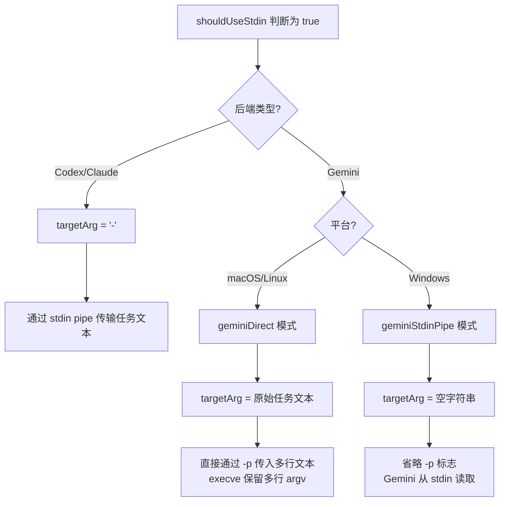
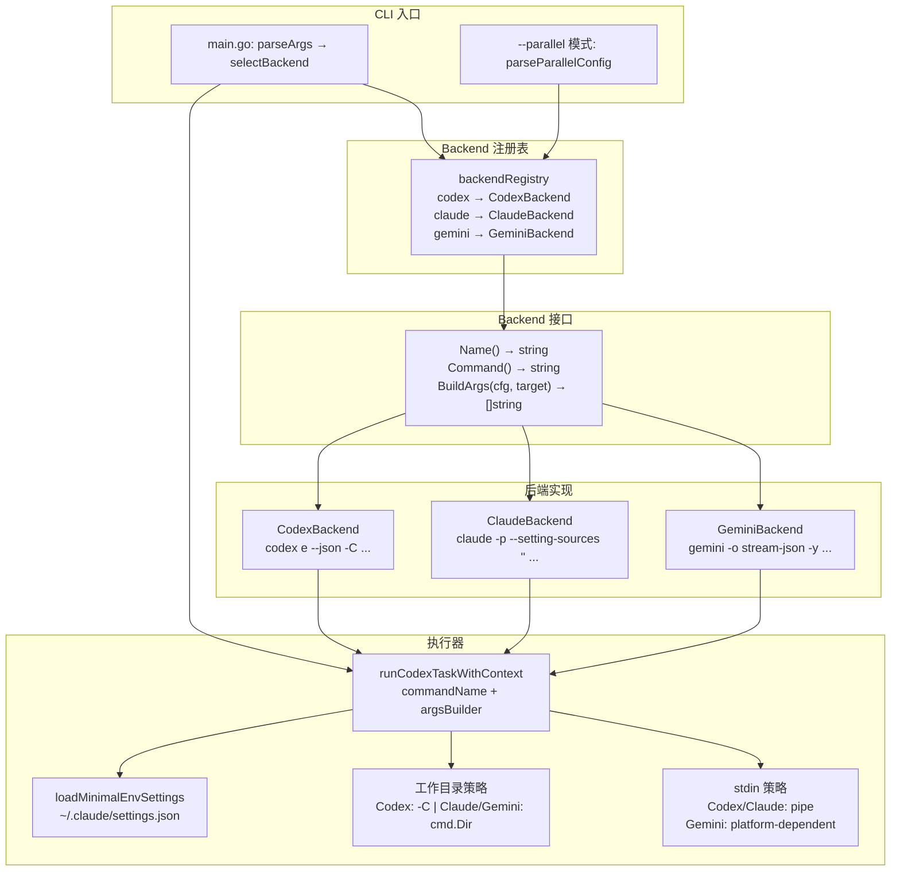

Backend 抽象层是 codeagent-wrapper 二进制的核心多态机制——它将三种 AI CLI 后端（Codex、Claude、Gemini）的调用差异封装在一个统一的 Go 接口背后，使上层执行器无需关心底层命令行参数格式、工作目录策略和平台适配细节。本文将深入解析 `Backend` 接口的设计契约、三种后端的参数构建差异、注册与选择机制，以及跨平台 stdin 处理策略。

Sources: [backend.go](codeagent-wrapper/backend.go#L1-L157), [config.go](codeagent-wrapper/config.go#L1-L81)

## Backend 接口契约

整个抽象层围绕一个极简的三方法接口构建：

```go
type Backend interface {
    Name() string
    BuildArgs(cfg *Config, targetArg string) []string
    Command() string
}
```

**三个方法的职责划分**极为精确：`Name()` 返回后端的逻辑标识符（用于日志和路由），`Command()` 返回实际要执行的系统命令名，`BuildArgs()` 根据运行时配置和任务文本构建完整的命令行参数列表。这种设计将「调用什么」与「怎么调用」完全解耦——上层执行器只看到统一的 `[]string` 参数列表，而后端实现各自处理自己 CLI 的特殊语义。

Sources: [backend.go](codeagent-wrapper/backend.go#L13-L17)

## 三后端实现对比

三个后端结构体——`CodexBackend`、`ClaudeBackend`、`GeminiBackend`——均以零大小空结构体实现，不携带任何状态。所有行为差异完全通过 `BuildArgs` 内部的条件分支来表达。下表系统对比三种后端的核心差异：

| 维度 | Codex | Claude | Gemini |
|------|-------|--------|--------|
| **Command** | `codex` | `claude` | `gemini` |
| **子命令** | `e`（exec） | 无 | 无 |
| **输出格式** | `--json` | `--output-format stream-json --verbose` | `-o stream-json` |
| **审批绕过** | `--dangerously-bypass-approvals-and-sandbox` | `--dangerously-skip-permissions` | `-y`（YOLO mode） |
| **工作目录** | `-C <dir>` 命令行参数 | 通过 `cmd.Dir` 设置（CLI 不支持 -C） | `--include-directories <dir>` + `cmd.Dir` |
| **会话恢复** | `resume <session_id> <task>` | `-r <session_id>` | `-r <session_id>` |
| **模型选择** | 不支持 | 不支持 | `-m <model>` |
| **stdin 模式** | `-` 作为占位符 | `-` 作为占位符 | macOS/Linux: 直接 `-p`；Windows: stdin pipe |

Sources: [backend.go](codeagent-wrapper/backend.go#L19-L157), [executor.go](codeagent-wrapper/executor.go#L757-L799)

### Codex 后端参数构建

Codex 后端的参数构建逻辑位于 `executor.go` 的 `buildCodexArgs` 函数（而非 `backend.go`），这是因为 Codex 作为默认后端，其参数构建逻辑是整个 wrapper 的原始核心，在 Backend 接口引入之前就已存在。关键参数包括：

- **自动审批**：默认添加 `--dangerously-bypass-approvals-and-sandbox`，除非环境变量 `CODEX_REQUIRE_APPROVAL=true`
- **Git 检查跳过**：默认添加 `--skip-git-repo-check`，除非 `CODEX_DISABLE_SKIP_GIT_CHECK=true`
- **恢复模式**：生成 `e --json resume <session_id> <task>` 而非 `e -C <workdir> --json <task>`

```
# 新任务模式
codex e --dangerously-bypass-approvals-and-sandbox --skip-git-repo-check -C /project --json "fix the bug"

# 恢复模式
codex e --dangerously-bypass-approvals-and-sandbox --skip-git-repo-check --json resume sid-abc123 "continue fixing"
```

Sources: [executor.go](codeagent-wrapper/executor.go#L757-L799)

### Claude 后端参数构建

Claude 后端的参数构建在 `backend.go` 中实现，有几个关键设计决策：

- **防递归保护**：强制添加 `--setting-sources ""` 禁用所有设置源（user/project/local），防止 Claude CLI 加载 CLAUDE.md 或 skills 触发 codeagent 自身，形成无限递归
- **权限控制**：仅在 `Config.SkipPermissions` 为 true 时添加 `--dangerously-skip-permissions`
- **输出流**：始终使用 `--output-format stream-json --verbose` 以获得结构化的 JSON 流输出

```
claude -p --setting-sources "" --output-format stream-json --verbose "implement feature X"
claude -p --dangerously-skip-permissions --setting-sources "" -r sid-456 --output-format stream-json --verbose "continue"
```

Sources: [backend.go](codeagent-wrapper/backend.go#L84-L108)

### Gemini 后端参数构建

Gemini 后端拥有最复杂的平台适配逻辑，体现在以下方面：

- **模型参数**：支持通过 `Config.GeminiModel` 或环境变量 `GEMINI_MODEL` 指定模型（如 `gemini-2.5-flash`），CLI 参数优先
- **工作目录隔离**：通过 `--include-directories <dir>` 将项目目录注入 Gemini 的上下文搜索路径，而非将 CWD 设置为项目目录（避免项目 `.env` 覆盖全局 API Key）
- **跨平台 stdin 策略**：当 `targetArg` 为空字符串时（Windows stdin pipe 模式），完全省略 `-p` 标志，让 Gemini 从 stdin 读取

```
# 新任务模式（macOS/Linux）
gemini -o stream-json -y --include-directories /project -p "analyze code"

# 带模型选择
gemini -m gemini-2.5-flash -o stream-json -y --include-directories /project -p "optimize performance"

# Windows stdin pipe 模式（省略 -p）
gemini -o stream-json -y --include-directories /project
```

Sources: [backend.go](codeagent-wrapper/backend.go#L120-L156)

## 注册表与后端选择

后端的注册和查找通过一个简单的 map 注册表实现：

```go
var backendRegistry = map[string]Backend{
    "codex":  CodexBackend{},
    "claude": ClaudeBackend{},
    "gemini": GeminiBackend{},
}
```

`selectBackend` 函数对传入的后端名称进行标准化（小写 + 去空格）后在注册表中查找。空名称默认回退到 `"codex"`。未找到时返回错误。这种 map-based registry 模式使得新增后端只需定义一个实现 `Backend` 接口的结构体并在注册表中添加一行条目。

Sources: [config.go](codeagent-wrapper/config.go#L66-L81)

## 运行时接入流程

后端选择后如何接入执行器是理解整个抽象层的关键。在 `main.go` 的 `run()` 函数中，选择的后端通过**函数变量替换**注入到运行时：

```go
// 选择后端
backend, err := selectBackendFn(cfg.Backend)

// 将后端的 Command 和 BuildArgs 注入到全局函数变量
if backend.Name() != defaultBackendName || !cmdInjected {
    codexCommand = backend.Command()
}
if backend.Name() != defaultBackendName || !argsInjected {
    buildCodexArgsFn = backend.BuildArgs
}
```

这里使用函数变量而非接口注入，是为了保留**测试桩**的注入能力——当测试已经注入了自定义的 `codexCommand` 或 `buildCodexArgsFn` 时，非默认后端的选择才会覆盖它们。

Sources: [main.go](codeagent-wrapper/main.go#L344-L362)

在 `runCodexTaskWithContext`（执行器的核心函数）中，后端接入方式略有不同——它直接接受一个 `Backend` 参数，在函数内部调用 `backend.Command()` 和 `backend.BuildArgs()`：

```go
commandName := codexCommand
argsBuilder := buildCodexArgsFn
if backend != nil {
    commandName = backend.Command()
    argsBuilder = backend.BuildArgs
    cfg.Backend = backend.Name()
}
```

这种双重路径（函数变量 vs 直接接口）存在的原因是：`main.go` 的单任务执行路径使用函数变量，而并行执行引擎通过 `defaultRunCodexTaskFn` 为每个任务独立选择后端，调用 `selectBackendFn` 后将后端实例直接传入 `runCodexTaskWithContext`。

Sources: [executor.go](codeagent-wrapper/executor.go#L256-L283), [executor.go](codeagent-wrapper/executor.go#L810-L841)

## 跨平台 stdin 策略

三种后端在任务文本传递上的最大差异体现在 stdin 处理。核心问题在于：**多行文本在 Windows 上通过 npm 的 `.cmd` 包装器执行时会被截断**（Issue #129），因此需要平台特定的策略。



`shouldUseStdin` 的触发条件包括：长度超过 800 字符、包含换行/引号/反斜杠/美元符等特殊字符、或者通过管道输入。Codex 和 Claude 的 stdin 模式使用 `-` 作为占位符，由 wrapper 进程通过 stdin pipe 注入实际文本。Gemini 则分两条路径：macOS/Linux 利用 `execve` 系统调用保留多行 argv 的特性直接传 `-p`，Windows 则走 stdin pipe 路径。

Sources: [executor.go](codeagent-wrapper/executor.go#L856-L871), [utils.go](codeagent-wrapper/utils.go#L50-L58)

## 环境变量注入与安全隔离

`loadMinimalEnvSettings` 函数为 Claude 后端（以及统一环境注入机制中的所有后端）提供了 API Key 的安全传递。它从 `~/.claude/settings.json` 中只提取 `env` 字段的字符串类型值，忽略非字符串类型（如数字、布尔值），并有 1MB 文件大小上限保护。

```
~/.claude/settings.json → { "env": { "ANTHROPIC_API_KEY": "sk-..." } }
```

提取的环境变量通过 `cmd.SetEnv()` 合并到子进程环境中（`realCmd.SetEnv` 实现了三级合并：`os.Environ()` → `cmd.Env` → 自定义 env，按字母排序输出），确保 API Key 不会因工作目录切换（如 Gemini 使用 `--include-directories` 替代 CWD）而丢失。

Sources: [backend.go](codeagent-wrapper/backend.go#L39-L82), [executor.go](codeagent-wrapper/executor.go#L984-L990), [executor.go](codeagent-wrapper/executor.go#L117-L161)

## 工作目录策略

三种后端对工作目录的处理策略完全不同，这是抽象层封装的最关键差异之一：

| 后端 | 策略 | 原因 |
|------|------|------|
| **Codex** | 使用 `-C <dir>` 命令行参数，**不设置** `cmd.Dir` | Codex CLI 原生支持 `-C` 标志 |
| **Claude** | 设置 `cmd.Dir = cfg.WorkDir` | Claude CLI 不支持 `-C` 标志，使用进程 CWD |
| **Gemini** | 设置 `cmd.Dir = cfg.WorkDir` + `--include-directories` | Gemini CLI 的 CWD 影响 `.env` 加载策略；`--include-directories` 确保项目文件在上下文中 |

在 `runCodexTaskWithContext` 中，这一策略通过一个 `switch` 语句实现：

```go
if cfg.Mode != "resume" && cfg.WorkDir != "" {
    switch commandName {
    case "codex":
        // Codex uses -C flag, don't set cmd.Dir
    default:
        cmd.SetDir(cfg.WorkDir)
    }
}
```

恢复模式下所有后端都不设置 `cmd.Dir`，因为会话已绑定到原始工作目录。值得注意的是，Gemini 的 `--include-directories` 仅在非恢复模式且 `WorkDir` 非空时添加。

Sources: [executor.go](codeagent-wrapper/executor.go#L992-L1007), [backend.go](codeagent-wrapper/backend.go#L145-L147)

## 后端选择对配置解析的影响

`parseArgs()` 函数在解析命令行参数时需要感知后端类型，但后端选择发生在解析之后。这种先有鸡还是先有蛋的问题通过**预提取**解决：`parseArgs` 提前扫描 `--backend` 标志以确定 `cfg.Backend` 值，同时预扫描 `--gemini-model` 填入 `cfg.GeminiModel`。`--gemini-model` 对非 Gemini 后端的使用会在 `run()` 中产生警告日志，但不阻止执行。

Sources: [config.go](codeagent-wrapper/config.go#L197-L296), [main.go](codeagent-wrapper/main.go#L365-L372)

## 噪音过滤

所有后端的 stderr 输出通过一个统一的 `filteringWriter` 进行噪音过滤。`noisePatterns` 列表包含各后端的已知噪音模式——Gemini 的 `[STARTUP]`、`Session cleanup disabled`、`YOLO mode is enabled`，以及 Node.js 运行时的常见警告（`(node:`、`--trace-warnings`）。这些模式按行匹配，包含任一模式的整行 stderr 输出会被静默丢弃，确保上层只看到有意义的信息。

Sources: [filter.go](codeagent-wrapper/filter.go#L9-L23)

## 架构总览



Sources: [main.go](codeagent-wrapper/main.go#L327-L362), [config.go](codeagent-wrapper/config.go#L66-L81), [backend.go](codeagent-wrapper/backend.go#L1-L157), [executor.go](codeagent-wrapper/executor.go#L810-L878)

## 扩展新后端

要添加一个新的后端（例如 "deepseek"），需要：

1. 在 `backend.go` 中定义一个实现 `Backend` 接口的结构体（如 `DeepSeekBackend`）
2. 实现 `Name()`、`Command()`、`BuildArgs()` 三个方法
3. 在 `config.go` 的 `backendRegistry` map 中注册
4. 如有特殊的 stdin 或工作目录策略，在 `executor.go` 的 `runCodexTaskWithContext` 中添加相应分支

整个扩展过程无需修改执行器的核心循环或 `main.go` 的路由逻辑——这是接口驱动设计的核心优势。

Sources: [config.go](codeagent-wrapper/config.go#L66-L70), [backend.go](codeagent-wrapper/backend.go#L13-L17)

---

**相关阅读**：
- [执行器（Executor）：进程生命周期、会话管理与超时控制](23-zhi-xing-qi-executor-jin-cheng-sheng-ming-zhou-qi-hui-hua-guan-li-yu-chao-shi-kong-zhi) — 后端如何被调用执行
- [流式解析器（Parser）：统一事件解析与三端 JSON 流处理](24-liu-shi-jie-xi-qi-parser-tong-shi-jian-jie-xi-yu-san-duan-json-liu-chu-li) — 后端输出的解析策略
- [并行执行引擎：--parallel 模式与任务依赖管理](25-bing-xing-zhi-xing-yin-qing-parallel-mo-shi-yu-ren-wu-yi-lai-guan-li) — 每个并行任务的后端选择机制
- [整体架构设计：Claude 编排 + Codex 后端 + Gemini 前端](4-zheng-ti-jia-gou-she-ji-claude-bian-pai-codex-hou-duan-gemini-qian-duan) — 三后端在系统中的角色定位