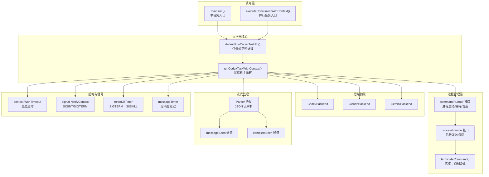
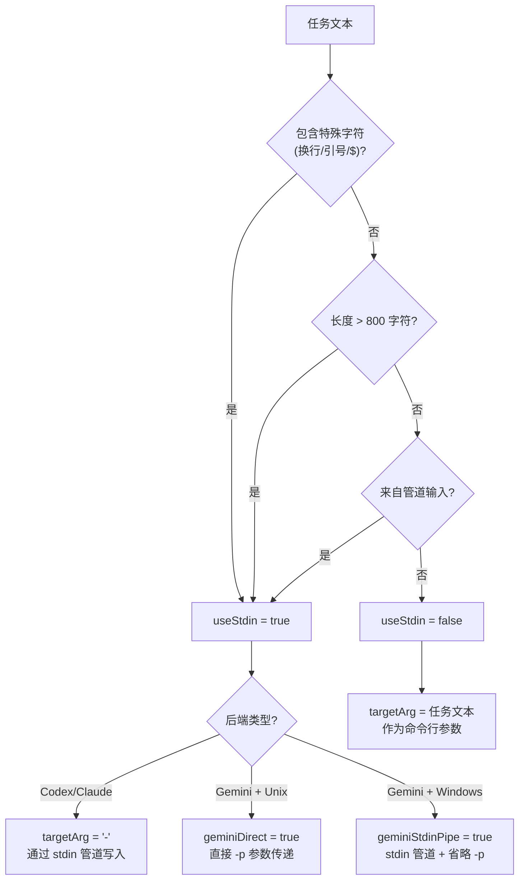
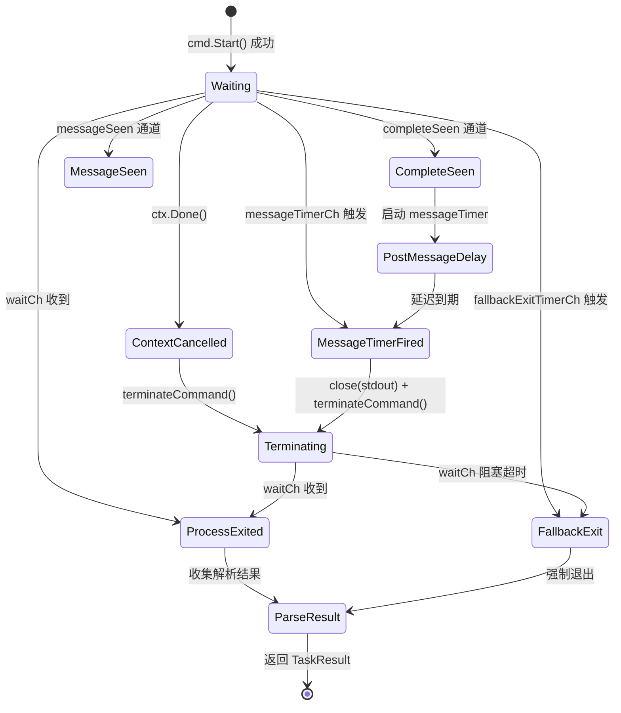
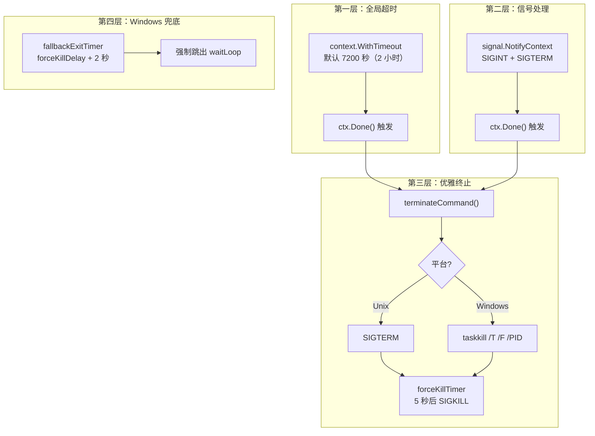

执行器是 codeagent-wrapper 的核心运行时引擎，负责将 AI CLI 后端（Codex、Claude、Gemini）作为子进程调度执行，并在整个生命周期内完成进程编排、流式输出解析、会话追踪和超时终止。它是一个精心设计的状态机——从命令构建、管道建立、事件多路复用到优雅关闭，每个阶段都有独立的防护机制确保资源不泄漏、输出不丢失。本文将深入解析执行器的内部架构，揭示其如何在复杂的多平台、多后端环境中实现可靠的一次性任务执行。

Sources: [executor.go](codeagent-wrapper/executor.go#L1-L200), [main.go](codeagent-wrapper/main.go#L1-L68)

## 架构总览：执行器在系统中的定位

执行器位于 codeagent-wrapper 的中间层，向上接收 `Config` 和 `TaskSpec` 的调度指令，向下通过 `Backend` 抽象层与具体的 AI CLI 工具交互。它的核心函数 `runCodexTaskWithContext` 是一个超过 500 行的精密状态机，通过 Go 的 `select` 多路复用机制同时监听 6 个事件通道。

这个架构的关键设计决策在于：**解析器协程在命令启动之前就已就绪**（第 1092-1113 行），避免了快速完成的命令在解析器开始读取之前就关闭 stdout 的竞态条件。同时，`select` 多路复用使执行器能够同时响应超时、信号、解析完成和进程退出等多种事件。

Sources: [executor.go](codeagent-wrapper/executor.go#L810-L1327), [executor.go](codeagent-wrapper/executor.go#L1052-L1113)

## 进程抽象层：可测试的命令运行器

执行器通过两个核心接口实现了进程管理的完全抽象化，使得单元测试可以在不启动真实进程的情况下验证所有逻辑路径。

### commandRunner 与 processHandle 接口

`commandRunner` 封装了 `exec.Cmd` 的全部生命周期操作，包括启动、等待、管道获取、工作目录设置和环境变量注入。`processHandle` 则封装了 `os.Process` 的信号操作。这两个接口的生产实现（`realCmd` 和 `realProcess`）只是对标准库的薄包装，但它们为测试注入提供了精确的接缝。

| 方法 | 职责 | 测试替代 |
|---|---|---|
| `Start()` | 启动子进程 | `execFakeRunner.startErr` 模拟启动失败 |
| `Wait()` | 等待进程退出 | `execFakeRunner.waitDelay` 模拟慢进程 |
| `StdoutPipe()` | 获取标准输出管道 | `execFakeRunner.stdout` 注入预定义 JSON 流 |
| `StdinPipe()` | 获取标准输入管道 | `execFakeRunner.stdin` 捕获写入内容 |
| `SetDir()` | 设置工作目录 | `execFakeRunner.dir` 验证目录传递 |
| `SetEnv()` | 合并环境变量 | `execFakeRunner.env` 验证变量合并 |
| `Process().Kill()` | 强制终止进程 | `execFakeProcess.killed` 计数器 |
| `Process().Signal()` | 发送信号 | `execFakeProcess.signals` 信号记录 |

环境变量合并逻辑（`SetEnv`，第 117-161 行）采用三层合并策略：先加载 `os.Environ()` 获取系统环境，再叠加 `cmd.Env` 中已有的值，最后用显式传入的 `env` map 覆盖。合并后的键按字母排序，确保环境变量的确定性——这在并行测试中尤为重要，避免因环境差异导致的不可复现故障。

Sources: [executor.go](codeagent-wrapper/executor.go#L53-L199), [executor_concurrent_test.go](codeagent-wrapper/executor_concurrent_test.go#L28-L152)

## 进程生命周期：从命令构建到优雅终止

### 阶段一：配置构建与参数选择

执行器在 `runCodexTaskWithContext` 入口处首先将 `TaskSpec` 转换为 `Config`，然后根据后端类型选择对应的命令构建器。配置构建的关键分支如下：

| 条件 | 行为 |
|---|---|
| `cfg.Mode == "resume"` | 验证 `SessionID` 非空，否则立即返回错误 |
| `cfg.WorkDir == ""` | 回退到 `defaultWorkdir`（当前目录 `.`） |
| `backend != nil` | 使用显式传入的 Backend 实现 |
| `taskSpec.Backend != ""` | 记录但不影响命令选择（由 `cfg.Backend` 驱动） |

### 阶段二：Stdin 策略选择

执行器根据任务内容和后端类型智能选择输入传递方式。核心决策逻辑在 `shouldUseStdin`（第 50-58 行）和 `runCodexTaskWithContext` 的第 856-871 行：

这个设计的核心考量是 **Windows 兼容性**：在 Windows 上，npm 的 `.cmd` 包装器通过 `cmd.exe` 路由参数，而 `cmd.exe` 会在第一个换行符处截断多行参数（Issue #129）。因此 Gemini 后端在 Windows 上使用 stdin 管道模式而非 `-p` 参数。

### 阶段三：进程启动与管道建立

进程启动阶段按严格顺序执行 7 个步骤，每个步骤都有独立的错误处理和资源清理：

1. **创建命令运行器**（第 982 行）：注入 context 实现超时传播
2. **合并环境变量**（第 986-990 行）：加载 Claude settings 中的 env 配置
3. **设置工作目录**（第 1000-1007 行）：Codex 使用 `-C` 标志，其他后端通过 `cmd.Dir`
4. **建立 stderr 管道**（第 1009-1025 行）：通过 `MultiWriter` 分流到缓冲区、日志和过滤写入器
5. **建立 stdin 管道**（第 1027-1037 行）：仅当 `useStdin` 且非 Gemini Direct 模式
6. **建立 stdout 管道**（第 1039-1050 行）：通过 `TeeReader` 同时输出到日志
7. **启动解析协程**（第 1092-1113 行）：**必须在 `cmd.Start()` 之前启动**

Sources: [executor.go](codeagent-wrapper/executor.go#L810-L1050), [utils.go](codeagent-wrapper/utils.go#L50-L58)

## 核心状态机：waitLoop 多路复用

`waitLoop`（第 1164-1220 行）是执行器的心脏，一个 Go `select` 驱动的多通道状态机，同时监控 6 个事件源：

### 六个事件通道的职责

| 通道 | 触发条件 | 处理行为 |
|---|---|---|
| `waitCh` | 子进程退出（`cmd.Wait()`） | 立即跳出循环，进入结果收集阶段 |
| `ctx.Done()` | 超时到期或 SIGINT/SIGTERM | 记录原因，发送 SIGTERM，等待进程退出 |
| `messageTimerCh` | 后消息延迟到期（默认 5 秒） | 关闭 stdout，终止滞留的后端进程 |
| `fallbackExitTimerCh` | 终止后进程仍未退出（Windows 兜底） | 强制跳出循环 |
| `completeSeen` | 解析器检测到 `turn.completed/thread.completed` | 启动后消息延迟计时器 |
| `messageSeen` | 解析器检测到 `agent_message` | 标记已观察到消息 |

### 后消息延迟机制

`resolvePostMessageDelay()`（第 28-51 行）实现了一个精心调校的延迟策略。当后端发出 `agent_message` 后，AI CLI 进程可能还会产生 `turn.completed` 或 `thread.completed` 等完成事件。这个延迟确保这些事件有机会被解析器捕获。

| 模式 | 延迟时间 | 环境变量覆盖 |
|---|---|---|
| 标准模式 | 5 秒 | `CODEAGENT_POST_MESSAGE_DELAY`（最大 60 秒） |
| Lite 模式 | 1 秒 | 同上 |
| Windows Codex | 5 秒（从 1 秒增加） | 同上 |

Sources: [executor.go](codeagent-wrapper/executor.go#L1164-L1272), [executor.go](codeagent-wrapper/executor.go#L22-L51)

## 会话管理：New 模式与 Resume 模式

执行器支持两种会话模式，通过 `Config.Mode` 字段区分：

### New 模式（默认）

创建全新的后端会话。每个后端的参数构建方式不同：

| 后端 | 参数构建 | 工作目录传递 |
|---|---|---|
| **Codex** | `e --dangerously-bypass-approvals-and-sandbox --skip-git-repo-check -C <workdir> --json <task>` | `-C` 标志 |
| **Claude** | `-p --setting-sources '' --output-format stream-json --verbose <task>` | `cmd.Dir` |
| **Gemini** | `-m <model> -o stream-json -y --include-directories <workdir> -p <task>` | `cmd.Dir` |

### Resume 模式

恢复已有的后端会话继续对话。此时 `SessionID` 必须非空（否则在第 850-854 行立即返回错误）。各后端的恢复参数：

- **Codex**：`e ... --json resume <session_id> <task>`
- **Claude**：`-p -r <session_id> --output-format stream-json --verbose <task>`
- **Gemini**：`-o stream-json -y -r <session_id> -p <task>`

### 会话 ID 的追踪与输出

会话 ID 有三个追踪点：

1. **解析器实时捕获**：当后端流输出中包含 `session_id` 字段时，`onSessionStartedCallback`（第 1082-1089 行）立即将 `Session-ID: <id>` 输出到 stderr，使上游调用方（如 Claude Code）能在任务超时前获取会话 ID
2. **最终结果返回**：解析器从 JSON 流中提取的 `threadID` 写入 `TaskResult.SessionID`
3. **主程序输出**：成功执行后，`SESSION_ID: <id>` 追加到 stdout

Sources: [executor.go](codeagent-wrapper/executor.go#L757-L799), [backend.go](codeagent-wrapper/backend.go#L84-L156), [executor.go](codeagent-wrapper/executor.go#L1075-L1090)

## 超时控制：四层防护体系

执行器实现了四层嵌套的超时防护，从全局超时到进程级强制终止，确保在任何异常情况下资源都能被回收。

### 超时配置参数

| 参数 | 默认值 | 环境变量 | 说明 |
|---|---|---|---|
| 全局超时 | 7200 秒 | `CODEX_TIMEOUT` | 毫秒值 >10000 时自动转换为秒 |
| 后消息延迟 | 5 秒 | `CODEAGENT_POST_MESSAGE_DELAY` | Lite 模式下为 1 秒 |
| 强杀延迟 | 5 秒 | `forceKillDelay`（原子变量） | SIGTERM 后等待 SIGKILL 的间隔 |
| 兜底退出延迟 | forceKillDelay + 2 秒 | — | Windows 专用，防止 waitCh 永久阻塞 |
| Stdout 排空超时 | 100 毫秒 | — | 等待解析器完成的最短时间 |

### 跨平台终止策略

Windows 不支持 SIGTERM（静默失败），因此执行器在 Windows 上使用 `taskkill /T /F /PID` 终止整个进程树。这至关重要，因为 Codex CLI 可能产生继承 stdout 句柄的子进程（如 Node.js workers），这些子进程会阻止父进程干净退出。在 Unix 系统上，使用标准的 SIGTERM → 等待 → SIGKILL 两步终止。

Sources: [executor.go](codeagent-wrapper/executor.go#L972-L976), [executor.go](codeagent-wrapper/executor.go#L1329-L1504), [main.go](codeagent-wrapper/main.go#L19), [utils.go](codeagent-wrapper/utils.go#L14-L30)

## 退出码语义

执行器定义了一套精确的退出码体系，覆盖了从成功到各类异常的完整状态空间：

| 退出码 | 语义 | 触发条件 |
|---|---|---|
| **0** | 成功 | 进程正常退出 + 解析到 `agent_message` |
| **1** | 通用错误 | 进程启动失败、管道错误、无 `agent_message` 输出 |
| **124** | 超时 | `context.WithTimeout` 到期 |
| **127** | 命令未找到 | 启动错误信息包含 "executable file not found" |
| **130** | 中断（Ctrl+C） | 收到 SIGINT/SIGTERM |
| **其他** | 后端透传 | 后端进程的非零退出码直接返回 |

其中 124 和 130 遵循 Unix 惯例（124 为 `timeout` 命令的超时退出码，130 = 128 + 2 即 SIGINT 信号）。

Sources: [executor.go](codeagent-wrapper/executor.go#L1274-L1283), [executor.go](codeagent-wrapper/executor.go#L517-L525), [main.go](codeagent-wrapper/main.go#L584-L590)

## 日志隔离：并行任务的独立日志空间

在并行执行模式下（参见 [并行执行引擎：--parallel 模式与任务依赖管理](25-bing-xing-zhi-xing-yin-qing-parallel-mo-shi-yu-ren-wu-yi-lai-guan-li)），执行器为每个任务创建独立的 `taskLoggerHandle`，通过 `withTaskLogger` 机制将日志实例注入到 context 中。这使得：

- **主日志**不受任务日志污染（验证于 `TestExecutorParallelLogIsolation` 测试）
- **任务间日志完全隔离**（任务 A 的日志不会出现在任务 B 的文件中）
- **降级策略**：独立日志创建失败时，回退到主日志并标记 `shared: true`

日志创建流程在 `newTaskLoggerHandle`（第 230-253 行）中实现，它通过 `NewLoggerWithSuffix(taskID)` 在临时目录创建以任务 ID 为后缀的独立日志文件。

Sources: [executor.go](codeagent-wrapper/executor.go#L206-L253), [executor_concurrent_test.go](codeagent-wrapper/executor_concurrent_test.go#L620-L721)

## 结果生成：结构化执行报告

执行器的最终输出由 `generateFinalOutputWithMode`（第 561-755 行）生成，支持两种模式：

### 摘要模式（默认）

每个任务输出一个紧凑的区块，包含：
- **状态标记**：`✓`（通过）、`⚠️`（覆盖率低于目标）、`✗`（失败）
- **Did**：任务完成摘要（从输出中提取的第一行有意义内容）
- **Files**：变更文件列表
- **Tests**：通过的测试数量
- **Gap**：覆盖率缺口（仅低于目标时显示）
- **Log**：日志文件路径

### 完整模式（`--full-output`）

保留传统的完整输出格式，包含 Session ID、完整 Message 内容和所有详细信息。

两种模式都通过 `sanitizeOutput`（第 308-329 行）清除 ANSI 转义序列和控制字符，确保输出在不同终端环境下的安全性。

Sources: [executor.go](codeagent-wrapper/executor.go#L554-L755), [utils.go](codeagent-wrapper/utils.go#L307-L329)

## 环境变量参考

执行器的行为可通过以下环境变量精细调控：

| 环境变量 | 默认值 | 说明 |
|---|---|---|
| `CODEX_TIMEOUT` | `7200` | 全局执行超时（秒，或毫秒如果 >10000） |
| `CODEAGENT_POST_MESSAGE_DELAY` | `5` | 收到消息后等待完成事件的延迟（秒，最大 60） |
| `CODEAGENT_LITE_MODE` | `false` | Lite 模式：禁用 Web UI、减少日志、加速后消息延迟 |
| `CODEAGENT_ASCII_MODE` | `false` | ASCII 符号模式（PASS/WARN/FAIL 替代 Unicode） |
| `CODEAGENT_MAX_PARALLEL_WORKERS` | `0`（无限制） | 并行工作池大小（最大 100） |
| `CODEX_REQUIRE_APPROVAL` | `false` | Codex 后端要求手动审批文件操作 |
| `CODEX_DISABLE_SKIP_GIT_CHECK` | `false` | 禁用 Codex 的 `--skip-git-repo-check` 标志 |
| `CODEAGENT_SKIP_PERMISSIONS` | `false` | 跳过 Claude 后端的权限检查 |

Sources: [main.go](codeagent-wrapper/main.go#L34-L38), [config.go](codeagent-wrapper/config.go#L298-L318), [utils.go](codeagent-wrapper/utils.go#L14-L30)

## 延伸阅读

执行器与多个子系统紧密协作，以下是相关的深入解析页面：

- [Backend 抽象层：Codex/Claude/Gemini 后端接口实现](22-backend-chou-xiang-ceng-codex-claude-gemini-hou-duan-jie-kou-shi-xian) — 了解每个后端如何构建命令参数
- [流式解析器（Parser）：统一事件解析与三端 JSON 流处理](24-liu-shi-jie-xi-qi-parser-tong-shi-jian-jie-xi-yu-san-duan-json-liu-chu-li) — 深入 `parseJSONStreamInternalWithContent` 的实现细节
- [并行执行引擎：--parallel 模式与任务依赖管理](25-bing-xing-zhi-xing-yin-qing-parallel-mo-shi-yu-ren-wu-yi-lai-guan-li) — 了解 `topologicalSort` 和 `executeConcurrentWithContext` 的完整流程
- [SSE WebServer：实时输出流与 Web UI](26-sse-webserver-shi-shi-shu-chu-liu-yu-web-ui) — 解析器如何通过回调将内容实时推送到 Web 界面