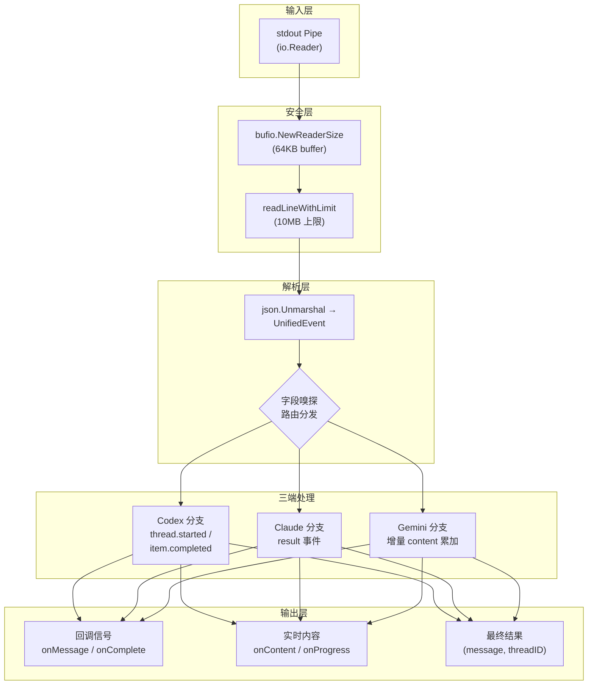
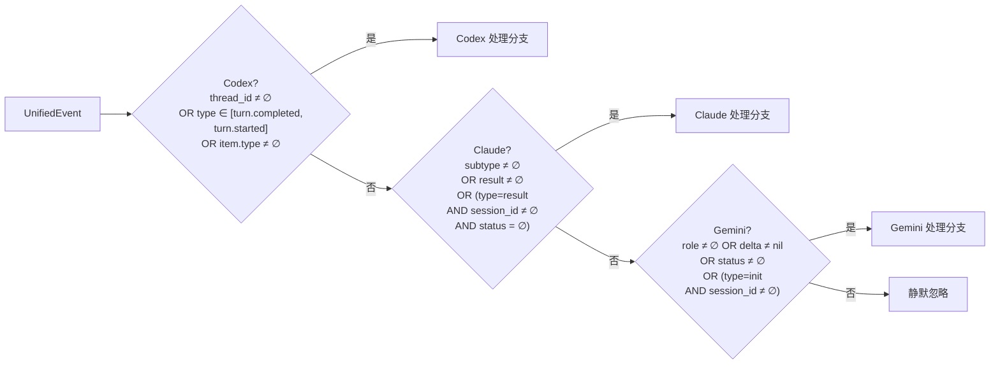
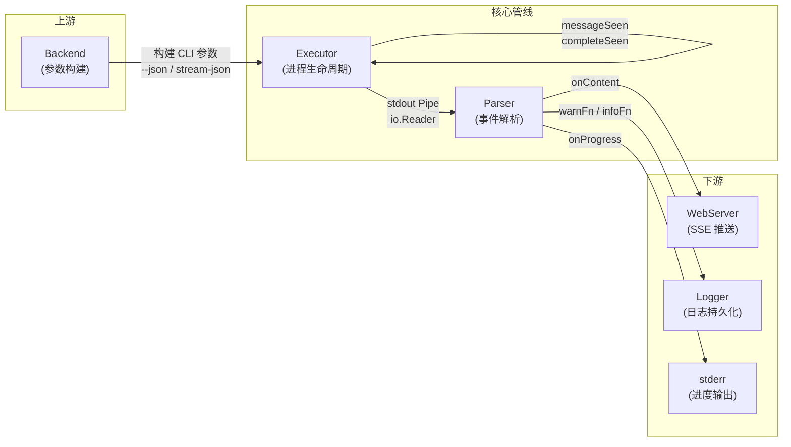

流式解析器是 codeagent-wrapper 中连接「进程输出」与「业务逻辑」的核心桥梁。它负责将 Codex、Claude、Gemini 三个 AI 后端产生的 **格式迥异的 JSON 事件流**，通过一套统一的解析管线，转换为标准化的 `(message, threadID)` 输出和实时回调信号。本文将深入解析其架构设计、三端事件识别策略、安全防线以及与执行器和 WebServer 的集成方式。

Sources: [parser.go](codeagent-wrapper/parser.go#L1-L12)

## 架构总览：单次反序列化 + 字段嗅探路由

解析器采用 **一次反序列化、按字段嗅探分流** 的核心策略。所有后端的事件 JSON 先统一解码到一个 `UnifiedEvent` 结构体中，随后通过检查特定字段的存在性来判定事件来源（Codex / Claude / Gemini），并进入对应的事件处理分支。这种设计避免了为每个后端维护独立解码器的性能开销和代码冗余。



整个解析管线由函数 `parseJSONStreamInternalWithContent` 驱动，它逐行读取 stdout，对每一行执行 JSON 反序列化，再根据字段特征路由到对应处理分支。该函数通过 **5 个回调参数** 与外部系统交互：`onMessage`（消息就绪通知）、`onComplete`（会话完成通知）、`onContent`（实时内容推送）、`onProgress`（进度行输出）和 `onSessionStarted`（会话 ID 早期捕获）。

Sources: [parser.go](codeagent-wrapper/parser.go#L110-L149)

## UnifiedEvent：三端合一的结构体设计

`UnifiedEvent` 是整个解析器的核心数据结构，它通过 Go 的 `json` tag 将三端的字段命名差异吸收到一个统一类型中。Codex 使用 `thread_id` 和嵌套的 `item` 对象；Claude 使用 `subtype`、`result` 和 `session_id`；Gemini 使用 camelCase 的 `sessionId`、`role`、`content`、`delta` 和 `status`。

| 字段 | JSON Key | 后端 | 说明 |
|------|----------|------|------|
| `ThreadID` | `thread_id` | Codex | 线程标识，出现在 `thread.started` 事件中 |
| `Item` | `item` | Codex | 嵌套事件数据，使用 `json.RawMessage` 延迟解析 |
| `Subtype` | `subtype` | Claude | 事件子类型（如 `init`、`success`） |
| `Result` | `result` | Claude | 最终响应文本 |
| `SessionID` | `session_id` | Claude / Codex | snake_case 会话 ID |
| `SessionIDCamel` | `sessionId` | Gemini | camelCase 会话 ID（Gemini CLI 特有） |
| `Role` | `role` | Gemini | 消息角色（如 `assistant`） |
| `Content` | `content` | Gemini | 增量文本片段 |
| `Delta` | `delta` | Gemini | 是否为增量推送（指针类型区分 `false` 与 `nil`） |
| `Status` | `status` | Gemini | 终态标志（`success` / `error` / `complete` / `failed`） |

其中 `Item` 字段使用 `json.RawMessage` 延迟解析，仅在确认事件来自 Codex 后才进行二次反序列化，避免了对 Claude/Gemini 事件的不必要解析开销。`Delta` 字段使用 `*bool` 指针类型，因为 Go 的 `bool` 零值为 `false`，无法区分「字段缺失」和「字段值为 `false`」——这对 Gemini 事件识别至关重要。

Sources: [parser.go](codeagent-wrapper/parser.go#L71-L108)

### camelCase 与 snake_case 的 Session ID 兼容

Gemini CLI 的 JSON 输出使用 `sessionId`（camelCase），而 Codex 和 Claude 使用 `session_id`（snake_case）。`UnifiedEvent` 通过两个独立字段同时接收两种格式，`GetSessionID()` 方法按优先级返回非空值：

```go
func (e *UnifiedEvent) GetSessionID() string {
    if e.SessionID != "" {
        return e.SessionID
    }
    return e.SessionIDCamel
}
```

这种设计使得 Session ID 的提取逻辑在整个解析流程中保持一致，无需在各处理分支中区分后端格式。

Sources: [parser.go](codeagent-wrapper/parser.go#L95-L102)

## 后端识别：字段嗅探启发式策略

解析器**不依赖外部配置**来判断当前事件属于哪个后端。它采用一套确定性强的字段嗅探规则，从 `UnifiedEvent` 的字段状态推断事件来源。三条判断路径按 Codex → Claude → Gemini 的优先级顺序执行：



关键的区分边界在于 **Claude 与 Gemini 的歧义消除**。两者都可能产生 `type=result` 且包含 `session_id` 的事件。解析器通过检查 `status` 字段来解决冲突：Claude 的 `result` 事件不包含 `status` 字段，而 Gemini 的终端事件总是附带 `status`（如 `success`、`error`）。因此条件 `event.Type == "result" && event.GetSessionID() != "" && event.Status == ""` 精确匹配 Claude 的结果事件。

Sources: [parser.go](codeagent-wrapper/parser.go#L197-L211)

## 三端事件处理详解

### Codex 事件：线程模型与多类型 Item

Codex 的 JSON 事件模型采用 **线程-轮次-项目** 三级结构。解析器关注以下事件类型：

| 事件类型 | 处理逻辑 |
|----------|----------|
| `thread.started` | 提取 `thread_id` 作为会话标识，触发 `onSessionStarted` |
| `turn.started` | 发射 `turn_started` 进度行 |
| `thread.completed` | 发射 `session_completed` 进度行，触发 `onComplete` |
| `turn.completed` | 发射 `turn_completed` 进度行，触发 `onComplete` |
| `item.completed` | 根据 `item.type` 子分派到详细处理逻辑 |

`item.completed` 是最复杂的事件类型，包含四种子类型：

- **`agent_message`**：最终文本输出，存入 `codexMessage`，触发 `onMessage` 和 `onContent(content, "agent_message")`
- **`reasoning`**：推理过程文本，仅发射进度行和 `onContent(content, "reasoning")`，不更新 `codexMessage`
- **`command_execution`**：命令执行结果，包含 `command`、`aggregated_output`、`exit_code` 字段，触发 `onContent(formattedOutput, "command")`
- **`mcp_tool_call`**：MCP 工具调用通知，仅发射 `mcp_call` 进度行

`normalizeText` 函数处理 Codex 的 `text` 字段的两种可能类型——字符串（`string`）和字符串数组（`[]interface{}`）——统一转换为 `string`。当多条 `agent_message` 出现时，解析器保留最后一条（Last-Write-Wins 语义），这与 Codex 的「多轮对话只关心最终响应」的设计一致。

Sources: [parser.go](codeagent-wrapper/parser.go#L214-L318), [parser.go](codeagent-wrapper/parser.go#L522-L537)

### Claude 事件：简洁的结果模型

Claude CLI 的 `stream-json` 输出格式远比 Codex 简洁。解析器只需关注两个关键信号：

1. **`event.Result != ""`**：提取完整响应文本到 `claudeMessage`，触发 `onMessage` 和 `onContent`
2. **`event.Type == "result"`**：触发 `onComplete`，标志着会话结束

Claude 的事件流通常以 `system`/`init` 事件开头（提供 `session_id`），以 `result` 事件结尾（提供最终文本）。中间的流式事件（如 `subtype: "stream"`）不携带 `result` 字段，因此被自然忽略。解析器的 `isClaude` 判定条件中 `event.Subtype != ""` 确保了这些中间事件也能被正确识别为 Claude 事件（而非落入未知分支）。

Sources: [parser.go](codeagent-wrapper/parser.go#L321-L342)

### Gemini 事件：增量内容累积模型

Gemini CLI 的事件模型与 Codex/Claude 有本质区别：它通过 **delta 事件逐片段推送内容**，而非在完成时一次性输出完整文本。解析器使用 `geminiBuffer strings.Builder` 累积所有 `event.Content` 片段：

```
{"type":"message","content":"Hi","delta":true}    → geminiBuffer += "Hi"
{"type":"message","content":" there","delta":true} → geminiBuffer += " there"
{"type":"result","status":"success"}               → onComplete
```

`onContent` 回调在每次收到 `content` 片段时立即触发，使得 SSE WebServer 可以实现逐字推送给前端。`onMessage` 则在出现非空 `status` 字段时触发一次，标志着内容流的结束。终端状态值包括 `success`、`error`、`complete` 和 `failed`，任一状态同时触发 `onComplete`。

Sources: [parser.go](codeagent-wrapper/parser.go#L345-L373)

### 最终消息的优先级合并

当所有事件处理完毕后，解析器按 **Gemini > Claude > Codex** 的优先级选择最终消息：

```go
switch {
case geminiBuffer.Len() > 0:
    message = geminiBuffer.String()
case claudeMessage != "":
    message = claudeMessage
default:
    message = codexMessage
}
```

由于解析器在单次运行中只会接收到同一后端的事件流（由 [Backend 抽象层](22-backend-chou-xiang-ceng-codex-claude-gemini-hou-duan-jie-kou-shi-xian) 保证），这个优先级实际上等价于「使用当前后端的消息」。但 Gemini 优先的设计确保了在极端情况下（如 `geminiBuffer` 有内容但其他变量也被错误填充），增量累积的完整内容不会丢失。

Sources: [parser.go](codeagent-wrapper/parser.go#L379-L390)

## 安全防线：从行读取到 JSON 恢复

### readLineWithLimit：10MB 行长上限

`readLineWithLimit` 是解析器的第一道安全防线。它使用 `bufio.Reader.ReadLine()` 逐段读取（处理超过 64KB 缓冲区的长行），同时追踪总字节数。超过 `jsonLineMaxBytes`（10MB）的行被标记为 `tooLong`，仅保留前 256 字节（`jsonLinePreviewBytes`）用于日志诊断，其余内容被安全丢弃。

| 常量 | 值 | 作用 |
|------|-----|------|
| `jsonLineReaderSize` | 64 KB | `bufio.NewReaderSize` 的缓冲区大小 |
| `jsonLineMaxBytes` | 10 MB | 单行最大允许字节数 |
| `jsonLinePreviewBytes` | 256 B | 超长行的预览截断长度 |

该函数的实现采用 **分段累积 + 即时截断** 策略：一旦累积大小超过 `maxBytes`，立即停止写入缓冲区并设置 `tooLong = true`，但继续读取剩余分段以消耗完整的行内容（确保下一行的读取起点正确）。预览缓冲区在超长判定前就已开始收集前 256 字节，使得即使行被丢弃，日志中仍能显示事件的开头内容用于调试。

Sources: [parser.go](codeagent-wrapper/parser.go#L57-L61), [parser.go](codeagent-wrapper/parser.go#L449-L510)

### JSON 恢复：Gemini 前缀噪声容忍

Gemini CLI 偶尔会在 JSON 事件行前附加非 JSON 文本（如 MCP 状态警告）。解析器在主解析失败后执行二次尝试：

```go
if idx := bytes.IndexByte(line, '{'); idx > 0 {
    if err2 := json.Unmarshal(line[idx:], &event); err2 == nil {
        goto parsed
    }
}
```

它定位行中第一个 `{` 字符，尝试从该位置开始解析 JSON。`idx > 0` 条件确保只在该字符确实存在于非零偏移时才尝试（避免重复解析普通 JSON 行）。这个机制专门解决了类似 `"MCP issues detected. Run /mcp list for status.{"type":"init",...}"` 这类混合文本行。

Sources: [parser.go](codeagent-wrapper/parser.go#L175-L186)

### 文本规范化与安全的进度截断

`normalizeText` 处理 `text` 字段的类型多态（`string` 与 `[]interface{}`），将字符串数组拼接为单一字符串。`safeProgressSnippet` 提供符文安全（rune-safe）的文本截断，确保中文字符不会被截断产生乱码——它按 `[]rune` 切片，超出长度时添加 `...` 后缀。

Sources: [parser.go](codeagent-wrapper/parser.go#L405-L416), [parser.go](codeagent-wrapper/parser.go#L522-L537)

## 回调集成：与执行器和 WebServer 的协作

解析器通过 5 个回调函数与外部系统解耦。在 [执行器（Executor）](23-zhi-xing-qi-executor-jin-cheng-sheng-ming-zhou-qi-hui-hua-guan-li-yu-chao-shi-kong-zhi) 中，这些回调在解析协程启动前完成注册：

| 回调 | 注册条件 | 功能 |
|------|----------|------|
| `onContent` | `globalWebServer != nil` | 将内容片段通过 SSE 推送到 Web UI |
| `onProgress` | `cfg.Progress == true` | 向 stderr 输出 `[PROGRESS]` 格式化进度行 |
| `onSessionStarted` | `!silent` | 首次捕获 Session ID 时向 stderr 输出 `Session-ID:` |
| `onMessage` | 始终注册 | 向 `messageSeen` channel 发送信号，触发 post-message 延迟计时 |
| `onComplete` | 始终注册 | 向 `completeSeen` channel 发送信号，通知 WebServer 会话结束 |

关键的设计决策在于 **解析协程在 `cmd.Start()` 之前启动**，以避免快速完成的命令在解析器开始读取之前就关闭了 stdout pipe 导致的数据丢失竞争条件。`messageSeen` 和 `completeSeen` 使用容量为 1 的 buffered channel，确保信号不会因消费方暂未就绪而丢失。

Sources: [executor.go](codeagent-wrapper/executor.go#L1052-L1113)

### 进度行格式化协议

`formatProgressLine` 生成结构化的进度文本，格式为 `<event_name> [key=value]*`。例如：

```
session_started id=tid-123
turn_started
reasoning text="Checking files and APIs"
cmd_done cmd="echo hi" exit=0
message text="Done with changes"
mcp_call
turn_completed total_events=7
```

这些进度行通过 `onProgress` 回调输出到 stderr，被 Claude Code 等上层编排系统解析用于实时状态追踪。字段的输出顺序通过硬编码的键序列（`id` → `text` → `cmd` → `exit` → `total_events`）保证一致性。

Sources: [parser.go](codeagent-wrapper/parser.go#L392-L403)

## 防御性编程：容错与边界处理

解析器在多个层面实现了容错机制，确保在异常输入下仍能优雅降级而非崩溃：

**畸形 JSON 容忍**：无法解析的事件行被跳过并记录警告，不影响后续事件的解析。测试用例验证了在正常事件之间插入损坏 JSON 时，解析器仍能正确提取有效消息。

**未知事件静默忽略**：不被任何后端规则匹配的事件（如 `turn.started`、`assistant`、`user`）被直接跳过，不产生日志也不影响状态。这确保了当后端新增事件类型时，解析器不会因此中断。

**超长行安全丢弃**：超过 10MB 的行被安全跳过，仅保留 256 字节预览用于诊断。解析器继续处理后续正常行，不受影响。

**空 Item 安全处理**：Codex 事件中 `item` 为 `null` 或 `{}` 时，`itemHeader.Type` 为空字符串，落入 `default` 分支，不触发任何内容提取逻辑。

**Reader 错误处理**：当 `readLineWithLimit` 返回 `io.EOF` 时，解析循环正常退出并返回已解析的结果；其他 I/O 错误则记录警告后退出。

Sources: [parser.go](codeagent-wrapper/parser.go#L151-L186), [parser_unknown_event_test.go](codeagent-wrapper/parser_unknown_event_test.go#L9-L33), [parser_token_too_long_test.go](codeagent-wrapper/parser_token_too_long_test.go#L8-L31)

## 与相邻模块的关系



解析器处于 [Backend 抽象层](22-backend-chou-xiang-ceng-codex-claude-gemini-hou-duan-jie-kou-shi-xian) 的下游和 [执行器](23-zhi-xing-qi-executor-jin-cheng-sheng-ming-zhou-qi-hui-hua-guan-li-yu-chao-shi-kong-zhi) 的核心位置。Backend 负责构建带有 `--json`（Codex）或 `--output-format stream-json`（Claude）或 `-o stream-json`（Gemini）的 CLI 参数，确保子进程的 stdout 输出 JSON 格式。Executor 创建 stdout pipe 并传递给 Parser，同时注册回调函数接收解析结果。Parser 产出的实时内容通过 `onContent` 推送到 [SSE WebServer](26-sse-webserver-shi-shi-shu-chu-liu-yu-web-ui)，实现 Web UI 的实时更新。

在 [并行执行引擎](25-bing-xing-zhi-xing-yin-qing-parallel-mo-shi-yu-ren-wu-yi-lai-guan-li) 中，每个并行任务各自拥有独立的 Parser 实例（运行在独立协程中），互不干扰。`silent` 模式下禁用 `onProgress` 和 `onSessionStarted`，避免多个任务的进度行交错污染 stderr。

Sources: [executor.go](codeagent-wrapper/executor.go#L1047-L1107), [backend.go](codeagent-wrapper/backend.go#L84-L156)

## 扩展阅读

- [Backend 抽象层：Codex/Claude/Gemini 后端接口实现](22-backend-chou-xiang-ceng-codex-claude-gemini-hou-duan-jie-kou-shi-xian) — 理解三端 CLI 参数构建如何确保 JSON 输出格式
- [执行器（Executor）：进程生命周期、会话管理与超时控制](23-zhi-xing-qi-executor-jin-cheng-sheng-ming-zhou-qi-hui-hua-guan-li-yu-chao-shi-kong-zhi) — 理解解析协程与进程生命周期的时序协调
- [并行执行引擎：--parallel 模式与任务依赖管理](25-bing-xing-zhi-xing-yin-qing-parallel-mo-shi-yu-ren-wu-yi-lai-guan-li) — 理解多任务场景下 Parser 的静默模式与隔离策略
- [SSE WebServer：实时输出流与 Web UI](26-sse-webserver-shi-shi-shu-chu-liu-yu-web-ui) — 理解 `onContent` 回调如何驱动 SSE 事件推送