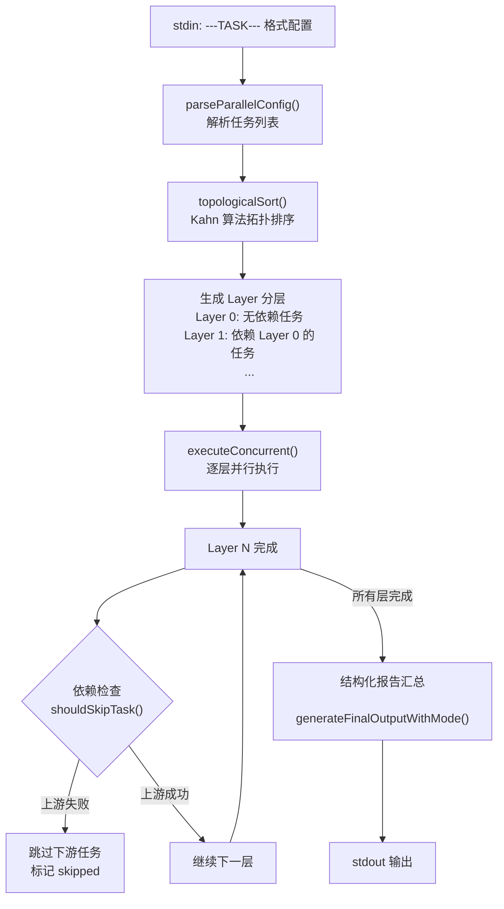
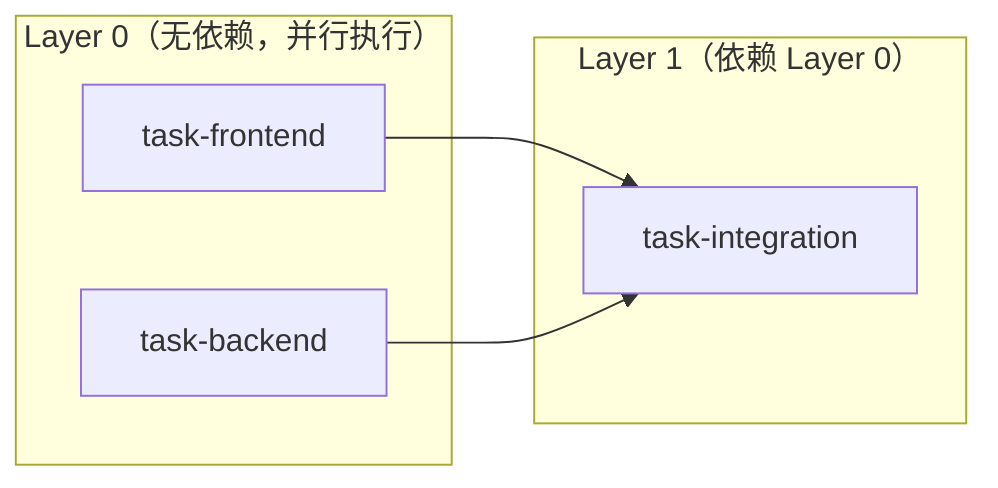
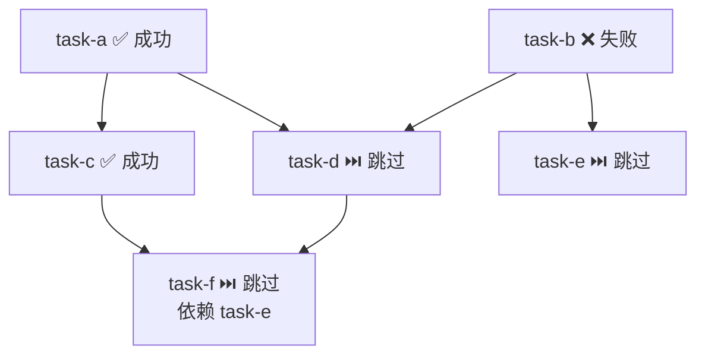

codeagent-wrapper 的 `--parallel` 模式是其多任务编排能力的核心——它允许调用方通过 stdin 一次性提交多个 AI 代理任务，由 Go 二进制自动解析任务间的依赖关系、构建拓扑层级、在每层内部以 goroutine 并行执行，并最终汇总结构化报告。这一机制是 CCG 系统中 `/ccg:team-exec` 等 Agent Teams 命令的底层执行引擎，使得 Claude Code 可以通过管道驱动多个 Codex/Gemini/Claude 后端实例并行完成代码实施。

Sources: [main.go](codeagent-wrapper/main.go#L187-L324), [executor.go](codeagent-wrapper/executor.go#L287-L515)

## 整体架构与数据流

并行执行引擎的运作可以拆解为四个阶段：**配置解析 → 依赖拓扑排序 → 分层并发执行 → 结构化报告汇总**。每个阶段都是纯函数式的数据变换，前一阶段的输出直接成为后一阶段的输入。



Sources: [executor.go](codeagent-wrapper/executor.go#L287-L351), [executor.go](codeagent-wrapper/executor.go#L353-L515), [config.go](codeagent-wrapper/config.go#L109-L195)

## 任务配置格式：---TASK--- 协议

`--parallel` 模式不从命令行参数读取任务，而是通过 stdin 接收一个自定义的分隔符协议。每个任务由 `---TASK---` 起始，元数据区与内容区以 `---CONTENT---` 分隔。这种设计避免了 JSON 的转义地狱——任务提示词中可以自由包含引号、换行、反引号等特殊字符，无需转义。

```
---TASK---
id: task-1
workdir: /path/to/project
dependencies: task-0
backend: codex
session_id: sess-abc
---CONTENT---
完整的任务提示词内容，支持多行
可以包含任意特殊字符: $var "quotes" `backticks`
---TASK---
id: task-2
dependencies: task-1
---CONTENT---
第二个任务...
```

**字段说明**：

| 字段 | 必填 | 说明 |
|------|------|------|
| `id` | **是** | 任务唯一标识符，重复 ID 会导致解析失败 |
| `task` (内容区) | **是** | `---CONTENT---` 之后的全部文本，作为代理的执行指令 |
| `workdir` | 否 | 工作目录，默认为当前目录 |
| `dependencies` | 否 | 逗号分隔的前置任务 ID 列表 |
| `backend` | 否 | 指定后端（codex/claude/gemini），未设置时使用全局 `--backend` 值 |
| `session_id` | 否 | 指定后自动进入 `resume` 模式，续接已有会话 |

解析器会对每个任务执行严格的验证：ID 不可为空、内容不可为空、`resume` 模式下 `session_id` 不可为空、ID 不可重复。任何违反规则的输入都会立即返回错误并终止执行，而非静默忽略。

Sources: [config.go](codeagent-wrapper/config.go#L109-L195), [main_test.go](codeagent-wrapper/main_test.go#L1241-L1365)

## 拓扑排序：Kahn 算法与层级生成

`topologicalSort()` 函数实现了经典的 **Kahn 算法**（BFS 拓扑排序），将带依赖关系的任务列表转换为二维切片 `[][]TaskSpec`——外层是"层级"（Layer），内层是同一层中可以**并行执行**的任务。

算法核心逻辑：

1. **构建邻接表与入度表**：遍历所有任务，记录每个任务的入度（前置依赖数量）和每个任务完成后可以"解锁"的后继任务列表。若某个 `dependencies` 引用了不存在的任务 ID，立即报错。
2. **BFS 分层**：将所有入度为 0 的任务作为第一层，然后逐层"释放"已完成任务的后续依赖——每当某个后继任务的入度降为 0，它就进入下一层。
3. **环检测**：如果处理完毕后仍有任务未被分层（`processed != len(tasks)`），说明存在循环依赖。引擎会列出所有涉及环的任务 ID 并返回错误。



**关键设计决策**：拓扑排序的结果是严格的**层序执行**——只有当前层的所有任务完成后，下一层才会开始。这意味着依赖关系是**全量等待**，而非单个任务完成后立即启动其后续任务。这种设计简化了并发控制，同时通过 `shouldSkipTask()` 实现了细粒度的失败传播。

Sources: [executor.go](codeagent-wrapper/executor.go#L287-L351), [executor_concurrent_test.go](codeagent-wrapper/executor_concurrent_test.go#L222-L241)

## 并发执行模型：信号量 + 层序调度

`executeConcurrentWithContext()` 是并行引擎的核心执行函数。它的并发模型结合了三种机制：

### 1. 层序调度

引擎遍历拓扑排序生成的 `layers` 数组。在每一层内部，所有任务被同时启动为独立 goroutine，然后通过 `sync.WaitGroup` 等待该层全部完成（无论成功或失败）后，才进入下一层。这种设计确保了依赖关系的严格满足。

### 2. 工作线程信号量

`CODEAGENT_MAX_PARALLEL_WORKERS` 环境变量控制全局并发上限。引擎通过一个带缓冲的 channel 实现信号量模式：

| 配置值 | 行为 |
|--------|------|
| `0` 或未设置 | **无限制**（unbounded），所有任务可同时运行 |
| `1` | 严格串行，同一时刻只有一个任务在执行 |
| `N` (1-100) | 最多 N 个任务并行执行 |

信号量的 `acquireSlot()` 操作同时监听 context 取消信号——如果整个并行执行被取消（超时或 SIGINT），等待信号量的任务会立即返回而非无限阻塞。

### 3. 原子计数器

`activeWorkers` 使用 `sync/atomic.AddInt64` 实现无锁的活跃工作线程计数，用于日志中的并发状态追踪。

```go
// 信号量 acquire：带 context 取消感知
acquireSlot := func() bool {
    if sem == nil { return true }          // 无限制模式
    select {
    case sem <- struct{}{}: return true    // 获取到槽位
    case <-ctx.Done():     return false    // 被取消
    }
}
```

Sources: [executor.go](codeagent-wrapper/executor.go#L358-L515), [config.go](codeagent-wrapper/config.go#L298-L318), [logger.go](codeagent-wrapper/logger.go#L642-L663)

## 任务隔离与日志架构

并行执行中的每个任务都拥有**独立的日志文件**。`newTaskLoggerHandle()` 为每个任务创建一个带任务 ID 后缀的 Logger 实例，确保不同任务的日志输出互不干扰。

当任务专属 Logger 创建失败时（例如临时目录不可写），引擎会**降级到共享主 Logger** 并在 stderr 中标记 `Log (shared)`。这种降级策略保证了即使在异常环境下任务也不会因日志初始化失败而中断执行。

日志隔离的完整流程：

1. 每个 goroutine 在 `newTaskLoggerHandle()` 中创建独立 Logger
2. 通过 `withTaskLogger()` 将 Logger 注入到 context 中
3. `runCodexTaskFn` 从 context 中提取 Logger 并作为任务执行日志目标
4. goroutine 结束时通过 `defer handle.closeFn()` 关闭 Logger
5. `TaskResult` 中记录 `LogPath` 和 `sharedLog` 标志

并行模式下的任务执行使用 `silent=true` 参数——这意味着 stderr 不会被代理的原始输出污染，所有诊断信息都走文件日志通道。主日志仅记录并发规划信息（如 `parallel: worker_limit=4 total_tasks=8`），不包含任何任务级别的输出。

Sources: [executor.go](codeagent-wrapper/executor.go#L222-L253), [executor.go](codeagent-wrapper/executor.go#L452-L500), [executor.go](codeagent-wrapper/executor.go#L909-L930)

## 失败传播：依赖跳过与级联中断

当某个任务执行失败（非零退出码或非空 Error），其所有下游依赖任务会被**自动跳过**而非尝试执行。`shouldSkipTask()` 在每层开始执行前逐个检查任务的依赖列表——只要有一个前置任务处于 `failed` 集合中，当前任务就会被标记为 `skipped due to failed dependencies: <id列表>`。



这种设计避免了"部分失败后的级联资源浪费"——如果一个后端任务失败，依赖其输出的集成测试任务不会白白消耗 API 调用额度。同时，与失败任务**无依赖关系**的其他任务分支会正常继续执行。

Sources: [executor.go](codeagent-wrapper/executor.go#L436-L441), [executor.go](codeagent-wrapper/executor.go#L527-L544), [executor_concurrent_test.go](codeagent-wrapper/executor_concurrent_test.go#L977-L1011)

## 结构化报告：摘要模式与完整模式

并行执行结束后，引擎会对每个任务的输出进行结构化信息提取，然后生成两种格式的报告：

### 摘要模式（默认）

由 `generateFinalOutputWithMode(results, true)` 生成，是上下文高效的精炼报告。每个任务只保留关键信息：

```
=== Execution Report ===
3 tasks | 2 passed | 1 failed

## Task Results

### task-frontend ✓ 92%
Did: Implemented login component with form validation
Files: src/Login.tsx, src/hooks/useAuth.ts
Tests: 12 passed
Log: /tmp/ccg-12345-task-frontend.log

### task-backend ⚠️ 80% (below 90%)
Did: Created REST API endpoints
Gap: missing coverage in error handling paths

### task-integration ✗ FAILED
Exit code: 1
Error: skipped due to failed dependencies: task-backend
```

**提取的结构化字段**：

| 字段 | 提取来源 | 说明 |
|------|----------|------|
| `Coverage` | 代理输出中的覆盖率行 | 如 `92%`，支持多种覆盖率格式 |
| `FilesChanged` | 代理输出中的文件路径 | 已修改的文件列表 |
| `TestsPassed/Failed` | 测试结果行解析 | 通过/失败的测试数量 |
| `KeyOutput` | 任务摘要（截断至 150 字符） | 任务完成内容的简要描述 |
| `CoverageGap` | 低于目标覆盖率时提取 | 未覆盖的代码区域 |

### 完整模式（`--full-output`）

由 `generateFinalOutputWithMode(results, false)` 生成，包含每个任务的完整 `Message` 内容，适用于需要查看代理全部输出的调试场景。

两种模式都使用 `sanitizeOutput()` 进行 ANSI 转义序列清理和控制字符过滤，确保输出在管道传输中不会造成终端渲染问题。

Sources: [executor.go](codeagent-wrapper/executor.go#L554-L755), [utils.go](codeagent-wrapper/utils.go#L282-L671), [main.go](codeagent-wrapper/main.go#L289-L314)

## 命令行接口与调用方式

`--parallel` 模式通过 stdin 读取任务配置，支持以下几种调用方式：

```bash
# 基本用法：从文件读取
codeagent-wrapper --parallel < tasks.txt

# 管道输入
echo '...' | codeagent-wrapper --parallel

# Here Document
codeagent-wrapper --parallel <<'EOF'
---TASK---
id: build
---CONTENT---
Build the project
---TASK---
id: test
dependencies: build
---CONTENT---
Run all tests
EOF

# 完整输出模式
codeagent-wrapper --parallel --full-output < tasks.txt

# 指定全局后端
codeagent-wrapper --parallel --backend gemini < tasks.txt
```

**参数限制**：`--parallel` 模式仅接受 `--backend` 和 `--full-output` 两个附加参数。其他任何额外参数都会触发使用说明错误。`--gemini-model` 参数在并行模式下不支持，如果使用会输出警告但不会阻止执行。

**退出码语义**：如果所有任务成功退出码为 0；如果任何任务失败，返回第一个失败任务的退出码。

Sources: [main.go](codeagent-wrapper/main.go#L195-L324), [main.go](codeagent-wrapper/main.go#L546-L592)

## 容错机制

并行引擎在多个层面实现了容错保护：

**Panic 恢复**：每个 goroutine 内部都设置了 `defer recover()`，即使任务执行函数发生 panic，也会将其捕获并转化为标准的 `TaskResult`（ExitCode=1, Error="panic: ..."），不会导致整个进程崩溃。

**Context 取消传播**：父级 context 的取消（超时或信号）会通过 `ctx.Done()` 通道传播到所有正在执行和排队中的任务。等待信号量的任务通过 `select` 同时监听信号量通道和取消通道，确保快速响应取消信号。

**信号量泄漏防护**：`releaseSlot()` 使用 `select-default` 模式，即使在不应该释放的场景下调用也不会阻塞。

**超时控制**：每个任务执行时都通过 `context.WithTimeout()` 设置独立超时，超时后的任务会收到 124 退出码（与单任务模式的超时语义一致）。

Sources: [executor.go](codeagent-wrapper/executor.go#L456-L460), [executor.go](codeagent-wrapper/executor.go#L407-L427), [executor.go](codeagent-wrapper/executor.go#L517-L525), [executor_concurrent_test.go](codeagent-wrapper/executor_concurrent_test.go#L1013-L1072)

## 并发控制参数速查

| 参数 | 环境变量 | 默认值 | 上限 | 说明 |
|------|----------|--------|------|------|
| 最大并行工作线程 | `CODEAGENT_MAX_PARALLEL_WORKERS` | 0（无限制） | 100 | 全局信号量大小 |
| 单任务超时 | `CODEX_TIMEOUT` | 7200000ms (2h) | — | 每个任务独立计时 |
| 后终止延迟 | `CODEAGENT_POST_MESSAGE_DELAY` | 5s (Lite: 1s) | 60s | 收到 agent_message 后等待后端退出的时间 |
| 覆盖率目标 | — | 90% | — | 低于此值的通过任务会被标记为 ⚠️ |

Sources: [config.go](codeagent-wrapper/config.go#L298-L318), [executor.go](codeagent-wrapper/executor.go#L22-L51), [main.go](codeagent-wrapper/main.go#L20)

## 与 Agent Teams 工作流的关系

`--parallel` 模式是 [Agent Teams 并行工作流（team-research/plan/exec/review）](12-agent-teams-bing-xing-gong-zuo-liu-team-research-plan-exec-review) 的 Go 层执行引擎。上层模板 `/ccg:team-exec` 负责解析计划文件、生成 `---TASK---` 格式的配置并通过管道传递给 codeagent-wrapper。模板中的"Layer 分组"概念直接对应了拓扑排序后的 `[][]TaskSpec` 结构，而"Builder"的概念则对应了每个并行执行的 goroutine。

这种分层架构使得 Claude Code（编排层）不需要关心并发控制和依赖管理——它只需生成正确的 `---TASK---` 文本，Go 二进制会自动处理拓扑排序、并发限制、失败传播和报告汇总。

Sources: [team-exec.md](templates/commands/team-exec.md#L1-L111)

## 延伸阅读

- [执行器（Executor）：进程生命周期、会话管理与超时控制](23-zhi-xing-qi-executor-jin-cheng-sheng-ming-zhou-qi-hui-hua-guan-li-yu-chao-shi-kong-zhi) — 并行引擎中每个 goroutine 调用的 `runCodexTaskWithContext()` 的完整实现细节
- [流式解析器（Parser）：统一事件解析与三端 JSON 流处理](24-liu-shi-jie-xi-qi-parser-tong-shi-jian-jie-xi-yu-san-duan-json-liu-chu-li) — 并行任务中每个后端进程的 stdout 解析机制
- [Backend 抽象层：Codex/Claude/Gemini 后端接口实现](22-backend-chou-xiang-ceng-codex-claude-gemini-hou-duan-jie-kou-shi-xian) — 并行引擎如何通过 `selectBackend()` 为每个任务动态选择后端