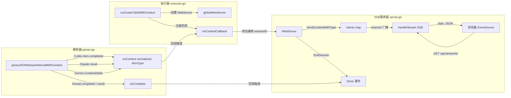
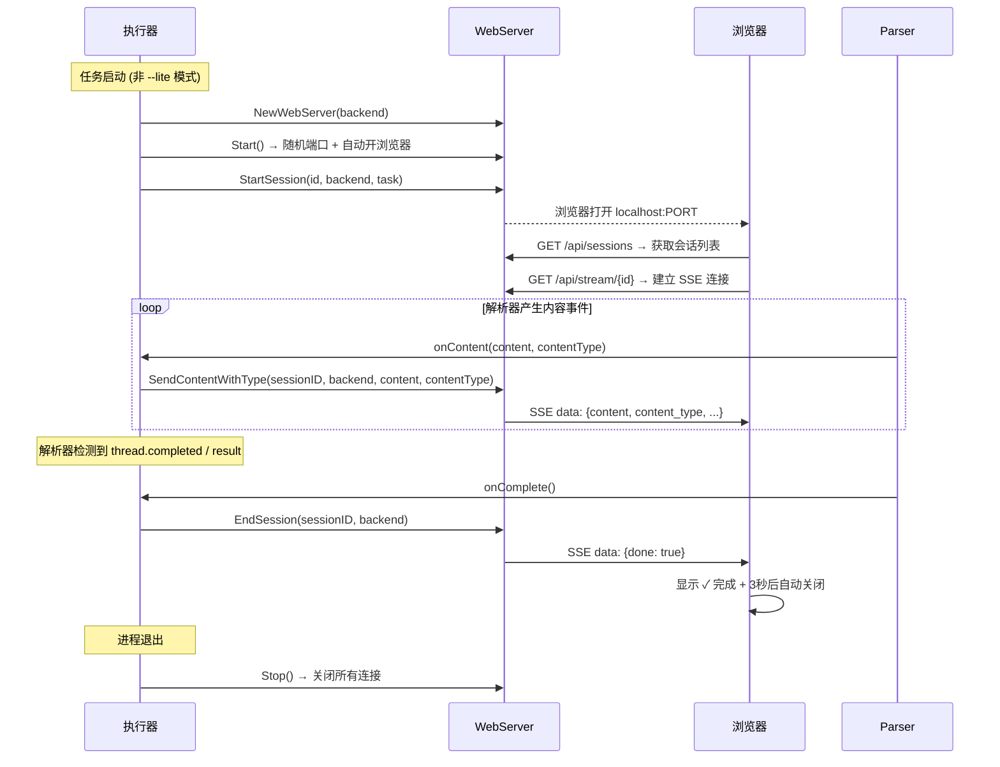

codeagent-wrapper 内嵌了一个轻量级 **SSE（Server-Sent Events）Web 服务器**，在每次任务执行时自动启动，将后端进程的标准输出流实时推送到浏览器 UI。该子系统是整个 CCG 工作流可视化链路的最后一环——从 [流式解析器](24-liu-shi-jie-xi-qi-parser-tong-shi-jian-jie-xi-yu-san-duan-json-liu-chu-li) 的统一事件解析开始，到执行器的回调分发，最终由 SSE 通道送达浏览器渲染。本文将深入剖析其架构设计、数据流管道、会话生命周期管理，以及与解析器/执行器之间的集成机制。

Sources: [server.go](codeagent-wrapper/server.go#L16-L24), [main.go](codeagent-wrapper/main.go#L63-L64)

## 核心架构：三组件协作模型

WebServer 并非独立运行，而是作为 **执行器 → 解析器 → SSE 管道** 链路中的终端节点。其设计遵循单一职责原则：接收已解析的内容事件，通过 HTTP/SSE 协议分发至浏览器客户端。



关键设计决策：**WebServer 与任务执行同生命周期**——每个 `codeagent-wrapper` 进程至多持有一个全局 `globalWebServer` 实例，在首个非 `--lite` 任务启动时创建，进程退出时销毁。这意味着 WebServer 的端口在每次运行时随机分配，不会出现端口冲突。

Sources: [executor.go](codeagent-wrapper/executor.go#L880-L896), [main.go](codeagent-wrapper/main.go#L155-L158)

## 数据结构：会话与事件模型

WebServer 的状态由两个核心数据结构管理：

| 结构体 | 职责 | 关键字段 |
|--------|------|----------|
| `WebServer` | SSE 连接管理器 | `clients map[string][]chan ContentEvent` — 按 sessionID 索引的订阅者通道列表；`sessions map[string]*SessionState` — 活跃会话状态 |
| `SessionState` | 会话追踪 | `ID`、`Backend`、`Task`、`StartTime`、`Content`（累积输出）、`Done` |
| `ContentEvent` | SSE 传输单元 | `SessionID`、`Backend`、`Content`、`ContentType`、`Done` |

`ContentEvent.ContentType` 是连接后端语义与前端渲染风格的桥梁，解析器根据后端事件类型自动映射：

| ContentType | 来源 | 含义 | 前端渲染 |
|-------------|------|------|----------|
| `"message"` | Codex `agent_message`、Claude `result`、Gemini `Content` | 最终输出文本 | 普通白色文本 |
| `"reasoning"` | Codex `item.completed` (item_type=reasoning) | 推理过程 | 灰色斜体 + 💭 前缀 |
| `"command"` | Codex `item.completed` (item_type=command_execution) | 命令执行 | 黄色等宽字体 + 左边框高亮 |

Sources: [server.go](codeagent-wrapper/server.go#L26-L43), [parser.go](codeagent-wrapper/parser.go#L262-L316)

## 会话生命周期：从创建到自动关闭

WebServer 的会话管理遵循严格的生命周期协议，由执行器在不同阶段触发：



会话 ID 的生成格式为 `{backend}-{unixMilli}-{randomHex}`，由时间戳和 4 字节随机数组成，确保全局唯一性。这个 ID 不同于后端进程自身的 session ID——后者由 Codex/Claude/Gemini 在运行时分配，仅用于 `Session-ID` 输出。

Sources: [executor.go](codeagent-wrapper/executor.go#L890-L896), [server.go](codeagent-wrapper/server.go#L145-L211)

## API 端点与 SSE 协议实现

WebServer 暴露三个 HTTP 端点，构成一个极简的 RESTful + SSE 接口层：

| 端点 | 方法 | 功能 |
|------|------|------|
| `/` | GET | 返回内嵌的单面板 HTML 页面（根据后端类型动态生成配色） |
| `/api/sessions` | GET | 返回 JSON 数组，包含所有活跃会话的状态 |
| `/api/stream/{sessionID}` | GET | SSE 长连接，实时推送指定会话的内容事件 |

### SSE 连接管理

`handleStream` 是核心的 SSE 处理器，其实现遵循标准的 SSE 协议规范：

**连接建立**：设置 `Content-Type: text/event-stream`、`Cache-Control: no-cache`、`Connection: keep-alive` 头，并启用 CORS（`Access-Control-Allow-Origin: *`）。每个连接创建一个容量为 100 的缓冲通道，注册到 `clients[sessionID]` 列表中。如果会话已经完成，立即发送 `Done` 事件，避免客户端无限等待。

**事件分发**：主循环通过 `select` 监听两个信号——内容事件通道和请求上下文取消（客户端断开）。每个事件序列化为 JSON 后以 `data: {json}\n\n` 格式写入响应并立即 Flush。

**连接清理**：通过 `defer` 确保 goroutine 退出时从 `clients` 映射中移除自身并关闭通道，防止内存泄漏。

Sources: [server.go](codeagent-wrapper/server.go#L482-L547)

## Web UI：内嵌式单面板渲染

WebServer 不依赖外部静态文件——整个前端页面通过 `generateIndexHTML()` 方法在 Go 代码中动态生成。这种设计消除了文件部署的复杂性，但将 HTML/CSS/JS 代码嵌入 Go 字符串中，以 `fmt.Sprintf` 注入动态参数。

### 后端配色方案

页面根据 `backend` 字段自动切换配色：

| 后端 | 图标文字 | 图标背景色 | 标题色 | 视觉识别 |
|------|----------|-----------|--------|----------|
| `codex` | CDX | `#238636` 绿色 | `#3fb950` | GitHub 风格绿色 |
| `gemini` | GEM | `#8957e5` 紫色 | `#a371f7` | Google 紫色系 |
| `claude` | CLD | `#d97706` 琥珀色 | `#fbbf24` | 暖色调金橙 |
| 默认 | AGT | `#238636` | `#3fb950` | 同 Codex |

### 前端交互流程

浏览器端 JavaScript 实现了**轮询等待 + SSE 流式消费**的混合模式：

1. **会话发现**：页面加载后通过 `fetch('/api/sessions')` 轮询等待会话出现（500ms 间隔），确保即使后端进程启动稍慢也能正常连接
2. **任务显示**：获取到会话后，将 `task` 字段以蓝色高亮格式渲染在输出区顶部
3. **SSE 消费**：通过 `EventSource('/api/stream/{id}')` 建立长连接，逐条解析 JSON 数据并根据 `content_type` 应用不同样式
4. **智能滚动**：监听用户滚动行为——如果用户手动向上滚动，停止自动跟随；新内容到达时仅在用户处于底部时自动滚动
5. **完成处理**：收到 `done: true` 后移除光标动画，隐藏 LIVE 指示器，尝试浏览器通知，并在 3 秒后自动关闭窗口

Sources: [server.go](codeagent-wrapper/server.go#L227-L467)

## Lite 模式：性能优先的无 UI 路径

`--lite`（或 `-L`）标志提供了一条完全跳过 WebServer 的快速路径。通过包级变量 `liteMode` 控制，该标志可通过两种方式启用：

- 命令行参数：`ccg-codex --lite "task"`
- 环境变量：`CODEAGENT_LITE_MODE=true`

Lite 模式的影响不限于 Web UI——它同时缩短了后端消息接收后的延迟等待时间（从 5 秒降至 1 秒），通过 `resolvePostMessageDelay()` 函数实现。这使得整个任务执行的响应速度更快，适合 CI/CD 环境或无需实时监控的自动化场景。

Sources: [config.go](codeagent-wrapper/config.go#L213-L214), [executor.go](codeagent-wrapper/executor.go#L28-L32), [main.go](codeagent-wrapper/main.go#L36-L38)

## 并发安全与优雅关闭

WebServer 的并发模型基于 `sync.RWMutex` 保护共享状态，读写分离：

- **写操作**（`StartSession`、`SendContentWithType`、`EndSession`、`Stop`）：获取完整互斥锁，修改 `sessions` 和 `clients` 映射
- **读操作**（`handleSessions`）：使用 `RLock`，允许多个 SSE 客户端同时读取会话列表
- **通道发送**：采用非阻塞 `select` + `default` 模式，当客户端通道已满时跳过该事件，避免慢客户端阻塞整个分发流程

`Stop()` 方法实现了两层清理：先关闭所有客户端通道（触发 SSE goroutine 退出），再通过 `http.Server.Shutdown()` 在 2 秒超时内优雅关闭 HTTP 服务。这确保即使有活跃的 SSE 连接，进程也能在合理时间内退出。

Sources: [server.go](codeagent-wrapper/server.go#L93-L113), [server.go](codeagent-wrapper/server.go#L164-L188)

## 浏览器启动的跨平台处理

`openBrowser` 函数根据操作系统选择合适的命令打开默认浏览器，并特别处理了 Windows 平台的 CMD 窗口隐藏问题。为防止僵尸进程，浏览器进程通过 `cmd.Start()` + 后台 `cmd.Wait()` 的模式启动，确保子进程资源被正确回收。

| 平台 | 命令 | 特殊处理 |
|------|------|----------|
| macOS | `open URL` | 无 |
| Linux | `xdg-open URL` | 无 |
| Windows | `rundll32 url.dll,FileProtocolHandler URL` | 调用 `hideWindowsConsole` 隐藏 CMD 窗口 |

Sources: [server.go](codeagent-wrapper/server.go#L116-L143)

## 从解析器到 WebServer 的内容桥接

理解 SSE WebServer 的关键在于把握**回调链**的组装过程。执行器 `runCodexTaskWithContext` 在启动解析 goroutine 之前，构造了一个闭包回调 `onContentCallback`，该闭包捕获了当前任务的 `webSessionID` 和 `backendName`：

```go
// executor.go L1058-L1066
onContentCallback = func(content, contentType string) {
    globalWebServer.SendContentWithType(sessionID, backendName, content, contentType)
}
```

这个闭包被传递给解析器的 `parseJSONStreamInternalWithContent` 函数，在解析器识别到有意义的内容事件时触发。整个回调链的调用时机与后端类型直接相关：

- **Codex**：`item.completed` 事件中，根据 `item_type` 区分 `agent_message`（message）、`reasoning`、`command_execution`（command）
- **Claude**：`result` 事件中提取 `event.Result` 字段，以 `"message"` 类型发送
- **Gemini**：`Content` 字段非空时以 `"message"` 类型发送，支持流式 delta 增量

Sources: [executor.go](codeagent-wrapper/executor.go#L1058-L1106), [parser.go](codeagent-wrapper/parser.go#L261-L355)

## 相关阅读

- [流式解析器（Parser）](24-liu-shi-jie-xi-qi-parser-tong-shi-jian-jie-xi-yu-san-duan-json-liu-chu-li)：理解 SSE 事件的数据来源——统一事件解析如何将三种后端的 JSON 流标准化
- [执行器（Executor）](23-zhi-xing-qi-executor-jin-cheng-sheng-ming-zhou-qi-hui-hua-guan-li-yu-chao-shi-kong-zhi)：WebServer 生命周期的管理者——何时创建、何时销毁
- [并行执行引擎](25-bing-xing-zhi-xing-yin-qing-parallel-mo-shi-yu-ren-wu-yi-lai-guan-li)：并行模式下 WebServer 的行为差异——silent 模式下的特殊处理
- [Backend 抽象层](22-backend-chou-xiang-ceng-codex-claude-gemini-hou-duan-jie-kou-shi-xian)：后端类型如何影响 Web UI 的配色与标识