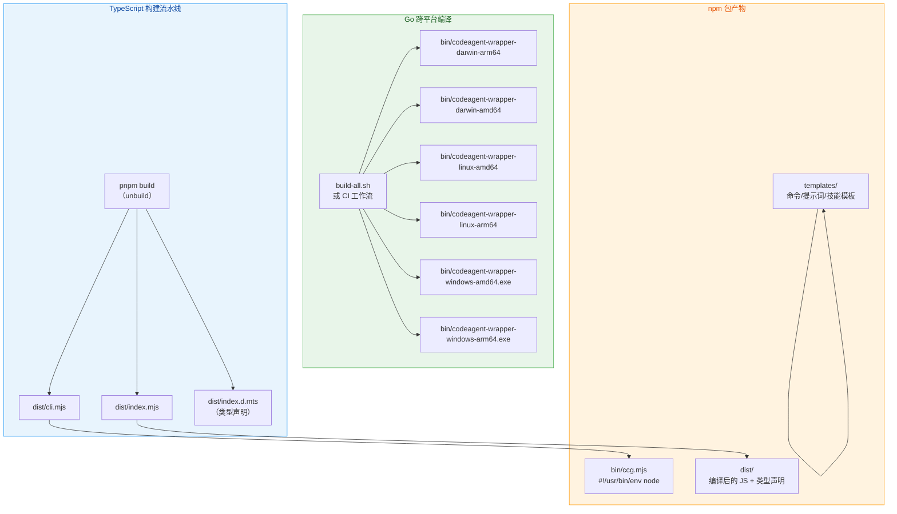
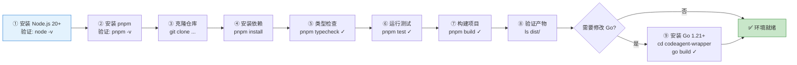

本文档面向希望参与 CCG 项目开发或进行本地构建的开发者，系统讲解从零搭建开发环境到完成完整构建的每一步操作。CCG 项目是一个 **双语言混合项目**——TypeScript CLI 工具与 Go 二进制 wrapper 协同工作，因此开发环境的搭建也涉及两条并行的工具链。

Sources: [package.json](package.json#L1-L111), [CONTRIBUTING.md](CONTRIBUTING.md#L1-L135)

## 先决条件：双语言工具链概览

CCG 的核心架构由两大部分组成：**TypeScript CLI 层**（安装器、命令模板、配置管理）和 **Go 二进制层**（codeagent-wrapper，负责进程管理与流式输出解析）。下表清晰列出了各层所需的环境依赖：

| 依赖项 | 最低版本 | 用途范围 | 必需性 |
|--------|---------|---------|--------|
| Node.js | 20+ | TypeScript 编译、CLI 运行、VitePress 文档 | ✅ 必需 |
| pnpm | 10+（推荐 10.17.1） | 包管理器，锁定依赖版本 | ✅ 必需 |
| Go | 1.21+ | 编译 codeagent-wrapper 二进制 | ⚠️ 仅修改 Go 代码时需要 |
| Git | 2.x+ | 版本控制 | ✅ 必需 |

项目通过 `packageManager` 字段锁定了 pnpm 版本为 `10.17.1`，确保所有开发者使用一致的包管理器行为。CI 流水线同时在 Node.js 20 和 22 上运行测试，因此本地开发建议使用 Node.js 20 LTS 以获得最佳兼容性。

Sources: [package.json](package.json#L6-L6), [.github/workflows/ci.yml](.github/workflows/ci.yml#L13-L14), [codeagent-wrapper/go.mod](codeagent-wrapper/go.mod#L3-L3), [CONTRIBUTING.md](CONTRIBUTING.md#L8-L11)

## 项目结构：双代码库协同

理解项目结构是搭建开发环境的第一步。CCG 的目录设计遵循"源码-模板-产物"三层分离原则：

```
ccg-workflow/
├── src/                        # TypeScript 源码
│   ├── cli.ts                  # CLI 入口（开发模式入口）
│   ├── cli-setup.ts            # 命令注册与帮助信息
│   ├── commands/               # CLI 子命令实现
│   │   ├── init.ts             # ccg init 命令
│   │   ├── menu.ts             # 交互式菜单
│   │   ├── update.ts           # ccg update 命令
│   │   ├── config-mcp.ts       # MCP 配置子命令
│   │   └── diagnose-mcp.ts     # MCP 诊断子命令
│   ├── i18n/                   # 国际化翻译
│   ├── types/                  # TypeScript 类型定义
│   └── utils/                  # 核心工具函数
│       ├── installer.ts        # 安装器主逻辑
│       ├── installer-template.ts # 模板变量注入
│       ├── installer-data.ts   # 工作流预设数据
│       ├── installer-mcp.ts    # MCP 安装逻辑
│       ├── config.ts           # 配置文件读写
│       ├── platform.ts         # 跨平台兼容工具
│       ├── skill-registry.ts   # Skill 自动发现
│       └── __tests__/          # Vitest 单元测试
├── codeagent-wrapper/          # Go 源码（独立模块）
│   ├── main.go                 # Go 入口 + 并行模式
│   ├── backend.go              # 后端抽象层
│   ├── executor.go             # 执行器（进程管理）
│   ├── parser.go               # 流式 JSON 解析器
│   ├── server.go               # SSE WebServer
│   ├── config.go               # 运行时配置
│   ├── logger.go               # 日志管理
│   ├── filter.go               # 输出过滤
│   ├── *_test.go               # Go 测试文件（10+ 个）
│   ├── go.mod                  # Go 模块定义（Go 1.21）
│   └── build-all.sh            # 跨平台编译脚本
├── templates/                  # 安装模板（打包到 npm）
│   ├── commands/               # 29+ 斜杠命令模板
│   ├── prompts/                # 角色提示词
│   ├── skills/                 # Skill 文件
│   ├── rules/                  # 路由规则
│   └── output-styles/          # 输出风格模板
├── bin/
│   └── ccg.mjs                 # CLI 启动入口（#!/usr/bin/env node）
├── docs/                       # VitePress 文档站点
├── build.config.ts             # unbuild 构建配置
├── tsconfig.json               # TypeScript 编译配置
├── vitest.config.ts            # 测试框架配置
└── package.json                # 项目元数据与脚本
```

**关键设计要点**：`bin/ccg.mjs` 是 npm 包的 CLI 入口点，仅包含一行 `import '../dist/cli.mjs'`，它指向 `unbuild` 编译后的产物。`templates/` 目录中的 Markdown 文件通过 `{{VARIABLE}}` 占位符实现安装时的动态注入，这些文件直接打包进 npm 发布包。

Sources: [bin/ccg.mjs](bin/ccg.mjs#L1-L3), [package.json](package.json#L21-L71), [build.config.ts](build.config.ts#L1-L15), [.npmignore](.npmignore#L1-L55)

## TypeScript 开发环境搭建

### 第一步：安装 Node.js 与 pnpm

推荐使用 `nvm` 或 `fnm` 管理 Node.js 版本，确保与 CI 环境一致：

```bash
# 安装 Node.js 20 LTS
nvm install 20
nvm use 20

# 启用 pnpm（如果尚未安装）
corepack enable
# 或通过 npm 全局安装
npm install -g pnpm
```

### 第二步：克隆仓库并安装依赖

```bash
# 克隆仓库
git clone https://github.com/fengshao1227/ccg-workflow.git
cd ccg-workflow

# 安装依赖（严格遵循 lockfile，确保可复现性）
pnpm install --frozen-lockfile
```

`--frozen-lockfile` 参数确保安装过程严格遵循 `pnpm-lock.yaml`，避免因依赖版本漂移导致的构建失败。项目的 `pnpm.onlyBuiltDependencies` 配置仅允许 `esbuild` 执行原生编译，其余依赖跳过构建脚本以提升安装速度。

Sources: [package.json](package.json#L96-L98), [CONTRIBUTING.md](CONTRIBUTING.md#L15-L28)

### 第三步：验证环境

安装完成后，运行以下命令确认环境正确：

```bash
# 类型检查（确认 TypeScript 编译无错误）
pnpm typecheck

# 运行测试套件
pnpm test

# 构建项目
pnpm build
```

如果三条命令均无报错，说明 TypeScript 开发环境已就绪。

## Go 开发环境搭建（可选）

仅当你需要修改 `codeagent-wrapper/` 下的 Go 源码时才需要配置 Go 环境。Go 模块是独立于 Node.js 生态的，它拥有自己的依赖管理（`go.mod`）和测试体系。

### 安装 Go 1.21+

```bash
# macOS (Homebrew)
brew install go

# 或使用官方安装包
# https://go.dev/dl/
```

### 验证 Go 环境

```bash
cd codeagent-wrapper

# 验证模块加载（无 go.sum 时会自动生成）
go mod tidy

# 编译检查
go build -o /dev/null .

# 运行测试
go test -short ./...
```

Go 模块声明为 `codeagent-wrapper`，要求 Go 1.21+。该模块没有外部依赖（`go.mod` 仅声明模块名和 Go 版本），所有功能均通过标准库实现，这使得编译速度极快。

Sources: [codeagent-wrapper/go.mod](codeagent-wrapper/go.mod#L1-L4), [.github/workflows/ci.yml](.github/workflows/ci.yml#L38-L53)

## 构建流程详解

CCG 的构建流程分为 **TypeScript 构建**和 **Go 跨平台编译**两个独立阶段。以下流程图展示了完整的构建流水线：



### TypeScript 构建：unbuild

项目使用 [unbuild](https://github.com/unjs/unbuild) 作为 TypeScript 构建工具，配置极为精简：

```typescript
// build.config.ts
export default defineBuildConfig({
  entries: ['src/cli', 'src/index'],  // 两个入口
  declaration: true,                   // 生成 .d.mts 类型声明
  clean: true,                         // 每次构建前清理 dist/
  rollup: {
    emitCJS: false,                    // 不输出 CommonJS
    inlineDependencies: true,          // 内联所有依赖
  },
})
```

**构建产物说明**：

| 入口文件 | 输出文件 | 用途 |
|---------|---------|------|
| `src/cli.ts` | `dist/cli.mjs` | CLI 运行时入口，被 `bin/ccg.mjs` 引用 |
| `src/index.ts` | `dist/index.mjs` + `dist/index.d.mts` | 库导出入口，供外部代码集成 |

`inlineDependencies: true` 意味着所有运行时依赖（`ansis`、`cac`、`fs-extra`、`inquirer` 等）会被内联打包进产物，最终用户无需安装这些依赖。`emitCJS: false` 明确声明本项目仅支持 ESM 格式，与 `package.json` 中的 `"type": "module"` 保持一致。

Sources: [build.config.ts](build.config.ts#L1-L15), [package.json](package.json#L5-L5), [package.json](package.json#L24-L26)

### Go 跨平台编译

`codeagent-wrapper` 需要为 6 个平台×架构组合编译独立二进制。本地开发可通过 `build-all.sh` 脚本完成：

```bash
cd codeagent-wrapper
bash build-all.sh
```

该脚本为每个目标设置 `GOOS` 和 `GOARCH` 环境变量后执行 `go build`，产物输出到 `../bin/` 目录。CI 环境中的构建流程（`.github/workflows/build-binaries.yml`）额外添加了 `-ldflags="-s -w"` 参数以剥离调试信息、减小二进制体积，并将产物发布到 GitHub Release 的 `preset` 标签。

**跨平台编译目标**：

| 平台 | 架构 | 产物名 | 说明 |
|------|------|--------|------|
| macOS | arm64 | `codeagent-wrapper-darwin-arm64` | Apple Silicon (M1/M2/M3) |
| macOS | amd64 | `codeagent-wrapper-darwin-amd64` | Intel Mac |
| Linux | amd64 | `codeagent-wrapper-linux-amd64` | x86_64 服务器 |
| Linux | arm64 | `codeagent-wrapper-linux-arm64` | ARM 服务器 |
| Windows | amd64 | `codeagent-wrapper-windows-amd64.exe` | x86_64 PC |
| Windows | arm64 | `codeagent-wrapper-windows-arm64.exe` | ARM 设备 |

Sources: [codeagent-wrapper/build-all.sh](codeagent-wrapper/build-all.sh#L1-L29), [.github/workflows/build-binaries.yml](.github/workflows/build-binaries.yml#L28-L43)

## 开发工作流常用命令

项目在 `package.json` 中定义了完整的脚本集，覆盖日常开发的各个环节：

| 命令 | 用途 | 说明 |
|------|------|------|
| `pnpm dev` | 开发模式运行 CLI | 使用 `tsx` 直接执行 TypeScript 源码，无需预编译 |
| `pnpm build` | 生产构建 | 调用 unbuild 编译 TypeScript，输出到 `dist/` |
| `pnpm start` | 运行编译后 CLI | `node bin/ccg.mjs`，需要先 `pnpm build` |
| `pnpm test` | 运行测试 | Vitest 单元测试，扫描 `src/**/__tests__/**/*.test.ts` |
| `pnpm typecheck` | 类型检查 | `tsc --noEmit`，仅检查不输出 |
| `pnpm lint` | 代码检查 | ESLint（使用 `@antfu/eslint-config`） |
| `pnpm lint:fix` | 自动修复代码风格 | ESLint --fix |
| `pnpm docs:dev` | 文档开发服务器 | VitePress 热重载开发模式 |
| `pnpm docs:build` | 构建文档站点 | 输出到 `docs/.vitepress/dist/` |
| `pnpm docs:preview` | 预览构建后文档 | 本地预览生产环境文档效果 |

**开发模式的核心优势**：`pnpm dev` 通过 `tsx`（TypeScript Execute）直接运行 `src/cli.ts` 源码，跳过了编译步骤，实现了"修改即生效"的快速迭代体验。这意味着你可以在修改源码后立即通过 `pnpm dev init` 验证变更效果，无需等待构建。

Sources: [package.json](package.json#L72-L84)

## TypeScript 编译配置要点

`tsconfig.json` 的配置反映了项目的现代化 ESM 架构决策：

| 配置项 | 值 | 设计意图 |
|--------|---|---------|
| `target` | `ESNext` | 使用最新 ECMAScript 特性 |
| `module` | `ESNext` | ESM 模块格式 |
| `moduleResolution` | `bundler` | 适配 unbuild 等 bundler 的模块解析策略 |
| `strict` | `true` | 启用所有严格类型检查 |
| `noEmit` | `true` | tsc 仅做类型检查，不输出文件（由 unbuild 负责编译） |
| `isolatedModules` | `true` | 确保每个文件可独立转译，兼容 bundler |
| `types` | `["node"]` | 仅加载 Node.js 类型定义 |

`noEmit: true` 是一个关键设计——TypeScript 编译器仅负责类型检查（`pnpm typecheck`），实际的 JavaScript 产物由 unbuild 生成。这避免了两个工具同时写 `dist/` 目录的冲突问题。

Sources: [tsconfig.json](tsconfig.json#L1-L21)

## 测试配置与运行

### Vitest 单元测试（TypeScript）

测试配置位于 `vitest.config.ts`，测试文件存放于 `src/utils/__tests__/` 目录：

```typescript
// vitest.config.ts
export default defineConfig({
  test: {
    include: ['src/**/__tests__/**/*.test.ts'],
  },
})
```

当前测试覆盖了 6 个核心模块：

| 测试文件 | 被测模块 |
|---------|---------|
| `config.test.ts` | `utils/config.ts` — 配置文件读写 |
| `injectConfigVariables.test.ts` | `utils/installer-template.ts` — 模板变量注入 |
| `installWorkflows.test.ts` | `utils/installer.ts` — 工作流安装逻辑 |
| `installer.test.ts` | `utils/installer.ts` — 安装器集成测试 |
| `platform.test.ts` | `utils/platform.ts` — 跨平台兼容工具 |
| `version.test.ts` | `utils/version.ts` — 版本比较与更新检查 |

### Go 测试

Go 测试文件与源码同目录放置，共 10+ 个测试文件覆盖所有核心模块。运行短测试：

```bash
cd codeagent-wrapper
go test -short ./...
```

`-short` 标志跳过耗时较长的集成测试和压力测试（如 `concurrent_stress_test.go`、`main_integration_test.go`），适合日常开发快速验证。

Sources: [vitest.config.ts](vitest.config.ts#L1-L7), [.github/workflows/ci.yml](.github/workflows/ci.yml#L38-L53)

## npm 包发布与产物裁剪

发布到 npm 的包通过 `files` 和 `.npmignore` 双重机制精确控制产物范围。`package.json` 的 `files` 字段采用**白名单策略**，仅包含 `bin/ccg.mjs`、`dist/` 以及 `templates/` 中经过验证的子目录。`.npmignore` 则进一步**排除**开发文件（`src/`、`*.test.ts`、构建配置、Go 源码等）。

这种"白名单 + 黑名单"双重过滤确保了 npm 包体积最小化——用户通过 `npx ccg-workflow` 安装时只会获得运行时必需的文件，不会包含 TypeScript 源码、测试文件或 Go 构建脚本。

Sources: [package.json](package.json#L27-L71), [.npmignore](.npmignore#L1-L55)

## 文档开发（VitePress）

CCG 使用 VitePress 构建双语文档站点（中文 + English）。文档配置位于 `docs/.vitepress/config.mts`，支持本地开发热重载：

```bash
# 启动文档开发服务器（默认 http://localhost:5173）
pnpm docs:dev

# 构建生产文档
pnpm docs:build
```

文档站点的 `base` 路径设置为 `/ccg-workflow/`，与 GitHub Pages 部署路径匹配。`cleanUrls: true` 启用了干净的 URL 格式（无 `.html` 后缀）。修改文档后，CI 会自动部署到 GitHub Pages（详见 [CI/CD 流水线：GitHub Actions 构建与部署](29-ci-cd-liu-shui-xian-github-actions-gou-jian-yu-bu-shu)）。

Sources: [docs/.vitepress/config.mts](docs/.vitepress/config.mts#L1-L127), [.github/workflows/deploy-docs.yml](.github/workflows/deploy-docs.yml#L1-L56)

## 环境搭建快速检查清单

以下流程图总结了从零搭建到成功构建的完整路径，每一步都有明确的验证标准：



**常见问题排查**：

| 症状 | 可能原因 | 解决方法 |
|------|---------|---------|
| `pnpm install` 报错 | pnpm 版本过低 | `corepack enable` 或 `npm i -g pnpm@latest` |
| `pnpm typecheck` 类型错误 | `node_modules` 不完整 | 删除 `node_modules` 后重新 `pnpm install` |
| `pnpm build` 失败 | TypeScript 语法错误 | 先运行 `pnpm typecheck` 定位具体错误 |
| Go 编译失败 | Go 版本 < 1.21 | `brew upgrade go` 或下载最新版 |
| `pnpm dev` 报模块找不到 | 未安装依赖 | 执行 `pnpm install` |

Sources: [CONTRIBUTING.md](CONTRIBUTING.md#L5-L28), [.github/workflows/ci.yml](.github/workflows/ci.yml#L1-L54)

## 下一步阅读

环境搭建完成后，建议按以下顺序深入理解项目：

- **[测试体系：Vitest 单元测试与 Go 测试](28-ce-shi-ti-xi-vitest-dan-yuan-ce-shi-yu-go-ce-shi)** — 了解如何编写和运行测试
- **[CI/CD 流水线：GitHub Actions 构建与部署](29-ci-cd-liu-shui-xian-github-actions-gou-jian-yu-bu-shu)** — 理解自动化构建与发布流程
- **[贡献指南：提交规范与 PR 流程](30-gong-xian-zhi-nan-ti-jiao-gui-fan-yu-pr-liu-cheng)** — 开始贡献代码前必读