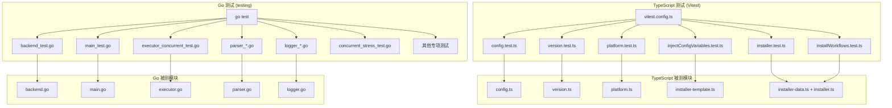
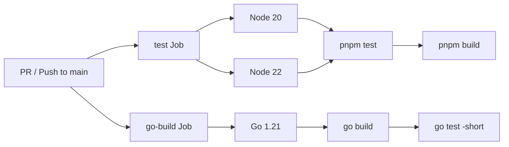

CCG 项目的测试体系横跨两个技术栈——TypeScript 侧使用 **Vitest** 作为测试框架，覆盖安装器、配置系统和模板变量注入等核心逻辑；Go 侧使用标准库 `testing` 包，覆盖 `codeagent-wrapper` 二进制的后端抽象、执行器、流式解析器和并发引擎。两套测试在 CI 中独立运行，共同守护项目从 CLI 安装到二进制执行的完整链路。

Sources: [package.json](package.json#L72-L83) [vitest.config.ts](vitest.config.ts#L1-L8) [.github/workflows/ci.yml](.github/workflows/ci.yml#L1-L54)

## 测试架构总览

项目测试按技术栈分为两个独立子系统，各自拥有完整的测试运行器、Mock 基础设施和覆盖范围。下图展示了两个测试子系统与被测模块的对应关系：



Sources: [vitest.config.ts](vitest.config.ts#L1-L8) [codeagent-wrapper/go.mod](codeagent-wrapper/go.mod#L1-L4)

## Vitest 测试：TypeScript 侧

### 配置与运行方式

Vitest 配置极为精简——仅通过 `include` 字段将测试文件范围限定在 `src/**/__tests__/**/*.test.ts`，确保只有符合命名约定的文件被收集。运行命令为 `pnpm test`（即 `vitest run`），以单次执行模式运行而非 watch 模式，适合 CI 环境。

Sources: [vitest.config.ts](vitest.config.ts#L1-L8) [package.json](package.json#L72-L83)

### 测试文件结构与覆盖范围

项目共 **6 个测试文件**，约 994 行测试代码，覆盖 123 个测试用例。下表按测试职责分类说明：

| 测试文件 | 行数 | 测试用例数 | 覆盖范围 |
|---|---|---|---|
| [installer.test.ts](src/utils/__tests__/installer.test.ts) | 414 | 38 | 工作流注册表一致性、变量注入、E2E 安装/卸载、二进制部署 |
| [injectConfigVariables.test.ts](src/utils/__tests__/injectConfigVariables.test.ts) | 228 | 21 | MCP 提供者注入（skip/ace-tool/contextweaver）、真实模板集成 |
| [platform.test.ts](src/utils/__tests__/platform.test.ts) | 79 | 18 | 跨平台检测、MCP 命令适配、路径分隔符 |
| [config.test.ts](src/utils/__tests__/config.test.ts) | 91 | 17 | 默认配置创建、路由配置、MCP 提供者、路径设置 |
| [version.test.ts](src/utils/__tests__/version.test.ts) | 63 | 16 | 语义版本比较、边界条件（大版本号、段数不一致） |
| [installWorkflows.test.ts](src/utils/__tests__/installWorkflows.test.ts) | 119 | 13 | 工作流安装 E2E、MCP 注入验证、技能命名空间隔离 |

Sources: [src/utils/__tests__/](src/utils/__tests__)

### 测试设计模式

Vitest 测试采用以下四种核心模式，每种模式解决不同层次的验证需求：

**1. 纯函数单元测试**——针对无副作用的工具函数，直接断言输入输出。`version.test.ts` 中的 `compareVersions` 测试是典型代表：覆盖 major/minor/patch 比较以及段数不一致等边界条件。

```typescript
// 典型模式：直接测试纯函数
it('returns 1 when v1 > v2 (patch)', () => {
  expect(compareVersions('1.7.67', '1.7.66')).toBe(1)
})
```

Sources: [version.test.ts](src/utils/__tests__/version.test.ts#L26-L28)

**2. 配置工厂测试**——验证工厂函数的默认值和自定义覆盖。`config.test.ts` 通过 `createDefaultConfig` 和 `createDefaultRouting` 两个工厂函数，系统性地检查每个字段的默认值和可覆盖性。

Sources: [config.test.ts](src/utils/__tests__/config.test.ts#L29-L91)

**3. 模板变量注入测试**——这是项目最关键的测试维度。`injectConfigVariables.test.ts` 针对三种 MCP 提供者（skip、ace-tool、contextweaver）分别验证变量替换行为。`skip` 模式的测试尤其详尽，覆盖了 frontmatter 工具声明清理、代码块替换、行内反引号引用替换和裸文本替换四种上下文。

Sources: [injectConfigVariables.test.ts](src/utils/__tests__/injectConfigVariables.test.ts#L27-L129)

**4. 真实模板集成测试**——超越单元层面，直接遍历 `templates/commands/` 下的所有 Markdown 模板文件，验证注入后不存在残留的 `{{MCP_SEARCH_TOOL}}` 或 `{{MCP_SEARCH_PARAM}}` 模板变量。这种"真实文件遍历 + 批量断言"模式确保模板变更不会引入未处理的变量。

Sources: [injectConfigVariables.test.ts](src/utils/__tests__/injectConfigVariables.test.ts#L183-L228)

### E2E 测试：安装器流水线验证

`installer.test.ts` 和 `installWorkflows.test.ts` 构成了安装器的端到端验证层。测试使用 `os.tmpdir()` 创建临时目录，执行完整的 `installWorkflows` → `uninstallWorkflows` 生命周期，验证内容包括：

- **工作流注册表一致性**：每个命令 ID 有对应模板文件，每个模板文件有对应注册配置，ID 唯一无重复
- **安装后文件内容**：ace-tool 模式下包含 `mcp__ace-tool__search_context`，skip 模式下包含 `Glob + Grep` 回退提示
- **卸载隔离性**：只删除 `skills/ccg/` 命名空间，保留用户自定义技能（如 `skills/my-custom-skill/`）
- **旧版迁移**：v1.7.73 布局从 `skills/` 根目录自动迁移到 `skills/ccg/` 命名空间

Sources: [installer.test.ts](src/utils/__tests__/installer.test.ts#L29-L414) [installWorkflows.test.ts](src/utils/__tests__/installWorkflows.test.ts#L28-L119)

## Go 测试：codeagent-wrapper 二进制

### 测试规模与分布

Go 侧测试规模远大于 TypeScript 侧——共 **17 个测试文件**，约 9,574 行测试代码，包含 254 个测试函数和 2 个基准测试函数。`main_test.go` 以 4,288 行（152 个测试函数）成为最大的测试文件，其中大量代码用于构建 Mock 基础设施。

Sources: [codeagent-wrapper/](codeagent-wrapper)

| 测试文件 | 行数 | 测试函数 | 覆盖领域 |
|---|---|---|---|
| [main_test.go](codeagent-wrapper/main_test.go) | 4,288 | 152 | 主流程、CLI 参数解析、信号处理、会话管理 |
| [executor_concurrent_test.go](codeagent-wrapper/executor_concurrent_test.go) | 1,434 | 11 | 并行执行、任务调度、进程生命周期 |
| [main_integration_test.go](codeagent-wrapper/main_integration_test.go) | 923 | 12 | 输出解析、集成输出格式、任务结果提取 |
| [logger_test.go](codeagent-wrapper/logger_test.go) | 1,128 | 30 | 日志创建、级别写入、并发安全、日志清理 |
| [concurrent_stress_test.go](codeagent-wrapper/concurrent_stress_test.go) | 434 | 8 | 高并发压力、突发流量、channel 容量、内存使用 |
| [backend_test.go](codeagent-wrapper/backend_test.go) | 290 | 7 | Claude/Gemini/Codex 后端参数构建 |
| [process_check_test.go](codeagent-wrapper/process_check_test.go) | 217 | 6 | 进程存活检测、PID 边界值、启动时间读取 |
| [utils_test.go](codeagent-wrapper/utils_test.go) | 143 | 5 | 覆盖率提取、测试结果解析、文件变更提取 |
| [logger_additional_coverage_test.go](codeagent-wrapper/logger_additional_coverage_test.go) | 158 | 5 | nil 接收者、并发辅助函数、不安全文件检测 |
| [logger_suffix_test.go](codeagent-wrapper/logger_suffix_test.go) | 115 | 3 | 日志文件后缀隔离、不安全后缀清洗 |
| [parser_unknown_event_test.go](codeagent-wrapper/parser_unknown_event_test.go) | 115 | 5 | 未知事件静默处理、进度行发射、参数解析 |
| [path_normalization_test.go](codeagent-wrapper/path_normalization_test.go) | 93 | 2 | Windows 路径规范化（Git Bash 风格） |
| [filter_test.go](codeagent-wrapper/filter_test.go) | 73 | 2 | stderr 噪声过滤（STARTUP/Warning 等） |
| [wrapper_name_test.go](codeagent-wrapper/wrapper_name_test.go) | 50 | 2 | 二进制名称检测、legacy 别名符号链接 |
| [log_writer_limit_test.go](codeagent-wrapper/log_writer_limit_test.go) | 39 | 1 | 日志写入缓冲区大小限制 |
| [parser_token_too_long_test.go](codeagent-wrapper/parser_token_too_long_test.go) | 31 | 1 | 超长 JSON 行跳过与恢复 |
| [bench_test.go](codeagent-wrapper/bench_test.go) | 39 | 2 (Benchmark) | 日志写入性能基准测试 |

Sources: [codeagent-wrapper/](codeagent-wrapper)

### Mock 基础设施：函数钩子与接口替身

Go 测试最显著的设计特征是**函数变量钩子注入**模式。`main_test.go` 开头定义了 `resetTestHooks()` 函数，将所有可覆盖的函数指针恢复为默认实现：

```go
func resetTestHooks() {
    stdinReader = os.Stdin
    isTerminalFn = defaultIsTerminal
    codexCommand = "codex"
    selectBackendFn = selectBackend
    commandContext = exec.CommandContext
    jsonMarshal = json.Marshal
    forceKillDelay.Store(5)
    exitFn = os.Exit
    // ... 更多钩子
}
```

每个测试通过局部替换这些函数变量来实现隔离，无需依赖外部 Mock 框架。配合 `defer resetTestHooks()` 确保测试间状态清洁。`commandRunner` 接口则通过 `fakeCmd`、`execFakeRunner` 等实现提供了对进程启动、管道读写、信号发送的完整模拟。

Sources: [main_test.go](codeagent-wrapper/main_test.go#L24-L46) [main_test.go](codeagent-wrapper/main_test.go#L90-L96) [main_test.go](codeagent-wrapper/main_test.go#L377-L400)

### 表格驱动测试

多个测试文件使用 Go 标准的表格驱动模式（Table-Driven Tests），将输入-期望输出对组织为结构体切片。`utils_test.go`、`filter_test.go`、`path_normalization_test.go` 和 `backend_test.go` 都采用了这种模式。`filter_test.go` 的例子最能说明其简洁性：

```go
func TestFilteringWriter(t *testing.T) {
    tests := []struct {
        name     string
        patterns []string
        input    string
        want     string
    }{
        {"filter STARTUP lines", noisePatterns,
            "[STARTUP] Recording metric\nHello World\n[STARTUP] Another line\n",
            "Hello World\n"},
        // ... 更多用例
    }
    for _, tt := range tests {
        t.Run(tt.name, func(t *testing.T) { /* ... */ })
    }
}
```

Sources: [filter_test.go](codeagent-wrapper/filter_test.go#L8-L59) [utils_test.go](codeagent-wrapper/utils_test.go#L10-L95)

### 并发与压力测试

`concurrent_stress_test.go` 包含 8 个专门验证并发安全性的测试，分为四个层次：

| 测试层次 | 代表性测试 | 并发规模 | 验证目标 |
|---|---|---|---|
| 高并发写入 | `TestConcurrentStressLogger` | 100 goroutine × 1,000 条 | 日志完整性 |
| 突发流量 | `TestConcurrentBurstLogger` | 10 轮 × 50 goroutine × 100 条 | 突发恢复能力 |
| Channel 容量 | `TestLoggerChannelCapacity` | 单线程 2,000 条（超 channel 容量） | 非阻塞写入降级 |
| 顺序保持 | `TestLoggerOrderPreservation` | 10 goroutine × 100 条 | goroutine 内序列递增 |

这些测试通过 `testing.Short()` 守卫——`go test -short` 时跳过，`go test` 完整运行时执行。CI 默认使用 `-short` 标志，开发者可在本地运行完整压力测试。

Sources: [concurrent_stress_test.go](codeagent-wrapper/concurrent_stress_test.go#L27-L97) [concurrent_stress_test.go](codeagent-wrapper/concurrent_stress_test.go#L166-L202) [.github/workflows/ci.yml](.github/workflows/ci.yml#L52-L53)

### 执行器并发测试

`executor_concurrent_test.go` 使用 `execFakeRunner` 模拟进程行为，验证并行执行引擎的核心逻辑：

- **Worker 池限制**：`TestConcurrentWorkerPoolLimit` 验证 worker_limit=2 时，同时活跃的任务数不超过 2
- **取消传播**：`TestConcurrentCancellationPropagation` 验证 context 取消时所有运行中任务收到信号
- **进程信号处理**：通过 `fakeProcess` 记录发送的信号类型和次数，验证 SIGTERM/SIGKILL 的时序正确性

Sources: [executor_concurrent_test.go](codeagent-wrapper/executor_concurrent_test.go#L85-L152)

### 跨平台测试策略

Go 侧通过构建标签（Build Tags）实现平台隔离。`process_check_test.go` 使用 `//go:build unix || darwin || linux` 标签，确保进程检测逻辑的测试仅在支持 `/proc` 文件系统的平台上运行。`path_normalization_test.go` 则专门验证 Windows Git Bash 风格路径（如 `/c/Users/foo`）到原生路径（`C:/Users/foo`）的转换。

TypeScript 侧通过 `process.platform` 运行时检测实现条件测试——`platform.test.ts` 在 Windows 和 Unix 上分别验证 `getMcpCommand` 的不同行为，无需 Mock 平台 API。

Sources: [process_check_test.go](codeagent-wrapper/process_check_test.go#L1-L2) [path_normalization_test.go](codeagent-wrapper/path_normalization_test.go#L9-L60) [platform.test.ts](src/utils/__tests__/platform.test.ts#L28-L55)

## CI 集成

GitHub Actions CI 配置了两个独立 Job 运行两套测试：



| Job | 运行环境 | 关键步骤 | 矩阵 |
|---|---|---|---|
| `test` | ubuntu-latest | typecheck → vitest → build | Node 20, Node 22 |
| `go-build` | ubuntu-latest | go build → go test -short | 无矩阵 |

Go 测试使用 `-short` 标志跳过压力测试，保持 CI 执行时间在合理范围。开发者可以在本地执行 `cd codeagent-wrapper && go test ./...` 运行包含压力测试的完整套件。

Sources: [.github/workflows/ci.yml](.github/workflows/ci.yml#L9-L53)

## 本地运行指南

```bash
# TypeScript 测试（项目根目录）
pnpm test              # 运行全部 Vitest 测试
pnpm test -- --watch   # watch 模式（开发时使用）

# Go 测试（codeagent-wrapper 目录）
cd codeagent-wrapper
go test -short ./...         # 快速测试（CI 模式）
go test ./...                # 完整测试（含压力测试）
go test -run TestConcurrent  # 仅运行并发相关测试
go test -bench=. -benchmem   # 运行基准测试
```

Sources: [package.json](package.json#L72-L83) [codeagent-wrapper/go.mod](codeagent-wrapper/go.mod#L1-L4)

## 相关阅读

- [开发环境搭建与构建流程](27-kai-fa-huan-jing-da-jian-yu-gou-jian-liu-cheng)——了解如何搭建本地开发环境并执行构建
- [CI/CD 流水线：GitHub Actions 构建与部署](29-ci-cd-liu-shui-xian-github-actions-gou-jian-yu-bu-shu)——测试在 CI 中的完整执行上下文
- [codeagent-wrapper 二进制：Go 进程管理与多后端调用](6-codeagent-wrapper-er-jin-zhi-go-jin-cheng-guan-li-yu-duo-hou-duan-diao-yong)——被 Go 测试覆盖的核心二进制架构
- [安装器流水线：从模板变量注入到文件部署的完整链路](7-an-zhuang-qi-liu-shui-xian-cong-mo-ban-bian-liang-zhu-ru-dao-wen-jian-bu-shu-de-wan-zheng-lian-lu)——被 Vitest 测试覆盖的安装器架构