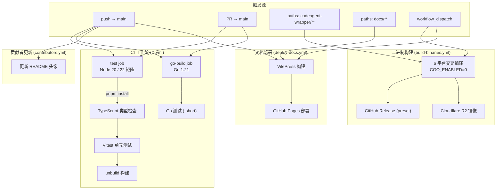
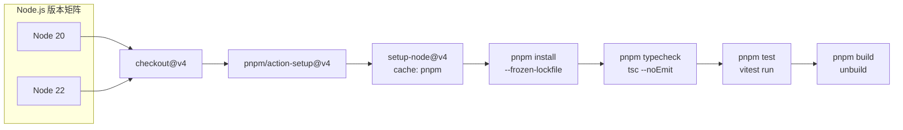
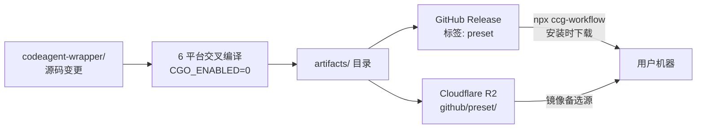

CCG 项目的持续集成与持续部署体系由四条独立的 GitHub Actions 工作流构成，分别覆盖**质量门控**、**Go 二进制跨平台构建与分发**、**VitePress 文档站点自动发布**以及**贡献者头像自动更新**。每条流水线通过精确的触发条件、权限声明和依赖缓存策略，在保障代码质量的同时将反馈延迟压缩到最低——一次向 `main` 分支的推送，会在数分钟内完成 TypeScript 类型检查、单元测试、Go 编译验证、跨平台二进制产物发布和文档站点更新。

Sources: [ci.yml](.github/workflows/ci.yml#L1-L54), [build-binaries.yml](.github/workflows/build-binaries.yml#L1-L90), [deploy-docs.yml](.github/workflows/deploy-docs.yml#L1-L56), [contributors.yml](.github/workflows/contributors.yml#L1-L25)

## 流水线全景架构

四条工作流以不同触发条件并行运行，覆盖从代码提交到产物分发的完整生命周期。下图展示了各流水线的触发源、执行阶段和最终产物之间的拓扑关系：



| 工作流 | 触发条件 | 核心产物 | 权限需求 |
|--------|---------|---------|---------|
| **CI** (`ci.yml`) | push/PR → main | 类型检查 + 测试通过状态 | 默认（读取） |
| **Build Binaries** (`build-binaries.yml`) | `codeagent-wrapper/**` 变更或手动触发 | 6 个平台二进制 → GitHub Release + R2 | `contents: write` |
| **Deploy Docs** (`deploy-docs.yml`) | `docs/**` 变更或 push → main | VitePress 静态站点 → GitHub Pages | `pages: write`, `id-token: write` |
| **Update Contributors** (`contributors.yml`) | push → main | README.md 贡献者头像更新 | `contents: write`, `pull-requests: write` |

Sources: [ci.yml](.github/workflows/ci.yml#L1-L54), [build-binaries.yml](.github/workflows/build-binaries.yml#L1-L90), [deploy-docs.yml](.github/workflows/deploy-docs.yml#L1-L56), [contributors.yml](.github/workflows/contributors.yml#L1-L25)

## CI 主工作流：双语言质量门控

**CI 工作流**是整个流水线体系的第一道防线，在每次 push 或 PR 合入 `main` 分支时触发。它包含两个并行运行的 Job——`test` 和 `go-build`——分别覆盖 TypeScript 前端和 Go 后端的代码质量验证。这种双轨并行设计意味着两种语言的验证不存在依赖等待，总耗时取决于较慢的那个 Job，而非两者之和。

Sources: [ci.yml](.github/workflows/ci.yml#L1-L54)

### Node.js 测试矩阵（test Job）

`test` Job 使用 `strategy.matrix` 在 Node.js 20 和 22 两个版本上并行执行，确保项目在两个活跃 LTS 版本上均能正常工作。其执行管线分为四个顺序阶段：**依赖安装** → **类型检查** → **单元测试** → **构建验证**，任何阶段失败都会阻断后续阶段。依赖安装使用 `pnpm install --frozen-lockfile` 严格模式，配合 `actions/setup-node@v4` 的 pnpm 缓存，避免重复下载。类型检查通过 `tsc --noEmit`（即 `pnpm typecheck`）执行纯粹的静态分析，不产出编译产物。测试使用 Vitest，仅匹配 `src/**/__tests__/**/*.test.ts` 路径下的测试文件。最终执行 `pnpm build`（即 unbuild）验证打包流程本身不会因依赖变更而中断。

Sources: [ci.yml](.github/workflows/ci.yml#L10-L36), [package.json](package.json#L72-L83), [vitest.config.ts](vitest.config.ts#L1-L7)



### Go 构建与测试（go-build Job）

`go-build` Job 独立运行于 `ubuntu-latest` 上，使用 Go 1.21 工具链（与 `go.mod` 声明的版本一致）。它执行两个步骤：首先 `go build -o /dev/null .` 验证编译通过但不保留产物，然后 `go test -short ./...` 运行快速测试套件（`-short` 标志跳过长时间运行的集成测试和压力测试）。整个 Job 的工作目录限定在 `codeagent-wrapper/`，与 TypeScript 主项目完全隔离。值得注意的是，`go.mod` 仅声明了 `codeagent-wrapper` 模块名和 Go 版本，没有任何第三方依赖——这体现了项目对零外部依赖的设计追求。

Sources: [ci.yml](.github/workflows/ci.yml#L38-L54), [codeagent-wrapper/go.mod](codeagent-wrapper/go.mod#L1-L4)

## Go 二进制跨平台构建与分发

**Build Binaries 工作流**是项目产物分发的核心引擎。当 `codeagent-wrapper/` 目录下的任何文件发生变更并合入主分支时，或者通过手动 `workflow_dispatch` 触发时，该工作流会执行 6 目标平台的交叉编译，将产物同时发布到 **GitHub Release**（预设标签 `preset`）和 **Cloudflare R2 对象存储**（镜像备份），为 `npx ccg-workflow` 安装流程提供就近下载源。

Sources: [build-binaries.yml](.github/workflows/build-binaries.yml#L1-L90)

### 交叉编译矩阵

工作流通过 Bash 数组定义 6 个编译目标，使用 Go 的 `CGO_ENABLED=0` 静态编译模式配合 `GOOS`/`GOARCH` 环境变量实现交叉编译。编译时附加 `-ldflags="-s -w"` 链接器标志，去除调试符号和 DWARF 信息，显著缩减二进制体积。所有产物输出到 `artifacts/` 目录，并在 GitHub Actions Step Summary 中生成可读的构建报告。

| 产物文件名 | 操作系统 | 架构 | 备注 |
|-----------|---------|------|------|
| `codeagent-wrapper-darwin-amd64` | macOS | Intel x64 | MacBook Pro / iMac |
| `codeagent-wrapper-darwin-arm64` | macOS | Apple Silicon | M1/M2/M3/M4 芯片 |
| `codeagent-wrapper-linux-amd64` | Linux | x64 | 服务器 / 桌面 |
| `codeagent-wrapper-linux-arm64` | Linux | ARM64 | 树莓派 / 云实例 |
| `codeagent-wrapper-windows-amd64.exe` | Windows | x64 | 含 `.exe` 后缀 |
| `codeagent-wrapper-windows-arm64.exe` | Windows | ARM64 | Surface Pro X 等 |

Sources: [build-binaries.yml](.github/workflows/build-binaries.yml#L28-L43)

### 双通道分发策略

二进制产物通过两个互补的通道分发，形成**主通道 + 镜像**的高可用架构：

**通道一：GitHub Release（`preset` 标签）**。工作流先通过 `gh release delete preset --yes --cleanup-tag` 清除已有的预设 Release，然后使用 `softprops/action-gh-release@v2` 创建同名 Release。Release body 包含完整的平台-架构对照表和使用说明。该标签标记为 `prerelease` 且不作为 `latest`，避免干扰正式版本号管理。

**通道二：Cloudflare R2 镜像**。通过 `wrangler r2 object put` 命令将每个二进制文件上传至 `github/preset/` 路径下，路径结构与 GitHub Release 一致。R2 镜像的作用是为网络环境受限或 GitHub 访问不稳定的用户提供备选下载源，同时作为云端的二次备份。



Sources: [build-binaries.yml](.github/workflows/build-binaries.yml#L48-L89)

## 文档站点自动部署

**Deploy Docs 工作流**在 `docs/` 目录下的文件发生变更并合入 `main`，或手动触发时，自动构建 VitePress 静态站点并部署到 **GitHub Pages**。该工作流采用双 Job 架构：`build` Job 负责站点构建，`deploy` Job 负责发布，两者通过 `needs` 依赖串联，确保仅在构建成功后执行部署。

Sources: [deploy-docs.yml](.github/workflows/deploy-docs.yml#L1-L56)

### 构建阶段

`build` Job 执行以下步骤：首先使用 `actions/checkout@v4` 并开启 `fetch-depth: 0`（完整历史克隆），这是因为 VitePress 的 `lastUpdated` 功能依赖 Git 提交时间戳。随后通过 `pnpm/action-setup@v4` 和 `actions/setup-node@v4`（固定 Node 20）配置环境，执行 `pnpm install`（非 frozen 模式，允许 lockfile 更新）和 `pnpm docs:build` 生成静态文件。构建产物位于 `docs/.vitepress/dist/`，通过 `actions/upload-pages-artifact@v3` 打包为 GitHub Pages 部署格式。

VitePress 配置中声明了 `base: '/ccg-workflow/'` 和 `cleanUrls: true`，意味着文档站点部署在仓库的子路径下，并使用干净的 URL 格式（无 `.html` 后缀）。站点支持中文（默认）和英文两种语言环境。

Sources: [deploy-docs.yml](.github/workflows/deploy-docs.yml#L20-L44), [docs/.vitepress/config.mts](docs/.vitepress/config.mts#L1-L126)

### 部署阶段与并发控制

`deploy` Job 在 `github-pages` 环境下运行，使用 `actions/deploy-pages@v4` 执行最终部署。工作流级别声明了 `concurrency` 控制策略：`group: pages` 确保同一时间只有一个部署流程，`cancel-in-progress: false` 保证正在进行的部署不会被新的推送取消，而是排队等待。这一策略避免了并发部署导致的 GitHub Pages 状态不一致问题。部署完成后，`environment.url` 会输出最终的站点 URL，可在 Actions 运行摘要中直接点击访问。

Sources: [deploy-docs.yml](.github/workflows/deploy-docs.yml#L14-L56)

## 贡献者头像自动更新

**Update Contributors 工作流**使用 `akhilmhdh/contributors-readme-action@v2.3.11` 在每次 push 到 `main` 时自动更新 README 文件中的贡献者头像网格。该 Action 同时处理中英文两个 README 文件（`README.md` 和 `README.zh-CN.md`），配置为每行 7 个头像、100px 图片尺寸、包含所有 collaborator。工作流声明了 `contents: write` 和 `pull-requests: write` 权限，使 Action 能够直接提交变更到仓库。

Sources: [contributors.yml](.github/workflows/contributors.yml#L1-L25)

## 工作流触发条件速查

理解每个工作流的触发条件对于日常开发至关重要——不当的文件变更可能意外触发重量级构建，而预期应触发的流程也可能因路径过滤未命中而静默跳过。下表汇总了所有触发条件的精确匹配规则：

| 工作流 | 触发方式 | 分支/路径过滤 | 手动触发 |
|--------|---------|-------------|---------|
| CI | `push`, `pull_request` | 仅 `main` 分支 | ❌ |
| Build Binaries | `push` | 仅 `codeagent-wrapper/**` 路径 | ✅ `workflow_dispatch` |
| Deploy Docs | `push` | 仅 `main` 分支 + `docs/**` 或工作流自身 | ✅ `workflow_dispatch` |
| Update Contributors | `push` | 仅 `main` 分支 | ❌ |

**关键观察**：Build Binaries 工作流没有分支过滤，仅依赖路径过滤——这意味着任何分支上对 `codeagent-wrapper/` 的推送都会触发构建。而 Deploy Docs 工作流将自身文件 `.github/workflows/deploy-docs.yml` 加入路径过滤，确保修改部署流程本身时也会触发文档重建。

Sources: [ci.yml](.github/workflows/ci.yml#L3-L7), [build-binaries.yml](.github/workflows/build-binaries.yml#L3-L8), [deploy-docs.yml](.github/workflows/deploy-docs.yml#L3-L9), [contributors.yml](.github/workflows/contributors.yml#L3-L5)

## 权限模型与安全边界

四条工作流采用了**最小权限原则**，每条工作流仅声明其运行所必需的权限。CI 工作流使用默认权限（仅读取），因为它不需要写入任何仓库资源。Build Binaries 需要 `contents: write` 以创建/更新 Release。Deploy Docs 需要 GitHub Pages 专用的 `pages: write` 和 OIDC 令牌权限 `id-token: write`，用于与 Pages 服务的认证握手。Contributors 工作流需要 `contents: write` 以提交 README 变更，以及 `pull-requests: write` 以处理可能的 PR 操作。

涉及敏感凭证的场景集中在 Build Binaries 工作流的 R2 同步步骤：`CLOUDFLARE_API_TOKEN` 和 `CLOUDFLARE_ACCOUNT_ID` 通过 GitHub Secrets 注入，仅在 wrangler 命令执行时作为环境变量暴露，不会泄露到日志或构建产物中。

Sources: [build-binaries.yml](.github/workflows/build-binaries.yml#L9-L11), [deploy-docs.yml](.github/workflows/deploy-docs.yml#L12-L15), [contributors.yml](.github/workflows/contributors.yml#L7-L9)

## 本地验证与 CI 对齐

在进行代码提交前，开发者可以在本地执行与 CI 完全一致的验证步骤，避免反复推送-等待的反馈循环。以下命令按 CI 的执行顺序排列，逐级验证：

```bash
# 1. 安装依赖（对应 CI: pnpm install --frozen-lockfile）
pnpm install

# 2. TypeScript 类型检查（对应 CI: pnpm typecheck）
pnpm typecheck

# 3. 单元测试（对应 CI: pnpm test → vitest run）
pnpm test

# 4. 项目构建（对应 CI: pnpm build → unbuild）
pnpm build

# 5. Go 编译检查（对应 CI: go build -o /dev/null .）
cd codeagent-wrapper && go build -o /dev/null .

# 6. Go 测试（对应 CI: go test -short ./...）
cd codeagent-wrapper && go test -short ./...
```

对于文档修改，可以在本地启动 VitePress 开发服务器预览效果，再推送触发自动部署：

```bash
# 文档开发预览
pnpm docs:dev

# 文档构建验证（对应 CI: pnpm docs:build）
pnpm docs:build
```

Sources: [package.json](package.json#L72-L83), [ci.yml](.github/workflows/ci.yml#L26-L53)

## 扩展阅读

- 要了解构建产物（`codeagent-wrapper` 二进制）在安装流程中的角色，参阅 [安装器流水线：从模板变量注入到文件部署的完整链路](7-an-zhuang-qi-liu-shui-xian-cong-mo-ban-bian-liang-zhu-ru-dao-wen-jian-bu-shu-de-wan-zheng-lian-lu)
- 要深入理解 TypeScript 构建工具链的配置细节，参阅 [开发环境搭建与构建流程](27-kai-fa-huan-jing-da-jian-yu-gou-jian-liu-cheng)
- 要了解 Go 二进制的测试策略与覆盖率，参阅 [测试体系：Vitest 单元测试与 Go 测试](28-ce-shi-ti-xi-vitest-dan-yuan-ce-shi-yu-go-ce-shi)
- 要了解提交代码时如何配合 CI 的规范要求，参阅 [贡献指南：提交规范与 PR 流程](30-gong-xian-zhi-nan-ti-jiao-gui-fan-yu-pr-liu-cheng)
- 要了解文档站点的 VitePress 配置与维护，参阅 [文档站点：VitePress 文档开发与维护](31-wen-dang-zhan-dian-vitepress-wen-dang-kai-fa-yu-wei-hu)