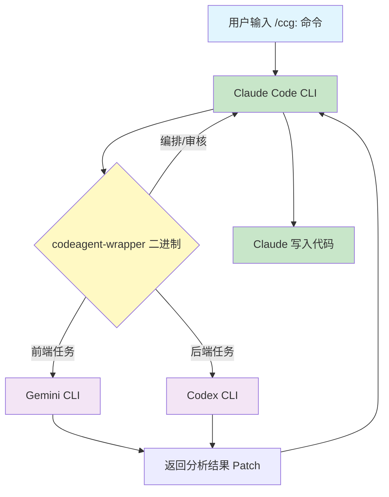

CCG 是一个多模型协作开发系统，在正式使用之前需要准备若干运行环境。本文档逐一拆解每个依赖的作用、安装方法和验证步骤，帮助你从零搭建完整的开发环境。依赖分为**必需**和**可选**两类——缺少必需依赖系统无法运行，缺少可选依赖则对应功能不可用。

Sources: [README.md](README.md#L60-L71), [docs/guide/getting-started.md](docs/guide/getting-started.md#L27-L33)

## 依赖总览

| 依赖 | 是否必需 | 角色 | 安装验证命令 |
|------|----------|------|-------------|
| **Node.js 20+** | ✅ 必需 | CCG 运行时宿主环境 | `node --version` |
| **Claude Code CLI** | ✅ 必需 | 编排器，负责整体调度和代码写入 | `claude --version` |
| **jq** | ⚠️ 历史必需 | 用于旧版 Hook 自动授权，新版已改用 permissions 机制 | `jq --version` |
| **Codex CLI** | 可选 | 后端任务路由，代码分析与生成 | `codex --version` |
| **Gemini CLI** | 可选 | 前端任务路由，代码分析与生成 | `gemini --version` |
| **codeagent-wrapper** | 自动下载 | Go 二进制，统一封装三端 CLI 调用 | `~/.claude/bin/codeagent-wrapper --version` |

下面的 Mermaid 图展示了依赖之间的调用链关系——理解这个结构有助于你在遇到问题时快速定位是哪个环节出了问题。



Sources: [README.md](README.md#L43-L56), [codeagent-wrapper/config.go](codeagent-wrapper/config.go#L66-L70)

## Node.js 20+

### 为什么是 20 而不是 18

CCG 的依赖 `ora@9.x` 内部使用了 Node.js 20 引入的 API（如 `ReadableStream` 等 Web Stream API）。在 Node.js 18 上运行会直接抛出 `SyntaxError`，这是**硬性要求**，没有绕过方案。`package.json` 中的 `ora` 依赖版本为 `^9.0.0`。

Sources: [package.json](package.json#L93), [README.md](README.md#L66)

### 安装方法

::: code-group

```bash [macOS — nvm（推荐）]
# 安装 nvm
curl -o- https://raw.githubusercontent.com/nvm-sh/nvm/v0.40.3/install.sh | bash
source ~/.zshrc

# 安装并使用 Node.js 20
nvm install 20
nvm use 20
```

```bash [macOS — Homebrew]
brew install node@20
```

```bash [Linux — nvm]
curl -o- https://raw.githubusercontent.com/nvm-sh/nvm/v0.40.3/install.sh | bash
source ~/.bashrc
nvm install 20
nvm use 20
```

```bash [Windows — fnm]
winget install Schniz.fnm
fnm install 20
fnm use 20
```

:::

### 验证安装

```bash
node --version
# 应输出 v20.x.x 或更高版本（如 v22.x.x）
```

CCG 本身通过 `npx ccg-workflow` 运行，不需要全局安装。`npx` 随 Node.js 自带，确保 Node.js 20+ 已安装即可。入口文件 `bin/ccg.mjs` 是一个极简的引导脚本，仅包含 `import '../dist/cli.mjs'`——真正的逻辑由构建产物提供。

Sources: [bin/ccg.mjs](bin/ccg.mjs#L1-L3), [package.json](package.json#L22-L23)

## Claude Code CLI

Claude Code 是整个 CCG 系统的**核心编排器**——没有它，CCG 完全无法工作。它负责接收用户的斜杠命令、调用 `codeagent-wrapper` 调度外部模型、审核模型返回的 Patch，并最终执行代码写入。

### 两种安装方式

**方式一：通过 CCG 菜单安装（推荐）**

CCG 内置了 Claude Code 的安装引导，支持多种安装方法：

```bash
npx ccg-workflow menu
# 选择「安装 Claude Code」（菜单选项 C）
```

菜单提供以下安装途径：

| 方法 | 适用平台 | 命令 |
|------|----------|------|
| npm | 全平台 | `npm install -g @anthropic-ai/claude-code` |
| Homebrew | macOS / Linux | `brew install --cask claude-code` |
| curl 官方脚本 | macOS / Linux | `curl -fsSL https://claude.ai/install.sh \| bash` |
| PowerShell | Windows | `irm https://claude.ai/install.ps1 \| iex` |
| CMD | Windows | `curl -fsSL https://claude.ai/install.cmd -o install.cmd && install.cmd` |

**方式二：独立安装**

```bash
# macOS / Linux
npm install -g @anthropic-ai/claude-code

# Windows
npm install -g @anthropic-ai/claude-code
```

### 验证安装

```bash
claude --version
# 应输出 Claude Code 版本号
```

Sources: [src/commands/menu.ts](src/commands/menu.ts#L644-L738), [README.md](README.md#L96-L102)

## jq

### 当前状态：已不再是硬性依赖

在 CCG 的早期版本中，`jq` 被用于自动授权 Hook——当 Claude Code 执行 `codeagent-wrapper` 命令时，Hook 脚本通过 `jq` 解析 JSON 并自动放行。但从 v1.7.89 起，CCG 将授权机制迁移到 `settings.json` 中的 `permissions.allow` 模式，不再依赖 `jq` 进行 JSON 解析。

源码中的注释明确写道：

> `jq check removed — permissions.allow approach does not require jq`

Sources: [src/commands/init.ts](src/commands/init.ts#L842)

### 什么时候还需要 jq

如果你正在使用**旧版 CCG（≤v1.7.88）**，或者你的 `settings.json` 中仍然残留 Hook 配置，`jq` 仍然是必要的。i18n 文件中保留了 jq 相关的安装提示信息，说明项目对旧版兼容场景仍有覆盖。

Sources: [src/i18n/index.ts](src/i18n/index.ts#L218-L223)

### 安装方法

::: code-group

```bash [macOS]
brew install jq
```

```bash [Debian / Ubuntu]
sudo apt install jq
```

```bash [RHEL / CentOS]
sudo yum install jq
```

```bash [Windows]
choco install jq
# 或者
scoop install jq
```

:::

### 验证安装

```bash
jq --version
# 应输出 jq-1.x
```

## Codex CLI（可选）

### 作用

Codex CLI 是 OpenAI 提供的命令行工具，在 CCG 中担任**后端任务处理器**。当用户执行 `/ccg:backend`、`/ccg:codex-exec` 等后端相关命令时，`codeagent-wrapper` 会通过 `codex` 命令调用 Codex 进行代码分析和生成。

在 `codeagent-wrapper` 的后端注册表中，Codex 后端的命令名为 `codex`：

```
CodexBackend → Command() → "codex"
```

Sources: [codeagent-wrapper/backend.go](codeagent-wrapper/backend.go#L19-L27)

### 安装方法

```bash
npm install -g @openai/codex
```

### 验证安装

```bash
codex --version
```

### 影响范围

未安装 Codex CLI 时，以下功能不可用：
- `/ccg:backend` — 后端专项任务
- `/ccg:codex-exec` — Codex 全权执行模式
- 后端路由为 `codex` 的所有命令（默认配置下即后端模型）

如果你只使用 Gemini 作为后端（在初始化时选择 `Gemini` 作为后端模型），则不需要安装 Codex CLI。

## Gemini CLI（可选）

### 作用

Gemini CLI 是 Google 提供的命令行工具，在 CCG 中担任**前端任务处理器**。默认配置下，前端任务路由至 Gemini。`codeagent-wrapper` 通过 `gemini` 命令调用 Gemini 进行前端相关的代码分析。

在 `codeagent-wrapper` 的后端注册表中，Gemini 后端的命令名为 `gemini`：

```
GeminiBackend → Command() → "gemini"
```

Sources: [codeagent-wrapper/backend.go](codeagent-wrapper/backend.go#L110-L118)

### 安装方法

```bash
npm install -g @anthropic-ai/gemini
```

或参考 Google 官方文档进行安装。

### 验证安装

```bash
gemini --version
```

### 影响范围

未安装 Gemini CLI 时，以下功能不可用：
- `/ccg:frontend` — 前端专项任务
- 前端路由为 `gemini` 的所有命令（默认配置下即前端模型）

### Gemini 模型版本

CCG 在初始化时支持选择 Gemini 的具体模型型号，默认为 `gemini-3.1-pro-preview`，备选 `gemini-2.5-flash`，也支持自定义模型名。模型选择保存在配置文件 `~/.claude/.ccg/config.toml` 的 `routing.geminiModel` 字段中，并通过模板变量注入传递给 `codeagent-wrapper`。

Sources: [src/commands/init.ts](src/commands/init.ts#L325-L350), [src/utils/installer-template.ts](src/utils/installer-template.ts#L100-L106)

## codeagent-wrapper 二进制（自动下载）

### 作用

`codeagent-wrapper` 是一个用 Go 编写的二进制程序，是 CCG 的**核心调度中间件**。它负责：
- 统一封装 Codex / Gemini / Claude 三个后端的调用接口
- 管理进程生命周期、会话恢复、超时控制
- 流式解析三端返回的 JSON 事件流，统一输出格式
- 支持 `--parallel` 并行执行模式

Sources: [codeagent-wrapper/config.go](codeagent-wrapper/config.go#L13-L25), [src/utils/installer.ts](src/utils/installer.ts#L57-L61)

### 安装方式：全自动

**你不需要手动安装这个二进制**。在运行 `npx ccg-workflow` 初始化时，安装器会自动从 GitHub Releases 下载对应平台的二进制文件到 `~/.claude/bin/` 目录。

下载策略采用双源容错机制：

| 优先级 | 来源 | 超时 | 特点 |
|--------|------|------|------|
| 1 | Cloudflare CDN | 30 秒 | 国内友好，代理自动读取 |
| 2 | GitHub Release | 120 秒 | 全球通用，备用回退 |

安装器会先尝试 curl 下载（自动读取 `HTTPS_PROXY` / `ALL_PROXY` 环境变量支持代理），curl 失败则回退到 Node.js 的 `fetch` API。

Sources: [src/utils/installer.ts](src/utils/installer.ts#L92-L171)

### 支持的平台

| 平台 | 架构 | 文件名 |
|------|------|--------|
| macOS | arm64 (Apple Silicon) | `codeagent-wrapper-darwin-arm64` |
| macOS | amd64 (Intel) | `codeagent-wrapper-darwin-amd64` |
| Linux | arm64 | `codeagent-wrapper-linux-arm64` |
| Linux | amd64 | `codeagent-wrapper-linux-amd64` |
| Windows | arm64 | `codeagent-wrapper-windows-arm64.exe` |
| Windows | amd64 | `codeagent-wrapper-windows-amd64.exe` |

Sources: [src/utils/installer.ts](src/utils/installer.ts#L497-L504)

### 手动下载（网络问题时）

如果自动下载失败（常见于网络受限环境），安装器会显示醒目的红色警告框，并提供手动修复步骤：

1. 访问 `https://github.com/fengshao1227/ccg-workflow/releases/tag/preset`
2. 下载对应平台的二进制文件
3. 放置到 `~/.claude/bin/` 目录
4. 添加执行权限（非 Windows）：`chmod +x ~/.claude/bin/codeagent-wrapper`

或者重新运行安装：`npx ccg-workflow@latest`

Sources: [src/utils/installer.ts](src/utils/installer.ts#L551-L591)

## PATH 环境变量配置

`codeagent-wrapper` 安装到 `~/.claude/bin/` 后，CCG 会自动将其添加到 PATH：

| 平台 | 配置方式 | 配置文件 |
|------|----------|----------|
| macOS / Linux (zsh) | 自动追加 export 语句 | `~/.zshrc` |
| macOS / Linux (bash) | 自动追加 export 语句 | `~/.bashrc` |
| Windows | 自动设置 User 环境变量 | 系统注册表 |

CCG 在安装时会检测当前 shell 类型，智能选择配置文件，并避免重复写入。

Sources: [src/commands/init.ts](src/commands/init.ts#L914-L972)

## 一键环境验证

安装完所有依赖后，可以执行以下命令快速验证环境是否就绪：

```bash
# 检查 Node.js
node --version        # 期望: v20+

# 检查 Claude Code
claude --version      # 期望: 有版本输出

# 检查 codeagent-wrapper
~/.claude/bin/codeagent-wrapper --version  # 期望: 有版本输出

# 检查可选依赖
codex --version       # 期望: 有版本输出（未安装不影响核心功能）
gemini --version      # 期望: 有版本输出（未安装不影响核心功能）
```

全部验证通过后，运行 CCG 初始化：

```bash
npx ccg-workflow
```

首次运行会引导你完成 4 步配置：API Provider → 模型路由 → MCP 工具 → 性能模式。

Sources: [docs/guide/getting-started.md](docs/guide/getting-started.md#L37-L42)

## 常见问题排查

| 问题 | 原因 | 解决方案 |
|------|------|----------|
| `SyntaxError: Unexpected token` | Node.js 版本低于 20 | 升级 Node.js 到 20+ |
| `codeagent-wrapper: command not found` | PATH 未配置或二进制未下载 | 检查 `~/.claude/bin/` 是否存在文件，重跑 `npx ccg-workflow` |
| `/ccg:backend` 无响应 | Codex CLI 未安装 | 安装 Codex CLI 或将后端模型切换为 Gemini |
| `/ccg:frontend` 无响应 | Gemini CLI 未安装 | 安装 Gemini CLI 或将前端模型切换为 Codex |
| 二进制下载超时 | 网络受限 | 设置代理 (`HTTPS_PROXY`) 或手动下载 |

## 下一步

环境准备就绪后，建议按以下顺序继续阅读：

- [整体架构设计：Claude 编排 + Codex 后端 + Gemini 前端](4-zheng-ti-jia-gou-she-ji-claude-bian-pai-codex-hou-duan-gemini-qian-duan) — 理解三模型如何协作
- [模型路由机制：前端/后端模型配置与智能调度](5-mo-xing-lu-you-ji-zhi-qian-duan-hou-duan-mo-xing-pei-zhi-yu-zhi-neng-diao-du) — 深入了解任务如何自动路由到不同模型
- [codeagent-wrapper 二进制：Go 进程管理与多后端调用](6-codeagent-wrapper-er-jin-zhi-go-jin-cheng-guan-li-yu-duo-hou-duan-diao-yong) — 深入理解核心中间件的实现细节