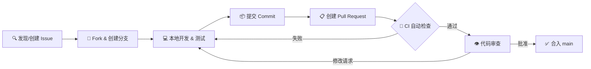
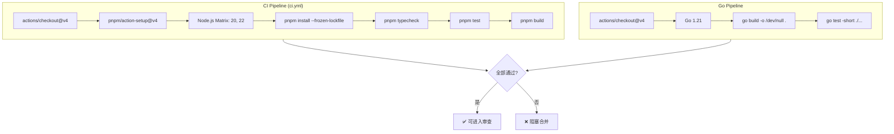

CCG 项目遵循严格的提交规范与 Pull Request 流程，确保多模型协作系统的每一次变更都可追溯、可审查、可回滚。本文将从 Issue 提交、分支命名、Commit 消息格式、PR 模板填写、CI 自动验证到代码审查全链路展开，帮助你以最低摩擦完成贡献。如果你尚未搭建本地开发环境，请先阅读 [开发环境搭建与构建流程](27-kai-fa-huan-jing-da-jian-yu-gou-jian-liu-cheng)。

Sources: [CONTRIBUTING.md](CONTRIBUTING.md#L1-L135), [.github/pull_request_template.md](.github/pull_request_template.md#L1-L44)

## 贡献全景流程

从发现 Issue 到代码合入 `main` 分支，CCG 的贡献链路分为六个阶段。每个阶段都有明确的输入输出和自动化保障，确保代码质量不因贡献者经验差异而波动：



**核心原则**：每个 PR 只解决一个关注点（Single Concern），混合了不相关变更的 PR 会被要求拆分。这一原则贯穿从 Issue 创建到最终合入的全过程。

Sources: [CONTRIBUTING.md](CONTRIBUTING.md#L57-L73), [.github/pull_request_template.md](.github/pull_request_template.md#L36-L39)

## Issue 提交规范

CCG 提供三种结构化 Issue 模板，分别面向不同场景。选择正确的模板不仅帮助维护者快速理解问题，也直接影响 Issue 的标签分配和处理优先级。

### 三种 Issue 模板

| 模板 | 标题前缀 | 自动标签 | 适用场景 |
|------|---------|---------|---------|
| **Bug Report** | `[bug]` | `bug` | 已有功能出现异常行为 |
| **Feature Request** | `[feat]` | `enhancement` | 新功能提议或改进建议 |
| **Good First Issue** | `[good first issue]` | `good first issue` | 面向新贡献者的入门任务 |

### Bug Report 要点

提交 Bug 时，**环境信息**是最关键的诊断线索。模板要求填写 CCG 版本、Node.js 版本、操作系统和 Claude Code 版本，缺失这些信息的 Issue 可能被标记为 `needs info` 而延迟处理。复现步骤必须具体到可执行的命令序列，而非笼统的描述。

Sources: [.github/ISSUE_TEMPLATE/bug_report.md](.github/ISSUE_TEMPLATE/bug_report.md#L1-L39)

### Feature Request 要素

一个好的 Feature Request 需要回答三个问题：它解决什么问题（Problem）、你建议怎么做（Proposed Solution）、你还考虑过哪些替代方案（Alternatives Considered）。**问题陈述**比解决方案更重要——如果维护者理解了痛点，即使你的方案不被采纳，也可能以更好的方式实现。

Sources: [.github/ISSUE_TEMPLATE/feature_request.md](.github/ISSUE_TEMPLATE/feature_request.md#L1-L24)

### Good First Issue 的设计

Good First Issue 是 CCG 为新贡献者精心设计的入门任务，每个 Issue 包含六个必要组成部分：

| 组成部分 | 作用 |
|---------|------|
| **问题描述** | 清晰说明需要改什么、为什么改 |
| **验收标准** | 具体的、可测试的 checklist |
| **相关文件** | 精确到文件路径和行号 |
| **类似 PR** | 参考已有的类似变更 |
| **上手步骤** | 从 fork 到验证的完整步骤 |
| **范围界定** | 明确什么在 scope 内、什么不在 |

典型的 Good First Issue 涉及文档修复、i18n 翻译补充、工具函数测试编写或模板改进，预期完成时间约 2 小时。

Sources: [.github/ISSUE_TEMPLATE/good_first_issue.md](.github/ISSUE_TEMPLATE/good_first_issue.md#L1-L48), [CONTRIBUTING.md](CONTRIBUTING.md#L102-L116)

## 分支命名规范

CCG 采用 `<type>/<scope>` 的分支命名格式，与 Commit 前缀保持一致。从项目的 Git 历史中可以观察到以下实际使用的分支命名模式：

| 分支名模式 | 示例 | 含义 |
|-----------|------|------|
| `fix/<scope>` | `fix/gemini-cwd-hang` | 修复 Gemini CLI 在 HOME 目录挂起 |
| `fix/<scope>` | `fix/version` | 修复版本检测问题 |
| `feat/<scope>` | `feat/workdir-support` | 新增工作目录支持 |

**命名规则**：`type` 使用小写，与 Commit 前缀一致（`feat`/`fix`/`docs`/`refactor`/`test`/`chore`）；`scope` 使用短横线连接的英文短语，简明描述变更的模块或问题。分支应从 `main` 创建，针对的是你 Fork 中的最新 `main`。

Sources: [CONTRIBUTING.md](CONTRIBUTING.md#L66-L67)

## Commit 消息规范

CCG 采用 [Conventional Commits](https://www.conventionalcommits.org/) 规范，格式为 `<type>: <description>`。从项目的 Git 历史中可以观察到这一规范被严格遵循——近 30 条提交中，`fix:` 占 16 条、`docs:` 占 6 条、`feat:` 占 4 条、`chore:` 占 3 条，全部符合规范。

### 提交类型详解

| 前缀 | 用途 | 示例 |
|------|------|------|
| `feat:` | 新功能或用户可见的增强 | `feat: configurable model routing for frontend/backend` |
| `fix:` | Bug 修复 | `fix: Windows Gemini multi-line arg truncation via stdin pipe` |
| `docs:` | 文档变更（README、CHANGELOG、模板说明） | `docs: add GitHub stars and NPM downloads badges to README` |
| `test:` | 新增或更新测试 | `test: add coverage for config utility functions` |
| `refactor:` | 代码重构（行为不变） | `refactor: installer monolith to 5 focused modules` |
| `chore:` | 构建、CI、依赖更新、版本号变更 | `chore: bump version to 2.1.12` |

**描述行要求**：使用英文小写开头，不加句号，简洁说明做了什么而非为什么做（为什么应放在 PR 描述中）。关联 Issue 时在描述末尾加 `(#123)` 或在 PR 中关联。如果变更涉及多个模块，描述应聚焦最核心的那个。

Sources: [CONTRIBUTING.md](CONTRIBUTING.md#L75-L87), [CHANGELOG.md](CHANGELOG.md#L1-L15)

### 实际 Commit 风格参考

以下是项目中几个典型的良好 Commit 消息，可作为格式参考：

```
feat: integrate 302.AI as sponsor provider (#126)
fix: MCP provider preserved during update + optional Impeccable commands (#124, #125)
fix: add YAML frontmatter to Skill Registry generated commands (#122)
docs: fix outdated numbers in README (commands 27→29+, tests 134→139)
chore: bump version to 2.1.12
```

注意这些消息的共同特征：动宾结构开头、括号内标注关联 Issue、不使用主观形容词（如"improved"、"better"）。

Sources: Git log (`git log --oneline -10`)

## Pull Request 模板详解

CCG 的 PR 模板包含五个结构化区域，每个区域都有明确的填写要求。完整的 PR 模板如下，各区域标注了填写指引：

### Summary 区域

用 1-3 个 bullet points 概括 PR 做了什么。避免写成"How"（怎么做的），而是写"What"（做了什么）和"Why"（为什么做）。**好的示例**：`Add 302.AI as sponsor API provider option in init flow`。**差的示例**：`Changed installer.ts and menu.ts`。

### Type 区域

勾选一个最匹配的类型。这个类型应与你的 Commit 前缀一致——如果 PR 包含多个 Commit 且类型不同，勾选最主要那个。

### Changes 区域

以表格形式列出修改的关键文件和变更原因。这帮助审查者快速定位关注点，无需通读整个 diff：

| 文件 | 变更说明 |
|------|---------|
| `src/utils/installer.ts` | 新增 302.API 提供方选项 |
| `src/commands/menu.ts` | 菜单新增赞助商配置入口 |
| `README.md` | 添加 302.AI Banner |

### Testing 区域

PR 模板要求三个验证项：

- **`pnpm test` 通过**：当前项目维护 139+ 个 Vitest 测试用例
- **`pnpm build` 成功**：TypeScript 编译 + unbuild 打包无错误
- **手动测试描述**：简要说明你在本地验证了什么场景

如果你的变更涉及 Go 代码（`codeagent-wrapper/` 目录），还需确认 `go test -short ./...` 通过。

### Checklist 区域

四项自检清单确保代码质量底线：遵循现有代码模式、无硬编码密钥、面向用户的变更已更新 README/CHANGELOG、PR 保持单一关注点。

Sources: [.github/pull_request_template.md](.github/pull_request_template.md#L1-L44)

## CI 自动验证链

每个提交到 `main` 的 Push 和所有针对 `main` 的 PR 都会触发 **CI 流水线**。这条流水线是代码质量的第一道自动防线，通过后方可进入人工审查阶段：



### TypeScript/Node.js 流水线

CI 在 **Node.js 20 和 22** 两个版本上并行运行，确保兼容性覆盖。流水线依次执行四个步骤：**依赖安装**（`--frozen-lockfile` 锁定精确版本）、**类型检查**（`tsc --noEmit`，TypeScript strict 模式）、**单元测试**（Vitest 运行 `src/**/__tests__/**/*.test.ts` 下所有测试）、**构建验证**（unbuild 打包确认无编译错误）。任何一步失败都会阻塞 PR 合并。

### Go 流水线

如果你的 PR 涉及 `codeagent-wrapper/` 目录下的 Go 代码变更，还会触发额外的 Go 流水线：在 Go 1.21 环境下执行 `go build` 和 `go test -short ./...`。此外，`codeagent-wrapper/` 的变更会单独触发 **build-binaries.yml** 工作流，自动交叉编译 6 个平台的二进制文件并发布到 GitHub Release 和 Cloudflare R2 镜像。

Sources: [.github/workflows/ci.yml](.github/workflows/ci.yml#L1-L54), [.github/workflows/build-binaries.yml](.github/workflows/build-binaries.yml#L1-L90)

### 本地预检命令

在推送 PR 之前，建议在本地运行完整的预检命令序列。**全部通过后再创建 PR**，避免 CI 红灯浪费等待时间：

| 检查项 | 命令 | 作用 |
|--------|------|------|
| TypeScript 类型检查 | `pnpm typecheck` | strict 模式下编译检查，零错误才能通过 |
| 单元测试 | `pnpm test` | Vitest 运行 `src/` 下所有 `*.test.ts` 文件 |
| 构建 | `pnpm build` | unbuild 产出 `dist/` 目录 |
| Go 编译（如涉及） | `cd codeagent-wrapper && go build` | 编译 Go 二进制 |
| Go 测试（如涉及） | `cd codeagent-wrapper && go test -short ./...` | 运行 Go 测试 |

Sources: [package.json](package.json#L72-L84), [tsconfig.json](tsconfig.json#L1-L21), [vitest.config.ts](vitest.config.ts#L1-L7)

## 代码审查流程与时间线

CCG 的代码审查流程有明确的时间承诺，确保贡献者不会陷入无休止的等待：

| 阶段 | 时间承诺 | 超时处理 |
|------|---------|---------|
| **Issue 认领** | 1 天内分配 | — |
| **PR 首次审查** | 3 天内 | — |
| **审查反馈响应** | 贡献者 5 天内回复 | Issue 被释放（可重新认领） |

### 审查关注点

审查者主要检查以下维度，理解这些关注点可以帮助你一次通过审查：

- **模式一致性**：新代码是否遵循 `src/` 中已有的代码风格和模式
- **测试覆盖**：新功能是否包含对应的测试用例，测试是否放在 `src/utils/__tests__/` 下
- **模板变量**：涉及 `templates/` 的变更是否使用 `{{VARIABLE}}` 而非硬编码值
- **跨平台兼容**：路径处理是否使用 `pathe` 而非原生 `path`，平台特定代码是否有 `platform.ts` 中的条件分支
- **安全性**：无硬编码 API Key、Secret 或其他敏感信息
- **用户可见变更**：是否更新了 README 和 CHANGELOG

Sources: [CONTRIBUTING.md](CONTRIBUTING.md#L88-L131)

## 代码质量标准

CCG 对代码质量有可量化的硬性指标，这些指标是 Pull Request 被批准的必要条件：

| 指标 | 阈值 | 说明 |
|------|------|------|
| 函数复杂度 | < 10 | 圈复杂度，避免深层嵌套 |
| 单函数行数 | < 50 行 | 保持函数聚焦单一职责 |
| 单文件行数 | < 500 行 | 文件级别模块化 |
| TypeScript 严格模式 | 启用 | `tsconfig.json` 中 `strict: true` |
| 模板变量 | `{{VARIABLE}}` | 所有可配置值使用模板语法 |

### TypeScript 代码规范

项目使用 TypeScript strict 模式编译，所有代码必须通过 `tsc --noEmit` 检查。这意味着：不允许隐式 `any`、不允许未检查的 null/undefined、必须明确函数返回类型推断。测试文件放置在 `src/utils/__tests__/` 目录下，路径镜像 `src/` 结构，使用 Vitest 框架。

### 模板文件规范

`templates/` 目录下的 Markdown 文件使用 `{{VARIABLE}}` 占位符语法，在安装时由 installer 替换为实际配置值。**关键模板变量**包括 `{{BACKEND_PRIMARY}}`、`{{FRONTEND_PRIMARY}}`、`{{GEMINI_MODEL_FLAG}}` 和 `{{WORKDIR}}`，绝不允许硬编码这些值——v2.1.14 的核心修复正是清除 21 个模板中的硬编码模型名称。

Sources: [CONTRIBUTING.md](CONTRIBUTING.md#L88-L94), [tsconfig.json](tsconfig.json#L1-L21), [CHANGELOG.md](CHANGELOG.md#L10-L15)

## CHANGELOG 与版本管理

CCG 遵循 [Keep a Changelog](https://keepachangelog.com/) 格式和 [语义化版本](https://semver.org/) 规范。每个版本的变更按类型分组，使用 emoji 前缀增强可读性：

| Emoji | 类型 | 含义 |
|-------|------|------|
| ✨ | 新功能 | 用户可见的功能增强 |
| 🐛 | 修复 | Bug 修复 |
| 🔄 | 变更 | 行为变更或重构 |
| 🏗 | 架构 | 内部架构调整 |
| 📝 | 文档 | 文档更新 |
| 🗑️ | 移除 | 废弃特性删除 |

版本号在 `package.json` 中维护，格式为 `MAJOR.MINOR.PATCH`。**面向用户的变更必须同步更新 CHANGELOG**——这是 PR Checklist 中的硬性要求。发版时版本号变更使用 `chore: bump version to x.y.z` 的 Commit。

Sources: [CHANGELOG.md](CHANGELOG.md#L1-L8), [CONTRIBUTING.md](CONTRIBUTING.md#L98-L100)

## SOP 标准操作流程

对于核心维护者和深度贡献者，CCG 定义了一套 6 步标准操作流程（SOP），将开发工作规范化为可重复的流水线：

| 步骤 | 操作 | 使用技能 |
|------|------|---------|
| 1 | 创建 worktree | `worktree` |
| 2 | 自检（规范合规） | `quality-gate` |
| 3 | 同行审查 | `request-review` / `receive-review` |
| 4 | 合并关卡 | `merge-gate` |
| 5 | PR + 云端审查 | merge-gate 自动处理 |
| 6 | 合并 + 清理 | SOP 手动步骤 |

此外，项目使用 `docs/features/TEMPLATE.md` 管理 Feature 提案，每个提案包含 Why（动机）、What（方案）、验收标准、依赖关系、风险评估和未决问题六个部分。Feature 状态追踪在 `BACKLOG.md` 中维护。

Sources: [docs/SOP.md](docs/SOP.md#L1-L25), [docs/features/TEMPLATE.md](docs/features/TEMPLATE.md#L1-L21), [BACKLOG.md](BACKLOG.md#L1-L15)

## 完整贡献工作流示例

以下是一个端到端的贡献示例，展示从零开始提交一个 Bug 修复 PR 的完整过程：

```bash
# 1. Fork 并克隆仓库
git clone https://github.com/YOUR_USERNAME/ccg-workflow.git
cd ccg-workflow

# 2. 安装依赖
pnpm install

# 3. 创建修复分支（类型/范围 命名）
git checkout -b fix/gemini-session-resume

# 4. 开发 + 本地验证
pnpm typecheck    # TypeScript 类型检查
pnpm test         # 运行 139+ 测试
pnpm build        # 构建验证

# 5. 提交（Conventional Commits 格式）
git add src/utils/mcp.ts
git commit -m "fix: preserve MCP provider during update flow (#124)"

# 6. 推送并创建 PR
git push origin fix/gemini-session-resume
# → 在 GitHub 上创建 PR，填写模板五个区域

# 7. CI 自动运行：typecheck + test + build（Node 20 & 22）
# 8. 等待审查（首次审查 3 天内）
# 9. 根据反馈修改后 force push 同一分支
# 10. 审查通过后由维护者合入 main
```

Sources: [CONTRIBUTING.md](CONTRIBUTING.md#L65-L73), [package.json](package.json#L72-L84)

## 延伸阅读

- [开发环境搭建与构建流程](27-kai-fa-huan-jing-da-jian-yu-gou-jian-liu-cheng) — 本地开发环境配置与构建命令详解
- [测试体系：Vitest 单元测试与 Go 测试](28-ce-shi-ti-xi-vitest-dan-yuan-ce-shi-yu-go-ce-shi) — 测试框架使用与覆盖率要求
- [CI/CD 流水线：GitHub Actions 构建与部署](29-ci-cd-liu-shui-xian-github-actions-gou-jian-yu-bu-shu) — 四条 GitHub Actions 工作流的设计与配置
- [文档站点：VitePress 文档开发与维护](31-wen-dang-zhan-dian-vitepress-wen-dang-kai-fa-yu-wei-hu) — 文档贡献与 `docs/` 目录维护