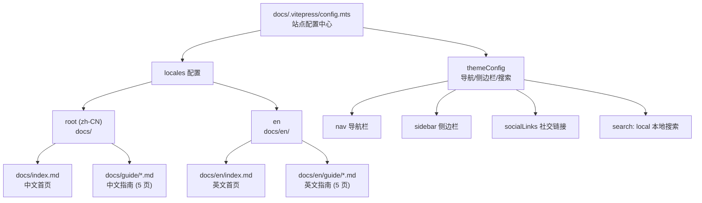
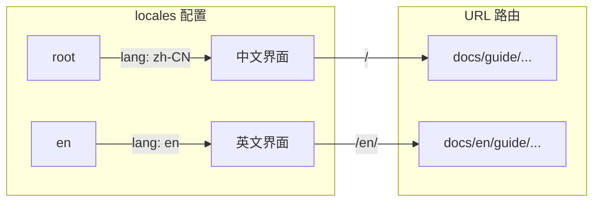
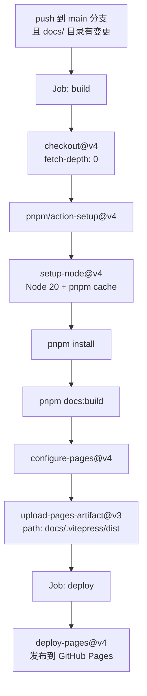

CCG 项目使用 **VitePress 1.x** 构建文档站点，采用双语言（中/英）分离式目录结构，通过 GitHub Pages 自动部署。本文档将从架构设计、本地开发、内容组织、国际化、构建与部署五个维度，完整拆解文档站点的开发与维护流程。

## 架构总览

文档站点以 `docs/` 为根目录，VitePress 配置集中在 `docs/.vitepress/config.mts`，构建输出到 `docs/.vitepress/dist/`。整体架构遵循 VitePress 的标准约定，但针对双语言场景做了一组清晰的目录映射：



站点核心配置参数如下表所示：

| 配置项 | 值 | 说明 |
|--------|------|------|
| `title` | `CCG` | 站点标题，显示在浏览器标签页 |
| `base` | `/ccg-workflow/` | GitHub Pages 子路径部署必须配置 |
| `cleanUrls` | `true` | URL 去除 `.html` 后缀 |
| `lastUpdated` | `true` | 基于 Git 提交记录显示页面最后更新时间 |
| `search` | `local` | 使用 VitePress 内置本地搜索，无外部依赖 |

Sources: [config.mts](docs/.vitepress/config.mts#L1-L127)

## 目录结构与文件职责

```
docs/
├── .vitepress/
│   ├── config.mts          # VitePress 唯一配置入口
│   ├── dist/               # 构建输出（gitignore）
│   └── cache/              # 构建缓存（gitignore）
├── public/
│   └── logo.svg            # 静态资源，通过 /logo.svg 访问
├── index.md                # 中文首页（hero 布局）
├── guide/
│   ├── getting-started.md  # 快速开始
│   ├── commands.md         # 命令参考（28 个命令）
│   ├── workflows.md        # 工作流指南
│   ├── mcp.md              # MCP 配置
│   └── configuration.md    # 配置说明
├── en/
│   ├── index.md            # 英文首页
│   └── guide/              # 英文指南（与中文一一对应）
│       ├── getting-started.md
│       ├── commands.md
│       ├── workflows.md
│       ├── mcp.md
│       └── configuration.md
├── SOP.md                  # 标准操作流程（独立文档）
├── features/
│   └── TEMPLATE.md         # Feature Spec 模板
├── decisions/              # 架构决策记录（ADR）占位
└── discussions/            # 讨论文档占位
```

关键设计要点：**`docs/en/` 目录完整镜像了根目录的页面结构**——每个中文 Markdown 文件都有对应的英文版本，路径规则为将 `docs/guide/X.md` 映射到 `docs/en/guide/X.md`。这种"目录式国际化"是 VitePress 推荐的多语言方案，优点是每个语言的内容完全独立，可以分别维护而不互相干扰。

Sources: [index.md](docs/index.md#L1-L63), [getting-started.md](docs/guide/getting-started.md#L1-L100), [TEMPLATE.md](docs/features/TEMPLATE.md#L1-L21)

## 本地开发

文档开发的三个核心命令定义在 [package.json](package.json) 的 `scripts` 字段中：

| 命令 | 作用 | 说明 |
|------|------|------|
| `pnpm docs:dev` | 启动开发服务器 | 支持热更新，实时预览 |
| `pnpm docs:build` | 生产构建 | 输出到 `docs/.vitepress/dist/` |
| `pnpm docs:preview` | 预览构建结果 | 在本地启动服务器模拟生产环境 |

VitePress 作为 `devDependencies` 安装，版本锁定为 `^1.6.4`：

```json
{
  "devDependencies": {
    "vitepress": "^1.6.4"
  }
}
```

**启动步骤**：确保仓库根目录已执行 `pnpm install`，然后运行 `pnpm docs:dev` 即可在本地启动文档站点。开发服务器默认监听 `http://localhost:5173`（若端口被占用则自动递增）。

构建输出目录 `docs/.vitepress/dist/` 和缓存目录 `docs/.vitepress/cache/` 已在 [.gitignore](.gitignore#L55-L56) 中排除：

```gitignore
# VitePress build output
docs/.vitepress/dist/
docs/.vitepress/cache/
```

Sources: [package.json](package.json#L81-L83), [package.json](package.json#L107), [.gitignore](.gitignore#L54-L56)

## 国际化（i18n）配置

VitePress 的国际化通过 `config.mts` 中的 `locales` 字段实现。CCG 配置了两个语言环境：



两个语言环境各自独立配置了完整的主题文本本地化，涵盖了导航栏、侧边栏、页脚、编辑链接以及 UI 元素的翻译：

| 本地化项 | 中文值 | 英文值 |
|----------|--------|--------|
| `editLink.text` | 在 GitHub 上编辑此页 | Edit this page on GitHub |
| `footer.message` | 基于 MIT 许可发布 | Released under the MIT License |
| `docFooter.prev` | 上一页 | （默认英文） |
| `docFooter.next` | 下一页 | （默认英文） |
| `outline.label` | 页面导航 | （默认英文） |
| `lastUpdated.text` | 最后更新于 | （默认英文） |
| `returnToTopLabel` | 回到顶部 | （默认英文） |
| `sidebarMenuLabel` | 菜单 | （默认英文） |
| `darkModeSwitchLabel` | 主题 | （默认英文） |

**重要注意**：`editLink.pattern` 两个语言环境都指向同一个 GitHub 仓库编辑路径，格式为 `https://github.com/fengshao1227/ccg-workflow/edit/main/docs/:path`。这意味着无论用户在哪个语言环境下点击"编辑"，都会跳转到正确的文件位置。

Sources: [config.mts](docs/.vitepress/config.mts#L15-L116)

## 首页定制

中文首页 [index.md](docs/index.md) 使用 VitePress 的 `layout: home` 布局，通过 Frontmatter 定义 Hero 区域和 Feature 列表，并在 `<style>` 块中注入自定义 CSS 实现品牌化的渐变色效果：

```yaml
# docs/index.md Frontmatter
hero:
  name: CCG
  text: 三个 AI 协作，代码你看得见
  tagline: Codex 分析后端，Gemini 分析前端，Claude 写代码。全程透明，没有黑盒。
  image:
    src: /logo.svg
    alt: CCG
  actions:
    - theme: brand
      text: 三分钟上手
      link: /guide/getting-started
```

CSS 自定义通过覆盖 VitePress 的 CSS 变量实现品牌色渐变：

```css
:root {
  --vp-home-hero-name-color: transparent;
  --vp-home-hero-name-background: -webkit-linear-gradient(120deg, #bd34fe 30%, #41d1ff);
  --vp-home-hero-image-background-image: linear-gradient(-45deg, #bd34fe50 50%, #47caff50 50%);
  --vp-home-hero-image-filter: blur(44px);
}
```

Hero 名称使用 `transparent` 配合 `background` 渐变实现文字渐变色效果，图片背景通过模糊滤镜产生光晕效果，且在 640px 和 960px 两个断点处递增模糊半径（56px → 68px）以适配不同屏幕尺寸。

英文首页 [en/index.md](docs/en/index.md) 保持相同的结构和 Feature 图标，仅翻译文案，但**没有注入自定义 CSS**——英文页面使用 VitePress 默认主题色。

Sources: [index.md](docs/index.md#L1-L63), [en/index.md](docs/en/index.md#L1-L42)

## 导航与侧边栏结构

两个语言环境各自维护独立的导航栏和侧边栏配置，结构完全对称：

**导航栏（nav）三层结构**：

| 层级 | 中文 | 英文 |
|------|------|------|
| 一级 | 指南 → `/guide/getting-started` | Guide → `/en/guide/getting-started` |
| 一级 | 命令 → `/guide/commands` | Commands → `/en/guide/commands` |
| 下拉 | 更多 → 工作流/MCP 配置/配置 | More → Workflows/MCP Config/Configuration |

**侧边栏（sidebar）两组结构**：

| 分组 | 中文 | 页面数 |
|------|------|--------|
| 入门 / Getting Started | 快速开始 + 命令参考 | 2 |
| 进阶 / Advanced | 工作流指南 + MCP 配置 + 配置说明 | 3 |

新增页面时需要同步修改两处：① 创建对应的 `.md` 文件 ② 在对应语言的 `sidebar` 配置中添加条目。路径链接需注意 `root` 语言不加前缀，而 `en` 语言需要 `/en/` 前缀。

Sources: [config.mts](docs/.vitepress/config.mts#L20-L105)

## 构建与自动部署

文档部署通过 GitHub Actions 实现，配置文件为 [deploy-docs.yml](.github/workflows/deploy-docs.yml)。整个部署流程分为构建（build）和发布（deploy）两个 Job：



**触发条件**：仅当 `main` 分支的 `docs/**` 目录或工作流文件本身发生变更时自动触发，同时支持 `workflow_dispatch` 手动触发。

**并发控制**：使用 `concurrency.group: pages` 确保同时只有一个部署任务运行，`cancel-in-progress: false` 意味着新触发不会取消正在进行的部署。

**权限配置**：需要 `contents: read`（读取仓库）、`pages: write`（写入 Pages）和 `id-token: write`（OIDC 认证）三个权限。

**环境**：部署到 `github-pages` 环境，部署完成后会输出页面 URL。

| 环节 | 使用 Action | 关键参数 |
|------|------------|----------|
| 代码检出 | `actions/checkout@v4` | `fetch-depth: 0` 获取完整 Git 历史（用于 lastUpdated） |
| 包管理器 | `pnpm/action-setup@v4` | 自动检测 `packageManager` 字段 |
| Node 环境 | `actions/setup-node@v4` | Node 20 + pnpm 缓存 |
| 构建命令 | 直接执行 | `pnpm docs:build` |
| Pages 配置 | `actions/configure-pages@v4` | 自动配置 GitHub Pages |
| 产物上传 | `actions/upload-pages-artifact@v3` | 上传 `docs/.vitepress/dist` |
| 部署 | `actions/deploy-pages@v4` | 发布到 GitHub Pages |

Sources: [deploy-docs.yml](.github/workflows/deploy-docs.yml#L1-L56)

## 日常维护操作指南

### 新增文档页面

以添加一个"常见问题"页面为例，完整操作步骤如下：

1. **创建 Markdown 文件**：在 `docs/guide/faq.md` 和 `docs/en/guide/faq.md` 分别创建中英文内容
2. **注册侧边栏**：在 `docs/.vitepress/config.mts` 的中文 `sidebar` 和英文 `sidebar` 中各添加一条目
3. **本地验证**：运行 `pnpm docs:dev` 检查页面渲染和导航跳转
4. **构建测试**：运行 `pnpm docs:build` 确认无构建错误

```typescript
// 中文 sidebar 新增条目示例
sidebar: [
  {
    text: '入门',
    items: [
      { text: '快速开始', link: '/guide/getting-started' },
      { text: '命令参考', link: '/guide/commands' },
      { text: '常见问题', link: '/guide/faq' },  // ← 新增
    ],
  },
]

// 英文 sidebar 新增条目示例（注意 /en/ 前缀）
sidebar: [
  {
    text: 'Getting Started',
    items: [
      { text: 'Quick Start', link: '/en/guide/getting-started' },
      { text: 'Command Reference', link: '/en/guide/commands' },
      { text: 'FAQ', link: '/en/guide/faq' },  // ← 新增
    ],
  },
]
```

### 内容写作约定

观察现有文档的写作模式，CCG 文档遵循以下约定：

| 约定 | 说明 | 示例来源 |
|------|------|----------|
| 对话式语气 | 中文文档使用口语化表达，避免僵硬的技术文档腔 | "低于 20 会报错，不要问为什么" |
| 代码块分组 | 多平台安装命令使用 `code-group` 容器 | [getting-started.md](docs/guide/getting-started.md#L46-L65) |
| 表格优先 | 命令列表、配置参数使用表格而非列表 | [commands.md](docs/guide/commands.md#L9-L17) |
| 可折叠区域 | 长示例、旧版配置使用 `details` 容器折叠 | [mcp.md](docs/guide/mcp.md#L47-L69) |
| 内部链接 | 使用 VitePress 路由路径而非文件相对路径 | `[工作流指南](/guide/workflows)` |
| ASCII 流程图 | 决策树和架构说明使用纯文本流程图 | [workflows.md](docs/guide/workflows.md#L7-L19) |

### 静态资源管理

静态资源（图片、图标等）放置在 `docs/public/` 目录下，VitePress 会原样复制到构建输出的根路径。当前唯一的静态资源是 `docs/public/logo.svg`，通过 `config.mts` 的 `head` 配置引用：

```typescript
head: [
  ['link', { rel: 'icon', type: 'image/svg+xml', href: '/ccg-workflow/logo.svg' }],
]
```

注意 `href` 路径包含了 `base` 配置值 `/ccg-workflow/`，这是 GitHub Pages 子路径部署的必要写法。新增 favicon 或其他静态资源时同样需要遵循此路径规则。

Sources: [config.mts](docs/.vitepress/config.mts#L11-L13), [logo.svg](docs/public/logo.svg)

### 构建问题排查

| 问题 | 原因 | 解决方案 |
|------|------|----------|
| 构建报 "Page not found" | 侧边栏 `link` 路径与实际文件路径不匹配 | 检查路径是否包含文件扩展名，VitePress 路由不含 `.md` |
| 首页样式异常 | `base` 配置缺失或错误 | 确认 `base: '/ccg-workflow/'` 与 GitHub 仓库名一致 |
| 搜索结果为空 | 本地搜索依赖构建索引 | 运行 `pnpm docs:build` 后再 `pnpm docs:preview` 验证 |
| `lastUpdated` 显示异常 | 需要 Git 历史记录 | CI 已配置 `fetch-depth: 0`，本地需确保文件已被 Git 追踪 |
| 英文页面 404 | `en/` 目录下缺少对应文件 | 确保 `docs/en/` 的文件路径与 `locales.en` 的导航配置一致 |

Sources: [config.mts](docs/.vitepress/config.mts#L1-L9), [deploy-docs.yml](.github/workflows/deploy-docs.yml#L24-L26)

## 关联阅读

- [CI/CD 流水线：GitHub Actions 构建与部署](29-ci-cd-liu-shui-xian-github-actions-gou-jian-yu-bu-shu) — 了解完整的 CI/CD 流水线设计，包括文档部署之外的构建与测试
- [开发环境搭建与构建流程](27-kai-fa-huan-jing-da-jian-yu-gou-jian-liu-cheng) — 仓库级别的开发环境配置与构建系统
- [国际化（i18n）架构与多语言支持](20-guo-ji-hua-i18n-jia-gou-yu-duo-yu-yan-zhi-chi) — CLI 工具本身的国际化实现机制
- [贡献指南：提交规范与 PR 流程](30-gong-xian-zhi-nan-ti-jiao-gui-fan-yu-pr-liu-cheng) — 文档修改的 PR 提交流程与规范