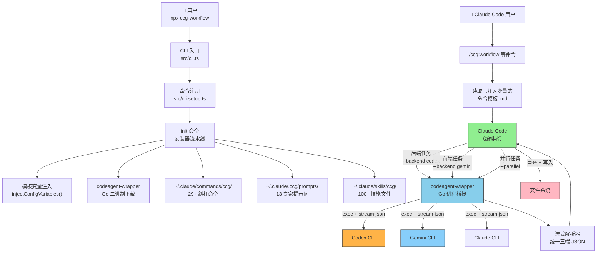
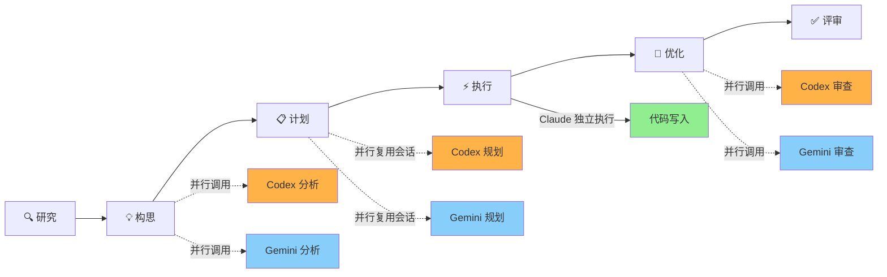

CCG（Claude + Codex + Gemini）是一个**多模型协作开发系统**，核心设计理念是让三个 AI 模型各司其职：**Claude 作为编排者**负责任务分解、代码写入和质量把控，**Codex 专注后端逻辑**（API、算法、数据库），**Gemini 负责前端体验**（UI/UX、组件设计、响应式布局）。本文将深入解析这一三模型协作架构的设计原理、数据流路径和安全模型，帮助你理解系统从一条斜杠命令到多模型并行执行的完整链路。

Sources: [README.md](README.md#L32-L56), [CLAUDE.md](CLAUDE.md#L203-L215)

## 三模型角色分工与安全模型

CCG 架构的核心决策是**职责分离 + 安全隔离**。每个模型承担不同角色，且外部模型（Codex、Gemini）被严格限制为**只读沙箱**——它们只能返回分析结果和 diff patch，所有文件写入操作均由 Claude 执行。

| 模型 | 角色 | 职责范围 | 文件系统权限 |
|------|------|----------|-------------|
| **Claude** | 编排者 (Orchestrator) | 任务分解、计划综合、代码写入、质量审查 | ✅ 完整读写 |
| **Codex** | 后端专家 (Backend Authority) | API 设计、算法实现、数据库优化、安全审计 | ❌ 零写入（只读沙箱） |
| **Gemini** | 前端专家 (Frontend Authority) | UI/UX 设计、组件架构、响应式布局、可访问性 | ❌ 零写入（只读沙箱） |

这种设计的核心价值在于**安全性与可控性**：外部模型的分析结果必须经过 Claude 的审查才会被采纳，确保多模型协作不会引入未经审核的代码变更。模板中明确声明了"外部模型对文件系统**零写入权限**，所有修改由 Claude 执行"这一铁律。

Sources: [templates/commands/workflow.md](templates/commands/workflow.md#L184-L188), [templates/commands/backend.md](templates/commands/backend.md#L160-L168), [templates/commands/frontend.md](templates/commands/frontend.md#L160-L168)

## 整体架构总览

以下 Mermaid 图展示了 CCG 系统从用户输入到多模型执行的完整数据流：



**数据流关键路径**：用户通过 Claude Code 输入 `/ccg:workflow` → Claude 读取已安装的命令模板（其中 `{{BACKEND_PRIMARY}}` 和 `{{FRONTEND_PRIMARY}}` 已在安装时被替换为实际模型名）→ Claude 通过 Bash 工具调用 `codeagent-wrapper` → Go 二进制启动对应后端 CLI 进程 → 解析其 JSON 流输出 → 结果返回 Claude → Claude 综合后执行代码写入。

Sources: [src/cli.ts](src/cli.ts#L1-L11), [src/utils/installer-template.ts](src/utils/installer-template.ts#L64-L134), [codeagent-wrapper/main.go](codeagent-wrapper/main.go#L16-L32)

## 模板变量注入系统

CCG 的一个精妙设计是**安装时变量注入**——模板文件中的占位符在安装阶段就被替换为用户配置的具体值，而非运行时解释。这意味着命令模板安装后即为纯文本，无需额外的模板引擎。

### 模板变量一览

| 变量 | 注入内容 | 注入时机 | 示例值 |
|------|----------|----------|--------|
| `{{BACKEND_PRIMARY}}` | 后端主模型名 | 安装时 | `codex` |
| `{{FRONTEND_PRIMARY}}` | 前端主模型名 | 安装时 | `gemini` |
| `{{BACKEND_MODELS}}` | 后端模型列表 JSON | 安装时 | `["codex"]` |
| `{{FRONTEND_MODELS}}` | 前端模型列表 JSON | 安装时 | `["gemini"]` |
| `{{REVIEW_MODELS}}` | 审查模型列表 JSON | 安装时 | `["codex","gemini"]` |
| `{{GEMINI_MODEL_FLAG}}` | Gemini 型号参数 | 安装时 | `--gemini-model gemini-3.1-pro-preview ` |
| `{{ROUTING_MODE}}` | 路由模式 | 安装时 | `smart` |
| `{{LITE_MODE_FLAG}}` | 轻量模式标记 | 安装时 | `--lite ` 或空 |
| `{{MCP_SEARCH_TOOL}}` | MCP 检索工具名 | 安装时 | `mcp__ace-tool__search_context` |
| `{{MCP_SEARCH_PARAM}}` | MCP 检索参数名 | 安装时 | `query` |

### 注入流程

`injectConfigVariables()` 函数读取用户在初始化时选择的模型路由配置，通过正则替换将模板中的占位符替换为实际值。例如，当用户选择 Codex 作为后端模型时，模板中所有 `{{BACKEND_PRIMARY}}` 都会被替换为 `codex`，所有 `--backend <{{BACKEND_PRIMARY}}|{{FRONTEND_PRIMARY}}>` 变为 `--backend <codex|gemini>`。

路径替换则由 `replaceHomePathsInTemplate()` 处理，将 `~/.claude/bin/codeagent-wrapper` 替换为跨平台兼容的绝对路径（Windows 上追加 `.exe` 后缀）。

Sources: [src/utils/installer-template.ts](src/utils/installer-template.ts#L64-L178)

## codeagent-wrapper：Go 进程桥接层

`codeagent-wrapper` 是一个用 Go 编写的二进制工具（v5.10.0），作为 Claude Code 与外部 AI CLI 工具之间的**进程管理桥接层**。它解决了三个核心问题：

1. **统一调用接口**：无论调用 Codex、Gemini 还是 Claude CLI，都通过同一个 `codeagent-wrapper` 二进制，通过 `--backend` 参数切换后端
2. **流式输出解析**：三种 CLI 工具输出不同的 JSON 流格式，wrapper 将其统一解析为 Claude 可消费的文本输出
3. **会话管理**：支持 `resume <SESSION_ID>` 模式，在多阶段工作流中复用上下文

### 调用语法

```bash
# 单任务模式
codeagent-wrapper --backend <codex|gemini|claude> - "<工作目录>" <<'EOF'
ROLE_FILE: <角色提示词路径>
<TASK>
需求：<任务描述>
上下文：<前序阶段结果>
</TASK>
OUTPUT: 期望输出格式
EOF

# 并行模式
codeagent-wrapper --parallel --backend <backend> <<'EOF'
---TASK---
id: task-1
backend: codex
---CONTENT---
任务内容...
---TASK---
id: task-2
backend: gemini
---CONTENT---
任务内容...
EOF
```

### Backend 抽象层

Go 端通过 `Backend` 接口实现后端解耦，三种后端分别对应 `CodexBackend`、`ClaudeBackend`、`GeminiBackend` 结构体：

```go
type Backend interface {
    Name() string
    BuildArgs(cfg *Config, targetArg string) []string
    Command() string
}
```

每个后端实现负责构建对应 CLI 工具的命令行参数。例如 `GeminiBackend` 会处理 `-m <model>`（指定 Gemini 型号）、`-o stream-json`（流式 JSON 输出）、`--include-directories`（避免 `.env` 冲突）等参数，而 `ClaudeBackend` 则构建 `-p --output-format stream-json --verbose` 参数链。

Sources: [codeagent-wrapper/backend.go](codeagent-wrapper/backend.go#L1-L157), [codeagent-wrapper/main.go](codeagent-wrapper/main.go#L244-L278), [codeagent-wrapper/config.go](codeagent-wrapper/config.go#L13-L81)

## 流式解析器：三端 JSON 统一处理

三种 AI CLI 工具输出不同格式的 JSON 事件流，`codeagent-wrapper` 的解析器（`parser.go`）通过 `UnifiedEvent` 结构体实现**单次反序列化**统一处理：

| 后端 | Session ID 字段 | 消息类型标识 | 输出格式 |
|------|----------------|-------------|---------|
| **Codex** | `thread_id` | `item.type == "message"` | `{"type":"turn.started","thread_id":"...","item":{"type":"message","text":"..."}}` |
| **Claude** | `session_id` | `type == "result"` | `{"type":"result","session_id":"...","result":"..."}` |
| **Gemini** | `sessionId` (camelCase) | `role == "model"` + 非 delta | `{"type":"...","sessionId":"...","role":"model","content":"...","delta":false}` |

解析器通过字段存在性自动检测后端类型（如 `thread_id` 存在 → Codex，`sessionId` 存在 → Gemini），无需显式指定。解析结果统一输出为纯文本消息，Claude 可以直接消费。

值得注意的是，Gemini CLI 使用驼峰命名 `sessionId` 而非蛇形 `session_id`，解析器通过 `GetSessionID()` 方法兼容两种格式。

Sources: [codeagent-wrapper/parser.go](codeagent-wrapper/parser.go#L14-L200)

## 命令模板与多模型协作模式

CCG 提供 29+ 个斜杠命令，每个命令模板都是一个 Markdown 文件，编码了特定的多模型协作模式。根据任务性质，命令分为三种路由策略：

### 路由策略对比

| 模式 | 典型命令 | 模型调度 | 适用场景 |
|------|----------|---------|---------|
| **双模型并行** | `/ccg:workflow`、`/ccg:review` | Codex + Gemini 并行分析，Claude 综合 | 全栈任务、代码审查 |
| **单模型专项** | `/ccg:frontend`、`/ccg:backend` | 仅 Gemini 或仅 Codex，Claude 编排 | 明确的前/后端任务 |
| **全权委托** | `/ccg:codex-exec` | Codex 自主规划+执行，多模型仅做审查 | 低 Claude token 消耗场景 |

在双模型并行模式中，命令模板定义了**权威边界**：后端任务中"Codex 意见可信赖，Gemini 意见仅供参考"；前端任务中反之。这避免了模型间意见冲突导致的执行混乱。

### 六阶段工作流示例

以 `/ccg:workflow` 为例，一个完整任务经历 6 个阶段，多个阶段涉及双模型并行调用：



**会话复用**是并行调用的关键优化：阶段 2（构思）首次调用 Codex/Gemini 后，返回的 `SESSION_ID` 被保存为 `CODEX_SESSION` 和 `GEMINI_SESSION`；阶段 3（计划）和阶段 5（优化）通过 `resume <SESSION_ID>` 复用同一会话，使模型能感知前序阶段的上下文，避免重复分析。

Sources: [templates/commands/workflow.md](templates/commands/workflow.md#L1-L189), [templates/commands/frontend.md](templates/commands/frontend.md#L1-L168), [templates/commands/backend.md](templates/commands/backend.md#L1-L168)

## 专家提示词体系

CCG 为每个模型配备了**角色特定的专家提示词**，共 19 个文件分布在三个模型目录下：

| 模型 | 提示词文件 | 角色描述 |
|------|-----------|---------|
| **Codex (6)** | `analyzer.md` / `architect.md` / `debugger.md` / `optimizer.md` / `reviewer.md` / `tester.md` | 后端技术分析、系统架构、调试、性能优化、代码审查、测试 |
| **Gemini (7)** | `analyzer.md` / `architect.md` / `debugger.md` / `optimizer.md` / `reviewer.md` / `tester.md` / `frontend.md` | 前端分析、组件架构、调试、优化、审查、测试、前端专项 |
| **Claude (6)** | `analyzer.md` / `architect.md` / `debugger.md` / `optimizer.md` / `reviewer.md` / `tester.md` | Claude 作为后端时的对应角色 |

所有提示词都包含 **CRITICAL CONSTRAINTS** 段落，明确声明"ZERO file system write permission - READ-ONLY sandbox"和"OUTPUT FORMAT: Unified Diff Patch ONLY"，在提示词层面构筑了安全防线。提示词还集成了 `.context/` 目录感知能力，能读取项目的编码风格偏好和历史决策记录。

Sources: [templates/prompts/codex/analyzer.md](templates/prompts/codex/analyzer.md#L1-L59), [templates/prompts/gemini/architect.md](templates/prompts/gemini/architect.md#L1-L56), [CLAUDE.md](CLAUDE.md#L403-L405)

## 模型路由配置

自 v2.1.0 起，模型路由可通过 `config.toml` 配置，不再硬编码为 Codex + Gemini。配置存储在 `~/.claude/.ccg/config.toml`，通过 TypeScript 类型 `ModelRouting` 定义路由规则：

```toml
[routing]
mode = "smart"

[routing.frontend]
models = ["gemini"]
primary = "gemini"
strategy = "parallel"

[routing.backend]
models = ["codex"]
primary = "codex"
strategy = "parallel"

[routing.review]
models = ["codex", "gemini"]
strategy = "parallel"
```

用户可以在初始化时（`npx ccg-workflow` Step 2/4）或菜单中（`6. 配置模型路由`）选择前端/后端的模型组合。配置变更后，安装器会重新注入模板变量并覆盖已安装的命令文件。

Sources: [src/utils/config.ts](src/utils/config.ts#L43-L95), [src/types/index.ts](src/types/index.ts#L1-L57)

## 并行执行引擎

`codeagent-wrapper` 内置了并行执行引擎，通过 `--parallel` 模式支持多任务并行调度。任务配置采用自定义的 `---TASK---` / `---CONTENT---` 分隔符格式，支持**任务依赖声明**和**拓扑排序**：

```
---TASK---
id: backend-api
backend: codex
---CONTENT---
设计 RESTful API...
---TASK---
id: frontend-components
backend: gemini
dependencies: backend-api
---CONTENT---
基于 API 设计前端组件...
```

引擎通过 `topologicalSort()` 函数将任务按依赖关系分层：同一层内的任务并行执行，层间按依赖顺序串行。这确保了后端 API 设计完成后才开始前端组件开发，而独立的任务则可以同时运行。

Sources: [codeagent-wrapper/config.go](codeagent-wrapper/config.go#L109-L195), [codeagent-wrapper/executor.go](codeagent-wrapper/executor.go#L287-L350), [codeagent-wrapper/main.go](codeagent-wrapper/main.go#L186-L324)

## 架构设计决策总结

| 设计决策 | 解决的问题 | 实现方式 |
|---------|-----------|---------|
| **安装时变量注入** | 避免运行时模板引擎开销 | `injectConfigVariables()` 正则替换 |
| **Go 二进制桥接** | 统一三种 CLI 的调用和输出解析 | `Backend` 接口 + `UnifiedEvent` 解析 |
| **只读沙箱模型** | 防止外部模型直接修改文件 | 提示词约束 + wrapper 不传递写权限 |
| **会话复用** | 保持多阶段上下文连贯性 | `resume <SESSION_ID>` 机制 |
| **拓扑排序并行** | 有依赖关系的任务正确调度 | `topologicalSort()` + 分层执行 |
| **可配置路由** | 用户可选择不同的模型组合 | `config.toml` + 模板重注入 |

Sources: [src/utils/installer-template.ts](src/utils/installer-template.ts#L1-L178), [codeagent-wrapper/backend.go](codeagent-wrapper/backend.go#L10-L17), [codeagent-wrapper/parser.go](codeagent-wrapper/parser.go#L71-L102)

## 下一步阅读

- 了解路由机制的配置细节 → [模型路由机制：前端/后端模型配置与智能调度](5-mo-xing-lu-you-ji-zhi-qian-duan-hou-duan-mo-xing-pei-zhi-yu-zhi-neng-diao-du)
- 深入 Go 二进制的实现 → [codeagent-wrapper 二进制：Go 进程管理与多后端调用](6-codeagent-wrapper-er-jin-zhi-go-jin-cheng-guan-li-yu-duo-hou-duan-diao-yong)
- 了解模板如何被安装到用户系统 → [安装器流水线：从模板变量注入到文件部署的完整链路](7-an-zhuang-qi-liu-shui-xian-cong-mo-ban-bian-liang-zhu-ru-dao-wen-jian-bu-shu-de-wan-zheng-lian-lu)