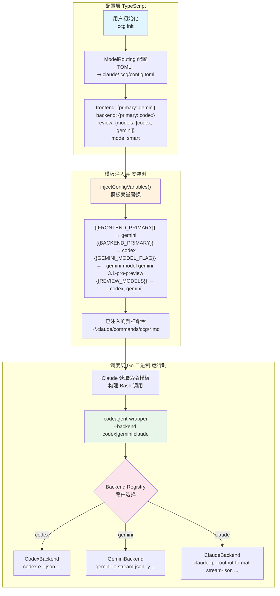
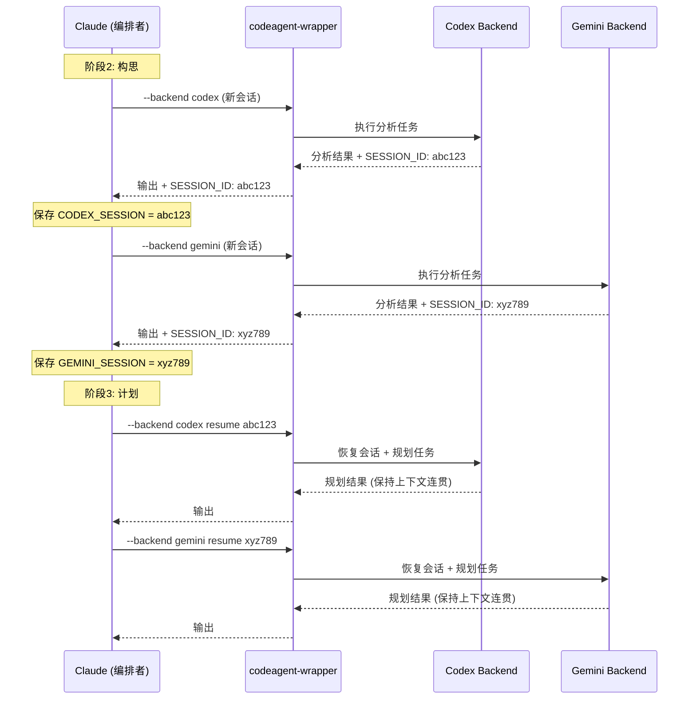

CCG 的核心竞争力在于将 **Codex、Gemini、Claude** 三个 AI 模型的能力域精准匹配到不同任务类型。模型路由机制是一套贯穿"配置层 → 模板注入层 → 后端调度层"的三级管线：用户在初始化时选择前端/后端模型偏好，这些偏好被写入 TOML 配置文件，然后在命令安装时通过模板变量注入到每个斜杠命令中，最终由 `codeagent-wrapper` 二进制根据 `--backend` 参数将任务分派到对应的 AI CLI 后端执行。本文将逐层拆解这条管线的每一个环节，帮助你理解 CCG 如何实现"前端任务走 Gemini，后端任务走 Codex，审查双模型并行"的智能调度策略。

Sources: [types/index.ts](src/types/index.ts#L1-L31), [config.go](codeagent-wrapper/config.go#L66-L81)

## 整体路由架构

在深入每一层之前，先从宏观视角理解模型路由的数据流向。以下 Mermaid 图展示了从用户配置到最终执行的三级管线：

> **前置说明**：Mermaid 图中的三个层级分别对应 TypeScript 配置层（用户交互）、模板注入层（安装时变量替换）、Go 二进制调度层（运行时后端选择）。



**三级管线的核心设计原则**：配置层负责"用户意图捕获"，模板注入层负责"意图烘焙到命令"，调度层负责"运行时执行路由"。这种分层架构使得用户只需在 `ccg init` 时做一次选择，后续所有命令自动遵循该路由策略，无需每次调用时手动指定后端。

Sources: [installer-template.ts](src/utils/installer-template.ts#L64-L134), [config.go](codeagent-wrapper/config.go#L66-L81), [backend.go](codeagent-wrapper/backend.go#L13-L17)

## 配置层：ModelRouting 类型系统

### 类型定义与配置结构

模型路由的配置由 `ModelRouting` 接口定义，存储在 `~/.claude/.ccg/config.toml` 中。该接口将任务场景分为三个域（frontend、backend、review），每个域独立配置模型列表和路由策略。

| 配置域 | 类型 | 说明 | 默认值 |
|--------|------|------|--------|
| `frontend.models` | `ModelType[]` | 前端任务可用模型列表 | `['gemini']` |
| `frontend.primary` | `ModelType` | 前端任务首选模型 | `'gemini'` |
| `frontend.strategy` | `RoutingStrategy` | 前端路由策略（parallel/fallback/round-robin） | `'parallel'` |
| `backend.models` | `ModelType[]` | 后端任务可用模型列表 | `['codex']` |
| `backend.primary` | `ModelType` | 后端任务首选模型 | `'codex'` |
| `backend.strategy` | `RoutingStrategy` | 后端路由策略 | `'parallel'` |
| `review.models` | `ModelType[]` | 审查任务参与模型（始终并行） | `['codex', 'gemini']` |
| `review.strategy` | `'parallel'` | 审查策略（固定为并行） | `'parallel'` |
| `mode` | `CollaborationMode` | 全局协作模式（parallel/smart/sequential） | `'smart'` |
| `geminiModel` | `string` | Gemini 具体型号 | `'gemini-3.1-pro-preview'` |

**类型约束**：`ModelType` 被限定为 `'codex' | 'gemini' | 'claude'` 三种取值，`RoutingStrategy` 支持 `'parallel' | 'fallback' | 'round-robin'` 三种策略，`CollaborationMode` 支持 `'parallel' | 'smart' | 'sequential'` 三种协作模式。这种强类型约束确保了配置的合法性。

Sources: [types/index.ts](src/types/index.ts#L1-L31)

### 初始化时的路由选择

在 `ccg init` 流程中，用户通过交互式提示选择前端和后端模型。系统会分别展示两个独立的选项列表：

- **前端模型选择**：Gemini（推荐）或 Codex
- **后端模型选择**：Gemini 或 Codex（推荐）
- **Gemini 型号选择**（当 Gemini 被选为任一角色时触发）：`gemini-3.1-pro-preview`（推荐）、`gemini-2.5-flash`、或自定义型号

选择完成后，系统自动构建 `ModelRouting` 对象，其中 `review.models` 通过合并前端和后端模型列表并去重生成——这保证了审查阶段始终是双模型并行交叉验证。

Sources: [init.ts](src/commands/init.ts#L291-L382)

### TOML 配置示例

最终生成的 `config.toml` 文件结构如下：

```toml
[general]
version = "5.10.0"
language = "zh-CN"
createdAt = "2025-01-15T10:30:00.000Z"

[routing]
mode = "smart"
geminiModel = "gemini-3.1-pro-preview"

[routing.frontend]
models = ["gemini"]
primary = "gemini"
strategy = "fallback"

[routing.backend]
models = ["codex"]
primary = "codex"
strategy = "fallback"

[routing.review]
models = ["codex", "gemini"]
strategy = "parallel"
```

Sources: [config.ts](src/utils/config.ts#L43-L95)

## 模板注入层：从配置到命令的变量烘焙

### 注入机制

模板注入是模型路由的"编译时"环节。`injectConfigVariables()` 函数在安装命令时将配置值替换到模板的占位符中，确保每个已安装的斜杠命令都携带了用户特定的路由配置。

| 模板占位符 | 替换来源 | 示例输出 |
|-----------|---------|---------|
| `{{FRONTEND_PRIMARY}}` | `routing.frontend.primary` | `gemini` |
| `{{BACKEND_PRIMARY}}` | `routing.backend.primary` | `codex` |
| `{{FRONTEND_MODELS}}` | `JSON.stringify(routing.frontend.models)` | `["gemini"]` |
| `{{BACKEND_MODELS}}` | `JSON.stringify(routing.backend.models)` | `["codex"]` |
| `{{REVIEW_MODELS}}` | `JSON.stringify(routing.review.models)` | `["codex","gemini"]` |
| `{{ROUTING_MODE}}` | `routing.mode` | `smart` |
| `{{GEMINI_MODEL_FLAG}}` | 条件生成（当使用 Gemini 时） | `--gemini-model gemini-3.1-pro-preview ` |
| `{{LITE_MODE_FLAG}}` | `config.liteMode` | `--lite `（或空字符串） |

**`GEMINI_MODEL_FLAG` 的条件逻辑**值得特别关注：只有当 `frontend.primary` 或 `backend.primary` 为 `gemini` 时，才会注入 `--gemini-model <name>` 标志。这意味着如果用户选择"Codex 做前端、Codex 做后端"，模板中该标志位将被替换为空字符串，避免了无效参数传递给后端。

Sources: [installer-template.ts](src/utils/installer-template.ts#L64-L134)

### 注入后的命令模板示例

以 `/ccg:frontend` 命令为例，注入前后对比：

| 片段 | 注入前（模板） | 注入后（已安装命令） |
|------|---------------|-------------------|
| description | `前端专项工作流...{{FRONTEND_PRIMARY}} 主导` | `前端专项工作流...gemini 主导` |
| 后端模型标签 | `{{BACKEND_PRIMARY}}` | `codex` |
| 调用命令 | `codeagent-wrapper {{LITE_MODE_FLAG}}--progress --backend {{FRONTEND_PRIMARY}} {{GEMINI_MODEL_FLAG}}-` | `codeagent-wrapper --progress --backend gemini --gemini-model gemini-3.1-pro-preview -` |
| 角色提示词 | `prompts/{{FRONTEND_PRIMARY}}/analyzer.md` | `prompts/gemini/analyzer.md` |

这种"烘焙式"注入确保了运行时零配置开销——Claude 读取到的命令模板已经包含了完整的路由路径，直接构建 Bash 调用即可。

Sources: [frontend.md](templates/commands/frontend.md#L1-L42), [backend.md](templates/commands/backend.md#L1-L42)

## 调度层：codeagent-wrapper 后端路由

### Backend 抽象接口

Go 二进制 `codeagent-wrapper` 通过 `Backend` 接口实现后端的多态调度。该接口定义了三个方法：

```go
type Backend interface {
    Name() string                           // 后端标识名
    BuildArgs(cfg *Config, targetArg string) []string  // 构建命令参数
    Command() string                        // 可执行文件名
}
```

系统通过 `backendRegistry` 注册表维护三个后端实现，`selectBackend()` 函数根据名称（不区分大小写）查找对应后端。默认后端为 `codex`，当用户未指定 `--backend` 参数时自动使用。

| 后端 | Command() | 核心参数 | 特殊行为 |
|------|-----------|---------|---------|
| **CodexBackend** | `codex` | `e --dangerously-bypass-approvals-and-sandbox -C <workdir> --json <task>` | 自动跳过审批和 git 检查；使用 `-C` 传递工作目录 |
| **ClaudeBackend** | `claude` | `-p --output-format stream-json --verbose <task>` | 禁用设置源以防止递归调用；通过 `cmd.Dir` 设置工作目录 |
| **GeminiBackend** | `gemini` | `-m <model> -o stream-json -y --include-directories <workdir> -p <task>` | 支持 `--gemini-model` 指定具体型号；工作目录通过 `--include-directories` 传递 |

Sources: [backend.go](codeagent-wrapper/backend.go#L1-L157), [config.go](codeagent-wrapper/config.go#L66-L81)

### 三后端参数构建差异

每个后端的 `BuildArgs` 方法针对对应 CLI 的接口规范构建不同的参数序列，体现了三个 AI CLI 工具在命令行接口上的差异：

**Codex 后端**使用 `e` 子命令（execute 模式），默认传递 `--dangerously-bypass-approvals-and-sandbox` 和 `--skip-git-repo-check` 以确保自动化执行无阻碍，通过 `-C` 标志传递工作目录。恢复模式使用 `resume <session_id>` 子命令。

**Claude 后端**使用 `-p` 标志进入管道模式，关键设计是传递 `--setting-sources ""` 来禁用所有设置源（用户级、项目级、本地级），这防止了无限递归——否则 Claude CLI 会加载 CLAUDE.md 和技能文件，再次触发 codeagent-wrapper 调用。

**Gemini 后端**的设计最为复杂。它使用 `-o stream-json -y` 设置输出格式和自动确认，通过 `-m <model>` 支持模型选择。工作目录传递使用 `--include-directories` 而非 `-C`，这是为了解决 Gemini CLI 从 CWD 向上遍历加载 `.env` 文件导致的 API Key 覆盖问题。在 Windows 平台上，由于 npm 的 `.cmd` 包装器会截断多行参数，Gemini 后端会通过 stdin 管道传递任务而非 `-p` 标志。

Sources: [backend.go](codeagent-wrapper/backend.go#L84-L157), [executor.go](codeagent-wrapper/executor.go#L757-L799)

### 命令行参数解析与后端选择

`codeagent-wrapper` 的参数解析支持以下路由相关参数：

```
codeagent-wrapper [选项] <任务> [工作目录]

路由选项：
  --backend <name>          选择后端 (codex, gemini, claude)
  --gemini-model <name>     指定 Gemini 型号（仅 gemini 后端生效）
  --lite, -L                轻量模式：禁用 Web UI，更快响应
  --progress                输出紧凑进度信息到 stderr

环境变量：
  GEMINI_MODEL              Gemini 型号（CLI 参数优先级更高）
  CODEAGENT_LITE_MODE       启用轻量模式 (true/false)
```

**优先级链**：`--gemini-model` CLI 参数 > `GEMINI_MODEL` 环境变量 > 配置文件中的 `geminiModel`。当 `--gemini-model` 被用于非 Gemini 后端时，系统会输出警告但不阻止执行。

Sources: [config.go](codeagent-wrapper/config.go#L197-L296), [main.go](codeagent-wrapper/main.go#L546-L592)

## 命令级路由策略

不同的斜杠命令采用不同的路由策略，将模型能力域与任务类型精准匹配。以下表格展示了主要命令的路由模式：

| 命令 | 路由模式 | 说明 |
|------|---------|------|
| `/ccg:frontend` | **单模型主导** — `FRONTEND_PRIMARY` | Gemini 主导前端分析/规划/审查；`BACKEND_PRIMARY` 意见仅供参考 |
| `/ccg:backend` | **单模型主导** — `BACKEND_PRIMARY` | Codex 主导后端分析/规划/审查；`FRONTEND_PRIMARY` 意见仅供参考 |
| `/ccg:workflow` | **双模型并行** — 各阶段按需路由 | 研究阶段 Claude 独立完成；构思/规划/优化阶段双模型并行分析；执行阶段 Claude 实施 |
| `/ccg:plan` | **双模型并行分析** → Claude 综合 | 双模型并行输出分析结果和计划草案，Claude 交叉验证后综合最终计划 |
| `/ccg:execute` | **任务类型路由** — 前端/后端/全栈 | 根据计划中的任务类型标记（前端→`FRONTEND_PRIMARY`，后端→`BACKEND_PRIMARY`，全栈→并行） |
| `/ccg:review` | **双模型交叉审查** | 双模型并行审查，后端问题以 `BACKEND_PRIMARY` 为准，前端问题以 `FRONTEND_PRIMARY` 为准 |
| `/ccg:codex-exec` | **单模型全权** — `BACKEND_PRIMARY` | Codex 全权执行（MCP 搜索 + 代码实现 + 测试），多模型仅参与审核阶段 |

Sources: [frontend.md](templates/commands/frontend.md#L1-L168), [backend.md](templates/commands/backend.md#L1-L168), [workflow.md](templates/commands/workflow.md#L1-L189), [plan.md](templates/commands/plan.md#L1-L200), [execute.md](templates/commands/execute.md#L131-L200), [review.md](templates/commands/review.md#L1-L138), [codex-exec.md](templates/commands/codex-exec.md#L1-L100)

### 权威性原则

每个路由策略背后都遵循**领域权威性原则**：在特定领域内，对应模型的意见具有决定性权重，而另一个模型的意见仅供参考。具体规则：

- **前端/UI/样式/设计**：`FRONTEND_PRIMARY`（默认 Gemini）是前端权威，其 CSS/React/Vue 原型为最终视觉基准；`BACKEND_PRIMARY` 对前端设计的建议被忽略
- **后端/API/算法/逻辑**：`BACKEND_PRIMARY`（默认 Codex）是后端权威，利用其逻辑运算与 Debug 能力；`FRONTEND_PRIMARY` 对后端逻辑的建议被忽略
- **审查阶段**：双模型交叉验证，按问题领域分别采纳权威模型的判断

这一原则在命令模板中被显式编码为"关键规则"部分，例如 `/ccg:frontend` 中明确规定"FRONTEND_PRIMARY 前端意见可信赖"、"BACKEND_PRIMARY 前端意见仅供参考"。

Sources: [frontend.md](templates/commands/frontend.md#L161-L168), [execute.md](templates/commands/execute.md#L176-L192)

## 会话复用与跨阶段上下文传递

模型路由不仅仅是选择哪个后端执行，还包括如何在多个阶段之间保持上下文连贯性。CCG 通过 **SESSION_ID 机制**实现跨阶段的会话复用：



每次 `codeagent-wrapper` 调用完成后，如果后端返回了 `SESSION_ID`，wrapper 会在输出末尾追加 `SESSION_ID: <id>` 标记。命令模板中要求 Claude 在每个阶段结束后保存这些 ID（如 `CODEX_SESSION`、`GEMINI_SESSION`），并在后续阶段通过 `resume <session_id>` 语法复用会话，确保模型能访问前序阶段的完整上下文。

Sources: [workflow.md](templates/commands/workflow.md#L82-L84), [main.go](codeagent-wrapper/main.go#L489-L492)

## 容错与重试机制

模型路由的实现中内置了针对不同后端特性的容错策略，以应对各模型 API 的差异性和不稳定性：

**前端模型（Gemini）失败重试**：Gemini 的 API 稳定性相对较低，因此所有命令模板中都强制规定"若前端模型调用失败（非零退出码或输出包含错误信息），最多重试 2 次（间隔 5 秒）。仅当 3 次全部失败时才跳过前端模型结果并使用单模型结果继续"。

**后端模型（Codex）耐心等待**：Codex 的执行时间通常较长（5-15 分钟），模板规定"TaskOutput 超时后必须继续用 TaskOutput 轮询，绝对禁止在后端模型未返回结果时直接跳过"。已启动的后端任务若被跳过等于浪费 token 且可能产生不一致状态。

**超时管理**：后台任务的等待超时统一设置为 600000ms（10 分钟），通过 `TaskOutput({ task_id, block: true, timeout: 600000 })` 实现。若 10 分钟后仍未完成，模板要求继续轮询或通过 `AskUserQuestion` 询问用户选择。

Sources: [workflow.md](templates/commands/workflow.md#L92-L98), [review.md](templates/commands/review.md#L60-L65)

## 并行模式下的路由

`codeagent-wrapper` 的 `--parallel` 模式支持在单次调用中执行多个任务，每个任务可以指定不同的后端。并行配置通过 stdin 传入，使用 `---TASK---` 和 `---CONTENT---` 分隔符定义任务块：

```
---TASK---
id: backend-analysis
backend: codex
---CONTENT---
分析后端架构...
---TASK---
id: frontend-analysis
backend: gemini
---CONTENT---
分析前端组件...
```

在并行模式下，全局 `--backend` 参数作为默认后端，每个任务可以通过 `backend:` 字段覆盖。未指定后端的任务自动继承全局设置。系统通过拓扑排序解析任务依赖关系，按层并行执行。

Sources: [config.go](codeagent-wrapper/config.go#L27-L195), [main.go](codeagent-wrapper/main.go#L196-L324)

## 角色提示词与模型能力匹配

模型路由的"最后一公里"是角色提示词系统。CCG 为三个模型各准备了 6-7 个角色提示词，安装时根据路由配置只部署对应模型的提示词文件：

| 角色 | Codex | Gemini | Claude |
|------|-------|--------|--------|
| analyzer（分析者） | ✅ | ✅ | ✅ |
| architect（架构师） | ✅ | ✅ | ✅ |
| reviewer（审查者） | ✅ | ✅ | ✅ |
| debugger（调试者） | ✅ | ✅ | ✅ |
| optimizer（优化者） | ✅ | ✅ | ✅ |
| tester（测试者） | ✅ | ✅ | ✅ |
| frontend（前端专家） | — | ✅ | — |

注意 Gemini 独有的 `frontend.md` 提示词——这体现了 Gemini 在前端/UI 任务上的专精定位。当用户选择 Gemini 作为前端模型时，`/ccg:execute` 的前端路由会使用这个专属提示词来获取高质量的 UI 原型。

Sources: [prompts 目录结构](templates/prompts), [execute.md](templates/commands/execute.md#L87-L92)

## 延伸阅读

- 要了解 `codeagent-wrapper` 的完整进程管理机制（包括超时控制、信号处理、流式解析），参见 [codeagent-wrapper 二进制：Go 进程管理与多后端调用](6-codeagent-wrapper-er-jin-zhi-go-jin-cheng-guan-li-yu-duo-hou-duan-diao-yong)
- 要了解 Backend 接口的三个具体实现及其参数差异，参见 [Backend 抽象层：Codex/Claude/Gemini 后端接口实现](22-backend-chou-xiang-ceng-codex-claude-gemini-hou-duan-jie-kou-shi-xian)
- 要了解模板变量注入如何与完整安装流水线结合，参见 [安装器流水线：从模板变量注入到文件部署的完整链路](7-an-zhuang-qi-liu-shui-xian-cong-mo-ban-bian-liang-zhu-ru-dao-wen-jian-bu-shu-de-wan-zheng-lian-lu)
- 要了解配置文件的完整结构和所有配置项，参见 [配置系统：TOML 配置文件结构与路由设置](19-pei-zhi-xi-tong-toml-pei-zhi-wen-jian-jie-gou-yu-lu-you-she-zhi)