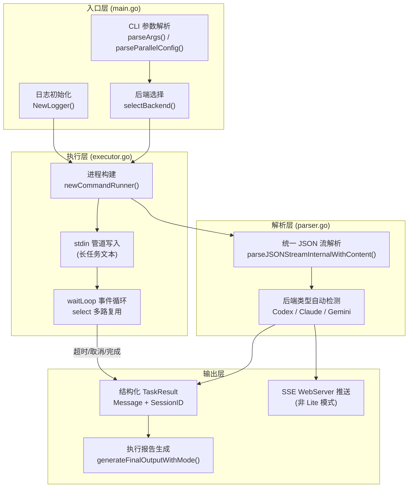
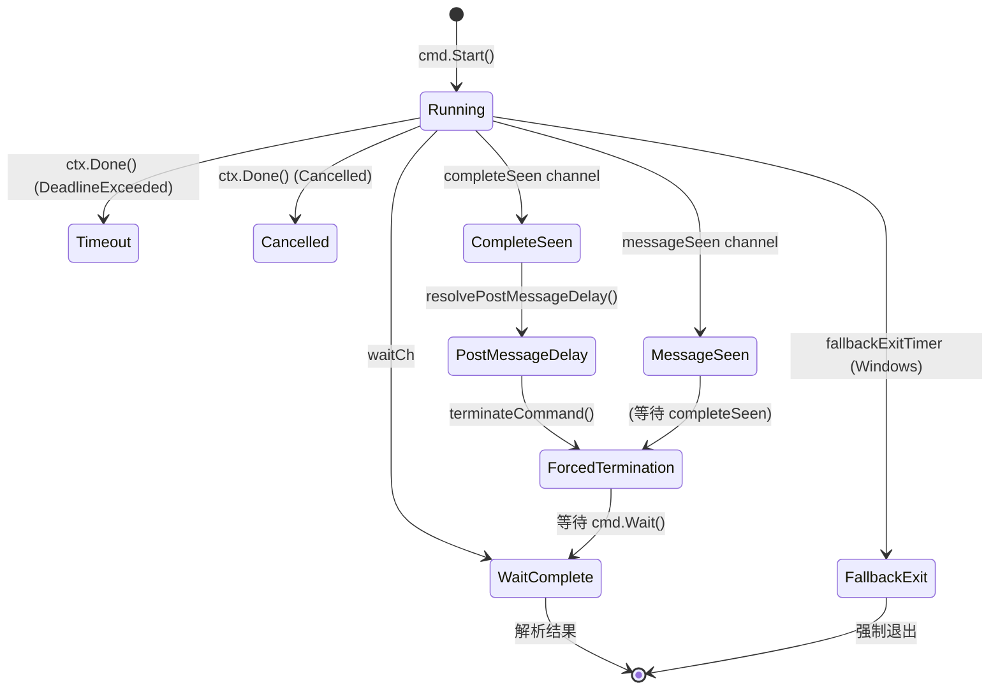

`codeagent-wrapper` 是一个用 Go 编写的**进程管理二进制**，充当上层 TypeScript CLI（CCG 系统）与底层 AI 编码助手 CLI 之间的统一调度层。它的核心职责是：接收任务文本、选择后端（Codex / Claude / Gemini）、启动子进程、流式解析 JSON 输出、管理超时与信号转发，最终将结构化结果返回给调用方。整个设计遵循"薄包装、厚解析"的原则——wrapper 本身不执行 AI 推理，而是精确地编排外部进程的生命周期。

Sources: [main.go](codeagent-wrapper/main.go#L120-L178), [config.go](codeagent-wrapper/config.go#L13-L64)

## 整体架构与数据流

下面的 Mermaid 图展示了 `codeagent-wrapper` 在单任务模式下的核心执行流程。并行模式（`--parallel`）会在此基础上增加拓扑排序和并发调度，在 [并行执行引擎：--parallel 模式与任务依赖管理](25-bing-xing-zhi-xing-yin-qing-parallel-mo-shi-yu-ren-wu-yi-lai-guan-li) 中详细展开。

> **前置知识**：Mermaid 图中的箭头表示数据/控制流方向，菱形节点表示条件分支。



Sources: [main.go](codeagent-wrapper/main.go#L120-L501), [executor.go](codeagent-wrapper/executor.go#L810-L1327), [parser.go](codeagent-wrapper/parser.go#L110-L389)

## 模块职责矩阵

`codeagent-wrapper` 由 **13 个 Go 源文件**组成（不含测试），每个文件承担明确的单一职责：

| 文件 | 核心职责 | 关键导出符号 |
|------|---------|------------|
| [main.go](codeagent-wrapper/main.go) | 入口路由、CLI 参数分发、并行模式协调 | `run()`, `printHelp()`, `runCleanupMode()` |
| [config.go](codeagent-wrapper/config.go) | CLI 配置解析、并行任务配置解析、后端注册表 | `Config`, `TaskSpec`, `TaskResult`, `selectBackend()` |
| [backend.go](codeagent-wrapper/backend.go) | Backend 接口定义、三后端实现、参数构建 | `Backend` 接口, `CodexBackend`, `ClaudeBackend`, `GeminiBackend` |
| [executor.go](codeagent-wrapper/executor.go) | 进程生命周期、信号处理、并发调度、报告生成 | `runCodexTaskWithContext()`, `executeConcurrent()`, `topologicalSort()` |
| [parser.go](codeagent-wrapper/parser.go) | 三端 JSON 流统一解析、事件检测、内容提取 | `parseJSONStreamInternalWithContent()`, `UnifiedEvent` |
| [server.go](codeagent-wrapper/server.go) | SSE WebServer、实时输出流推送、浏览器自动打开 | `WebServer`, `StartSession()`, `SendContentWithType()` |
| [logger.go](codeagent-wrapper/logger.go) | 异步文件日志、错误缓存、过期日志清理 | `Logger`, `NewLogger()`, `ExtractRecentErrors()` |
| [filter.go](codeagent-wrapper/filter.go) | stderr 噪声过滤（Gemini/Claude 启动信息等） | `filteringWriter`, `noisePatterns` |
| [utils.go](codeagent-wrapper/utils.go) | 超时解析、stdin 检测、ROLE_FILE 注入、路径规范化 | `resolveTimeout()`, `shouldUseStdin()`, `injectRoleFile()` |
| [wrapper_name.go](codeagent-wrapper/wrapper_name.go) | 二进制名称解析（支持 symlink 别名） | `currentWrapperName()`, `primaryLogPrefix()` |
| [process_check_unix.go](codeagent-wrapper/process_check_unix.go) | Unix 进程存活检测、启动时间获取 | `isProcessRunning()`, `getProcessStartTime()` |
| [process_check_windows.go](codeagent-wrapper/process_check_windows.go) | Windows 进程存活检测（kernel32 API） | `isProcessRunning()`, `getProcessStartTime()` |
| [windows_console.go](codeagent-wrapper/windows_console.go) / [windows_console_unix.go](codeagent-wrapper/windows_console_unix.go) | Windows 控制台窗口隐藏（构建标签切换） | `hideWindowsConsole()` |

Sources: [main.go](codeagent-wrapper/main.go#L1-L32), [config.go](codeagent-wrapper/config.go#L13-L70), [backend.go](codeagent-wrapper/backend.go#L13-L17), [executor.go](codeagent-wrapper/executor.go#L1-L20), [parser.go](codeagent-wrapper/parser.go#L15-L93), [server.go](codeagent-wrapper/server.go#L17-L43), [filter.go](codeagent-wrapper/filter.go#L10-L23)

## 多后端抽象层

### Backend 接口设计

系统通过 `Backend` 接口实现后端解耦，接口仅包含三个方法——**Name** 返回后端标识、**Command** 返回可执行文件名、**BuildArgs** 根据配置构建完整参数列表：

```go
type Backend interface {
    Name() string
    BuildArgs(cfg *Config, targetArg string) []string
    Command() string
}
```

后端注册表以 map 形式维护在 [config.go](codeagent-wrapper/config.go#L66-L70)，通过 `selectBackend()` 函数按名称查找，支持 `--backend` 参数或环境变量动态切换。

### 三后端参数构建策略

三个后端的参数构建逻辑差异显著，下表对比了关键行为：

| 维度 | Codex | Claude | Gemini |
|------|-------|--------|--------|
| **CLI 命令** | `codex e` | `claude -p` | `gemini -o stream-json -y` |
| **JSON 输出** | `--json` | `--output-format stream-json --verbose` | `-o stream-json` |
| **工作目录** | `-C <path>`（CLI 参数） | `cmd.Dir`（进程级别） | `--include-directories <path>` + `cmd.Dir` |
| **Resume** | `resume <session_id> <task>` | `-r <session_id>` | `-r <session_id>` |
| **自动审批** | `--dangerously-bypass-approvals-and-sandbox` | `--dangerously-skip-permissions` | `-y`（YOLO 模式） |
| **stdin 传递** | `-` 作为 stdin 标记 | `-` 作为 stdin 标记 | macOS/Linux: 直接 `-p "text"`；Windows: 管道 stdin |
| **模型指定** | 不支持 | 不支持 | `-m <model>` |
| **权限跳过保护** | 通过 `--setting-sources ""` 阻止递归调用 | 通过 `--setting-sources ""` 阻止 CLAUDE.md 加载 | 无需特殊处理 |

**Windows stdin 差异的根因**：Windows 上 npm 的 `.cmd` 包装器通过 `cmd.exe` 执行，多行参数在第一个换行符处被截断（[Issue #129](codeagent-wrapper/executor.go#L862)），因此 Gemini 后端在 Windows 上改用 stdin 管道模式而非 `-p` 参数。

Sources: [backend.go](codeagent-wrapper/backend.go#L13-L156), [config.go](codeagent-wrapper/config.go#L66-L81), [executor.go](codeagent-wrapper/executor.go#L856-L871)

## 进程生命周期管理

### 进程启动与管道连接

`runCodexTaskWithContext()` 是执行的核心函数，它通过以下步骤构建进程运行环境：

1. **命令构建**：通过 `newCommandRunner()` 创建 `exec.Cmd` 的抽象封装（`commandRunner` 接口），该接口将 `exec.Cmd` 的 `Start`/`Wait`/`StdoutPipe`/`StdinPipe` 等方法抽象化，便于测试注入
2. **环境变量合并**：调用 `loadMinimalEnvSettings()` 从 `~/.claude/settings.json` 提取 `env` 配置，然后通过 `SetEnv()` 与 `os.Environ()` 合并，确保 API Key 等环境变量正确传递
3. **工作目录设置**：Codex 通过 `-C` 参数传递工作目录，Claude 和 Gemini 则通过 `cmd.SetDir()` 在进程级别设置
4. **stderr 过滤**：通过 `filteringWriter` 包装 stderr，过滤 Gemini/Claude 的启动噪声（如 `[STARTUP]`、`YOLO mode is enabled` 等）

Sources: [executor.go](codeagent-wrapper/executor.go#L810-L1050), [executor.go](codeagent-wrapper/executor.go#L54-L199), [filter.go](codeagent-wrapper/filter.go#L10-L59)

### waitLoop 事件循环

进程启动后，主线程进入一个 `select` 多路复用循环（`waitLoop`），监听五个关键事件源：



| 事件 | 触发条件 | 行为 |
|------|---------|------|
| `waitCh` | 子进程正常退出 | 进入结果解析阶段 |
| `ctx.Done()` | 超时或 Ctrl+C | 发送 SIGTERM（Unix）/ taskkill（Windows），等待 `forceKillDelay` 后强制 SIGKILL |
| `completeSeen` | 解析器检测到 `turn.completed` / `thread.completed` / `result` | 启动 `postMessageDelay` 计时器，等待后端发送剩余事件 |
| `messageSeen` | 解析器检测到 `agent_message` / `result` | 标记已看到消息 |
| `fallbackExitTimer` | Windows 边缘情况：`waitCh` 阻塞 | 强制退出循环，避免永久挂起 |

**Post-Message Delay 机制**：当解析器检测到 `complete` 事件后，wrapper 会等待一个可配置的延迟（默认 5 秒，Lite 模式 1 秒），允许后端发送 `turn.completed` / `thread.completed` 等尾部事件。这个延迟通过 `CODEAGENT_POST_MESSAGE_DELAY` 环境变量控制，上限 60 秒。

Sources: [executor.go](codeagent-wrapper/executor.go#L1145-L1272), [executor.go](codeagent-wrapper/executor.go#L28-L51)

### 信号转发与跨平台进程终止

信号处理遵循平台差异化的策略：

- **Unix（macOS/Linux）**：收到 SIGINT/SIGTERM 后，先向子进程发送 `SIGTERM`，然后在 `forceKillDelay`（默认 5 秒，通过 `CODEAGENT_FORCE_KILL_DELAY` 配置）后发送 `SIGKILL`
- **Windows**：由于 Windows 不支持 POSIX 信号，使用 `taskkill /T /F /PID` 递归终止整个进程树。这至关重要，因为 Codex CLI 可能启动子进程（如 Node.js worker）持有 stdout 句柄，阻止父进程正常退出

Sources: [executor.go](codeagent-wrapper/executor.go#L1329-L1474), [process_check_unix.go](codeagent-wrapper/process_check_unix.go#L20-L35), [process_check_windows.go](codeagent-wrapper/process_check_windows.go#L27-L51)

## 配置系统与 CLI 接口

### 单任务模式

单任务模式支持两种调用形式：

```bash
# 直接传入任务文本
codeagent-wrapper "修复登录页面的 TypeScript 错误" /path/to/project

# 通过 stdin 传入（适用于长文本或含特殊字符）
echo "复杂任务描述..." | codeagent-wrapper - /path/to/project

# 指定后端
codeagent-wrapper --backend claude "重构 API 层" /path/to/project
codeagent-wrapper --backend gemini --gemini-model gemini-2.5-flash "优化样式"

# Resume 模式：继续之前的会话
codeagent-wrapper resume <session_id> "继续上次的工作" /path/to/project
```

**stdin 自动降级策略**：wrapper 会自动检测任务文本是否需要通过 stdin 传递，触发条件包括：任务文本包含换行符、反斜杠、引号、反引号、美元符号，或长度超过 800 字符。

Sources: [main.go](codeagent-wrapper/main.go#L546-L590), [utils.go](codeagent-wrapper/utils.go#L50-L58), [config.go](codeagent-wrapper/config.go#L197-L296)

### 环境变量一览

| 环境变量 | 类型 | 默认值 | 说明 |
|---------|------|-------|------|
| `CODEX_TIMEOUT` | int | 7200（2 小时） | 执行超时（秒），>10000 时自动除以 1000（兼容毫秒输入） |
| `CODEX_REQUIRE_APPROVAL` | bool | false | 要求手动审批文件操作 |
| `CODEX_DISABLE_SKIP_GIT_CHECK` | bool | false | 禁用 Codex 的 `--skip-git-repo-check` |
| `CODEAGENT_ASCII_MODE` | bool | false | 使用 ASCII 符号（PASS/WARN/FAIL）替代 Unicode |
| `CODEAGENT_LITE_MODE` | bool | false | 精简模式：禁用 Web UI、缩短 post-message delay |
| `CODEAGENT_POST_MESSAGE_DELAY` | int | 5 | 后端完成信号后的等待秒数（上限 60） |
| `CODEAGENT_FORCE_KILL_DELAY` | int | 5 | SIGTERM 到 SIGKILL 的宽限秒数 |
| `CODEAGENT_MAX_PARALLEL_WORKERS` | int | 0（无限） | 并行模式最大并发数（上限 100） |
| `CODEAGENT_SKIP_PERMISSIONS` | bool | false | 跳过 Claude 的权限检查 |
| `GEMINI_MODEL` | string | 空 | Gemini 模型名称（可被 `--gemini-model` 覆盖） |

Sources: [main.go](codeagent-wrapper/main.go#L16-L31), [config.go](codeagent-wrapper/config.go#L297-L318), [utils.go](codeagent-wrapper/utils.go#L14-L30), [executor.go](codeagent-wrapper/executor.go#L28-L51)

### 退出码规范

| 退出码 | 含义 |
|-------|------|
| 0 | 成功 |
| 1 | 通用错误（参数缺失、无输出、启动失败） |
| 124 | 超时 |
| 127 | 后端命令未找到 |
| 130 | 被中断（Ctrl+C） |
| * | 后端进程退出码透传 |

Sources: [main.go](codeagent-wrapper/main.go#L584-L590), [executor.go](codeagent-wrapper/executor.go#L1274-L1310)

## 异步日志子系统

Logger 采用**缓冲通道 + 单 worker 协程**的异步架构，避免 I/O 操作阻塞执行路径：

- **通道容量**：1000 条消息，超出时丢弃（非阻塞）
- **写入缓冲**：`bufio.Writer` 4KB 缓冲区
- **错误缓存**：内存中保留最近 100 条 ERROR/WARN 级别日志，支持通过 `ExtractRecentErrors()` 快速提取
- **日志文件命名**：`<wrapper-name>-<pid>[-<suffix>].log`，存放在 `os.TempDir()`，程序退出时自动清理
- **超时关停**：`Close()` 默认等待 5 秒，可通过 `CODEAGENT_LOGGER_CLOSE_TIMEOUT_MS` 配置
- **过期日志清理**：启动时自动清理前次运行遗留的日志文件（通过 PID 和进程启动时间判断是否为僵尸日志）

Sources: [logger.go](codeagent-wrapper/logger.go#L21-L109), [logger.go](codeagent-wrapper/logger.go#L200-L290), [logger.go](codeagent-wrapper/logger.go#L338-L395)

## ROLE_FILE 注入机制

wrapper 支持 `ROLE_FILE: <path>` 指令，在任务文本中引用外部文件内容。解析时使用正则 `(?m)^ROLE_FILE:\s*(.+)$` 匹配行首指令，将匹配行替换为指定文件的内容。支持 `~/` 展开到用户主目录，Windows 上自动将 Git Bash 风格路径（`/c/Users/...`）转换为原生路径（`C:/Users/...`）。

Sources: [utils.go](codeagent-wrapper/utils.go#L72-L142)

## 跨平台构建

`build-all.sh` 脚本执行 6 平台交叉编译，输出到 `bin/` 目录：

| 平台 | 架构 | 输出文件 |
|------|------|---------|
| macOS | amd64 | `bin/codeagent-wrapper-darwin-amd64` |
| macOS | arm64 | `bin/codeagent-wrapper-darwin-arm64` |
| Linux | amd64 | `bin/codeagent-wrapper-linux-amd64` |
| Linux | arm64 | `bin/codeagent-wrapper-linux-arm64` |
| Windows | amd64 | `bin/codeagent-wrapper-windows-amd64.exe` |
| Windows | arm64 | `bin/codeagent-wrapper-windows-arm64.exe` |

Go 1.21 作为最低版本要求，无外部依赖（`go.mod` 仅声明模块名）。

Sources: [build-all.sh](codeagent-wrapper/build-all.sh#L1-L29), [go.mod](codeagent-wrapper/go.mod#L1-L4)

## 测试钩子与可测试性设计

整个 wrapper 通过大量函数变量（`var` 而非 `func`）实现依赖注入，这是 Go 中常见的测试钩子模式：

```go
var codexCommand           = defaultCodexCommand       // 可替换后端命令
var selectBackendFn        = selectBackend             // 可替换后端选择
var commandContext         = exec.CommandContext       // 可替换进程创建
var newCommandRunner       = func(...) commandRunner { ... } // 可替换命令运行器
var runTaskFn              = runCodexTask              // 可替换任务执行
var stdinReader            io.Reader = os.Stdin        // 可替换输入源
var exitFn                 = os.Exit                   // 可替换退出函数
```

`commandRunner` 和 `processHandle` 两个接口进一步将 `exec.Cmd` 和 `os.Process` 抽象化，使得测试可以注入 mock 实现，完全绕过真实的进程创建和信号发送。

Sources: [main.go](codeagent-wrapper/main.go#L41-L58), [executor.go](codeagent-wrapper/executor.go#L54-L199)

## 延伸阅读

- [Backend 抽象层：Codex/Claude/Gemini 后端接口实现](22-backend-chou-xiang-ceng-codex-claude-gemini-hou-duan-jie-kou-shi-xian) — 深入三个后端的参数构建细节与环境适配
- [执行器（Executor）：进程生命周期、会话管理与超时控制](23-zhi-xing-qi-executor-jin-cheng-sheng-ming-zhou-qi-hui-hua-guan-li-yu-chao-shi-kong-zhi) — waitLoop 状态机、信号转发、Windows 进程树终止的完整分析
- [流式解析器（Parser）：统一事件解析与三端 JSON 流处理](24-liu-shi-jie-xi-qi-parser-tong-shi-jian-jie-xi-yu-san-duan-json-liu-chu-li) — UnifiedEvent 自动检测、内容提取、SSE 推送回调
- [并行执行引擎：--parallel 模式与任务依赖管理](25-bing-xing-zhi-xing-yin-qing-parallel-mo-shi-yu-ren-wu-yi-lai-guan-li) — 拓扑排序、分层并发、worker 限制、依赖跳过
- [SSE WebServer：实时输出流与 Web UI](26-sse-webserver-shi-shi-shu-chu-liu-yu-web-ui) — SSE 连接管理、会话状态追踪、浏览器集成