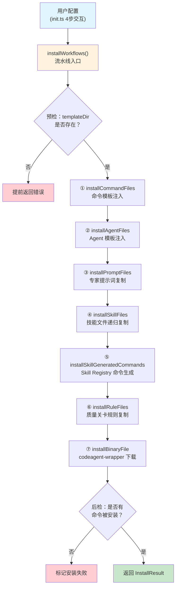
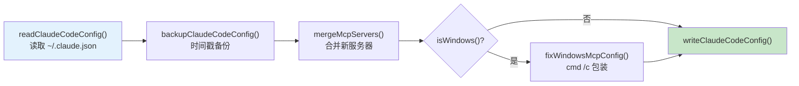

CCG 的安装器流水线是一个**编译时模板引擎**——它将用户的模型路由偏好、MCP 工具选择和平台差异，在安装阶段一次性"烘焙"到 26+ 个命令模板和 60+ 个技能文件中，实现零运行时开销的个性化配置。本文将逐层拆解这条从用户交互到文件部署的完整数据流，揭示每个阶段的设计意图与实现细节。

Sources: [installer.ts](src/utils/installer.ts#L1-L50), [installer-template.ts](src/utils/installer-template.ts#L1-L44)

## 架构全景：七阶段流水线

安装器的核心入口是 `installWorkflows()` 函数，它按照严格顺序执行七个安装步骤，每个步骤独立收集错误、互不阻塞，最终汇总为统一的 `InstallResult`：



`InstallContext` 对象贯穿整个流水线，携带三组关键数据：**安装目录路径**（`installDir`，默认 `~/.claude`）、**用户配置**（`config`，包含路由、MCP、模式选择）和**累积结果**（`result`，收集所有已安装项和错误）。

Sources: [installer.ts](src/utils/installer.ts#L67-L86), [installer.ts](src/utils/installer.ts#L659-L739)

## 用户配置收集：四步交互协议

在流水线启动之前，`init.ts` 通过四步交互式问答收集所有配置参数，这些参数决定了后续模板注入的具体内容：

| 步骤 | 交互内容 | 影响的模板变量 | 配置持久化位置 |
|------|----------|---------------|---------------|
| Step 1/4 | API 提供商选择（官方/第三方/302.AI） | 无（写入 `settings.json` 环境变量） | `~/.claude/settings.json` |
| Step 2/4 | 前端/后端主模型 + Gemini 型号 | `{{FRONTEND_PRIMARY}}`、`{{BACKEND_PRIMARY}}`、`{{GEMINI_MODEL_FLAG}}` | `~/.claude/.ccg/config.toml` |
| Step 3/4 | MCP 工具多选（ace-tool/fast-context/context7 等） | `{{MCP_SEARCH_TOOL}}`、`{{MCP_SEARCH_PARAM}}` | `~/.claude.json` |
| Step 4/4 | 性能模式（标准/轻量）+ Impeccable 开关 | `{{LITE_MODE_FLAG}}` | `~/.claude/.ccg/config.toml` |

配置收集完成后，系统构建 `ModelRouting` 对象并调用 `createDefaultConfig()` 生成完整的 TOML 配置，**先于文件安装写入磁盘**——这确保即使后续安装步骤失败，用户配置也不会丢失。

Sources: [init.ts](src/commands/init.ts#L152-L199), [init.ts](src/commands/init.ts#L564-L680), [config.ts](src/utils/config.ts#L43-L75)

## 模板变量注入引擎

模板变量注入是流水线的核心变换步骤。`injectConfigVariables()` 函数接收原始模板内容和用户配置，通过正则替换将 `{{PLACEHOLDER}}` 标记替换为实际值。这套机制将用户在安装时的选择"冻结"到每个命令文件中，使命令在被 Claude Code 加载时无需任何运行时解析。

### 变量替换清单

| 模板变量 | 替换来源 | 默认值 | 用途 |
|---------|---------|--------|------|
| `{{FRONTEND_PRIMARY}}` | `routing.frontend.primary` | `gemini` | 前端任务的后端模型名 |
| `{{BACKEND_PRIMARY}}` | `routing.backend.primary` | `codex` | 后端任务的后端模型名 |
| `{{FRONTEND_MODELS}}` | `routing.frontend.models` | `['gemini']` | 前端模型列表（JSON 数组） |
| `{{BACKEND_MODELS}}` | `routing.backend.models` | `['codex']` | 后端模型列表（JSON 数组） |
| `{{REVIEW_MODELS}}` | `routing.review.models` | `['codex','gemini']` | 审查模型列表（JSON 数组） |
| `{{ROUTING_MODE}}` | `routing.mode` | `smart` | 协作模式标识 |
| `{{GEMINI_MODEL_FLAG}}` | 动态计算 | `--gemini-model gemini-3.1-pro-preview ` | 当任一角色使用 Gemini 时注入 |
| `{{LITE_MODE_FLAG}}` | `liteMode` | ` `（空） | 轻量模式标记 |
| `{{MCP_SEARCH_TOOL}}` | MCP 提供商注册表 | `mcp__ace-tool__search_context` | MCP 检索工具全限定名 |
| `{{MCP_SEARCH_PARAM}}` | MCP 提供商注册表 | `query` | MCP 工具参数名 |

MCP 提供商的映射通过一个**注册表驱动**的设计实现——添加新的 MCP 提供商只需在 `MCP_PROVIDERS` 字典中增加一行即可：

```typescript
const MCP_PROVIDERS: Record<string, { tool: string, param: string }> = {
  'ace-tool': { tool: 'mcp__ace-tool__search_context', param: 'query' },
  'ace-tool-rs': { tool: 'mcp__ace-tool__search_context', param: 'query' },
  'contextweaver': { tool: 'mcp__contextweaver__codebase-retrieval', param: 'information_request' },
  'fast-context': { tool: 'mcp__fast-context__fast_context_search', param: 'query' },
}
```

当用户选择 `skip`（不配置 MCP）时，注入逻辑会执行一套特殊的**多步降级替换**——移除 MCP 相关的代码块、将内联引用替换为 `Glob + Grep` 的降级方案，确保命令在无 MCP 环境下仍能正常工作。

Sources: [installer-template.ts](src/utils/installer-template.ts#L64-L134), [installer-template.ts](src/utils/installer-template.ts#L50-L55)

## 路径解析与跨平台适配

模板变量注入之后，`replaceHomePathsInTemplate()` 负责将所有 `~` 开头的路径替换为绝对路径。这一步对 **Windows 兼容性至关重要**——Windows 的 Git Bash 在 heredoc 中会将反斜杠转义，因此所有路径统一使用正斜杠。

路径替换遵循**从长到短**的顺序，避免短模式提前匹配导致长模式替换失败：

1. `~/.claude/.ccg` → `$(installDir)/.ccg` 的绝对路径
2. `~/.claude/bin/codeagent-wrapper` → 绝对路径（Windows 追加 `.exe`）
3. `~/.claude/bin` → bin 目录绝对路径
4. `~/.claude` → installDir 绝对路径
5. `~/` → 用户 home 目录

`PACKAGE_ROOT` 的发现机制同样关键——`findPackageRoot()` 从当前文件位置向上遍历最多 10 层目录，寻找同时包含 `package.json` 和 `templates/` 目录的根节点。这一深度设计专门应对 Windows 上 npm 缓存的深层嵌套路径（如 `AppData\Local\npm-cache\_npx\<hash>\node_modules\...`）。

Sources: [installer-template.ts](src/utils/installer-template.ts#L144-L178), [installer-template.ts](src/utils/installer-template.ts#L17-L44)

## 命令安装：双通道策略

命令文件的安装通过两条通道完成，共同填充 `~/.claude/commands/ccg/` 目录：

### 通道一：静态命令模板

`installCommandFiles()` 遍历用户选中的所有 `workflowId`，从 `installer-data.ts` 的命令注册表中查找对应的命令定义，然后从 `templates/commands/` 目录复制对应的 `.md` 文件。每个文件经过**变量注入 → 路径替换**双重变换后写入目标位置。当源模板文件不存在时（极端情况），系统会生成一个带有 frontmatter 的占位文件，确保命令不会因缺失而静默失败。

### 通道二：Skill Registry 自动生成

`installSkillGeneratedCommands()` 扫描 `templates/skills/` 下所有包含 `user-invocable: true` frontmatter 的 `SKILL.md` 文件，为每个符合条件的技能自动生成斜杠命令。生成的命令分为两种类型：**scripted**（有 `scripts/*.js`）的技能生成 `run_skill.js` 调用命令；**knowledge**（纯知识型）的技能生成"读取 SKILL.md 并遵循指导"的指令。

两条通道通过 `existingCommandNames` 集合实现**去重**——`installer-data.ts` 中已定义的复杂多模型命令永远不会被 Skill Registry 的自动生成逻辑覆盖。

Sources: [installer.ts](src/utils/installer.ts#L217-L263), [installer.ts](src/utils/installer.ts#L438-L477), [skill-registry.ts](src/utils/skill-registry.ts#L219-L302)

## 技能文件部署与遗留迁移

技能文件的安装是最复杂的步骤之一。`installSkillFiles()` 从 `templates/skills/` 递归复制整个目录树到 `~/.claude/skills/ccg/`，然后在所有 `.md` 文件上执行路径替换。

这个步骤包含一个**遗留迁移机制**——针对 v1.7.73 之前的目录结构（`~/.claude/skills/tools/`、`~/.claude/skills/orchestration/` 等），自动将这些顶层目录移动到新的 `skills/ccg/` 命名空间下，保持向前兼容。迁移逻辑在检测到新目录不存在且旧目录存在时触发，逐项移动后继续执行正常的递归复制。

安装完成后，系统执行 **后置验证**——递归收集 `skillsDestDir` 下所有 `SKILL.md` 文件（排除根目录），如果计数为零则记录详细错误信息（包括可能的杀毒软件锁定、权限不足、路径过长等根因）。

Sources: [installer.ts](src/utils/installer.ts#L354-L429)

## 二进制下载：双源容错与版本跟踪

`codeagent-wrapper` 二进制的下载是安装流水线的最后一步。下载策略采用**双源容错**：优先尝试 Cloudflare CDN（对中国用户友好，30 秒超时），失败后回退到 GitHub Release（120 秒超时）。每个源支持最多 2 次重试，每次重试间隔递增。

下载工具同样采用双通道：优先使用 `curl`（自动读取 `HTTPS_PROXY`/`ALL_PROXY` 环境变量实现代理支持），当 curl 不可用时回退到 Node.js 原生 `fetch`。

版本跟踪机制通过 `EXPECTED_BINARY_VERSION` 常量（当前 `5.10.0`）实现。每次安装时，系统先检查已存在的二进制是否通过 `--version` 校验并且版本号匹配——只有当版本不一致或二进制损坏时才触发下载，避免不必要的网络请求。

Sources: [installer.ts](src/utils/installer.ts#L92-L171), [installer.ts](src/utils/installer.ts#L597-L653)

## MCP 配置管线与三端同步

MCP 服务器的安装独立于文件部署流水线，在 `installWorkflows()` 返回后由 `init.ts` 顺序调用。所有 MCP 安装器共享同一个 `configureMcpInClaude()` 管线函数，实现统一的 **读取 → 备份 → 合并 → Windows 修复 → 写回** 流程：



安装完成后，`syncMcpToCodex()` 和 `syncMcpToGemini()` 将 Claude 的 MCP 配置**镜像**到 Codex（`~/.codex/config.toml`，使用 TOML 格式，原子写入）和 Gemini（`~/.gemini/settings.json`，JSON 格式）。同步逻辑仅操作 CCG 管理的 6 个服务器 ID（`grok-search`、`context7`、`ace-tool`、`ace-tool-rs`、`contextweaver`、`fast-context`），用户自定义的 MCP 配置完全不受影响。

Sources: [installer-mcp.ts](src/utils/installer-mcp.ts#L21-L68), [installer-mcp.ts](src/utils/installer-mcp.ts#L286-L444)

## 全局提示词注入

当用户选择安装 `fast-context` MCP 时，`writeFastContextPrompt()` 将搜索使用指南注入到三个位置：Claude Code 的 rules 文件（`~/.claude/rules/ccg-fast-context.md`，独立文件自动加载）、Codex CLI 的全局指令（`~/.codex/AGENTS.md`，使用标记块注入）和 Gemini CLI 的全局指令（`~/.gemini/GEMINI.md`，同样使用标记块注入）。标记块机制（`<!-- CCG-FAST-CONTEXT-START -->` / `<!-- CCG-FAST-CONTEXT-END -->`）确保多次安装时内容被**幂等替换**而非重复追加。

当 fast-context 与 ace-tool 共存时，提示词自动切换为**辅助模式**——明确 ace-tool 为主检索工具，fast-context 仅在语义搜索需求未被满足时作为补充。

Sources: [installer-prompt.ts](src/utils/installer-prompt.ts#L73-L111)

## 防御性设计：三层错误捕获

安装器流水线采用了三层防御性设计来应对各种异常场景：

**第一层：预检验证**。在执行任何安装步骤之前，检查 `templateDir` 是否存在。如果 `PACKAGE_ROOT` 解析失败导致模板目录缺失，立即返回详细错误信息并建议 `npm cache clean --force` 修复——这是 Windows 上"静默安装失败"的首要根因。

**第二层：步骤级错误隔离**。每个安装步骤（命令、Agent、提示词、技能、规则、二进制）都有独立的 try-catch，单个步骤的失败不会中断后续步骤。所有错误被收集到 `result.errors` 数组中，在安装完成后统一展示。

**第三层：后置验证**。安装完成后，检查 `installedCommands` 是否为空。如果所有命令都未被安装且没有错误记录，说明发生了静默失败（可能是文件权限问题或路径异常），此时主动标记 `success = false` 并记录详细诊断信息。

Sources: [installer.ts](src/utils/installer.ts#L699-L738)

## 文件部署目录结构总览

安装完成后，用户主目录下的文件布局如下：

| 源目录 | 目标位置 | 变换方式 | 数量 |
|--------|---------|---------|------|
| `templates/commands/*.md` | `~/.claude/commands/ccg/*.md` | 变量注入 + 路径替换 | 28 个命令 |
| `templates/commands/agents/*.md` | `~/.claude/agents/ccg/*.md` | 变量注入 + 路径替换 | Agent 文件 |
| `templates/prompts/{codex,gemini,claude}/*.md` | `~/.claude/.ccg/prompts/{codex,gemini,claude}/*.md` | 路径替换 | 13+ 提示词 |
| `templates/skills/**` | `~/.claude/skills/ccg/**` | 递归复制 + 路径替换 | 60+ 技能文件 |
| `templates/rules/*.md` | `~/.claude/rules/*.md` | 路径替换 | 2 个规则文件 |
| GitHub Release 二进制 | `~/.claude/bin/codeagent-wrapper` | 直接下载 | 1 个二进制 |
| 自动生成 | `~/.claude/commands/ccg/{skill-name}.md` | Skill Registry 生成 | 按需 |
| 交互式配置 | `~/.claude/.ccg/config.toml` | TOML 序列化 | 1 个配置 |
| MCP 安装 | `~/.claude.json` | JSON 合并 | MCP 服务器 |
| MCP 同步 | `~/.codex/config.toml`、`~/.gemini/settings.json` | 镜像同步 | MCP 服务器 |

Sources: [installer.ts](src/utils/installer.ts#L712-L724), [init.ts](src/commands/init.ts#L658-L680)

## 延伸阅读

- **命令模板如何使用注入的变量**：参见 [斜杠命令体系：29+ 命令分类与模板结构](8-xie-gang-ming-ling-ti-xi-29-ming-ling-fen-lei-yu-mo-ban-jie-gou)
- **Skill Registry 的 frontmatter 规范**：参见 [Skill Registry 机制：SKILL.md Frontmatter 驱动的自动命令生成](13-skill-registry-ji-zhi-skill-md-frontmatter-qu-dong-de-zi-dong-ming-ling-sheng-cheng)
- **MCP 工具的详细配置方法**：参见 [MCP 工具集成：ace-tool、ContextWeaver、fast-context 配置与同步](18-mcp-gong-ju-ji-cheng-ace-tool-contextweaver-fast-context-pei-zhi-yu-tong-bu)
- **配置文件的 TOML 结构**：参见 [配置系统：TOML 配置文件结构与路由设置](19-pei-zhi-xi-tong-toml-pei-zhi-wen-jian-jie-gou-yu-lu-you-she-zhi)
- **二进制在多模型调用中的角色**：参见 [codeagent-wrapper 二进制：Go 进程管理与多后端调用](6-codeagent-wrapper-er-jin-zhi-go-jin-cheng-guan-li-yu-duo-hou-duan-diao-yong)