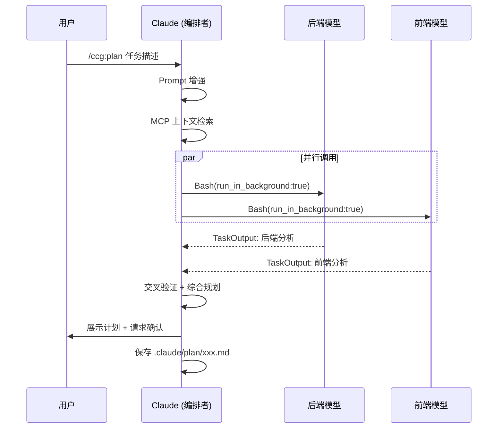

CCG 的斜杠命令体系是其多模型协作能力的直接入口——用户在 Claude Code 会话中输入 `/ccg:<command>` 即可触发预定义的协作工作流。整个体系包含 **29 个手工编写的命令模板** 和 **28 个由 SKILL.md frontmatter 自动生成的技能命令**，覆盖从全流程开发到 Git 操作、从需求研究到规范驱动实现的完整工程场景。本文将系统性地拆解命令的分类架构、模板变量注入机制、以及安装器的命令注册流程。

Sources: [installer-data.ts](src/utils/installer-data.ts#L1-L119), [skill-registry.ts](src/utils/skill-registry.ts#L1-L303)

## 命令总览：四大分类与命令矩阵

所有手工命令通过 `installer-data.ts` 中的 `cmd()` 工厂函数注册，每条命令携带唯一的 `id`、显示名称、所属分类（`CommandCategory`）和排序权重。系统将 29 条命令划分为四个职责域：**Development**（19 条）、**Init**（1 条）、**Git**（4 条）和 **Spec**（5 条）。

Sources: [installer-data.ts](src/utils/installer-data.ts#L44-L98)

### 开发类命令（Development, 19 条）

开发类命令是 CCG 的核心——每条命令都编排了 Claude 与外部模型（后端模型 + 前端模型）之间的协作流程。根据工作流的复杂度和编排模式，可进一步细分为三组：

| 命令 | 调用方式 | 编排模式 | 角色提示词数 |
|------|---------|---------|------------|
| `/ccg:workflow` | 完整6阶段 | Claude 编排 + 双模型并行 | 6（分析/规划/审查 × 2） |
| `/ccg:plan` | 规划专用 | 双模型分析 → Claude 综合 → 保存计划 | 4（分析/规划 × 2） |
| `/ccg:execute` | 执行专用 | 读取计划 → 双模型原型 → Claude 重构 | 4（实施/审查 × 2） |
| `/ccg:codex-exec` | Codex全权 | 后端模型自行搜索+实现+测试 | 2（审查 × 2） |
| `/ccg:feat` | 智能功能 | 自动判断类型 → 按需路由模型 | 8（全阶段 × 2） |
| `/ccg:frontend` | 前端专项 | 前端模型主导 + 后端参考 | 3（分析/规划/审查） |
| `/ccg:backend` | 后端专项 | 后端模型主导 + 前端参考 | 3（分析/规划/审查） |
| `/ccg:analyze` | 技术分析 | 双模型并行分析 → 交叉验证 | 2（分析 × 2） |
| `/ccg:debug` | 问题诊断 | 双模型并行诊断 → 用户确认 → 修复 | 2（调试 × 2） |
| `/ccg:optimize` | 性能优化 | 双模型分析瓶颈 → 按性价比排序 | 2（优化 × 2） |
| `/ccg:test` | 测试生成 | 智能路由：后端→后端模型，前端→前端模型 | 2（测试 × 2） |
| `/ccg:review` | 代码审查 | 双模型交叉审查（无参数=审查git diff） | 2（审查 × 2） |
| `/ccg:enhance` | Prompt增强 | Claude 单模型增强 | 0 |
| `/ccg:context` | 上下文管理 | Claude 单模型操作 | 0 |
| `/ccg:team` | Agent Teams统一 | 8阶段7角色企业级 | 4（架构/审查 × 2） |
| `/ccg:team-research` | Teams需求研究 | 双模型并行探索 → 约束集 | 2（分析 × 2） |
| `/ccg:team-plan` | Teams规划 | 双模型并行分析 → 零决策计划 | 2（分析 × 2） |
| `/ccg:team-exec` | Teams实施 | Builder teammates 并行写代码 | 0 |
| `/ccg:team-review` | Teams审查 | 双模型交叉审查 → 分级判决 | 2（审查 × 2） |

Sources: [installer-data.ts](src/utils/installer-data.ts#L47-L69), [workflow.md](templates/commands/workflow.md#L1-L189), [plan.md](templates/commands/plan.md#L1-L258)

### 其他三类命令

**初始化类（Init, 1 条）** 只包含 `/ccg:init`，用于扫描项目结构并生成根级与模块级 `CLAUDE.md` 文档，为后续所有 AI 交互提供项目上下文。其内部通过 Task 工具调用 `init-architect` 和 `get-current-datetime` 两个子智能体完成工作。

**Git 操作类（Git, 4 条）** 提供日常版本控制增强——`/ccg:commit` 分析 diff 生成 Conventional Commits 信息，`/ccg:rollback` 以 dry-run 默认模式安全回滚分支，`/ccg:clean-branches` 清理已合并/过期分支，`/ccg:worktree` 在 `../.ccg/项目名/` 目录结构下管理 Git Worktree。

**规范驱动类（Spec, 5 条）** 封装了 OpenSpec（OPSX）工具链的完整生命周期：`spec-init` 初始化 OPSX 环境并验证多模型可用性，`spec-research` 将需求转化为约束集并生成提案，`spec-plan` 消除所有歧义产出零决策计划，`spec-impl` 按规范机械执行，`spec-review` 在归档前执行双模型交叉审查。

Sources: [installer-data.ts](src/utils/installer-data.ts#L72-L97), [init.md](templates/commands/init.md#L1-L101), [commit.md](templates/commands/commit.md#L1-L152), [spec-init.md](templates/commands/spec-init.md#L1-L102)

## 命令注册与安装流程

命令的注册和安装遵循一条清晰的流水线：**声明 → 模板读取 → 变量注入 → 路径替换 → 文件部署**。以下 Mermaid 图展示了从 `installer-data.ts` 声明到最终文件落盘的完整链路：

```mermaid
flowchart TB
    subgraph 声明层
        ID[installer-data.ts<br/>29 条 cmd 声明]
        SR[skill-registry.ts<br/>28 条 SKILL.md frontmatter]
    end

    subgraph 模板层
        CMD_TPL["templates/commands/*.md<br/>29 个命令模板"]
        AGENT_TPL["templates/commands/agents/*.md<br/>7 个子智能体模板"]
        SKILL_TPL["templates/skills/**/SKILL.md<br/>28+ 技能定义"]
    end

    subgraph 注入层
        INJ[injectConfigVariables<br/>{{FRONTEND_MODELS}} 等]
        PATH[replaceHomePathsInTemplate<br/>~/→绝对路径]
    end

    subgraph 部署层
        CMD_INST["~/.claude/commands/ccg/*.md<br/>斜杠命令"]
        AGENT_INST["~/.claude/agents/ccg/*.md<br/>子智能体"]
        SKILL_INST["~/.claude/skills/ccg/**<br/>技能文件"]
    end

    ID --> CMD_TPL --> INJ --> PATH --> CMD_INST
    AGENT_TPL --> INJ --> AGENT_INST
    SR --> SKILL_TPL --> PATH --> SKILL_INST
    SKILL_INST -->|user-invocable=true| CMD_INST
```

`installCommandFiles` 函数遍历 `installer-data.ts` 中注册的每个 `workflowId`，查找对应的 `templates/commands/{id}.md` 源文件。如果源文件存在，则依次执行 `injectConfigVariables`（替换 `{{FRONTEND_PRIMARY}}` 等模板变量）和 `replaceHomePathsInTemplate`（将 `~/.claude` 替换为实际安装路径），最终写入 `~/.claude/commands/ccg/{id}.md`。如果源文件不存在，则生成一个包含 description 的占位文件，确保命令不会注册失败。

Sources: [installer.ts](src/utils/installer.ts#L226-L268), [installer-template.ts](src/utils/installer-template.ts#L60-L179)

## 模板结构：Frontmatter + 多模型调用规范

每个命令模板都是标准 Markdown 文件，由两部分组成：**YAML Frontmatter** 和**正文指令**。Frontmatter 中最重要的字段是 `description`，它被 Claude Code 用作斜杠命令的提示文本——用户输入 `/ccg:` 时看到的命令描述即来源于此。

```yaml
---
description: '多模型协作开发工作流（研究→构思→计划→执行→优化→评审），智能路由前端→{{FRONTEND_PRIMARY}}、后端→{{BACKEND_PRIMARY}}'
---
```

正文的组织遵循统一的**多模型调用规范**模式，几乎所有涉及外部模型的命令都包含以下结构化段落：

1. **工作目录声明**：强制通过 `pwd` 获取绝对路径，禁止推断
2. **调用语法模板**：`codeagent-wrapper` 的 Bash 调用格式（含新会话和 `resume` 复用两种模式）
3. **角色提示词映射表**：按阶段（分析/规划/实施/审查）和模型（后端/前端）交叉引用提示词文件路径
4. **并行调用规则**：`run_in_background: true` + `TaskOutput` 等待 + 超时轮询策略
5. **防护规则**：前端模型失败重试（最多3次）、后端模型必须等待（禁止跳过）

Sources: [workflow.md](templates/commands/workflow.md#L1-L45), [plan.md](templates/commands/plan.md#L1-L50), [execute.md](templates/commands/execute.md#L1-L50)

### 模板变量注入系统

命令模板在安装时经过 `injectConfigVariables` 函数处理，将占位符替换为用户在 `ccg init` 时选择的实际配置值。这套变量系统是命令能够在不同模型组合（Codex+Gemini、纯 Codex 等）下正常工作的关键：

| 模板变量 | 替换内容 | 示例值 |
|---------|---------|-------|
| `{{FRONTEND_MODELS}}` | 前端模型列表的 JSON 数组 | `["gemini"]` |
| `{{FRONTEND_PRIMARY}}` | 前端主模型名称 | `gemini` |
| `{{BACKEND_MODELS}}` | 后端模型列表的 JSON 数组 | `["codex"]` |
| `{{BACKEND_PRIMARY}}` | 后端主模型名称 | `codex` |
| `{{REVIEW_MODELS}}` | 审查模型列表的 JSON 数组 | `["codex","gemini"]` |
| `{{ROUTING_MODE}}` | 路由模式 | `smart` |
| `{{GEMINI_MODEL_FLAG}}` | Gemini 模型标识参数 | `--gemini-model gemini-3.1-pro-preview ` |
| `{{LITE_MODE_FLAG}}` | Lite 模式标识 | `--lite ` 或空 |
| `{{MCP_SEARCH_TOOL}}` | MCP 搜索工具名 | `mcp__ace-tool__search_context` |
| `{{MCP_SEARCH_PARAM}}` | MCP 搜索参数名 | `query` |

当 MCP 配置为 `skip` 时，系统执行多步替换——移除 MCP 相关的 JSON 片段，替换为 Glob + Grep 的降级提示。这确保了在无 MCP 环境下命令仍能正常工作。

Sources: [installer-template.ts](src/utils/installer-template.ts#L60-L145)

### 路径替换与跨平台适配

`replaceHomePathsInTemplate` 函数在变量注入之后执行，将模板中的 `~/` 路径替换为实际的绝对路径。替换遵循严格的**从长到短**顺序（先替换 `~/.claude/.ccg`，再替换 `~/.claude/bin`，最后替换 `~/.claude`），避免短模式匹配导致长路径被错误替换。在 Windows 上，路径始终使用正斜杠以确保 Git Bash 和 PowerShell 的兼容性。

Sources: [installer-template.ts](src/utils/installer-template.ts#L148-L179)

## 命令编排模式详解

从编排架构的维度看，29 条命令可以归纳为四种核心编排模式，每种模式在**模型调用方式**和**代码写入权限**上有着本质区别：

### 模式 A：Claude 编排 + 双模型并行

这是最基础也最常用的模式，被 `/ccg:workflow`、`/ccg:plan`、`/ccg:review` 等多数命令采用。Claude 作为编排者，通过 `codeagent-wrapper` 同时调用后端和前端模型，获取两者的分析/规划/审查结果后综合决策。**核心约束：外部模型对文件系统零写入权限**，所有代码修改必须由 Claude 执行。



Sources: [plan.md](templates/commands/plan.md#L1-L258), [review.md](templates/commands/review.md#L1-L138)

### 模式 B：单模型主导专项

`/ccg:frontend` 和 `/ccg:backend` 采用单模型主导模式——前端任务由前端模型（如 Gemini）全程主导分析和规划，后端模型仅作辅助参考（反之亦然）。这种模式减少了不必要的跨模型通信开销，在明确的前端/后端任务中更高效。

Sources: [frontend.md](templates/commands/frontend.md#L1-L168), [backend.md](templates/commands/backend.md#L1-L168)

### 模式 C：Agent Teams 多角色并行

`/ccg:team` 系列命令（team、team-research、team-plan、team-exec、team-review）使用了 Claude Code 的 Agent Teams 实验性功能，在单个命令中编排 7 个角色（Lead、Architect、Dev×N、QA、Reviewer + 外部模型外援）。这是唯一允许 Claude spawn 多个 teammate 并行工作的模式。关键约束是 Lead（主对话）绝不直接修改产品代码——所有编码由 Dev teammates 完成。

Sources: [team.md](templates/commands/team.md#L1-L476), [team-exec.md](templates/commands/team-exec.md#L1-L112)

### 模式 D：外部模型全权执行

`/ccg:codex-exec` 采用了一种激进的编排策略——后端模型（Codex）直接承担从 MCP 搜索到代码实现到测试验证的全部工作，Claude 仅做最终的审核和确认。这大幅降低了 Claude 的上下文消耗和 token 使用量，适合大型任务的低开销执行。

Sources: [codex-exec.md](templates/commands/codex-exec.md#L1-L412)

## 子智能体体系

除了主命令模板外，`templates/commands/agents/` 目录下还有 7 个子智能体模板，它们不作为独立斜杠命令注册，而是由主命令通过 `Task` 工具调用：

| 子智能体 | 被调用命令 | 职责 |
|---------|----------|------|
| `get-current-datetime` | `/ccg:init` | 获取当前时间戳（文档首步） |
| `init-architect` | `/ccg:init` | 扫描项目结构、生成 CLAUDE.md |
| `planner` | `/ccg:feat` | 生成功能规划文档 |
| `ui-ux-designer` | `/ccg:feat`（前端/全栈任务） | 输出 UI/UX 设计方案 |
| `team-architect` | `/ccg:team` | 代码库扫描 + 架构蓝图 |
| `team-qa` | `/ccg:team` | 写测试 + 跑测试 + lint |
| `team-reviewer` | `/ccg:team` | 综合审查 + 分级判决 |

这些子智能体模板安装到 `~/.claude/agents/ccg/` 目录，同样经过变量注入和路径替换处理。

Sources: [installer.ts](src/utils/installer.ts#L274-L285), [init.md](templates/commands/init.md#L56-L80)

## Skill Registry 自动命令生成

除了 29 个手工编写的命令，CCG 还通过 **Skill Registry** 机制自动为用户可调用的技能（`user-invocable: true`）生成斜杠命令。这套机制扫描 `templates/skills/` 下所有包含 `SKILL.md` 的目录，解析其 YAML frontmatter，为标记为 `user-invocable: true` 的技能自动在 `~/.claude/commands/ccg/` 下生成对应的 `.md` 命令文件。

当前有 28 个技能标记为 `user-invocable: true`，分布在以下类别中：

| 类别 | 数量 | 代表性命令 |
|------|------|-----------|
| **Impeccable** | 20 | `/ccg:animate`、`/ccg:polish`、`/ccg:critique`、`/ccg:harden` |
| **Tools** | 6 | `/ccg:verify-security`、`/ccg:verify-change`、`/ccg:gen-docs` |
| **Frontend Design** | 1 | `/ccg:frontend-design` |
| **Scrapling** | 1 | `/ccg:scrapling` |

自动生成的命令有两种运行时类型：**scripted**（有 `scripts/` 目录，通过 `run_skill.js` 执行脚本）和 **knowledge**（纯知识文件，Claude 读取 SKILL.md 后按指导执行）。Skill Registry 的 `installSkillCommands` 函数会跳过与手工命令同名的技能，避免冲突。

Sources: [skill-registry.ts](src/utils/skill-registry.ts#L218-L303)

## 命令间协作链路

许多命令之间存在数据传递关系，形成了清晰的**命令链**模式。最核心的链路是 **规划-执行分离模式**：

```
/ccg:plan → 保存计划至 .claude/plan/xxx.md（含 SESSION_ID）
    ↓
/ccg:execute → 读取计划 → resume SESSION_ID → 执行 + 审计
```

类似地，Agent Teams 链路和 Spec 链路也有各自的文件传递约定：

```
/ccg:team-research → .claude/team-plan/xxx-research.md（约束集）
    ↓
/ccg:team-plan → .claude/team-plan/xxx-blueprint.md（架构蓝图）
    ↓
/ccg:team-exec → 读取计划 → Builder teammates 并行实施
    ↓
/ccg:team-review → 双模型审查 + 分级判决
```

```
/ccg:spec-init → 验证环境
    ↓
/ccg:spec-research → openspec/changes/xxx/proposal.md
    ↓
/ccg:spec-plan → openspec/changes/xxx/{specs.md, design.md, tasks.md}
    ↓
/ccg:spec-impl → 按规范执行 + 多模型协作
    ↓
/ccg:spec-review → 归档前审查
```

这些链路中的每一环都是独立可用的命令——你可以单独执行 `/ccg:review` 审查代码，也可以从 `/ccg:workflow` 开始走完整个六阶段流程。命令之间的数据通过文件系统（`.claude/plan/`、`.claude/team-plan/`、`openspec/changes/`）和 SESSION_ID 会话复用机制传递。

Sources: [plan.md](templates/commands/plan.md#L220-L258), [team-research.md](templates/commands/team-research.md#L92-L127), [spec-research.md](templates/commands/spec-research.md#L104-L157)

## 统一防护规则

几乎所有涉及外部模型的命令都共享一套防护规则，这套规则在模板正文中以 `⛔` 标记的段落出现，构成命令体系的**安全护栏**：

- **前端模型失败必须重试**：非零退出码或输出包含错误信息时，最多重试 2 次（间隔 5 秒），仅当 3 次全部失败才跳过
- **后端模型结果必须等待**：执行时间 5-15 分钟属正常，`TaskOutput` 超时后继续轮询，**绝对禁止跳过**
- **用户确认不可省略**：等待超时时必须用 `AskUserQuestion` 询问用户选择继续等待还是终止，禁止直接 Kill Task
- **外部模型零写入权限**：所有文件系统修改由 Claude 执行，外部模型输出仅作为"脏原型"参考

Sources: [workflow.md](templates/commands/workflow.md#L74-L95), [execute.md](templates/commands/execute.md#L64-L85)

## 延伸阅读

- 了解六阶段工作流的具体阶段流转，参见 [六阶段开发工作流（/ccg:workflow）](9-liu-jie-duan-kai-fa-gong-zuo-liu-ccg-workflow)
- 深入理解规划与执行分离的设计哲学，参见 [规划与执行分离模式（/ccg:plan → /ccg:execute）](10-gui-hua-yu-zhi-xing-fen-chi-mo-shi-ccg-plan-ccg-execute)
- 探索 Skill Registry 的 frontmatter 解析机制，参见 [Skill Registry 机制：SKILL.md Frontmatter 驱动的自动命令生成](13-skill-registry-ji-zhi-skill-md-frontmatter-qu-dong-de-zi-dong-ming-ling-sheng-cheng)
- 了解 codeagent-wrapper 如何调用后端模型，参见 [codeagent-wrapper 二进制：Go 进程管理与多后端调用](6-codeagent-wrapper-er-jin-zhi-go-jin-cheng-guan-li-yu-duo-hou-duan-diao-yong)