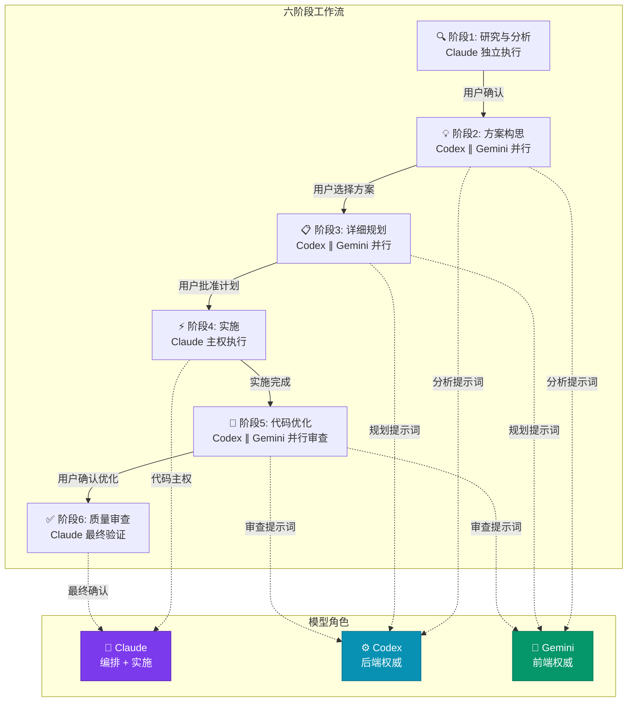
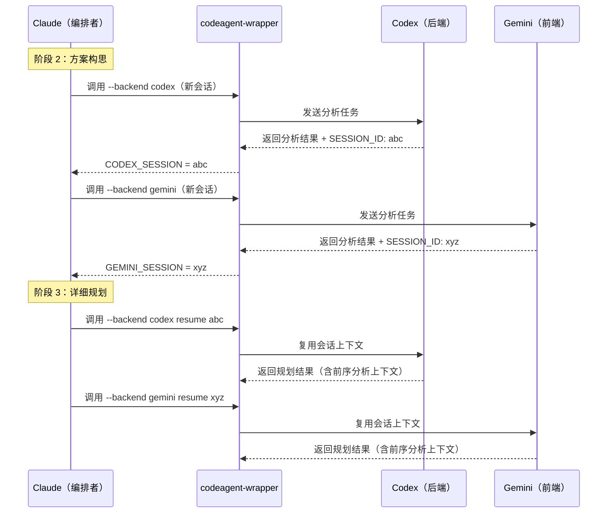

`/ccg:workflow` 是 CCG 系统中的**端到端全流程命令**，一条指令即可自动跑完 **研究 → 构思 → 计划 → 执行 → 优化 → 评审** 六个阶段。它适用于"从头到尾全包"的场景——用户不需要操心中间过程，只需在每个阶段节点做一次确认。系统会在每个阶段完成后暂停，等待用户审批后方可流转，确保对最终产出的完全掌控。对于大型任务或希望更细粒度控制的场景，推荐使用分步命令：先用 [规划与执行分离模式（/ccg:plan → /ccg:execute）](10-gui-hua-yu-zhi-xing-fen-chi-mo-shi-ccg-plan-ccg-execute) 手动审查计划，再用对应执行命令实施。

Sources: [workflow.md](templates/commands/workflow.md#L1-L189), [workflows.md](docs/guide/workflows.md#L96-L103), [installer-data.ts](src/utils/installer-data.ts#L43)

## 整体架构：三模型协作的编排模式

`/ccg:workflow` 的核心设计思想是**分工明确的三角协作**：Claude 担任编排者（Orchestrator），负责流程控制、计划综合与代码实施；后端模型（默认 Codex）负责后端逻辑、算法与架构分析；前端模型（默认 Gemini）负责 UI/UX 设计与前端实现。三方通过 `codeagent-wrapper` 二进制进行进程隔离调用，所有外部模型的输出仅作为"顾问意见"，**所有文件修改权始终归属 Claude**——这是系统中最核心的代码主权（Code Sovereignty）原则。

Sources: [workflow.md](templates/commands/workflow.md#L24-L29), [workflow.md](templates/commands/workflow.md#L186-L188)



### 三方角色与信任边界

| 角色 | 模型 | 职责范围 | 信任等级 |
|------|------|---------|---------|
| **编排者** | Claude | 流程控制、计划综合、代码实施、文件修改 | 全权执行者 |
| **后端权威** | Codex（默认） | 后端逻辑、算法、架构分析、安全审查 | 后端意见为准 |
| **前端权威** | Gemini（默认） | UI/UX 设计、前端实现、可访问性审查 | 前端意见为准 |

这个信任边界的关键规则是：**后端逻辑以 Codex 的意见为准，前端设计以 Gemini 的意见为准**。当两个模型产生分歧时，Claude 依据"领域权威"原则进行裁决——而非简单投票或取平均值。三方模型的具体配置由安装时的 `config.toml` 路由设置决定，后端和前端的主模型可通过配置替换。

Sources: [workflow.md](templates/commands/workflow.md#L24-L29), [config.ts](src/utils/config.ts#L77-L95), [installer-template.ts](src/utils/installer-template.ts#L64-L134)

## 快速开始

使用 `/ccg:workflow` 只需一条命令，将任务描述作为参数传入即可启动：

```bash
/ccg:workflow 实现完整的用户认证，注册、登录、JWT
```

系统会自动进入阶段 1（研究与分析），并在每个阶段完成后请求用户确认。评分低于 7 分或用户未批准时**强制停止**——这是工作流中的"止损机制"，确保质量不达标的中间产物不会流入下一阶段。

Sources: [workflow.md](templates/commands/workflow.md#L9-L13), [workflow.md](templates/commands/workflow.md#L103-L108)

## 六阶段详解

### 阶段 1：🔍 研究与分析

**模式标签**：`[模式：研究]` | **执行者**：Claude 独立完成

阶段 1 是整个工作流的"理解地基"阶段，Claude 在此阶段完成三项关键任务：

**1. Prompt 增强**——系统会首先分析用户输入的意图、缺失信息和隐含假设，将模糊的原始需求补全为结构化任务描述。增强过程遵循"补全而非改变"的原则，输出包含四个维度：明确目标、技术约束、范围边界、验收标准。增强后的结果将替代原始 `$ARGUMENTS`，作为后续所有阶段的统一输入。这一步骤等价于独立调用 `/ccg:enhance` 命令。

**2. 上下文检索**——通过 MCP 搜索工具（默认为 `ace-tool` 的 `search_context`）检索项目代码库中与需求相关的上下文信息。MCP 工具在安装时通过模板变量 `{{MCP_SEARCH_TOOL}}` 注入，支持四种后端：`ace-tool`、`ace-tool-rs`、`contextweaver`、`fast-context`。当 MCP 不可用时，自动回退到 `Glob + Grep` 文件发现模式。

**3. 需求完整性评分**——对需求进行 0-10 分的量化评估，评分维度如下：

| 维度 | 分值 | 判断标准 |
|------|------|---------|
| 目标明确性 | 0-3 | 需要实现什么功能、解决什么问题 |
| 预期结果 | 0-3 | 完成后的可验证产出是什么 |
| 边界范围 | 0-2 | 做什么、不做什么 |
| 约束条件 | 0-2 | 技术栈、性能要求、兼容性等 |

**≥7 分**自动进入阶段 2；**<7 分**强制停止并向用户提出补充问题。这一机制确保进入构思阶段的需求足够清晰，避免后期返工。

Sources: [workflow.md](templates/commands/workflow.md#L115-L123), [enhance.md](templates/commands/enhance.md#L1-L65), [installer-template.ts](src/utils/installer-template.ts#L50-L131)

### 阶段 2：💡 方案构思

**模式标签**：`[模式：构思]` | **执行者**：Codex ∥ Gemini 并行分析

阶段 2 是工作流中首次引入多模型并行协作的阶段。Claude 同时发起两个后台任务，分别调用后端模型和前端模型进行分析：

- **后端模型**使用 `analyzer` 角色提示词，关注技术可行性、架构影响、性能考量、潜在风险
- **前端模型**使用 `analyzer` 角色提示词，关注 UI/UX 可行性、用户体验、视觉设计

两个模型通过 `codeagent-wrapper` 的 `--backend` 参数指定后端类型，使用 `run_in_background: true` 实现真正的并行执行。Claude 通过 `TaskOutput` 工具等待双方结果返回（最大超时 600 秒），随后进行**交叉验证**：识别一致观点（强信号）、分歧点（需权衡）、互补优势。

**关键机制——会话复用（SESSION_ID）**：每次调用 `codeagent-wrapper` 都会返回一个 `SESSION_ID`，阶段 2 产出的 `CODEX_SESSION` 和 `GEMINI_SESSION` 必须保存，供阶段 3 通过 `resume` 命令复用上下文，避免重复分析带来的 token 浪费。

最终产出为**至少 2 个方案的对比**，由用户选择后进入阶段 3。

Sources: [workflow.md](templates/commands/workflow.md#L125-L137), [workflow.md](templates/commands/workflow.md#L76-L97)

### 阶段 3：📋 详细规划

**模式标签**：`[模式：计划]` | **执行者**：Codex ∥ Gemini 并行规划

阶段 3 在阶段 2 的方案基础上进行详细的技术规划。两个模型**复用阶段 2 的会话**（通过 `resume <SESSION_ID>`），各自切换到 `architect` 角色提示词进行深度规划：

- **后端模型**使用 `architect` 提示词，输出后端架构设计、数据流、边界条件、错误处理策略
- **前端模型**使用 `architect` 提示词，输出前端架构设计、信息架构、交互设计、视觉一致性方案

Claude 采纳后端模型的后端规划 + 前端模型的前端规划，综合为一份**完整的 Step-by-step 实施计划**。用户批准后，计划存入 `.claude/plan/<任务名>.md` 文件。这份计划文件也是 [规划与执行分离模式（/ccg:plan → /ccg:execute）](10-gui-hua-yu-zhi-xing-fen-chi-mo-shi-ccg-plan-ccg-execute) 中 `/ccg:execute` 的输入。

Sources: [workflow.md](templates/commands/workflow.md#L139-L151)

### 阶段 4：⚡ 实施

**模式标签**：`[模式：执行]` | **执行者**：Claude 主权执行

阶段 4 是工作流中**唯一实际修改文件的阶段**。Claude 严格按照阶段 3 批准的计划实施代码变更。此处有一个关键的架构约束：**外部模型对文件系统零写入权限**——所有文件修改操作（Edit、Write 工具）都由 Claude 亲自执行。即使外部模型在之前阶段输出了代码建议，那些建议也只是"顾问意见"，Claude 需要理解、重构后再应用。

实施过程中，Claude 遵循以下原则：

- 严格按批准的计划步骤实施，不自行扩展范围
- 遵循项目现有代码规范和风格
- 在关键里程碑处请求用户反馈

Sources: [workflow.md](templates/commands/workflow.md#L153-L159)

### 阶段 5：🚀 代码优化

**模式标签**：`[模式：优化]` | **执行者**：Codex ∥ Gemini 并行审查

阶段 5 对阶段 4 产出的代码进行多模型并行审查。与阶段 2 的"分析"不同，此处两个模型使用 `reviewer` 角色提示词，各自关注不同的质量维度：

| 审查模型 | 关注维度 | 审查焦点 |
|---------|---------|---------|
| **后端模型** | 安全性、性能、错误处理 | SQL 注入、竞态条件、资源泄漏、异常处理 |
| **前端模型** | 可访问性、设计一致性 | ARIA 标签、响应式布局、视觉一致性、交互流畅度 |

审查结果整合后，Claude 按信任规则权衡修复优先级，用户确认后执行优化。

Sources: [workflow.md](templates/commands/workflow.md#L161-L169)

### 阶段 6：✅ 质量审查

**模式标签**：`[模式：评审]` | **执行者**：Claude 最终验证

阶段 6 是工作流的收尾阶段，Claude 进行四项最终验证：

1. **计划对照检查**——逐一核对阶段 3 计划中的每项任务是否已完成
2. **测试运行**——执行项目既有的 lint、typecheck、tests 验证功能完整性
3. **问题报告**——汇总所有未解决的问题与后续建议
4. **用户确认**——请求最终审批，工作流结束

Sources: [workflow.md](templates/commands/workflow.md#L171-L181)

## 多模型调用规范详解

### codeagent-wrapper 调用语法

工作流中所有外部模型调用都通过 `codeagent-wrapper` 二进制发起。该二进制由 Go 编写，负责进程管理、超时控制和流式输出解析。模板中定义了两种调用模式：

```bash
# 新会话调用（阶段 2 首次分析时使用）
~/.claude/bin/codeagent-wrapper --progress --backend codex - "/project/path" <<'EOF'
ROLE_FILE: ~/.claude/.ccg/prompts/codex/analyzer.md
<TASK>
需求：实现用户认证功能
上下文：项目使用 Express + PostgreSQL
</TASK>
OUTPUT: 技术可行性分析 + 方案建议
EOF

# 复用会话调用（阶段 3 规划时使用，resume 保持上下文）
~/.claude/bin/codeagent-wrapper --progress --backend codex resume <SESSION_ID> - "/project/path" <<'EOF'
ROLE_FILE: ~/.claude/.ccg/prompts/codex/architect.md
<TASK>
需求：基于之前的分析，制定详细实施计划
</TASK>
OUTPUT: Step-by-step plan with pseudo-code
EOF
```

安装器在部署时会将模板变量（`{{BACKEND_PRIMARY}}`、`{{FRONTEND_PRIMARY}}`、`{{WORKDIR}}` 等）替换为用户配置的实际值，并将 `~` 路径解析为绝对路径以保证跨平台兼容性。

Sources: [workflow.md](templates/commands/workflow.md#L33-L72), [installer-template.ts](src/utils/installer-template.ts#L64-L134), [installer-template.ts](src/utils/installer-template.ts#L144-L178)

### 角色提示词映射

不同阶段和不同模型使用不同的角色提示词，形成一套完整的"专家系统"。提示词文件在安装时部署到 `~/.claude/.ccg/prompts/` 目录下：

| 阶段 | 后端模型提示词 | 前端模型提示词 |
|------|--------------|--------------|
| 分析（阶段 2） | `prompts/codex/analyzer.md` | `prompts/gemini/analyzer.md` |
| 规划（阶段 3） | `prompts/codex/architect.md` | `prompts/gemini/architect.md` |
| 审查（阶段 5） | `prompts/codex/reviewer.md` | `prompts/gemini/reviewer.md` |

Sources: [workflow.md](templates/commands/workflow.md#L76-L81), [templates/prompts](templates/prompts)

### 容错与重试机制

工作流定义了严格的容错规则，确保模型调用失败不会导致整个工作流崩溃：

| 场景 | 处理策略 |
|------|---------|
| **前端模型失败** | 最多重试 2 次（间隔 5 秒），仅当 3 次全部失败时才跳过前端模型结果 |
| **后端模型超时** | TaskOutput 超时后继续轮询，**绝对禁止**跳过或 Kill 进程 |
| **10 分钟仍未完成** | 继续用 `TaskOutput` 轮询，或询问用户选择 |
| **任意模型被跳过** | 必须通过 `AskUserQuestion` 询问用户决定，禁止直接 Kill |

后端模型被赋予更高的优先级——其结果"必须等待"，因为后端分析通常耗时 5-15 分钟属于正常范围，且其产出是架构决策的关键依据。前端模型则有重试容错机制，因为前端分析相对快速，重试成本低。

Sources: [workflow.md](templates/commands/workflow.md#L86-L98)

## 会话复用机制（SESSION_ID）

会话复用是六阶段工作流中减少 token 消耗的核心优化手段。其工作原理如下：



通过 `resume <SESSION_ID>` 语法，后端模型可以在阶段 3 的规划中直接引用阶段 2 的分析结论，无需重新读取代码库或重复推理。这不仅节省了大量 token，还保证了前后阶段的分析一致性。

Sources: [workflow.md](templates/commands/workflow.md#L80-L82), [workflow.md](templates/commands/workflow.md#L130-L137)

## 质量关卡与自动触发

六阶段工作流内置了 CCG 系统的质量关卡机制。在阶段 4（实施）产生代码变更后，系统会根据变更规模自动触发质量验证：

| 触发条件 | 自动执行的质量关卡 |
|---------|-----------------|
| 新模块创建 | `gen-docs` → `verify-module` → `verify-security` |
| 代码变更 > 30 行 | `verify-change` → `verify-quality` |
| 安全相关变更 | `verify-security` |
| 重构操作 | `verify-change` → `verify-quality` → `verify-security` |

质量关卡采用**非阻塞**模式——产生报告但不阻止交付，仅当发现 `Critical` 或 `High` 级别问题时才要求修复。这些关卡与工作流的阶段 5（优化）和阶段 6（评审）自然衔接，形成了双重保障。

Sources: [ccg-skills.md](templates/rules/ccg-skills.md#L1-L57)

## 沟通守则与阶段流转控制

工作流定义了严格的阶段流转规则，确保过程的可控性和可审计性：

1. **模式标签声明**——每个阶段的响应以 `[模式：X]` 标签开始，使用户和系统都能明确当前所处阶段
2. **严格顺序流转**——阶段顺序为 `研究 → 构思 → 计划 → 执行 → 优化 → 评审`，不可跳过（除非用户明确指令）
3. **阶段门控**——每个阶段完成后必须请求用户确认，评分低于 7 分或用户未批准时**强制停止**
4. **交互式确认**——需要用户决策时优先使用 `AskUserQuestion` 工具，而非等待自由文本输入

Sources: [workflow.md](templates/commands/workflow.md#L100-L108), [workflow.md](templates/commands/workflow.md#L184-L188)

## 与其他工作流的对比

| 特性 | /ccg:workflow | /ccg:plan → /ccg:execute | /ccg:team-* 系列 |
|------|-------------|-------------------------|-----------------|
| **阶段数** | 6 阶段全自动 | 2 步手动衔接 | 4 步（research/plan/exec/review） |
| **上下文管理** | 连续对话，全程累积 | plan 产出文件，execute 读取 | 每步 /clear，通过文件传递状态 |
| **用户参与度** | 每阶段确认 | 仅在 plan/execute 交界确认 | 每步确认 |
| **适用场景** | 中等复杂度，全包交付 | 大型任务，需审查计划 | 3+ 模块并行开发 |
| **Token 消耗** | 高（全程累积） | 中（可分步控制） | 低（每步清理上下文） |

Sources: [workflows.md](docs/guide/workflows.md#L1-L103)

## 相关阅读

- [斜杠命令体系：29+ 命令分类与模板结构](8-xie-gang-ming-ling-ti-xi-29-ming-ling-fen-lei-yu-mo-ban-jie-gou)——了解所有命令的全局分类
- [规划与执行分离模式（/ccg:plan → /ccg:execute）](10-gui-hua-yu-zhi-xing-fen-chi-mo-shi-ccg-plan-ccg-execute)——大型任务的推荐替代方案
- [模型路由机制：前端/后端模型配置与智能调度](5-mo-xing-lu-you-ji-zhi-qian-duan-hou-duan-mo-xing-pei-zhi-yu-zhi-neng-diao-du)——理解模型选择的配置原理
- [codeagent-wrapper 二进制：Go 进程管理与多后端调用](6-codeagent-wrapper-er-jin-zhi-go-jin-cheng-guan-li-yu-duo-hou-duan-diao-yong)——深入了解底层进程管理机制
- [质量关卡自动触发规则与验证链](15-zhi-liang-guan-qia-zi-dong-hong-fa-gui-ze-yu-yan-zheng-lian)——质量验证的完整规则体系