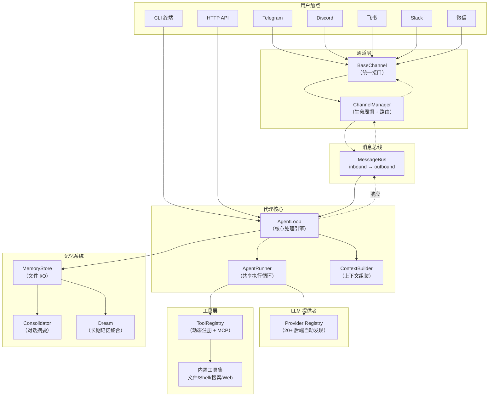

本文档是 nanobot 项目的全景式概览——你将了解 nanobot 是什么、它解决什么问题、核心架构如何运作，以及各个子系统之间的协作关系。无论你是想快速上手部署一个个人 AI 助手，还是打算深入源码进行二次开发，这里都是最佳起点。

Sources: [README.md](README.md#L1-L20), [pyproject.toml](pyproject.toml#L1-L18)

## nanobot 是什么

**nanobot** 是一个超轻量级的个人 AI Agent 框架，灵感来源于 [OpenClaw](https://github.com/openclaw/openclaw)，以不到后者 1% 的代码量实现了完整的 Agent 核心功能。项目由香港大学数据科学实验室（HKUDS）维护，采用 MIT 许可证开源，要求 Python ≥ 3.11。

nanobot 的设计哲学可以概括为四个关键词：

| 特性 | 描述 |
|------|------|
| 🪶 **超轻量** | 极简代码实现，专注于稳定、长时间运行的 AI Agent |
| 🔬 **研究友好** | 干净可读的代码结构，便于理解、修改和扩展 |
| ⚡ **极速启动** | 最小化依赖和资源占用，启动快、迭代快 |
| 💎 **开箱即用** | 一键部署，交互式引导向导帮你完成初始配置 |

nanobot 的定位不是通用聊天机器人框架，而是一个**个人化的、可持续运行的智能代理**——它能连接你最常用的聊天平台，记住你的偏好和历史对话，自主调用工具完成任务，并且通过定时任务和心跳机制实现 7×24 小时不间断服务。

Sources: [README.md](README.md#L16-L20), [README.md](README.md#L97-L106)

## 核心架构：消息总线驱动的通道-代理模型

nanobot 的架构遵循一个清晰的设计原则：**通道（Channel）与代理（Agent）通过消息总线（MessageBus）完全解耦**。这意味着无论用户从 Telegram、Discord、飞书还是命令行发起对话，消息处理流程都是统一的。



这个架构的核心数据流是一个简洁的循环：

1. **通道层**接收来自聊天平台的消息，封装为 `InboundMessage` 并推入消息总线的入站队列
2. **AgentLoop** 从入站队列消费消息，通过 `ContextBuilder` 组装上下文（系统提示词 + 历史记录 + 记忆 + 技能），然后交给 `AgentRunner` 执行
3. **AgentRunner** 调用 LLM 提供者获取响应，如果响应包含工具调用则执行工具并循环，直到获得最终文本回复
4. 最终回复封装为 `OutboundMessage` 推入出站队列，由 `ChannelManager` 路由回对应通道

Sources: [bus/queue.py](nanobot/bus/queue.py#L8-L44), [bus/events.py](nanobot/bus/events.py#L1-L39), [channels/base.py](nanobot/channels/base.py#L15-L182), [agent/loop.py](nanobot/agent/loop.py#L149-L200), [agent/runner.py](nanobot/agent/runner.py#L83-L100)

## 项目目录结构速览

```
nanobot/                         # 核心源码包
├── agent/                       # Agent 核心
│   ├── loop.py                  # 主循环：消息处理引擎
│   ├── runner.py                # 共享执行循环：LLM 调用 + 工具执行
│   ├── context.py               # 上下文构建器：系统提示词组装
│   ├── hook.py                  # 生命周期 Hook 机制
│   ├── memory.py                # 记忆系统：Store + Consolidator + Dream
│   ├── subagent.py              # 子代理：后台任务派发
│   ├── skills.py                # 技能加载器
│   └── tools/                   # 工具集
│       ├── registry.py          # 工具注册表
│       ├── filesystem.py        # 文件操作（读/写/编辑/列表）
│       ├── shell.py             # Shell 命令执行
│       ├── web.py               # Web 搜索 + 抓取
│       ├── search.py            # 文件搜索（glob/grep）
│       ├── mcp.py               # MCP 协议集成
│       ├── cron.py              # 定时任务工具
│       ├── message.py           # 消息发送工具
│       ├── spawn.py             # 子代理派发工具
│       └── sandbox.py           # Bubblewrap 沙箱隔离
├── bus/                         # 消息总线
│   ├── queue.py                 # 异步消息队列
│   └── events.py                # 事件类型定义
├── channels/                    # 聊天通道（15+ 平台）
│   ├── base.py                  # BaseChannel 抽象接口
│   ├── manager.py               # 通道管理器
│   ├── registry.py              # 通道自动发现
│   ├── telegram.py / discord.py / slack.py
│   ├── feishu.py / dingtalk.py / wecom.py
│   ├── weixin.py / whatsapp.py / qq.py
│   ├── email.py / matrix.py / mochat.py
│   └── ...
├── providers/                   # LLM 提供者（20+ 后端）
│   ├── base.py                  # LLMProvider 抽象基类
│   ├── registry.py              # 提供者注册表
│   ├── openai_compat_provider.py
│   ├── anthropic_provider.py
│   ├── azure_openai_provider.py
│   ├── github_copilot_provider.py
│   └── ...
├── config/                      # 配置系统
│   ├── schema.py                # Pydantic 配置模型
│   ├── loader.py                # 配置加载 + 环境变量插值
│   └── paths.py                 # 路径约定
├── session/                     # 会话管理
│   └── manager.py               # 对话历史 + 消息边界管理
├── cron/                        # 定时任务
│   ├── service.py               # 调度服务
│   └── types.py                 # 任务类型定义
├── heartbeat/                   # 心跳服务
│   └── service.py               # 周期性任务检查
├── security/                    # 安全模块
│   └── network.py               # 网络安全（SSRF 防护）
├── api/                         # HTTP API
│   └── server.py                # OpenAI 兼容接口
├── cli/                         # 命令行界面
│   ├── commands.py              # CLI 命令定义
│   ├── onboard.py               # 交互式引导向导
│   └── stream.py                # 终端流式渲染
├── skills/                      # 内置技能
│   ├── github/ weather/ summarize/
│   ├── memory/ cron/ tmux/
│   ├── clawhub/ skill-creator/
│   └── ...
├── templates/                   # Jinja2 提示词模板
│   ├── SOUL.md USER.md TOOLS.md
│   └── agent/ memory/
├── utils/                       # 通用工具
│   ├── helpers.py               # 辅助函数
│   ├── gitstore.py              # Git 存储后端
│   └── ...
└── nanobot.py                   # Python SDK 门面类
```

Sources: [__init__.py](nanobot/__init__.py#L1-L11), [__main__.py](nanobot/__main__.py#L1-L9)

## 五大子系统纵览

### 1. Agent 核心

**AgentLoop** 是整个系统的心脏——它从消息总线消费入站消息，协调上下文构建、LLM 调用、工具执行、会话持久化和记忆整合的完整流程。**AgentRunner** 则是被 AgentLoop 和 SubagentManager 共享的纯执行引擎，负责"调用 LLM → 检查工具调用 → 执行工具 → 再调用 LLM"的迭代循环，内含上下文压缩、历史裁剪和令牌预算管理等关键策略。两者通过 **AgentHook** 生命周期钩子实现可扩展的定制，Hook 系统采用 **CompositeHook** 模式确保自定义 Hook 的错误不会波及核心流程。

Sources: [agent/loop.py](nanobot/agent/loop.py#L149-L200), [agent/runner.py](nanobot/agent/runner.py#L83-L100), [agent/hook.py](nanobot/agent/hook.py#L29-L96)

### 2. 通道层

所有聊天平台通过统一的 **BaseChannel** 抽象接口接入。每个通道实现 `start()`、`stop()`、`send()` 三个核心方法，以及可选的 `send_delta()` 以支持流式输出。**ChannelManager** 负责通道的初始化、启停管理和出站消息路由，并内置了增量消息合并（delta coalescing）和指数退避重试机制。通道发现采用 `pkgutil` 扫描内置模块 + `entry_points` 加载外部插件的混合策略。

| 内置通道 | 类型 |
|---------|------|
| Telegram / Discord / Slack | 国际主流 IM |
| 飞书 / 钉钉 / 企业微信 | 国内办公平台 |
| 微信 / QQ | 国内社交平台 |
| WhatsApp / Matrix / Email | 其他平台 |

Sources: [channels/base.py](nanobot/channels/base.py#L15-L182), [channels/manager.py](nanobot/channels/manager.py#L20-L110), [channels/registry.py](nanobot/channels/registry.py#L1-L72)

### 3. LLM Provider 体系

nanobot 的 Provider 系统基于一个声明式注册表（**ProviderSpec**），通过模型名称关键词自动匹配后端。添加一个新的 LLM 提供者只需两步：在 `PROVIDERS` 注册表中添加一条 `ProviderSpec`，并在 `ProvidersConfig` 中添加对应字段。系统支持五种后端类型：OpenAI 兼容（`openai_compat`）、Anthropic 原生、Azure OpenAI、OpenAI Codex（OAuth）和 GitHub Copilot（OAuth），覆盖了从主流云服务到本地部署（Ollama、vLLM）的 20 余种提供者。

Sources: [providers/registry.py](nanobot/providers/registry.py#L1-L76), [providers/base.py](nanobot/providers/base.py#L80-L154)

### 4. 记忆系统

记忆采用**分层文件存储**设计，所有数据持久化为 Markdown 和 JSONL 文件，无需数据库：

| 文件 | 用途 |
|------|------|
| `SOUL.md` | Agent 的身份与人格定义 |
| `USER.md` | 用户偏好与个人信息 |
| `MEMORY.md` | 长期事实记忆（由 Dream 维护） |
| `history.jsonl` | 完整对话历史（JSONL 格式） |
| `AGENTS.md` | Agent 的行为准则 |
| `TOOLS.md` | 工具使用指南 |

**Consolidator** 负责在上下文窗口接近满时压缩历史对话为摘要，**Dream** 则是一个两阶段的长期记忆整合过程——在定时调度下，先分析未处理的对话历史提取关键事实，再通过 Agent 循环将这些事实整合到 `MEMORY.md` 中。所有核心记忆文件通过 **GitStore** 实现版本化管理，确保记忆变更可追溯。

Sources: [agent/memory.py](nanobot/agent/memory.py#L1-L60), [agent/context.py](nanobot/agent/context.py#L17-L63)

### 5. 工具与技能系统

nanobot 的工具集覆盖了 Agent 常用的操作领域：

| 工具 | 功能 |
|------|------|
| `read_file` / `write_file` / `edit_file` / `list_dir` | 文件系统操作 |
| `exec` | Shell 命令执行（可选 Bubblewrap 沙箱隔离） |
| `web_search` / `web_fetch` | 网络搜索与页面抓取 |
| `glob` / `grep` | 文件搜索与内容检索 |
| `spawn` | 子代理派发（后台任务） |
| `cron` | 定时任务管理 |
| `message` | 向通道发送消息 |

通过 **MCP（模型上下文协议）** 集成，nanobot 可以动态发现和使用外部工具服务器提供的工具，无需修改代码。**技能系统**（Skills）则通过 `SKILL.md` 文件以自然语言定义 Agent 的能力边界和使用方法，支持内置技能（GitHub、天气、摘要等）和工作区自定义技能的分层加载。

Sources: [agent/tools/registry.py](nanobot/agent/tools/registry.py#L8-L111), [agent/skills.py](nanobot/agent/skills.py#L23-L108)

## 编程接口与部署模式

nanobot 提供三种使用模式：

**CLI 模式**——最直接的交互方式，通过 `nanobot chat` 启动终端对话，支持流式 Markdown 渲染、命令历史和工具提示显示。

**Gateway 模式**——通过 `nanobot gateway` 启动完整的网关服务，同时运行所有启用的聊天通道、定时任务和心跳服务，适合 7×24 小时长期运行。

**编程接口**——包括 **Python SDK**（`Nanobot` 门面类）和 **OpenAI 兼容 HTTP API**（`/v1/chat/completions`），方便集成到其他应用中：

```python
from nanobot import Nanobot

bot = Nanobot.from_config()
result = await bot.run("帮我总结这个项目的技术架构")
print(result.content)
```

部署方面，nanobot 提供了 Docker 镜像（含 WhatsApp Node.js 桥接）、docker-compose 编排模板，以及 Linux systemd 服务单元，支持多实例并行运行。

Sources: [nanobot.py](nanobot/nanobot.py#L23-L114), [api/server.py](nanobot/api/server.py#L1-L30), [cli/commands.py](nanobot/cli/commands.py#L59-L67), [docker-compose.yml](docker-compose.yml#L1-L56), [Dockerfile](Dockerfile#L1-L51)

## 推荐阅读路径

根据你的目标，建议按以下路径继续探索文档：

1. **快速上手** → [快速上手：安装、初始化与首次对话](2-kuai-su-shang-shou-an-zhuang-chu-shi-hua-yu-shou-ci-dui-hua) — 从安装到第一次对话的完整实操指南
2. **配置深入** → [交互式引导向导与多实例配置](3-jiao-hu-shi-yin-dao-xiang-dao-yu-duo-shi-li-pei-zhi) — 向导使用和多实例管理
3. **架构理解** → [整体架构：消息总线驱动的通道-代理模型](4-zheng-ti-jia-gou-xiao-xi-zong-xian-qu-dong-de-tong-dao-dai-li-mo-xing) — 深入理解系统设计
4. **核心循环** → [Agent 主循环与工具调用生命周期](5-agent-zhu-xun-huan-yu-gong-ju-diao-yong-sheng-ming-zhou-qi) — 理解消息处理的核心流程

如果你希望全面了解系统的各个维度，可以按照目录中「深入解析」部分的顺序依次阅读。