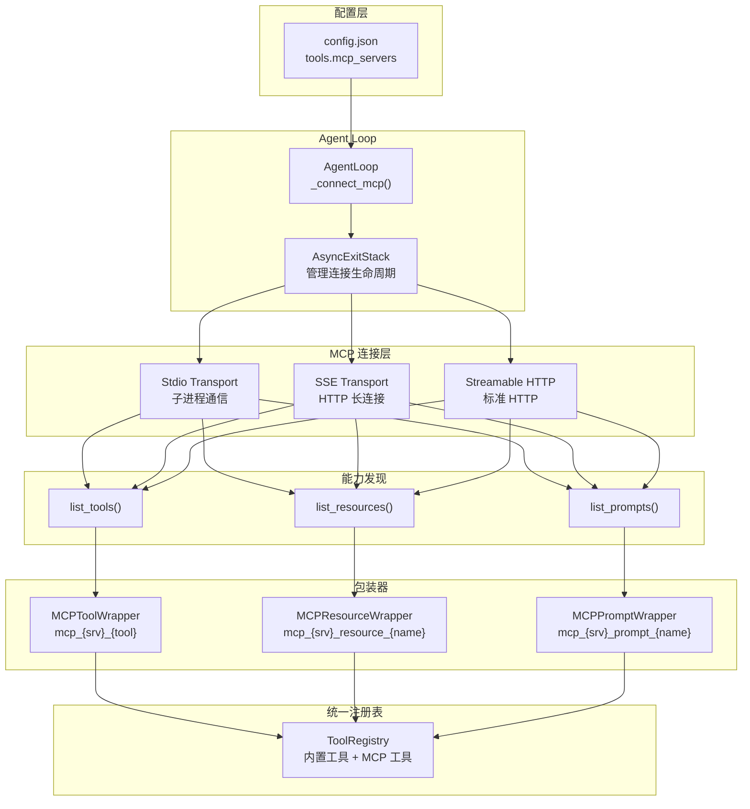
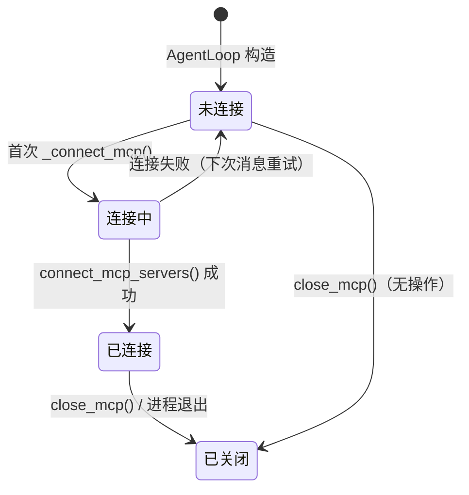

nanobot 通过 **MCP（Model Context Protocol）** 实现与外部工具服务器的动态集成，使 Agent 能够在运行时发现并调用由第三方进程或远程端点暴露的工具、资源和提示模板。本文将深入解析 MCP 的配置模型、连接生命周期、三类能力包装器（Tool / Resource / Prompt）的实现机制，以及 JSON Schema 归一化与错误容错策略，帮助你理解 nanobot 如何将异构 MCP 服务无缝融入统一的工具注册表体系。

Sources: [mcp.py](nanobot/agent/tools/mcp.py#L1-L2), [schema.py](nanobot/config/schema.py#L180-L199)

## 架构总览：MCP 在 nanobot 中的位置

在 nanobot 的整体架构中，MCP 集成位于 **工具层** 和 **Agent Loop** 之间。配置文件中的 `tools.mcp_servers` 字段定义了外部 MCP 服务器的连接参数，Agent Loop 启动时通过惰性连接机制（lazy connect）建立会话，并将远程发现的所有能力注册为本地 `Tool` 实例。这些实例与内置工具（文件系统、Shell、Web 搜索等）共存于同一个 `ToolRegistry`，对 LLM 而言完全透明。



Sources: [loop.py](nanobot/agent/loop.py#L289-L309), [mcp.py](nanobot/agent/tools/mcp.py#L309-L316)

## 配置模型：MCPServerConfig

每个 MCP 服务器通过 `MCPServerConfig` 进行配置，它是 `ToolsConfig` 的子字段，以字典形式支持多服务器并行连接。nanobot 支持三种传输协议，并通过简单的启发式规则自动推断传输类型——当 `type` 字段未显式设置时，有 `command` 的配置使用 stdio，有 `url` 且以 `/sse` 结尾的使用 SSE，其余 HTTP 端点使用 Streamable HTTP。

| 字段 | 类型 | 默认值 | 说明 |
|------|------|--------|------|
| `type` | `"stdio" \| "sse" \| "streamableHttp" \| None` | `None` | 传输协议类型，省略时自动推断 |
| `command` | `str` | `""` | stdio 模式：要执行的命令（如 `"npx"`） |
| `args` | `list[str]` | `[]` | stdio 模式：命令参数列表 |
| `env` | `dict[str, str]` | `{}` | stdio 模式：额外环境变量 |
| `url` | `str` | `""` | HTTP/SSE 模式：端点 URL |
| `headers` | `dict[str, str]` | `{}` | HTTP/SSE 模式：自定义请求头 |
| `tool_timeout` | `int` | `30` | 单次工具调用的超时秒数 |
| `enabled_tools` | `list[str]` | `["*"]` | 工具白名单，`["*"]` 表示全部启用，`[]` 表示禁用全部 |

配置示例（`config.json` 中 `tools.mcp_servers` 字段）：

```json
{
  "tools": {
    "mcpServers": {
      "filesystem": {
        "command": "npx",
        "args": ["-y", "@modelcontextprotocol/server-filesystem", "/tmp"],
        "toolTimeout": 60
      },
      "remote-api": {
        "url": "https://mcp.example.com/mcp",
        "headers": { "Authorization": "Bearer ${MCP_TOKEN}" },
        "enabledTools": ["search", "mcp_remote-api_lookup"]
      }
    }
  }
}
```

注意配置键名使用 camelCase（如 `mcpServers`、`toolTimeout`、`enabledTools`），因为 Pydantic 的 `alias_generator=to_camel` 会自动映射到 Python 的 snake_case 属性名。此外，环境变量插值（如 `${MCP_TOKEN}`）在配置加载阶段由 `resolve_config_env_vars()` 完成。

Sources: [schema.py](nanobot/config/schema.py#L180-L199), [schema.py](nanobot/config/schema.py#L13-L16)

## 三种传输协议的连接机制

`connect_mcp_servers()` 函数是 MCP 集成的核心入口，它遍历配置中的每个服务器，根据传输类型建立连接。所有连接都托管在同一个 `AsyncExitStack` 上，确保在 Agent 关闭时统一清理资源。

**Stdio 传输**是最常见的本地集成模式。nanobot 通过 MCP SDK 的 `stdio_client()` 启动一个子进程，通过 stdin/stdout 进行 JSON-RPC 通信。子进程的环境变量可以通过 `env` 字段注入，API Key 等敏感信息可以安全传递。

**SSE 传输**用于支持 Server-Sent Events 的远程 MCP 服务器。nanobot 在创建 HTTP 客户端时注入自定义 `httpx_client_factory`，合并配置中的 `headers`（如认证令牌），并显式设置 `Accept: application/json, text/event-stream` 头部。

**Streamable HTTP 传输**是 MCP 协议的标准 HTTP 传输方式。关键实现细节在于 nanobot 显式创建一个 `timeout=None` 的 `httpx.AsyncClient`，以避免 httpx 默认的 5 秒超时与更高层的 `tool_timeout` 配置冲突。

```python
# Streamable HTTP: 禁用 httpx 默认超时，让 tool_timeout 接管
http_client = await stack.enter_async_context(
    httpx.AsyncClient(
        headers=cfg.headers or None,
        follow_redirects=True,
        timeout=None,  # 关键：防止 httpx 5s 默认超时抢占
    )
)
read, write, _ = await stack.enter_async_context(
    streamable_http_client(cfg.url, http_client=http_client)
)
```

Sources: [mcp.py](nanobot/agent/tools/mcp.py#L309-L374)

## 三类能力包装器

MCP 协议定义了三种能力类型（Tools、Resources、Prompts），nanobot 为每种类型实现了对应的包装器，统一继承自 `Tool` 抽象基类，使 MCP 能力与内置工具享有完全相同的调用接口。

### MCPToolWrapper：工具包装

`MCPToolWrapper` 将 MCP 服务器暴露的工具包装为标准 nanobot 工具。工具名采用 `mcp_{server_name}_{original_name}` 的三段式命名，确保不同服务器的同名工具不会冲突。包装器在初始化时通过 `_normalize_schema_for_openai()` 对输入 Schema 进行归一化处理，将 MCP 服务器可能返回的 nullable 联合类型（如 `["string", "null"]`）转换为 OpenAI 函数调用兼容的格式。

执行流程中，包装器通过 `asyncio.wait_for()` 施加 `tool_timeout` 超时控制，并精细处理三种异常场景：超时返回友好提示、外部取消（如用户 `/stop`）正确传播、服务端/SDK 层面的 `CancelledError` 被捕获并降级为文本响应而非崩溃。

Sources: [mcp.py](nanobot/agent/tools/mcp.py#L77-L135)

### MCPResourceWrapper：资源包装

`MCPResourceWrapper` 将 MCP 资源 URI 包装为只读工具。与工具包装器不同，资源无需参数（参数 Schema 固定为空对象），执行时直接调用 `session.read_resource(uri)` 读取内容。描述信息中自动附加原始 URI，方便 LLM 理解资源来源。资源支持文本和二进制两种返回类型——文本内容直接拼接，二进制内容显示字节数摘要。

Sources: [mcp.py](nanobot/agent/tools/mcp.py#L138-L208)

### MCPPromptWrapper：提示模板包装

`MCPPromptWrapper` 将 MCP 提示模板包装为只读工具，这是最精巧的包装器。它通过解析 `prompt_def.arguments` 动态构建参数 Schema——每个 `required=True` 的参数进入 `required` 列表，可选参数不进入。执行时调用 `session.get_prompt()` 并传入用户提供的参数，返回填充后的提示模板内容。MCP SDK 可能抛出 `McpError`（带错误码和消息），包装器将其捕获并返回结构化错误文本。

Sources: [mcp.py](nanobot/agent/tools/mcp.py#L211-L306)

### 三类包装器对比

| 特性 | MCPToolWrapper | MCPResourceWrapper | MCPPromptWrapper |
|------|----------------|--------------------|------------------|
| 命名模式 | `mcp_{srv}_{tool}` | `mcp_{srv}_resource_{name}` | `mcp_{srv}_prompt_{name}` |
| 只读 | ❌ | ✅ | ✅ |
| 参数来源 | `inputSchema` | 无参数（空对象） | `arguments` 列表 |
| MCP 调用 | `call_tool()` | `read_resource()` | `get_prompt()` |
| Schema 归一化 | ✅ | 不适用 | 手动构建 |

Sources: [mcp.py](nanobot/agent/tools/mcp.py#L77-L306)

## JSON Schema 归一化：跨模型兼容性桥梁

MCP 服务器返回的工具参数 Schema 遵循标准 JSON Schema 规范，但不同 LLM 后端（特别是 OpenAI 函数调用）对 nullable 类型的表达存在差异。`_normalize_schema_for_openai()` 函数解决这一兼容性问题，它的核心逻辑包含三层转换：

**联合类型展平**：将 `{"type": ["string", "null"]}` 转换为 `{"type": "string", "nullable": true}`，这是 OpenAI 函数调用期望的 nullable 表示方式。函数仅处理包含单个非 null 类型的简单联合——如果联合中有多个非 null 类型（如 `["string", "integer"]`），则保留原样不做转换。

**anyOf/oneOf 提取**：当检测到 `anyOf` 或 `oneOf` 中恰好有一个非 null 分支和一个 null 分支时，将 null 分支移除，把非 null 分支合并到父 Schema 中，并设置 `nullable: true`。非 nullable 的多分支联合保持不变。

**递归处理**：归一化递归应用于 `properties` 中的每个属性和 `items`（数组元素 Schema），确保嵌套结构中的 nullable 类型也被正确转换。

```
原始 Schema (MCP 服务器返回):          归一化后 (OpenAI 兼容):
{                                       {
  "type": "object",                       "type": "object",
  "properties": {                         "properties": {
    "name": {                               "name": {
      "anyOf": [                              "type": "string",
        {"type": "string"},                   "nullable": true,
        {"type": "null"}                      "description": "optional"
      ],                                    },
      "description": "optional"             "count": {
    },                                        "type": "integer",
    "count": {                                "nullable": true
      "type": ["integer", "null"]           }
    }                                     },
  }                                       "required": []
}                                       }
```

Sources: [mcp.py](nanobot/agent/tools/mcp.py#L14-L74)

## 连接生命周期：惰性初始化与优雅关闭

MCP 连接采用**惰性初始化**策略——`AgentLoop` 在构造时不立即连接 MCP 服务器，而是在首次处理消息时通过 `_connect_mcp()` 触发。这一设计避免了在配置错误或服务器不可用时阻塞启动流程。



连接状态通过三个内部字段管理：`_mcp_connected`（是否已成功连接）、`_mcp_connecting`（是否正在连接中，防止并发重入）、`_mcp_stack`（`AsyncExitStack` 实例，管理所有 MCP 会话和传输层的生命周期）。当连接失败时，`_mcp_connecting` 重置为 `False`，`_mcp_stack` 被清理，使得下一次消息处理时自动重试。

`_connect_mcp()` 在两个关键入口被调用：`AgentLoop.run()`（通道模式的主循环启动时）和 `AgentLoop.process_direct()`（SDK/API 直接调用时）。`close_mcp()` 在关闭阶段首先等待所有后台任务完成，然后关闭 `AsyncExitStack`，清理所有 MCP 连接资源。

Sources: [loop.py](nanobot/agent/loop.py#L230-L234), [loop.py](nanobot/agent/loop.py#L289-L309), [loop.py](nanobot/agent/loop.py#L486-L496), [loop.py](nanobot/agent/loop.py#L396-L399), [loop.py](nanobot/agent/loop.py#L762-L773)

## 工具发现与过滤：enabled_tools 机制

`connect_mcp_servers()` 在成功建立 MCP 会话并调用 `session.initialize()` 后，依次执行三阶段发现：

1. **工具发现**：`session.list_tools()` → 遍历返回的工具定义，根据 `enabled_tools` 白名单过滤后注册为 `MCPToolWrapper`
2. **资源发现**：`session.list_resources()` → 为每个资源创建 `MCPResourceWrapper`（异常被静默捕获，因为部分服务器不支持资源）
3. **提示发现**：`session.list_prompts()` → 为每个提示创建 `MCPPromptWrapper`（同样容错处理）

`enabled_tools` 白名单支持两种名称格式——MCP 服务器的原始工具名（如 `"search"`）和 nanobot 包装后的全限定名（如 `"mcp_remote-api_search"`）。默认值 `["*"]` 表示注册所有工具，空列表 `[]` 表示不注册任何工具。发现完成后，未匹配到的白名单条目会通过 WARNING 日志输出，并列出所有可用的原始名和包装名，帮助开发者排查配置错误。

Sources: [mcp.py](nanobot/agent/tools/mcp.py#L376-L455)

## 工具注册表中的 MCP 工具排序

`ToolRegistry.get_definitions()` 在返回工具定义列表时采用了特定的排序策略：**内置工具排在前面并按名称排序，MCP 工具排在后面并按名称排序**。这种稳定的排序确保了工具定义在 LLM 提示词中的位置固定不变，有利于 Provider 的提示词缓存（prompt caching）机制命中。Provider 层的 `_tool_cache_marker_indices()` 进一步利用这一排序特性，在内置/MCP 工具边界处插入缓存标记，优化 Anthropic 等支持前缀缓存的 Provider 的性能。

Sources: [registry.py](nanobot/agent/tools/registry.py#L45-L63), [base.py](nanobot/providers/base.py#L217-L234)

## 工具提示（Tool Hints）中的 MCP 展示

当 `send_tool_hints` 通道配置启用时，nanobot 会在流式输出中显示工具调用的简短摘要。MCP 工具拥有专门的格式化逻辑 `_fmt_mcp()`，将工具名解析为 `server::tool` 格式并附上第一个字符串参数的缩略值，使通道用户能看到类似 `filesystem::read_file("/tmp/data")` 的直观提示，而非原始的 `mcp_filesystem_read_file`。

Sources: [tool_hints.py](nanobot/utils/tool_hints.py#L31-L32), [tool_hints.py](nanobot/utils/tool_hints.py#L92-L110)

## 错误处理与容错策略

MCP 集成在整个调用链中采用了多层次的容错设计，确保单个外部服务器的异常不会影响 Agent 的整体运行。

| 错误场景 | 处理方式 | 影响范围 |
|----------|----------|----------|
| 服务器连接失败 | 记录 ERROR 日志，跳过该服务器 | 仅该服务器不可用 |
| 工具调用超时 | `asyncio.wait_for()` + `tool_timeout` | 返回超时提示文本 |
| 外部任务取消（用户 `/stop`） | 检测 `task.cancelling() > 0` 后重新抛出 | 正确终止当前执行 |
| SDK/服务端 CancelledError | 捕获并降级为文本响应 | 返回取消提示 |
| 资源/提示不支持 | `list_resources()`/`list_prompts()` 异常静默捕获 | 跳过不支持的能力 |
| 白名单条目未匹配 | WARNING 日志列出可用工具名 | 不影响其他工具注册 |

Sources: [mcp.py](nanobot/agent/tools/mcp.py#L101-L127), [mcp.py](nanobot/agent/tools/mcp.py#L430-L449), [mcp.py](nanobot/agent/tools/mcp.py#L454-L455)

## 延伸阅读

- **[工具注册表与动态管理](11-gong-ju-zhu-ce-biao-yu-dong-tai-guan-li)** — 深入了解 MCP 工具如何与内置工具共存于统一的注册表体系
- **[内置工具概览：文件系统、Shell、搜索与 Web](9-nei-zhi-gong-ju-gai-lan-wen-jian-xi-tong-shell-sou-suo-yu-web)** — 对比 MCP 外部工具与内置工具的能力边界
- **[Agent 主循环与工具调用生命周期](5-agent-zhu-xun-huan-yu-gong-ju-diao-yong-sheng-ming-zhou-qi)** — 理解工具调用在 Agent Loop 中的完整执行流程
- **[配置体系：schema 定义、环境变量插值与多配置文件](31-pei-zhi-ti-xi-schema-ding-yi-huan-jing-bian-liang-cha-zhi-yu-duo-pei-zhi-wen-jian)** — 了解 `mcp_servers` 在完整配置体系中的位置