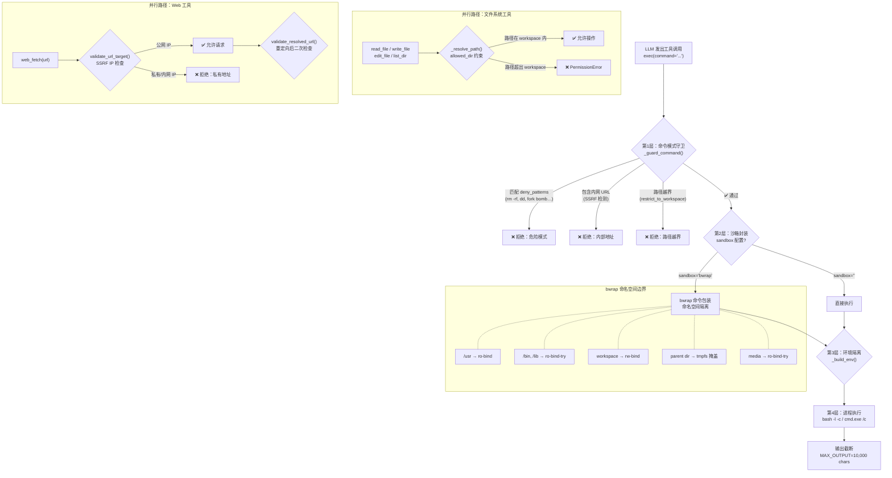

nanobot 允许 LLM 通过 `exec` 工具执行任意 Shell 命令，通过文件系统工具读写文件，通过 `web_fetch` 拉取外部内容——这些能力在带来强大灵活性的同时，也引入了严重的攻击面。如果不对 Agent 的行为加以约束，一次提示注入或模型幻觉就可能导致敏感配置泄露、主机系统破坏或内网探测。nanobot 的安全架构采用**纵深防御（Defense in Depth）**策略，在命令模式过滤、进程级命名空间隔离、文件系统路径约束、网络 SSRF 防护和环境变量脱敏五个层级上逐层收紧，确保即使某一层被绕过，后续层级仍能拦截威胁。本文将逐一剖析每层机制的实现原理、配置方式与交互关系。

Sources: [sandbox.py](nanobot/agent/tools/sandbox.py#L1-L56), [shell.py](nanobot/agent/tools/shell.py#L1-L278), [network.py](nanobot/security/network.py#L1-L121), [filesystem.py](nanobot/agent/tools/filesystem.py#L1-L55)

## 整体安全架构概览

理解安全机制的最有效方式是从"一次命令执行"的完整路径出发，观察数据如何经过五层安全检查。下图展示了一个 LLM 发出的 Shell 命令从接收、过滤、封装、执行到输出的完整流程：



Sources: [shell.py](nanobot/agent/tools/shell.py#L89-L159), [sandbox.py](nanobot/agent/tools/sandbox.py#L14-L45), [filesystem.py](nanobot/agent/tools/filesystem.py#L14-L38), [web.py](nanobot/agent/tools/web.py#L56-L59)

## 第1层：命令模式守卫（_guard_command）

`ExecTool._guard_command()` 是所有命令执行的第一道关卡，在命令被传递给 Shell 之前，它依次执行四项检查。每项检查都是独立的，只要任何一项触发拒绝，整个命令即被阻止。

### 危险模式拒绝列表（deny_patterns）

系统预置了一组正则表达式，用于匹配经典的破坏性命令模式：

| 模式 | 匹配目标 | 攻击向量 |
|---|---|---|
| `\brm\s+-[rf]{1,2}\b` | `rm -rf` / `rm -fr` | 递归强制删除 |
| `\bdel\s+/[fq]\b` | `del /f` / `del /q` | Windows 强制删除 |
| `\brmdir\s+/s\b` | `rmdir /s` | Windows 递归删除 |
| `(?:^|[;&\|]\s*)format\b` | `format` | 磁盘格式化 |
| `\b(mkfs\|diskpart)\b` | `mkfs` / `diskpart` | 磁盘操作 |
| `\bdd\s+if=` | `dd if=` | 原始磁盘写入 |
| `>\s*/dev/sd` | `> /dev/sda` | 直接写磁盘设备 |
| `\b(shutdown\|reboot\|poweroff)\b` | 系统电源命令 | 关机/重启 |
| `:\(\)\s*\{.*\};\s*:` | `:(){ :|:& };:` | Bash fork 炸弹 |

开发者可通过构造函数参数 `allow_patterns` 提供正则允许列表——当配置了允许列表时，命令必须**至少匹配一条**允许模式才能通过。`deny_patterns` 可通过构造参数自定义覆盖。

Sources: [shell.py](nanobot/agent/tools/shell.py#L229-L268)

### 内网 URL 检测（SSRF 防护）

`_guard_command` 调用 `contains_internal_url()` 扫描命令字符串中的所有 HTTP/HTTPS URL，对每个 URL 执行 DNS 解析并检查解析结果是否落入私有地址空间。这意味着 `curl http://169.254.169.254/latest/meta-data/`（云元数据端点）或 `wget http://localhost:8080/secret` 都会在命令执行前被拦截。

Sources: [shell.py](nanobot/agent/tools/shell.py#L242-L244), [network.py](nanobot/security/network.py#L113-L120)

### 工作区路径约束（restrict_to_workspace）

当 `restrict_to_workspace` 启用时，守卫执行三步路径审计：

1. **路径遍历检测**：命令中出现 `../` 或 `..\` 即被阻止
2. **绝对路径提取**：使用正则表达式提取命令中的 POSIX 绝对路径（`/...`）、Windows 驱动器路径（`C:\...`）和 Home 快捷路径（`~/...`）
3. **路径边界验证**：每个提取的绝对路径经过 `expandvars` → `expanduser` → `resolve` 后，必须位于 `cwd`（工作目录）或 `media` 目录的子树下，否则拒绝

Sources: [shell.py](nanobot/agent/tools/shell.py#L246-L267)

## 第2层：Bubblewrap 命名空间隔离

**Bubblewrap（bwrap）** 是 Flatpak 项目维护的轻量级 Linux 命名空间沙箱工具。它使用 Linux 内核的 `user_namespace`、`mount_namespace`、`pid_namespace` 和 `network_namespace`（通过 `--new-session`）来创建一个完全隔离的执行环境，无需 root 权限（仅要求 `SYS_ADMIN` capability）。

### bwrap 挂载策略

nanobot 的 `_bwrap()` 函数精心设计了一套最小权限挂载方案：

| 挂载类型 | 源路径 | 挂载标志 | 用途 |
|---|---|---|---|
| 必须只读 | `/usr` | `--ro-bind` | 系统运行时库和工具链 |
| 可选只读 | `/bin`, `/lib`, `/lib64`, `/etc/alternatives`, `/etc/ssl/certs`, `/etc/resolv.conf`, `/etc/ld.so.cache` | `--ro-bind-try` | 不存在的目录静默跳过 |
| 虚拟文件系统 | `/proc`, `/dev` | `--proc` / `--dev` | 进程信息和设备访问 |
| 临时文件系统 | `/tmp` | `--tmpfs` | 安全的临时目录 |
| **掩盖层** | `workspace.parent` | `--tmpfs` | 隐藏 config.json 等敏感配置 |
| **读写绑定** | `workspace` | `--bind` | Agent 唯一可写区域 |
| 只读绑定 | `media` | `--ro-bind-try` | 读取上传的附件 |
| **沙箱 CWD** | workspace 内的相对路径 | `--chdir` | 正确的工作目录 |

**关键设计决策**：`workspace.parent` 被 tmpfs 覆盖——nanobot 的配置文件 `config.json` 存放在工作区的父目录（如 `~/.nanobot/config.json`），通过 tmpfs 掩盖这一层，沙箱内的命令无法读取包含 API 密钥的配置文件。同时，workspace 本身通过 `--dir` 重建挂载点后再 `--bind` 挂载，确保只有工作区目录可见且可写。

`--new-session` 确保沙箱进程获得独立的会话 ID，`--die-with-parent` 保证 nanobot 进程退出时沙箱子进程自动终止，防止孤儿进程。

Sources: [sandbox.py](nanobot/agent/tools/sandbox.py#L14-L45)

### 沙箱 CWD 处理

当请求的 `cwd` 位于 workspace 内部时（如 `workspace/src/lib`），bwrap 的 `--chdir` 直接指向该子路径。如果 `cwd` 因某种原因位于 workspace 之外，则回退到 workspace 根目录——这是一种**安全降级**策略，宁可牺牲功能也不泄露信息。

```python
try:
    sandbox_cwd = str(ws / Path(cwd).resolve().relative_to(ws))
except ValueError:
    sandbox_cwd = str(ws)  # 安全降级：回退到 workspace 根
```

Sources: [sandbox.py](nanobot/agent/tools/sandbox.py#L24-L27)

### Docker 中的 bwrap 支持

Bubblewrap 在 Docker 容器中运行需要额外的权限配置。nanobot 的 `docker-compose.yml` 使用了精心设计的最小权限集：

```yaml
cap_drop:
  - ALL
cap_add:
  - SYS_ADMIN
security_opt:
  - apparmor=unconfined
  - seccomp=unconfined
```

`cap_drop: ALL` 首先丢弃所有 Linux capabilities，然后仅添加 `SYS_ADMIN`（bwrap 创建命名空间所需）。`seccomp` 和 `AppArmor` 设为 `unconfined` 是因为 bwrap 需要执行 `clone()`、`mount()`、`pivot_root()` 等系统调用，这些调用会被默认的 Docker seccomp 配置文件阻止。同时，Dockerfile 中显式安装了 `bubblewrap` 包。

Sources: [docker-compose.yml](docker-compose.yml#L1-L13), [Dockerfile](Dockerfile#L5)

## 第3层：环境变量隔离（_build_env）

即使命令通过了模式守卫和沙箱封装，如果进程环境变量中包含 API 密钥（如 `OPENAI_API_KEY=sk-...`），攻击者仍可通过 `env` 命令获取。`_build_env()` 实现了严格的环境白名单策略：

**Unix 环境**（仅 3 个变量）：

| 变量 | 来源 | 用途 |
|---|---|---|
| `HOME` | `os.environ["HOME"]` | 用户主目录 |
| `LANG` | `os.environ["LANG"]` | 区域设置（默认 `C.UTF-8`） |
| `TERM` | `os.environ["TERM"]` | 终端类型（默认 `dumb`） |

关键点：环境仅包含这三个变量，`bash -l`（登录 Shell）会自动 source `/etc/profile` 和 `~/.bash_profile`，从而重建 `PATH` 和其他必要环境。这意味着 API 密钥、数据库密码等敏感信息完全不可见。

Sources: [shell.py](nanobot/agent/tools/shell.py#L199-L227)

## 第4层：SSRF 网络防护

`nanobot.security.network` 模块为 `exec` 工具和 `web_fetch` 工具提供统一的 SSRF（Server-Side Request Forgery）防护。

### 私有地址空间阻断

系统维护了一个全面的内网地址块列表：

| CIDR 范围 | 名称 | 威胁场景 |
|---|---|---|
| `0.0.0.0/8` | 当前网络 | 路由表探测 |
| `10.0.0.0/8` | RFC 1918 | 内网扫描 |
| `100.64.0.0/10` | CGNAT | Tailscale/内网服务 |
| `127.0.0.0/8` | 回环地址 | 本地服务访问 |
| `169.254.0.0/16` | 链路本地 | **云元数据端点** |
| `172.16.0.0/12` | RFC 1918 | 内网扫描 |
| `192.168.0.0/16` | RFC 1918 | 内网扫描 |
| `::1/128` | IPv6 回环 | 本地服务访问 |
| `fc00::/7` | IPv6 ULA | 内网扫描 |
| `fe80::/10` | IPv6 链路本地 | 链路探测 |

**DNS 解析验证**是核心防线：`validate_url_target()` 不仅检查 URL 的 scheme 和 domain，还会通过 `socket.getaddrinfo()` 解析域名的所有 IP 地址（包括 IPv4 和 IPv6），逐一验证是否落入上述私有地址空间。这防止了 DNS 记录指向内网 IP 的 SSRF 攻击。

Sources: [network.py](nanobot/security/network.py#L10-L21), [network.py](nanobot/security/network.py#L46-L78)

### 重定向后二次验证

HTTP 重定向是 SSRF 的经典绕过手段——攻击者先请求一个公网 URL，服务器返回 302 重定向到 `http://169.254.169.254/`。`validate_resolved_url()` 在重定向完成后再次检查最终 URL 的 IP 地址，确保即使经过多次跳转，目标地址仍是公网可达的。

Sources: [network.py](nanobot/security/network.py#L81-L110), [web.py](nanobot/agent/tools/web.py#L270-L274)

### SSRF 白名单配置

某些部署场景需要访问私有地址段内的服务（例如通过 Tailscale 访问内部 API）。`ToolsConfig.ssrf_whitelist` 字段允许配置 CIDR 白名单：

```json
{
  "tools": {
    "ssrf_whitelist": ["100.64.0.0/10"]
  }
}
```

白名单在配置加载时通过 `_apply_ssrf_whitelist()` 全局生效，白名单内的地址段会跳过私有地址检查，但**不影响其他被阻断的地址段**。无效的 CIDR 条目会被静默跳过。

Sources: [schema.py](nanobot/config/schema.py#L199), [loader.py](nanobot/config/loader.py#L57-L61), [network.py](nanobot/security/network.py#L28-L43)

## 第5层：文件系统路径约束

文件系统工具（`read_file`、`write_file`、`edit_file`、`list_dir`、`glob`、`grep`）通过 `_FsTool` 基类和 `_resolve_path()` 函数实现路径约束。

### 路径解析与约束逻辑

```python
def _resolve_path(path, workspace, allowed_dir, extra_allowed_dirs):
    p = Path(path).expanduser()
    if not p.is_absolute() and workspace:
        p = workspace / p          # 相对路径 → workspace 下绝对路径
    resolved = p.resolve()
    if allowed_dir:
        # 必须位于 allowed_dir 或 media_dir 或 extra_allowed_dirs 下
        all_dirs = [allowed_dir, media_path] + (extra_allowed_dirs or [])
        if not any(_is_under(resolved, d) for d in all_dirs):
            raise PermissionError(...)
    return resolved
```

当沙箱启用（`sandbox="bwrap"`）时，`allowed_dir` 自动设置为 workspace——这是因为沙箱内只有 workspace 可写，文件系统工具也必须同步这一约束。此外，`ReadFileTool` 额外允许读取内置技能目录（`BUILTIN_SKILLS_DIR`），确保技能的 `SKILL.md` 描述文件始终可读。

Sources: [filesystem.py](nanobot/agent/tools/filesystem.py#L14-L38), [loop.py](nanobot/agent/loop.py#L264-L270)

## 安全层级协同与配置总览

### 安全层级交互矩阵

下表展示了各安全层级如何在不同威胁场景下协同工作：

| 威胁场景 | 第1层：模式守卫 | 第2层：bwrap 隔离 | 第3层：环境隔离 | 第4层：SSRF 防护 | 第5层：路径约束 |
|---|---|---|---|---|---|
| 递归删除 `rm -rf /` | ✅ deny_patterns 拦截 | ✅ 只读挂载保护 | — | — | — |
| 读取配置文件中的 API 密钥 | — | ✅ tmpfs 掩盖 parent | ✅ 环境无密钥 | — | ✅ allowed_dir 拒绝 |
| 探测云元数据 `169.254.169.254` | — | — | — | ✅ DNS 解析阻断 | — |
| Fork 炸弹 `:(){ :|:& };:` | ✅ deny_patterns 拦截 | ✅ PID namespace 限制 | — | — | — |
| 写入 `/etc/passwd` | — | ✅ 只读挂载保护 | — | — | ✅ allowed_dir 拒绝 |
| `curl localhost:8080` 内网探测 | — | — | — | ✅ 回环地址阻断 | — |

### 配置参数一览

所有安全参数集中在 `config.json` 的 `tools` 节点下：

```json
{
  "tools": {
    "exec": {
      "enable": true,
      "timeout": 60,
      "sandbox": "bwrap",
      "path_append": ""
    },
    "restrict_to_workspace": true,
    "ssrf_whitelist": [],
    "web": {
      "enable": true,
      "proxy": null
    }
  }
}
```

| 参数 | 路径 | 默认值 | 影响范围 |
|---|---|---|---|
| `tools.exec.enable` | ExecToolConfig | `true` | 是否注册 exec 工具 |
| `tools.exec.sandbox` | ExecToolConfig | `""` | `"bwrap"` 启用沙箱，`""` 禁用 |
| `tools.exec.timeout` | ExecToolConfig | `60` | 命令超时（秒），上限 600 |
| `tools.restrict_to_workspace` | ToolsConfig | `false` | 限制所有工具仅访问 workspace |
| `tools.ssrf_whitelist` | ToolsConfig | `[]` | 豁免 SSRF 阻断的 CIDR 列表 |

**关键联动**：当 `tools.exec.sandbox` 设置为 `"bwrap"` 时，即使 `restrict_to_workspace` 为 `false`，文件系统工具仍会被自动限制在 workspace 内。这是通过 `_register_default_tools()` 中的逻辑 `allowed_dir = self.workspace if (self.restrict_to_workspace or self.exec_config.sandbox) else None` 实现的。

Sources: [schema.py](nanobot/config/schema.py#L172-L199), [loop.py](nanobot/agent/loop.py#L262-L278)

## 安全层级初始化时序

配置加载到安全机制生效的完整时序如下：

```mermaid
sequenceDiagram
    participant Config as config.json
    participant Loader as loader.load_config()
    participant SSRF as network.configure_ssrf_whitelist()
    participant Loop as AgentLoop.__init__()
    participant Tools as _register_default_tools()
    
    Config->>Loader: 读取配置文件
    Loader->>Loader: _apply_ssrf_whitelist()
    Loader->>SSRF: configure_ssrf_whitelist(["100.64.0.0/10"])
    Note over SSRF: 全局生效：后续所有 URL 验证<br/>均跳过白名单 CIDR
    Loader-->>Loop: Config 对象
    Loop->>Loop: 解析 exec_config.sandbox
    Loop->>Tools: _register_default_tools()
    Note over Tools: sandbox="bwrap" → allowed_dir=workspace
    Tools->>Tools: ExecTool(sandbox="bwrap", ...)
    Tools->>Tools: ReadFileTool(allowed_dir=workspace, ...)
    Tools->>Tools: WriteFileTool(allowed_dir=workspace, ...)
    Note over Tools: 所有工具共享 workspace 约束
```

Sources: [loader.py](nanobot/config/loader.py#L30-L61), [loop.py](nanobot/agent/loop.py#L262-L278)

## 子代理的安全继承

[子代理（Subagent）](25-zi-dai-li-subagent-hou-tai-ren-wu-pai-fa-yu-guan-li) 在派生后台任务时继承主代理的完整安全配置。`SpawnManager._run_subagent()` 构建独立的 `ToolRegistry`，但使用相同的 `exec_config` 和 `restrict_to_workspace` 参数：

```python
# subagent.py — 后台任务的工具注册
allowed_dir = self.workspace if (self.restrict_to_workspace or self.exec_config.sandbox) else None
tools.register(ExecTool(
    working_dir=str(self.workspace),
    sandbox=self.exec_config.sandbox,  # 继承沙箱配置
    restrict_to_workspace=self.restrict_to_workspace,
    ...
))
```

这确保了主代理的安全策略不会因子代理派生而降级——每个后台任务都在相同的安全边界内运行。

Sources: [subagent.py](nanobot/agent/subagent.py#L101-L129)

## 生产环境安全加固建议

1. **始终启用 bwrap 沙箱**：在 Docker 部署中设置 `"sandbox": "bwrap"`，配合 `cap_add: SYS_ADMIN` 和 `security_opt` 配置。这是防止 LLM 执行恶意命令的最有效手段——即使 `deny_patterns` 被绕过，命名空间隔离仍能限制损害范围。

2. **启用 `restrict_to_workspace`**：即使不使用 bwrap 沙箱，也应启用工作区限制。这防止文件系统工具读取 `/etc/shadow`、`~/.ssh/id_rsa` 等敏感文件。

3. **审慎配置 SSRF 白名单**：仅添加确定需要访问的内网 CIDR。白名单是全局限不配置的——一旦添加，所有 URL 检查都会豁免该地址段。

4. **验证 Docker 容器权限**：在生产环境中，确保 `docker-compose.yml` 的 `cap_drop: ALL` 和 `cap_add: SYS_ADMIN` 配置未被意外修改。移除 `SYS_ADMIN` 会导致 bwrap 无法创建命名空间。

5. **资源限制**：`docker-compose.yml` 中的 `cpus: "1"` 和 `memory: 1G` 限制可防止 LLM 通过无限循环或内存炸弹耗尽宿主机资源——这是 bwrap 之外的额外保护层。

更多关于生产环境部署的安全加固细节，参见 [网络安全、访问控制与生产环境加固](32-wang-luo-an-quan-fang-wen-kong-zhi-yu-sheng-chan-huan-jing-jia-gu) 和 [Docker 部署与 docker-compose 配置](30-docker-bu-shu-yu-docker-compose-pei-zhi)。