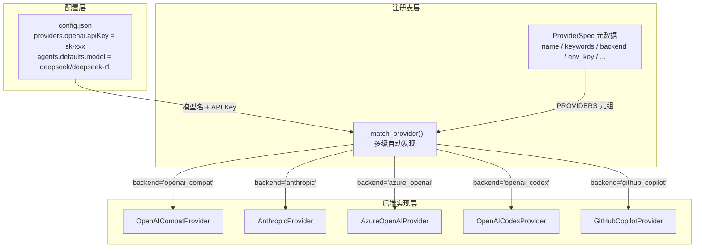
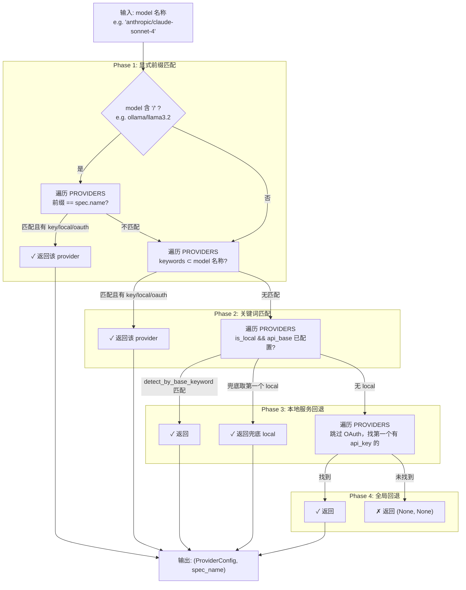

nanobot 支持超过 25 个 LLM 服务商——从 OpenAI、Anthropic 到本地 Ollama、vLLM 部署——而用户只需在配置文件中填入 API Key 和模型名称。**Provider 注册表**（Provider Registry）是实现这一"零配置"体验的核心：它将所有服务商的元数据集中定义在一个不可变元组中，并通过多级匹配策略自动将模型名称映射到正确的后端实现。本文将深入解析注册表的数据结构、自动发现的优先级规则、后端路由机制以及如何添加新的 Provider。

Sources: [registry.py](nanobot/providers/registry.py#L1-L11)

## 架构总览：注册表在三层数据流中的位置

Provider 注册表位于 **配置层**（`config/schema.py`）和 **后端实现层**（`providers/` 下各 Provider 类）之间，承担"解耦与路由"的双重职责。下面的 Mermaid 图展示了从用户配置到最终 LLM 调用的完整数据流：



这一架构的核心设计原则是 **声明式注册 + 自动路由**：所有服务商的元信息集中在 `PROVIDERS` 元组中声明，自动发现逻辑和后端路由均从该元组派生，无需在多个文件间手动同步配置。

Sources: [schema.py](nanobot/config/schema.py#L217-L280), [registry.py](nanobot/providers/registry.py#L71-L75)

## ProviderSpec：描述一个 LLM 服务商的完整元数据

注册表中的每一条记录都是一个 `ProviderSpec` 不可变数据类（`frozen=True`），包含身份标识、匹配规则、后端选择和行为标记四大类字段：

| 字段类别 | 字段名 | 类型 | 说明 |
|---------|--------|------|------|
| **身份标识** | `name` | `str` | 配置字段名，如 `"dashscope"`、`"openrouter"` |
| | `keywords` | `tuple[str, ...]` | 模型名关键词，用于自动发现匹配 |
| | `env_key` | `str` | API Key 对应的环境变量名，如 `"DEEPSEEK_API_KEY"` |
| | `display_name` | `str` | 在 `nanobot status` 和引导向导中的显示名 |
| **后端选择** | `backend` | `str` | 路由到哪个实现类，默认 `"openai_compat"` |
| **匹配规则** | `detect_by_key_prefix` | `str` | 按 API Key 前缀匹配，如 OpenRouter 的 `"sk-or-"` |
| | `detect_by_base_keyword` | `str` | 按 api_base URL 子串匹配 |
| | `default_api_base` | `str` | 该服务商的默认 API 端点 |
| **行为标记** | `is_gateway` | `bool` | 网关型（可路由任意模型，如 OpenRouter） |
| | `is_local` | `bool` | 本地部署（如 Ollama、vLLM） |
| | `is_oauth` | `bool` | OAuth 认证型（如 GitHub Copilot） |
| | `is_direct` | `bool` | 直接型（用户提供完整端点，如 custom） |
| | `strip_model_prefix` | `bool` | 发送前去除模型名中的 `provider/` 前缀 |
| | `supports_prompt_caching` | `bool` | 支持 `cache_control` 内容块标记 |
| | `model_overrides` | `tuple` | 按模型名模式覆盖参数（如 kimi-k2.5 强制 `temperature=1.0`） |
| | `env_extras` | `tuple` | 额外需要设置的环境变量 |

其中 `backend` 字段是路由的核心——它决定了 nanobot 实例化哪个 Provider 类来处理实际的 LLM 请求。当前支持的后端值及其映射关系如下：

| backend 值 | 对应实现类 | 说明 |
|-----------|-----------|------|
| `"openai_compat"` | `OpenAICompatProvider` | OpenAI 兼容 API，覆盖绝大多数服务商 |
| `"anthropic"` | `AnthropicProvider` | 使用 Anthropic Python SDK 原生接口 |
| `"azure_openai"` | `AzureOpenAIProvider` | Azure OpenAI 专用（需部署名 + API 版本） |
| `"openai_codex"` | `OpenAICodexProvider` | OpenAI Codex OAuth 认证 |
| `"github_copilot"` | `GitHubCopilotProvider` | GitHub Copilot OAuth 认证 |

绝大多数服务商（25 个中的 22 个）都使用 `"openai_compat"` 后端——这是因为 OpenAI 的 Chat Completions API 已成为事实上的行业标准。nanobot 的 `OpenAICompatProvider` 是一个高度通用的实现，通过接收 `ProviderSpec` 来适配不同服务商的行为差异（如环境变量注入、模型名处理、thinking 参数等）。

Sources: [registry.py](nanobot/providers/registry.py#L21-L69), [__init__.py](nanobot/providers/__init__.py#L20-L26)

## PROVIDERS 元组：声明式注册与优先级

`PROVIDERS` 是一个 `tuple[ProviderSpec, ...]` 类型的不可变元组，包含全部 27 个预注册服务商。**元组顺序即匹配优先级**——这是自动发现机制的关键设计决策。元组按以下逻辑分组排列：

```
1. 自定义/直接型 ── 无关键词匹配，优先级最高
2. 网关型 ── detect_by_key_prefix / detect_by_base_keyword
3. 标准服务商 ── keywords 匹配
4. 本地部署 ── is_local
5. 辅助型 ── 如 Groq（语音转录为主）
```

这种分组确保了 **特异性优先**：网关（如 OpenRouter）能路由任意模型，因此应在标准服务商之前被检测到；而自定义端点完全由用户控制，必须放在最前面。以注册表中前三条为例：

```python
# custom: 无关键词、无环境变量、无 api_base — 完全由用户决定
ProviderSpec(name="custom", keywords=(), env_key="", is_direct=True),

# azure_openai: 需要 api_key + api_base + 部署名
ProviderSpec(name="azure_openai", keywords=("azure", "azure-openai"), backend="azure_openai", is_direct=True),

# openrouter: 网关型，Key 前缀 "sk-or-" 即可识别
ProviderSpec(name="openrouter", keywords=("openrouter",), env_key="OPENROUTER_API_KEY",
             is_gateway=True, detect_by_key_prefix="sk-or-", ...),
```

Sources: [registry.py](nanobot/providers/registry.py#L75-L110)

## 自动发现机制：`_match_provider()` 的四级匹配策略

当 `provider` 配置项为 `"auto"`（默认值）时，`Config._match_provider()` 方法会依次执行四个匹配阶段，直到找到第一个满足条件的服务商。这个过程构成了 nanobot "零配置"体验的核心。



### Phase 1：显式前缀匹配

当模型名包含 `/` 时，`/` 之前的部分被视为显式 Provider 指示器。例如 `ollama/llama3.2` 中 `ollama` 被解析为前缀，nanobot 遍历 `PROVIDERS` 查找 `name == "ollama"` 的 spec。**这一阶段优先级最高**，可防止 `github-copilot/codex-model` 误匹配到 `openai_codex`。

### Phase 2：关键词匹配

在 `PROVIDERS` 注册顺序中，依次检查每个 spec 的 `keywords` 是否出现在模型名中。例如模型 `deepseek-r1` 会匹配 `deepseek` spec（因为 `"deepseek"` 是其关键词之一）。**PROVIDERS 元组的顺序直接决定了关键词冲突时的优先级**。

### Phase 3：本地服务回退

对于没有 Provider 特定关键词的模型名（如 `llama3.2`），nanobot 会回退到已配置 API Base 的本地服务商。匹配逻辑进一步区分优先级：若某个本地服务商的 `detect_by_base_keyword` 出现在已配置的 `api_base` 中（如 Ollama 的 `"11434"`），则优先返回；否则取第一个有 `api_base` 的本地服务商。

### Phase 4：全局回退

当前三个阶段都未匹配时，nanobot 遍历 `PROVIDERS`，跳过 OAuth 类型的服务商（因为它们需要显式选择），返回第一个有 `api_key` 配置的服务商。这确保了用户只需配置一个 API Key，即可使用任意模型名。

Sources: [schema.py](nanobot/config/schema.py#L217-L280)

## 后端路由：从 Spec 到 Provider 实例

自动发现的结果是 `(ProviderConfig, spec_name)` 二元组。随后 `_make_provider()` 函数通过 `spec.backend` 字段将结果路由到具体的 Provider 实现类：

```python
# nanobot/nanobot.py — 简化版路由逻辑
spec = find_by_name(provider_name)
backend = spec.backend if spec else "openai_compat"

if backend == "openai_codex":
    provider = OpenAICodexProvider(default_model=model)
elif backend == "github_copilot":
    provider = GitHubCopilotProvider(default_model=model)
elif backend == "azure_openai":
    provider = AzureOpenAIProvider(api_key=..., api_base=..., default_model=model)
elif backend == "anthropic":
    provider = AnthropicProvider(api_key=..., api_base=..., default_model=model)
else:
    provider = OpenAICompatProvider(api_key=..., api_base=..., spec=spec, ...)
```

值得注意的是 `OpenAICompatProvider` 接收完整的 `ProviderSpec` 对象作为 `spec` 参数。这个 spec 在后续的请求构建中被用来驱动多种行为：

- **环境变量注入**：`_setup_env()` 根据 `spec.env_key` 和 `spec.env_extras` 设置服务商 SDK 依赖的环境变量
- **模型名处理**：`strip_model_prefix=True` 时去除 `provider/` 前缀（如 AiHubMix 不理解 `anthropic/claude-3`，需简化为 `claude-3`）
- **参数覆盖**：`model_overrides` 按 model 名称模式注入特定参数（如 Moonshot K2.5 强制 `temperature=1.0`）
- **Prompt Caching**：`supports_prompt_caching=True` 时在消息和工具定义中注入 `cache_control` 标记
- **Thinking 参数**：按 spec.name 注入服务商特有的思考模式参数（如 DashScope 的 `enable_thinking`、VolcEngine 的 `thinking.type`）

Sources: [nanobot.py](nanobot/nanobot.py#L116-L176), [openai_compat_provider.py](nanobot/providers/openai_compat_provider.py#L123-L165)

## 懒加载：`__init__.py` 的延迟导入机制

`nanobot/providers/__init__.py` 通过 `__getattr__` 协议实现了 Provider 实现类的 **按需加载**。当整个 `nanobot` 包被导入时，五个后端实现模块（`anthropic_provider`、`openai_compat_provider` 等）不会被立即加载——只有在实际访问对应的类名时才会触发 `importlib.import_module()`：

```python
_LAZY_IMPORTS = {
    "AnthropicProvider": ".anthropic_provider",
    "OpenAICompatProvider": ".openai_compat_provider",
    "OpenAICodexProvider": ".openai_codex_provider",
    "GitHubCopilotProvider": ".github_copilot_provider",
    "AzureOpenAIProvider": ".azure_openai_provider",
}

def __getattr__(name: str):
    module_name = _LAZY_IMPORTS.get(name)
    if module_name is None:
        raise AttributeError(...)
    module = import_module(module_name, __name__)
    return getattr(module, name)
```

这种设计确保了：当用户使用 DeepSeek 时，不会触发 Anthropic SDK 的导入（后者依赖重且需要额外安装）。测试用例通过清除 `sys.modules` 中的缓存来验证这一行为——导入 `nanobot.providers` 包后，各后端模块的 key 确实不在 `sys.modules` 中。

Sources: [__init__.py](nanobot/providers/__init__.py#L1-L42), [test_providers_init.py](tests/providers/test_providers_init.py#L9-L32)

## 查找辅助函数：`find_by_name()`

除了自动发现外，注册表还提供了精确查找函数 `find_by_name()`，用于在多处代码中将配置字段名解析为 `ProviderSpec`。该函数接受 camelCase、kebab-case 等多种命名风格，内部通过 `pydantic.alias_generators.to_snake()` 统一规范化：

```python
# 这些调用都返回同一个 ProviderSpec
find_by_name("volcengineCodingPlan")  # camelCase（JSON 配置中常见）
find_by_name("volcengine-coding-plan")  # kebab-case（CLI 参数中常见）
find_by_name("volcengine_coding_plan")  # snake_case（Python 原生）
```

此函数在以下场景中被调用：CLI 的 `_make_provider()` 路由、`Config.get_api_base()` 的默认 URL 解析、以及 GitHub Copilot Provider 内部的 spec 引用。

Sources: [registry.py](nanobot/providers/registry.py#L369-L375)

## 配置层集成：ProvidersConfig 字段与注册表的对应关系

`config/schema.py` 中的 `ProvidersConfig` 类为每个注册的 Provider 定义了一个 `ProviderConfig` 字段。这些字段的 **名称必须与 `ProviderSpec.name` 完全一致**——这是 `_match_provider()` 中 `getattr(self.providers, spec.name, None)` 得以工作的基础。每个 `ProviderConfig` 仅包含三个字段：

| 字段 | 类型 | 说明 |
|------|------|------|
| `api_key` | `str` | API 密钥（默认空字符串） |
| `api_base` | `str \| None` | 自定义 API 端点（覆盖 `spec.default_api_base`） |
| `extra_headers` | `dict \| None` | 自定义 HTTP 请求头 |

用户配置文件（`config.json`）中的 providers 块直接映射到这个类。例如：

```json
{
  "providers": {
    "deepseek": { "apiKey": "sk-xxx" },
    "ollama": { "apiBase": "http://localhost:11434/v1" }
  },
  "agents": {
    "defaults": {
      "model": "deepseek/deepseek-r1",
      "provider": "auto"
    }
  }
}
```

当 `provider` 为 `"auto"` 时走自动发现；若设为具体名称（如 `"ollama"`），则跳过所有匹配阶段直接使用指定的 Provider。OAuth 类型的 Provider（`openai_codex`、`github_copilot`）在 `ProvidersConfig` 中标记了 `exclude=True`，不会序列化到配置文件中——它们的认证信息通过 `nanobot provider login` 命令单独管理。

Sources: [schema.py](nanobot/config/schema.py#L88-L125), [schema.py](nanobot/config/schema.py#L62-L69)

## 添加新 Provider 的完整流程

注册表的设计目标是让添加新 Provider 成为一个两步操作，无需修改任何路由或匹配逻辑：

**Step 1：在 `PROVIDERS` 元组中添加一条 `ProviderSpec`**，按分组位置插入。例如添加一个虚构的 "NovaAI" 服务商：

```python
ProviderSpec(
    name="nova_ai",                    # 与 ProvidersConfig 字段名一致
    keywords=("nova", "nova-ai"),      # 模型名中的匹配关键词
    env_key="NOVA_AI_API_KEY",         # API Key 环境变量
    display_name="Nova AI",
    backend="openai_compat",           # 大多数新服务商用这个
    default_api_base="https://api.nova-ai.com/v1",
),
```

**Step 2：在 `ProvidersConfig` 类中添加对应字段**：

```python
class ProvidersConfig(Base):
    # ... 现有字段 ...
    nova_ai: ProviderConfig = Field(default_factory=ProviderConfig)  # 新增
```

完成这两步后，环境变量检测、模型名匹配、状态显示、`api_base` 默认值、环境变量注入等所有下游功能都会自动从注册表派生，无需额外代码。

如果新服务商需要非标准的认证流程（如 OAuth）或不兼容 OpenAI API 的协议，则需要同时创建一个新的 `Provider` 子类并在 `backend` 字段中指定路由。参见 [Provider 后端实现：OpenAI 兼容、Anthropic、Azure、OAuth](14-provider-hou-duan-shi-xian-openai-jian-rong-anthropic-azure-oauth) 了解各后端的实现细节。

Sources: [registry.py](nanobot/providers/registry.py#L1-L11), [schema.py](nanobot/config/schema.py#L96-L125)

## CLI 与引导向导中的注册表集成

Provider 注册表在两个 CLI 命令中被直接使用：

- **`nanobot status`**：遍历 `PROVIDERS` 元组，对每个 spec 检查对应的 `ProviderConfig` 是否有 `api_key`（或 `api_base` for 本地部署、OAuth 标记 for OAuth 类型），然后以 `✓` / `not set` 的形式展示所有服务商的状态。
- **`nanobot onboard`（交互式向导）**：从注册表构建选项菜单（排除 OAuth 类型），用户选择后自动填充 `default_api_base`，并逐项配置 API Key 和端点。
- **`nanobot provider login`**：遍历 `PROVIDERS` 找到 `is_oauth=True` 的 spec，然后路由到对应的登录处理器。

Sources: [commands.py](nanobot/cli/commands.py#L1295-L1314), [onboard.py](nanobot/cli/onboard.py#L654-L711), [commands.py](nanobot/cli/commands.py#L1336-L1356)

---

**下一步阅读**：本文聚焦于注册表的元数据定义与自动发现机制。如需了解各后端实现类的具体行为差异（如 Anthropic 的 extended thinking、Azure 的部署名映射、OAuth 的认证流程），请继续阅读 [Provider 后端实现：OpenAI 兼容、Anthropic、Azure、OAuth](14-provider-hou-duan-shi-xian-openai-jian-rong-anthropic-azure-oauth)。如需了解注册表中的重试策略和错误元数据处理，请参考 [Provider 重试策略与错误元数据处理](15-provider-zhong-shi-ce-lue-yu-cuo-wu-yuan-shu-ju-chu-li)。