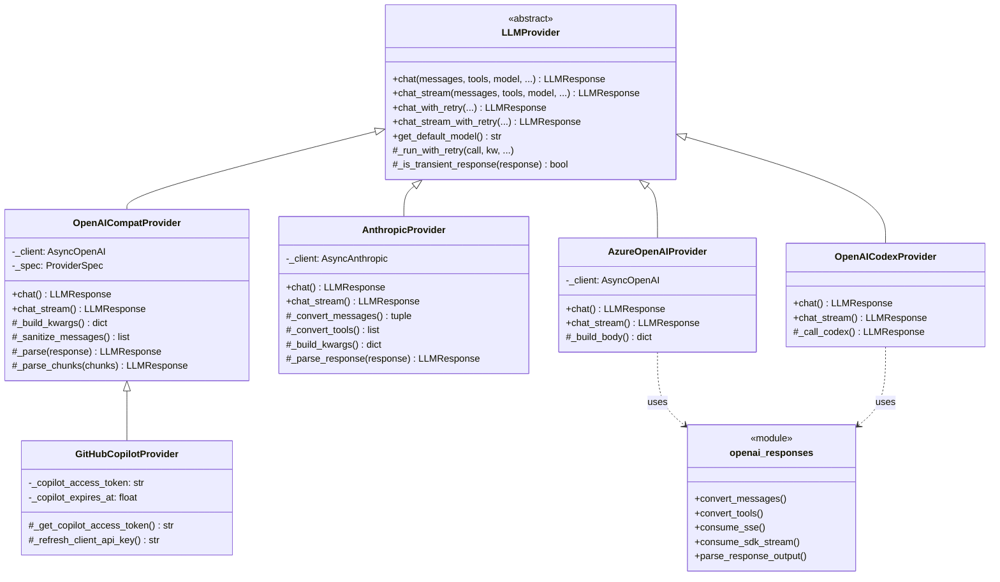

nanobot 的 Provider 体系包含五个后端实现，覆盖了从标准 API Key 认证到 OAuth 设备流的全部接入模式。每个后端都继承自抽象基类 `LLMProvider`，遵循统一的 `chat()` / `chat_stream()` 接口契约，并在内部完成消息格式转换、工具定义映射、错误元数据提取等差异化逻辑。本文将逐一剖析每个后端的核心设计、消息转换策略与特殊能力扩展。

Sources: [base.py](nanobot/providers/base.py#L80-L82), [__init__.py](nanobot/providers/__init__.py#L1-L43)

## 架构总览：五个后端的协作关系

在深入具体实现之前，先从宏观视角理解五个后端的继承与复用关系。`OpenAICompatProvider` 是体系的枢纽——它不仅直接服务于 20+ 个 OpenAI 兼容供应商，还被 `GitHubCopilotProvider` 继承复用。`AzureOpenAIProvider` 和 `OpenAICodexProvider` 则共享 `openai_responses` 子模块中的 Responses API 格式转换器。`AnthropicProvider` 是唯一独立实现消息转换的后端，因为 Anthropic Messages API 的消息格式与 OpenAI Chat Completions 存在根本差异。



Provider 后端的选择由 [Provider 注册表](13-provider-zhu-ce-biao-yu-zi-dong-fa-xian-ji-zhi) 中 `ProviderSpec.backend` 字段决定，`nanobot.py` 中的工厂函数根据 `backend` 值分派到对应的实现类。

Sources: [nanobot.py](nanobot/nanobot.py#L125-L168)

## 后端分派机制

`nanobot.py` 中的工厂函数是所有 Provider 实例化的唯一入口。它从 `ProviderSpec.backend` 字段读取后端类型，然后根据不同分支构造相应的 Provider 实例：

```python
backend = spec.backend if spec else "openai_compat"

if backend == "openai_codex":
    provider = OpenAICodexProvider(default_model=model)
elif backend == "github_copilot":
    provider = GitHubCopilotProvider(default_model=model)
elif backend == "azure_openai":
    provider = AzureOpenAIProvider(
        api_key=p.api_key, api_base=p.api_base, default_model=model
    )
elif backend == "anthropic":
    provider = AnthropicProvider(...)
else:
    provider = OpenAICompatProvider(...)
```

注意几个关键点：OAuth 类 Provider（`openai_codex`、`github_copilot`）不需要 `api_key` 参数——它们的认证凭据通过设备流获取并持久化到本地文件。`azure_openai` 则强制要求 `api_key` 和 `api_base` 同时存在。所有其他供应商最终都回退到 `OpenAICompatProvider`，由它统一处理 OpenAI 兼容的 API 调用。

Sources: [nanobot.py](nanobot/nanobot.py#L125-L168)

## OpenAICompatProvider：万能适配器

`OpenAICompatProvider` 是整个 Provider 体系中复用度最高的后端，承担了 20+ 个供应商的 API 交互工作。它的核心设计哲学是**通过 `ProviderSpec` 元数据驱动差异化行为**，而非通过子类化——一个类实例配合不同的 `spec` 配置就能适配 DeepSeek、Gemini、DashScope、Ollama 等截然不同的 API 端点。

### 客户端初始化与 Langfuse 可观测性

Provider 在初始化时，会检测 `LANGFUSE_SECRET_KEY` 环境变量：如果存在且 `langfuse` 包已安装，则使用 `langfuse.openai.AsyncOpenAI` 替代原生 `openai.AsyncOpenAI`，实现自动 LLM 调用链追踪。每个客户端实例都携带一个 `x-session-affinity` 头（UUID 随机值），用于服务端会话亲和性；如果检测到 OpenRouter 端点，还会追加 `HTTP-Referer`、`X-OpenRouter-Title` 等归属头。

Sources: [openai_compat_provider.py](nanobot/providers/openai_compat_provider.py#L17-L151)

### 请求构建：`_build_kwargs` 的多供应商适配

`_build_kwargs` 方法是理解 `OpenAICompatProvider` 适配能力的关键。它接收标准化的 Chat Completions 参数，根据 `ProviderSpec` 的元数据动态调整最终发送给 API 的请求体：

| 适配维度 | 实现方式 | 影响的供应商 |
|---|---|---|
| **模型前缀剥离** | `spec.strip_model_prefix=True` 时移除 `provider/` 前缀 | AiHubMix、BytePlus、GitHub Copilot |
| **Prompt 缓存标记** | `spec.supports_prompt_caching=True` 且模型以 `anthropic/` 或 `claude` 开头时注入 `cache_control` | OpenRouter |
| **Token 限制参数名** | `spec.supports_max_completion_tokens=True` 用 `max_completion_tokens` 替代 `max_tokens` | OpenAI |
| **Temperature 禁用** | 检测 GPT-5/o1/o3/o4 或 `reasoning_effort` 非空时跳过 `temperature` 参数 | OpenAI reasoning 模型 |
| **思维链参数** | DashScope 加 `enable_thinking`，火山引擎加 `thinking.type` | DashScope、VolcEngine |
| **模型级覆盖** | `spec.model_overrides` 匹配模型名后覆盖参数 | Moonshot K2.5（强制 `temperature=1.0`）|

Sources: [openai_compat_provider.py](nanobot/providers/openai_compat_provider.py#L254-L322)

### 消息净化与 Tool Call ID 规范化

不同供应商对 tool call ID 的长度和字符集有不同限制（例如 Mistral 不接受长 UUID）。`_sanitize_messages` 方法会执行两步净化：首先通过 `_sanitize_request_messages` 过滤掉非标准消息键（只保留 `role`、`content`、`tool_calls`、`tool_call_id`、`name`、`reasoning_content`、`extra_content`），然后对所有 tool call ID 进行 SHA-1 哈希截断为 9 位字母数字串，确保跨供应商兼容。

Sources: [openai_compat_provider.py](nanobot/providers/openai_compat_provider.py#L210-L233)

### 响应解析：双模式设计

`_parse` 方法同时支持两种响应格式——SDK Pydantic 对象和原始 JSON 字典。它通过 `_maybe_mapping` 统一处理：先尝试将响应转为 dict，如果成功则走 dict 解析路径；否则走 SDK 对象属性路径。这种设计确保了 Provider 可以与直接使用 `httpx` 获取的原始 JSON 或 OpenAI SDK 返回的类型化对象协同工作。

Token 使用量提取同样体现了多供应商适配。`_extract_usage` 按优先级链搜索缓存命中文档：先查 `prompt_tokens_details.cached_tokens`（OpenAI/智谱/MiniMax/Mistral 标准），再查顶层 `cached_tokens`（StepFun/Moonshot），最后查 `prompt_cache_hit_tokens`（DeepSeek/SiliconFlow），找到第一个非零值即停止。

Sources: [openai_compat_provider.py](nanobot/providers/openai_compat_provider.py#L429-L547), [openai_compat_provider.py](nanobot/providers/openai_compat_provider.py#L363-L410)

### 流式响应累积

`_parse_chunks` 方法实现了增量式流式解析。它维护三个缓冲区——`content_parts`（文本片段）、`reasoning_parts`（推理内容片段）和 `tc_bufs`（工具调用增量累积器）。对于工具调用，每个 streaming delta 通过 `_accum_tc` 按 index 键聚合到 `tc_bufs` 中，逐步累积 `id`、`name`、`arguments`。流结束后，所有缓冲区被一次性组装为 `LLMResponse`。

Sources: [openai_compat_provider.py](nanobot/providers/openai_compat_provider.py#L549-L650)

## AnthropicProvider：原生 SDK 深度集成

`AnthropicProvider` 是唯一使用原生供应商 SDK（`anthropic.AsyncAnthropic`）的后端。它不能复用 `OpenAICompatProvider`，因为 Anthropic Messages API 的消息格式与 OpenAI Chat Completions 存在根本差异——system 消息从消息列表中分离为独立参数、tool 结果以 `tool_result` block 形式嵌入 user 消息、assistant 消息由 `text` 和 `tool_use` block 组成。

### 消息格式转换：`_convert_messages`

这是 AnthropicProvider 最复杂的部分。转换规则如下：

| OpenAI 角色 | Anthropic 格式 | 处理逻辑 |
|---|---|---|
| `system` | 独立 `system` 参数 | 提取为 `str \| list[dict]`，不进入消息列表 |
| `user` | `{"role": "user", "content": ...}` | 直接映射，`image_url` 转为 `image` block |
| `assistant` | `{"role": "assistant", "content": [blocks]}` | 文本→`text` block，tool_calls→`tool_use` block，thinking_blocks→`thinking` block |
| `tool` | 合并到前一条 `user` 消息 | 转为 `tool_result` block，追加到最近 user 消息的 content 列表 |

合并工具结果到 user 消息的原因是 Anthropic API 要求严格的 user/assistant 角色交替。`_merge_consecutive` 方法进一步确保连续相同角色的消息被合并为单一消息的多个 content block。

Sources: [anthropic_provider.py](nanobot/providers/anthropic_provider.py#L121-L265)

### Extended Thinking：三级推理模式

AnthropicProvider 支持三种 thinking 模式，通过 `reasoning_effort` 参数控制：

- **`adaptive`**：模型自主决定何时、多大程度地进行推理。设置 `thinking.type = "adaptive"` 且 `temperature = 1.0`，不膨胀 `max_tokens`。适用于 `claude-sonnet-4-6` 和 `claude-opus-4-6`。
- **`low` / `medium` / `high`**：手动控制推理预算。`low` 对应 1024 token 预算，`medium` 对应 4096，`high` 对应 `max(8192, max_tokens)`。设置 `thinking.type = "enabled"` 和对应 `budget_tokens`，同时将 `max_tokens` 膨胀为 `max(max_tokens, budget + 4096)` 以确保输出空间。强制 `temperature = 1.0`（Anthropic extended thinking 的要求）。

响应解析时，thinking block 被提取并存储在 `LLMResponse.thinking_blocks` 中，格式为 `[{"type": "thinking", "thinking": "...", "signature": "..."}]`。signature 字段用于 Anthropic 的加密思维验证链——在后续请求中可以原样回传，让模型续写之前的推理过程。

Sources: [anthropic_provider.py](nanobot/providers/anthropic_provider.py#L351-L407), [test_anthropic_thinking.py](tests/providers/test_anthropic_thinking.py#L30-L66)

### Prompt Caching

Anthropic 的 prompt caching 机制通过在 content block 上附加 `cache_control: {"type": "ephemeral"}` 标记实现。`_apply_cache_control` 方法在三个位置注入标记：

1. **System 消息**：系统提示词的最后一个 content block
2. **倒数第二条用户消息**：对话历史中靠近末尾的位置
3. **工具定义边界**：内置工具与 MCP 工具的分界处，以及工具列表末尾

这种策略最大化了缓存命中率——系统提示词和工具定义通常不变，标记它们可以显著减少输入 token 计费。

Sources: [anthropic_provider.py](nanobot/providers/anthropic_provider.py#L313-L345)

### 工具定义转换

Anthropic 的工具格式与 OpenAI 的 `function calling` 格式不同。`_convert_tools` 将 `{"type": "function", "function": {"name": ..., "parameters": ...}}` 转换为 `{"name": ..., "input_schema": ...}`——注意 Anthropic 使用 `input_schema` 而非 `parameters`。`tool_choice` 的映射关系为：`auto` → `auto`，`required` → `any`，`none` → 不发送，具体工具名 → `{"type": "tool", "name": ...}`。当 thinking 启用时，`tool_choice` 被强制设为 `{"type": "auto"}`。

Sources: [anthropic_provider.py](nanobot/providers/anthropic_provider.py#L271-L307)

## AzureOpenAIProvider：Responses API 集成

`AzureOpenAIProvider` 采用了与 `OpenAICompatProvider` 不同的 API 协议——OpenAI 的 **Responses API**（`/responses` 端点），而非 Chat Completions API（`/chat/completions`）。它使用 OpenAI Python SDK 的 `AsyncOpenAI` 客户端，但将 `base_url` 指向 Azure 端点的 `/openai/v1/` 路径，调用 `client.responses.create()` 方法。

### 初始化与端点规范化

构造函数强制要求 `api_key` 和 `api_base` 两个参数，缺少任一即抛出 `ValueError`。`api_base` 会自动规范化为以 `/` 结尾的形式，然后拼接 `/openai/v1/` 作为 SDK 客户端的 base URL。注意 Azure Provider 不使用传统的 `api-version` 查询参数——版本协商由 SDK 内部处理。

Sources: [azure_openai_provider.py](nanobot/providers/azure_openai_provider.py#L36-L62)

### 请求体构建

`_build_body` 方法将 Chat Completions 风格的参数转换为 Responses API 格式。关键映射关系：

| Chat Completions | Responses API |
|---|---|
| `messages[system]` | `instructions` |
| `messages[user/assistant/tool]` | `input` (array of input items) |
| `max_tokens` | `max_output_tokens` |
| `tools[].function` | `tools[]` (flat format) |
| — | `store: false` |
| `reasoning_effort` | `reasoning: {effort: "..."}` + `include: ["reasoning.encrypted_content"]` |

Responses API 使用扁平化的工具定义格式（不再嵌套 `function` 键），消息由 `convert_messages` 统一转换——user 消息变为 `input_text` block，assistant 消息变为 `message` + `function_call` item，tool 消息变为 `function_call_output` item。

Sources: [azure_openai_provider.py](nanobot/providers/azure_openai_provider.py#L79-L113), [converters.py](nanobot/providers/openai_responses/converters.py#L9-L97)

### 共享模块 `openai_responses`

`openai_responses` 子模块是 Azure Provider 和 Codex Provider 共享的基础设施层，包含两个核心组件：

**converters.py** 负责 Chat Completions 格式到 Responses API 格式的双向转换。`convert_messages` 将 system 消息提取为 `instructions`，其他消息转为 `input` 数组。`convert_tools` 将嵌套的 `{"type": "function", "function": {...}}` 扁平化为 `{"type": "function", "name": ..., "parameters": ...}`。`split_tool_call_id` 处理复合 ID 格式 `call_id|item_id`——Responses API 中 function call 和 call 是两个独立标识符。

**parsing.py** 提供 SSE 流和 SDK 对象两种解析路径。`consume_sse` 处理原始 httpx SSE 流，`consume_sdk_stream` 处理 SDK async iterator。两者共享相同的事件类型分发逻辑：`response.output_text.delta` 累积文本，`response.function_call_arguments.delta` 累积工具参数，`response.output_item.done` 完成工具调用解析，`response.completed` 提取最终状态和 usage。

Sources: [converters.py](nanobot/providers/openai_responses/converters.py#L1-L111), [parsing.py](nanobot/providers/openai_responses/parsing.py#L1-L298)

## OAuth 后端：GitHub Copilot 与 OpenAI Codex

这两个后端不使用传统 API Key 认证，而是通过 OAuth 设备流获取访问令牌。它们的共同特点是：**运行时动态刷新令牌**，而非依赖静态配置。

### GitHubCopilotProvider：两层令牌交换

`GitHubCopilotProvider` 继承自 `OpenAICompatProvider`，复用了完整的 OpenAI 兼容调用链。它的特殊之处在于实现了两层令牌架构：

1. **GitHub OAuth Token（持久层）**：通过 GitHub Device Flow 获取，存储在本地 `github-copilot.json` 文件中（由 `oauth-cli-kit` 的 `FileTokenStorage` 管理）。客户端 ID 为 `Iv1.b507a08c87ecfe98`，scope 为 `read:user`。`login_github_copilot` 函数实现了完整的设备码流程：POST 获取 device_code → 提示用户打开 URL 并输入验证码 → 轮询 access_token → 获取用户信息 → 持久化令牌。

2. **Copilot Access Token（运行时层）**：每次 API 调用前，使用 GitHub OAuth Token 向 `https://api.github.com/copilot_internal/v2/token` 换取短期 Copilot 令牌。`_get_copilot_access_token` 实现了带过期时间预检的缓存机制——在令牌到期前 60 秒（`_EXPIRY_SKEW_SECONDS`）自动刷新。

`chat()` 和 `chat_stream()` 在每次调用前都会执行 `_refresh_client_api_key()`，确保 SDK 客户端持有有效的 Copilot 令牌。

Sources: [github_copilot_provider.py](nanobot/providers/github_copilot_provider.py#L1-L258)

### OpenAICodexProvider：ChatGPT 后端直连

`OpenAICodexProvider` 不继承任何其他 Provider，而是直接使用 `httpx.AsyncClient` 调用 ChatGPT 的 Codex Responses API（`https://chatgpt.com/backend-api/codex/responses`）。它使用 `oauth-cli-kit` 的 `get_token` 函数获取 Codex OAuth 令牌（在独立线程中执行以避免阻塞事件循环），构建包含 `chatgpt-account-id` 和 `OpenAI-Beta: responses=experimental` 的请求头。

Codex Provider 的一个特殊设计是 **SSL 验证降级**：首次请求使用标准 SSL 验证，如果遇到 `CERTIFICATE_VERIFY_FAILED` 错误，会自动降级为 `verify=False` 重试——这是因为某些系统环境中 ChatGPT 证书链可能不完整。此外，它通过 `prompt_cache_key`（消息内容的 SHA-256 哈希）实现提示词缓存提示。

Sources: [openai_codex_provider.py](nanobot/providers/openai_codex_provider.py#L1-L159)

## 后端能力对比

| 能力 | OpenAICompat | Anthropic | Azure OpenAI | GitHub Copilot | OpenAI Codex |
|---|:---:|:---:|:---:|:---:|:---:|
| 认证方式 | API Key | API Key | API Key | OAuth Device Flow | OAuth |
| API 协议 | Chat Completions | Messages API | Responses API | Chat Completions | Responses API |
| HTTP 客户端 | OpenAI SDK | Anthropic SDK | OpenAI SDK | OpenAI SDK (继承) | httpx |
| 流式输出 | ✅ | ✅ | ✅ | ✅ (继承) | ✅ |
| 工具调用 | ✅ | ✅ | ✅ | ✅ (继承) | ✅ |
| Prompt Caching | 部分（OpenRouter） | ✅（原生） | ❌ | ❌ | ❌ |
| Extended Thinking | ❌ | ✅（adaptive/enabled） | ✅（reasoning effort） | ❌ | ✅（reasoning effort） |
| Token Usage 报告 | ✅ | ✅（含缓存明细） | ✅ | ✅ (继承) | ❌ |
| 适用供应商数 | 20+ | 1（Anthropic） | 1（Azure） | 1（GitHub） | 1（ChatGPT） |

Sources: [registry.py](nanobot/providers/registry.py#L75-L361)

## 环境变量与 Langfuse 集成

`OpenAICompatProvider` 在模块级别检测 `LANGFUSE_SECRET_KEY` 环境变量。如果该变量存在且 `langfuse` 包已安装，它会将 `from openai import AsyncOpenAI` 替换为 `from langfuse.openai import AsyncOpenAI`——这个替换是透明的，所有后续代码无需修改即可获得 LLM 调用链追踪能力。如果环境变量存在但包未安装，会输出警告日志提示用户安装。

Sources: [openai_compat_provider.py](nanobot/providers/openai_compat_provider.py#L17-L26)

## Transcription 语音转写

虽然不是 LLM Provider，`transcription.py` 模块提供了两个独立的语音转写 Provider——`OpenAITranscriptionProvider` 和 `GroqTranscriptionProvider`，分别使用 OpenAI Whisper 和 Groq Whisper Large V3 模型。它们不继承 `LLMProvider`，而是各自实现 `transcribe(file_path) -> str` 接口，通过 `httpx.AsyncClient` 直接调用 REST API。Groq Provider 以极快的转录速度和慷慨的免费额度著称。

Sources: [transcription.py](nanobot/providers/transcription.py#L1-L95)

## 设计哲学总结

nanobot 的 Provider 后端设计遵循三个核心原则：**元数据驱动**（通过 `ProviderSpec` 配置差异化行为，减少子类化）、**最小复写**（OAuth Provider 继承 `OpenAICompatProvider`，只覆写令牌管理逻辑）、**统一出口**（所有后端输出标准化 `LLMResponse`，上层代码无需关心底层 API 差异）。这种架构使得添加新供应商的成本极低——对于 OpenAI 兼容的供应商，只需在 `registry.py` 中添加一个 `ProviderSpec` 条目，无需编写任何新代码。

下一步，建议阅读 [Provider 重试策略与错误元数据处理](15-provider-zhong-shi-ce-lue-yu-cuo-wu-yuan-shu-ju-chu-li)，了解所有后端共享的指数退避重试机制和结构化错误分类体系。