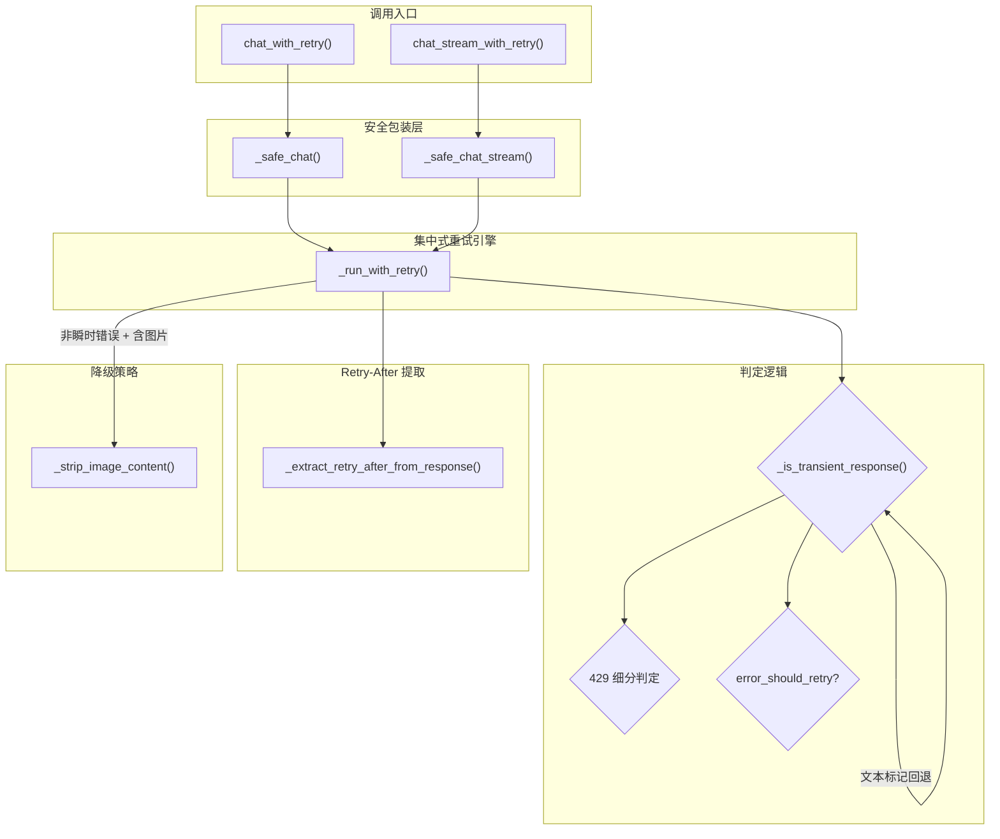
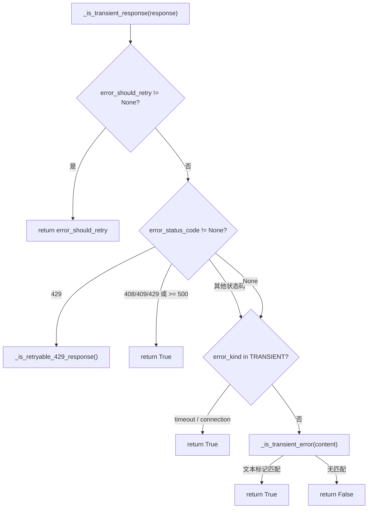
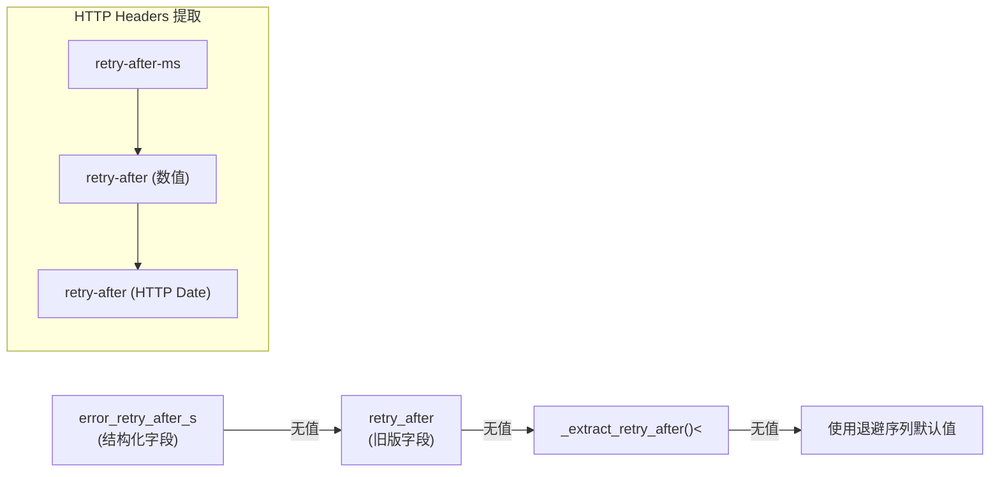
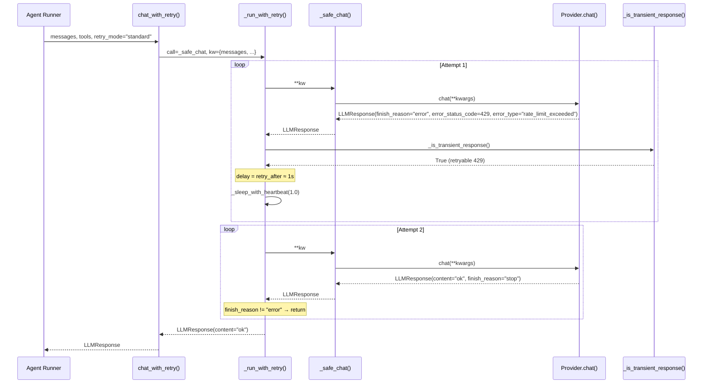

nanobot 的 Provider 层在调用 LLM API 时面临两类典型故障：**瞬时错误**（速率限制、服务过载、网络超时）和**永久错误**（认证失败、配额耗尽、请求格式不正确）。本文深入解析 `LLMProvider` 基类中集中式重试引擎的完整架构——从错误元数据的结构化提取、瞬时错误的智能判定，到两种重试模式（standard / persistent）的执行策略，以及 `retry-after` 时间的多源提取和图片降级机制。这套机制确保所有 Provider 后端共享统一的错误处理语义，同时保留各 SDK 特有的错误信息提取能力。

Sources: [base.py](nanobot/providers/base.py#L1-L668)

## 架构总览：集中式重试引擎

nanobot 的重试策略遵循一个核心设计原则：**禁用所有 SDK 内置重试，由 `LLMProvider` 基类统一控制**。每个 Provider 后端（OpenAI Compat、Anthropic、Azure OpenAI、OpenAI Codex）在初始化 SDK 客户端时均设置 `max_retries=0`，将重试决策权完全交给基类的 `_run_with_retry` 方法。这种设计避免了 SDK 重试与框架重试的"重试放大"问题——即两层重试叠加导致总等待时间指数级膨胀。

Sources: [base.py](nanobot/providers/base.py#L378-L395), [test_provider_sdk_retry_defaults.py](tests/providers/test_provider_sdk_retry_defaults.py#L1-L34)

整个调用链路的入口是 `chat_with_retry()` 和 `chat_stream_with_retry()` 两个公共方法。它们首先将未指定的生成参数（`temperature`、`max_tokens`、`reasoning_effort`）回退到 `self.generation` 默认值，然后委托给 `_run_with_retry()` 执行核心重试循环。`_safe_chat()` / `_safe_chat_stream()` 作为异常屏障，将所有未预期的异常（除 `CancelledError` 外）转换为 `finish_reason="error"` 的 `LLMResponse`，确保重试引擎永远不会因为裸异常而崩溃。

Sources: [base.py](nanobot/providers/base.py#L458-L494), [base.py](nanobot/providers/base.py#L378-L422)

## 错误元数据：LLMResponse 的七维错误描述

`LLMResponse` 数据类定义了七个专门用于错误场景的字段，构成了一套结构化的错误描述体系。当 `finish_reason == "error"` 时，这些字段为重试决策提供远比纯文本匹配更精确的信号。

| 字段 | 类型 | 语义 | 示例值 |
|------|------|------|--------|
| `error_status_code` | `int \| None` | HTTP 状态码 | `429`, `500`, `408` |
| `error_kind` | `str \| None` | 错误类别（框架推断） | `"timeout"`, `"connection"` |
| `error_type` | `str \| None` | Provider 语义类型 | `"insufficient_quota"`, `"rate_limit_error"` |
| `error_code` | `str \| None` | Provider 语义代码 | `"rate_limit_exceeded"` |
| `error_retry_after_s` | `float \| None` | 结构化重试等待时间（秒） | `0.25`, `20.0` |
| `error_should_retry` | `bool \| None` | Provider 显式重试建议 | `True`, `False` |
| `retry_after` | `float \| None` | 旧版重试等待时间（向后兼容） | `9.0` |

Sources: [base.py](nanobot/providers/base.py#L48-L64)

### Provider 后端的错误元数据提取

各 Provider 后端在 `_handle_error()` 静态方法中实现自己的错误元数据提取逻辑。尽管提取方式不同，最终都归一化为同一套 `LLMResponse` 字段。

**OpenAI Compat Provider** 的 `_extract_error_metadata()` 方法最为完整——它从异常对象中提取 `status_code`、从 HTTP 响应头中读取 `x-should-retry` 和 `retry-after-ms` / `retry-after`、从响应体 JSON 中解析 `error.type` 和 `error.code`，并通过异常类名推断 `error_kind`（`"timeout"` 或 `"connection"`）。

**Anthropic Provider** 的 `_handle_error()` 方法遵循类似模式，额外处理了 Anthropic SDK 特有的 `body` 属性（而非 OpenAI SDK 的 `doc` 属性），并从响应体的 `error.type` 字段提取语义类型。

**Azure OpenAI Provider** 和 **OpenAI Codex Provider** 目前使用简化版错误处理，仅提取 `retry_after` 而不填充完整的结构化元数据。

Sources: [openai_compat_provider.py](nanobot/providers/openai_compat_provider.py#L652-L718), [anthropic_provider.py](nanobot/providers/anthropic_provider.py#L56-L109), [azure_openai_provider.py](nanobot/providers/azure_openai_provider.py#L116-L124), [test_provider_error_metadata.py](tests/providers/test_provider_error_metadata.py#L1-L82)

## 瞬时错误判定：三级优先级决策链

`_is_transient_response()` 方法实现了一条**三级优先级决策链**来判定错误是否为瞬时可重试的。这条链路的设计哲学是：**结构化信号优先于启发式推断**。

**第一级：Provider 显式建议（`error_should_retry`）**。当 SDK 在响应头中设置了 `x-should-retry: true/false` 时，这是最权威的信号。例如 Anthropic API 在 408 超时响应中设置 `x-should-retry: true`，nanobot 直接采纳而不再进行其他推断。

**第二级：结构化状态码与语义 Token**。当 `error_status_code` 存在时，429 状态码进入专门的细分判定（见下节），而 408/409 状态码以及所有 5xx 状态码被判定为瞬时错误。`error_kind` 字段中的 `"timeout"` 或 `"connection"` 同样触发重试。

**第三级：文本标记回退**。当上述结构化信号均不存在时，`_is_transient_error()` 将错误消息文本小写化后，检查是否包含预定义的标记词组集合（`_TRANSIENT_ERROR_MARKERS`），如 `"429"`, `"rate limit"`, `"500"`, `"timeout"`, `"connection"` 等。这确保了即使是不提供结构化错误信息的第三方 API（如某些国产模型或自部署网关），nanobot 仍能通过文本模式识别瞬时错误。

Sources: [base.py](nanobot/providers/base.py#L277-L299), [base.py](nanobot/providers/base.py#L87-L100)

### 429 状态码的精细判定

HTTP 429（Too Many Requests）是一个语义高度分裂的状态码——它可能表示"请求太快，稍后重试"（可重试），也可能表示"账户配额已耗尽"（永久错误）。nanobot 通过 **否定优先 + 肯定次之 + 默认可重试** 的三级策略来精确区分：

1. **否定检查（不可重试）**：首先检查 `error_type` 和 `error_code` 中的语义 Token 是否命中 `_NON_RETRYABLE_429_ERROR_TOKENS`（如 `insufficient_quota`、`billing_hard_limit_reached`），然后检查错误文本是否包含 `_NON_RETRYABLE_429_TEXT_MARKERS`。任一命中即判定为不可重试。

2. **肯定检查（可重试）**：检查语义 Token 是否命中 `_RETRYABLE_429_ERROR_TOKENS`（如 `rate_limit_exceeded`、`overloaded_error`），或文本是否包含 `_RETRYABLE_429_TEXT_MARKERS`（如 `"rate limit"`、`"too many requests"`）。

3. **默认可重试**：如果上述检查均未命中（未知的 429 错误），默认判定为可重试——这是"宁可多等也不要误杀"的策略选择。

Sources: [base.py](nanobot/providers/base.py#L334-L354), [base.py](nanobot/providers/base.py#L103-L146)

## 两种重试模式：Standard 与 Persistent

nanobot 提供两种重试模式，通过配置文件中的 `provider_retry_mode` 字段选择，默认为 `"standard"`。

| 特性 | Standard | Persistent |
|------|----------|------------|
| 最大重试次数 | 3 次（由 `_CHAT_RETRY_DELAYS` 长度决定） | 无上限 |
| 退避序列 | `(1s, 2s, 4s)` 固定 | `(1s, 2s, 4s, 4s, 4s, ...)` 上限 60s |
| 终止条件 | 尝试次数超过 3 | 连续 10 次相同错误 |
| 适用场景 | 交互式对话 | 后台服务（如 Heartbeat） |
| 配置路径 | `agents.defaults.provider_retry_mode` | 同左 |

### Standard 模式：固定退避序列

在 standard 模式下，重试引擎最多执行 `len(_CHAT_RETRY_DELAYS)` 次重试（默认 3 次），退避延迟依次为 1 秒、2 秒、4 秒。如果 Provider 建议了更长的 `retry_after` 时间，则采用建议值。3 次重试耗尽后，返回最后一次的错误响应。

### Persistent 模式：无限重试与相同错误检测

Persistent 模式设计用于无人值守的后台场景（如 Heartbeat 定时任务）。它不会在固定次数后放弃，而是持续重试直到遇到以下终止条件之一：**非瞬时错误**（立即终止），或 **连续 10 次内容完全相同的瞬时错误**（由 `_PERSISTENT_IDENTICAL_ERROR_LIMIT` 控制）。

相同错误检测通过将每次错误响应的文本内容（去除首尾空白并小写化）作为 `error_key` 进行比较。如果错误内容发生变化（例如服务从 503 变为 429），计数器重置。这种设计避免了因 API 持续返回同一种不可恢复错误而导致的无限循环。

两种模式共享的延迟上限为 `_PERSISTENT_MAX_DELAY = 60s`，每次延迟取 `Provider 建议值` 和 `当前退避步长` 中的较大值，但不超过 60 秒。

Sources: [base.py](nanobot/providers/base.py#L593-L662), [base.py](nanobot/providers/base.py#L83-L86), [config/schema.py](nanobot/config/schema.py#L76), [test_provider_retry.py](tests/providers/test_provider_retry.py#L432-L453)

## Retry-After 时间提取：四层回退策略

重试等待时间的提取遵循一条**四层优先级回退链**，确保在各种 API 实现中都能获得准确的等待时间。

**第一层：`error_retry_after_s` 字段**。由 Provider 的 `_handle_error()` 方法从 HTTP 响应头中提取并写入结构化字段。这是最精确的来源，因为 SDK 通常会解析头信息中的单位（毫秒 vs 秒）和格式（数值 vs HTTP 日期）。

**第二层：`retry_after` 字段**。向后兼容字段，部分 Provider 后端仍使用此字段传递等待时间。

**第三层：`_extract_retry_after()` 文本解析**。当响应头中无 `retry-after` 信息时，nanobot 通过四组正则表达式从错误消息文本中提取等待时间：`"retry after N unit"`、`"try again in N unit"`、`"wait N unit before retry"`、以及 JSON 格式的 `"retry_after":N`。支持 `ms`、`s`、`m` 等多种时间单位，统一转换为秒。

**第四层：退避序列默认值**。当以上所有来源均无有效值时，使用 `_CHAT_RETRY_DELAYS` 中对应尝试次数的默认延迟。

### HTTP 响应头的精确解析

`_extract_retry_after_from_headers()` 方法处理三种常见的响应头格式：`retry-after-ms`（毫秒数值，优先级最高）、`retry-after`（秒数值或 HTTP 日期字符串）。对于 HTTP 日期格式（如 `"Wed, 21 Oct 2015 07:28:00 GMT"`），使用 Python 标准库的 `parsedate_to_datetime()` 解析后计算相对于当前时间的剩余秒数。所有提取的时间值都通过 `max(0.1, value)` 确保不低于 0.1 秒。

Sources: [base.py](nanobot/providers/base.py#L496-L571), [base.py](nanobot/providers/base.py#L640-L644), [test_provider_retry.py](tests/providers/test_provider_retry.py#L216-L263)

## 图片降级：非瞬时错误的自动修复

当遇到**非瞬时错误且请求中包含图片内容**时，`_run_with_retry()` 触发一次图片降级重试：将所有 `image_url` 类型的内容块替换为文本占位符（如 `"[image: /media/test.png]"`），然后使用降级后的消息重新调用 Provider。这是一次**单次重试**——如果降级后仍然失败，直接返回错误。

这个机制解决了一个实际痛点：许多 LLM API（尤其是国产模型或较旧的 API 版本）不支持图片输入，但返回的错误消息往往模糊不清（如中文提示"API调用参数有误"），无法被瞬时错误检测器识别为可重试。通过自动移除图片并重试，nanobot 能够从这类"伪永久错误"中自我恢复。

值得注意的是，图片降级仅触发一次——如果原始请求中的图片被降级后仍然失败，不会再次尝试（否则将导致死循环）。

Sources: [base.py](nanobot/providers/base.py#L621-L630), [base.py](nanobot/providers/base.py#L356-L376), [test_provider_retry.py](tests/providers/test_provider_retry.py#L148-L213)

## 心跳等待与进度回调

在重试等待期间，`_sleep_with_heartbeat()` 方法每 30 秒（`_RETRY_HEARTBEAT_CHUNK`）触发一次 `on_retry_wait` 回调，向用户界面报告等待进度。这意味着即使等待时间长达数分钟（例如 persistent 模式下持续 60 秒的退避），用户也不会看到完全无响应的状态——每 30 秒会收到类似 `"Model request failed, retry in 45s (attempt 3)."` 的进度消息。

回调消息的格式会根据重试模式调整措辞：standard 模式显示 `"retry"`，persistent 模式显示 `"persistent retry"`，帮助用户区分当前的重试上下文。

Sources: [base.py](nanobot/providers/base.py#L573-L591)

## 完整重试流程时序图

以下时序图展示了 standard 模式下一次典型的瞬时错误重试流程：

Sources: [base.py](nanobot/providers/base.py#L593-L662), [runner.py](nanobot/agent/runner.py#L344-L364)

## 配置参考

重试策略的核心配置通过 `agents.defaults` 节点控制，以下为相关字段汇总：

| 配置路径 | 类型 | 默认值 | 说明 |
|----------|------|--------|------|
| `agents.defaults.provider_retry_mode` | `"standard" \| "persistent"` | `"standard"` | 重试模式选择 |
| `agents.defaults.max_tokens` | `int` | `8192` | 传递给 Provider 的默认最大 Token 数 |
| `agents.defaults.temperature` | `float` | `0.1` | 传递给 Provider 的默认采样温度 |
| `agents.defaults.reasoning_effort` | `str \| None` | `None` | 推理强度（`low/medium/high`） |

Sources: [schema.py](nanobot/config/schema.py#L70-L78)

在运行时，`AgentLoop` 将 `provider_retry_mode` 传递给 `AgentRunSpec`，后者在 `_request_model()` 中将其作为 `retry_mode` 参数传递给 `chat_with_retry()` 或 `chat_stream_with_retry()`。整个传递链路为：**配置文件 → AgentDefaults → AgentLoop → AgentRunSpec → chat_with_retry()**。

Sources: [loop.py](nanobot/agent/loop.py#L173-L206), [runner.py](nanobot/agent/runner.py#L322-L364)

---

**延伸阅读**：理解 Provider 的重试机制后，建议继续阅读 [Provider 后端实现：OpenAI 兼容、Anthropic、Azure、OAuth](14-provider-hou-duan-shi-xian-openai-jian-rong-anthropic-azure-oauth) 了解各后端如何具体实现 `_handle_error()` 方法，以及 [Agent Runner：共享执行引擎与上下文压缩策略](6-agent-runner-gong-xiang-zhi-xing-yin-qing-yu-shang-xia-wen-ya-suo-ce-lue) 了解重试策略如何嵌入到完整的 Agent 执行流程中。