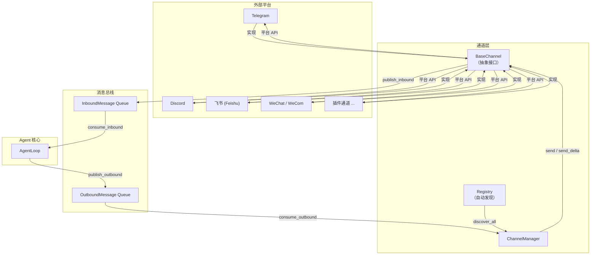

nanobot 的多平台能力建立在一套清晰的**通道抽象层**之上。从整体架构看，通道层位于系统的边缘——向上对接各个即时通讯平台（Telegram、Discord、飞书等），向下通过**消息总线（MessageBus）**与 Agent 核心通信。`BaseChannel` 定义了所有通道必须遵守的契约，`ChannelManager` 负责发现、初始化、调度与容错，而 `registry` 模块则实现了零配置的通道自动发现机制。本文将从接口契约、注册发现、管理器职责三个维度，深入拆解这一架构。

Sources: [base.py](nanobot/channels/base.py#L1-L182), [manager.py](nanobot/channels/manager.py#L1-L296), [registry.py](nanobot/channels/registry.py#L1-L72)

## 架构总览：消息流与核心组件

在深入每个组件之前，先通过一张架构图理解消息在通道层中的流转路径。nanobot 采用**发布-订阅**模式解耦通道与 Agent——通道只需向总线推送 `InboundMessage`，Agent 响应后推送 `OutboundMessage`，由 `ChannelManager` 统一分发到目标通道。这种设计使得任何通道实现都无需了解 Agent 内部逻辑，Agent 也无需感知平台差异。



Sources: [queue.py](nanobot/bus/queue.py#L1-L45), [events.py](nanobot/bus/events.py#L1-L39)

## BaseChannel：通道的抽象契约

`BaseChannel` 是一个 ABC（抽象基类），定义了所有通道实现必须满足的最小接口。它同时提供了一组共享的基础能力——权限检查、音频转录、流式输出判断——使得具体通道可以聚焦于平台适配逻辑。

Sources: [base.py](nanobot/channels/base.py#L15-L181)

### 抽象方法：通道的生命周期

每个通道必须实现三个核心方法，构成一个**启动→运行→停止**的生命周期：

| 方法 | 类型 | 职责 | 典型实现 |
|------|------|------|----------|
| `start()` | 抽象 | 连接平台、注册事件处理器、进入监听循环 | Telegram 通过 `Application.run_polling()` 长轮询；飞书通过 WebSocket 长连接 |
| `stop()` | 抽象 | 断开连接、清理资源 | 关闭 SDK 客户端、取消后台任务 |
| `send(msg)` | 抽象 | 向指定会话发送完整消息 | 调用平台 API 发送文本/媒体 |

`start()` 方法在语义上是一个**长期运行的异步任务**：它连接到聊天平台、持续监听入站消息、并通过 `_handle_message()` 将消息转发到总线。`ChannelManager` 在 `start_all()` 中为每个通道创建独立的 `asyncio.Task`，通过 `asyncio.gather()` 并发运行所有通道。

Sources: [base.py](nanobot/channels/base.py#L68-L96), [manager.py](nanobot/channels/manager.py#L84-L109)

### 可选覆写：流式输出与交互式登录

除三个抽象方法外，`BaseChannel` 还提供了两个可选择性覆写的方法：

**`send_delta(chat_id, delta, metadata)`** — 流式输出。当通道覆写了此方法后，`supports_streaming` 属性会自动检测并返回 `True`（前提是配置中 `streaming: true`）。`ChannelManager` 的出站调度器会识别 `_stream_delta` 和 `_stream_end` 元数据标记，将流式增量路由到 `send_delta` 而非 `send`。以 Telegram 通道为例，它使用**渐进式消息编辑**策略：首条 delta 创建消息，后续 delta 在节流间隔内（默认 0.6 秒）编辑同一消息，`_stream_end` 触发最终渲染。

**`login(force)`** — 交互式登录。部分通道（如微信、WhatsApp）需要用户扫描二维码完成认证。此方法在 `nanobot channels login` 命令中被调用，基类默认返回 `True`（表示无需登录）。

Sources: [base.py](nanobot/channels/base.py#L98-L116), [base.py](nanobot/channels/base.py#L56-L66), [telegram.py](nanobot/channels/telegram.py#L541-L635)

### 内置能力：权限检查与入站消息处理

`_handle_message()` 是所有通道共享的入站处理核心。具体通道在收到平台消息后，提取 `sender_id`、`chat_id`、`content` 等字段，调用此方法完成统一处理：

```
具体通道收到消息 → 调用 _handle_message(sender_id, chat_id, content, ...)
    → is_allowed(sender_id)  // 权限检查
    → 构建 InboundMessage    // 如果 supports_streaming，注入 _wants_stream 标记
    → bus.publish_inbound()  // 发布到总线
```

**`is_allowed(sender_id)`** 实现了一个三层权限逻辑：空 `allow_from` 列表拒绝所有访问（并发出警告）；`["*"]` 允许所有人；否则精确匹配 sender_id。对于 Telegram 通道，`is_allowed()` 还额外支持 `id|username` 格式的匹配，兼顾数字 ID 和用户名两种标识方式。

Sources: [base.py](nanobot/channels/base.py#L117-L171), [base.py](nanobot/channels/base.py#L117-L125)

### 类属性与默认配置

每个通道通过类属性声明自己的身份：

| 属性 | 用途 | 示例 |
|------|------|------|
| `name` | 通道唯一标识，匹配配置键和路由目标 | `"telegram"`, `"discord"` |
| `display_name` | 日志和 UI 展示用的友好名称 | `"Telegram"`, `"Discord"` |

`default_config()` 类方法用于引导式配置（onboard）——返回通道期望的默认配置字典。各通道通常配合独立的 `XxxConfig(Base)` Pydantic 模型来校验和序列化配置，例如 `TelegramConfig`、`WeixinConfig` 等。

Sources: [base.py](nanobot/channels/base.py#L23-L24), [base.py](nanobot/channels/base.py#L173-L176), [telegram.py](nanobot/channels/telegram.py#L181-L194)

## Registry：自动发现机制

通道注册表（`registry.py`）实现了**两层发现策略**——内置通道通过包扫描自动发现，外部插件通过 Python entry_points 注册，两者合并后交付给 `ChannelManager` 使用。

Sources: [registry.py](nanobot/channels/registry.py#L1-L72)

### 内置通道：pkgutil 包扫描

`discover_channel_names()` 使用 `pkgutil.iter_modules` 扫描 `nanobot.channels` 包下的所有模块，排除 `base`、`manager`、`registry` 三个内部模块。这意味着新增内置通道只需在 `nanobot/channels/` 目录下添加一个 `.py` 文件，无需修改任何注册代码。

`load_channel_class(module_name)` 对每个发现的模块执行动态导入，查找其中第一个 `BaseChannel` 的子类并返回。当前内置通道共 12 个：

| 模块 | 通道类 | 平台 |
|------|--------|------|
| telegram | TelegramChannel | Telegram |
| discord | DiscordChannel | Discord |
| feishu | FeishuChannel | 飞书 / Lark |
| weixin | WeixinChannel | 个人微信 |
| wecom | WecomChannel | 企业微信 |
| slack | SlackChannel | Slack |
| email | EmailChannel | 电子邮件 |
| dingtalk | DingTalkChannel | 钉钉 |
| qq | QQChannel | QQ |
| matrix | MatrixChannel | Matrix |
| whatsapp | WhatsAppChannel | WhatsApp |
| mochat | MochatChannel | Mochat |

Sources: [registry.py](nanobot/channels/registry.py#L17-L37)

### 外部插件：entry_points 注册

`discover_plugins()` 扫描 `nanobot.channels` entry_points 组中的所有注册项。第三方包只需在 `pyproject.toml` 中声明：

```toml
[project.entry-points."nanobot.channels"]
mychannel = "my_package.mymodule:MyChannel"
```

即可被自动发现和加载。插件加载失败时会被静默跳过并记录警告，不会影响其他通道。

**内置优先原则**：`discover_all()` 合并两层发现结果时，内置通道始终优先——即使外部插件注册了 `telegram` 名称，也会被内置的 `TelegramChannel` 覆盖，并输出一条警告日志。

Sources: [registry.py](nanobot/channels/registry.py#L40-L71)

## ChannelManager：编排与容错

`ChannelManager` 是通道层的中央编排器，承担三大职责：**通道初始化**、**出站消息调度**、**消息投递容错**。它在 `nanobot run` 启动时被创建，绑定到唯一的 `MessageBus` 实例上。

Sources: [manager.py](nanobot/channels/manager.py#L20-L34)

### 初始化流程

构造时，`ChannelManager` 执行以下步骤：

1. 调用 `discover_all()` 获取所有可用的通道类
2. 遍历每个通道类，从 `ChannelsConfig` 中查找对应的配置节
3. 如果配置节存在且 `enabled: true`，实例化通道对象
4. 注入全局转录提供者（Groq/OpenAI API Key）
5. 校验所有已启用通道的 `allow_from` 是否为空——空列表意味着拒绝所有用户访问，此时直接触发 `SystemExit` 阻止启动

`ChannelsConfig` 使用 Pydantic 的 `extra="allow"` 配置，这意味着它不预定义任何通道字段——每个通道的配置都作为动态额外字段存储。通道在自己的 `__init__` 中将原始字典解析为强类型的 Pydantic 配置模型。

Sources: [manager.py](nanobot/channels/manager.py#L38-L82), [schema.py](nanobot/config/schema.py#L18-L31)

### 出站消息调度器

`_dispatch_outbound()` 是一个持续运行的异步循环，从 `MessageBus.outbound` 队列消费 `OutboundMessage`，路由到目标通道。它的核心逻辑包括：

**进度/工具提示过滤**：通过 `send_progress` 和 `send_tool_hints` 全局配置项，控制是否转发 Agent 的进度更新和工具调用提示消息。

**增量合并（Delta Coalescing）**：当队列中积累了同一 `(channel, chat_id)` 的多个连续 `_stream_delta` 消息时，调度器会将它们合并为一条，减少 API 调用次数。合并遇到以下三种情况之一即停止：队列为空、遇到 `_stream_end` 标记、遇到不同目标或非 delta 消息。不匹配的消息被放入 `pending` 缓冲区，在下一轮循环中优先处理。

**消息分发**：根据消息元数据选择发送路径——`_stream_delta` 或 `_stream_end` 标记的消息走 `send_delta()`，已流式完成的消息（`_streamed`）被跳过，其余走 `send()`。

Sources: [manager.py](nanobot/channels/manager.py#L148-L246), [manager.py](nanobot/channels/manager.py#L190-L196)

### 投递容错：指数退避重试

`_send_with_retry()` 为所有出站消息提供统一的容错层。重试次数由 `ChannelsConfig.send_max_retries`（默认 3 次）控制，退避间隔遵循 `(1s, 2s, 4s)` 的指数序列。关键设计细节：

- **`CancelledError` 不被捕获**：在重试循环中，`asyncio.CancelledError` 被立即重新抛出，确保进程优雅关闭时不会卡在重试等待中
- **最终失败静默处理**：达到最大重试次数后，消息被丢弃并记录错误日志，不会中断调度循环
- **通道实现只需 `raise`**：具体通道的 `send()` 和 `send_delta()` 在遇到平台错误时直接抛出异常，重试策略完全由管理器统一管控

Sources: [manager.py](nanobot/channels/manager.py#L248-L276)

### 生命周期管理与重启通知

`start_all()` 为每个通道创建独立的 `asyncio.Task` 并并发启动，同时创建出站调度器任务。所有任务通过 `asyncio.gather(return_exceptions=True)` 等待，任一通道崩溃不会影响其他通道。

一个特殊的生命周期钩子是**重启完成通知**：当 nanobot 通过 `/restart` 命令重启时，`_notify_restart_done_if_needed()` 会检测环境变量中的重启标记，向触发重启的通道/会话发送一条"重启完成"消息，告知用户停机时间。

Sources: [manager.py](nanobot/channels/manager.py#L91-L147)

## 消息数据模型

通道与 Agent 之间的所有通信通过两个数据类承载：

| 字段 | `InboundMessage` | `OutboundMessage` |
|------|:---:|:---:|
| `channel` | ✅ 来源通道名称 | ✅ 目标通道名称 |
| `sender_id` | ✅ 发送者标识 | — |
| `chat_id` | ✅ 会话标识 | ✅ 会话标识 |
| `content` | ✅ 文本内容 | ✅ 文本内容 |
| `media` | ✅ 媒体 URL 列表 | ✅ 媒体文件路径 |
| `metadata` | ✅ 通道特定元数据 | ✅ 调度控制元数据 |
| `session_key` | ✅ 自动生成 `channel:chat_id` | — |
| `reply_to` | — | ✅ 回复目标消息 ID |

`InboundMessage.session_key` 默认由 `channel:chat_id` 组合生成，用于 [会话管理器](23-hui-hua-guan-li-qi-dui-hua-li-shi-xiao-xi-bian-jie-yu-he-bing-ce-lue) 标识独立对话。`metadata` 字段承载了通道间的协议信令——`_stream_delta`、`_stream_end`、`_progress`、`_tool_hint` 等标记通过此字段传递。

Sources: [events.py](nanobot/bus/events.py#L1-L39)

## 设计模式总结

整个通道架构体现了三个关键设计模式：

**策略模式（Strategy）**：`BaseChannel` 定义了统一的操作接口，每个具体通道是一个可替换的策略。Agent 核心通过 `OutboundMessage.channel` 字段选择策略，完全与平台实现解耦。

**观察者模式（Observer）**：`MessageBus` 的两个队列构成了发布-订阅通道。通道发布入站消息，Agent 发布出站消息，双方互不知道对方的存在——这种解耦使得 Agent 可以同时服务于多个通道，通道也可以独立演进。

**模板方法模式（Template Method）**：`_handle_message()` 是一个模板方法，固定了权限检查、元数据注入、总线发布的执行顺序，具体通道只需在适当的位置调用它，无需重复编写这些横切逻辑。

Sources: [base.py](nanobot/channels/base.py#L127-L171), [queue.py](nanobot/bus/queue.py#L8-L34)

---

**下一步阅读**：本文聚焦于通道层的架构骨架。要了解各平台的具体配置方法，请参阅 [内置通道配置指南（Telegram、Discord、飞书、微信等）](17-nei-zhi-tong-dao-pei-zhi-zhi-nan-telegram-discord-fei-shu-wei-xin-deng)；要了解如何开发自定义通道，请参阅 [通道插件开发：从零构建自定义通道](18-tong-dao-cha-jian-kai-fa-cong-ling-gou-jian-zi-ding-yi-tong-dao)；要理解流式输出的完整链路，请参阅 [流式输出与增量消息合并机制](19-liu-shi-shu-chu-yu-zeng-liang-xiao-xi-he-bing-ji-zhi)。