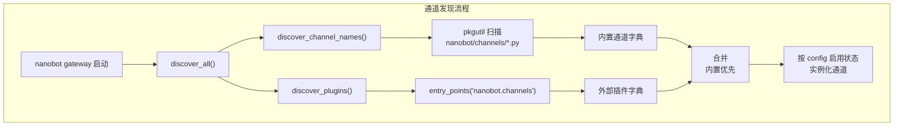
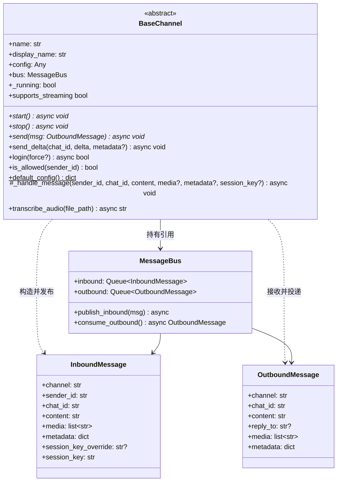
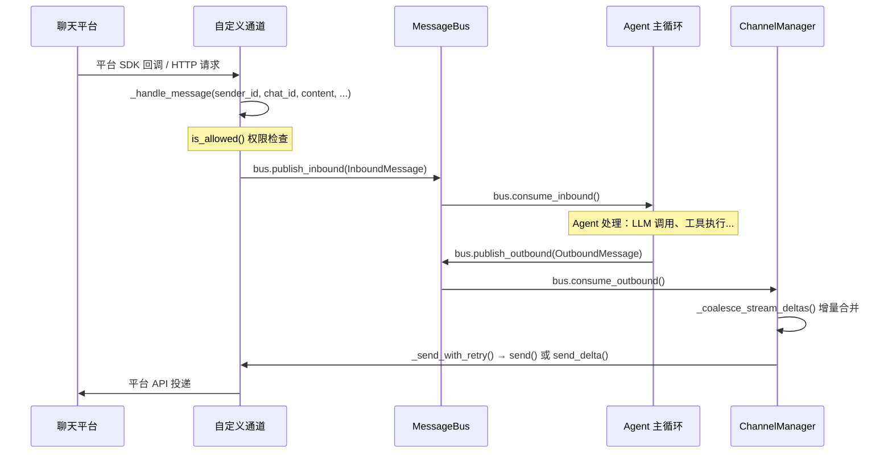
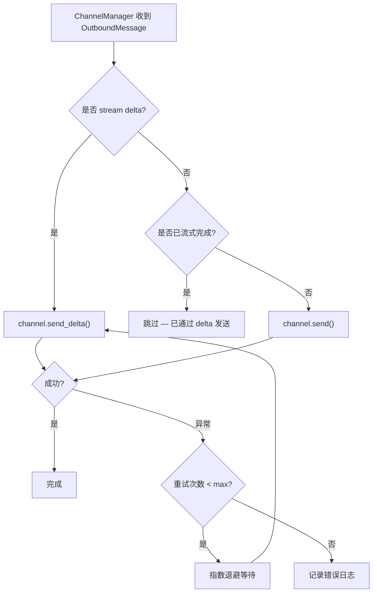

nanobot 的通道系统采用**消息总线驱动的插件架构**——每个聊天平台（Telegram、Discord、Slack 等）都被封装为一个独立的通道插件，通过统一的 `BaseChannel` 抽象接口与核心 Agent 解耦。本文将从第一性原理出发，完整演示如何构建、打包、注册一个自定义通道插件，使 nanobot 能接入任何你想要的聊天平台。阅读本文前，建议先了解 [通道架构：BaseChannel 接口与通道管理器](16-tong-dao-jia-gou-basechannel-jie-kou-yu-tong-dao-guan-li-qi) 中描述的整体设计。

Sources: [base.py](nanobot/channels/base.py#L1-L182), [registry.py](nanobot/channels/registry.py#L1-L72)

## 插件发现机制：entry_points 自动注册

nanobot 的通道发现分为两层：**内置通道扫描**和**外部插件注册**。内置通道通过 `pkgutil.iter_modules` 扫描 `nanobot/channels/` 目录下所有非 `base`、`manager`、`registry` 模块，自动提取其中 `BaseChannel` 的子类。外部插件则通过 Python 标准的 [entry_points](https://packaging.python.org/en/latest/specifications/entry-points/) 机制注册到 `nanobot.channels` 组下，在运行时由 `importlib.metadata.entry_points` 动态加载。



关键设计原则是**内置通道优先**——如果一个外部插件与内置通道同名（如同时注册了 `telegram`），外部插件会被静默忽略并输出警告日志。这保证了核心通道的稳定性不会被意外覆盖。

Sources: [registry.py](nanobot/channels/registry.py#L40-L72), [manager.py](nanobot/channels/manager.py#L38-L65)

## BaseChannel 接口契约

`BaseChannel` 是所有通道的抽象基类，定义了一套精简但完整的生命周期接口。理解这个契约是构建插件的核心。



| 方法/属性 | 类型 | 必须实现 | 说明 |
|-----------|------|----------|------|
| `start()` | 抽象方法 | **是** | 启动通道，连接平台并开始监听。**必须阻塞**——方法返回意味着通道死亡 |
| `stop()` | 抽象方法 | **是** | 停止通道并清理资源 |
| `send(msg)` | 抽象方法 | **是** | 向平台投递出站消息。发送失败应抛异常，由 ChannelManager 统一重试 |
| `send_delta()` | 虚方法 | 否 | 流式输出块。重写此方法并设置 `streaming: true` 即启用流式传输 |
| `login(force)` | 虚方法 | 否 | 交互式认证（如二维码扫描）。默认返回 `True` |
| `default_config()` | 类方法 | 建议 | 返回默认配置字典，供 `nanobot onboard` 自动填充 config.json |
| `_handle_message()` | 受保护方法 | 不重写 | **调用此方法**将入站消息发布到总线，自动处理权限检查和流式标记 |
| `is_allowed()` | 公开方法 | 可重写 | 检查 sender_id 是否在 `allow_from` 白名单中 |
| `supports_streaming` | 属性 | 不重写 | 配置启用流式且子类重写了 `send_delta` 时返回 `True` |

Sources: [base.py](nanobot/channels/base.py#L15-L182), [events.py](nanobot/bus/events.py#L1-L39)

## 数据流：从入站到出站的完整路径

理解消息在系统中的流转路径，对正确实现通道至关重要：



入站时，通道在平台 SDK 回调中调用 `_handle_message()`，由它完成权限校验后构造 `InboundMessage` 并放入 `bus.inbound` 队列。出站时，`ChannelManager` 从 `bus.outbound` 队列消费 `OutboundMessage`，经过增量合并（delta coalescing）后调用通道的 `send()` 或 `send_delta()` 进行投递，失败时自动以指数退避策略重试（1s → 2s → 4s，最多 `send_max_retries` 次）。

Sources: [base.py](nanobot/channels/base.py#L127-L171), [manager.py](nanobot/channels/manager.py#L148-L246), [queue.py](nanobot/bus/queue.py#L1-L45)

## 实战：构建 Webhook 通道插件

下面我们构建一个完整的 Webhook 通道——通过 HTTP POST 接收消息，并将 Agent 回复 POST 到回调 URL。这是一个足够实用又足够简洁的示例，展示了所有关键接口的正确用法。

### 项目结构

```
nanobot-channel-webhook/
├── nanobot_channel_webhook/
│   ├── __init__.py          # 导出 WebhookChannel
│   └── channel.py           # 通道实现
└── pyproject.toml           # 包声明与 entry_point 注册
```

### 第一步：定义 Pydantic 配置模型

通道配置**必须**继承 `nanobot.config.schema.Base`（不是直接继承 `BaseModel`）。这是因为 `Base` 配置了 `alias_generator=to_camel` 和 `populate_by_name=True`，使得 `config.json` 中的 `camelCase` 键（如 `allowFrom`）和 Python 中的 `snake_case` 属性（如 `allow_from`）可以互相兼容。

```python
# nanobot_channel_webhook/channel.py
from typing import Any
from pydantic import Field
from nanobot.config.schema import Base


class WebhookConfig(Base):
    """Webhook 通道配置。"""
    enabled: bool = False
    port: int = 9000                          # HTTP 监听端口
    callback_url: str = ""                    # 出站回调 URL
    secret: str = ""                          # 签名密钥（可选）
    allow_from: list[str] = Field(default_factory=list)
```

> **关键细节**：`BaseChannel.is_allowed()` 通过 `getattr(self.config, "allow_from", [])` 读取白名单。如果 config 是普通 `dict`，`getattr(dict, "allow_from")` 会返回默认值 `[]`，导致所有用户被拒绝。使用 Pydantic 模型可以确保 `allow_from` 作为真实 Python 属性存在，使权限检查正确工作。

Sources: [schema.py](nanobot/config/schema.py#L13-L16), [base.py](nanobot/channels/base.py#L117-L126)

### 第二步：实现 BaseChannel 子类

```python
# nanobot_channel_webhook/channel.py（续）
import asyncio
import hashlib
import hmac

import httpx
from aiohttp import web
from loguru import logger

from nanobot.bus.events import OutboundMessage
from nanobot.bus.queue import MessageBus
from nanobot.channels.base import BaseChannel


class WebhookChannel(BaseChannel):
    name = "webhook"            # 配置节名：channels.webhook
    display_name = "Webhook"    # CLI 显示名

    def __init__(self, config: Any, bus: MessageBus):
        # 关键：将 raw dict 转为 Pydantic 模型
        if isinstance(config, dict):
            config = WebhookConfig(**config)
        super().__init__(config, bus)
        self._runner: web.AppRunner | None = None

    @classmethod
    def default_config(cls) -> dict[str, Any]:
        """返回默认配置，供 nanobot onboard 自动填充。"""
        return WebhookConfig().model_dump(by_alias=True)

    async def start(self) -> None:
        """启动 HTTP 服务器并阻塞。

        ⚠️ start() 必须阻塞直到 stop() 被调用。
        如果方法返回，ChannelManager 会认为该通道已死亡。
        """
        self._running = True
        app = web.Application()
        app.router.add_post("/message", self._on_request)
        self._runner = web.AppRunner(app)
        await self._runner.setup()
        site = web.TCPSite(self._runner, "0.0.0.0", self.config.port)
        await site.start()
        logger.info("Webhook channel listening on :{}", self.config.port)

        # 阻塞循环——这是必须的
        while self._running:
            await asyncio.sleep(1)

        # 清理
        if self._runner:
            await self._runner.cleanup()

    async def stop(self) -> None:
        """设置停止标志，使 start() 中的阻塞循环退出。"""
        self._running = False

    async def send(self, msg: OutboundMessage) -> None:
        """投递出站消息。

        Args:
            msg.content  — Markdown 文本（按需转换为平台格式）
            msg.media    — 本地文件路径列表
            msg.chat_id  — 接收者（即 _handle_message 中传入的 chat_id）
            msg.metadata — 可能包含 "_progress": True 等标记
        """
        if not self.config.callback_url:
            logger.warning("[webhook] No callback_url configured, dropping message")
            return

        payload = {
            "chat_id": msg.chat_id,
            "content": msg.content,
            "media": msg.media,
            "metadata": msg.metadata,
        }

        headers = {"Content-Type": "application/json"}
        if self.config.secret:
            sig = hmac.new(
                self.config.secret.encode(), 
                str(payload).encode(), 
                hashlib.sha256
            ).hexdigest()
            headers["X-Webhook-Signature"] = sig

        async with httpx.AsyncClient() as client:
            await client.post(
                self.config.callback_url,
                json=payload,
                headers=headers,
                timeout=30.0,
            )

    async def _on_request(self, request: web.Request) -> web.Response:
        """处理入站 HTTP POST 请求。"""
        try:
            body = await request.json()
        except Exception:
            return web.json_response({"error": "Invalid JSON"}, status=400)

        sender = body.get("sender", "unknown")
        chat_id = body.get("chat_id", sender)
        text = body.get("text", "")
        media = body.get("media", [])

        # 核心：调用 _handle_message 完成权限检查并发布到总线
        await self._handle_message(
            sender_id=sender,
            chat_id=chat_id,
            content=text,
            media=media,
        )
        return web.json_response({"ok": True})
```

Sources: [base.py](nanobot/channels/base.py#L28-L38), [base.py](nanobot/channels/base.py#L56-L78), [base.py](nanobot/channels/base.py#L127-L171)

### 第三步：注册 entry_point

在 `pyproject.toml` 中声明入口点——**键名将成为 config.json 中的配置节名**：

```toml
# pyproject.toml
[project]
name = "nanobot-channel-webhook"
version = "0.1.0"
dependencies = ["nanobot-ai", "aiohttp", "httpx"]

[project.entry-points."nanobot.channels"]
webhook = "nanobot_channel_webhook:WebhookChannel"

[build-system]
requires = ["setuptools"]
build-backend = "setuptools.backends._legacy:_Backend"
```

`entry_points` 的键（`webhook`）必须与通道类的 `name` 属性一致，因为它被用作配置节名（`channels.webhook`）和内部路由标识。值 `"nanobot_channel_webhook:WebhookChannel"` 是标准的模块路径语法，指向你的 `BaseChannel` 子类。

Sources: [registry.py](nanobot/channels/registry.py#L40-L51)

### 第四步：安装与配置

```bash
# 开发模式安装
pip install -e .

# 验证插件已被发现
nanobot plugins list
# 输出应包含:
#   Name       Source    Enabled
#   Webhook    plugin    no

# 自动填充默认配置
nanobot onboard
```

`nanobot onboard` 会调用每个已发现通道的 `default_config()` 方法，将默认配置注入到 `config.json` 中。如果配置节已存在，它会递归合并缺失的默认值而不覆盖用户的自定义配置。编辑 `~/.nanobot/config.json` 启用通道：

```json
{
  "channels": {
    "webhook": {
      "enabled": true,
      "port": 9000,
      "callbackUrl": "https://your-server.com/webhook/receive",
      "secret": "your-signing-secret",
      "allowFrom": ["*"]
    }
  }
}
```

然后启动网关：

```bash
nanobot gateway
```

测试入站消息：

```bash
curl -X POST http://localhost:9000/message \
  -H "Content-Type: application/json" \
  -d '{"sender": "user1", "chat_id": "user1", "text": "你好，nanobot！"}'
```

Sources: [commands.py](nanobot/cli/commands.py#L382-L403), [commands.py](nanobot/cli/commands.py#L1241-L1272)

## 命名规范

一致性的命名能避免大量困惑。nanobot 的通道插件遵循以下约定：

| 概念 | 格式 | 示例 |
|------|------|------|
| PyPI 包名 | `nanobot-channel-{name}` | `nanobot-channel-webhook` |
| Entry point 键 | `{name}` | `webhook` |
| 配置节路径 | `channels.{name}` | `channels.webhook` |
| Python 包名 | `nanobot_channel_{name}` | `nanobot_channel_webhook` |
| `name` 属性 | `{name}` | `"webhook"` |
| `display_name` 属性 | 人类可读名称 | `"Webhook"` |

`name`、entry point 键和配置节名三者必须完全一致。这是 `ChannelManager._init_channels()` 通过 `discover_all()` 返回的字典键来匹配配置节的依据。

Sources: [manager.py](nanobot/channels/manager.py#L38-L65)

## 流式输出支持

通道可以选择实现实时流式输出——Agent 逐 token 发送内容，而非等待完整响应后一次性发送。这是一个完全可选的功能。

### 启用条件

流式输出需要**同时满足**两个条件：

1. 配置中设置 `"streaming": true`
2. 子类重写了 `send_delta()` 方法

如果任一条件不满足，系统会自动退回到普通的 `send()` 一次性投递路径。`supports_streaming` 属性会自动判断这两个条件。

Sources: [base.py](nanobot/channels/base.py#L98-L116)

### 实现模式

```python
class WebhookChannel(BaseChannel):
    # ... 基础实现同上 ...

    def __init__(self, config: Any, bus: MessageBus):
        if isinstance(config, dict):
            config = WebhookConfig(**config)
        super().__init__(config, bus)
        self._buffers: dict[str, str] = {}  # chat_id → 累积文本

    async def send_delta(
        self,
        chat_id: str,
        delta: str,
        metadata: dict[str, Any] | None = None,
    ) -> None:
        """处理流式文本块。

        Args:
            chat_id: 目标会话 ID
            delta: 增量文本（几个 token）
            metadata: 包含流式标记的字典
        """
        meta = metadata or {}

        if meta.get("_stream_end"):
            # 流结束——发送最终完整文本
            full_text = self._buffers.pop(chat_id, "")
            await self._deliver_final(chat_id, full_text)
            return

        # 累积增量文本
        self._buffers.setdefault(chat_id, "")
        self._buffers[chat_id] += delta

        # 增量推送给客户端（按平台需求实现）
        await self._deliver_partial(chat_id, self._buffers[chat_id])
```

### 元数据标记

| 标记 | 含义 |
|------|------|
| `_stream_delta: True` | 内容增量块，`delta` 包含新文本 |
| `_stream_end: True` | 流结束，`delta` 为空字符串 |
| `_resuming: True` | 后续还有更多流式轮次（例如工具调用后会再次输出） |

对于有状态的平台（如 Telegram 编辑消息），**必须用 `stream_id`（从 metadata 获取）而非仅用 `chat_id` 来索引缓冲区**，因为同一个 `chat_id` 可能在短时间内触发多个独立的流式响应。

Sources: [base.py](nanobot/channels/base.py#L98-L108), [manager.py](nanobot/channels/manager.py#L190-L197)

## 交互式登录

某些通道需要交互式认证流程（如微信二维码扫描）。如果你的通道需要这种能力，重写 `login()` 方法：

```python
async def login(self, force: bool = False) -> bool:
    """执行交互式认证。

    Args:
        force: 为 True 时忽略已有凭据，强制重新认证

    Returns:
        认证成功返回 True，否则返回 False
    """
    # 1. 检查是否已有有效凭据
    if not force and self._load_saved_credentials():
        return True

    # 2. 执行交互式认证（如展示二维码）
    credentials = await self._do_interactive_auth()

    # 3. 持久化凭据
    if credentials:
        self._save_credentials(credentials)
        return True
    return False
```

用户通过 CLI 触发登录：

```bash
nanobot channels login webhook
nanobot channels login webhook --force  # 强制重新认证
```

不需要交互式登录的通道（如使用 Bot Token 的 Telegram、Discord）可以直接继承默认的 `login()` 实现，它返回 `True`。

Sources: [base.py](nanobot/channels/base.py#L56-L66), [commands.py](nanobot/cli/commands.py#L1198-L1231)

## 配置系统深度解析

### ChannelsConfig 的 extra="allow" 设计

`ChannelsConfig` 使用了 Pydantic 的 `extra="allow"` 配置，这意味着它不预定义任何具体的通道字段——所有通道配置（内置和插件）都作为**动态 extra 字段**存储，以原始 `dict` 形式存在：

```python
class ChannelsConfig(Base):
    model_config = ConfigDict(extra="allow")
    send_progress: bool = True
    send_tool_hints: bool = False
    send_max_retries: int = Field(default=3, ge=0, le=10)
    transcription_provider: str = "groq"
```

当 `config.json` 包含 `"channels": {"webhook": {"enabled": true, ...}}` 时，`webhook` 字段会被 Pydantic 存储为 `model_extra["webhook"]`，通过 `__getattr__` 也能以 `config.channels.webhook` 访问。`ChannelManager` 正是利用这个机制来动态获取任意通道的配置节。

Sources: [schema.py](nanobot/config/schema.py#L18-L31), [manager.py](nanobot/channels/manager.py#L38-L65)

### config 转换模式

由于 `ChannelManager` 传入的 `config` 参数可能是 raw dict（来自 `ChannelsConfig` 的 extra 字段），每个通道在 `__init__` 中**必须**处理 dict 输入：

```python
def __init__(self, config: Any, bus: MessageBus):
    if isinstance(config, dict):
        config = WebhookConfig(**config)   # dict → Pydantic model
    super().__init__(config, bus)
    self.config: WebhookConfig = config    # 类型窄化，方便后续访问
```

所有内置通道都严格遵循这个模式。`self.config` 在 `super().__init__` 之后被赋值为 Pydantic 模型实例，后续代码通过属性访问配置值（如 `self.config.port`），而非 `.get()` 方法。

Sources: [slack.py](nanobot/channels/slack.py#L58-L63), [email.py](nanobot/channels/email.py#L116-L120)

## 消息投递与重试机制

`ChannelManager` 为所有通道提供了统一的**指数退避重试**策略。通道的 `send()` 和 `send_delta()` 方法在投递失败时应**直接抛出异常**，不要自行处理重试——Manager 会捕获异常并以 1s → 2s → 4s 的间隔重试，最多尝试 `send_max_retries` 次（默认 3 次，可通过配置调整，范围 0-10）。



重试策略的关键行为：

| 配置项 | 默认值 | 说明 |
|--------|--------|------|
| `send_max_retries` | 3 | 最大投递尝试次数（含首次） |
| 退避间隔 | 1s, 2s, 4s | 固定序列，非几何增长 |
| `CancelledError` | 立即传播 | 不拦截，保证优雅关机 |

Sources: [manager.py](nanobot/channels/manager.py#L248-L277), [schema.py](nanobot/config/schema.py#L26-L31)

## 内置通道参考模式

不同复杂度的内置通道为插件开发者提供了丰富的参考模式。以下是按功能复杂度排列的典型模式：

| 通道 | 复杂度 | 特性亮点 | 参考文件 |
|------|--------|----------|----------|
| Email | 中 | IMAP 轮询入站 + SMTP 出站，anti-spoofing 验证 | [email.py](nanobot/channels/email.py) |
| Slack | 中 | Socket Mode 长连接，线程回复，emoji 反馈 | [slack.py](nanobot/channels/slack.py) |
| Telegram | 高 | 长轮询 + 流式编辑 + Markdown→HTML 转换 + 命令注册 | [telegram.py](nanobot/channels/telegram.py) |
| Discord | 高 | Slash 命令注册 + 文件上传 + 消息分片 | [discord.py](nanobot/channels/discord.py) |
| Matrix | 高 | E2EE 加密 + Markdown→HTML 清洗 + 媒体上传 | [matrix.py](nanobot/channels/matrix.py) |
| WeChat | 高 | 二维码登录 + 会话恢复 + 增量同步 | [weixin.py](nanobot/channels/weixin.py) |
| Mochat | 高 | Socket.IO + 消息缓冲 + 群组 mention 策略 | [mochat.py](nanobot/channels/mochat.py) |

对于大多数插件场景，Email 或 Slack 的实现模式是最佳起点——它们展示了 Pydantic 配置模型、`start()/stop()` 生命周期、`_handle_message()` 调用、以及 `send()` 投递的完整模式，而又不像 Telegram 或 Discord 那样包含过多的平台特定复杂度。

Sources: [email.py](nanobot/channels/email.py#L30-L200), [slack.py](nanobot/channels/slack.py#L30-L148)

## 测试策略

通道插件的测试应覆盖三个层次：**插件发现**、**配置兼容性**、**消息流转**。nanobot 自身的测试套件提供了标准化的 mock 模式：

```python
# 最小可测试通道
class _FakePlugin(BaseChannel):
    name = "fakeplugin"
    display_name = "Fake Plugin"

    async def start(self) -> None:
        pass

    async def stop(self) -> None:
        pass

    async def send(self, msg: OutboundMessage) -> None:
        pass


# 测试：Manager 能从 dict 配置实例化插件
async def test_manager_loads_plugin():
    fake_config = SimpleNamespace(
        channels=ChannelsConfig.model_validate({
            "fakeplugin": {"enabled": True, "allowFrom": ["*"]},
        }),
        providers=SimpleNamespace(groq=SimpleNamespace(api_key="")),
    )

    with patch(
        "nanobot.channels.registry.discover_all",
        return_value={"fakeplugin": _FakePlugin},
    ):
        mgr = ChannelManager.__new__(ChannelManager)
        mgr.config = fake_config
        mgr.bus = MessageBus()
        mgr.channels = {}
        mgr._dispatch_task = None
        mgr._init_channels()

    assert "fakeplugin" in mgr.channels
    assert isinstance(mgr.channels["fakeplugin"], _FakePlugin)
```

关键测试要点：

| 测试场景 | 验证目标 |
|----------|----------|
| `dict → Pydantic` 转换 | `__init__` 正确处理 raw dict 输入 |
| `default_config()` | 返回包含 `enabled: False` 的合法字典 |
| `is_allowed()` | `allowFrom: ["*"]` 允许所有，空列表拒绝所有 |
| 入站消息路由 | `_handle_message()` 正确构造 `InboundMessage` 并放入总线 |
| 出站消息投递 | `send()` 接收到正确的 `OutboundMessage` |
| 插件发现 | entry_point 加载与内置通道不冲突 |
| 禁用状态 | `enabled: false` 的通道不会被实例化 |

Sources: [test_channel_plugins.py](tests/channels/test_channel_plugins.py#L1-L295), [test_channel_plugins.py](tests/channels/test_channel_plugins.py#L302-L348)

## 常见陷阱与最佳实践

| 陷阱 | 原因 | 正确做法 |
|------|------|----------|
| `start()` 立即返回 | ChannelManager 认为通道死亡 | 用 `while self._running: await asyncio.sleep(1)` 阻塞 |
| 使用普通 `dict` 做 config | `getattr(dict, "allow_from")` 返回 `[]`，拒绝所有用户 | 继承 `Base` 的 Pydantic 模型，`__init__` 中转换 |
| `send()` 内自行重试 | 与 Manager 的重试策略冲突，导致指数级重复 | 失败时抛异常，让 Manager 统一重试 |
| entry_point 键与 `name` 不一致 | 配置节匹配失败，通道不会被实例化 | 保持三者完全一致 |
| 阻塞式 I/O 在 `start()` 中 | 阻塞事件循环，影响其他通道 | 使用 `asyncio.to_thread()` 包装同步 I/O |
| 流式缓冲只用 `chat_id` 索引 | 同一会话的多个流式响应互相干扰 | 使用 metadata 中的 `stream_id` 做复合键 |

Sources: [base.py](nanobot/channels/base.py#L56-L78), [manager.py](nanobot/channels/manager.py#L248-L277)

## 调试与验证

```bash
# 查看所有已发现的通道（内置 + 插件）
nanobot plugins list

# 查看通道运行状态
nanobot channels status

# 交互式登录
nanobot channels login <channel_name>

# 查看完整配置（确认配置节已正确注入）
cat ~/.nanobot/config.json | python -m json.tool
```

`nanobot plugins list` 命令会输出一个表格，包含每个通道的名称、来源（`builtin` / `plugin`）和启用状态。这是验证插件是否被正确发现和注册的最快方式。

Sources: [commands.py](nanobot/cli/commands.py#L1241-L1272)

## 扩展阅读

- [通道架构：BaseChannel 接口与通道管理器](16-tong-dao-jia-gou-basechannel-jie-kou-yu-tong-dao-guan-li-qi) — 理解 BaseChannel 和 ChannelManager 的内部设计
- [流式输出与增量消息合并机制](19-liu-shi-shu-chu-yu-zeng-liang-xiao-xi-he-bing-ji-zhi) — 深入了解 delta coalescing 的实现原理
- [内置通道配置指南](17-nei-zhi-tong-dao-pei-zhi-zhi-nan-telegram-discord-fei-shu-wei-xin-deng) — 各内置通道的具体配置方法
- [配置体系：schema 定义、环境变量插值与多配置文件](31-pei-zhi-ti-xi-schema-ding-yi-huan-jing-bian-liang-cha-zhi-yu-duo-pei-zhi-wen-jian) — 配置系统的完整设计