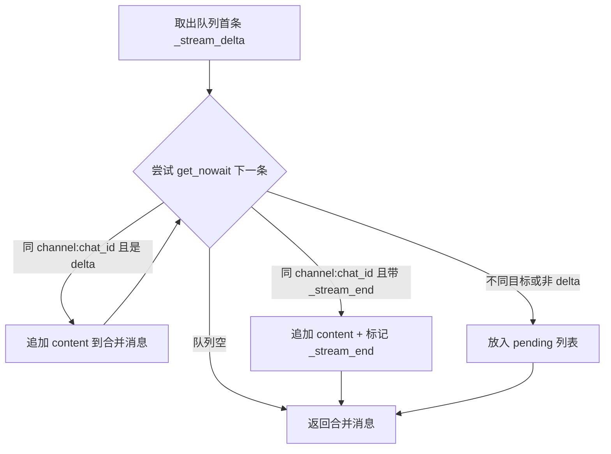

nanobot 的流式输出系统是一个跨越五层抽象的管道（pipeline），从 LLM Provider 的 SSE 流式接口出发，经过 Agent Runner 的 Hook 桥接、Agent Loop 的消息总线分发、ChannelManager 的增量合并（coalescing），最终抵达各通道（Telegram、飞书、CLI 等）的平台专属渲染器。本文将逐层拆解这一端到端管道，揭示其设计权衡与关键实现细节。

Sources: [base.py](nanobot/providers/base.py#L387-L456), [runner.py](nanobot/agent/runner.py#L344-L364), [loop.py](nanobot/agent/loop.py#L428-L484), [manager.py](nanobot/channels/manager.py#L148-L246), [base.py](nanobot/channels/base.py#L98-L115)

## 整体架构：五层流式管道

在深入每一层之前，先建立对流式管道端到端数据流的整体认知。下图展示了从 LLM 的 token 生成到用户最终看到打字机效果的完整路径：

```mermaid
sequenceDiagram
    participant LLM as LLM Provider<br/>(SSE Stream)
    participant Runner as AgentRunner<br/>(_request_model)
    participant Hook as _LoopHook<br/>(on_stream)
    participant Dispatch as AgentLoop._dispatch<br/>(Bus Publisher)
    participant CM as ChannelManager<br/>(Coalescing)
    participant CH as Channel.send_delta<br/>(Platform Renderer)

    LLM-->>Runner: token chunk (via on_content_delta)
    Runner-->>Hook: delta string
    Note over Hook: strip &lt;think&gt; blocks<br/>compute incremental text
    Hook-->>Dispatch: filtered delta
    Note over Dispatch: wrap in OutboundMessage<br/>metadata: _stream_delta + _stream_id
    Dispatch-->>CM: enqueue to outbound bus
    Note over CM: coalesce consecutive deltas<br/>for same (channel, chat_id)
    CM-->>CH: merged delta or _stream_end
    Note over CH: Telegram: edit_message<br/>Feishu: CardKit streaming<br/>CLI: Rich Live renderer
```

**核心设计理念**：每一层只做一件事——Provider 负责解析 SSE chunks，Runner 负责决定是否启用流式，Hook 负责 `<think` 块过滤与增量计算，Dispatch 负责消息总线分发，ChannelManager 负责合并优化，Channel 负责平台适配。这种分层确保了"增加一个新通道"只需实现 `send_delta()` 方法，而无需改动上游任何逻辑。

Sources: [openai_compat_provider.py](nanobot/providers/openai_compat_provider.py#L743-L789), [runner.py](nanobot/agent/runner.py#L344-L364), [loop.py](nanobot/agent/loop.py#L43-L77), [loop.py](nanobot/agent/loop.py#L434-L464), [manager.py](nanobot/channels/manager.py#L173-L246)

## 第一层：LLM Provider 的流式接口

`LLMProvider` 基类定义了 `chat_stream()` 和 `chat_stream_with_retry()` 两个流式方法。`chat_stream()` 接收一个 `on_content_delta` 回调——每当 LLM 生成一段文本时，该回调就会被触发。对于不支持原生流式的 Provider，基类提供了一个**降级实现**：先做一次普通 `chat()` 调用，然后把完整内容作为单个 delta 一次性投递。

Sources: [base.py](nanobot/providers/base.py#L387-L412)

以 OpenAI 兼容 Provider 为例，其 `chat_stream()` 实现通过 `stream=True` 参数启用 SSE 流式，然后用异步迭代器逐 chunk 消费。每个 chunk 的 `choices[0].delta.content` 即为增量文本，直接传递给 `on_content_delta` 回调。值得注意的是，该实现配置了 `idle_timeout_s`（默认 90 秒），防止网络断连导致无限等待。

Sources: [openai_compat_provider.py](nanobot/providers/openai_compat_provider.py#L754-L789)

## 第二层：Agent Runner 的流式决策

`AgentRunner._request_model()` 是流式管道的"开关"——它通过 `hook.wants_streaming()` 判断当前 Hook 链是否请求了流式输出。如果请求了流式，Runner 会构造一个 `_stream` 闭包将 `on_content_delta` 桥接到 `hook.on_stream()`，然后调用 `provider.chat_stream_with_retry()`；否则直接使用非流式的 `provider.chat_with_retry()`。

```python
# AgentRunner._request_model() 的关键决策逻辑
if hook.wants_streaming():
    async def _stream(delta: str) -> None:
        await hook.on_stream(context, delta)
    return await self.provider.chat_stream_with_retry(
        **kwargs, on_content_delta=_stream,
    )
return await self.provider.chat_with_retry(**kwargs)
```

Sources: [runner.py](nanobot/agent/runner.py#L344-L364)

当 LLM 返回的响应包含工具调用时，Runner 会在执行工具之前调用 `hook.on_stream_end(context, resuming=True)`，表示"流式文本段落结束，接下来是工具执行"。当到达最终响应（无更多工具调用）时，则调用 `hook.on_stream_end(context, resuming=False)`。这个 `resuming` 标志在通道层有不同的语义——CLI 会重启等待动画，Telegram 则知道这是最后一个流式段落。

Sources: [runner.py](nanobot/agent/runner.py#L125-L127), [runner.py](nanobot/agent/runner.py#L253-L254)

## 第三层：Agent Loop Hook 的增量过滤

`_LoopHook` 是流式管道中承上启下的关键组件，它执行两项核心任务：**`<think` 块过滤**和**增量计算**。

许多 LLM（尤其是推理类模型）会在 `content` 字段中嵌入 `<think...<think` 推理过程。nanobot 使用 `strip_think()` 函数移除这些块。然而，流式场景下这些 `<think` 标签可能跨越多个 delta 到达，因此 `_LoopHook.on_stream()` 采用了"全量对比"策略：维护一个 `_stream_buf` 累积所有原始 delta，每次调用时先对旧缓冲区和新缓冲区分别执行 `strip_think()`，然后取两者差值作为增量文本。

```python
async def on_stream(self, context, delta):
    prev_clean = strip_think(self._stream_buf)   # 过滤前的干净文本
    self._stream_buf += delta                      # 累积原始文本
    new_clean = strip_think(self._stream_buf)     # 过滤后的干净文本
    incremental = new_clean[len(prev_clean):]     # 差值即为本次增量
    if incremental and self._on_stream:
        await self._on_stream(incremental)
```

这种设计虽然每次都要对完整缓冲区执行两次正则替换，但其正确性保证远优于逐 delta 状态机方案——尤其是处理 `<think` 标签被拆分到多个 delta 中、或者嵌套 `<think` 块等边界情况。

Sources: [loop.py](nanobot/agent/loop.py#L66-L77), [helpers.py](nanobot/utils/helpers.py#L17-L21)

## 第四层：消息总线分发与流式分段

`AgentLoop._dispatch()` 是流式消息从 Agent 核心流向通道的枢纽。当入站消息的 `metadata` 中携带 `_wants_stream: True` 标志时，`_dispatch()` 会创建一对异步闭包 `on_stream` / `on_stream_end`，将 LLM 的增量文本封装为带有 `_stream_delta`、`_stream_id` 等元数据的 `OutboundMessage`，投入出站消息队列。

**流式分段机制**是这里的关键设计：一个完整的 Agent 回复可能包含多轮"LLM 文本 → 工具调用 → LLM 文本"的循环。每一段 LLM 输出都被视为一个独立的**流式段落（stream segment）**，拥有唯一的 `_stream_id`（格式为 `{session_key}:{timestamp}:{segment_index}`）。通道层可以据此区分不同段落，避免第二段的增量文本被追加到第一段的消息中。

Sources: [loop.py](nanobot/agent/loop.py#L434-L464)

`_wants_stream` 标志由 `BaseChannel._handle_message()` 自动注入——仅当通道配置了 `streaming: true` **且**该通道实现了 `send_delta()` 方法时，才会设置此标志。`BaseChannel.supports_streaming` 属性通过双重检查实现这一逻辑：

```python
@property
def supports_streaming(self) -> bool:
    cfg = self.config
    streaming = cfg.get("streaming", False) if isinstance(cfg, dict) else getattr(cfg, "streaming", False)
    return bool(streaming) and type(self).send_delta is not BaseChannel.send_delta
```

Sources: [base.py](nanobot/channels/base.py#L110-L115), [base.py](nanobot/channels/base.py#L156-L159)

## 第五层：ChannelManager 的增量合并（Delta Coalescing）

当 LLM 生成速度超过通道的消费速度时，出站队列中会积压多个 `_stream_delta` 消息。如果逐条发送，每个 delta 都会触发一次 API 调用（例如 Telegram 的 `edit_message_text`），不仅浪费配额，还可能触发速率限制。`ChannelManager._coalesce_stream_deltas()` 正是为解决这一问题而生。

**合并算法**采用"贪婪连续合并"策略：取出队列中的第一条 `_stream_delta` 消息后，不断尝试 `get_nowait()` 获取下一条消息。如果下一条消息属于同一 `(channel, chat_id)` 且也是 `_stream_delta`，则将其 `content` 追加到合并消息中。遇到以下任一情况时停止合并：

| 停止条件 | 行为 |
|---|---|
| 队列为空 | 返回已合并的消息 |
| 遇到 `_stream_end` | 将 `_stream_end` 标志合并到 metadata，停止合并 |
| 不同的 `(channel, chat_id)` | 将该消息放入 `pending` 列表，返回合并消息 |
| 非 `_stream_delta` 消息 | 将该消息放入 `pending` 列表，返回合并消息 |



`pending` 列表是一个巧妙的"回退缓冲区"——因为 `asyncio.Queue` 不支持 `push_front` 操作，无法将未消费的消息放回队列头部。`_dispatch_outbound()` 在每轮循环中优先处理 `pending` 列表中的消息，再从队列中获取新消息，确保消息顺序不会被打乱。

Sources: [manager.py](nanobot/channels/manager.py#L148-L189), [manager.py](nanobot/channels/manager.py#L198-L246)

## 通道层的流式渲染策略

合并后的 delta 最终通过 `_send_once()` 路由到通道的 `send_delta()` 方法。如果消息携带 `_streamed` 标志（表示该回复已完全通过流式发送完毕），则跳过最终的 `send()` 调用，避免重复发送。

Sources: [manager.py](nanobot/channels/manager.py#L190-L196)

不同通道根据平台能力采用了截然不同的渲染策略：

### Telegram：渐进式消息编辑

Telegram 通道使用 `_StreamBuf` 数据类为每个 `chat_id` 维护一个流式状态缓冲区，包含当前累积文本、已发送的 `message_id`、上次编辑时间和 `stream_id`。

**生命周期**：
1. **首个 delta** → 调用 `send_message` 发送新消息，记录 `message_id`
2. **后续 delta** → 累积到缓冲区，当距上次编辑超过 `stream_edit_interval`（默认 0.6 秒）时，调用 `edit_message_text` 更新消息
3. **流式结束**（`_stream_end`）→ 最终编辑消息（尝试 HTML 格式，失败则降级为纯文本），移除"正在输入"指示器，清除缓冲区

节流间隔是 Telegram 实现的核心优化——Telegram API 对 `edit_message_text` 有严格的速率限制，过于频繁的编辑会被限流甚至封禁。通过 `stream_edit_interval` 参数（最小 0.1 秒），通道在"实时性"和"API 配额"之间取得平衡。

Sources: [telegram.py](nanobot/channels/telegram.py#L172-L178), [telegram.py](nanobot/channels/telegram.py#L541-L635)

### 飞书（Feishu）：CardKit 流式卡片

飞书通道利用飞书开放平台的 **CardKit 流式 API** 实现打字机效果，这是最复杂的通道实现。

**生命周期**：
1. **首个 delta** → 调用 `_create_streaming_card_sync()` 创建一个带有 `streaming_mode: True` 的流式卡片，发送到聊天后获取 `card_id`
2. **后续 delta** → 累积文本，当距上次编辑超过 `_STREAM_EDIT_INTERVAL`（0.5 秒）时，调用 `_stream_update_text_sync()` 通过 `card_element.content` API 更新卡片中的 markdown 元素
3. **流式结束**（`_stream_end`）→ 最终更新卡片内容，然后调用 `_close_streaming_mode_sync()` 将卡片的 `streaming_mode` 设为 `false`，使聊天列表预览退出"生成中"占位状态

飞书的 CardKit API 使用**递增的 `sequence` 号**来保证操作的严格有序性——每次 `content` 或 `settings` 调用的 sequence 必须严格大于前一次，否则 API 会拒绝。`_FeishuStreamBuf` 中的 `sequence` 字段正是为此而设。

如果卡片创建失败（例如 API 权限不足），`_stream_end` 阶段会降级为发送普通的静态卡片消息，确保用户至少能看到最终内容。

Sources: [feishu.py](nanobot/channels/feishu.py#L261-L268), [feishu.py](nanobot/channels/feishu.py#L1146-L1190), [feishu.py](nanobot/channels/feishu.py#L1192-L1261), [feishu.py](nanobot/channels/feishu.py#L1263-L1338)

### CLI：Rich Live 渲染器

CLI 通道使用 `StreamRenderer` 类，基于 Python 的 Rich 库实现终端内的实时 Markdown 渲染。

**生命周期**：
1. **等待阶段** → 显示 "nanobot is thinking..." 的旋转动画（`ThinkingSpinner`）
2. **首个可见 delta** → 停止旋转动画，打印 nanobot logo，启动 `Rich Live` 区域
3. **后续 delta** → 累积到缓冲区，当 delta 包含换行符或距上次刷新超过 50ms 时，更新 Live 区域的 Markdown 渲染
4. **流式结束** → 最终刷新渲染，停止 Live 区域（内容保留在终端屏幕上）

`auto_refresh=False` 是关键设计——Rich Live 默认会自动定时刷新，但在流式场景下可能导致渲染竞争。手动控制刷新时机（仅在收到有效 delta 时）确保了输出的稳定性。

Sources: [stream.py](nanobot/cli/stream.py#L59-L133)

## 流式消息的元数据协议

整个流式管道通过 `OutboundMessage.metadata` 字典中的一组约定俗成的键来传递控制信息。下表总结了这些元数据键及其在各层的含义：

| 元数据键 | 生产者 | 消费者 | 语义 |
|---|---|---|---|
| `_wants_stream` | `BaseChannel._handle_message` | `AgentLoop._dispatch` | 标记入站消息请求流式响应 |
| `_stream_delta` | `AgentLoop._dispatch.on_stream` | `ChannelManager._dispatch_outbound` | 标记此消息为流式增量文本 |
| `_stream_end` | `AgentLoop._dispatch.on_stream_end` | `ChannelManager` / Channel | 标记当前流式段落结束 |
| `_stream_id` | `AgentLoop._dispatch` | Channel `send_delta` | 流式段落唯一标识（`session:timestamp:segment`） |
| `_streamed` | `AgentLoop._process_message` | `ChannelManager._send_once` | 标记最终回复已通过流式发送，跳过 `send()` |
| `_resuming` | `AgentLoop._dispatch.on_stream_end` | CLI `StreamRenderer` | `True` 表示后续还有工具调用，应重启等待动画 |
| `_progress` | `AgentLoop._bus_progress` | `ChannelManager._dispatch_outbound` | 标记此消息为进度提示（工具调用状态等） |
| `_tool_hint` | `_LoopHook.before_execute_tools` | `ChannelManager._dispatch_outbound` | 标记进度消息为工具调用提示 |

Sources: [loop.py](nanobot/agent/loop.py#L443-L464), [loop.py](nanobot/agent/loop.py#L576-L582), [loop.py](nanobot/agent/loop.py#L608-L614), [manager.py](nanobot/channels/manager.py#L167-L181), [base.py](nanobot/channels/base.py#L156-L159)

## 非流式通道的降级行为

对于不支持流式的通道（如 Email、Matrix 等，它们没有覆写 `send_delta()` 方法），整个流式管道在第一层就被短路：`BaseChannel.supports_streaming` 返回 `False`，`_handle_message()` 不会注入 `_wants_stream` 标志，`_dispatch()` 不会创建 `on_stream` 闭包，Runner 走非流式的 `chat_with_retry()` 路径，最终通过 `send()` 发送完整响应。这种优雅降级确保了所有通道都能正常工作，无需任何额外配置。

Sources: [base.py](nanobot/channels/base.py#L110-L115), [loop.py](nanobot/agent/loop.py#L434-L435)

## 为自定义通道添加流式支持

如果你正在开发自定义通道插件（详见[通道插件开发：从零构建自定义通道](18-tong-dao-cha-jian-kai-fa-cong-ling-gou-jian-zi-ding-yi-tong-dao)），只需完成以下两步即可启用流式输出：

1. **在配置模型中添加 `streaming: bool = True`**，使 `BaseChannel.supports_streaming` 返回 `True`
2. **覆写 `send_delta(chat_id, delta, metadata)` 方法**，实现平台特有的增量渲染逻辑

核心实现要点：
- 使用 `chat_id` 作为键维护一个**缓冲区字典**（如 `_stream_bufs`），每个对话独立跟踪流式状态
- 当 `metadata["_stream_end"]` 为 `True` 时，执行最终渲染并清理缓冲区
- 当 `metadata["_stream_id"]` 存在时，用它区分不同的流式段落，避免段落间的文本混淆
- 实现适当的**节流机制**（建议 0.3–0.6 秒），避免触发平台 API 速率限制
- 在 `send_delta` 中 **`raise`** 异常以触发 `ChannelManager` 的重试机制（指数退避：1s → 2s → 4s）

Sources: [base.py](nanobot/channels/base.py#L98-L108), [manager.py](nanobot/channels/manager.py#L248-L276), [telegram.py](nanobot/channels/telegram.py#L541-L635)

## 延伸阅读

- [Agent Runner：共享执行引擎与上下文压缩策略](6-agent-runner-gong-xiang-zhi-xing-yin-qing-yu-shang-xia-wen-ya-suo-ce-lue) — Runner 层的流式决策与迭代循环细节
- [Agent 生命周期 Hook 机制与 CompositeHook 错误隔离](8-agent-sheng-ming-zhou-qi-hook-ji-zhi-yu-compositehook-cuo-wu-ge-chi) — Hook 链的设计与流式回调的传播机制
- [通道架构：BaseChannel 接口与通道管理器](16-tong-dao-jia-gou-basechannel-jie-kou-yu-tong-dao-guan-li-qi) — ChannelManager 的完整消息路由与重试策略
- [通道插件开发：从零构建自定义通道](18-tong-dao-cha-jian-kai-fa-cong-ling-gou-jian-zi-ding-yi-tong-dao) — 自定义通道的开发指南，包含 `send_delta` 实现模板
- [Provider 后端实现：OpenAI 兼容、Anthropic、Azure、OAuth](14-provider-hou-duan-shi-xian-openai-jian-rong-anthropic-azure-oauth) — 各 Provider 的 `chat_stream()` 原生实现细节