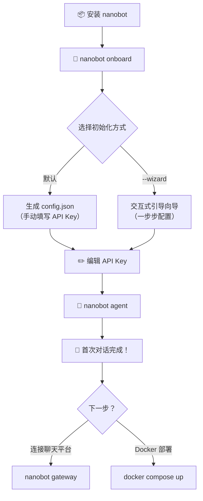

本文将带你从零开始，完成 nanobot 的安装、配置初始化，并与你的 AI Agent 进行首次对话。整个过程只需 **两分钟**，三条命令即可启动一个完整的个人 AI Agent。

## 系统要求

在开始之前，请确认你的环境满足以下条件：

| 要求 | 最低版本 | 说明 |
|------|---------|------|
| **Python** | ≥ 3.11 | nanobot 的运行时基础 |
| **操作系统** | macOS / Linux / Windows | Windows 下建议使用 WSL2 |
| **LLM API Key** | 任选一个 | OpenRouter（推荐）、Anthropic、DeepSeek 等，详见 [Provider 注册表与自动发现机制](13-provider-zhu-ce-biao-yu-zi-dong-fa-xian-ji-zhi) |

Sources: [pyproject.toml](pyproject.toml#L6-L6), [README.md](README.md#L7-L8)

## 安装 nanobot

nanobot 提供三种安装方式，根据你的使用场景选择即可：

| 安装方式 | 适用场景 | 稳定性 | 功能前沿度 |
|---------|---------|--------|-----------|
| **uv tool install** | 日常使用、快速体验 | ⭐⭐⭐ 稳定版 | 发布版本 |
| **pip install** | 标准安装 | ⭐⭐⭐ 稳定版 | 发布版本 |
| **git clone + pip install -e** | 开发调试、体验最新功能 | ⭐⭐ 开发版 | 最新源码 |

**方式一：使用 uv 安装**（推荐，速度最快）

```bash
uv tool install nanobot-ai
```

**方式二：使用 pip 安装**

```bash
pip install nanobot-ai
```

**方式三：从源码安装**（获取最新开发功能）

```bash
git clone https://github.com/HKUDS/nanobot.git
cd nanobot
pip install -e .
```

安装完成后，运行以下命令确认安装成功：

```bash
nanobot --version
# 输出示例：🐈 nanobot v0.1.5
```

升级到最新版本：

```bash
# pip
pip install -U nanobot-ai

# uv
uv tool upgrade nanobot-ai
```

Sources: [README.md](README.md#L159-L200), [pyproject.toml](pyproject.toml#L86-L87), [nanobot/__init__.py](nanobot/__init__.py#L5-L6)

## 三步快速启动

nanobot 的核心工作流可以浓缩为三条命令。下面的流程图展示了从安装到首次对话的完整路径：



Sources: [nanobot/cli/commands.py](nanobot/cli/commands.py#L270-L366)

### 第一步：初始化

运行 `nanobot onboard` 命令，nanobot 会自动完成以下工作：

1. 在 `~/.nanobot/` 目录下创建配置文件 `config.json`
2. 创建工作区目录 `~/.nanobot/workspace/`
3. 同步模板文件到工作区（`SOUL.md`、`USER.md`、`TOOLS.md` 等）
4. 初始化所有已发现的通道插件配置

```bash
nanobot onboard
```

如果你希望使用**交互式引导向导**来一步步完成配置（选择 Provider、输入 API Key、设置模型等），请使用 `--wizard` 参数：

```bash
nanobot onboard --wizard
```

向导启动后会进入一个多级菜单界面，提供以下配置选项：

| 菜单项 | 功能 |
|-------|------|
| **[P] LLM Provider** | 配置 LLM 提供商（API Key、Endpoint） |
| **[C] Chat Channel** | 配置聊天通道（Telegram、Discord 等） |
| **[A] Agent Settings** | 配置模型、温度、上下文窗口等 |
| **[G] Gateway** | 配置网关主机、端口、心跳 |
| **[T] Tools** | 配置 Web 搜索、Shell 执行等工具 |
| **[V] View Summary** | 查看当前配置总览 |

> 💡 向导中，模型字段支持**自动补全**：输入时会根据所选 Provider 动态推荐可用模型，并自动填充推荐的上下文窗口大小。

初始化完成后，你的文件系统会呈现以下结构：

```
~/.nanobot/
├── config.json              # 核心配置文件
├── workspace/               # Agent 工作区
│   ├── SOUL.md              # Agent 人格与行为准则
│   ├── USER.md              # 用户偏好配置
│   ├── TOOLS.md             # 工具使用说明
│   ├── AGENTS.md            # Agent 协作说明
│   ├── HEARTBEAT.md         # 周期性心跳任务
│   ├── memory/
│   │   ├── MEMORY.md        # 长期记忆存储
│   │   └── history.jsonl    # 对话历史（追加写入）
│   └── skills/              # 自定义技能目录
├── history/
│   └── cli_history          # CLI 历史记录
└── media/                   # 媒体文件存储
```

Sources: [nanobot/cli/commands.py](nanobot/cli/commands.py#L270-L366), [nanobot/cli/onboard.py](nanobot/cli/onboard.py#L956-L1024), [nanobot/config/paths.py](nanobot/config/paths.py#L37-L52), [nanobot/utils/helpers.py](nanobot/utils/helpers.py#L437-L478)

### 第二步：配置 API Key

初始化生成的配置文件位于 `~/.nanobot/config.json`。**最简配置只需两个部分**：Provider 的 API Key 和模型名称。

以 OpenRouter（推荐全球用户使用）为例，编辑 `~/.nanobot/config.json`：

```json
{
  "providers": {
    "openrouter": {
      "apiKey": "sk-or-v1-你的密钥"
    }
  },
  "agents": {
    "defaults": {
      "model": "anthropic/claude-opus-4-5",
      "provider": "openrouter"
    }
  }
}
```

> 🔑 获取 API Key：访问 [openrouter.ai/keys](https://openrouter.ai/keys) 创建密钥。

nanobot 内置了 **20+ Provider**，其中常用的包括：

| Provider | 配置键名 | 获取 API Key | 说明 |
|----------|---------|-------------|------|
| OpenRouter | `openrouter` | [openrouter.ai](https://openrouter.ai) | 推荐，可访问所有主流模型 |
| Anthropic | `anthropic` | [console.anthropic.com](https://console.anthropic.com) | Claude 直连 |
| DeepSeek | `deepseek` | [platform.deepseek.com](https://platform.deepseek.com) | DeepSeek 直连 |
| OpenAI | `openai` | [platform.openai.com](https://platform.openai.com) | GPT 系列 |
| Groq | `groq` | [console.groq.com](https://console.groq.com) | 高速推理 + 免费语音转录 |
| Ollama | `ollama` | — | 本地模型，无需 API Key |

配置本地模型（如 Ollama）时，无需 API Key，只需指定 `apiBase`：

```json
{
  "providers": {
    "ollama": {
      "apiBase": "http://localhost:11434"
    }
  },
  "agents": {
    "defaults": {
      "provider": "ollama",
      "model": "llama3.2"
    }
  }
}
```

你也可以使用环境变量代替明文密钥，在 config.json 中写 `"apiKey": "${OPENROUTER_API_KEY}"`，nanobot 启动时会自动解析。

Sources: [nanobot/config/schema.py](nanobot/config/schema.py#L62-L125), [nanobot/config/loader.py](nanobot/config/loader.py#L81-L110), [README.md](README.md#L219-L260), [README.md](README.md#L874-L891)

### 第三步：首次对话

配置完成后，直接运行以下命令开始对话：

```bash
nanobot agent
```

这将进入**交互式聊天模式**，你会看到如下提示：

```
🐈 Interactive mode (type exit or Ctrl+C to quit)

You: 你好！请介绍一下你自己
```

nanobot 会以 Markdown 格式渲染回复，并支持流式输出。你还可以使用以下方式与 Agent 交互：

| 命令 | 说明 |
|------|------|
| `nanobot agent` | 进入交互式聊天模式 |
| `nanobot agent -m "你好"` | 单条消息模式，发送后自动退出 |
| `nanobot agent --no-markdown` | 纯文本回复（不渲染 Markdown） |
| `nanobot agent --logs` | 显示运行时日志（调试用） |
| `nanobot agent -c 配置路径` | 使用指定的配置文件 |

在交互模式中，可以使用以下命令：

| 操作 | 方式 |
|------|------|
| 退出 | 输入 `exit`、`quit`、`/exit`、`/quit`、`:q` 或 `Ctrl+D` |
| 查看命令 | 输入 `/help` |
| 新建对话 | 输入 `/new` |
| 查看状态 | 输入 `/status` |

Sources: [nanobot/cli/commands.py](nanobot/cli/commands.py#L863-L1091), [README.md](README.md#L1670-L1670)

## 工作区文件说明

初始化后，nanobot 会在 `~/.nanobot/workspace/` 下生成一组模板文件，它们构成了 Agent 的**人格与记忆系统**：

| 文件 | 用途 | 是否可编辑 |
|------|------|-----------|
| `SOUL.md` | Agent 的人格定义与行为准则 | ✅ 自定义 Agent 性格 |
| `USER.md` | 用户偏好档案（姓名、语言、技术背景等） | ✅ 填写个人信息以个性化交互 |
| `MEMORY.md` | 长期记忆存储，由 Dream 系统自动维护 | ⚠️ 建议通过 Agent 管理 |
| `TOOLS.md` | 内置工具使用说明，Agent 自动读取 | ✅ 可添加自定义工具说明 |
| `HEARTBEAT.md` | 周期性任务列表，每 30 分钟检查一次 | ✅ 添加定时任务 |
| `AGENTS.md` | 子代理协作说明 | ✅ 高级配置 |

> 💡 `USER.md` 模板提供了姓名、时区、语言偏好、沟通风格等字段，填写后 Agent 会据此调整交互方式。

Sources: [nanobot/templates/SOUL.md](nanobot/templates/SOUL.md#L1-L10), [nanobot/templates/USER.md](nanobot/templates/USER.md#L1-L50), [nanobot/templates/HEARTBEAT.md](nanobot/templates/HEARTBEAT.md#L1-L17), [nanobot/templates/TOOLS.md](nanobot/templates/TOOLS.md#L1-L37), [nanobot/utils/helpers.py](nanobot/utils/helpers.py#L437-L478)

## 使用 Docker 快速启动（可选）

如果你更喜欢容器化部署，nanobot 提供了官方 Docker 镜像：

```bash
# 1. 构建镜像
docker build -t nanobot .

# 2. 初始化配置
docker run -v ~/.nanobot:/home/nanobot/.nanobot --rm nanobot onboard

# 3. 编辑配置文件（在宿主机上）
vim ~/.nanobot/config.json

# 4. 启动 Agent
docker run -v ~/.nanobot:/home/nanobot/.nanobot --rm nanobot agent -m "Hello!"
```

使用 Docker Compose 更便捷：

```bash
# 初始化
docker compose run --rm nanobot-cli onboard

# 编辑 API Key
vim ~/.nanobot/config.json

# 启动网关
docker compose up -d nanobot-gateway
```

> ⚠️ Docker 容器以 `nanobot` 用户（UID 1000）运行。若遇到权限问题，在宿主机执行 `sudo chown -R 1000:1000 ~/.nanobot`，或使用 `--user $(id -u):$(id -g)` 参数。

详细的 Docker 部署指南请参阅 [Docker 部署与 docker-compose 配置](30-docker-bu-shu-yu-docker-compose-pei-zhi)。

Sources: [Dockerfile](Dockerfile#L1-L51), [docker-compose.yml](docker-compose.yml#L1-L56), [entrypoint.sh](entrypoint.sh#L1-L16), [README.md](README.md#L1813-L1849)

## 常见问题排查

| 问题 | 原因 | 解决方案 |
|------|------|---------|
| `Error: No API key configured` | config.json 中未设置 API Key | 在 `providers` 节下添加 `apiKey` 字段 |
| `Failed to load config from ...` | config.json 格式错误 | 检查 JSON 语法，或运行 `nanobot onboard` 重新生成 |
| `Environment variable 'xxx' is not set` | 配置中引用了不存在的环境变量 | 设置对应的环境变量，或替换为直接值 |
| `Permission denied` (Docker) | 容器用户无权写入挂载目录 | `sudo chown -R 1000:1000 ~/.nanobot` |
| 旧配置缺少新字段 | config 版本落后 | 运行 `nanobot onboard`，选择 `N`（不覆盖）即可自动补全新字段 |

Sources: [nanobot/cli/commands.py](nanobot/cli/commands.py#L420-L433), [nanobot/config/loader.py](nanobot/config/loader.py#L30-L54)

## 下一步

恭喜你完成了 nanobot 的首次对话！接下来可以根据你的需求探索更多功能：

- **连接聊天平台**：将 nanobot 接入 Telegram、Discord、飞书、微信等，详见 [内置通道配置指南（Telegram、Discord、飞书、微信等）](17-nei-zhi-tong-dao-pei-zhi-zhi-nan-telegram-discord-fei-shu-wei-xin-deng)
- **深入了解架构**：理解 nanobot 的消息总线驱动模型，详见 [整体架构：消息总线驱动的通道-代理模型](4-zheng-ti-jia-gou-xiao-xi-zong-xian-qu-dong-de-tong-dao-dai-li-mo-xing)
- **多实例配置**：同时运行多个独立的 Agent 实例，详见 [交互式引导向导与多实例配置](3-jiao-hu-shi-yin-dao-xiang-dao-yu-duo-shi-li-pei-zhi)
- **Python SDK 集成**：在代码中直接调用 nanobot，详见 [Python SDK：Nanobot 门面类与会话隔离](28-python-sdk-nanobot-men-mian-lei-yu-hui-hua-ge-chi)
- **Docker 生产部署**：详见 [Docker 部署与 docker-compose 配置](30-docker-bu-shu-yu-docker-compose-pei-zhi)