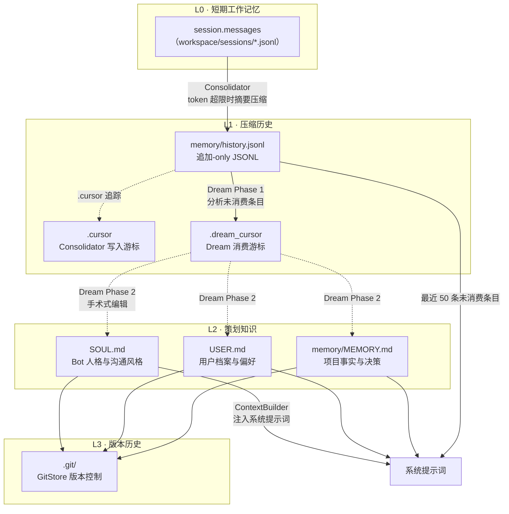
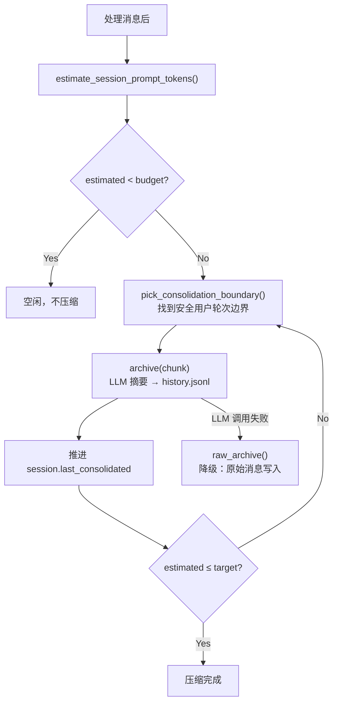

nanobot 的记忆系统建立在一个简洁但精确的分层架构上——不同类型的"记住"需要不同的工具。本文将深入解析四层记忆的职责划分、数据流向、以及它们如何协同工作以实现"对话速度快但长期记忆不丢失"的设计目标。

Sources: [docs/MEMORY.md](docs/MEMORY.md#L1-L10), [agent/memory.py](nanobot/agent/memory.py#L1-L55)

## 设计哲学：为什么不是一个大文件

nanobot 不把记忆当成一个巨大的文件来处理，而是将其拆分为四层，每一层有各自的生命周期、写入模式和消费者。这样做的原因很直接：**短期对话需要速度，长期知识需要准确性，两者不能互相妥协**。如果将所有信息都塞入上下文窗口，对话很快会超出 token 预算；如果只保留最新几轮，Agent 会反复遗忘用户的偏好和项目上下文。

这四层分别是：

| 层级 | 存储 | 生命周期 | 写入模式 | 主要消费者 |
|------|------|----------|----------|------------|
| L0 短期工作记忆 | `session.messages` | 单次对话 | 实时追加 | Agent 主循环（LLM 调用） |
| L1 压缩历史 | `memory/history.jsonl` | 持久（可压缩） | 仅追加 | Consolidator 写入 / Dream 读取 |
| L2 策划知识 | `SOUL.md`、`USER.md`、`MEMORY.md` | 持久 | Dream 手术式编辑 | ContextBuilder 注入系统提示词 |
| L3 版本历史 | `.git/`（GitStore） | 持久 | 自动提交 | `/dream-log`、`/dream-restore` |

Sources: [docs/MEMORY.md](docs/MEMORY.md#L12-L20), [agent/memory.py](nanobot/agent/memory.py#L31-L55)

## 四层架构全景图



数据流的本质方向是**自下而上地提炼**：原始对话（L0）经过压缩成为历史摘要（L1），历史摘要再经由 Dream 的两阶段分析转化为长期知识（L2），而 GitStore（L3）记录 L2 文件的每一次变更以支持审计和回滚。

Sources: [agent/context.py](nanobot/agent/context.py#L30-L63), [agent/memory.py](nanobot/agent/memory.py#L31-L55)

## L0：短期工作记忆（session.messages）

**session.messages** 是 nanobot 的"当前意识流"。每个对话通道（例如 `telegram:8281248569`）拥有独立的 `Session` 实例，消息以 JSONL 格式持久化在 `workspace/sessions/` 目录下。

Session 内部维护一个 `last_consolidated` 整数索引，标记哪些消息已经被 Consolidator 归档。`get_history()` 方法只返回该索引之后的消息，用于构建 LLM 调用的上下文，并且会自动对齐到合法的 tool-call 边界（避免从 orphan tool result 中间开始截断）：

```python
def get_history(self, max_messages: int = 500) -> list[dict[str, Any]]:
    unconsolidated = self.messages[self.last_consolidated:]
    sliced = unconsolidated[-max_messages:]
    # 避免从 tool-turn 中间开始
    for i, message in enumerate(sliced):
        if message.get("role") == "user":
            sliced = sliced[i:]
            break
    start = find_legal_message_start(sliced)
    if start:
        sliced = sliced[start:]
    # ...
```

当用户执行 `/new` 命令时，当前 session 被清空，snapshot（未归档的消息）会被立即推送给 Consolidator 进行归档，确保信息不会丢失。

Sources: [session/manager.py](nanobot/session/manager.py#L17-L67), [agent/loop.py](nanobot/agent/loop.py#L657-L688)

## L1：压缩历史（history.jsonl）

`memory/history.jsonl` 是一个**仅追加的 JSONL 文件**，充当短期对话与长期知识之间的缓冲层。它的设计选择非常刻意：

- **JSONL 而非 Markdown**：旧版 `HISTORY.md` 虽然对人类友好，但解析脆弱、难以维护游标。JSONL 提供了稳定的光标递增、安全的机器解析、批量处理能力和整洁的压缩操作。
- **游标机制**：每条记录携带自增的 `cursor` 字段，配合 `.cursor` 文件追踪 Consolidator 的写入位置，`.dream_cursor` 追踪 Dream 的消费位置。两个游标独立推进，使得"写入"和"读取"可以异步进行。

每条记录的格式如下：

```json
{"cursor": 42, "timestamp": "2026-04-03 00:02", "content": "- User prefers dark mode\n- Decided to use PostgreSQL"}
```

`MemoryStore` 提供了完整的 JSONL 操作接口：`append_history()` 追加新条目并自动递增游标，`read_unprocessed_history(since_cursor)` 读取指定游标之后的所有条目，`compact_history()` 在文件超过 `max_history_entries`（默认 1000）时丢弃最旧的条目。

Sources: [agent/memory.py](nanobot/agent/memory.py#L221-L301), [docs/MEMORY.md](docs/MEMORY.md#L86-L110)

## L2：策划知识（SOUL.md、USER.md、MEMORY.md）

三个 Markdown 文件是 nanobot 的"长期记忆本体"，各自承载不同维度的事实：

| 文件 | 职责 | 模板示例内容 |
|------|------|-------------|
| **SOUL.md** | Bot 人格、沟通风格、行为准则 | "I keep responses short unless depth is asked for." |
| **USER.md** | 用户身份、偏好、技术层级 | Name、Timezone、Communication Style、Tools You Use |
| **MEMORY.md** | 项目事实、重要决策、持久化上下文 | User Information、Preferences、Project Context |

这三个文件有一个关键的设计约束：**它们只由 Dream 编辑**。memory 技能在 `SKILL.md` 中明确声明了这一规则：

> **Do NOT edit SOUL.md, USER.md, or MEMORY.md.** They are automatically managed by Dream. If you notice outdated information, it will be corrected when Dream runs next.

这防止了 Agent 在日常对话中随意修改长期记忆文件，将"策划"和"使用"解耦。

Sources: [templates/SOUL.md](nanobot/templates/SOUL.md#L1-L10), [templates/USER.md](nanobot/templates/USER.md#L1-L50), [templates/memory/MEMORY.md](nanobot/templates/memory/MEMORY.md#L1-L24), [skills/memory/SKILL.md](nanobot/skills/memory/SKILL.md#L1-L37)

## ContextBuilder：记忆如何注入系统提示词

`ContextBuilder.build_system_prompt()` 是四层记忆汇聚为 LLM 输入的关键组装点。它的组装顺序严格遵循以下结构：

1. **Identity**：平台信息、工作区路径、通道格式提示
2. **Bootstrap Files**：按固定顺序加载 `AGENTS.md` → `SOUL.md` → `USER.md` → `TOOLS.md`
3. **Memory**：读取 `MEMORY.md` 内容，包装为 `# Memory` 段落
4. **Active Skills**：加载标记为 `always: true` 的技能内容
5. **Skills Summary**：所有可用技能的摘要列表
6. **Recent History**：从 `history.jsonl` 读取 Dream 游标之后未被消费的最近 50 条条目

值得注意的是，L1 层的 `history.jsonl` 以**摘要形式**注入系统提示词（而非完整对话），这保证即使有大量历史积累，注入的内容也是精炼的要点，不会挤占上下文窗口。

Sources: [agent/context.py](nanobot/agent/context.py#L30-L63), [agent/context.py](nanobot/agent/context.py#L103-L113)

## Consolidator：从 L0 到 L1 的实时压缩

Consolidator 是一个**轻量级、token 预算驱动的压缩引擎**。它不是定时运行的，而是在每次处理消息时检查 token 占用——当当前 session 的 prompt tokens 逼近上下文窗口的一半时，自动触发归档。

其工作流程如下：



关键设计细节：

- **budget 计算**：`budget = context_window_tokens - max_completion_tokens - 1024（安全缓冲）`，`target = budget / 2`
- **边界安全**：`pick_consolidation_boundary()` 只在 user-turn 边界处切割，避免截断 tool-call 序列
- **降级策略**：如果 LLM 摘要调用失败，`raw_archive()` 将原始消息直接写入 `history.jsonl` 并打上 `[RAW]` 标记，确保信息不丢失
- **最多 5 轮**：`_MAX_CONSOLIDATION_ROUNDS = 5`，避免无限循环

Sources: [agent/memory.py](nanobot/agent/memory.py#L346-L511), [agent/loop.py](nanobot/agent/loop.py#L527-L543)

## Dream：从 L1 到 L2 的两阶段策划

Dream 是 nanobot 记忆系统的"慢思考"层。它按 cron 调度运行（默认每 2 小时），也可以通过 `/dream` 命令手动触发。Dream 的核心职责是**读取 history.jsonl 中未消费的条目，分析其内容，然后手术式地编辑 SOUL.md、USER.md 和 MEMORY.md**。

### Phase 1：分析

Phase 1 使用专用提示词 [dream_phase1.md](nanobot/templates/agent/dream_phase1.md) 将新历史条目与当前三个长期文件进行对比，输出结构化的操作指令：

- `[FILE] atomic fact` — 需要添加到指定文件的事实
- `[FILE-REMOVE] reason` — 需要从文件中移除的内容

Phase 1 的提示词明确要求输出**原子事实**（如 "has a cat named Luna" 而非 "discussed pet care"），并定义了清晰的过期策略：时间敏感数据超过 14 天标记删除、已完成的单次任务删除、已合并的 PR 删除等。

### Phase 2：编辑

Phase 2 将 Phase 1 的分析结果交给 `AgentRunner`，配备 `read_file` 和 `edit_file` 两个工具，让 LLM 以**最小化编辑**的方式更新文件：

```python
# Dream Phase 2 的工具注册
tools.register(ReadFileTool(workspace=workspace, allowed_dir=workspace))
tools.register(EditFileTool(workspace=workspace, allowed_dir=workspace))
```

Phase 2 的提示词要求：
- 直接编辑，无需 `read_file`（文件内容已在提示中提供）
- 批量合并同一文件的多个编辑
- 删除时使用 section header + 所有 bullets 作为 old_text
- **绝不重写整个文件**——只做精确的外科手术式编辑

### 游标推进与 Git 提交

无论 Phase 2 是否成功，Dream 都会推进 `.dream_cursor` 到当前批次的最后一条记录，避免重复处理。如果 Phase 2 产生了实际变更，GitStore 会自动提交：

```python
if changelog and self.store.git.is_initialized():
    sha = self.store.git.auto_commit(f"dream: {ts}, {len(changelog)} change(s)")
```

Sources: [agent/memory.py](nanobot/agent/memory.py#L519-L676), [templates/agent/dream_phase1.md](nanobot/templates/agent/dream_phase1.md#L1-L24), [templates/agent/dream_phase2.md](nanobot/templates/agent/dream_phase2.md#L1-L25)

## L3：GitStore 版本化与用户控制

GitStore 使用 `dulwich`（纯 Python Git 实现）对 `SOUL.md`、`USER.md`、`memory/MEMORY.md` 三个文件进行版本追踪。它的 `.gitignore` 策略非常严格——只追踪这三个文件，忽略工作区中的一切其他内容。

用户可以通过以下命令与记忆版本交互：

| 命令 | 功能 |
|------|------|
| `/dream` | 手动触发 Dream 运行 |
| `/dream-log` | 查看最近一次 Dream 记忆变更（含 diff） |
| `/dream-log <sha>` | 查看指定版本的变更详情 |
| `/dream-restore` | 列出最近的 Dream 记忆版本 |
| `/dream-restore <sha>` | 将记忆恢复到指定版本之前的状态 |

这些命令的存在体现了一个重要的设计信念：**自动记忆是强大的，但用户应始终保留检查、理解和恢复它的权利**。记忆不应该是一个黑盒的静默变异，而应是一个可审计的过程。

Sources: [utils/gitstore.py](nanobot/utils/gitstore.py#L27-L154), [command/builtin.py](nanobot/command/builtin.py#L109-L190)

## 文件布局与模板初始化

工作区的记忆相关文件结构如下：

```
workspace/
├── SOUL.md              # Bot 人格与沟通风格（Dream 管理）
├── USER.md              # 用户档案与偏好（Dream 管理）
├── AGENTS.md            # Agent 行为指令（用户可编辑）
├── TOOLS.md             # 工具使用注意事项（用户可编辑）
├── HEARTBEAT.md         # 心跳任务文件
├── sessions/            # L0 对话历史 JSONL
│   └── telegram_8281.jsonl
└── memory/
    ├── MEMORY.md        # 长期事实与项目上下文（Dream 管理）
    ├── history.jsonl    # L1 追加-only 压缩历史
    ├── .cursor          # Consolidator 写入游标
    ├── .dream_cursor    # Dream 消费游标
    └── .git/            # L3 GitStore 版本历史
```

模板文件在首次初始化时从 `nanobot/templates/` 和 `nanobot/templates/memory/` 复制到工作区。`MemoryStore.__init__` 时会检查是否存在旧版 `HISTORY.md`，如果存在且 `history.jsonl` 为空，则执行一次性迁移：解析旧格式、写入 JSONL、推进游标、将原文件重命名为 `HISTORY.md.bak`。

Sources: [agent/memory.py](nanobot/agent/memory.py#L41-L56), [agent/memory.py](nanobot/agent/memory.py#L70-L189), [docs/MEMORY.md](docs/MEMORY.md#L67-L78)

## 配置参考

Dream 的行为通过 `agents.defaults.dream` 配置项控制：

```json
{
  "agents": {
    "defaults": {
      "dream": {
        "intervalH": 2,
        "modelOverride": null,
        "maxBatchSize": 20,
        "maxIterations": 10
      }
    }
  }
}
```

| 字段 | 默认值 | 含义 |
|------|--------|------|
| `intervalH` | `2` | Dream 运行间隔（小时） |
| `modelOverride` | `null` | Dream 专用模型覆盖（null 则使用主模型） |
| `maxBatchSize` | `20` | 每次运行处理的最大 history.jsonl 条目数 |
| `maxIterations` | `10` | Phase 2 的工具调用预算上限 |

Sources: [config/schema.py](nanobot/config/schema.py#L34-L60), [docs/MEMORY.md](docs/MEMORY.md#L143-L179)

## 延伸阅读

本文聚焦于分层记忆的静态架构与数据流向。若要了解 Consolidator 和 Dream 的运行时行为细节，可继续阅读：

- [Consolidator：对话摘要与上下文窗口管理](21-consolidator-dui-hua-zhai-yao-yu-shang-xia-wen-chuang-kou-guan-li) — token 预算计算、边界选择与归档降级的完整机制
- [Dream：两阶段长期记忆整合与 GitStore 版本化](22-dream-liang-jie-duan-chang-qi-ji-yi-zheng-he-yu-gitstore-ban-ben-hua) — Phase 1 分析策略、Phase 2 编辑约束与版本回滚流程