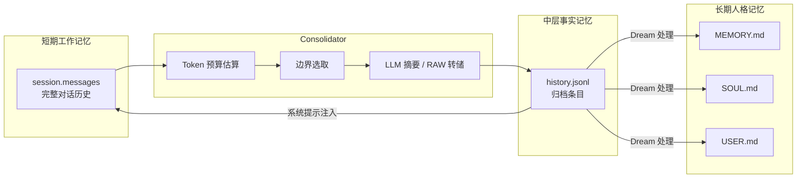
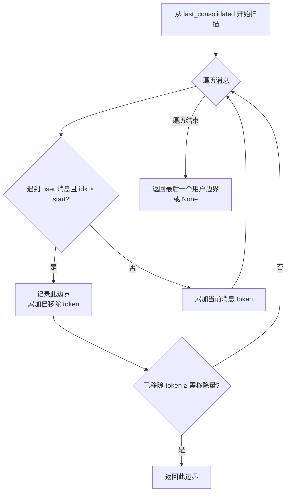

Consolidator 是 nanobot 记忆系统中的轻量级对话压缩引擎，负责在上下文窗口即将溢出时自动将旧消息归档到 `history.jsonl`。它通过 token 预算驱动的方式，在每轮对话前后检测 prompt 体积，超出阈值时自动选取用户轮次边界进行 LLM 摘要或原始转储。本文将深入剖析 Consolidator 的触发机制、归档策略、边界选取算法以及与会话管理器的协作模式。

Sources: [memory.py](nanobot/agent/memory.py#L346-L348), [loop.py](nanobot/agent/loop.py#L243-L252)

## 架构定位：记忆系统的中间层

Consolidator 在 nanobot 的三层记忆架构中承担**短期→中期**的过渡角色。会话消息（`session.messages`）属于短期工作记忆，`MEMORY.md` / `SOUL.md` / `USER.md` 属于长期人格记忆，而 `history.jsonl` 中的归档条目则是中层的事实记忆——它们既是对话的压缩记录，也是后续 [Dream：两阶段长期记忆整合与 GitStore 版本化](22-dream-liang-jie-duan-chang-qi-ji-yi-zheng-he-yu-gitstore-ban-ben-hua) 处理的输入源。



上图展示了 Consolidator 在记忆系统中的数据流向：会话消息经过 token 预算检测后被压缩归档到 `history.jsonl`，归档条目随后供 Dream 两阶段处理器提取到长期记忆文件中，同时归档条目也会通过 [上下文构建器：系统提示词组装与身份注入](7-shang-xia-wen-gou-jian-qi-xi-tong-ti-shi-ci-zu-zhuang-yu-shen-fen-zhu-ru) 注入到系统提示的 Recent History 区段，确保 LLM 始终能感知到被压缩的对话上下文。

Sources: [memory.py](nanobot/agent/memory.py#L346-L378), [context.py](nanobot/agent/context.py#L56-L61)

## Consolidator 核心类结构

`Consolidator` 类定义在 `nanobot/agent/memory.py` 中，其构造函数接收以下关键依赖：

| 参数 | 类型 | 说明 |
|------|------|------|
| `store` | `MemoryStore` | 文件 I/O 层，负责读写 `history.jsonl` |
| `provider` | `LLMProvider` | LLM 提供者，用于调用摘要模型 |
| `model` | `str` | 摘要使用的模型名称 |
| `sessions` | `SessionManager` | 会话持久化管理器 |
| `context_window_tokens` | `int` | 上下文窗口大小（默认 65536） |
| `build_messages` | `Callable` | 上下文构建器的消息组装函数 |
| `get_tool_definitions` | `Callable` | 工具定义获取函数 |
| `max_completion_tokens` | `int` | 最大生成 token 数（默认 4096） |

类内部维护两个关键常量：`_MAX_CONSOLIDATION_ROUNDS = 5` 限制单次触发的最大归档轮次，`_SAFETY_BUFFER = 1024` 为 tokenizer 估算漂移预留安全余量。此外，通过 `weakref.WeakValueDictionary` 为每个会话维护独立的 `asyncio.Lock`，确保同一会话的归档操作串行执行，而不同会话之间互不阻塞。

Sources: [memory.py](nanobot/agent/memory.py#L346-L378)

## Token 预算驱动的触发机制

Consolidator 的核心入口是 `maybe_consolidate_by_tokens()` 方法，它实现了一套**双层阈值**的触发策略：

**预算计算公式**：

```
budget = context_window_tokens - max_completion_tokens - SAFETY_BUFFER
target = budget // 2
```

其中 `budget` 是允许的 prompt 上限，`target` 是归档后的目标体积——设定为 budget 的一半，这意味着一旦触发归档，系统会持续归档直到 prompt 体积降至预算的 50% 以下，而非仅仅刚好低于阈值。这种**过度归档**策略避免了频繁的边界触发抖动。

**触发流程**：

1. **前置检查**：若会话消息为空或 `context_window_tokens ≤ 0`，直接返回
2. **Token 估算**：通过 `estimate_session_prompt_tokens()` 构建完整的 prompt 消息链并估算 token 数
3. **阈值判断**：若 `estimated < budget`，记录 debug 日志后返回；否则进入归档循环
4. **多轮归档**：最多执行 5 轮，每轮选取一个边界、归档对应消息、更新 `last_consolidated`
5. **终止条件**：`estimated ≤ target` 或找不到安全边界

Sources: [memory.py](nanobot/agent/memory.py#L451-L512)

### Token 估算策略

`estimate_session_prompt_tokens()` 并非简单地统计消息文本长度，而是模拟真实的 LLM 请求构建过程：

1. 从会话中提取未归档的历史消息（`session.get_history(max_messages=0)`）
2. 调用 `build_messages()` 构建包含系统提示、历史、运行时上下文的完整消息链
3. 传入 `estimate_prompt_tokens_chain()` 进行估算

`estimate_prompt_tokens_chain()` 采用**双通道估算**：优先使用 provider 原生的 `estimate_prompt_tokens()` 方法（如 Anthropic/OpenAI 的官方计数器），若不可用则回退到 tiktoken 的 `cl100k_base` 编码器。两个通道都考虑了 `tool_calls`、`reasoning_content`、`tool_call_id`、`name` 等所有 LLM 实际传输的字段，加上每条消息 4 token 的框架开销。

Sources: [memory.py](nanobot/agent/memory.py#L402-L417), [helpers.py](nanobot/utils/helpers.py#L368-L387)

## 边界选取算法：用户轮次对齐

`pick_consolidation_boundary()` 是 Consolidator 最精巧的部分。它并非简单地按消息条数切割，而是严格在**用户轮次边界**处切分，确保归档的每个 chunk 都以 user 消息开头、以 assistant 消息（或紧邻的下一条 user 消息前）结束。



算法从 `session.last_consolidated` 位置开始扫描，对每条消息累加其估算 token 数（通过 `estimate_message_tokens()` 计算）。当遇到 `role == "user"` 且不是起始位置时，记录一个候选边界。一旦累计移除的 token 数达到 `tokens_to_remove`（即 `estimated - target`），就返回该边界。

这种边界选取策略有两个关键保证：
- **不截断工具调用链**：assistant 的 tool_calls 与后续的 tool 结果始终作为一个完整单元被保留或归档
- **缓存友好**：用户消息始终是历史窗口的起始点，有利于 provider 侧的 prompt cache 命中

Sources: [memory.py](nanobot/agent/memory.py#L380-L400)

## 归档执行：LLM 摘要与降级策略

当边界确定后，Consolidator 通过 `archive()` 方法执行实际归档。该方法将 `session.messages[last_consolidated:end_idx]` 范围内的消息发送给 LLM 进行摘要。

### 摘要提示词

归档使用的系统提示词模板定义在 `nanobot/templates/agent/consolidator_archive.md`，其指令明确要求 LLM 仅提取以下五类关键事实：

| 类别 | 示例 |
|------|------|
| 用户事实 | 个人信息、偏好、观点、习惯 |
| 决策 | 做出的选择、达成的结论 |
| 解决方案 | 通过试错发现的有效方法，特别是非显而易见的成功方案 |
| 事件 | 计划、截止日期、重要事件 |
| 偏好 | 沟通风格、工具偏好 |

提示词还特别标注了优先级：**用户纠正与偏好 > 解决方案 > 决策 > 事件 > 环境事实**，并要求跳过可从源码或 git 历史推导出的信息。若无值得记录的内容，LLM 应输出 `(nothing)`。

Sources: [consolidator_archive.md](nanobot/templates/agent/consolidator_archive.md#L1-L14)

### 降级策略：Raw 转储

当 LLM 调用失败（如 API 错误、网络超时）时，`archive()` 不抛出异常，而是通过 `MemoryStore.raw_archive()` 将原始消息格式化后以 `[RAW]` 前缀直接写入 `history.jsonl`：

```python
self.append_history(
    f"[RAW] {len(messages)} messages\n"
    f"{self._format_messages(messages)}"
)
```

这保证了即使 LLM 服务不可用，对话信息也不会丢失——只是以原始形式存储而非精炼摘要。`_format_messages()` 会将每条消息格式化为 `[timestamp] ROLE [tools: ...]: content` 的可读格式。

Sources: [memory.py](nanobot/agent/memory.py#L419-L449), [memory.py](nanobot/agent/memory.py#L329-L337)

## 集成点：与 Agent Loop 的协作

Consolidator 在 `AgentLoop` 中被实例化，并在消息处理流程的**两个关键时机**被调用：

### 前置归档（Preflight Consolidation）

在 `_process_message()` 中，构建 LLM 请求之前，同步执行一轮归档检查：

```python
await self.consolidator.maybe_consolidate_by_tokens(session)
```

这确保了当 prompt 即将发送给 LLM 时，上下文窗口不会超限。前置归档是 `await` 同步等待的，因为它直接影响后续的 LLM 调用是否能成功。

### 后置归档（Post-turn Consolidation）

在一轮对话完成并保存 turn 后，通过 `_schedule_background()` 异步调度后续归档：

```python
self._schedule_background(self.consolidator.maybe_consolidate_by_tokens(session))
```

后置归档在后台任务中执行，不阻塞响应返回给用户。它处理的是本轮新增消息可能导致的窗口溢出。通过 `close_mcp()` 方法，AgentLoop 会在关闭前 `await` 所有后台任务完成，确保归档不会丢失。

```mermaid
sequenceDiagram
    participant Bus as 消息总线
    participant Loop as AgentLoop
    participant Cons as Consolidator
    participant Store as MemoryStore
    participant LLM as LLM Provider

    Bus->>Loop: InboundMessage
    Loop->>Cons: maybe_consolidate_by_tokens() [前置]
    Cons->>Cons: estimate_session_prompt_tokens()
    alt Token 超出预算
        Cons->>Cons: pick_consolidation_boundary()
        Cons->>LLM: archive(messages)
        LLM-->>Cons: 摘要文本
        Cons->>Store: append_history(summary)
        Cons->>Loop: session.last_consolidated = end_idx
    end
    Loop->>LLM: 正式 LLM 调用
    LLM-->>Loop: 响应
    Loop->>Loop: _save_turn() + save()
    Loop->>Cons: maybe_consolidate_by_tokens() [后置，后台]
    Loop-->>Bus: OutboundMessage
```

Sources: [loop.py](nanobot/agent/loop.py#L527-L543), [loop.py](nanobot/agent/loop.py#L561), [loop.py](nanobot/agent/loop.py#L599-L600)

## 会话层面的协作：last_consolidated 游标

Consolidator 的无损运行依赖于 `Session` 类中的 `last_consolidated` 字段——一个整数游标，标记了 `session.messages` 中已被归档的最大索引。该字段在 `Session` 的 `dataclass` 定义中默认为 0，并通过 `SessionManager` 持久化到磁盘。

**游标更新流程**：每次 `archive()` 成功后，`last_consolidated` 被更新为当前归档 chunk 的结束索引，然后立即调用 `sessions.save(session)` 持久化。这确保了即使进程崩溃，下次恢复时也能从正确的位置继续归档。

**Session.get_history() 的语义**：`get_history(max_messages=0)` 返回从 `last_consolidated` 开始的所有未归档消息。传入 `max_messages=0` 意味着不限制条数，返回完整的工作记忆窗口。该方法的边界对齐逻辑（寻找第一个 `role == "user"` 的位置、跳过孤立的 tool 结果）与 Consolidator 的边界选取逻辑形成互补。

Sources: [manager.py](nanobot/session/manager.py#L17-L25), [manager.py](nanobot/session/manager.py#L38-L61), [memory.py](nanobot/agent/memory.py#L505-L507)

## MemoryStore：归档的持久化基础设施

`MemoryStore` 为 Consolidator 提供了底层文件 I/O 支持。归档条目以 JSONL 格式追加写入 `memory/history.jsonl`，每条记录包含三个字段：

```json
{"cursor": 42, "timestamp": "2025-01-15 14:30", "content": "User prefers dark theme for code editors"}
```

- **cursor**：自增整数标识符，用于 Dream 处理器追踪已处理的条目
- **timestamp**：归档时间（`%Y-%m-%d %H:%M` 格式）
- **content**：LLM 摘要文本或 `[RAW]` 原始转储

cursor 通过 `.cursor` 文件管理，采用原子递增策略：优先读取 `.cursor` 文件中的当前值并 +1，若文件不存在则回退到读取 JSONL 最后一行的 cursor 值。当条目数超过 `max_history_entries`（默认 1000）时，`compact_history()` 会裁剪最旧的条目。

Sources: [memory.py](nanobot/agent/memory.py#L31-L55), [memory.py](nanobot/agent/memory.py#L223-L258)

## 关键设计决策与权衡

### 摘要 vs. 滑动窗口

nanobot 选择 LLM 摘要而非简单的滑动窗口截断，是因为**信息保真度**在个人 AI Agent 场景中至关重要。用户可能在 100 轮对话前提到的重要偏好（如"我习惯用 TypeScript 而非 JavaScript"），简单的滑动窗口会直接丢弃，而 Consolidator 会将其提取为结构化的关键事实。

### 50% 目标阈值的防抖动设计

将归档目标设为 `budget // 2` 而非刚好低于 `budget`，是一个关键的工程决策。如果目标仅略低于预算，那么每新增几条消息就会触发新一轮归档，导致频繁的 LLM 调用和性能抖动。50% 的目标确保了一轮归档后能容纳相当数量的新消息才需要再次触发。

### 消息不可变性保证

Consolidator **不修改 `session.messages` 列表本身**——它仅推进 `last_consolidated` 游标。已归档的消息仍然保留在列表中，只是通过游标在逻辑上被标记为"已处理"。`get_history()` 基于游标进行切片，因此归档操作对 LLM 的 prompt 构建是透明的。这种设计保证了会话历史的完整可审计性，也为调试和回溯提供了基础。

Sources: [memory.py](nanobot/agent/memory.py#L451-L512)

## 完整数据流总结

下表展示了 Consolidator 在单次消息处理中的完整生命周期：

| 阶段 | 位置 | 操作 | 阻塞性 |
|------|------|------|--------|
| 1. 恢复检查点 | `_process_message()` | 从 `runtime_checkpoint` 恢复中断的 turn | 同步 |
| 2. 前置归档 | `_process_message()` | `maybe_consolidate_by_tokens()` | 同步 await |
| 3. 构建消息 | `_process_message()` | `context.build_messages()` | 同步 |
| 4. LLM 调用 | `_run_agent_loop()` | 通过 `AgentRunner` 执行完整 agent 循环 | 同步 await |
| 5. 保存 Turn | `_process_message()` | `_save_turn()` 追加新消息到 session | 同步 |
| 6. 后置归档 | `_process_message()` | `maybe_consolidate_by_tokens()` | 异步后台 |

Sources: [loop.py](nanobot/agent/loop.py#L509-L614)

## 延伸阅读

Consolidator 是记忆系统的中间环节，理解其上下文需要结合以下页面：

- **[分层记忆设计：history.jsonl、SOUL.md、USER.md 与 MEMORY.md](20-fen-ceng-ji-yi-she-ji-history-jsonl-soul-md-user-md-yu-memory-md)** — 理解三层记忆架构的整体设计
- **[Dream：两阶段长期记忆整合与 GitStore 版本化](22-dream-liang-jie-duan-chang-qi-ji-yi-zheng-he-yu-gitstore-ban-ben-hua)** — Consolidator 的输出如何被 Dream 处理为长期记忆
- **[会话管理器：对话历史、消息边界与合并策略](23-hui-hua-guan-li-qi-dui-hua-li-shi-xiao-xi-bian-jie-yu-he-bing-ce-lue)** — Session 与 `last_consolidated` 游标的完整生命周期
- **[上下文构建器：系统提示词组装与身份注入](7-shang-xia-wen-gou-jian-qi-xi-tong-ti-shi-ci-zu-zhuang-yu-shen-fen-zhu-ru)** — 归档条目如何注入到 LLM 的系统提示中