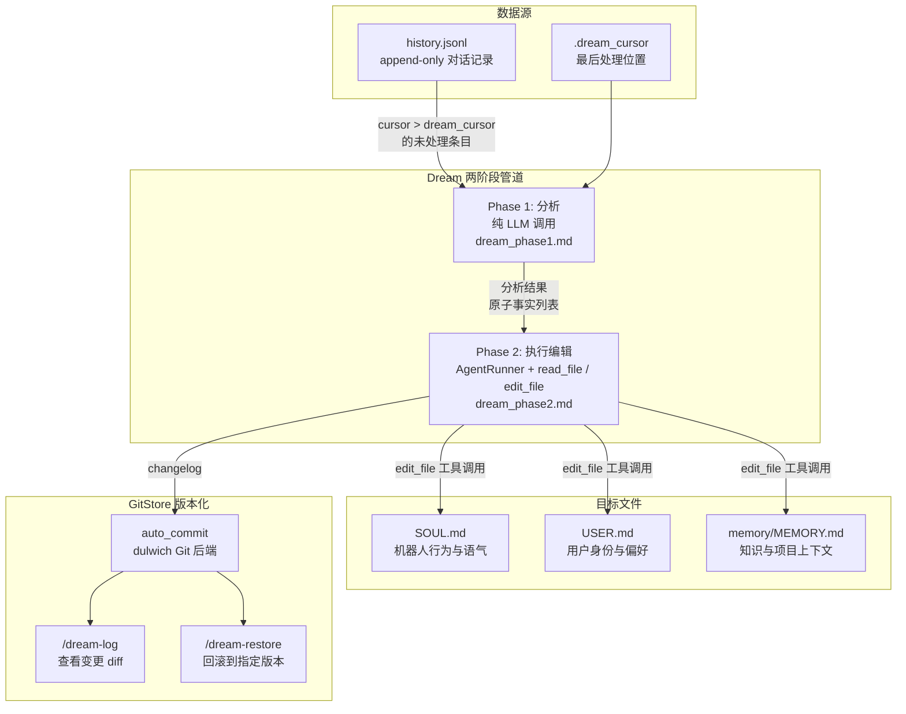
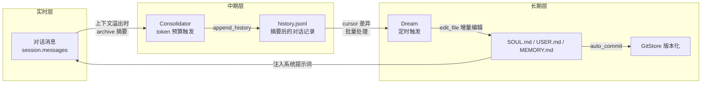

Dream 是 nanobot 的**重量级后台记忆整合引擎**，它定期从 `history.jsonl` 中提取未处理的历史条目，通过两阶段 LLM 管道将对话中的事实性知识注入长期记忆文件（`SOUL.md`、`USER.md`、`MEMORY.md`），并由 GitStore 对每次变更进行版本化管理——用户可以随时查看变更日志或回滚到任意历史版本。与实时触发的 Consolidator（轻量级上下文窗口管理）不同，Dream 以定时任务形式运行，专注于**长期知识的沉淀、过期信息的清理和记忆文件的版本安全**。

Sources: [memory.py](nanobot/agent/memory.py#L519-L525)

## 架构总览：Dream 与 GitStore 的协作模型



**核心设计原则**：Dream 的两阶段拆分将「分析什么值得记住」与「如何修改文件」解耦——Phase 1 只做信息提取，Phase 2 拥有完整的工具能力，可以执行精确的增删改操作，而非粗暴地替换整个文件。

Sources: [memory.py](nanobot/agent/memory.py#L559-L675), [dream_phase1.md](nanobot/templates/agent/dream_phase1.md#L1-L24), [dream_phase2.md](nanobot/templates/agent/dream_phase2.md#L1-L25)

## 调度机制：Cron 系统任务与手动触发

Dream 作为**受保护的系统 Cron 任务**注册到 `CronService`，在进程启动时自动注册，具有以下特征：

| 调度方式 | 配置路径 | 默认值 | 说明 |
|---------|---------|--------|------|
| 固定间隔 | `agents.defaults.dream.intervalH` | 2 小时 | 简单轮询，适合大多数场景 |
| Cron 表达式 | `agents.defaults.dream.cron` | `null` | 遗留兼容接口，优先级高于 `intervalH` |
| 手动触发 | `/dream` 命令 | — | 即时执行，返回执行结果 |

```python
# CronService.register_system_job 保证幂等性
cron.register_system_job(CronJob(
    id="dream",
    name="dream",
    schedule=dream_cfg.build_schedule(config.agents.defaults.timezone),
    payload=CronPayload(kind="system_event"),
))
```

Dream 的 Cron 任务被标记为 `system_event` 类型，这意味着普通用户无法通过 `/cron` 工具删除它——`remove_job` 会拒绝移除受保护的系统任务。

Sources: [commands.py](nanobot/cli/commands.py#L818-L831), [schema.py](nanobot/config/schema.py#L34-L59), [service.py](nanobot/cron/service.py#L354-L366), [service.py](nanobot/cron/service.py#L368-L388)

### DreamConfig 配置参数详解

`DreamConfig` 是 Dream 行为的全部控制面，通过 `config.json` 的 `agents.defaults.dream` 路径配置：

```json
{
  "agents": {
    "defaults": {
      "dream": {
        "intervalH": 2,
        "modelOverride": "anthropic/claude-sonnet-4",
        "maxBatchSize": 20,
        "maxIterations": 10
      }
    }
  }
}
```

| 参数 | 类型 | 默认值 | 约束 | 作用域 |
|------|------|--------|------|--------|
| `intervalH` | `int` | 2 | ≥ 1 | 两次自动 Dream 之间的间隔小时数 |
| `cron` | `string?` | `null` | 标准 cron 表达式 | 遗留覆盖，存在时忽略 `intervalH` |
| `modelOverride` / `model` | `string?` | `null` | 任意模型 ID | Dream 使用的 LLM 模型（可与主模型不同） |
| `maxBatchSize` | `int` | 20 | ≥ 1 | 单次 Dream 处理的最大历史条目数 |
| `maxIterations` | `int` | 10 | ≥ 1 | Phase 2 中 AgentRunner 的最大工具调用迭代次数 |

`modelOverride` 是一个关键的调优杠杆——因为 Dream 不需要最强的推理能力，可以用更经济的模型（如 Sonnet）代替主模型（如 Opus），在保证质量的同时大幅降低后台整合的成本。

Sources: [schema.py](nanobot/config/schema.py#L34-L59), [commands.py](nanobot/cli/commands.py#L819-L823)

### Cron 回调中的 Dream 分支

当 Cron 服务触发 Dream 任务时，回调函数通过 `job.name == "dream"` 识别系统任务，直接调用 `agent.dream.run()` 而不经过完整的 agent 主循环。这种**短路执行**确保 Dream 不会消耗会话资源，也不会意外触发回复消息：

```python
async def on_cron_job(job: CronJob) -> str | None:
    if job.name == "dream":
        try:
            await agent.dream.run()
            logger.info("Dream cron job completed")
        except Exception:
            logger.exception("Dream cron job failed")
        return None  # 不发送任何消息
    # ... 普通任务走 agent loop ...
```

Sources: [commands.py](nanobot/cli/commands.py#L687-L696)

## 两阶段管道详解

### Phase 1：分析与提取

Phase 1 的职责是**将非结构化的对话历史转化为结构化的原子事实列表**。它接收未处理的 `history.jsonl` 条目和当前三个记忆文件的快照，通过一次纯 LLM 调用生成分析结果：

```python
phase1_response = await self.provider.chat_with_retry(
    model=self.model,
    messages=[
        {"role": "system", "content": render_template("agent/dream_phase1.md", strip=True)},
        {"role": "user", "content": phase1_prompt},  # 历史条目 + 文件内容
    ],
    tools=None,       # 不使用工具
    tool_choice=None,  # 不使用工具
)
```

Phase 1 的系统提示词定义了严格的输出协议：

- **`[FILE]` 前缀**：表示需要添加到对应文件的新事实（`[USER]`、`[SOUL]`、`[MEMORY]`）
- **`[FILE-REMOVE]` 前缀**：表示需要从文件中删除的过期内容
- **`[SKIP]`**：如果没有任何需要更新的内容

系统提示词还包含一套**过期内容检测规则**：
- 14 天以上的时间敏感数据（天气、一次性会议、已过期事件）
- 已完成的一次性任务（代码审查、事故处理、已关闭的 PR）
- 被新方案取代的旧方法

Sources: [memory.py](nanobot/agent/memory.py#L589-L611), [dream_phase1.md](nanobot/templates/agent/dream_phase1.md#L1-L24)

### Phase 2：增量编辑执行

Phase 2 接收 Phase 1 的分析结果，委托给 `AgentRunner` 执行。关键设计是 Dream 构建了**独立的精简工具集**——仅包含 `read_file` 和 `edit_file`，限制了 Dream 的能力边界：

```python
def _build_tools(self) -> ToolRegistry:
    """Build a minimal tool registry for the Dream agent."""
    from nanobot.agent.tools.filesystem import EditFileTool, ReadFileTool
    tools = ToolRegistry()
    workspace = self.store.workspace
    tools.register(ReadFileTool(workspace=workspace, allowed_dir=workspace))
    tools.register(EditFileTool(workspace=workspace, allowed_dir=workspace))
    return tools
```

Phase 2 的系统提示词强调**外科手术式编辑**原则：

| 规则 | 目的 |
|------|------|
| 直接编辑——文件内容已提供，无需 `read_file` | 减少不必要的工具调用 |
| 使用精确文本作为 `old_text`，包含周围空行确保唯一匹配 | 避免误改 |
| 同一文件的多次修改合并为一次 `edit_file` 调用 | 效率优化 |
| 删除时将 section header + 全部 bullets 作为 `old_text`，`new_text` 置空 | 清理完整性 |
| 如果没有需要更新的内容，不调用任何工具 | 避免无意义操作 |

```python
result = await self._runner.run(AgentRunSpec(
    initial_messages=messages,
    tools=tools,
    model=self.model,
    max_iterations=self.max_iterations,     # 默认 10
    max_tool_result_chars=self.max_tool_result_chars,
    fail_on_tool_error=False,  # 单个工具失败不终止整个 Dream
))
```

`fail_on_tool_error=False` 确保即使某次编辑失败（例如目标文本已不存在），Phase 2 仍会继续尝试后续编辑，最大化每次 Dream 的有效工作量。

Sources: [memory.py](nanobot/agent/memory.py#L547-L555), [memory.py](nanobot/agent/memory.py#L613-L643), [dream_phase2.md](nanobot/templates/agent/dream_phase2.md#L1-L25)

### Cursor 推进与历史压缩

无论 Phase 2 成功与否，Dream 都会**推进 `.dream_cursor` 到当前批次的最后一条记录**。这是防止无限重试的关键设计——即使分析失败，也不会反复处理同一批历史条目：

```python
# 总是推进 cursor —— 避免 Phase 1 的无限重试
new_cursor = batch[-1]["cursor"]
self.store.set_last_dream_cursor(new_cursor)
self.store.compact_history()
```

`compact_history()` 在每次 Dream 运行后清理超出的历史条目，保留最近的 `max_history_entries`（默认 1000）条。这确保 `history.jsonl` 不会无限增长。

Sources: [memory.py](nanobot/agent/memory.py#L651-L654), [memory.py](nanobot/agent/memory.py#L250-L258)

## GitStore：基于 dulwich 的版本化存储

GitStore 是 nanobot 内嵌的轻量级 Git 版本控制系统，基于纯 Python 实现的 `dulwich` 库，为记忆文件提供**变更历史、差异查看和一键回滚**能力。

### 初始化与白名单策略

GitStore 在 `MemoryStore` 构造时创建，追踪三个核心文件：

```python
self._git = GitStore(workspace, tracked_files=[
    "SOUL.md", "USER.md", "memory/MEMORY.md",
])
```

初始化时，GitStore 生成一份**白名单式 `.gitignore`**——默认忽略所有文件（`/*`），只显式放行追踪的文件和必要目录：

```
/*
!memory/
!SOUL.md
!USER.md
!memory/MEMORY.md
!.gitignore
```

这种设计确保 Git 仓库只包含预期的记忆文件，不会意外追踪工作区中的其他数据（如会话文件、Cron 状态等）。

Sources: [memory.py](nanobot/agent/memory.py#L52-L54), [gitstore.py](nanobot/utils/gitstore.py#L140-L153), [gitstore.py](nanobot/utils/gitstore.py#L40-L78)

### 自动提交机制

`auto_commit` 是 GitStore 的核心操作，在每次 Dream 成功修改记忆文件后被调用：

```python
def auto_commit(self, message: str) -> str | None:
    """Stage tracked memory files and commit if there are changes."""
    st = porcelain.status(str(self._workspace))
    if not st.unstaged and not any(st.staged.values()):
        return None  # 无变更，不创建空提交
    porcelain.add(str(self._workspace), paths=self._tracked_files)
    sha_bytes = porcelain.commit(
        str(self._workspace),
        message=msg_bytes,
        author=b"nanobot <nanobot@dream>",
        committer=b"nanobot <nanobot@dream>",
    )
    return sha_bytes.hex()[:8]  # 返回 8 位短 SHA
```

提交消息遵循格式 `dream: {timestamp}, {N} change(s)`，例如 `dream: 2025-01-15 14:30, 3 change(s)`。**零变更不产生提交**——如果 Phase 2 判断 `[SKIP]` 而没有执行任何编辑，`auto_commit` 检测到无文件变更会直接返回 `None`。

Sources: [gitstore.py](nanobot/utils/gitstore.py#L82-L114), [memory.py](nanobot/agent/memory.py#L668-L673)

### 版本查询与回滚

GitStore 提供三个面向用户的查询/回滚操作：

| 方法 | 对应命令 | 功能 |
|------|---------|------|
| `log(max_entries)` | `/dream-log` | 返回提交历史列表（`CommitInfo` 包含 SHA、消息、时间戳） |
| `show_commit_diff(sha)` | `/dream-log <sha>` | 返回指定提交的元数据和与其父提交的差异 |
| `revert(sha)` | `/dream-restore <sha>` | 将追踪文件恢复到指定提交之前的状态，并创建新的回滚提交 |

`revert` 的实现采用了**树级别回滚**而非 Git revert——直接从父提交的树对象中提取文件内容，覆盖工作区文件，然后创建新提交：

```python
def revert(self, commit: str) -> str | None:
    parent_obj = repo[commit_obj.parents[0]]
    tree = repo[parent_obj.tree]
    for filepath in self._tracked_files:
        content = self._read_blob_from_tree(repo, tree, filepath)
        if content is not None:
            dest = self._workspace / filepath
            dest.write_text(content, encoding="utf-8")
    return self.auto_commit(f"revert: undo {commit}")
```

这种方式的优点是**不依赖三路合并**，避免了潜在的冲突问题——因为 Dream 是唯一的写入者，直接覆盖是安全的。

Sources: [gitstore.py](nanobot/utils/gitstore.py#L157-L236), [gitstore.py](nanobot/utils/gitstore.py#L240-L288)

## 用户交互：Dream 命令体系

nanobot 提供三个斜杠命令来管理 Dream 的生命周期：

### `/dream`：手动触发

立即执行一次 Dream 整合。命令以异步任务形式在后台运行，立即返回 "Dreaming..." 提示，完成后发送包含耗时和结果的通知。这允许用户在对话高峰期后手动触发记忆整合，而不必等待下一次定时触发。

Sources: [builtin.py](nanobot/command/builtin.py#L109-L135)

### `/dream-log [sha]`：查看变更历史

- **无参数**：显示最新一次 Dream 提交的 diff
- **带 SHA**：显示指定提交的 diff

输出格式示例：

```markdown
## Dream Update

Here is the latest Dream memory change.

- Commit: `abcd1234`
- Time: 2025-01-15 14:30
- Changed files: `SOUL.md`, `memory/MEMORY.md`

Use `/dream-restore abcd1234` to undo this change.

​```diff
--- a/SOUL.md
+++ b/SOUL.md
-old tone description
+new tone description
​```
```

Sources: [builtin.py](nanobot/command/builtin.py#L210-L257), [builtin.py](nanobot/command/builtin.py#L165-L190)

### `/dream-restore [sha]`：版本回滚

- **无参数**：列出最近 10 次提交供选择
- **带 SHA**：回滚指定提交，创建安全回滚提交

回滚操作的输出会明确标注：
- 新的安全提交 SHA
- 被恢复的文件列表
- 后续检查命令提示

Sources: [builtin.py](nanobot/command/builtin.py#L260-L303), [builtin.py](nanobot/command/builtin.py#L193-L207)

## 与 Consolidator 和分层记忆的关系

Dream 并非孤立运作，它与 [Consolidator：对话摘要与上下文窗口管理](21-consolidator-dui-hua-zhai-yao-yu-shang-xia-wen-chuang-kou-guan-li) 以及 [分层记忆设计](20-fen-ceng-ji-yi-she-ji-history-jsonl-soul-md-user-md-yu-memory-md) 构成三层记忆管理体系：



**数据流向**：
1. **Consolidator** 在上下文窗口紧张时将旧消息摘要为文本写入 `history.jsonl`（通过 `append_history`）
2. **Dream** 读取 `.dream_cursor` 之后未处理的 `history.jsonl` 条目，提取知识写入记忆文件
3. **ContextBuilder** 在构建系统提示词时读取记忆文件和最近的历史条目，注入到每次对话中

Dream 的 `.dream_cursor` 是与 Consolidator 的 `.cursor` **独立**的——Consolidator 的 cursor 追踪 `history.jsonl` 的写入位置，而 Dream 的 cursor 追踪 Dream 已处理的位置。两个 cursor 之间的差值就是 Dream 尚未整合的历史条目数量。

Sources: [memory.py](nanobot/agent/memory.py#L346-L353), [context.py](nanobot/agent/context.py#L56-L60), [memory.py](nanobot/agent/memory.py#L302-L313)

## 关键设计决策与权衡

| 决策 | 选择 | 权衡 |
|------|------|------|
| Git 实现 | dulwich（纯 Python） | 无需系统 Git 依赖，但性能不如原生 Git（对小型记忆文件可忽略） |
| 追踪策略 | 白名单（`.gitignore` 排除所有） | 安全但不够灵活——新增追踪文件需要修改代码 |
| 编辑方式 | AgentRunner + edit_file（而非全量替换） | 保留未修改内容，但依赖 LLM 的文本匹配精度 |
| Cursor 推进 | 总是推进（即使 Phase 2 失败） | 避免无限重试，但可能丢失少量未整合的知识 |
| 失败处理 | `fail_on_tool_error=False` | 最大化单次工作量，但部分失败可能被掩盖 |
| 模型选择 | 独立 `modelOverride` 配置 | 允许用经济模型做后台整合，但需要用户主动配置 |
| 回滚方式 | 树级别覆盖（而非 git revert） | 简单可靠，但丢失了中间状态的选择性恢复能力 |

Sources: [memory.py](nanobot/agent/memory.py#L527-L542), [gitstore.py](nanobot/utils/gitstore.py#L240-L288)

## 下一步阅读

- [分层记忆设计：history.jsonl、SOUL.md、USER.md 与 MEMORY.md](20-fen-ceng-ji-yi-she-ji-history-jsonl-soul-md-user-md-yu-memory-md) — 理解 Dream 操作的三个目标文件各自的职责与格式规范
- [Consolidator：对话摘要与上下文窗口管理](21-consolidator-dui-hua-zhai-yao-yu-shang-xia-wen-chuang-kou-guan-li) — 理解 Dream 的上游数据来源——Consolidator 如何将对话摘要写入 history.jsonl
- [Cron 服务：定时任务调度与多时区支持](24-cron-fu-wu-ding-shi-ren-wu-diao-du-yu-duo-shi-qu-zhi-chi) — 理解 Dream 作为系统 Cron 任务的注册、保护和触发机制
- [Agent Runner：共享执行引擎与上下文压缩策略](6-agent-runner-gong-xiang-zhi-xing-yin-qing-yu-shang-xia-wen-ya-suo-ce-lue) — 理解 Dream Phase 2 底层使用的 AgentRunner 执行模型