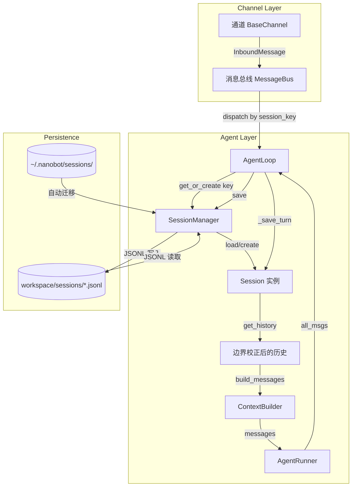
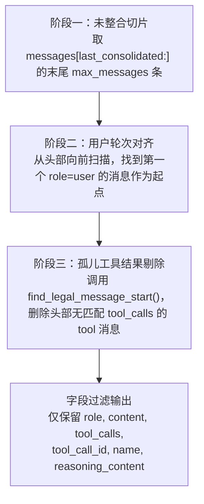
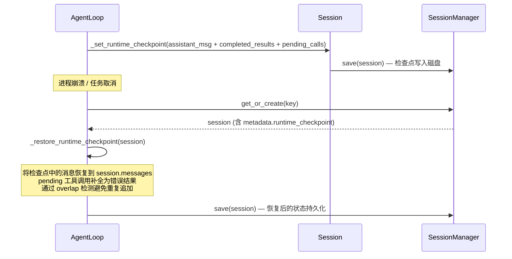

会话管理器是 nanobot 运行时中负责**对话状态持久化与消息边界守卫**的核心组件。它位于通道层与 Agent 主循环之间，以 `channel:chat_id` 为键将每个对话的完整消息序列持久化为 JSONL 文件，同时提供一套精确的边界校正机制，确保送往 LLM 的消息历史永远不会以"孤儿工具结果"（orphan tool result）或断裂的多轮对话片段开头。本文将深入解析 `Session` 数据模型、`SessionManager` 的加载/保存/迁移策略、消息边界校正算法 `find_legal_message_start`，以及运行时检查点恢复如何与 Consolidator 协同工作。

Sources: [manager.py](nanobot/session/manager.py#L1-L237), [events.py](nanobot/bus/events.py#L1-L39)

## 架构定位：会话管理器在系统中的角色

会话管理器并不直接参与 LLM 调用或通道消息收发——它是一个**纯粹的对话状态仓库**，被 `AgentLoop` 持有并通过 `SessionManager` 接口操作。其核心职责可归纳为以下四点：

1. **会话寻址与隔离**：通过 `channel:chat_id` 二元组唯一定位一个会话，支持 `session_key_override` 实现线程级会话隔离（例如 Slack thread、Telegram topic）。
2. **消息持久化**：以 JSONL 格式逐行写入工作区 `sessions/` 目录，首行为元数据行（`_type: metadata`），后续每行为一条消息。
3. **历史窗口裁剪**：`get_history` 方法在返回消息给 LLM 之前，执行两轮边界校正——先对齐到 `user` 角色起头，再剔除孤儿工具结果。
4. **崩溃恢复**：运行时检查点机制在 Agent 循环的每次迭代中保存中间状态，重启后自动将未完成的工具调用补全为错误结果。

下面的 Mermaid 图展示了会话管理器在消息处理流程中的交互关系：



Sources: [loop.py](nanobot/agent/loop.py#L510-L614), [base.py](nanobot/channels/base.py#L127-L171), [manager.py](nanobot/session/manager.py#L96-L137)

## Session 数据模型：消息、元数据与整合偏移量

`Session` 是一个 `@dataclass`，承载单个对话的完整运行时状态。其字段设计体现了 nanobot 对**渐进式上下文管理**的核心思路：

| 字段 | 类型 | 说明 |
|------|------|------|
| `key` | `str` | 会话唯一标识，格式为 `channel:chat_id`（如 `telegram:123456`） |
| `messages` | `list[dict]` | 完整消息列表，包括已整合和未整合的所有消息 |
| `created_at` | `datetime` | 会话创建时间 |
| `updated_at` | `datetime` | 最后更新时间，每次 `add_message` 或 `save` 时刷新 |
| `metadata` | `dict` | 扩展元数据，当前主要用于存储运行时检查点（`runtime_checkpoint`） |
| `last_consolidated` | `int` | 已被 Consolidator 整合到 `history.jsonl` 的消息数量偏移量 |

**`last_consolidated` 偏移量**是理解 Session 与 Consolidator 关系的关键。它不是时间戳，而是一个**消息索引计数器**：`session.messages[0:last_consolidated]` 代表已被 LLM 摘要并归档的"旧消息"，而 `session.messages[last_consolidated:]` 则是仍需作为上下文喂给 LLM 的"活跃消息"。`get_history` 正是基于这个偏移量来决定从哪里开始切片。当 Consolidator 完成一轮整合后，会将此偏移量前移，但不会从 `messages` 列表中物理删除已被整合的消息——这些消息仍保留在 JSONL 文件中作为完整审计记录。

Sources: [manager.py](nanobot/session/manager.py#L16-L26), [manager.py](nanobot/session/manager.py#L38-L61)

## 会话键的寻址与会话隔离

每个会话通过一个**字符串键**（`key`）进行唯一寻址。键的派生遵循以下优先级：

1. **显式覆盖**：通道在调用 `_handle_message` 时可通过 `session_key` 参数传入自定义键（如 `slack:C12345:1234567890.123456` 用于线程级隔离）。
2. **默认派生**：`InboundMessage.session_key` 属性在无覆盖时自动组合为 `"{channel}:{chat_id}"`。

这一设计使得以下隔离场景成为可能：

| 场景 | 键格式 | 说明 |
|------|--------|------|
| Telegram 普通对话 | `telegram:123456` | 按聊天 ID 隔离 |
| Telegram Topic 消息 | `telegram:123456:789` | 通过 `_derive_topic_session_key` 按话题进一步隔离 |
| Slack 线程回复 | `slack:C12345:1234567890.123456` | 同一频道不同线程拥有独立会话 |
| CLI 直接输入 | `cli:direct` | 命令行模式使用固定键 |
| SDK 调用 | `sdk:default` | Python SDK 默认键，可自定义 |
| 心跳服务 | `heartbeat` | 固定键，且在每次执行后通过 `retain_recent_legal_suffix` 裁剪 |

Sources: [events.py](nanobot/bus/events.py#L19-L24), [loop.py](nanobot/agent/loop.py#L762-L778), [commands.py](nanobot/cli/commands.py#L770-L783)

## JSONL 持久化格式与迁移策略

`SessionManager` 将每个会话以 **JSONL（JSON Lines）** 格式写入工作区的 `sessions/` 子目录。文件名通过对键进行安全化处理（替换 `<>:"/\|?*` 为下划线）得到，例如 `telegram_123456.jsonl`。

文件结构如下：

```
# 第一行：元数据行
{"_type":"metadata","key":"telegram:123456","created_at":"2025-01-15T10:30:00","updated_at":"2025-01-15T11:00:00","metadata":{},"last_consolidated":42}

# 后续行：消息记录，每行一条
{"role":"user","content":"你好","timestamp":"2025-01-15T10:30:01"}
{"role":"assistant","content":"你好！有什么可以帮你的？","timestamp":"2025-01-15T10:30:05"}
{"role":"assistant","content":null,"tool_calls":[{"id":"call_abc","type":"function","function":{"name":"shell","arguments":"{\"command\":\"ls\"}"}}],"timestamp":"2025-01-15T10:30:06"}
{"role":"tool","tool_call_id":"call_abc","name":"shell","content":"file1.txt\nfile2.txt","timestamp":"2025-01-15T10:30:07"}
```

**迁移机制**：nanobot 曾将所有会话存储在全局目录 `~/.nanobot/sessions/` 下。引入多工作区支持后，会话文件迁移至各工作区的 `sessions/` 子目录。`_load` 方法在发现工作区目录没有对应文件时，会检查旧全局目录是否存在，若存在则通过 `shutil.move` 自动迁移，实现**零干预升级**。

Sources: [manager.py](nanobot/session/manager.py#L103-L184), [paths.py](nanobot/config/paths.py#L60-L63), [helpers.py](nanobot/utils/helpers.py#L83-L85)

## 消息边界校正：get_history 的三阶段算法

`Session.get_history` 是会话管理器最核心的方法，它决定哪些消息会作为上下文喂给 LLM。其实现包含三个精确的阶段：



**阶段一——未整合切片**：从 `last_consolidated` 偏移量开始，取最新的 `max_messages` 条消息。默认 `max_messages=500`，但在 Agent 主循环中调用时传入 `0`，表示不额外截断（返回所有未整合消息）。[manager.py](nanobot/session/manager.py#L38-L42)

**阶段二——用户轮次对齐**：线性扫描切片结果，找到第一条 `role == "user"` 的消息，将切片起点前移至该位置。这确保了 LLM 接收到的历史总是以用户发言开头，避免以 assistant 的回复片段开始上下文——那会导致模型困惑。[manager.py](nanobot/session/manager.py#L44-L47)

**阶段三——孤儿工具结果剔除**：这是最关键的边界校正步骤，由 `find_legal_message_start` 函数实现。在 LLM 对话协议中，每个 `role: tool` 消息必须有一个对应的 `role: assistant` 消息中的 `tool_calls` 声明。如果窗口裁剪导致某个 `tool` 消息的声明方（assistant 消息）被截断在外，这个 tool 消息就成了"孤儿"——将它发给 LLM 会导致 API 调用失败。

Sources: [manager.py](nanobot/session/manager.py#L38-L61), [helpers.py](nanobot/utils/helpers.py#L100-L120)

## find_legal_message_start：孤儿工具结果检测算法

`find_legal_message_start` 函数的实现逻辑清晰而精确：

1. 维护一个 `declared` 集合，记录所有已见到的 `assistant.tool_calls[].id`。
2. 逐条扫描消息：
   - 遇到 `assistant` 消息时，将其所有 `tool_calls` 的 ID 加入 `declared` 集合。
   - 遇到 `tool` 消息时，检查其 `tool_call_id` 是否在 `declared` 中。
     - 若**不存在**，说明这是一个孤儿结果，将 `start` 指针推进到 `i + 1`，清空 `declared`，并从新的 `start` 位置重新构建已声明集合。
     - 若**存在**，则该工具结果合法。
3. 返回最终的 `start` 索引——调用者截断 `messages[start:]` 即可保证头部无孤儿。

这种**渐进式扫描 + 回退重建**的策略比简单的"检查第一条消息是否为 tool"更健壮。它正确处理了窗口中间存在多组 assistant-tool 消息对的情况——只要某组完整，即使前面的组被部分截断，算法也能精确找到第一个合法起点。

| 场景 | 消息序列 | 检测结果 |
|------|----------|----------|
| 正常历史 | `[user, assistant, tool, assistant, tool, user]` | `start=0`，无孤儿 |
| 头部被截断 | `[tool(A), tool(B), user, assistant, tool(C)]` | `start=2`，剔除 tool(A) 和 tool(B) |
| 中间断裂 | `[tool(孤儿), assistant(declares C), tool(C), user]` | `start=3`，孤儿和其后的合法对一并剔除后重建 |

Sources: [helpers.py](nanobot/utils/helpers.py#L100-L120)

## retain_recent_legal_suffix：会话裁剪的镜像操作

`retain_recent_legal_suffix` 与 `get_history` 是一对**镜像方法**——后者读取时做边界校正，前者在写入时做边界裁剪。它主要用于心跳服务（Heartbeat）等场景，需要在每次执行后保持一个有界的历史尾部。

其算法与 `get_history` 的阶段二、三完全对称：

1. 计算裁剪起点 `start_idx = len(messages) - max_messages`。
2. 如果裁剪起点落在非 `user` 消息上，**向前回退**到最近的 `user` 消息，确保保留的片段以完整轮次开始。
3. 调用 `find_legal_message_start` 剔除可能产生的孤儿工具结果。
4. 物理替换 `session.messages`，并按比例调整 `last_consolidated` 偏移量（`max(0, last_consolidated - dropped)`）。

心跳服务默认保留最近 8 条消息（`keep_recent_messages: 8`），通过 `retain_recent_legal_suffix(8)` 调用。这确保心跳会话不会无限增长，同时保留足够的短期上下文以维持对话连贯性。

Sources: [manager.py](nanobot/session/manager.py#L69-L93), [commands.py](nanobot/cli/commands.py#L779-L783), [schema.py](nanobot/config/schema.py#L133)

## _save_turn：消息净化与持久化策略

`AgentLoop._save_turn` 是 Agent 主循环向 Session 写入消息的入口。它并非简单地追加原始消息，而是执行了一系列**净化操作**，确保持久化的内容既不会膨胀 JSONL 文件，也不会在下次加载时产生协议错误：

| 净化规则 | 适用角色 | 说明 |
|----------|----------|------|
| 跳过空 assistant 消息 | `assistant` | `content` 为空且无 `tool_calls` 的消息会被直接丢弃——它们会"毒化"会话上下文 |
| 工具结果截断 | `tool` | 超过 `max_tool_result_chars` 的文本内容会被截断并添加 `... (truncated)` 后缀 |
| 多模态内容净化 | `tool`, `user` | `image_url` 类型的 base64 数据被替换为 `[image: path]` 占位符 |
| 运行时上下文剥离 | `user` | 以 `[Runtime Context — metadata only, not instructions]` 开头的运行时注入文本被剥离，仅保留用户原始输入 |
| 时间戳补充 | 所有 | 若消息缺少 `timestamp` 字段，自动补充当前时间 |

此外，`_save_turn` 通过 `skip` 参数实现**增量写入**——它只追加 `messages[skip:]` 部分（即本次 Agent 循环新产生的消息），跳过已有的历史消息。

Sources: [loop.py](nanobot/agent/loop.py#L657-L688), [loop.py](nanobot/agent/loop.py#L616-L655)

## 运行时检查点：崩溃恢复与未完成轮次重放

Agent 在执行工具调用链的过程中可能因进程崩溃、超时或手动取消而中断。此时，LLM 可能已经返回了一个包含 `tool_calls` 的 assistant 消息，但对应的工具结果尚未执行或尚未写回 Session。如果直接重新加载会话，LLM 会看到一个"声明了工具调用但没有结果"的断裂上下文，导致后续对话异常。

**运行时检查点机制**解决了这个问题：



恢复逻辑的精妙之处在于 **overlap 检测**：它将检查点中的消息与 session 现有末尾进行最长公共前缀匹配（基于 `_checkpoint_message_key` 的七元组比较），只追加不重叠的部分。这保证了即使在极端情况下（检查点写入成功但 session 追加也部分成功），也不会产生重复消息。

对于已被声明但未完成的工具调用（`pending_tool_calls`），恢复时会生成一条 `content: "Error: Task interrupted before this tool finished."` 的工具结果，使 LLM 在下一轮对话中看到完整的调用-结果链，从而正确决策后续行为。

Sources: [loop.py](nanobot/agent/loop.py#L690-L760), [loop.py](nanobot/agent/loop.py#L524-L526)

## SessionManager 缓存与会话生命周期

`SessionManager` 维护一个**内存缓存字典** `_cache: dict[str, Session]`，通过 `get_or_create` 实现经典的"缓存未命中则加载"模式：

1. 命中缓存 → 直接返回 `Session` 实例。
2. 未命中 → 尝试从 JSONL 文件 `_load`，加载失败（文件不存在或格式错误）则创建空 Session。
3. 加载成功或创建后 → 写入缓存并返回。

**关键设计决策**：`SessionManager` 不实现 LRU 淘汰或引用计数——缓存在整个 Agent 生命周期内持续增长。这是有意为之：nanobot 的会话数量通常与活跃通道/聊天数成正比，在个人 Agent 场景下（数十到数百个会话）不会构成内存压力。`invalidate` 方法仅在特殊场景（如外部修改会话文件后强制刷新）下使用。

`list_sessions` 方法扫描 `sessions/*.jsonl`，仅读取每个文件的第一行（元数据行）以提取 `key`、`created_at`、`updated_at` 信息，按更新时间倒序排列返回，用于管理界面展示。

Sources: [manager.py](nanobot/session/manager.py#L96-L237)

## 与 Consolidator 的协同：last_consolidated 偏移量管理

会话管理器与 [Consolidator](21-consolidator-dui-hua-zhai-yao-yu-shang-xia-wen-chuang-kou-guan-li) 通过 `last_consolidated` 字段形成紧密协作：

1. **Agent 主循环**在处理每条消息前，调用 `consolidator.maybe_consolidate_by_tokens(session)` 评估是否需要整合。
2. Consolidator 调用 `session.get_history(max_messages=0)` 获取当前未整合消息，估算 prompt token 总量。
3. 若超过预算（`context_window_tokens - max_completion_tokens - 1024`），Consolidator 调用 `pick_consolidation_boundary` 在 `last_consolidated` 之后的用户轮次边界处选择一个整合终点。
4. 整合完成后，`session.last_consolidated` 被更新为整合终点索引，`sessions.save(session)` 持久化。
5. 下次 `get_history` 调用时，已被整合的消息自动被排除在 LLM 输入之外。

这个设计实现了**零拷贝的渐进式上下文管理**：已整合的消息不会被物理删除，而是通过偏移量逻辑性地"隐藏"。这既保证了 JSONL 文件的完整审计能力，又确保 LLM 只看到必要的近期上下文。

Sources: [memory.py](nanobot/agent/memory.py#L451-L511), [loop.py](nanobot/agent/loop.py#L527-L543)

## 边界校正的测试保障

会话管理器的边界校正逻辑拥有**高密度的回归测试**，覆盖了从正常场景到极端边缘情况的全谱系。测试文件 `test_session_manager_history.py` 中的关键用例包括：

| 测试用例 | 验证点 |
|----------|--------|
| `test_get_history_drops_orphan_tool_results_when_window_cuts_tool_calls` | 核心回归：20 轮旧工具调用 + 25 轮新工具调用 + 窗口截断后无孤儿 |
| `test_legitimate_tool_pairs_preserved_after_trim` | 正向验证：合法的工具调用对在窗口裁剪后完整保留 |
| `test_window_cuts_mid_tool_group` | 窗口切在一个 assistant 的两个 tool result 之间时的处理 |
| `test_all_orphan_prefix_stripped` | 极端场景：全部开头消息都是孤儿工具结果 |
| `test_empty_session_history` | 空会话返回空列表 |
| `test_no_tool_messages_unchanged` | 无工具消息的纯对话不受边界校正影响 |
| `test_retain_recent_legal_suffix_*` | 四个测试覆盖裁剪的保留、偏移量调整、清零和工具边界 |

每个测试都通过 `_assert_no_orphans` 辅助函数断言：输出历史中每个 `role: tool` 消息的 `tool_call_id` 都能在某个 `role: assistant` 消息的 `tool_calls` 中找到对应声明。这是确保 LLM API 调用不会因消息协议错误而失败的关键保障。

Sources: [test_session_manager_history.py](tests/agent/test_session_manager_history.py#L1-L220)

## 延伸阅读

- [Agent Runner：共享执行引擎与上下文压缩策略](6-agent-runner-gong-xiang-zhi-xing-yin-qing-yu-shang-xia-wen-ya-suo-ce-lue) —— 了解 Agent 主循环如何调用 SessionManager
- [Consolidator：对话摘要与上下文窗口管理](21-consolidator-dui-hua-zhai-yao-yu-shang-xia-wen-chuang-kou-guan-li) —— `last_consolidated` 偏移量的消费者与驱动者
- [通道架构：BaseChannel 接口与通道管理器](16-tong-dao-jia-gou-basechannel-jie-kou-yu-tong-dao-guan-li-qi) —— 会话键的源头：通道如何派生 `session_key`
- [Python SDK：Nanobot 门面类与会话隔离](28-python-sdk-nanobot-men-mian-lei-yu-hui-hua-ge-chi) —— SDK 层如何通过 `session_key` 参数实现多会话并行