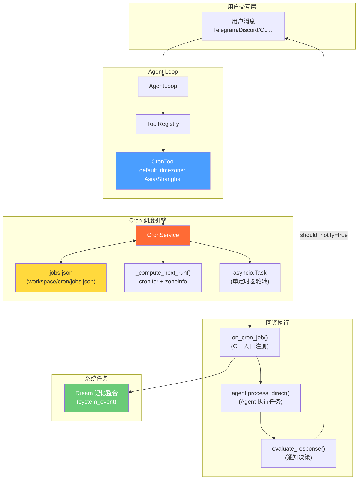
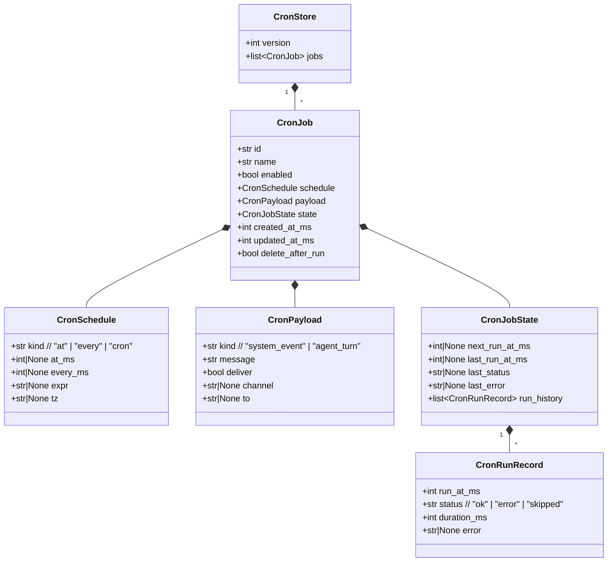
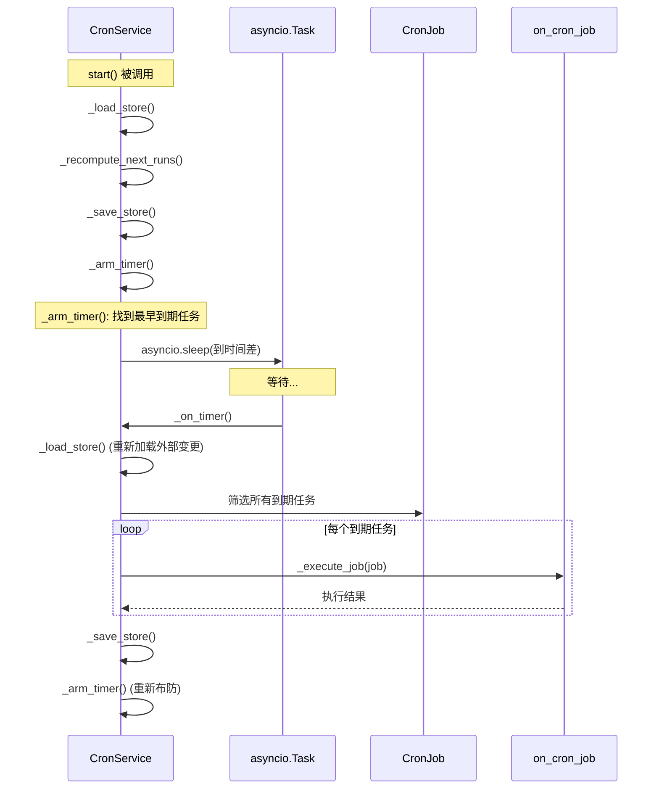
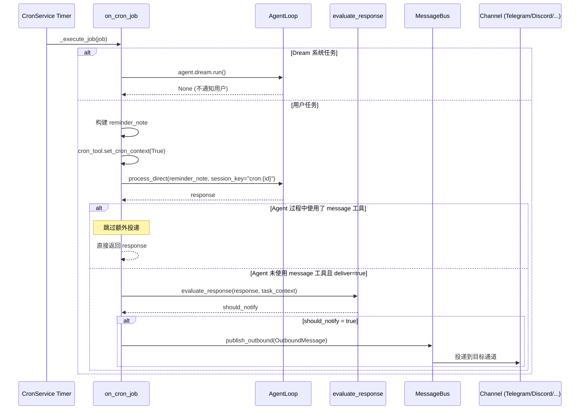
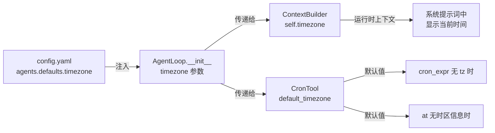

nanobot 的 Cron 服务是一套完整的定时任务调度系统，允许 AI Agent 在指定时间自动执行提醒、周期性任务和一次性调度。它支持三种调度模式（固定间隔、Cron 表达式、一次性定时），通过 IANA 时区实现多时区精确调度，并以 JSON 文件持久化所有任务状态。Cron 服务不仅是 Agent 主动使用 `cron` 工具时的执行引擎，还承载了系统级内部任务（如 Dream 记忆整合），形成了"用户任务 + 系统任务"的双层调度架构。

Sources: [types.py](nanobot/cron/types.py#L1-L70), [service.py](nanobot/cron/service.py#L1-L66)

## 整体架构

Cron 服务的核心由两层组成：**调度引擎层**（`CronService`）负责任务存储、时间计算和定时触发；**工具接口层**（`CronTool`）封装为 Agent 可调用的工具，处理参数解析、格式化和上下文隔离。两者的关系以及与 Agent Loop 的集成方式如下图所示：



**关键设计决策**：CronService 采用**单定时器轮转**（single timer rotation）模式而非轮询。它始终只为最近一个到期任务设置一个 `asyncio.sleep` 定时器，任务执行完毕后重新计算下一个最早到期时间并重新布防。这种设计在大任务量下避免了空轮询的 CPU 开销。执行回调 `on_cron_job` 在 gateway 启动时注册（[commands.py](nanobot/cli/commands.py#L687-L742)），将 cron 触发桥接到完整的 Agent 处理流水线。

Sources: [service.py](nanobot/cron/service.py#L228-L245), [commands.py](nanobot/cli/commands.py#L686-L742)

## 数据模型：五层类型体系

Cron 服务的类型定义位于 `nanobot/cron/types.py`，采用 Python dataclass 构建，形成五层嵌套结构：



每个类型的职责清晰划分：**`CronSchedule`** 定义"何时执行"（三种模式通过 `kind` 字段区分）；**`CronPayload`** 定义"执行什么"以及"结果是否投递给用户"；**`CronJobState`** 跟踪运行时状态，包含最近 20 条执行历史（`_MAX_RUN_HISTORY`）；**`CronJob`** 是顶层实体，组合了调度、负载和状态；**`CronStore`** 是持久化容器，对应磁盘上的 JSON 文件。

Sources: [types.py](nanobot/cron/types.py#L1-L70), [service.py](nanobot/cron/service.py#L66-L67)

## 三种调度模式

| 模式 | `kind` 值 | 核心字段 | 典型场景 | 结束行为 |
|------|-----------|----------|----------|----------|
| **固定间隔** | `"every"` | `every_ms` | 每 30 分钟检查一次、每小时报告状态 | 持续循环，每次执行后重新计算下一次 |
| **Cron 表达式** | `"cron"` | `expr` + `tz` | 每工作日 9:00 发送晨报、每天 18:00 提醒 | 持续循环，每次执行后重新计算下一次 |
| **一次性定时** | `"at"` | `at_ms` | 10 分钟后提醒开会、特定时间触发 | 执行一次后自动禁用或删除 |

### Cron 表达式与多时区

Cron 模式通过 [croniter](https://github.com/kiorky/croniter) 库解析标准五段式 cron 表达式（分 时 日 月 周），并使用 Python 标准库 `zoneinfo.ZoneInfo` 处理 IANA 时区。时间计算的核心逻辑在 `_compute_next_run` 函数中：

```python
# 以用户指定时区为基准，计算下一次执行时间
tz = ZoneInfo(schedule.tz) if schedule.tz else datetime.now().astimezone().tzinfo
base_dt = datetime.fromtimestamp(base_time, tz=tz)
cron = croniter(schedule.expr, base_dt)
next_dt = cron.get_next(datetime)
return int(next_dt.timestamp() * 1000)
```

时区解析遵循明确的优先级链：**用户显式指定 `tz` 参数** → **配置文件中的 `agents.defaults.timezone`** → **系统本地时区**。这意味着即使用户未在 cron 调用中指定时区，系统也会使用配置文件中的默认时区（如 `Asia/Shanghai`），而非简单回退到 UTC。

Sources: [service.py](nanobot/cron/service.py#L20-L46), [service.py](nanobot/cron/service.py#L49-L61), [cron.py](nanobot/agent/tools/cron.py#L140-L164)

### 时区校验与错误防御

Cron 服务在两个层面实施时区校验，确保无效时区不会静默创建无法执行的任务：

**服务层校验**（`_validate_schedule_for_add`）：在 `add_job` 时检查 `tz` 是否仅用于 `cron` 类型调度，并验证 IANA 时区名称的有效性。无效时区会直接抛出 `ValueError`，阻止任务创建。

**工具层校验**（`CronTool._validate_timezone`）：在 Agent 工具调用时提前拦截，返回人类可读的错误消息（如 `"Error: unknown timezone 'America/Vancovuer'"`），让 Agent 能够纠正拼写错误并重试。

Sources: [service.py](nanobot/cron/service.py#L49-L61), [cron.py](nanobot/agent/tools/cron.py#L65-L73)

## CronTool：Agent 工具接口

`CronTool` 是 Cron 服务暴露给 Agent 的工具接口，遵循 [工具注册表与动态管理](11-gong-ju-zhu-ce-biao-yu-dong-tai-guan-li) 中描述的 `Tool` 基类协议。它提供三个动作：

| 动作 | 功能 | 必需参数 | 可选参数 |
|------|------|----------|----------|
| `add` | 创建新任务 | `message` | `name`, `every_seconds`, `cron_expr`, `tz`, `at`, `deliver` |
| `list` | 列出所有活跃任务 | — | — |
| `remove` | 删除指定任务 | `job_id` | — |

### 参数解析与调度构建

`_add_job` 方法根据传入参数自动选择调度模式，构建优先级为 `every_seconds` → `cron_expr` → `at`。对于 Cron 表达式模式，如果用户未指定 `tz`，工具自动使用 `default_timezone`（从配置注入）。对于一次性任务，工具将 ISO 时间字符串解析为毫秒时间戳，并设置 `delete_after_run=True`。

```python
# CronTool._add_job 的调度构建逻辑（简化）
if every_seconds:
    schedule = CronSchedule(kind="every", every_ms=every_seconds * 1000)
elif cron_expr:
    effective_tz = tz or self._default_timezone
    schedule = CronSchedule(kind="cron", expr=cron_expr, tz=effective_tz)
elif at:
    dt = datetime.fromisoformat(at)
    if dt.tzinfo is None:
        dt = dt.replace(tzinfo=ZoneInfo(self._default_timezone))
    schedule = CronSchedule(kind="at", at_ms=int(dt.timestamp() * 1000))
```

### Cron 上下文隔离

`CronTool` 通过 `ContextVar` 实现了一个关键的安全约束：**在 Cron 任务回调执行期间，禁止嵌套创建新的 Cron 任务**。当 `on_cron_job` 回调触发时，它通过 `set_cron_context(True)` 进入 Cron 上下文，在此上下文中任何 `add` 动作都会被拒绝，返回 `"Error: cannot schedule new jobs from within a cron job execution"`。这防止了任务递归爆炸。

Sources: [cron.py](nanobot/agent/tools/cron.py#L1-L119), [cron.py](nanobot/agent/tools/cron.py#L120-L175), [cron.py](nanobot/agent/tools/cron.py#L42-L63)

## 调度引擎内部机制

### 单定时器轮转（Single Timer Rotation）

`CronService` 不采用轮询模式，而是使用"最近到期优先"的单定时器策略。核心流程：



`_arm_timer` 方法每次调用时先取消旧的定时器任务，然后计算最近到期时间与当前时间的差值，创建新的 `asyncio.sleep` 任务。`_on_timer` 触发时，会筛选**所有**已到期任务（`now >= next_run_at_ms`）并逐一执行，确保即使多个任务同时到期也不会遗漏。

Sources: [service.py](nanobot/cron/service.py#L195-L263)

### 任务执行与历史记录

每个任务执行后，`_execute_job` 方法会更新运行状态并追加执行历史记录：

```python
job.state.run_history.append(CronRunRecord(
    run_at_ms=start_ms,
    status=job.state.last_status,    # "ok" 或 "error"
    duration_ms=end_ms - start_ms,
    error=job.state.last_error,
))
job.state.run_history = job.state.run_history[-self._MAX_RUN_HISTORY:]  # 保留最近 20 条
```

历史记录同步持久化到 `jobs.json`，服务重启后仍然保留。执行失败时，错误信息会记录在 `last_error` 字段和对应的 `CronRunRecord` 中，方便调试。

对于一次性任务（`kind == "at"`），执行完成后根据 `delete_after_run` 标志决定是自动删除还是仅禁用。固定间隔和 Cron 表达式任务则会重新计算下一次执行时间。

Sources: [service.py](nanobot/cron/service.py#L265-L305)

### 热重载：文件变更检测

`CronService` 的 `_load_store` 方法实现了基于文件 `mtime` 的热重载机制。在每次定时器触发（`_on_timer`）时，它会检测 `jobs.json` 是否被外部修改（如另一个 nanobot 实例或手动编辑），如果发现变更则自动重新加载。这使得以下场景成为可能：

- **多实例协同**：一个实例添加任务，运行中的实例自动感知并执行
- **外部禁用**：通过外部操作禁用任务后，运行中的实例在下一次检查时停止触发该任务
- **手动干预**：管理员可以直接编辑 `jobs.json` 文件来紧急调整任务

Sources: [service.py](nanobot/cron/service.py#L80-L140), [test_cron_service.py](tests/cron/test_cron_service.py#L117-L143)

## 持久化与存储

所有任务数据存储在 `{workspace}/cron/jobs.json` 文件中，JSON 格式，使用驼峰命名（camelCase）以保持与外部工具的兼容性。文件结构示例：

```json
{
  "version": 1,
  "jobs": [
    {
      "id": "a1b2c3d4",
      "name": "Morning standup",
      "enabled": true,
      "schedule": {
        "kind": "cron",
        "atMs": null,
        "everyMs": null,
        "expr": "0 9 * * 1-5",
        "tz": "Asia/Shanghai"
      },
      "payload": {
        "kind": "agent_turn",
        "message": "Send daily standup reminder",
        "deliver": true,
        "channel": "telegram",
        "to": "chat-12345"
      },
      "state": {
        "nextRunAtMs": 1773684000000,
        "lastRunAtMs": 1773673200000,
        "lastStatus": "ok",
        "lastError": null,
        "runHistory": [
          { "runAtMs": 1773673200000, "status": "ok", "durationMs": 2340, "error": null }
        ]
      },
      "createdAtMs": 1773600000000,
      "updatedAtMs": 1773673200000,
      "deleteAfterRun": false
    }
  ]
}
```

从早期版本升级时，`_migrate_cron_store` 函数会自动将遗留的全局目录（`~/.nanobot/cron/jobs.json`）迁移到 workspace 目录下，仅当目标是默认 workspace 且新位置尚无文件时执行。

Sources: [service.py](nanobot/cron/service.py#L142-L193), [commands.py](nanobot/cli/commands.py#L522-L532)

## 系统任务：Dream 记忆整合

Cron 服务承载了一个特殊的系统任务——**Dream 记忆整合**（详见 [Dream：两阶段长期记忆整合与 GitStore 版本化](22-dream-liang-jie-duan-chang-qi-ji-yi-zheng-he-yu-gitstore-ban-ben-hua)）。Dream 任务通过 `register_system_job` 注册，具有以下特殊属性：

| 属性 | 值 | 含义 |
|------|-----|------|
| `id` | `"dream"` | 固定 ID，重启时幂等覆盖 |
| `payload.kind` | `"system_event"` | 标记为系统任务 |
| `schedule` | 由 `DreamConfig.build_schedule(timezone)` 生成 | 支持固定间隔或 Cron 表达式 |

**系统任务保护机制**：`remove_job` 方法检查 `payload.kind == "system_event"` 的任务，返回 `"protected"` 状态而非删除。在 `CronTool._list_jobs` 的输出中，系统任务会额外显示其用途说明和"cannot be removed"标记：

```
- dream (id: dream, cron: 0 */2 * * * (UTC))
  Purpose: Dream memory consolidation for long-term memory.
  Protected: visible for inspection, but cannot be removed.
```

Dream 任务的执行走特殊路径：`on_cron_job` 回调中检测到 `job.name == "dream"` 时，直接调用 `agent.dream.run()` 而非走 Agent Loop，避免消耗完整的对话上下文。

Sources: [service.py](nanobot/cron/service.py#L354-L366), [service.py](nanobot/cron/service.py#L368-L388), [commands.py](nanobot/cli/commands.py#L818-L831), [cron.py](nanobot/agent/tools/cron.py#L211-L250)

## 回调执行流程

当 Cron 触发一个用户任务时，完整的执行链路如下：



**关键设计点**：

1. **会话隔离**：每个 Cron 任务使用 `cron:{job_id}` 作为独立的 session key，不会与用户正常对话的会话历史混淆。
2. **上下文隔离**：进入 Cron 回调时设置 `cron_context=True`，阻止在 Cron 执行中嵌套创建新任务。
3. **智能通知决策**：当 Agent 已在执行过程中主动使用 `message` 工具发送消息时，`_sent_in_turn` 标志为 True，避免重复投递。否则通过 `evaluate_response` 让 LLM 判断结果是否值得通知用户。
4. **通道路由**：任务的 `payload.channel` 和 `payload.to` 记录了创建时的通道和聊天 ID，确保结果回送到正确的位置。

Sources: [commands.py](nanobot/cli/commands.py#L687-L742), [evaluator.py](nanobot/utils/evaluator.py#L42-L83)

## 时区配置链

时区在整个系统中通过配置→Agent→工具的链路传递：



配置中的 `timezone` 字段使用 IANA 时区标识符（如 `Asia/Shanghai`、`America/New_York`、`Europe/Berlin`），默认为 `"UTC"`。这个值同时影响：

- **CronTool** 的 `default_timezone`：当用户使用 `cron_expr` 但未指定 `tz` 时自动使用
- **ContextBuilder**：在系统提示词中注入当前时间时使用此时区
- **Dream 调度**：`DreamConfig.build_schedule(timezone)` 使用此时区构建 Cron 表达式

Sources: [schema.py](nanobot/config/schema.py#L78-L78), [loop.py](nanobot/agent/loop.py#L284-L286), [schema.py](nanobot/config/schema.py#L48-L52)

## Public API 速查

`CronService` 暴露以下公共方法：

| 方法 | 返回值 | 说明 |
|------|--------|------|
| `start()` | `None` | 启动服务，加载任务，布防定时器 |
| `stop()` | `None` | 停止服务，取消定时器 |
| `list_jobs(include_disabled=False)` | `list[CronJob]` | 列出任务，按下次执行时间排序 |
| `add_job(name, schedule, message, ...)` | `CronJob` | 添加新任务，自动计算首次执行时间 |
| `register_system_job(job)` | `CronJob` | 注册系统任务（幂等，受保护） |
| `remove_job(job_id)` | `"removed"/"protected"/"not_found"` | 删除任务，系统任务不可删 |
| `enable_job(job_id, enabled=True)` | `CronJob \| None` | 启用/禁用任务 |
| `run_job(job_id, force=False)` | `bool` | 手动触发任务执行 |
| `get_job(job_id)` | `CronJob \| None` | 按ID获取单个任务 |
| `status()` | `dict` | 获取服务状态（任务数、下次唤醒时间） |

Sources: [service.py](nanobot/cron/service.py#L306-L432)

## 配置示例

在 `config.yaml` 中配置默认时区和 Dream 调度：

```yaml
agents:
  defaults:
    timezone: "Asia/Shanghai"    # 全局默认时区
    dream:
      interval_h: 4              # 每 4 小时执行一次记忆整合
```

配置完成后，以下 Agent 工具调用将自动使用 `Asia/Shanghai` 时区：

```
# 工作日每天 9:00（上海时间）触发
cron(action="add", message="晨报：总结昨日工作进展", cron_expr="0 9 * * 1-5")

# 显式使用温哥华时区（覆盖默认值）
cron(action="add", message="Check server metrics", cron_expr="0 */6 * * *", tz="America/Vancouver")

# 一次性提醒（2025-06-01 14:00 上海时间）
cron(action="add", message="Review PR #123", at="2025-06-01T14:00:00")
```

Sources: [schema.py](nanobot/config/schema.py#L62-L79), [SKILL.md](nanobot/skills/cron/SKILL.md#L1-L58)

## 延伸阅读

- [Agent 主循环与工具调用生命周期](5-agent-zhu-xun-huan-yu-gong-ju-diao-yong-sheng-ming-zhou-qi)：了解 Cron 工具如何在 Agent 工具调用链中被调用
- [Dream：两阶段长期记忆整合与 GitStore 版本化](22-dream-liang-jie-duan-chang-qi-ji-yi-zheng-he-yu-gitstore-ban-ben-hua)：Cron 系统任务承载的 Dream 记忆整合机制
- [工具注册表与动态管理](11-gong-ju-zhu-ce-biao-yu-dong-tai-guan-li)：CronTool 注册到 ToolRegistry 的完整机制
- [配置体系：schema 定义、环境变量插值与多配置文件](31-pei-zhi-ti-xi-schema-ding-yi-huan-jing-bian-liang-cha-zhi-yu-duo-pei-zhi-wen-jian)：`timezone` 等配置项的完整 schema 定义