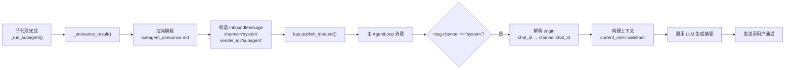
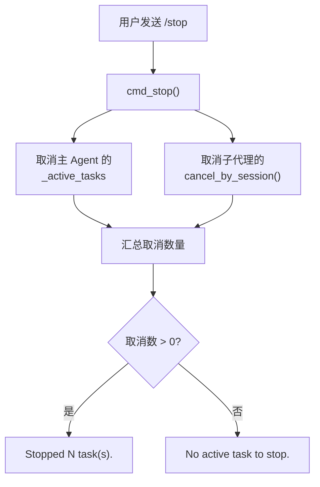

nanobot 的子代理（Subagent）机制允许主 Agent 将耗时或可并行的任务**委托给独立的后台代理实例**异步执行。子代理拥有自己的工具集、独立的系统提示词和迭代上限，完成后通过消息总线将结果回传给主 Agent，由主 Agent 自然地转述给用户。这一机制是 nanobot 实现**并发任务处理**的核心组件——用户无需等待后台任务完成即可继续对话，而主 Agent 会在子代理汇报时自动处理结果。

## 架构概览

子代理系统由三个核心组件构成：**SubagentManager**（生命周期管理）、**SpawnTool**（LLM 调用入口）和**消息总线回传通道**（结果通知）。它们之间的关系如下：

```mermaid
sequenceDiagram
    participant User as 用户
    participant Loop as AgentLoop
    participant LLM as LLM Provider
    participant Spawn as SpawnTool
    participant Mgr as SubagentManager
    participant Runner as AgentRunner
    participant Bus as MessageBus

    User->>Loop: 发送消息
    Loop->>LLM: 调用 LLM（含 spawn 工具）
    LLM-->>Loop: 返回 spawn 工具调用
    Loop->>Spawn: execute(task, label)
    Spawn->>Mgr: spawn(task, label, channel, chat_id, session_key)
    Mgr-->>Spawn: 返回确认文本（含 task_id）
    Spawn-->>Loop: 确认文本
    Loop-->>User: "Subagent [xxx] started (id: yyy)"

    Note over Mgr: 后台异步执行
    Mgr->>Runner: run(AgentRunSpec)
    Runner-->>Mgr: AgentRunResult
    Mgr->>Bus: publish_inbound(InboundMessage)
    Note over Bus: channel="system", sender_id="subagent"
    Bus->>Loop: 消费系统消息
    Loop->>LLM: 构建上下文（含子代理结果）
    LLM-->>Loop: 自然语言摘要
    Loop-->>User: 转述子代理完成结果
```

**关键设计决策**：子代理不直接与用户通信，而是通过 `InboundMessage(channel="system")` 注入消息总线，由主 Agent 统一处理并生成面向用户的自然语言响应。这保证了用户对话的连贯性和一致性。

Sources: [subagent.py](nanobot/agent/subagent.py#L69-L99), [loop.py](nanobot/agent/loop.py#L519-L545), [bus/events.py](nanobot/bus/events.py#L9-L24)

## SubagentManager：核心管理器

`SubagentManager` 是子代理系统的中央调度器，负责**派发、追踪和取消**后台任务。它被实例化于 `AgentLoop` 初始化阶段，与主 Agent 共享同一个 LLM Provider 和消息总线。

### 初始化参数

| 参数 | 类型 | 说明 |
|---|---|---|
| `provider` | `LLMProvider` | 共享的 LLM 后端，子代理复用主 Agent 的 Provider |
| `workspace` | `Path` | 工作区路径，限制文件工具的操作范围 |
| `bus` | `MessageBus` | 消息总线，用于结果回传 |
| `max_tool_result_chars` | `int` | 工具结果截断上限 |
| `model` | `str \| None` | 可选指定子代理使用的模型，默认跟随 Provider |
| `web_config` | `WebToolsConfig \| None` | Web 工具配置 |
| `exec_config` | `ExecToolConfig \| None` | Shell 执行配置 |
| `restrict_to_workspace` | `bool` | 是否将工具操作限制在工作区内 |

内部维护两个关键数据结构：`_running_tasks`（全局 task_id → asyncio.Task 映射）和 `_session_tasks`（session_key → task_id 集合映射），前者用于全局查询，后者用于按会话批量取消。

Sources: [subagent.py](nanobot/agent/subagent.py#L41-L67), [loop.py](nanobot/agent/loop.py#L219-L228)

### spawn：任务派发

`spawn()` 方法是子代理的入口，工作流程为：

1. 生成 8 位短 UUID 作为 `task_id`
2. 通过 `asyncio.create_task()` 创建后台协程
3. 注册到 `_running_tasks` 和 `_session_tasks`
4. 添加 `_cleanup` 回调，在任务完成时自动从两个映射中移除条目
5. 返回包含 task_id 的确认文本

主 Agent 将此确认文本直接作为工具调用结果返回给 LLM，LLM 随后将其告知用户。

Sources: [subagent.py](nanobot/agent/subagent.py#L69-L99)

### _run_subagent：执行引擎

后台协程 `_run_subagent()` 是子代理的核心执行逻辑，它独立于主 Agent 循环运行：

**工具集构建**——子代理获得一组**受限工具**，与主 Agent 的工具集存在关键差异：

| 工具 | 主 Agent | 子代理 | 差异说明 |
|---|:---:|:---:|---|
| read_file / write_file / edit_file | ✅ | ✅ | 文件操作，受限工作区 |
| list_dir / glob / grep | ✅ | ✅ | 搜索与目录浏览 |
| exec | ✅ | ✅（条件） | 受 `exec_config.enable` 控制 |
| web_search / web_fetch | ✅ | ✅（条件） | 受 `web_config.enable` 控制 |
| message | ✅ | ❌ | **子代理不可直接发送消息** |
| spawn | ✅ | ❌ | **禁止递归派发子代理** |
| cron | ✅ | ❌ | **不可创建定时任务** |
| MCP 工具 | ✅ | ❌ | 不加载外部 MCP 服务器工具 |

这种隔离设计有两个目的：**防止递归派发**（子代理不能再创建子代理），以及**统一通信路径**（结果必须经由主 Agent 转达）。

**执行参数**——子代理使用 `AgentRunSpec` 配置：

- `max_iterations=15`：最大迭代次数，低于主 Agent 的默认值，防止后台任务无限循环
- `fail_on_tool_error=True`：工具执行失败立即终止，而非像主 Agent 那样尝试恢复
- `hook=_SubagentHook(task_id)`：仅记录日志的轻量 Hook，无流式输出或进度通知

**三路结果处理**：

1. `stop_reason == "tool_error"`：工具执行失败，调用 `_format_partial_progress()` 生成部分进度报告
2. `stop_reason == "error"`：LLM 层面错误，直接返回错误消息
3. 正常完成：返回 `final_content` 或默认完成文本

Sources: [subagent.py](nanobot/agent/subagent.py#L101-L178), [runner.py](nanobot/agent/runner.py#L44-L67)

## SpawnTool：LLM 调用接口

`SpawnTool` 是注册在主 Agent 工具表中的工具，LLM 通过调用它来派发后台任务。它是一个薄适配层，将主 Agent 的通道上下文传递给 `SubagentManager`。

**工具参数**：

| 参数 | 类型 | 必填 | 说明 |
|---|---|:---:|---|
| `task` | `string` | ✅ | 子代理要完成的具体任务描述 |
| `label` | `string` | ❌ | 任务的简短标签，用于日志和显示 |

**上下文注入机制**：`SpawnTool` 通过 `set_context(channel, chat_id)` 方法捕获当前消息的通道和聊天 ID。在主 Agent 每次执行工具调用前，`_set_tool_context()` 会遍历所有需要路由信息的工具（`message`、`spawn`、`cron`），更新它们的上下文。这确保了子代理结果能准确回传到发起方所在的通道和聊天。

Sources: [spawn.py](nanobot/agent/tools/spawn.py#L1-L57), [loop.py](nanobot/agent/loop.py#L311-L316)

## 结果回传与消息总线集成

子代理完成后，`_announce_result()` 方法将结果注入消息总线。这是整个子代理系统中**最精巧的设计**：



**回传消息构造**：`InboundMessage` 使用 `channel="system"` 标识为系统消息，`sender_id="subagent"` 标识来源，`chat_id` 字段编码为 `{origin_channel}:{origin_chat_id}` 格式以携带原始目标地址。

**主 Agent 处理系统消息**：当 `AgentLoop._process_message()` 检测到 `channel == "system"` 时，会从 `chat_id` 中解析出真实通道和聊天 ID，并以 `current_role = "assistant"`（当 `sender_id == "subagent"` 时）构建上下文。这意味着子代理的结果被注入到**已有对话历史**中，LLM 看到的是一条助手续传消息，从而能自然地对其进行摘要和转述。

**结果通知模板** `subagent_announce.md` 的结构：

```
[Subagent '{{ label }}' {{ status_text }}]

Task: {{ task }}

Result:
{{ result }}

Summarize this naturally for the user. Keep it brief (1-2 sentences).
Do not mention technical details like "subagent" or task IDs.
```

模板末尾的指令确保主 Agent 不会向用户暴露 "subagent" 或 task_id 等技术细节，而是以自然语言简要转述。

Sources: [subagent.py](nanobot/agent/subagent.py#L180-L209), [loop.py](nanobot/agent/loop.py#L519-L545), [subagent_announce.md](nanobot/templates/agent/subagent_announce.md#L1-L9)

## 子代理系统提示词

子代理使用独立的系统提示词模板 `subagent_system.md`，与主 Agent 的提示词完全隔离：

- **角色定位**：明确声明是 "a subagent spawned by the main agent to complete a specific task"
- **行为约束**：要求 "Stay focused on the assigned task"，结果将回传给主 Agent
- **安全注入**：包含 `untrusted_content.md` 片段，防止 Web 获取内容的指令注入
- **运行时上下文**：包含时间信息、工作区路径
- **技能摘要**：如果有可用技能，会包含 `SKILL.md` 摘要，子代理可以通过 `read_file` 读取并使用技能

Sources: [subagent_system.md](nanobot/templates/agent/subagent_system.md#L1-L20), [subagent.py](nanobot/agent/subagent.py#L232-L244)

## 任务取消与生命周期管理

### /stop 命令

用户可以通过 `/stop` 斜杠命令取消当前会话的所有活跃任务。该命令同时处理两类任务：

1. **主 Agent 任务**：从 `_active_tasks` 中取出当前 session 的所有 `asyncio.Task` 并取消
2. **子代理任务**：调用 `SubagentManager.cancel_by_session()` 取消该 session 关联的所有子代理

两者的取消计数相加后向用户报告总数。



### cancel_by_session 的实现

`cancel_by_session()` 通过 `asyncio.Task.cancel()` 发送取消信号，然后 `await asyncio.gather()` 等待所有任务真正停止。**关键行为**：被取消的子代理**不会**调用 `_announce_result()`——因为 `_run_subagent()` 中的 `CancelledError` 会作为异常向上传播，`asyncio.create_task()` 会捕获它而不进入 except 块。这避免了取消操作产生多余的完成通知。

### 自动清理

每个子代理任务注册了 `_cleanup` 回调，在任务完成（无论成功、失败还是取消）时自动从 `_running_tasks` 和 `_session_tasks` 中移除。这保证了管理器状态不会泄漏。

Sources: [builtin.py](nanobot/command/builtin.py#L16-L33), [subagent.py](nanobot/agent/subagent.py#L86-L96), [subagent.py](nanobot/agent/subagent.py#L246-L254)

## 错误处理与部分进度报告

子代理采用**快速失败**策略（`fail_on_tool_error=True`），与主 Agent 的容错恢复策略形成对比：

| 维度 | 主 Agent | 子代理 |
|---|---|---|
| 工具执行失败 | 返回错误文本，LLM 可重试 | 立即终止并报告 |
| 最大迭代超限 | 提示 LLM 并继续 | 返回固定文本 |
| LLM 错误 | 使用 error_message 兜底 | 直接报告错误 |
| 取消 | 用户主动 /stop | 可被 /stop 或 session 清理取消 |

当工具执行失败导致子代理终止时，`_format_partial_progress()` 会生成**部分进度报告**：列出最近 3 个成功步骤，以及最后一个失败步骤的详细信息。这让主 Agent 在向用户报告时能提供有意义的上下文，而非仅仅说"任务失败"。

Sources: [subagent.py](nanobot/agent/subagent.py#L150-L178), [subagent.py](nanobot/agent/subagent.py#L211-L230), [runner.py](nanobot/agent/runner.py#L446-L498)

## _SubagentHook：轻量级监控

子代理使用专用的 `_SubagentHook`，它是 `AgentHook` 的最小实现，仅在 `before_execute_tools` 中记录工具调用的调试日志。与主 Agent 的 `_LoopHook` 相比，它没有流式输出、进度通知或内容后处理能力。这一设计是有意为之——子代理在后台静默运行，用户不应感知到中间过程。

Sources: [subagent.py](nanobot/agent/subagent.py#L26-L38)

---

**下一步阅读**：

- 了解子代理所依赖的执行引擎：[Agent Runner：共享执行引擎与上下文压缩策略](6-agent-runner-gong-xiang-zhi-xing-yin-qing-yu-shang-xia-wen-ya-suo-ce-lue)
- 了解消息总线如何解耦通道与代理：[整体架构：消息总线驱动的通道-代理模型](4-zheng-ti-jia-gou-xiao-xi-zong-xian-qu-dong-de-tong-dao-dai-li-mo-xing)
- 了解会话隔离如何影响任务管理：[会话管理器：对话历史、消息边界与合并策略](23-hui-hua-guan-li-qi-dui-hua-li-shi-xiao-xi-bian-jie-yu-he-bing-ce-lue)