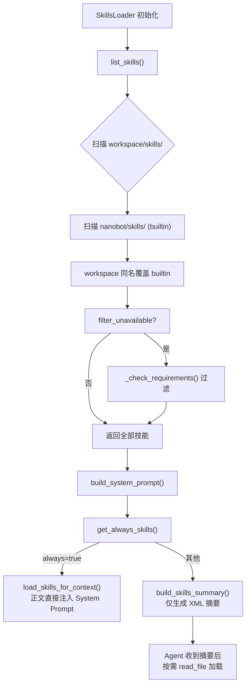
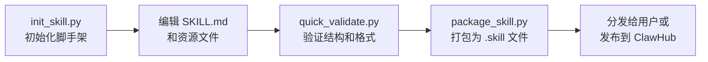

nanobot 的**技能系统**是一套基于 Markdown 文件的轻量级知识注入框架。每个"技能"本质上是一份结构化的操作指南——通过一个 `SKILL.md` 文件向 Agent 传授某个领域的专业流程、工具用法和决策逻辑。这套系统遵循**渐进式披露（Progressive Disclosure）**设计原则：Agent 在上下文中只看到技能的元数据摘要，当用户请求触发某个技能时，Agent 才通过 `read_file` 工具按需加载完整的技能内容，从而将上下文窗口的消耗降至最低。技能格式兼容 [OpenClaw](https://github.com/openclaw/openclaw) 规范，支持从 ClawHub 公共注册表搜索和安装社区技能。

Sources: [skills.py](nanobot/agent/skills.py#L1-L230), [README.md](nanobot/skills/README.md#L1-L31)

## 技能目录结构

技能以**目录**为组织单元。每个技能是一个包含 `SKILL.md` 文件的文件夹，可选地附带 `scripts/`、`references/`、`assets/` 三类资源子目录。整体结构如下：

```
skill-name/
├── SKILL.md          # 必需 — 技能入口文件
├── scripts/          # 可选 — 可执行脚本（Python/Bash）
├── references/       # 可选 — 参考文档（按需加载进上下文）
└── assets/           # 可选 — 输出资源（模板、图片、字体等）
```

nanobot 从**两个来源**发现技能：

| 来源 | 路径 | 优先级 | 说明 |
|------|------|--------|------|
| **workspace** | `<workspace>/skills/` | 高 | 用户自定义或从 ClawHub 安装的技能，同名时覆盖 builtin |
| **builtin** | `nanobot/skills/` | 低 | 随 nanobot 分发的内置技能 |

Sources: [skills.py](nanobot/agent/skills.py#L31-L50), [README.md](nanobot/skills/README.md#L7-L9)

## SKILL.md 文件格式

`SKILL.md` 由两个部分组成：**YAML 前置元数据** 和 **Markdown 正文指令**。

```yaml
---
name: github
description: "Interact with GitHub using the `gh` CLI. Use `gh issue`, `gh pr`, `gh run`, and `gh api`..."
metadata: {"nanobot":{"emoji":"🐙","requires":{"bins":["gh"]},"install":[...]}}
---

# GitHub Skill

Use the `gh` CLI to interact with GitHub...
```

### 前置元数据字段

| 字段 | 必需 | 类型 | 说明 |
|------|------|------|------|
| `name` | ✅ | string | 技能名称，小写字母 + 数字 + 连字符，须与目录名一致，最长 64 字符 |
| `description` | ✅ | string | 技能描述，是 Agent 决定是否触发该技能的核心依据，最长 1024 字符 |
| `always` | ❌ | boolean | 设为 `true` 时，技能正文始终注入系统提示词（适用于通用型技能如 memory） |
| `metadata` | ❌ | string (JSON) | JSON 格式的扩展元数据，支持 `nanobot` 和 `openclaw` 两种 key |
| `license` | ❌ | string | 许可证信息 |
| `allowed-tools` | ❌ | string | 限定技能可使用的工具范围 |

Sources: [quick_validate.py](nanobot/skills/skill-creator/scripts/quick_validate.py#L17-L24), [github/SKILL.md](nanobot/skills/github/SKILL.md#L1-L5), [memory/SKILL.md](nanobot/skills/memory/SKILL.md#L1-L4)

### metadata JSON 结构

`metadata` 字段内嵌一个 JSON 对象，支持 `nanobot` 和 `openclaw` 两个 key（兼容 OpenClaw 规范）。核心子字段如下：

```json
{
  "nanobot": {
    "emoji": "🐙",
    "requires": {
      "bins": ["gh"],        // 要求系统 PATH 中存在的可执行命令
      "env": ["API_KEY"]     // 要求设置的环境变量
    },
    "install": [             // 安装提示信息
      {"id":"brew","kind":"brew","formula":"gh","bins":["gh"],"label":"Install GitHub CLI (brew)"}
    ]
  }
}
```

`requires` 支持两种依赖声明：**`bins`**（通过 `shutil.which` 检查可执行文件是否存在）和 **`env`**（通过 `os.environ.get` 检查环境变量是否已设置）。不满足依赖的技能会被标记为 `available="false"`，但仍然出现在技能列表中，Agent 可以提示用户安装缺失依赖。

Sources: [skills.py](nanobot/agent/skills.py#L170-L188), [weather/SKILL.md](nanobot/skills/weather/SKILL.md#L1-L5), [quick_validate.py](nanobot/skills/skill-creator/scripts/quick_validate.py#L86-L99)

## 加载机制与生命周期

技能的加载和注入遵循三级渐进披露策略，通过 `SkillsLoader` 类实现：



### 第一级：元数据摘要（始终加载）

`build_skills_summary()` 方法将所有技能的名称、描述、路径和可用性打包成 XML 格式注入系统提示词。每条技能条目大约占用 100 个 token，即使技能总数较多也不会显著占用上下文窗口：

```xml
<skills>
  <skill available="true">
    <name>github</name>
    <description>Interact with GitHub using the `gh` CLI...</description>
    <location>/path/to/nanobot/skills/github/SKILL.md</location>
  </skill>
  <skill available="false">
    <name>summarize</name>
    <description>Summarize or extract text...</description>
    <location>/path/to/nanobot/skills/summarize/SKILL.md</location>
    <requires>CLI: summarize</requires>
  </skill>
</skills>
```

Agent 根据这份摘要判断哪个技能与用户请求相关，然后通过 `read_file` 工具读取对应 `SKILL.md` 的完整内容。

Sources: [skills.py](nanobot/agent/skills.py#L109-L142), [skills_section.md](nanobot/templates/agent/skills_section.md#L1-L7)

### 第二级：正文注入（always 技能）

标记了 `always: true` 的技能会在每次系统提示词构建时被**自动加载完整正文**。这类技能通常是跨领域的基础能力，例如 `memory` 技能——它向 Agent 解释记忆文件的分层结构和搜索策略，Agent 在每次对话中都需要遵循这些规则。

`get_always_skills()` 方法筛选所有满足依赖要求且标记为 `always` 的技能，`load_skills_for_context()` 将其 Markdown 正文（去除 YAML 前置元数据后）直接拼入系统提示词的 `# Active Skills` 区块。

Sources: [skills.py](nanobot/agent/skills.py#L195-L205), [context.py](nanobot/agent/context.py#L46-L50)

### 第三级：按需读取（Agent 自主决策）

对于大多数技能，Agent 根据元数据摘要中的 `<location>` 路径，使用内置的 `read_file` 工具在需要时加载完整 SKILL.md。这种设计将主动权交给 Agent 的推理能力——只在真正需要特定领域知识时才消耗上下文 token。

Sources: [skills_section.md](nanobot/templates/agent/skills_section.md#L3-L4)

## SkillsLoader 核心方法一览

`SkillsLoader` 是技能系统的唯一入口类，负责技能的发现、加载、过滤和格式化。以下是其公共 API 的完整说明：

| 方法 | 返回值 | 说明 |
|------|--------|------|
| `list_skills(filter_unavailable=True)` | `list[dict]` | 列出所有技能，每条包含 `name`、`path`、`source` 三个字段 |
| `load_skill(name)` | `str \| None` | 按名称加载技能全文内容 |
| `load_skills_for_context(names)` | `str` | 加载多个技能正文并格式化为上下文片段 |
| `build_skills_summary()` | `str` | 构建 XML 格式的技能摘要 |
| `get_always_skills()` | `list[str]` | 返回满足依赖且标记 `always` 的技能名列表 |
| `get_skill_metadata(name)` | `dict \| None` | 解析 YAML 前置元数据为键值字典 |

Sources: [skills.py](nanobot/agent/skills.py#L23-L230)

## 上下文集成：系统提示词中的位置

`ContextBuilder.build_system_prompt()` 按以下顺序组装系统提示词，技能系统出现在记忆文件之后、近期历史之前：

```
1. Agent 身份（identity）           — 平台信息、工作区路径
2. 引导文件（AGENTS.md、SOUL.md...） — 用户自定义的持久指令
3. 记忆上下文（Memory）             — MEMORY.md 等记忆内容
4. 常驻技能（Active Skills）         ← always=true 技能的完整正文
5. 技能摘要（Skills Summary）        ← XML 格式的全量技能元数据
6. 近期历史（Recent History）        — 最近 50 条未处理的历史条目
```

这种位置安排确保常驻技能的优先级高于技能摘要，Agent 在处理任何用户请求时都能参考 memory 等基础技能的指令。

Sources: [context.py](nanobot/agent/context.py#L30-L63)

## 前置元数据解析机制

`SkillsLoader` 对 YAML 前置元数据采用**手动逐行解析**策略，不依赖 PyYAML 库。`get_skill_metadata()` 方法使用正则 `_STRIP_SKILL_FRONTMATTER` 提取两个 `---` 标记之间的内容，然后逐行按 `key: value` 格式拆分：

```python
# 正则匹配：开头的 --- ... 内容 ... --- 模式
_STRIP_SKILL_FRONTMATTER = re.compile(
    r"^---\s*\r?\n(.*?)\r?\n---\s*\r?\n?", re.DOTALL
)
```

`metadata` 字段中的 JSON 字符串则通过 `_parse_nanobot_metadata()` 用 `json.loads` 解析，优先取 `nanobot` key，回退到 `openclaw` key——这保证了与 OpenClaw 生态的双向兼容。

Sources: [skills.py](nanobot/agent/skills.py#L12-L16), [skills.py](nanobot/agent/skills.py#L161-L193)

## 技能创建工作流

nanobot 提供了一套完整的**脚手架工具链**用于创建、验证和打包技能，位于 `skill-creator` 技能的 `scripts/` 目录下：



### 初始化：init_skill.py

```bash
python scripts/init_skill.py my-skill --path ./workspace/skills --resources scripts,references --examples
```

该脚本创建技能目录并生成带有 TODO 占位符的 `SKILL.md` 模板，可选创建 `scripts/`、`references/`、`assets/` 目录及示例文件。技能名称会自动规范化为小写连字符格式（如 `Plan Mode` → `plan-mode`），长度限制 64 字符。

Sources: [init_skill.py](nanobot/skills/skill-creator/scripts/init_skill.py#L194-L317)

### 验证：quick_validate.py

验证器执行以下检查：

- **前置元数据格式**：必须以 `---` 包裹，包含合法的 YAML 键值对
- **字段完整性**：`name` 和 `description` 为必需字段
- **命名规范**：`name` 必须为 hyphen-case 且与目录名一致
- **描述质量**：不允许空值、TODO 占位符、尖括号，长度不超过 1024 字符
- **目录结构**：只允许 `SKILL.md`、`scripts/`、`references/`、`assets/`
- **类型安全**：`always` 必须为布尔值，`name` 和 `description` 必须为字符串

Sources: [quick_validate.py](nanobot/skills/skill-creator/scripts/quick_validate.py#L132-L203)

### 打包：package_skill.py

```bash
python scripts/package_skill.py ./workspace/skills/my-skill ./dist
```

打包脚本先调用 `quick_validate.py` 进行验证，通过后将技能目录压缩为 `.skill` 文件（ZIP 格式，扩展名为 `.skill`）。打包过程会**拒绝符号链接**以防止安全风险，自动排除 `.git`、`__pycache__`、`node_modules` 等目录，并检测文件是否逃逸出技能根目录。

Sources: [package_skill.py](nanobot/skills/skill-creator/scripts/package_skill.py#L36-L126)

## 内置技能总览

以下表格展示了 nanobot 自带的内置技能及其依赖关系：

| 技能 | emoji | 依赖 | always | 说明 |
|------|-------|------|--------|------|
| `memory` | — | 无 | ✅ | 分层记忆系统与搜索策略 |
| `cron` | — | 无 | ❌ | 定时任务调度（提醒/周期任务/一次性任务） |
| `github` | 🐙 | `gh` CLI | ❌ | GitHub 交互（Issue、PR、CI、API 查询） |
| `weather` | 🌤️ | `curl` | ❌ | 天气查询（wttr.in + Open-Meteo） |
| `summarize` | 🧾 | `summarize` CLI | ❌ | URL/文件/YouTube 内容摘要 |
| `tmux` | 🧵 | `tmux`, macOS/Linux | ❌ | tmux 会话远程控制 |
| `clawhub` | 🦞 | Node.js (`npx`) | ❌ | ClawHub 技能注册表搜索与安装 |
| `skill-creator` | — | 无 | ❌ | 创建和打包新技能的元技能 |

Sources: [memory/SKILL.md](nanobot/skills/memory/SKILL.md#L1-L4), [github/SKILL.md](nanobot/skills/github/SKILL.md#L1-L5), [weather/SKILL.md](nanobot/skills/weather/SKILL.md#L1-L6), [summarize/SKILL.md](nanobot/skills/summarize/SKILL.md#L1-L5), [tmux/SKILL.md](nanobot/skills/tmux/SKILL.md#L1-L4), [clawhub/SKILL.md](nanobot/skills/clawhub/SKILL.md#L1-L6), [skill-creator/SKILL.md](nanobot/skills/skill-creator/SKILL.md#L1-L4)

## Workspace 技能覆盖机制

用户可以在工作区的 `skills/` 目录中创建自定义技能或安装社区技能。**当 workspace 技能与 builtin 技能同名时，workspace 版本优先**——这一覆盖机制允许用户在不修改 nanobot 源码的情况下替换或升级内置技能。

`list_skills()` 先扫描 workspace 技能并记录已出现的名称集合，然后扫描 builtin 目录时跳过这些已出现的名称。`load_skill()` 也遵循同样的 workspace 优先查找顺序。

Sources: [skills.py](nanobot/agent/skills.py#L52-L90), [test_skills_loader.py](tests/agent/test_skills_loader.py#L83-L96)

## 子代理中的技能集成

技能摘要不仅注入主 Agent 的系统提示词，同样会注入**子代理（Subagent）**的提示词。`SubagentManager._build_subagent_prompt()` 方法独立创建一个 `SkillsLoader` 实例并调用 `build_skills_summary()`，将技能摘要注入子代理的 `subagent_system.md` 模板，确保子代理也能发现和使用技能。

Sources: [subagent.py](nanobot/agent/subagent.py#L232-L244)

## 延伸阅读

- [内置技能一览（GitHub、天气、摘要、ClawHub 等）](27-nei-zhi-ji-neng-lan-github-tian-qi-zhai-yao-clawhub-deng) — 深入了解每个内置技能的功能细节和使用场景
- [上下文构建器：系统提示词组装与身份注入](7-shang-xia-wen-gou-jian-qi-xi-tong-ti-shi-ci-zu-zhuang-yu-shen-fen-zhu-ru) — 理解技能注入在完整系统提示词中的位置
- [子代理（Subagent）：后台任务派发与管理](25-zi-dai-li-subagent-hou-tai-ren-wu-pai-fa-yu-guan-li) — 了解子代理如何继承技能能力