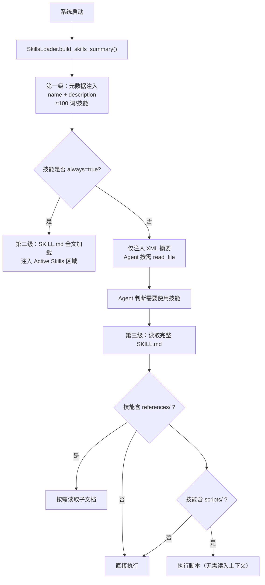
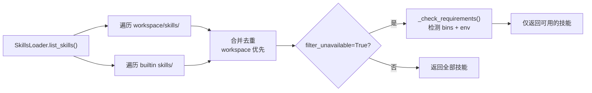

nanobot 的**技能系统**通过 `SKILL.md` 格式的 Markdown 文件向 Agent 注入领域特定的操作知识。每个技能本质上是一份"入职指南"——告诉 Agent 如何调用外部工具、遵循特定工作流或处理某类任务。内置技能随 nanobot 发行包一起安装在 `nanobot/skills/` 目录下，无需用户手动干预即可被自动发现。Agent 在运行时根据技能的 `description` 字段判断是否需要激活某个技能，然后在需要时通过 `read_file` 工具读取完整的 SKILL.md 内容，实现**渐进式加载**，避免一次性占用过多上下文窗口。整个技能加载器由 `SkillsLoader` 类驱动，它会合并工作区技能与内置技能，并在工作区技能与内置技能同名时优先使用工作区版本。

Sources: [skills.py](nanobot/agent/skills.py#L23-L72), [README.md](nanobot/skills/README.md#L1-L31)

## 技能总览与依赖矩阵

nanobot 当前内置 **8 个技能**，覆盖 GitHub 交互、天气查询、内容摘要、技能市场、定时任务、记忆管理、终端控制与技能开发。下表汇总了每个技能的核心定位、前置依赖和 Emoji 标识：

| 技能 | Emoji | 功能概述 | 前置依赖 | 是否常驻 |
|------|-------|---------|---------|---------|
| **github** | 🐙 | 通过 `gh` CLI 操作 GitHub（Issue、PR、CI、API） | `gh` 二进制 | 否 |
| **weather** | 🌤️ | 查询天气与预报（wttr.in + Open-Meteo） | `curl` | 否 |
| **summarize** | 🧾 | 摘要 URL、本地文件与 YouTube 视频 | `summarize` CLI | 否 |
| **clawhub** | 🦞 | 从 ClawHub 公共注册表搜索安装社区技能 | Node.js (`npx`) | 否 |
| **cron** | — | 定时提醒与周期性任务调度 | 内置 `cron` 工具 | 否 |
| **memory** | — | 分层记忆系统的操作指南 | 无 | **是**（`always: true`） |
| **tmux** | 🧵 | 远程控制 tmux 会话（交互式 CLI） | `tmux` 二进制 | 否 |
| **skill-creator** | — | 创建、验证、打包自定义技能 | 无 | 否 |

`SkillsLoader` 在运行时通过 `shutil.which()` 检测本地是否存在所需的二进制文件，通过 `os.environ.get()` 检测环境变量。不满足条件的技能会在 XML 摘要中标记为 `available="false"` 并附上缺失依赖说明，Agent 可以尝试通过 apt/brew 安装。

Sources: [skills.py](nanobot/agent/skills.py#L109-L142), [skills.py](nanobot/agent/skills.py#L181-L188)

## 渐进式加载架构

技能系统采用**三级渐进式加载**策略来管理上下文窗口资源：



第一级始终发生：`ContextBuilder` 调用 `build_skills_summary()` 生成包含所有技能名称、描述和可用性状态的 XML 块，注入到系统提示词中。第二级仅对 `always: true` 的技能（目前仅有 `memory`）生效，其完整 SKILL.md 内容被加载到 `# Active Skills` 区段。第三级在 Agent 主动触发时发生，通过 `read_file` 工具加载完整技能内容。这种设计确保大多数技能只占用极少的 token（仅 metadata），只有在真正需要时才消耗完整的上下文窗口。

Sources: [context.py](nanobot/agent/context.py#L46-L54), [skills_section.md](nanobot/templates/agent/skills_section.md#L1-L7), [skills.py](nanobot/agent/skills.py#L195-L205)

## GitHub 技能（🐙）

GitHub 技能将 nanobot 变成一个能够操作仓库、审查 PR、监控 CI 的开发助手。它通过 **`gh` CLI**（GitHub 官方命令行工具）与 GitHub API 交互，覆盖以下核心场景：

- **Pull Request 管理**：查看 PR 检查状态（`gh pr checks`）、列出工作流运行（`gh run list`）、查看失败步骤日志（`gh run view --log-failed`）
- **Issue 查询**：结合 `--json` 和 `--jq` 进行结构化数据提取
- **高级 API 查询**：通过 `gh api` 访问标准 `gh` 子命令未覆盖的 REST API 端点，使用 `--jq` 做 JSON 字段过滤

该技能的 `metadata.requires.bins` 声明了对 `gh` 的依赖，同时提供了 `brew` 和 `apt` 两种安装方式。当 Agent 检测到 `gh` 未安装时，会自动提示用户安装。技能的关键设计决策是**始终要求 `--repo owner/repo`**——确保在不处于 Git 仓库目录时也能正确操作。

Sources: [github/SKILL.md](nanobot/skills/github/SKILL.md#L1-L49)

## 天气技能（🌤️）

天气技能提供了**零 API Key** 的天气查询能力，采用双数据源架构：

| 数据源 | 用途 | 输出格式 | 适用场景 |
|--------|------|---------|---------|
| **wttr.in**（主数据源） | 天气查询 | ASCII 艺术 / 紧凑文本 | 人类可读的即时查询 |
| **Open-Meteo**（备选） | 结构化天气数据 | JSON | 程序化处理、自动化任务 |

wttr.in 支持丰富的格式化代码：`%c`（天气状况图标）、`%t`（温度）、`%h`（湿度）、`%w`（风速）、`%m`（月相）。从简单的 `curl -s "wttr.in/London?format=3"` 单行查询到完整的三日预报，用户可以灵活选择输出粒度。城市名支持 URL 编码的空格（`New+York`）和机场代码（`JFK`）。当需要程序化消费数据时，Agent 会切换到 Open-Meteo 的 JSON API，通过经纬度查询。

Sources: [weather/SKILL.md](nanobot/skills/weather/SKILL.md#L1-L50)

## 摘要技能（🧾）

摘要技能通过外部 CLI 工具 `summarize` 实现 URL、本地文件和 YouTube 视频的智能摘要与转录提取。它支持三种典型触发场景：用户要求摘要某个链接/文章、询问视频内容、或明确要求转录 YouTube 视频。

该技能的模型配置支持多 Provider，通过环境变量设定 API Key：

| Provider | 环境变量 |
|----------|---------|
| OpenAI | `OPENAI_API_KEY` |
| Anthropic | `ANTHROPIC_API_KEY` |
| xAI | `XAI_API_KEY` |
| Google | `GEMINI_API_KEY`（别名：`GOOGLE_GENERATIVE_AI_API_KEY`、`GOOGLE_API_KEY`） |

默认模型为 `google/gemini-3-flash-preview`。YouTube 视频处理支持两种模式：`--youtube auto` 生成摘要，追加 `--extract-only` 仅提取转录文本。当转录内容过长时，技能指导 Agent 先返回精简摘要，再询问用户需要展开哪个时间段。可选的 Firecrawl 集成（`FIRECRAWL_API_KEY`）用于处理被封锁的网站，Apify 集成（`APIFY_API_TOKEN`）作为 YouTube 的备用提取方案。

Sources: [summarize/SKILL.md](nanobot/skills/summarize/SKILL.md#L1-L68)

## ClawHub 技能（🦞）

ClawHub 是 nanobot 的**公共技能注册表**，通过向量搜索实现自然语言检索。该技能让 Agent 能够从社区生态中发现并安装新技能，极大地扩展了 Agent 的能力边界。核心操作包括：

- **搜索**：`npx --yes clawhub@latest search "web scraping" --limit 5`，基于语义向量匹配
- **安装**：`npx --yes clawhub@latest install <slug> --workdir ~/.nanobot/workspace`，技能被放置到工作区的 `skills/` 目录
- **更新**：`npx --yes clawhub@latest update --all --workdir ~/.nanobot/workspace`
- **列出已安装**：`npx --yes clawhub@latest list --workdir ~/.nanobot/workspace`

`--workdir ~/.nanobot/workspace` 参数至关重要——缺少它，技能会被安装到当前工作目录而非 nanobot 的工作区。搜索和安装无需 API Key 或登录，仅发布操作需要执行 `clawhub login`。安装完成后，Agent 会提醒用户开启新会话以加载新技能。

Sources: [clawhub/SKILL.md](nanobot/skills/clawhub/SKILL.md#L1-L54)

## Cron 技能

Cron 技能提供定时任务调度能力，通过内置的 `cron` 工具实现三种调度模式：

| 模式 | 说明 | 示例 |
|------|------|------|
| **Reminder** | 定时向用户发送消息 | `cron(action="add", message="休息时间!", every_seconds=1200)` |
| **Task** | Agent 每次执行任务描述并返回结果 | `cron(action="add", message="检查 GitHub stars", every_seconds=600)` |
| **One-time** | 指定时间运行一次后自动删除 | `cron(action="add", message="会议提醒", at="<ISO datetime>")` |

时间表达式支持多种自然语言映射：`every_seconds` 用于固定间隔，`cron_expr` 用于标准 cron 表达式（如 `"0 9 * * 1-5"` 表示工作日每天 9 点），`tz` 参数接受 IANA 时区名（如 `"America/Vancouver"`）实现多时区调度。Agent 负责将用户的自然语言时间描述转换为对应的参数组合。

Sources: [cron/SKILL.md](nanobot/skills/cron/SKILL.md#L1-L58)

## Memory 技能（常驻）

Memory 是唯一标记为 `always: true` 的内置技能，其完整内容在每次会话中被注入到系统提示词的 `# Active Skills` 区段。它教会 Agent 正确理解和使用 nanobot 的分层记忆结构：

- **SOUL.md**：机器人人格与沟通风格，由 Dream 自动管理
- **USER.md**：用户画像与偏好，由 Dream 自动管理
- **memory/MEMORY.md**：长期事实记忆（项目上下文、重要事件），由 Dream 自动管理
- **memory/history.jsonl**：追加写入的 JSONL 对话日志，不直接加载到上下文

该技能明确指导 Agent **不要手动编辑** SOUL.md、USER.md 和 MEMORY.md——这些文件由 Dream 子系统自动维护。Agent 需要搜索历史记录时，应优先使用内置的 `grep` 工具对 `history.jsonl` 进行检索，并遵循先 `output_mode="count"` 广泛定位、再用 `output_mode="content"` 精确提取的两步策略。`fixed_strings=true` 用于搜索时间戳或 JSON 片段等字面量。

Sources: [memory/SKILL.md](nanobot/skills/memory/SKILL.md#L1-L37)

## Tmux 技能（🧵）

Tmux 技能赋予 Agent 控制交互式终端会话的能力，适用于需要 TTY 的场景（如 Python REPL、交互式 CLI 编程代理）。该技能被限定在 `darwin` 和 `linux` 平台，且要求 `tmux` 已安装。技能采用**隔离 Socket 约定**：所有会话使用 `$NANOBOT_TMUX_SOCKET_DIR/nanobot.sock` 作为通信端点，避免与用户自身的 tmux 会话冲突。

技能附带两个辅助脚本：

- **find-sessions.sh**：列出指定 Socket 或所有 Socket 上的 tmux 会话，支持 `-q` 过滤会话名
- **wait-for-text.sh**：轮询指定 tmux 面板等待特定文本出现，支持超时、轮询间隔和正则/固定字符串模式匹配

技能的高级用法包括**编排多个编码代理并行工作**：通过创建多个 tmux 会话，在不同工作目录中同时运行 Codex 或 Claude Code 等 AI 编程工具，然后轮询 shell 提示符检测完成状态。这一模式要求使用独立的 git worktree 避免分支冲突。

Sources: [tmux/SKILL.md](nanobot/skills/tmux/SKILL.md#L1-L122), [find-sessions.sh](nanobot/skills/tmux/scripts/find-sessions.sh#L1-L113), [wait-for-text.sh](nanobot/skills/tmux/scripts/wait-for-text.sh#L1-L84)

## Skill-Creator 技能（元技能）

Skill-Creator 是一个**元技能**——它教会 Agent 如何创建新的技能。这是技能系统中唯一自指的技能，其 `description` 字段覆盖了所有触发场景（"创建技能"、"更新技能"、"打包技能"等）。它定义了一套完整的技能创作方法论：

**技能目录结构**：

```
skill-name/
├── SKILL.md          # 必需：YAML frontmatter + Markdown 指令
└── Bundled Resources # 可选
    ├── scripts/      # 可执行代码（确定性可靠性）
    ├── references/   # 按需加载的文档
    └── assets/       # 用于输出的模板/资源文件
```

**核心设计原则**包括：**上下文窗口是公共资源**——技能应当精简，只包含模型不具备的信息；**自由度匹配**——脆弱操作需要严格脚本（低自由度），灵活任务只需文本指引（高自由度）。技能附带三个工具脚本：

| 脚本 | 功能 |
|------|------|
| `init_skill.py` | 从模板初始化技能目录，支持 `--resources scripts,references,assets` 和 `--examples` 参数 |
| `quick_validate.py` | 验证技能结构：frontmatter 格式、命名规范、描述完整性、目录合法性 |
| `package_skill.py` | 将技能打包为 `.skill` 分发包（ZIP 格式），自动先执行验证，拒绝符号链接 |

Sources: [skill-creator/SKILL.md](nanobot/skills/skill-creator/SKILL.md#L1-L200), [init_skill.py](nanobot/skills/skill-creator/scripts/init_skill.py#L1-L50), [quick_validate.py](nanobot/skills/skill-creator/scripts/quick_validate.py#L1-L214), [package_skill.py](nanobot/skills/skill-creator/scripts/package_skill.py#L36-L126)

## 技能可用性检测机制

`SkillsLoader` 在列出技能时执行两层可用性检测。第一层检查 `metadata.nanobot.requires.bins` 中声明的二进制文件是否在 `$PATH` 中可找到（通过 `shutil.which()`）；第二层检查 `requires.env` 中声明的环境变量是否已设置。不满足条件的技能在 XML 摘要中标记为 `available="false"` 并附带 `<requires>` 标签说明缺失内容，例如 `CLI: gh` 或 `ENV: OPENAI_API_KEY`。

某些技能还声明了安装指引（`metadata.nanobot.install`），例如 GitHub 技能同时提供 `brew install gh` 和 `apt install gh` 两种方式。Agent 在检测到依赖缺失时可以据此引导用户安装。



Sources: [skills.py](nanobot/agent/skills.py#L52-L71), [skills.py](nanobot/agent/skills.py#L144-L152)

## 工作区技能覆盖机制

`SkillsLoader` 同时扫描两个技能目录：**工作区目录** `<workspace>/skills/` 和**内置目录** `nanobot/skills/`。当两个目录中存在同名技能时，工作区版本**完全覆盖**内置版本——这为用户定制内置技能提供了无侵入的途径。例如，如果用户在 `~/.nanobot/workspace/skills/weather/SKILL.md` 创建了自定义的天气技能，它将取代系统内置的天气技能被加载。`list_skills()` 方法先收集工作区技能并记录名称集合，再将不重名的内置技能追加到列表中。

Sources: [skills.py](nanobot/agent/skills.py#L36-L67)

## 下一步阅读

- 要深入理解技能的 `SKILL.md` 格式定义和加载流程，请参阅 [技能系统：SKILL.md 格式与加载机制](26-ji-neng-xi-tong-skill-md-ge-shi-yu-jia-zai-ji-zhi)
- 要了解技能注入系统提示词后的完整上下文构建过程，请参阅 [上下文构建器：系统提示词组装与身份注入](7-shang-xia-wen-gou-jian-qi-xi-tong-ti-shi-ci-zu-zhuang-yu-shen-fen-zhu-ru)
- 要了解 Cron 技能底层服务的完整实现，请参阅 [Cron 服务：定时任务调度与多时区支持](24-cron-fu-wu-ding-shi-ren-wu-diao-du-yu-duo-shi-qu-zhi-chi)
- 要了解 Memory 技能中提及的 Dream 子系统如何自动管理记忆文件，请参阅 [Dream：两阶段长期记忆整合与 GitStore 版本化](22-dream-liang-jie-duan-chang-qi-ji-yi-zheng-he-yu-gitstore-ban-ben-hua)