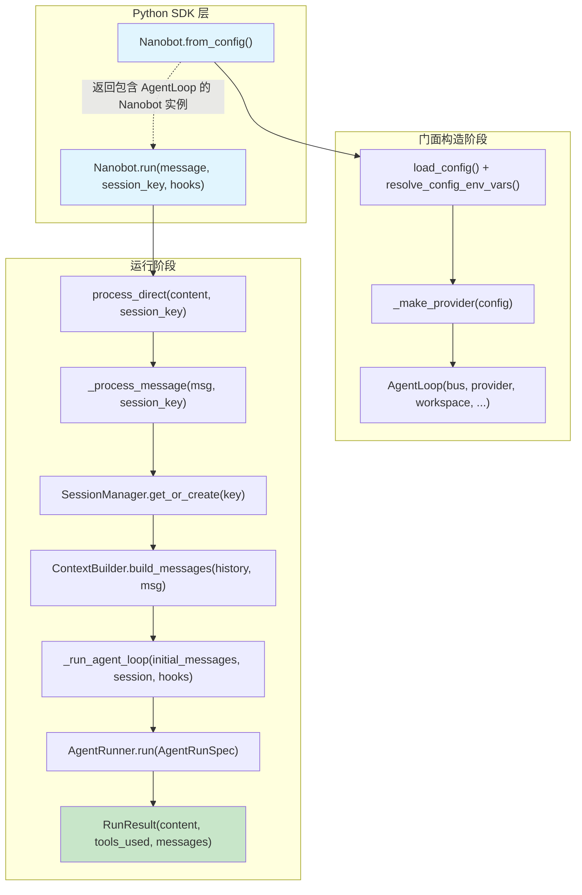

Nanobot 的 Python SDK 是一套面向开发者的编程接口，允许你从任何 Python 异步应用中直接调用 nanobot agent——无需启动通道、无需消息总线消费循环。它的核心是一个名为 `Nanobot` 的**门面类（Facade）**，封装了配置加载、LLM Provider 构建、AgentLoop 初始化和会话管理等底层细节，对外仅暴露 `from_config()` 工厂方法和 `run()` 异步调用两个入口。本文将深入解析门面类的构造过程、`session_key` 驱动的会话隔离机制，以及 Hook 扩展点的工作原理，帮助你将 nanobot 嵌入到自动化流水线、Web 服务或多租户系统中。

Sources: [nanobot.py](nanobot/nanobot.py#L1-L177), [__init__.py](nanobot/__init__.py#L1-L11)

## 架构总览：从门面到引擎的调用链

在深入代码之前，先理解 SDK 调用链中各层角色的职责分工。下图展示了从 `Nanobot.run()` 到底层 AgentRunner 的完整请求流：



关键设计要点：`Nanobot` 本身不持有任何 agent 状态，它只是 `AgentLoop` 的薄包装。真正的对话历史由 `SessionManager` 按 `session_key` 独立维护，这意味着**同一个 Nanobot 实例可以通过不同的 session_key 安全地服务多个并发用户**。

Sources: [nanobot.py](nanobot/nanobot.py#L23-L85), [loop.py](nanobot/agent/loop.py#L762-L778)

## 门面类 Nanobot：构造与工厂方法

### 公共 API 导出

nanobot 包在顶层 `__init__.py` 中仅导出两个符号——`Nanobot` 和 `RunResult`。这种极简的公开表面（public surface）设计确保了开发者只需一行 import 即可上手：

```python
from nanobot import Nanobot, RunResult
```

`Nanobot` 的 `__init__` 方法接受一个 `AgentLoop` 实例并存储为私有属性 `_loop`。通常你不直接调用 `__init__`，而是通过 `from_config()` 工厂方法来创建实例。

Sources: [__init__.py](nanobot/__init__.py#L1-L11)

### `from_config()` 工厂方法

`from_config()` 承担了从配置文件到可运行 agent 的全部初始化编排。它的工作流程分为四个阶段：

| 阶段 | 操作 | 关键文件 |
|------|------|----------|
| 1. 配置加载 | 读取 JSON 配置文件并解析 `${VAR}` 环境变量插值 | [loader.py](nanobot/config/loader.py#L30-L54) |
| 2. Provider 构建 | 根据配置中的模型前缀自动匹配后端（OpenAI 兼容 / Anthropic / Azure / OAuth 等） | [nanobot.py](nanobot/nanobot.py#L116-L176) |
| 3. AgentLoop 组装 | 注入 MessageBus、Provider、工具注册表、会话管理器等组件 | [loop.py](nanobot/agent/loop.py#L163-L260) |
| 4. 返回门面 | 将 AgentLoop 包装为 `Nanobot` 实例 | [nanobot.py](nanobot/nanobot.py#L85) |

`config_path` 参数默认为 `None`，此时使用 `~/.nanobot/config.json` 作为配置文件路径。`workspace` 参数可覆盖配置文件中的 workspace 目录，这在不同项目间复用同一配置时非常有用：

```python
# 使用默认配置路径
bot = Nanobot.from_config()

# 指定配置文件和工作区
bot = Nanobot.from_config(
    config_path="/etc/nanobot/production.json",
    workspace="/data/projects/my-app",
)
```

如果显式指定了 `config_path` 但文件不存在，`from_config()` 会抛出 `FileNotFoundError`，确保配置问题在启动时而非运行时暴露。

Sources: [nanobot.py](nanobot/nanobot.py#L36-L85), [loader.py](nanobot/config/loader.py#L30-L54)

### `_make_provider()` 后端路由

`_make_provider()` 是一个内部函数，负责将配置中的模型字符串映射到具体的 LLM Provider 实现类。它的路由逻辑遵循以下优先级：

1. **`openai_codex`** → `OpenAICodexProvider`（OAuth 认证）
2. **`github_copilot`** → `GitHubCopilotProvider`（OAuth 认证）
3. **`azure_openai`** → `AzureOpenAIProvider`（需要 api_key + api_base）
4. **`anthropic`** → `AnthropicProvider`
5. **其他所有** → `OpenAICompatProvider`（通用 OpenAI 兼容后端）

此外，它还会验证必要的认证信息：Azure 后端要求同时配置 `api_key` 和 `api_base`；OpenAI 兼容后端要求 `api_key`（OAuth 本地模型提供商除外）。验证失败时抛出 `ValueError`，附带明确的错误信息。

Sources: [nanobot.py](nanobot/nanobot.py#L116-L176)

## RunResult：运行结果数据类

`RunResult` 是一个使用 `@dataclass(slots=True)` 定义的数据类，封装了单次 agent 运行的结果：

| 字段 | 类型 | 说明 |
|------|------|------|
| `content` | `str` | Agent 的最终文本响应。如果 agent 无响应则为空字符串 `""` |
| `tools_used` | `list[str]` | 本次运行中调用的工具名称列表（当前版本保留为空列表） |
| `messages` | `list[dict]` | 原始消息历史（当前版本保留为空列表，用于调试扩展） |

`slots=True` 的使用避免了 `__dict__` 的内存开销，体现了 nanobot 在轻量级设计理念下对资源使用的考量。`content` 字段的处理逻辑值得注意：当 `process_direct` 返回 `None` 或响应内容为 `None` 时，`content` 会优雅地降级为空字符串而非抛出异常。

Sources: [nanobot.py](nanobot/nanobot.py#L14-L20), [nanobot.py](nanobot/nanobot.py#L112-L113)

## run() 方法：消息处理与会话路由

### 方法签名与参数

```python
async def run(
    self,
    message: str,
    *,
    session_key: str = "sdk:default",
    hooks: list[AgentHook] | None = None,
) -> RunResult:
```

| 参数 | 类型 | 默认值 | 说明 |
|------|------|--------|------|
| `message` | `str` | *(必填)* | 发送给 agent 的用户消息 |
| `session_key` | `str` | `"sdk:default"` | 会话标识符，不同 key 对应独立的对话历史 |
| `hooks` | `list[AgentHook] \| None` | `None` | 本次运行专属的生命周期 Hook 列表 |

### 内部执行流程

`run()` 方法的实现虽精简但暗藏了重要的安全设计：

```python
prev = self._loop._extra_hooks
if hooks is not None:
    self._loop._extra_hooks = list(hooks)
try:
    response = await self._loop.process_direct(
        message, session_key=session_key,
    )
finally:
    self._loop._extra_hooks = prev
```

这段代码实现了一个 **Hook 临时注入与恢复** 模式。`hooks` 参数仅在当前 `run()` 调用期间生效，`finally` 块确保无论是否抛出异常都会恢复原始 hooks 列表。这意味着即使你连续调用 `bot.run()` 并交替传入不同的 hooks，它们之间也不会相互干扰。

`process_direct()` 是 `AgentLoop` 上的一条"直通"路径——它绕过了消息总线的队列消费模式，直接构造 `InboundMessage` 并调用 `_process_message()`。这使得 SDK 调用无需启动通道监听器即可获得完整的 agent 能力（包括工具调用、上下文构建、会话持久化等）。

Sources: [nanobot.py](nanobot/nanobot.py#L87-L113), [loop.py](nanobot/agent/loop.py#L762-L778)

## 会话隔离机制

### session_key 的生命周期

会话隔离是 SDK 设计中最关键的架构决策之一。它通过 `session_key` 字符串实现了**一个 Nanobot 实例 → 多条独立对话**的能力。理解其生命周期对构建多用户系统至关重要：

```mermaid
flowchart LR
    subgraph "SDK 调用层"
        R1["bot.run('hi', session_key='user-alice')"]
        R2["bot.run('hi', session_key='user-bob')"]
        R3["bot.run('hi', session_key='sdk:default')"]
    end

    subgraph "SessionManager"
        SM["get_or_create(key)"]
        S1["Session(key='user-alice')"]
        S2["Session(key='user-bob')"]
        S3["Session(key='sdk:default')"]
        Cache["_cache dict"]
    end

    subgraph "磁盘持久化"
        F1["user_alice.jsonl"]
        F2["user_bob.jsonl"]
        F3["sdk_default.jsonl"]
    end

    R1 --> SM --> S1 --> Cache
    R2 --> SM --> S2 --> Cache
    R3 --> SM --> S3 --> Cache
    S1 -.->|save()| F1
    S2 -.->|save()| F2
    S3 -.->|save()| F3
```

完整的调用链路如下：

1. **SDK 层**：`run()` 将 `session_key` 透传给 `AgentLoop.process_direct()`
2. **AgentLoop 层**：`process_direct()` 构造 `InboundMessage`（channel="cli", chat_id="direct"），然后将 `session_key` 传递给 `_process_message()`
3. **会话路由**：`_process_message()` 使用 `session_key` 调用 `self.sessions.get_or_create(key)` 来获取或创建对应的 `Session` 对象
4. **持久化**：每次处理完成后，`_save_turn()` 将新的对话轮次追加到 session 中，随后 `sessions.save()` 将整个 session 写入 JSONL 文件

Sources: [nanobot.py](nanobot/nanobot.py#L87-L113), [loop.py](nanobot/agent/loop.py#L509-L614)

### Session 数据模型

`Session` 是一个 dataclass，承载了单个对话会话的全部状态：

| 字段 | 类型 | 说明 |
|------|------|------|
| `key` | `str` | 会话唯一标识（如 `"user-alice"`、`"sdk:default"`） |
| `messages` | `list[dict]` | 对话消息列表，每条消息包含 `role`、`content`、`timestamp` 等字段 |
| `created_at` | `datetime` | 会话创建时间 |
| `updated_at` | `datetime` | 最后更新时间 |
| `metadata` | `dict` | 会话元数据（如运行时 checkpoint） |
| `last_consolidated` | `int` | 已被摘要整合的消息数量偏移量 |

`get_history()` 方法从 `last_consolidated` 偏移处截取未整合的消息子集，并执行**合法边界对齐**：它向前扫描找到第一个 `role == "user"` 的消息作为起始点，然后通过 `find_legal_message_start()` 丢弃任何在起始处悬空的 tool result（即没有对应 assistant tool_call 的 tool 消息）。这确保了传递给 LLM 的消息序列始终是结构完整的。

Sources: [manager.py](nanobot/session/manager.py#L16-L94)

### SessionManager：缓存、加载与迁移

`SessionManager` 是 `Session` 的生命周期管理器，初始化时接受一个 workspace 路径，在该路径下创建 `sessions/` 子目录：

```python
def __init__(self, workspace: Path):
    self.workspace = workspace
    self.sessions_dir = ensure_dir(self.workspace / "sessions")
    self._cache: dict[str, Session] = {}
```

它采用**先查缓存、再查磁盘、最后创建新实例**的三级策略：

```
get_or_create(key)
  ├─ _cache[key] 命中 → 直接返回
  ├─ _load(key) 成功 → 写入缓存并返回
  └─ 两者均失败 → 创建新 Session(key) 并缓存
```

`_load()` 方法还包含一个**遗留路径迁移**机制：如果新路径（workspace 下）没有找到 session 文件，但旧的全局路径（`~/.nanobot/sessions/`）存在，它会自动将文件移动到新位置。这保证了从旧版本升级时的平滑过渡。

会话文件的命名规则是将 key 中的 `:` 替换为 `_`，再通过 `safe_filename()` 过滤不安全字符，最终以 `.jsonl` 为后缀。例如 `session_key="user-alice"` 对应文件 `user_alice.jsonl`。

Sources: [manager.py](nanobot/session/manager.py#L96-L237)

### 多租户会话隔离实战

以下示例展示了如何在一个 Nanobot 实例中为多个用户提供完全隔离的对话体验：

```python
import asyncio
from nanobot import Nanobot

async def handle_user(bot: Nanobot, user_id: str, message: str) -> str:
    """处理单用户消息，每个用户拥有独立的对话历史。"""
    result = await bot.run(message, session_key=f"app:{user_id}")
    return result.content

async def main():
    bot = Nanobot.from_config(workspace="/app/workspace")

    # 用户 Alice 和 Bob 的对话完全隔离
    alice_reply = await handle_user(bot, "alice", "帮我总结一下项目状态")
    bob_reply = await handle_user(bot, "bob", "今天天气怎么样？")

    # Alice 的后续对话能记住之前的上下文
    alice_followup = await handle_user(bot, "alice", "能展开说说第二点吗？")

asyncio.run(main())
```

每个 `session_key` 在 `SessionManager` 的缓存中都有独立的 `Session` 对象，磁盘上也是独立的 JSONL 文件。这意味着并发调用时只要 session_key 不同，就不会发生对话历史混淆。

Sources: [nanobot.py](nanobot/nanobot.py#L87-L113), [manager.py](nanobot/session/manager.py#L119-L137)

## Hook 机制：生命周期观察与干预

### SDK 专属 Hook 注入

SDK 的 `hooks` 参数允许你在不修改 agent 内部代码的情况下观察和干预运行过程。Hook 通过 `AgentHook` 基类的虚方法实现，每个方法对应 agent 循环中的一个生命周期节点：

| 方法 | 触发时机 | 典型用途 |
|------|----------|----------|
| `before_iteration(ctx)` | 每次 LLM 调用之前 | 注入额外上下文、记录计时 |
| `on_stream(ctx, delta)` | 每个流式 token 到达时 | 实时输出到 UI |
| `on_stream_end(ctx)` | 流式输出结束时 | 通知 UI 切换状态 |
| `before_execute_tools(ctx)` | 工具执行之前 | 审计日志、拦截危险操作 |
| `after_iteration(ctx)` | 每次 LLM 响应之后 | 收集 token 使用统计 |
| `finalize_content(ctx, content)` | 最终输出前 | 内容审查、格式转换 |

SDK 调用链中的 Hook 组装使用了 `_LoopHookChain`——它将核心的 `_LoopHook`（负责流式输出、进度回调、think 标签剥离等内部逻辑）与用户通过 `hooks` 参数传入的额外 Hook 组合在一起。额外 Hook 被包装在 `CompositeHook` 中，其异步方法（如 `before_iteration`、`on_stream`）以**扇出（fan-out）**方式执行且带有**错误隔离**——单个 Hook 抛异常不会影响其他 Hook 或 agent 主循环。而 `finalize_content` 则以**管道（pipeline）**方式链式执行，每个 Hook 的输出作为下一个 Hook 的输入。

Sources: [hook.py](nanobot/agent/hook.py#L29-L96), [loop.py](nanobot/agent/loop.py#L43-L147)

### Hook 使用示例：审计日志

```python
from nanobot import Nanobot
from nanobot.agent.hook import AgentHook, AgentHookContext

class AuditHook(AgentHook):
    """记录所有工具调用的审计 Hook。"""

    def __init__(self):
        self.tool_log: list[dict] = []

    async def before_execute_tools(self, ctx: AgentHookContext) -> None:
        for tc in ctx.tool_calls:
            self.tool_log.append({
                "tool": tc.name,
                "args_preview": str(tc.arguments)[:200],
            })
            print(f"[audit] {tc.name}({tc.arguments})")

async def main():
    bot = Nanobot.from_config()
    audit = AuditHook()
    result = await bot.run("列出 /tmp 下的文件", hooks=[audit])
    print(f"响应: {result.content}")
    print(f"工具调用: {audit.tool_log}")
```

### Hook 安全恢复保证

如前所述，`run()` 方法在注入 Hook 时使用了 try/finally 模式。测试 `test_run_hooks_restored_on_error` 验证了这一保证：即使 `process_direct` 抛出异常，`_extra_hooks` 也会恢复到调用前的状态，确保后续调用不受前次异常的影响。

Sources: [test_nanobot_facade.py](tests/test_nanobot_facade.py#L93-L106)

## 并发控制与会话锁

虽然 SDK 层面的 `run()` 方法本身不包含并发控制，但底层的 `AgentLoop` 为每个 session_key 维护了一个 `asyncio.Lock`（通过 `_session_locks` 字典），确保同一会话内的消息按顺序处理。此外，`NANOBOT_MAX_CONCURRENT_REQUESTS` 环境变量控制全局并发门（默认值为 3），使用 `asyncio.Semaphore` 限制同时处理的请求数量。

```python
# AgentLoop 中的并发控制
_max = int(os.environ.get("NANOBOT_MAX_CONCURRENT_REQUESTS", "3"))
self._concurrency_gate: asyncio.Semaphore | None = (
    asyncio.Semaphore(_max) if _max > 0 else None
)
```

这意味着即使你用 `asyncio.gather()` 同时发起多个 `bot.run()` 调用，也不会导致 agent 过载。将 `_max` 设为 `0` 或负数可关闭并发限制。

Sources: [loop.py](nanobot/agent/loop.py#L238-L242), [loop.py](nanobot/agent/loop.py#L237)

## SDK 与其他集成方式的对比

nanobot 提供了三种调用 agent 的方式，它们共享同一个 `AgentLoop` 内核，但在接口层和使用场景上各有侧重：

| 特性 | Python SDK (`Nanobot`) | OpenAI 兼容 HTTP API | 通道（Telegram/Discord 等） |
|------|----------------------|---------------------|---------------------------|
| 入口 | `from nanobot import Nanobot` | HTTP POST `/v1/chat/completions` | 消息总线 `publish_inbound()` |
| 会话隔离 | `session_key` 参数 | `session_id` 请求字段 | `channel:chat_id` 自动生成 |
| Hook 支持 | ✅ `hooks` 参数 | ❌ | ✅ 通道内置 |
| 适用场景 | 自动化脚本、Web 后端 | 第三方工具集成、API 网关 | 即时通讯交互 |
| 并发控制 | Semaphore + per-session Lock | per-session Lock | Semaphore + per-session Lock |
| 配置方式 | `from_config(config_path, workspace)` | CLI 启动参数 | `config.json` |

Sources: [nanobot.py](nanobot/nanobot.py#L23-L31), [server.py](nanobot/api/server.py#L1-L21), [events.py](nanobot/bus/events.py#L9-L24)

## 完整实战示例

以下是一个生产级的完整示例，展示了多会话管理、Hook 审计和错误处理的最佳实践：

```python
import asyncio
import time
from nanobot import Nanobot, RunResult
from nanobot.agent.hook import AgentHook, AgentHookContext


class MetricsHook(AgentHook):
    """收集每次迭代的耗时和 token 用量。"""

    def __init__(self):
        self.iterations = 0
        self.total_time = 0.0

    async def before_iteration(self, ctx: AgentHookContext) -> None:
        ctx.metadata["_t0"] = time.time()

    async def after_iteration(self, ctx: AgentHookContext) -> None:
        elapsed = time.time() - ctx.metadata.get("_t0", time.time())
        self.iterations += 1
        self.total_time += elapsed
        tokens = ctx.usage or {}
        print(
            f"  [iter {ctx.iteration}] "
            f"耗时={elapsed:.2f}s "
            f"prompt={tokens.get('prompt_tokens', 0)} "
            f"completion={tokens.get('completion_tokens', 0)}"
        )


async def main():
    # 1. 创建实例——指定工作区和配置
    bot = Nanobot.from_config(workspace="/my/project")

    # 2. 多会话并发处理
    async def chat(session_key: str, message: str) -> RunResult:
        metrics = MetricsHook()
        result = await bot.run(
            message,
            session_key=session_key,
            hooks=[metrics],
        )
        print(
            f"[{session_key}] {result.content[:100]} "
            f"({metrics.iterations} 次迭代, {metrics.total_time:.2f}s)"
        )
        return result

    # 3. 两个独立用户并发对话
    await asyncio.gather(
        chat("user:alice", "这个项目的入口文件在哪里？"),
        chat("user:bob", "帮我看看 README 的内容"),
    )

    # 4. Alice 的后续对话能记住上下文
    await chat("user:alice", "能解释一下 main 函数的逻辑吗？")


asyncio.run(main())
```

## 设计原则总结

| 原则 | 体现 |
|------|------|
| **门面模式** | `Nanobot` 封装了 6+ 个子系统，对外仅暴露 `from_config()` + `run()` |
| **会话隔离** | `session_key` 字符串作为分片键，每 key 独立 Session + 独立 JSONL 文件 |
| **Hook 可扩展性** | 临时注入 + 自动恢复 + CompositeHook 错误隔离 |
| **配置即代码** | 环境变量插值（`${VAR}`）、workspace 覆盖、Provider 自动发现 |
| **优雅降级** | None 响应 → 空字符串；遗留 session 自动迁移；异常时 Hook 状态恢复 |

Sources: [nanobot.py](nanobot/nanobot.py#L1-L177)

## 延伸阅读

- 如果你想了解 AgentLoop 内部的迭代循环、工具调用和上下文压缩策略，参见 [Agent 主循环与工具调用生命周期](5-agent-zhu-xun-huan-yu-gong-ju-diao-yong-sheng-ming-zhou-qi)
- 如果你想通过 HTTP 接口而非 Python 代码集成 nanobot，参见 [OpenAI 兼容 HTTP API：端点、会话管理与集成示例](29-openai-jian-rong-http-api-duan-dian-hui-hua-guan-li-yu-ji-cheng-shi-li)
- 如果你想深入理解对话历史的存储、边界对齐和摘要整合，参见 [会话管理器：对话历史、消息边界与合并策略](23-hui-hua-guan-li-qi-dui-hua-li-shi-xiao-xi-bian-jie-yu-he-bing-ce-lue) 和 [Consolidator：对话摘要与上下文窗口管理](21-consolidator-dui-hua-zhai-yao-yu-shang-xia-wen-chuang-kou-guan-li)
- 如果你想了解 Agent 生命周期 Hook 的错误隔离与管道机制，参见 [Agent 生命周期 Hook 机制与 CompositeHook 错误隔离](8-agent-sheng-ming-zhou-qi-hook-ji-zhi-yu-compositehook-cuo-wu-ge-chi)